## 25P-gcc编译4步骤

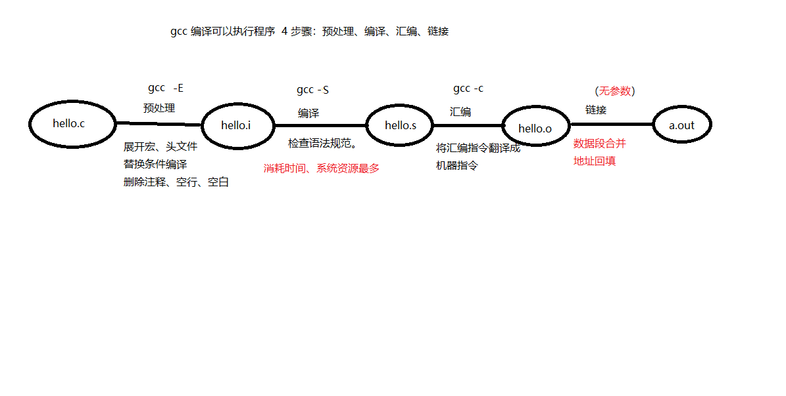

## 26P-gcc编译常用参数

当头文件和源码不在一个目录下时，需要指定头文件

下图是头文件和源码在同一个目录下

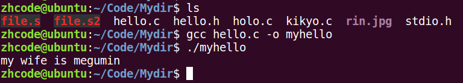

将hello.h放入新建的文件夹hellodir之后，编译会失败

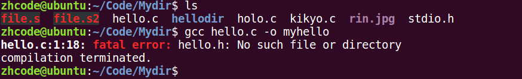

gcc -I ./hellodir hello.c -o hello

其中-I参数指定头文件所在位置，位置可以在编译文件前，也可以在后面

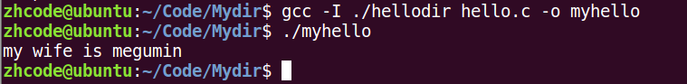

\-I 指定头文件所在目录位置

\-c 只做预处理，编译，汇编。得到二进制文件

\-g 编译时添加调试文件，用于gdb调试

\-Wall 显示所有警告信息

\-D 向程序中“动态”注册宏定义

\-l 指定动态库库名

\-L 指定动态库路径

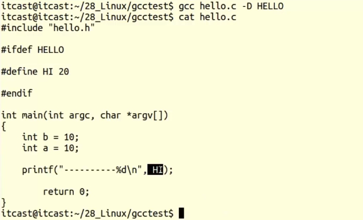

## 27P-午后复习

## 28P-动态库和静态库理论对比

静态库在文件中静态展开，所以有多少文件就展开多少次，非常吃内存，100M展开100次，就是1G，但是这样的好处就是静态加载的速度快

使用动态库会将动态库加载到内存，10个文件也只需要加载一次，然后这些文件用到库的时候临时去加载，速度慢一些，但是很省内存

动态库和静态库各有优劣，根据实际情况合理选用即可。

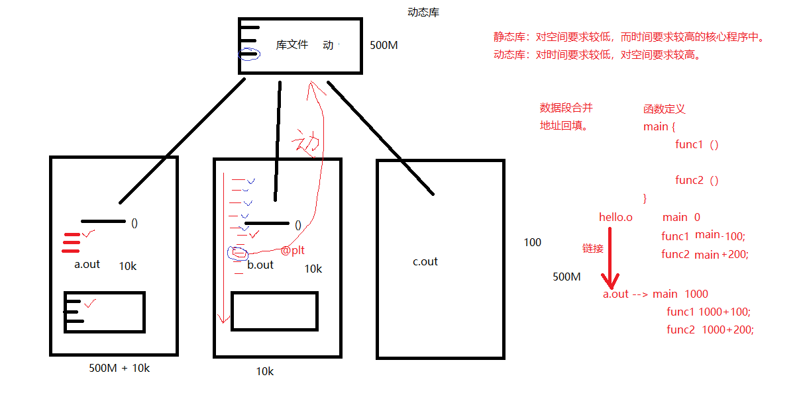

## 29P-静态库制作

静态库名字以lib开头，以.a结尾

例如：libmylib.a

静态库生成指令

ar rcs libmylib.a file1.o

步骤一：

写好源代码

步骤二：

编译源代码生成.o文件

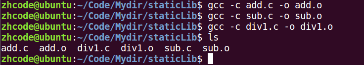

步骤三：

制作静态库

ar rcs libname.a file1.o file2.o …

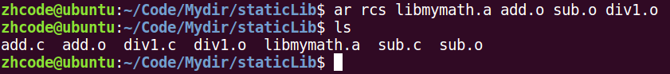

静态库的使用：

gcc test.c lib库名.a -o a.out

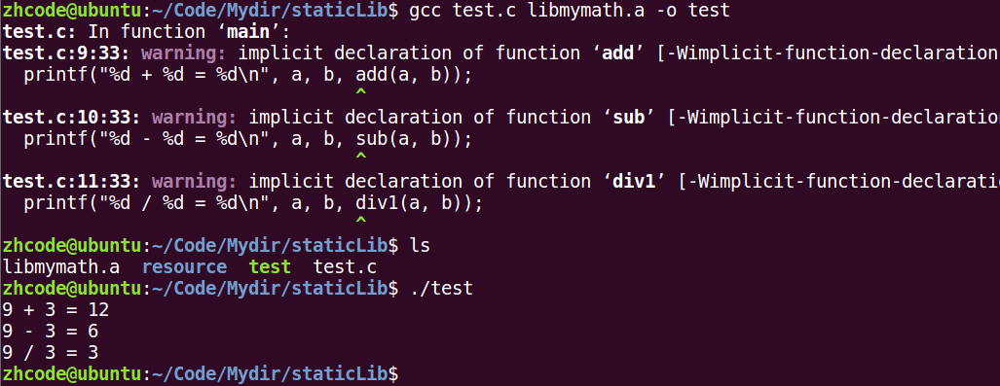

上图中，test.c直接使用了mymath库中的add，sub，div1函数，所以在编译时要导入静态库

编译时出现了函数未定义的警告，可以忽略，让系统生成默认的定义。

test.c只有296，然而test有8776，所以静态库使用时，是直接编译到文件里的。

## 30P-静态库使用及头文件对应

静态库制作的时候，不仅要制作静态库，还要制作该库的头文件（库内的函数声明），对于一个c语言程序，其在编译时，如果使用了一个函数，在使用其之前即无定义也无声明，则编译器会为其默认声明一个函数，在接下来碰到的时候会为其补充，这便是==隐式声明==，但如果该隐式声明的函数与实际库中的函数定义不一样，则会报错，若一样，则会有警告，因此需要将静态库中的函数单独在一个头文件中进行声明

上一节出现的警告，用编译器隐式声明来解决的

编译器只能隐式声明返回值为int的函数形式：int add(int ,int )；

如果函数不是返回的int，则隐式声明失效，会报错

在test.c中加入函数声明：

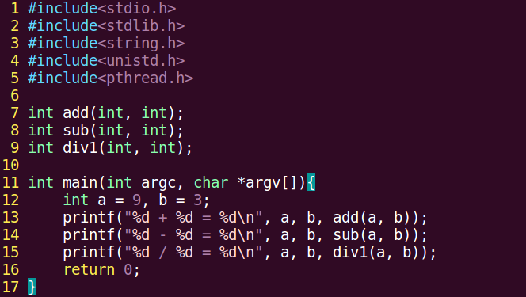

再次进行编译，就不会报错了：

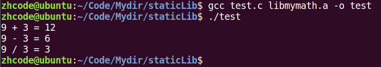

上面这个方法，需要库的使用者知道库里的函数，完事儿一个一个加到代码里，不太行

下面使用头文件的方法来加载静态库

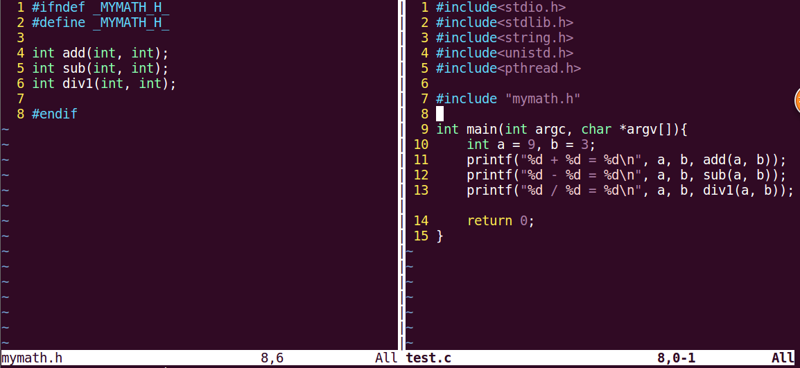

左边的define为头文件守卫，防止在代码中多次include头文件，多次展开静态库，带来的额外开销

这样也不会报错了，而且更加科学

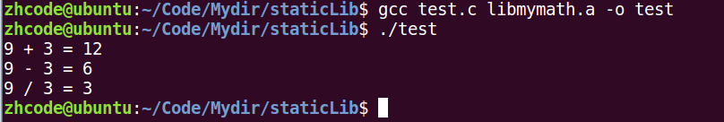

下面将静态库和头文件分别放至其他目录下

运行过程如下

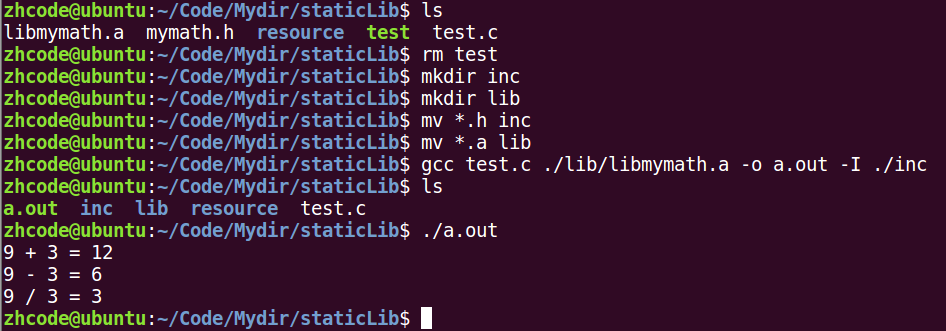

## 31P-动态库制作-生成与位置无关代码

写在源代码里的函数，相对main函数偏移是一定的，链接时，回填main函数地址之后，其他源代码里的函数也就得到了地址。

动态库里的函数会用一个@plt来标识，当动态库加载到内存时，再用加载进去的地址将@plt替换掉。

制作动态库的步骤

步骤一：生成位置无关的.o文件

gcc -c add.c -o add.o -fPIC

使用这个参数过后，生成的函数就和位置无关，挂上@plt标识，等待动态绑定

## 32P-动态库制作-演示

制作动态库的步骤

1.  生成位置无关的.o文件

gcc -c add.c -o add.o -fPIC

使用这个参数过后，生成的函数就和位置无关，挂上@plt标识，等待动态绑定

1.  

使用 gcc -shared制作动态库

gcc -shared -o lib库名.so add.o sub.o div.o

1.  

编译可执行程序时指定所使用的动态库。-l:指定库名 -L:指定库路径

gcc test.c -o a.out -l mymath -L ./lib

1.  运行可执行程序./a.out

过程演示：

步骤一：生成位置无关的.o文件

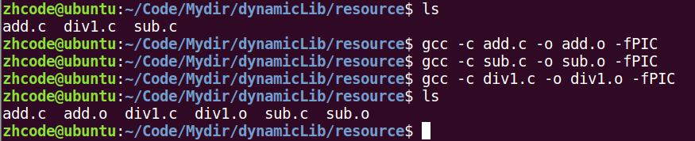

步骤二：制作动态库 gcc -shared -o lib库名.so add.o sub.o div.o

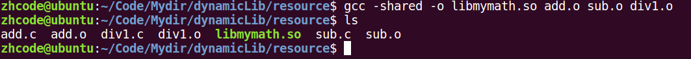

步骤三：编译程序

文件分布如下：动态库在lib目录下，头文件在inc目录下

下面编译文件

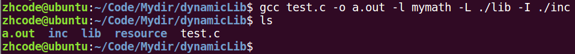

步骤四：执行文件，出错

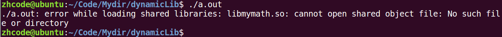

## 33P-动态库加载错误原因及解决方式

出错原因分析：

连接器： 工作于链接阶段，工作时需要 -l 和 -L

动态链接器： 工作于程序运行阶段，工作时需要提供动态库所在目录位置

指定动态库路径并使其生效，然后再执行文件

通过环境变量指定动态库所在位置：export LD_LIBRARY_PATH=动态库路径

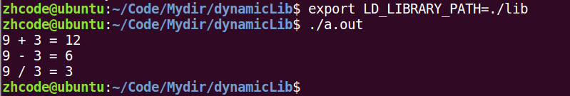

当关闭终端，再次执行a.out时，又报错。

这是因为，环境变量是进程的概念，关闭终端之后再打开，是两个进程，环境变量发生了变化。

要想永久生效，需要修改bash的配置文件：vi \~./bashrc

修改后要使配置文件立即生效：. .bashrc 或者 source .bashrc 或者重开终端让其自己加载

这下再执行a.out就不会报错了

## 34P-动态库加载错误原因及解决方式2

解决方式：

【1】 通过环境变量： export LD_LIBRARY_PATH=动态库路径

./a.out 成功！！！ （临时生效， 终端重启环境变量失效）

【2】 永久生效： 写入 终端配置文件。 .bashrc 建议使用绝对路径。

1) vi \~/.bashrc

2) 写入 export LD_LIBRARY_PATH=动态库路径 保存

3）. .bashrc/ source .bashrc / 重启 终端 ---\> 让修改后的.bashrc生效

4）./a.out 成功！！！

【3】 拷贝自定义动态库 到 /lib (标准C库所在目录位置)

【4】 配置文件法

1.  sudo vi /etc/ld.so.conf

2) 写入 动态库绝对路径 保存

1.  sudo ldconfig -v 使配置文件生效。

4）./a.out 成功！！！--- 使用 ldd a.out 查看

## 35P-扩展讲解-数据段合并

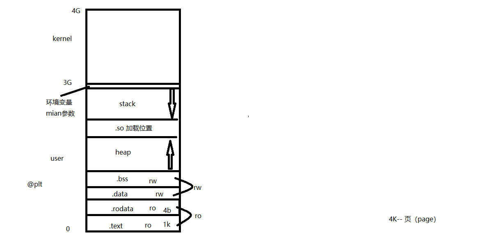

## 36P-总结

跳转到指定行：

1\. 88G （命令模式）

2\. :88 (末行模式)

跳转文件首：

gg （命令模式）

跳转文件尾：

G（命令模式）

自动格式化程序：

gg=G（命令模式）

大括号对应：

% （命令模式）

光标移至行首：

0 （命令模式）执行结束，工作模式不变。

光标移至行尾：

\$ （命令模式）执行结束，工作模式不变。

删除单个字符：

x （命令模式）执行结束，工作模式不变。

替换单个字符：

将待替换的字符用光标选中， r （命令模式），再按欲替换的字符

删除一个单词：

dw（命令模式）光标置于单词的首字母进行操作。

删除光标至行尾：

D 或者 d\$（命令模式）

删除光标至行首：

d0 （命令模式）

删除指定区域：

按 V （命令模式）切换为 “可视模式”，使用 hjkl挪移光标来选中待删除区域。 按 d 删除该区域数据。

删除指定1行：

在光标所在行，按 dd （命令模式）

删除指定N行：

在光标所待删除首行，按 Ndd （命令模式）

复制一行：

yy

粘贴：

p：向后、P：向前。

查找：

1\. 找 设想 内容：

命令模式下， 按 “/” 输入欲搜索关键字，回车。使用 n 检索下一个。

2\. 找 看到的内容：

命令模式下，将光标置于单词任意一个字符上，按 “\*”/ “\#”

单行替换：

将光标置于待替换行上， 进入末行模式，输入 :s /原数据/新数据

通篇替换：

末行模式， :%s /原数据/新数据/g g:不加，只替换每行首个。 sed

指定行的替换：

末行模式， :起始行号，终止行号s /原数据/新数据/g g:不加，只替换每行首个。

:29,35s /printf/println/g

撤销、反撤销：

u、ctrl+r（命令模式）

分屏：

sp：横屏分。 Ctrl+ww 切换。

vsp：竖屏分。Ctrl+ww 切换。

跳转至 man 手册：

将光标置于待查看函数单词上，使用 K（命令模式）跳转。 指定卷， nK

查看宏定义：

将光标置于待查看宏定义单词上，使用 [d 查看定义语句。

在末行模式执行shell命令：

:!命令 :! ls -l

\----------------------------------------------------------------

gcc编译：

4步骤： 预处理、编译、汇编、连接。

\-I： 指定头文件所在目录位置。

\-c： 只做预处理、编译、汇编。得到 二进制 文件！！！

\-g： 编译时添加调试语句。 主要支持 gdb 调试。

\-Wall： 显示所有警告信息。

\-D： 向程序中“动态”注册宏定义。 \#define NAME VALUE

静态库制作及使用步骤：

1\. 将 .c 生成 .o 文件

gcc -c add.c -o add.o

2\. 使用 ar 工具制作静态库

ar rcs lib库名.a add.o sub.o div.o

3\. 编译静态库到可执行文件中：

gcc test.c lib库名.a -o a.out

头文件守卫：防止头文件被重复包含

\#ifndef \_HEAD_H\_

\#define \_HEAD_H\_

......

\#endif

动态库制作及使用：

1\. 将 .c 生成 .o 文件， （生成与位置无关的代码 -fPIC）

gcc -c add.c -o add.o -fPIC

2\. 使用 gcc -shared 制作动态库

gcc -shared -o lib库名.so add.o sub.o div.o

3\. 编译可执行程序时，指定所使用的动态库。 -l：指定库名(去掉lib前缀和.so后缀) -L：指定库路径。

gcc test.c -o a.out -lmymath -L./lib

4\. 运行可以执行程序 ./a.out 出错！！！！ --- ldd a.out --\> "not found"

error while loading shared libraries: libxxx.so: cannot open shared object file: No such file or directory

原因：

链接器： 工作于链接阶段， 工作时需要 -l 和 -L

动态链接器： 工作于程序运行阶段，工作时需要提供动态库所在目录位置。

解决方式：

【1】 通过环境变量： export LD_LIBRARY_PATH=动态库路径

./a.out 成功！！！ （临时生效， 终端重启环境变量失效）

【2】 永久生效： 写入 终端配置文件。 .bashrc 建议使用绝对路径。

1) vi \~/.bashrc

2) 写入 export LD_LIBRARY_PATH=动态库路径 保存

3）. .bashrc/ source .bashrc / 重启 终端 ---\> 让修改后的.bashrc生效

4）./a.out 成功！！！

【3】 拷贝自定义动态库 到 /lib (标准C库所在目录位置)

【4】 配置文件法

1）sudo vi /etc/ld.so.conf

2) 写入 动态库绝对路径 保存

3）sudo ldconfig -v 使配置文件生效。

4）./a.out 成功！！！--- 使用 ldd a.out 查看