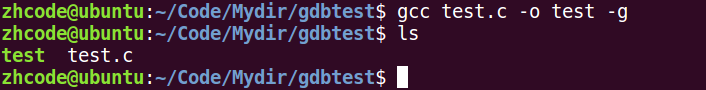
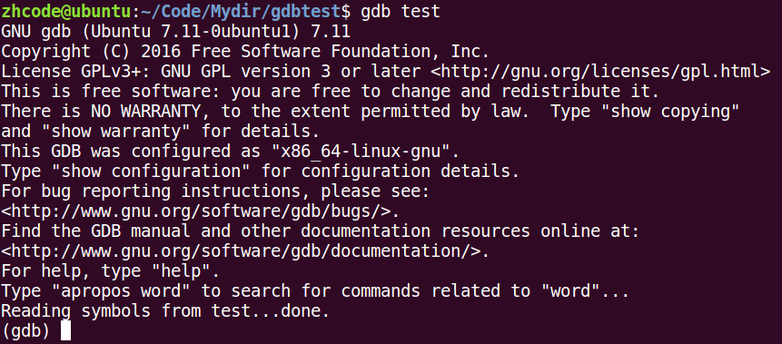
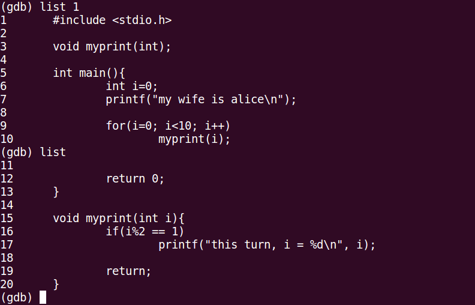
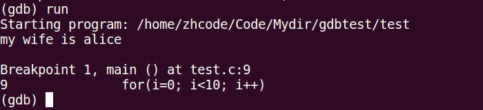
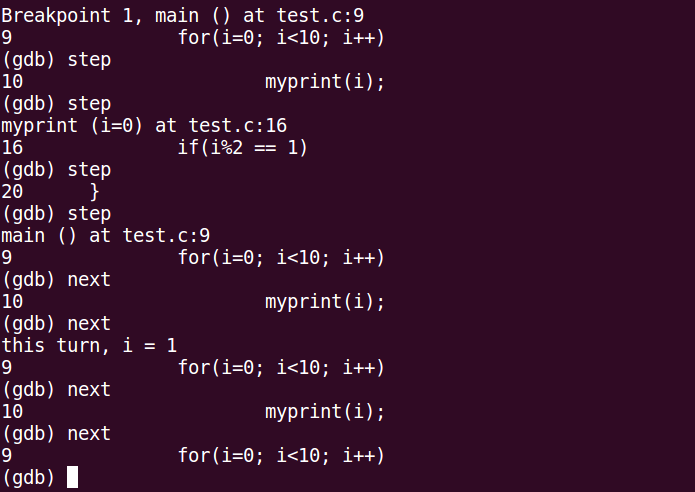
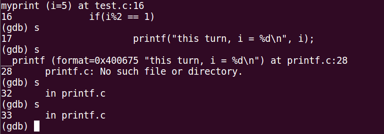
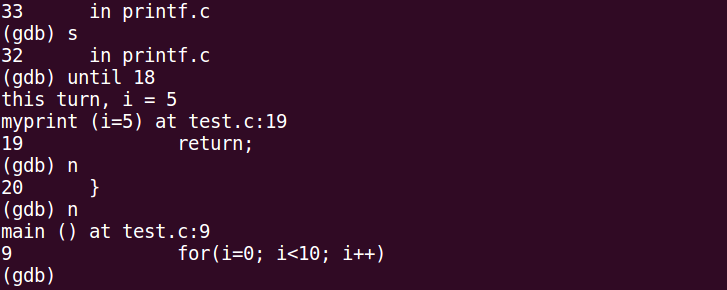
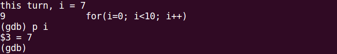
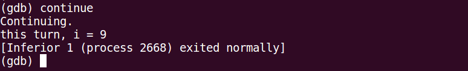

## 38P-gdb调试基础指令

使用gdb之前，要求对文件进行编译时增加-g参数，加了这个参数过后生成的编译文件会大一些，这是因为增加了gdb调试内容

gdb调试工具： 大前提：程序是你自己写的。 ---逻辑错误

基础指令：

\-g：使用该参数编译可以执行文件，得到调试表。

gdb ./a.out

list： list 1 列出源码。根据源码指定 行号设置断点。

b： b 20 在20行位置设置断点。

run/r: 运行程序

n/next: 下一条指令（会越过函数）

s/step: 下一条指令（会进入函数）

p/print：p i 查看变量的值。

continue：继续执行断点后续指令。

finish：结束当前函数调用。

quit：退出gdb当前调试。

其他指令：

run：使用run查找段错误出现位置。

set args： 设置main函数命令行参数 （在 start、run 之前）

run 字串1 字串2 ...: 设置main函数命令行参数

info b: 查看断点信息表

b 20 if i = 5： 设置条件断点。

ptype：查看变量类型。

bt：列出当前程序正存活着的栈帧。

frame： 根据栈帧编号，切换栈帧。

display：设置跟踪变量

undisplay：取消设置跟踪变量。 使用跟踪变量的编号。

gcc gdbtest.c -o a.out -g

gdb test 启动对test的调试

l/list n 从第n行开始显示程序，后续继续输入list/l，就可以显示后面的代码

break/b n 在第n行设置断点，断点那一行不会执行

run/r 运行程序

接下来按next/n/step/s继续向下执行

next/n :下一个，调用函数就跑

step/s :单步，会进入调用的函数

要注意的是，如果是系统函数，按s就出不来了，这时用until+行号直接执行到行号处

出不来的示例

使用until出来

print/p i 查看i变量的值

continue 直接运行到结束

## 39P-gdb调试其他指令

其他指令：

run：使用run查找段错误出现位置。

set args： 设置main函数命令行参数 （在 start、run 之前）

run 字串1 字串2 ...: 设置main函数命令行参数

info b: 查看断点信息表

b 20 if i = 5： 设置条件断点。

ptype：查看变量类型。

bt：列出当前程序正存活着的栈帧。

frame： 根据栈帧编号，切换栈帧。

display：设置跟踪变量

undisplay：取消设置跟踪变量。 使用跟踪变量的编号。

## 40P-gdb常见错误说明

没有符号被读取—编译时没加-g参数

file后面加使用-g编译的文件，可以不用退出，gdb直接读取后进行调试。