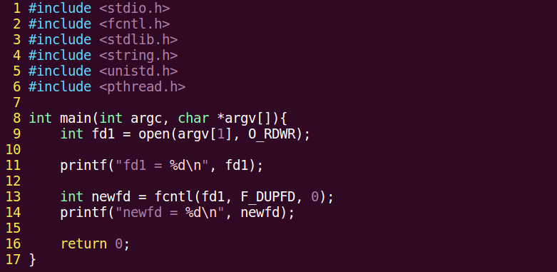

## 52P-read和write实现cp

read函数：

ssize_t read(int fd, void \*buf, size_t count);

参数：

fd：文件描述符

buf：存数据的缓冲区

count：缓冲区大小

返回值：

0：读到文件末尾。

成功； \> 0 读到的字节数。

失败： -1， 设置 errno

\-1： 并且 errno = EAGIN 或 EWOULDBLOCK, 说明不是read失败，而是read在以非阻塞方式读一个设备文件（网络文件），并且文件无数据。

write函数：

ssize_t write(int fd, const void \*buf, size_t count);

参数：

fd：文件描述符

buf：待写出数据的缓冲区

count：数据大小

返回值：

成功； 写入的字节数。

失败： -1， 设置 errno

用read和write实现一个copy函数：

编译一波

复制文件一波：

可以在复制函数里加入错误检测：

if(fd1 == -1){

perror(“open argv[1] error”);

exit(1);

}

错误处理函数： 与 errno 相关。

printf("xxx error: %d\\n", errno);

char \*strerror(int errnum);

printf("xxx error: %s\\n", strerror(errno));

void perror(const char \*s);

perror("open error");

用read/write实现的copy和fgetc/fputc实现的copy对比：

## 53P-系统调用和库函数比较—预读入缓输出

下面写两个文件拷贝函数，一个用read/write实现，一个用fputc/fgetc实现，比较速度

首先是fputc/fgetc

编译一波

运行一波

很快就拷贝完成了。

下面修改read那边的缓冲区，一次拷贝一个字符。

运行，如图：

速度缓慢。

原因分析：

read/write这块，每次写一个字节，会疯狂进行内核态和用户态的切换，所以非常耗时。

fgetc/fputc，有个缓冲区，4096，所以它并不是一个字节一个字节地写，内核和用户切换就比较少

预读入，缓输出机制。

所以系统函数并不是一定比库函数牛逼，能使用库函数的地方就使用库函数。

标准IO函数自带用户缓冲区，系统调用无用户级缓冲。系统缓冲区是都有的。

## 54P-文件描述符

文件描述符是指向一个文件结构体的指针

PCB进程控制块：本质 结构体。

成员：文件描述符表。

文件描述符：0/1/2/3/4。。。。/1023 表中可用的最小的。

0 - STDIN_FILENO

1 - STDOUT_FILENO

2 - STDERR_FILENO

## 55P-阻塞和非阻塞

阻塞、非阻塞： 是设备文件、网络文件的属性。

产生阻塞的场景。 读设备文件。读网络文件。（读常规文件无阻塞概念。）

/dev/tty -- 终端文件。

open("/dev/tty", O_RDWR\|O_NONBLOCK) --- 设置 /dev/tty 非阻塞状态。(默认为阻塞状态)

一个例子，从标准输入读，写到标准输出：

执行程序，就会发现程序在阻塞等待输入

下面是一段更改非阻塞读取终端的代码：

1.  \#include \<unistd.h\>
2.  \#include \<fcntl.h\>
3.  \#include \<stdlib.h\>
4.  \#include \<stdio.h\>
5.  \#include \<errno.h\>
6.  \#include \<string.h\>
7.  
8.  \#define MSG_TRY "try again\\n"
9.  \#define MSG_TIMEOUT "time out\\n"
10.  
11.  **int** main(**void**)
12.  {
13.  **char** buf[10];
14.  **int** fd, n, i;
15.  
16.  fd = open("/dev/tty", O_RDONLY\|O_NONBLOCK);
17.  **if**(fd \< 0){
18.  perror("open /dev/tty");
19.  exit(1);
20.  }
21.  printf("open /dev/tty ok... %d\\n", fd);
22.  
23.  **for** (i = 0; i \< 5; i++){
24.  n = read(fd, buf, 10);
25.  **if** (n \> 0) { //说明读到了东西
26.  **break**;
27.  }
28.  **if** (errno != EAGAIN) { //EWOULDBLOCK
29.  perror("read /dev/tty");
30.  exit(1);
31.  } **else** {
32.  write(STDOUT_FILENO, MSG_TRY, strlen(MSG_TRY));
33.  sleep(2);
34.  }
35.  }
36.  
37.  **if** (i == 5) {
38.  write(STDOUT_FILENO, MSG_TIMEOUT, strlen(MSG_TIMEOUT));
39.  } **else** {
40.  write(STDOUT_FILENO, buf, n);
41.  }
42.  
43.  close(fd);
44.  
45.  **return** 0;
46.  }

执行，如图所示：

## 56-fcntl改文件属性

fcntl用来改变一个【已经打开】的文件的 访问控制属性

重点掌握两个参数的使用， F_GETFL，F_SETFL

fcntl：

int (int fd, int cmd, ...)

fd 文件描述符

cmd 命令，决定了后续参数个数

int flgs = fcntl(fd, F_GETFL);

flgs \|= O_NONBLOCK

fcntl(fd, F_SETFL, flgs);

获取文件状态： F_GETFL

设置文件状态： F_SETFL

终端文件默认是阻塞读的，这里用fcntl将其更改为非阻塞读

1.  \#include \<unistd.h\>
2.  \#include \<fcntl.h\>
3.  \#include \<errno.h\>
4.  \#include \<stdio.h\>
5.  \#include \<stdlib.h\>
6.  \#include \<string.h\>
7.  
8.  \#define MSG_TRY "try again\\n"
9.  
10.  **int** main(**void**)
11.  {
12.  **char** buf[10];
13.  **int** flags, n;
14.  
15.  flags = fcntl(STDIN_FILENO, F_GETFL); //获取stdin属性信息
16.  **if**(flags == -1){
17.  perror("fcntl error");
18.  exit(1);
19.  }
20.  flags \|= O_NONBLOCK;
21.  **int** ret = fcntl(STDIN_FILENO, F_SETFL, flags);
22.  **if**(ret == -1){
23.  perror("fcntl error");
24.  exit(1);
25.  }
26.  
27.  tryagain:
28.  n = read(STDIN_FILENO, buf, 10);
29.  **if**(n \< 0){
30.  **if**(errno != EAGAIN){
31.  perror("read /dev/tty");
32.  exit(1);
33.  }
34.  sleep(3);
35.  write(STDOUT_FILENO, MSG_TRY, strlen(MSG_TRY));
36.  **goto** tryagain;
37.  }
38.  write(STDOUT_FILENO, buf, n);
39.  
40.  **return** 0;
41.  }

编译运行，结果如下：

可以看到，是非阻塞读取。

## 57P-午后回顾

## 58P-lseek函数

lseek函数：

off_t lseek(int fd, off_t offset, int whence);

参数：

fd：文件描述符

offset： 偏移量，就是将读写指针从whence指定位置向后偏移offset个单位

whence：起始偏移位置： SEEK_SET/SEEK_CUR/SEEK_END

返回值：

成功：较起始位置偏移量

失败：-1 errno

应用场景：

1\. 文件的“读”、“写”使用同一偏移位置。

2\. 使用lseek获取文件大小

3\. 使用lseek拓展文件大小：要想使文件大小真正拓展，必须引起IO操作。

使用 truncate 函数，直接拓展文件。 int ret = truncate("dict.cp", 250);

lseek示例，写一个句子到空白文件，完事调整光标位置，读取刚才写那个文件。

这个示例中，如果不调整光标位置，是读取不到内容的，因为读写指针在内容的末尾

代码如下：

1.  \#include \<stdio.h\>
2.  \#include \<stdlib.h\>
3.  \#include \<unistd.h\>
4.  \#include \<string.h\>
5.  \#include \<fcntl.h\>
6.  
7.  **int** main(**void**)
8.  {
9.  **int** fd, n;
10.  **char** msg[] = "It's a test for lseek\\n";
11.  **char** ch;
12.  
13.  fd = open("lseek.txt", O_RDWR\|O_CREAT, 0644);
14.  **if**(fd \< 0){
15.  perror("open lseek.txt error");
16.  exit(1);
17.  }
18.  
19.  write(fd, msg, strlen(msg)); //使用fd对打开的文件进行写操作，问价读写位置位于文件结尾处。
20.  
21.  lseek(fd, 0, SEEK_SET); //修改文件读写指针位置，位于文件开头。 注释该行会怎样呢？
22.  
23.  **while**((n = read(fd, \&ch, 1))){
24.  **if**(n \< 0){
25.  perror("read error");
26.  exit(1);
27.  }
28.  write(STDOUT_FILENO, \&ch, n); //将文件内容按字节读出，写出到屏幕
29.  }
30.  
31.  close(fd);
32.  
33.  **return** 0;
34.  }

编译运行，结果如图：

下面这个代码用lseek的偏移来读取文件大小：

编译执行，结果如下：

是没有问题的。

下面使用lseek将fcntl.c原本的698字节填充为800字节，差值102字节：

比起读取大小的代码，就改了个偏移量

编译执行，如下：

下面再用ls命令查看fcntl.c，问题出来了：

它的大小不是800.

原因是，要使文件大小真正拓展，必须引起IO操作。

修改后的扩展文件代码如下：

编译运行，如下：

打开fcntl.c查看，如下：

简单小结一下：

对于写文件再读取那个例子，由于文件写完之后未关闭，读写指针在文件末尾，所以不调节指针，直接读取不到内容。

lseek读取的文件大小总是相对文件头部而言。

用lseek读取文件大小实际用的是读写指针初末位置的偏移差，一个新开文件，读写指针初位置都在文件开头。如果用这个来扩展文件大小，必须引起IO才行，于是就至少要写入一个字符。上面代码出现lseek返回799，ls查看为800的原因是，lseek读取到偏移差的时候，还没有写入最后的‘\$’符号.

末尾那一大堆\^@，是文件空洞，如果自己写进去的也想保持队形，就写入“\\0”。

拓展文件直接使用truncate，简单粗暴：

使用 truncate 函数，直接拓展文件。 int ret = truncate("dict.cp", 250);

## 59P-传入传出参数

传入参数：

1\. 指针作为函数参数。

2\. 同常有const关键字修饰。

3\. 指针指向有效区域， 在函数内部做读操作。

传出参数：

1\. 指针作为函数参数。

2\. 在函数调用之前，指针指向的空间可以无意义，但必须有效。

3\. 在函数内部，做写操作。

4。函数调用结束后，充当函数返回值。

传入传出参数：

1\. 指针作为函数参数。

2\. 在函数调用之前，指针指向的空间有实际意义。

3\. 在函数内部，先做读操作，后做写操作。

4\. 函数调用结束后，充当函数返回值。

## 60P-目录项和inode

一个文件主要由两部分组成，dentry(目录项)和inode

inode本质是结构体，存储文件的属性信息，如：权限、类型、大小、时间、用户、盘快位置…

也叫做文件属性管理结构，大多数的inode都存储在磁盘上。

少量常用、近期使用的inode会被缓存到内存中。

所谓的删除文件，就是删除inode，但是数据其实还是在硬盘上，以后会覆盖掉。

## 61P-stat函数

获取文件属性，（从inode结构体中获取）

stat/lstat 函数：

int stat(const char \*path, struct stat \*buf);

参数：

path： 文件路径

buf：（传出参数） 存放文件属性，inode结构体指针。

返回值：

成功： 0

失败： -1 errno

获取文件大小： buf.st_size

获取文件类型： buf.st_mode

获取文件权限： buf.st_mode

符号穿透：stat会。lstat不会。

下面这个例子是获取文件大小的正规军解法，用stat：

编译运行，并查看mystat.c文件的大小，如下：

## 62P-lstat和stat

用stat查看文件类型，代码如下：

编译运行，查看一波mystat.c文件：

stat会拿到符号链接指向那个文件或目录的属性。

不想穿透符号就用lstat

## 63P-传出参数当返回值

其实就是传出参数在函数中被改变，可以用来传出。而且传出参数数量不限，比单纯的返回值更灵活。

## 64P-link和Unlink隐式回收

硬链接数就是dentry数目

link就是用来创建硬链接的

link可以用来实现mv命令

函数原型：

int link(const char \*oldpath, const char \*newpath)

用这个来实现mv，用oldpath来创建newpath，完事儿删除oldpath就行。

删除一个链接 int unlink(const char \*pathname)

unlink是删除一个文件的目录项dentry，使硬链接数-1

unlink函数的特征：清除文件时，如果文件的硬链接数到0了，没有dentry对应，但该文件仍不会马上被释放，要等到所有打开文件的进程关闭该文件，系统才会挑时间将该文件释放掉。

下面用一段代码来验证unlink是删除dentry：

1.  /\*
2.  \*unlink函数是删除一个dentry
3.  \*/
4.  \#include \<unistd.h\>
5.  \#include \<fcntl.h\>
6.  \#include \<stdlib.h\>
7.  \#include \<string.h\>
8.  \#include \<stdio.h\>
9.  
10.  
11.  **int** main(**void**)
12.  {
13.  **int** fd, ret;
14.  **char** \*p = "test of unlink\\n";
15.  **char** \*p2 = "after write something.\\n";
16.  
17.  fd = open("temp.txt", O_RDWR\|O_CREAT\|O_TRUNC, 0644);
18.  **if**(fd \< 0){
19.  perror("open temp error");
20.  exit(1);
21.  }
22.  
23.  ret = write(fd, p, strlen(p));
24.  **if** (ret == -1) {
25.  perror("-----write error");
26.  }
27.  
28.  printf("hi! I'm printf\\n");
29.  ret = write(fd, p2, strlen(p2));
30.  **if** (ret == -1) {
31.  perror("-----write error");
32.  }
33.  
34.  printf("Enter anykey continue\\n");
35.  getchar();
36.  
37.  ret = unlink("temp.txt"); //具备了被释放的条件
38.  **if**(ret \< 0){
39.  perror("unlink error");
40.  exit(1);
41.  }
42.  
43.  close(fd);
44.  
45.  **return** 0;
46.  }

编译程序并运行，程序阻塞，此时打开新终端查看临时文件temp.c如下：

可以看到，临时文件没有被删除，这是因为当前进程没结束。

输入字符使当前进程结束后，temp.txt就不见了

下面开始搞事，在程序中加入段错误成分，段错误在unlink之前，由于发生段错误，程序后续删除temp.txt的dentry部分就不会再执行，temp.txt就保留了下来，这是不科学的。

解决办法是检测fd有效性后，立即释放temp.txt，由于进程未结束，虽然temp.txt的硬链接数已经为0，但还不会立即释放，仍然存在，要等到程序执行完才会释放。这样就能避免程序出错导致临时文件保留下来。

因为文件创建后，硬链接数立马减为0，即使程序异常退出，这个文件也会被清理掉。这时候的内容是写在内核空间的缓冲区。

修改后代码如下：

1.  /\*
2.  \*unlink函数是删除一个dentry
3.  \*/
4.  \#include \<unistd.h\>
5.  \#include \<fcntl.h\>
6.  \#include \<stdlib.h\>
7.  \#include \<string.h\>
8.  \#include \<stdio.h\>
9.  
10.  
11.  **int** main(**void**)
12.  {
13.  **int** fd, ret;
14.  **char** \*p = "test of unlink\\n";
15.  **char** \*p2 = "after write something.\\n";
16.  
17.  fd = open("temp.txt", O_RDWR\|O_CREAT\|O_TRUNC, 0644);
18.  **if**(fd \< 0){
19.  perror("open temp error");
20.  exit(1);
21.  }
22.  
23.  ret = unlink("temp.txt"); //具备了被释放的条件
24.  **if**(ret \< 0){
25.  perror("unlink error");
26.  exit(1);
27.  }
28.  
29.  ret = write(fd, p, strlen(p));
30.  **if** (ret == -1) {
31.  perror("-----write error");
32.  }
33.  
34.  printf("hi! I'm printf\\n");
35.  ret = write(fd, p2, strlen(p2));
36.  **if** (ret == -1) {
37.  perror("-----write error");
38.  }
39.  
40.  printf("Enter anykey continue\\n");
41.  getchar();
42.  
43.  close(fd);
44.  
45.  **return** 0;
46.  }

隐式回收：

当进程结束运行时，所有进程打开的文件会被关闭，申请的内存空间会被释放。系统的这一特性称之为隐式回收系统资源。

比如上面那个程序，要是没有在程序中关闭文件描述符，没有隐式回收的话，这个文件描述符会保留，多次出现这种情况会导致系统文件描述符耗尽。所以隐式回收会在程序结束时收回它打开的文件使用的文件描述符。

## 65P-文件目录rwx权限差异

vi 目录

会得到目录项的列表

## 66P-目录操作函数

目录操作函数：

DIR \* opendir(char \*name);

int closedir(DIR \*dp);

struct dirent \*readdir(DIR \* dp);

struct dirent {

inode

char dname[256];

}

没有写目录操作，因为目录写操作就是创建文件。可以用touch

下面用目录操作函数实现一个ls操作：

编译执行，如下：

要隐藏这个.和..的话，在输出文件名的时候判定一下，只输出不是.和..的就行了

## 67P-总结

open函数：

int open(char \*pathname, int flags) \#include \<unistd.h\>

参数：

pathname: 欲打开的文件路径名

flags：文件打开方式： \#include \<fcntl.h\>

O_RDONLY\|O_WRONLY\|O_RDWR O_CREAT\|O_APPEND\|O_TRUNC\|O_EXCL\|O_NONBLOCK ....

返回值：

成功： 打开文件所得到对应的 文件描述符（整数）

失败： -1， 设置errno

int open(char \*pathname, int flags， mode_t mode) 123 775

参数：

pathname: 欲打开的文件路径名

flags：文件打开方式： O_RDONLY\|O_WRONLY\|O_RDWR O_CREAT\|O_APPEND\|O_TRUNC\|O_EXCL\|O_NONBLOCK ....

mode: 参数3使用的前提， 参2指定了 O_CREAT。 取值8进制数，用来描述文件的 访问权限。 rwx 0664

创建文件最终权限 = mode & \~umask

返回值：

成功： 打开文件所得到对应的 文件描述符（整数）

失败： -1， 设置errno

close函数：

int close(int fd);

错误处理函数： 与 errno 相关。

printf("xxx error: %d\\n", errno);

char \*strerror(int errnum);

printf("xxx error: %s\\n", strerror(errno));

void perror(const char \*s);

perror("open error");

read函数：

ssize_t read(int fd, void \*buf, size_t count);

参数：

fd：文件描述符

buf：存数据的缓冲区

count：缓冲区大小

返回值：

0：读到文件末尾。

成功； \> 0 读到的字节数。

失败： -1， 设置 errno

\-1： 并且 errno = EAGIN 或 EWOULDBLOCK, 说明不是read失败，而是read在以非阻塞方式读一个设备文件（网络文件），并且文件无数据。

write函数：

ssize_t write(int fd, const void \*buf, size_t count);

参数：

fd：文件描述符

buf：待写出数据的缓冲区

count：数据大小

返回值：

成功； 写入的字节数。

失败： -1， 设置 errno

文件描述符：

PCB进程控制块：本质 结构体。

成员：文件描述符表。

文件描述符：0/1/2/3/4。。。。/1023 表中可用的最小的。

0 - STDIN_FILENO

1 - STDOUT_FILENO

2 - STDERR_FILENO

阻塞、非阻塞： 是设备文件、网络文件的属性。

产生阻塞的场景。 读设备文件。读网络文件。（读常规文件无阻塞概念。）

/dev/tty -- 终端文件。

open("/dev/tty", O_RDWR\|O_NONBLOCK) --- 设置 /dev/tty 非阻塞状态。(默认为阻塞状态)

fcntl：

int (int fd, int cmd, ...)

int flgs = fcntl(fd, F_GETFL);

flgs \|= O_NONBLOCK

fcntl(fd, F_SETFL, flgs);

获取文件状态： F_GETFL

设置文件状态： F_SETFL

lseek函数：

off_t lseek(int fd, off_t offset, int whence);

参数：

fd：文件描述符

offset： 偏移量

whence：起始偏移位置： SEEK_SET/SEEK_CUR/SEEK_END

返回值：

成功：较起始位置偏移量

失败：-1 errno

应用场景：

1\. 文件的“读”、“写”使用同一偏移位置。

2\. 使用lseek获取文件大小

3\. 使用lseek拓展文件大小：要想使文件大小真正拓展，必须引起IO操作。

使用 truncate 函数，直接拓展文件。 int ret = truncate("dict.cp", 250);

传入参数：

1\. 指针作为函数参数。

2\. 同常有const关键字修饰。

3\. 指针指向有效区域， 在函数内部做读操作。

传出参数：

1\. 指针作为函数参数。

2\. 在函数调用之前，指针指向的空间可以无意义，但必须有效。

3\. 在函数内部，做写操作。

4。函数调用结束后，充当函数返回值。

传入传出参数：

1\. 指针作为函数参数。

2\. 在函数调用之前，指针指向的空间有实际意义。

3\. 在函数内部，先做读操作，后做写操作。

4\. 函数调用结束后，充当函数返回值。

void aaa();

int aaa(int \*p, struct stat \*p2, strcut student \*p3);

bbb()

{

aaa();

}

stat/lstat 函数：

int stat(const char \*path, struct stat \*buf);

参数：

path： 文件路径

buf：（传出参数） 存放文件属性。

返回值：

成功： 0

失败： -1 errno

获取文件大小： buf.st_size

获取文件类型： buf.st_mode

获取文件权限： buf.st_mode

符号穿透：stat会。lstat不会。

link/unlink:

隐式回收。

目录操作函数：

DIR \* opendir(char \*name);

int closedir(DIR \*dp);

struct dirent \*readdir(DIR \* dp);

struct dirent {

inode

char dname[256];

}

## 68P-复习

应用程序的系统调用过程

应用程序-\>标库函数-\>系统调用-\>驱动-\>硬件

## 69P-递归遍历目录思路分析

任务需求：使用opendir closedir readdir stat实现一个递归遍历目录的程序

输入一个指定目录，默认为当前目录。递归列出目录中的文件，同时显示文件大小。

思路分析

递归遍历目录：ls-R.c

1\. 判断命令行参数，获取用户要查询的目录名。 int argc, char \*argv[1]

argc == 1 --\> ./

2\. 判断用户指定的是否是目录。 stat S_ISDIR(); --\> 封装函数 isFile() { }

3\. 读目录： read_dir() {

opendir（dir）

while （readdir（））{

普通文件，直接打印

目录：

拼接目录访问绝对路径。sprintf(path, "%s/%s", dir, d_name)

递归调用自己。--》 opendir（path） readdir closedir

}

closedir（）

}

read_dir() --\> isFile() ---\> read_dir()

## 70P-递归遍历目录代码预览

1.  \#include \<stdio.h\>
2.  \#include \<stdlib.h\>
3.  \#include \<string.h\>
4.  \#include \<unistd.h\>
5.  \#include \<sys/stat.h\>
6.  \#include \<dirent.h\>
7.  \#include \<pthread.h\>
8.  
9.  **void** isFile(**char** \*name);
10.  
11.  // 打开目录读取,处理目录
12.  **void** read_dir(**char** \*dir, **void** (\*func)(**char** \*))
13.  {
14.  **char** path[256];
15.  DIR \*dp;
16.  **struct** dirent \*sdp;
17.  
18.  dp = opendir(dir);
19.  **if** (dp == NULL) {
20.  perror("opendir error");
21.  **return**;
22.  }
23.  // 读取目录项
24.  **while**((sdp = readdir(dp)) != NULL) {
25.  **if** (strcmp(sdp-\>d_name, ".") == 0 \|\| strcmp(sdp-\>d_name, "..") == 0) {
26.  **continue**;
27.  }
28.  //fprintf();
29.  // 目录项本身不可访问, 拼接. 目录/目录项
30.  sprintf(path, "%s/%s", dir, sdp-\>d_name);
31.  
32.  // 判断文件类型,目录递归进入,文件显示名字/大小
33.  //isFile(path);
34.  (\*func)(path);
35.  }
36.  
37.  closedir(dp);
38.  
39.  **return** ;
40.  }
41.  
42.  **void** isFile(**char** \*name)
43.  {
44.  **int** ret = 0;
45.  **struct** stat sb;
46.  
47.  // 获取文件属性, 判断文件类型
48.  ret = stat(name, \&sb);
49.  **if** (ret == -1) {
50.  perror("stat error");
51.  **return** ;
52.  }
53.  // 是目录文件
54.  **if** (S_ISDIR(sb.st_mode)) {
55.  read_dir(name, isFile);
56.  }
57.  // 是普通文件, 显示名字/大小
58.  printf("%10s\\t\\t%ld\\n", name, sb.st_size);
59.  
60.  **return**;
61.  }
62.  
63.  
64.  **int** main(**int** argc, **char** \*argv[])
65.  {
66.  // 判断命令行参数
67.  **if** (argc == 1) {
68.  isFile(".");
69.  } **else** {
70.  isFile(argv[1]);
71.  }
72.  
73.  **return** 0;
74.  }

## 71P-递归遍历目录实现

先写个简易版的，可以判定文件，读取文件大小：

1.  \#include \<stdio.h\>
2.  \#include \<stdlib.h\>
3.  \#include \<string.h\>
4.  \#include \<unistd.h\>
5.  \#include \<pthread.h\>
6.  \#include \<sys/stat.h\>
7.  
8.  **void** isFile(**char** \*name){
9.  **int** ret = 0;
10.  **struct** stat sb;
11.  
12.  ret = stat(name, \&sb);
13.  **if**(ret == -1){
14.  perror("stat error");
15.  **return**;
16.  }
17.  
18.  **if**(S_ISDIR(sb.st_mode)){
19.  
20.  }
21.  printf("%s\\t%ld\\n", name, sb.st_size);
22.  
23.  **return**;
24.  }
25.  **int** main(**int** argc, **char** \*argv[]){
26.  **if**(argc == 1) {
27.  isFile(".");
28.  }
29.  **else** {
30.  isFile(argv[1]);
31.  }
32.  
33.  **return** 0;
34.  }

编译运行，并查看一个文件，如下：

下面完善功能，把对目录的递归处理补全，如下：

1.  \#include \<stdio.h\>
2.  \#include \<stdlib.h\>
3.  \#include \<string.h\>
4.  \#include \<unistd.h\>
5.  \#include \<sys/stat.h\>
6.  \#include \<dirent.h\>
7.  \#include \<pthread.h\>
8.  
9.  **void** isFile(**char** \*name);
10.  
11.  // 打开目录读取,处理目录
12.  **void** read_dir(**char** \*dir, **void** (\*func)(**char** \*))
13.  {
14.  **char** path[256];
15.  DIR \*dp;
16.  **struct** dirent \*sdp;
17.  
18.  dp = opendir(dir);
19.  **if** (dp == NULL) {
20.  perror("opendir error");
21.  **return**;
22.  }
23.  // 读取目录项
24.  **while**((sdp = readdir(dp)) != NULL) {
25.  **if** (strcmp(sdp-\>d_name, ".") == 0 \|\| strcmp(sdp-\>d_name, "..") == 0) {
26.  **continue**;
27.  }
28.  //fprintf();
29.  // 目录项本身不可访问, 拼接. 目录/目录项
30.  sprintf(path, "%s/%s", dir, sdp-\>d_name);
31.  
32.  // 判断文件类型,目录递归进入,文件显示名字/大小
33.  //isFile(path);
34.  (\*func)(path);
35.  }
36.  
37.  closedir(dp);
38.  
39.  **return** ;
40.  }
41.  
42.  **void** isFile(**char** \*name)
43.  {
44.  **int** ret = 0;
45.  **struct** stat sb;
46.  
47.  // 获取文件属性, 判断文件类型
48.  ret = stat(name, \&sb);
49.  **if** (ret == -1) {
50.  perror("stat error");
51.  **return** ;
52.  }
53.  // 是目录文件
54.  **if** (S_ISDIR(sb.st_mode)) {
55.  read_dir(name, isFile);
56.  }
57.  // 是普通文件, 显示名字/大小
58.  printf("%10s\\t\\t%ld\\n", name, sb.st_size);
59.  
60.  **return**;
61.  }
62.  
63.  
64.  **int** main(**int** argc, **char** \*argv[])
65.  {
66.  // 判断命令行参数
67.  **if** (argc == 1) {
68.  isFile(".");
69.  } **else** {
70.  isFile(argv[1]);
71.  }
72.  
73.  **return** 0;
74.  }

这里和视频里有一点差异就是，这里用的回调函数来实现对目录中目录项的处理，视频里直接调用的isFile，差别不大。

编译运行，如下：

如图，基本达到了ls-r的功能。

## 72P-递归遍历目录总结

递归改回调，问题不大

## 73P-dup和dup2

用来做重定向，本质就是复制文件描述符：

dup 和 dup2：

int dup(int oldfd); 文件描述符复制。

oldfd: 已有文件描述符

返回：新文件描述符，这个描述符和oldfd指向相同内容。

int dup2(int oldfd, int newfd); 文件描述符复制，oldfd拷贝给newfd。返回newfd

一个小例子，给一个旧的文件描述符，返回一个新文件描述符：

编译运行，如下：

dup基本就这样了，后续使用也就起个保存作用。

下面讲dup2（dupto）：

下面这个例子，将一个已有文件描述符fd1复制给另一个文件描述符fd2，然后用fd2修改fd1指向的文件：

编译运行，如下图：

下面查看hello.c

没错，惠惠是我老婆。

上面那个例子，fd1是打开hello.c的文件描述符，fd2是打开hello2.c的文件描述符

用dup2将fd1复制给了fd2，于是在对fd2指向的文件进行写操作时，实际上就是对fd1指向的hello.c进行写操作。

这里需要注意一个问题，由于hello.c和hello2.c都是空文件，所以直接写进去没关系。但如果hello.c是非空的，写进去的内容默认从文件头部开始写，会覆盖原有内容。

dup2也可以用于标准输入输出的重定向。

下面这个例子，将输出到STDOUT的内容重定向到文件里：

编译执行，如下：

这个程序，将fd1的内容复制给了fd2，使得原来指向hello2.c的fd2也指向了hello.c

并通过fd2向hello.c里写入了惠惠是我老婆。完事儿将标准输出重定向至fd1，就是将要显示在标准输出的内容，写入了fd1指向的文件，就是hello.c中

这里有一点和上面程序不同，就是hello.c是处于打开状态的，连续写入两段话，写入小忍是我老婆的时候，读写指针在这句话末尾，就不会覆盖惠惠是我老婆这句话，所以，都是我老婆，没有问题的。

这里再强调一下，打开一个文件，读写指针默认在文件头，如果文件本身有内容，直接写入会覆盖原有内容。

## 74P-fcntl实现dup描述符

fcntl 函数实现 dup：

int fcntl(int fd, int cmd, ....)

cmd: F_DUPFD

参3: 被占用的，返回最小可用的。

未被占用的， 返回=该值的文件描述符。

下面这个代码用fcntl来实现描述符的复制：

对于fcntl中的参数0，这个表示0被占用，fcntl使用文件描述符表中的最小文件描述符返回

假设传入0，传一个7，且7未被占用，则会返回7

所以这个参数可以这样理解，你传入一个文件描述符k，如果k没被占用，则直接用k复制fd1的内容。如果k被占用，则返回描述符表中最小可用描述符，也就是自己指定一个一志愿，如果行，就返回这个。如果不行，国家给你分配一个最小的。

编译执行，如下：

如图可知，原来指向hello.c的文件描述符是3，复制了一个，新的文件描述符4也指向hello.c

下面这个例子，用fcntl复制2次文件描述符，第一次使用默认分配，就是传0，第二次使用自己选定文件描述符复制，完事儿向文件里写入内容

编译执行，结果如下：

可见上述说明都是没有问题的。