## 76P-进程和程序以及CPU相关

进程：

程序：死的。只占用磁盘空间。 ——剧本。

进程；活的。运行起来的程序。占用内存、cpu等系统资源。 ——戏。

并发和并行：并行是宏观上并发，微观上串行

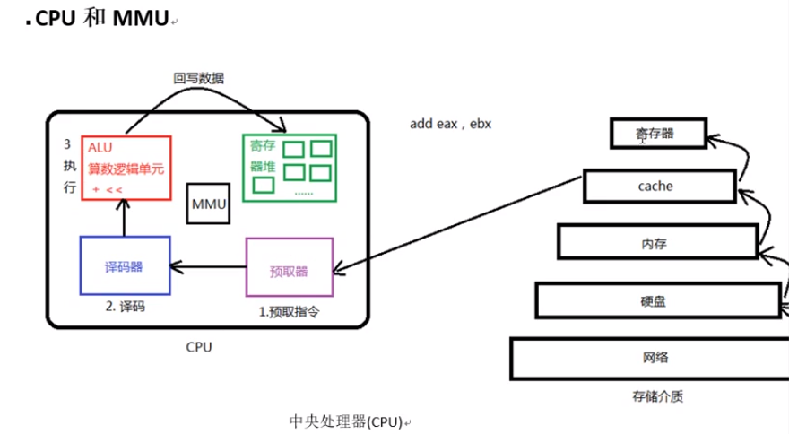

## 77P-虚拟内存和物理内存映射关系

## 78P-pcb进程控制块

PCB进程控制块：

进程id

文件描述符表

进程状态： 初始态、就绪态、运行态、挂起态、终止态。

进程工作目录位置

\*umask掩码 （进程的概念）

信号相关信息资源。

用户id和组id

ps aux 返回结果里，第二列是进程id

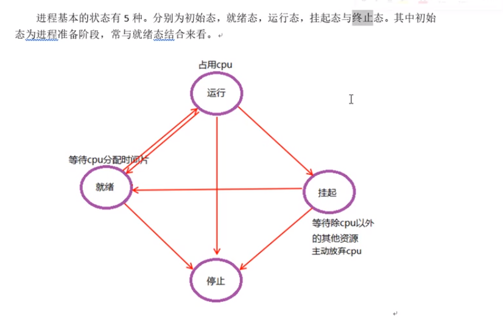

## 79P-环境变量

echo \$PATH 查看环境变量

path环境变量里记录了一系列的值，当运行一个可执行文件时，系统会去环境变量记录的位置里查找这个文件并执行。

echo \$TERM 查看终端

echo \$LANG 查看语言

env 查看所有环境变量

## 80P-fork函数原理

fork函数：

pid_t fork(void)

创建子进程。父子进程各自返回。父进程返回子进程pid。 子进程返回 0.

getpid();getppid();

循环创建N个子进程模型。 每个子进程标识自己的身份。

父子进程相同：

刚fork后。 data段、text段、堆、栈、环境变量、全局变量、宿主目录位置、进程工作目录位置、信号处理方式

父子进程不同：

进程id、返回值、各自的父进程、进程创建时间、闹钟、未决信号集

父子进程共享：

读时共享、写时复制。———————— 全局变量。

1.  文件描述符 2. mmap映射区。

## 81P-fork创建子进程

下面是一个fork函数的例子，代码如下：

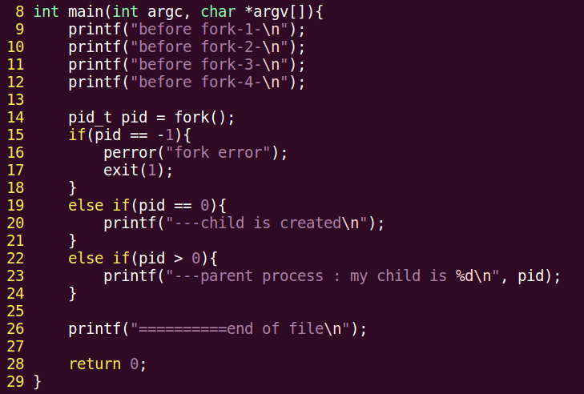

编译运行，如下：

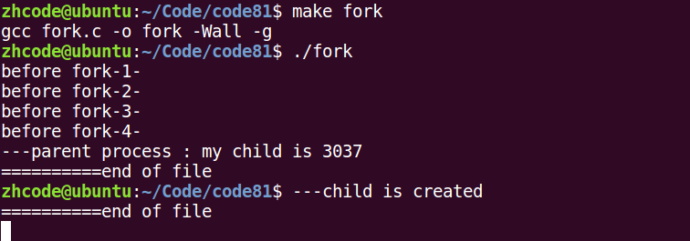

关于这里为啥终端提示符和输出信息混在了一起，循环创建多个子进程（后面第二节）那一节会进行分析，现在先不用管。

fork之前的代码，父子进程都有，但是只有父进程执行了，子进程没有执行，fork之后的代码，父子进程都有机会执行。

两个函数：

pid_t getpid() 获取当前进程id

pid_t getppid() 获取当前进程的父进程id

## 82P-getpid和getppid

来个小例子，就是在上面一个fork例子里面加入这两个函数：

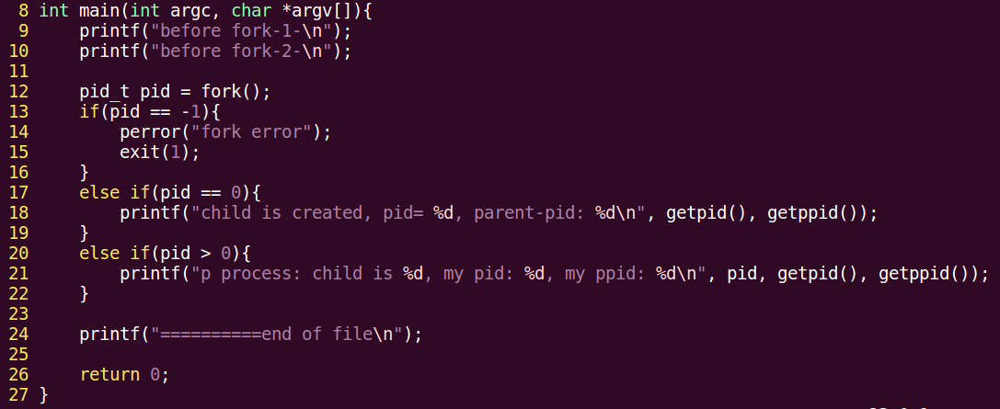

编译运行，如下：

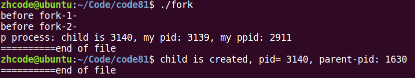

这里，问题出现了。视频里，父进程子进程id能相互对应上，但这里没有对应上。

先看图里子进程的输出：

子进程pid=3140， 父进程pid=1630

再看图里父进程的输出：

子进程pid=3140， 自己进程pid=3139， 父进程pid=2911

这很有问题，3139作为父进程创建了3140这个子进程，然而3140这个子进程说1630是它的父进程。这里感受到了一股老王的气息。

于是，为了搞清楚这是不是个例，再运行了几次程序，结果如下：

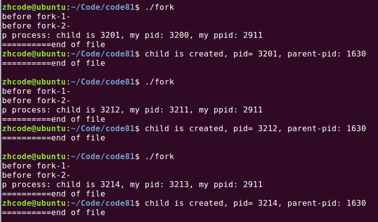

从这个图可以看到，所有父进程的子进程pid=父进程pid+1，而子进程的父进程均为1630，这个1630多次出现，显然不是偶然。

这里做出一个推测，假设图中所有进程都是父进程先结束，导致子进程成孤儿，于是回收到孤儿院，看起来合情合理。

修改一下代码，给父进程增加一个等待命令，这样能保证子进程完成时，父进程处于执行状态，子进程就不会成孤儿。同时，这里也解决了终端提示符和输出混在一起的问题，这个问题会在下一节分析，不用管，代码如下：

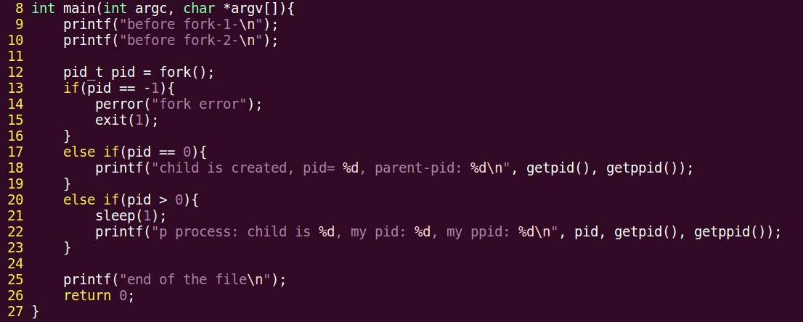

编译运行，如下：

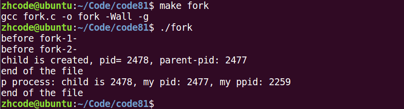

2477子进程是2478,2478父进程是2477，没有问题。

错怪1630了，它不是老王。

再看，父进程的父进程pid=2259，查看一下这是个啥：

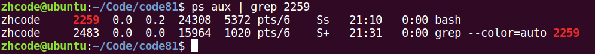

如图，这是bash，其实我们写的所有进程都是bash的子进程

那么疯狂收孤儿的1630呢，如下：

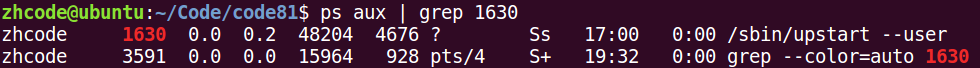

这里的upstart，就是进程孤儿院。

## 83P-循环创建多个子进程

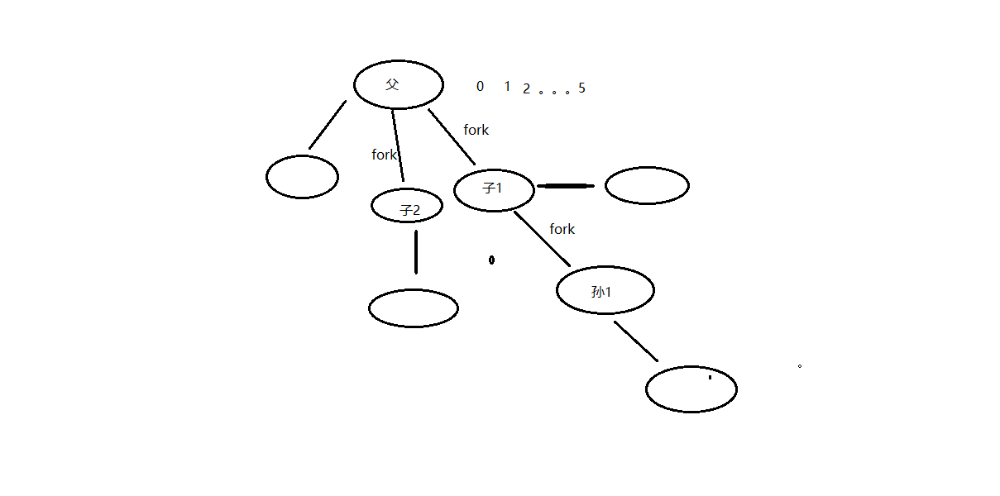

所以，直接用个for循环是要出事情的，因为子进程也会fork新的进程

这里，对调用fork的进程进行判定，只让父进程fork新的进程就行，代码如下：

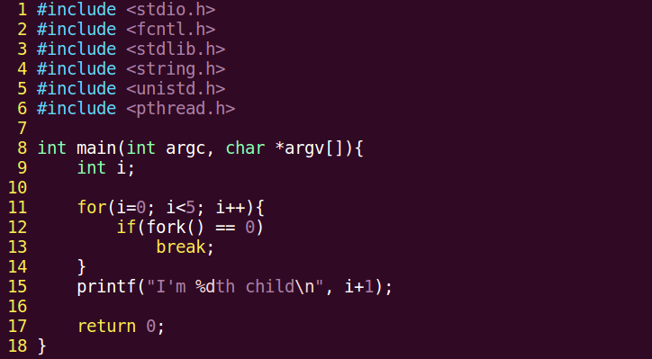

编译执行，如图：

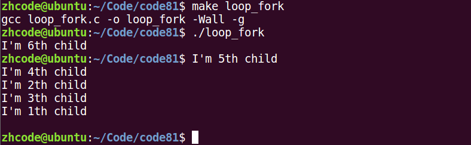

出现了问题：进程多了一个，而且不是按顺序来的。这里多出的一个，是父进程，因为父进程才有i=5跳出循环这一步。所以，对父进程进行判定并处理

修改代码如下：

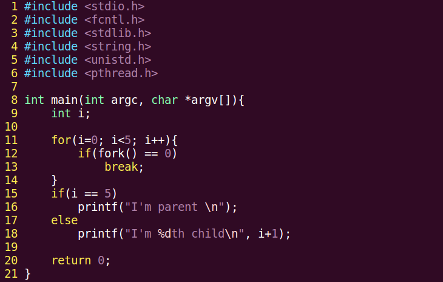

编译运行，结果如下：

现在还有两个问题，

一个就是包括父进程在内的所有进程不是按顺序出现，多运行几次，发现是随机序列出现的。这是要因为，对操作系统而言，这几个子进程几乎是同时出现的，它们和父进程一起争夺cpu，谁抢到，谁打印，所以出现顺序是随机的。

第二问题就是终端提示符混在了输出里，这个是因为，loop_fork是终端的子进程，一旦loop_fork执行完，终端就会打印提示符。就像之前没有子进程的程序，一旦执行完，就出现了终端提示符。这里也就是这个道理，loop_fork执行完了，终端提示符出现，然而loop_fork的子进程还没执行完，所以输出就混在一起了。

下面通过sleep延时来解决父进程先结束这个问题。代码如下，就是给父进程加了个sleep：

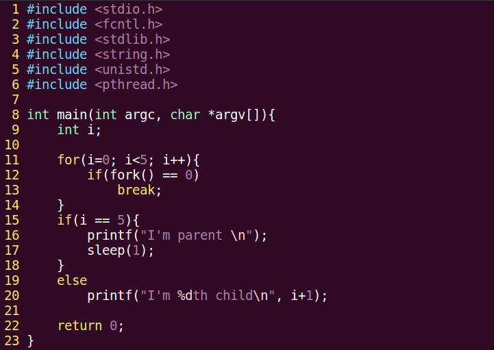

编译运行，结果如下：

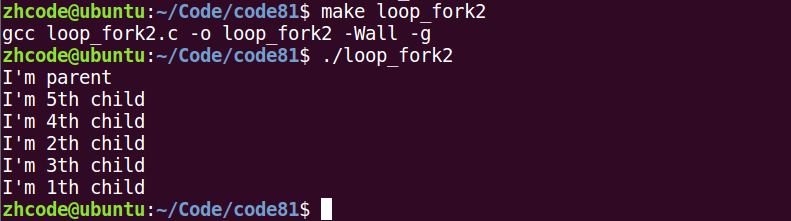

可以看到，更改之后，父进程在所有子进程后结束，所以终端提示符最后出现。

这里和视频里有一点差异，我这里“I’m parent”是先于子进程的输出的，因为我这里是父进程在sleep之前就打印信息了，视频里是sleep之后打印。这个不是大问题，怎么写都行，因为父进程虽然在打印之前fork了子进程，照理来说子进程会和父进程抢cpu，打印顺序会乱。但是由于父进程已经处于执行状态，所以一般来说父进程一定会先于子进程打印。当然这个对于不同操作系统不太一样，万一时间片再短点，父进程在打印之前，时间片到了，子进程抢到cpu就开始打印了，那么父进程打印信息就不一定在第一位了。道理是这么个道理，最好还是先sleep再打印吧，这样父进程一定是最后输出的。

最后来解决子进程乱序输出的问题，解决方法很简单，让第1个子进程少等，第二个子进程多等，后面子进程等待时间依次增加，这样就能实现有序输出。

代码如下：

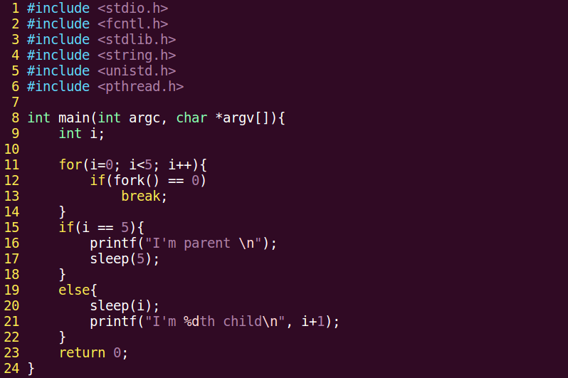

编译运行，如图：

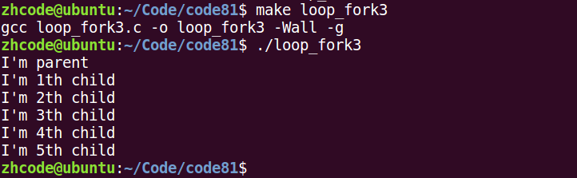

这下执行几次都这样，有序输出，问题不大。

## 84P-父子进程共享哪些内容

父子进程相同：

刚fork后。 data段、text段、堆、栈、环境变量、全局变量、宿主目录位置、进程工作目录位置、信号处理方式

父子进程不同：

进程id、返回值、各自的父进程、进程创建时间、闹钟、未决信号集

父子进程共享：

读时共享、写时复制。———————— 全局变量。

1.  文件描述符 2. mmap映射区。

## 85P-父子进程共享

父子进程共享：

读时共享、写时复制。———————— 全局变量。

1.  文件描述符 2. mmap映射区。

## 86P-总结

./a.out ls.c /home/itcast/28_Linux ./abc/

/home/itcast/28_Linux/testdir/

递归遍历目录：ls-R.c

1\. 判断命令行参数，获取用户要查询的目录名。 int argc, char \*argv[1]

argc == 1 --\> ./

2\. 判断用户指定的是否是目录。 stat S_ISDIR(); --\> 封装函数 isFile() { }

3\. 读目录： read_dir() {

opendir（dir）

while （readdir（））{

普通文件，直接打印

目录：

拼接目录访问绝对路径。sprintf(path, "%s/%s", dir, d_name)

递归调用自己。--》 opendir（path） readdir closedir

}

closedir（）

}

read_dir() --\> isFile() ---\> read_dir()

dup 和 dup2：

int dup(int oldfd); 文件描述符复制。

oldfd: 已有文件描述符

返回：新文件描述符。

int dup2(int oldfd, int newfd); 文件描述符复制。重定向。

fcntl 函数实现 dup：

int fcntl(int fd, int cmd, ....)

cmd: F_DUPFD

参3: 被占用的，返回最小可用的。

未被占用的， 返回=该值的文件描述符。

===================================================================================================

进程：

程序：死的。只占用磁盘空间。 ——剧本。

进程；活的。运行起来的程序。占用内存、cpu等系统资源。 ——戏。

PCB进程控制块：

进程id

文件描述符表

进程状态： 初始态、就绪态、运行态、挂起态、终止态。

进程工作目录位置

\*umask掩码

信号相关信息资源。

用户id和组id

fork函数：

pid_t fork(void)

创建子进程。父子进程各自返回。父进程返回子进程pid。 子进程返回 0.

getpid();getppid();

循环创建N个子进程模型。 每个子进程标识自己的身份。

父子进程相同：

刚fork后。 data段、text段、堆、栈、环境变量、全局变量、宿主目录位置、进程工作目录位置、信号处理方式

父子进程不同：

进程id、返回值、各自的父进程、进程创建时间、闹钟、未决信号集

父子进程共享：

读时共享、写时复制。———————— 全局变量。

1\. 文件描述符 2. mmap映射区。

## 87P-复习

## 88P-父子进程gdb调试

gdb调试：

设置父进程调试路径：set follow-fork-mode parent (默认)

设置子进程调试路径：set follow-fork-mode child

注意，一定要在fork函数调用之前设置才有效。

## 89P-exec函数族

exec函数族：

使进程执行某一程序。成功无返回值，失败返回 -1

int execlp(const char \*file, const char \*arg, ...); 借助 PATH 环境变量找寻待执行程序

参1： 程序名

参2： argv0

参3： argv1

...： argvN

哨兵：NULL

int execl(const char \*path, const char \*arg, ...); 自己指定待执行程序路径。

int execvp();

ps ajx --\> pid ppid gid sid

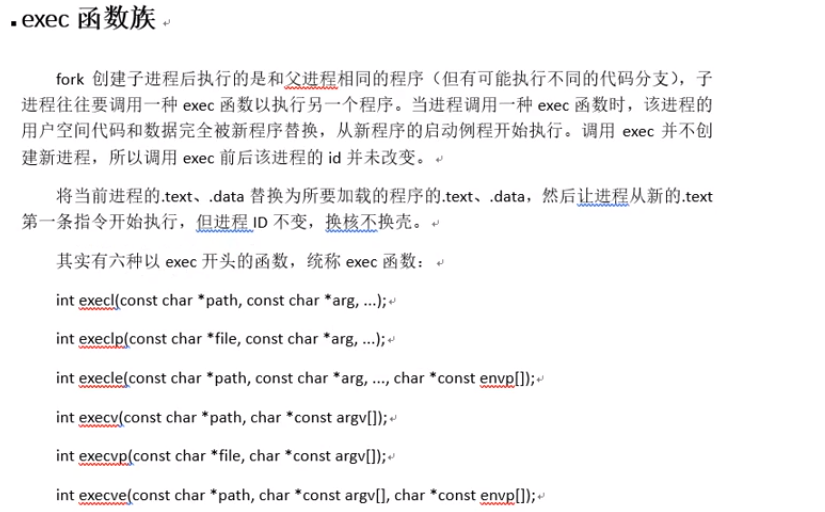

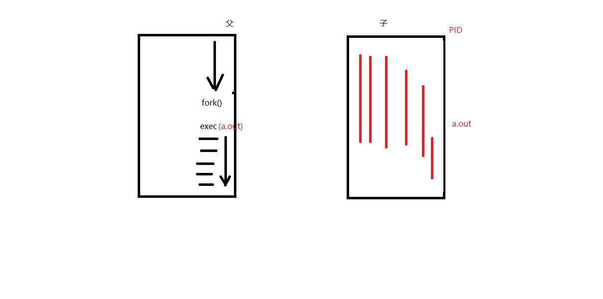

## 90P-execlp和ececl函数

int execlp(const char \*file, const char \*arg, …)

成功，无返回，失败返回-1

参数1：要加载的程序名字，该函数需要配合PATH环境变量来使用，当PATH所有目录搜素后没有参数1则返回出错。

该函数通常用来调用系统程序。如ls、date、cp、cat命令。

execlp这里面的p，表示要借助环境变量来加载可执行文件

示例代码，通过execlp让子进程去执行ls命令：

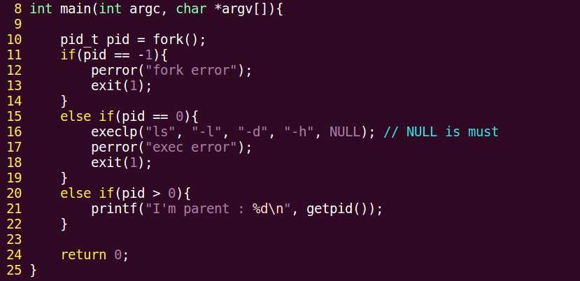

编译运行，结果如下：

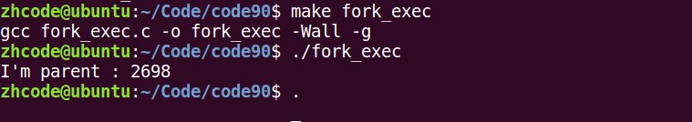

只有父进程正确执行并输出了，子进程的ls输出有问题。

问题出在参数上，可变参数那里，是从argv[0]开始计算的。

修改代码，就是将缺失的argv[0]补上，然后让父进程延时1秒，保证终端提示符不和输出干扰。如下：

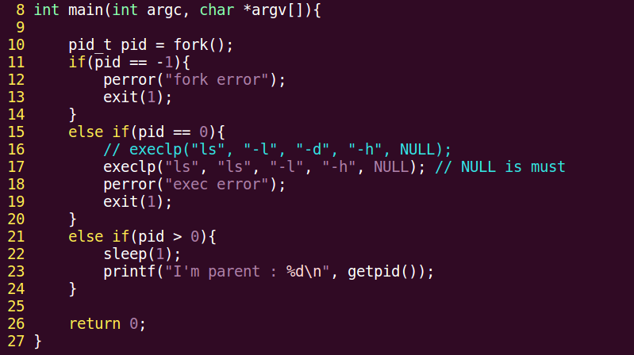

编译执行，如下：

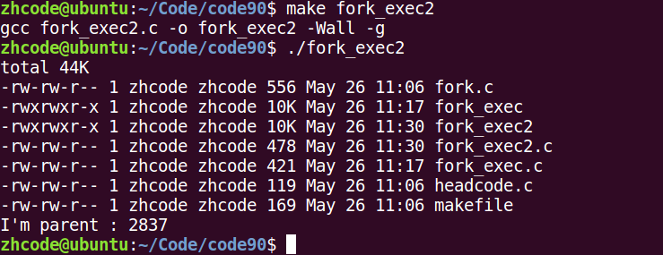

这个看起来就很科学了。于是子进程就能随意调用可执行程序了，这个可执行程序可以是系统的，也可以是自定义的。

下面使用execl来让子程序调用自定义的程序。

int execl(const char \*path, const char \*arg, …)

这里要注意，和execlp不同的是，第一个参数是路径，不是文件名。

这个路径用相对路径和绝对路径都行。

调用的代码如下：

exec代码如下：

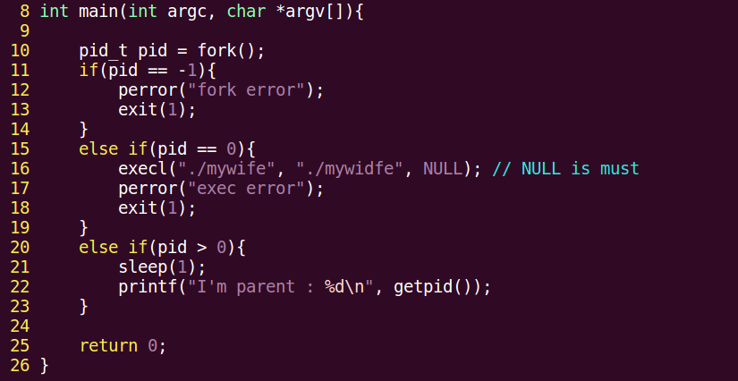

编译执行，如下：

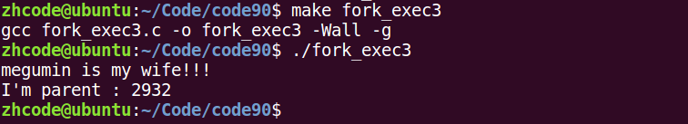

这就很强势了。

用execl也能执行ls这些，把路径给出来就行，但是这样麻烦，所以对于系统指令一般还是用execlp

## 91P-exec函数族特性

写一个程序，使用execlp执行进程查看，并将结果输出到文件里。

要用到open, execlp, dup2

代码如下：

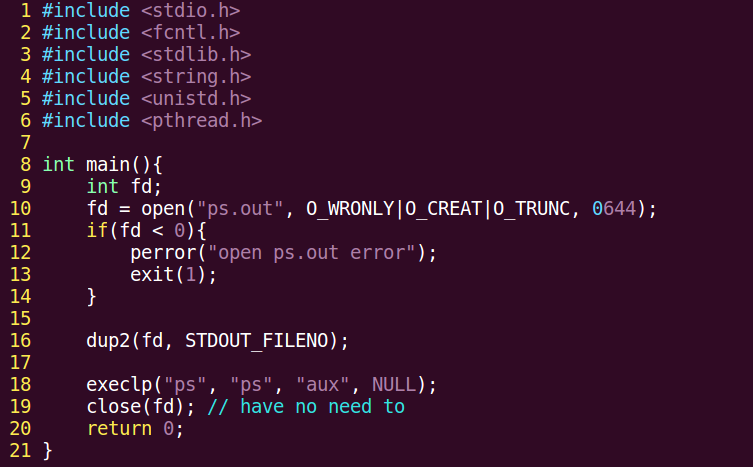

编译执行，如下：

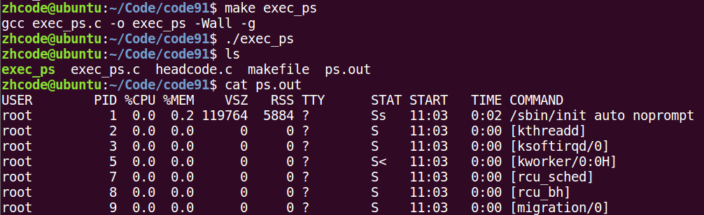

很强势，问题不大。

exec函数族一般规律：

exec函数一旦调用成功，即执行新的程序，不返回。只有失败才返回，错误值-1，所以通常我们直接在exec函数调用后直接调用perror()，和exit()，无需if判断。

l(list) 命令行参数列表

p(path) 搜索file时使用path变量

v(vector) 使用命令行参数数组

e(environment) 使用环境变量数组，不适用进程原有的环境变量，设置新加载程序运行的环境变量

事实上，只有execve是真正的系统调用，其他5个函数最终都调用execve，是库函数，所以execve在man手册第二节，其它函数在man手册第3节。

## 92P-孤儿进程和僵尸进程

孤儿进程：

父进程先于子进终止，子进程沦为“孤儿进程”，会被 init 进程领养。

僵尸进程：

子进程终止，父进程尚未对子进程进行回收，在此期间，子进程为“僵尸进程”。 kill 对其无效。这里要注意，每个进程结束后都必然会经历僵尸态，时间长短的差别而已。

子进程终止时，子进程残留资源PCB存放于内核中，PCB记录了进程结束原因，进程回收就是回收PCB。回收僵尸进程，得kill它的父进程，让孤儿院去回收它。

## 93P-wait回收子进程

wait函数： 回收子进程退出资源， 阻塞回收任意一个。

pid_t wait(int \*status)

参数：（传出） 回收进程的状态。

返回值：成功： 回收进程的pid

失败： -1， errno

函数作用1： 阻塞等待子进程退出

函数作用2： 清理子进程残留在内核的 pcb 资源

函数作用3： 通过传出参数，得到子进程结束状态

获取子进程正常终止值：

WIFEXITED(status) --》 为真 --》调用 WEXITSTATUS(status) --》 得到 子进程 退出值。

获取导致子进程异常终止信号：

WIFSIGNALED(status) --》 为真 --》调用 WTERMSIG(status) --》 得到 导致子进程异常终止的信号编号。

一个进程终止时会关闭所有文件描述符，释放在用户空间分配的内存，但它的PCB还保留着，内核在其中保存了一些信息：如果是正常终止则保存着退出状态，如果是异常终止则保存着导致该进程终止的信号是哪个。这个进程的父进程可以调用wait或者waitpid获取这些信息，然后彻底清除掉这个进程。我们知道一个进程的退出状态可以在shell中用特殊变量\$？查看，因为shell是它的父进程，当它终止时，shell调用wait或者waitpid得到它的退出状态，同时彻底清除掉这个进程。

pid_t wait(int \*status)

其中status是传出参数

下面这个例子，使用wait来阻塞回收子进程。

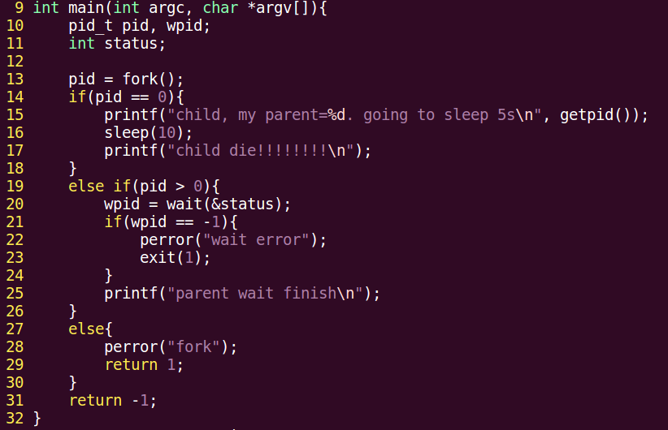

编译运行，如下：

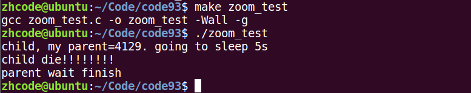

## 94P-获取子进程退出值和异常终止信号

获取子进程正常终止值：

WIFEXITED(status) --》 为真 --》调用 WEXITSTATUS(status) --》 得到 子进程 退出值。

获取导致子进程异常终止信号：

WIFSIGNALED(status) --》 为真 --》调用 WTERMSIG(status) --》 得到 导致子进程异常终止的信号编号。

下面这个代码捕获程序异常终止的信号并打印：

1.  \#include \<stdio.h\>
2.  \#include \<stdlib.h\>
3.  \#include \<unistd.h\>
4.  \#include \<sys/wait.h\>
5.  
6.  **int** main(**void**)
7.  {
8.  pid_t pid, wpid;
9.  **int** status;
10.  
11.  pid = fork();
12.  **if** (pid == 0) {
13.  printf("---child, my id= %d, going to sleep 10s\\n", getpid());
14.  sleep(10);
15.  printf("-------------child die--------------\\n");
16.  **return** 73;
17.  } **else** **if** (pid \> 0) {
18.  //wpid = wait(NULL); // 不关心子进程结束原因
19.  wpid = wait(&status); // 如果子进程未终止,父进程阻塞在这个函数上
20.  **if** (wpid == -1) {
21.  perror("wait error");
22.  exit(1);
23.  }
24.  **if** (WIFEXITED(status)) { //为真,说明子进程正常终止.
25.  printf("child exit with %d\\n", WEXITSTATUS(status));
26.  
27.  }
28.  **if** (WIFSIGNALED(status)) { //为真,说明子进程是被信号终止.
29.  
30.  printf("child kill with signal %d\\n", WTERMSIG(status));
31.  }
32.  
33.  printf("------------parent wait finish: %d\\n", wpid);
34.  } **else** {
35.  perror("fork");
36.  **return** 1;
37.  }
38.  
39.  **return** 0;
40.  }

编译运行，如下所示：

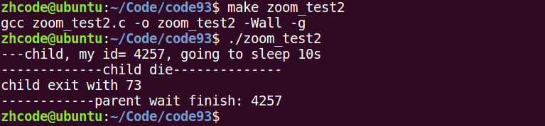

这是子进程正常退出的情况。

下面发送信号使得子进程异常退出。

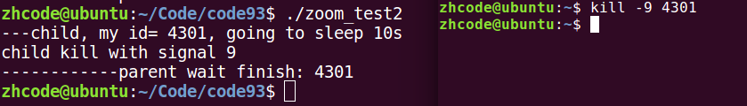

再测试一波，这次发送信号11试试

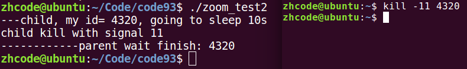

## 95P-waitpid回收子进程

waitpid函数： 指定某一个进程进行回收。可以设置非阻塞。

waitpid(-1, \&status, 0) == wait(&status);

pid_t waitpid(pid_t pid, int \*status, int options)

参数：

pid：指定回收某一个子进程pid

\> 0: 待回收的子进程pid

\-1：任意子进程

0：同组的子进程。

status：（传出） 回收进程的状态。

options：WNOHANG 指定回收方式为，非阻塞。

返回值：

\> 0 : 表成功回收的子进程 pid

0 : 函数调用时， 参3 指定了WNOHANG， 并且，没有子进程结束。

\-1: 失败。errno

一次wait/waitpid函数调用，只能回收一个子进程。上一个例子，父进程产生了5个子进程，wait会随机回收一个，捡到哪个算哪个。

## 96P-中午回顾

ps ajx --\> pid ppid gid sid

## 97P-错误解析

在演示回收指定子进程的代码时出了问题，这里问题原因在于指定子进程的pid传递。父进程里的pid变量和子进程pid变量并不是同一个。子进程结束时，父进程的pid还是原来的0。

原来的代码没有使用fork的返回值，导致父进程没有得到指定回收子进程的pid。

默认情况下，父进程fork出来的子进程都属于同一个组。

pid_t waitpid(pid_t pid, int \*status, int options)

参数：

pid：指定回收某一个子进程pid

\> 0: 待回收的子进程pid

\-1：任意子进程

0：同组的子进程。

status：（传出） 回收进程的状态。

options：WNOHANG 指定回收方式为，非阻塞。

错误代码如下图所示，就不运行了，它不能回收指定的第3个子进程

1.  //指定回收一个子进程错误示例
2.  \#include \<stdio.h\>
3.  \#include \<stdlib.h\>
4.  \#include \<string.h\>
5.  \#include \<unistd.h\>
6.  \#include \<sys/wait.h\>
7.  \#include \<pthread.h\>
8.  
9.  **int** main(**int** argc, **char** \*argv[])
10.  {
11.  **int** i;
12.  pid_t pid, wpid;
13.  
14.  **for** (i = 0; i \< 5; i++) {
15.  **if** (fork() == 0) { // 循环期间, 子进程不 fork
16.  **if** (i == 2) {
17.  pid = getpid();
18.  printf("------pid = %d\\n", pid);
19.  }
20.  **break**;
21.  }
22.  }
23.  
24.  **if** (5 == i) { // 父进程, 从 表达式 2 跳出
25.  sleep(5);
26.  
27.  //wait(NULL); // 一次wait/waitpid函数调用,只能回收一个子进程.
28.  //wpid = waitpid(-1, NULL, WNOHANG); //回收任意子进程,没有结束的子进程,父进程直接返回0
29.  //wpid = waitpid(pid, NULL, WNOHANG); //指定一个进程回收
30.  
31.  printf("------in parent , before waitpid, pid= %d\\n", pid);
32.  wpid = waitpid(pid, NULL, 0); //指定一个进程回收
33.  **if** (wpid == -1) {
34.  perror("waitpid error");
35.  exit(1);
36.  }
37.  printf("I'm parent, wait a child finish : %d \\n", wpid);
38.  
39.  } **else** { // 子进程, 从 break 跳出
40.  sleep(i);
41.  printf("I'm %dth child, pid= %d\\n", i+1, getpid());
42.  }
43.  
44.  **return** 0;
45.  }

编译并运行，结果如下：

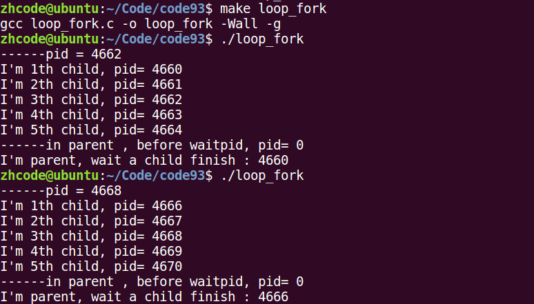

这个代码错误如之前所述，父进程里的pid还是0，因为父进程里没有获取指定子进程的pid，于是父进程里的pid还保持默认值。

下面是正确的示例，循环fork出5个子进程，并回收指定的子进程：

1.  \#include \<stdio.h\>
2.  \#include \<stdlib.h\>
3.  \#include \<string.h\>
4.  \#include \<unistd.h\>
5.  \#include \<sys/wait.h\>
6.  \#include \<pthread.h\>
7.  
8.  
9.  **int** main(**int** argc, **char** \*argv[])
10.  {
11.  **int** i;
12.  pid_t pid, wpid, tmpid;
13.  
14.  **for** (i = 0; i \< 5; i++) {
15.  pid = fork();
16.  **if** (pid == 0) { // 循环期间, 子进程不 fork
17.  **break**;
18.  }
19.  **if** (i == 2) {
20.  tmpid = pid;
21.  printf("--------pid = %d\\n", tmpid);
22.  }
23.  }
24.  
25.  **if** (5 == i) { // 父进程, 从 表达式 2 跳出
26.  // sleep(5);
27.  
28.  //wait(NULL); // 一次wait/waitpid函数调用,只能回收一个子进程.
29.  //wpid = waitpid(-1, NULL, WNOHANG); //回收任意子进程,没有结束的子进程,父进程直接返回0
30.  //wpid = waitpid(tmpid, NULL, 0); //指定一个进程回收, 阻塞等待
31.  printf("i am parent , before waitpid, pid = %d\\n", tmpid);
32.  
33.  //wpid = waitpid(tmpid, NULL, WNOHANG); //指定一个进程回收, 不阻塞
34.  wpid = waitpid(tmpid, NULL, 0); //指定一个进程回收, 阻塞回收
35.  **if** (wpid == -1) {
36.  perror("waitpid error");
37.  exit(1);
38.  }
39.  printf("I'm parent, wait a child finish : %d \\n", wpid);
40.  
41.  } **else** { // 子进程, 从 break 跳出
42.  sleep(i);
43.  printf("I'm %dth child, pid= %d\\n", i+1, getpid());
44.  }
45.  
46.  **return** 0;
47.  }

编译执行，如下图所示：

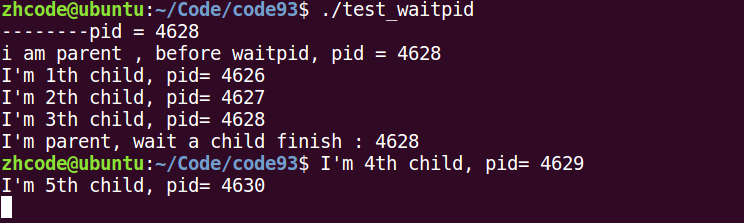

如上图，指定回收的第三个进程，就回收的第三个。这里实现由两种，一个是阻塞等待回收指定进程，一个是非阻塞，但是用sleep延时父进程，以保证待回收的指定子进程已经执行结束。上面这个代码使用的阻塞回收，这个方案的问题在于终端提示符会和输出混杂在一起。下面使用非阻塞回收+延时的方法，这样终端提示符就不会混在输出里。

1.  \#include \<stdio.h\>
2.  \#include \<stdlib.h\>
3.  \#include \<string.h\>
4.  \#include \<unistd.h\>
5.  \#include \<sys/wait.h\>
6.  \#include \<pthread.h\>
7.  
8.  
9.  **int** main(**int** argc, **char** \*argv[])
10.  {
11.  **int** i;
12.  pid_t pid, wpid, tmpid;
13.  
14.  **for** (i = 0; i \< 5; i++) {
15.  pid = fork();
16.  **if** (pid == 0) { // 循环期间, 子进程不 fork
17.  **break**;
18.  }
19.  **if** (i == 2) {
20.  tmpid = pid;
21.  printf("--------pid = %d\\n", tmpid);
22.  }
23.  }
24.  
25.  **if** (5 == i) { // 父进程, 从 表达式 2 跳出
26.  sleep(5);
27.  
28.  //wait(NULL); // 一次wait/waitpid函数调用,只能回收一个子进程.
29.  //wpid = waitpid(-1, NULL, WNOHANG); //回收任意子进程,没有结束的子进程,父进程直接返回0
30.  //wpid = waitpid(tmpid, NULL, 0); //指定一个进程回收, 阻塞等待
31.  printf("i am parent , before waitpid, pid = %d\\n", tmpid);
32.  
33.  wpid = waitpid(tmpid, NULL, WNOHANG); //指定一个进程回收, 不阻塞
34.  //wpid = waitpid(tmpid, NULL, 0); //指定一个进程回收, 阻塞回收
35.  **if** (wpid == -1) {
36.  perror("waitpid error");
37.  exit(1);
38.  }
39.  printf("I'm parent, wait a child finish : %d \\n", wpid);
40.  
41.  } **else** { // 子进程, 从 break 跳出
42.  sleep(i);
43.  printf("I'm %dth child, pid= %d\\n", i+1, getpid());
44.  }
45.  
46.  **return** 0;
47.  }

编译运行，结果如下：

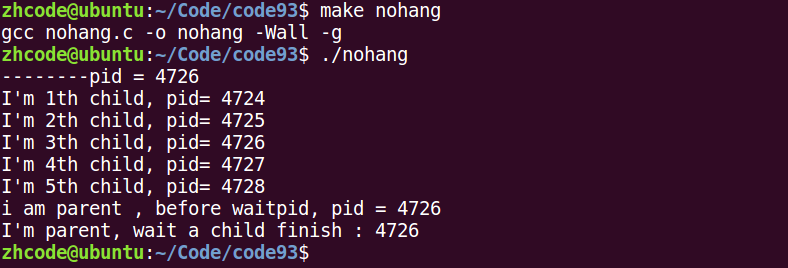

## 98P-waitpid回收多个子进程

waitpid函数： 指定某一个进程进行回收。可以设置非阻塞。

waitpid(-1, \&status, 0) == wait(&status);

pid_t waitpid(pid_t pid, int \*status, int options)

参数：

pid：指定回收某一个子进程pid

\> 0: 待回收的子进程pid

\-1：任意子进程

0：同组的子进程。

status：（传出） 回收进程的状态。

options：WNOHANG 指定回收方式为，非阻塞。

返回值：

\> 0 : 表成功回收的子进程 pid

0 : 函数调用时， 参3 指定了WNOHANG， 并且，没有子进程结束。

\-1: 失败。errno

一次wait/waitpid函数调用，只能回收一个子进程。上一个例子，父进程产生了5个子进程，wait会随机回收一个，捡到哪个算哪个。

总结：

wait、waitpid 一次调用，回收一个子进程。

想回收多个。while

下面这个例子，循环回收多个子进程：

1.  // 回收多个子进程
2.  \#include \<stdio.h\>
3.  \#include \<stdlib.h\>
4.  \#include \<string.h\>
5.  \#include \<unistd.h\>
6.  \#include \<sys/wait.h\>
7.  \#include \<pthread.h\>
8.  
9.  **int** main(**int** argc, **char** \*argv[])
10.  {
11.  **int** i;
12.  pid_t pid, wpid;
13.  
14.  **for** (i = 0; i \< 5; i++) {
15.  pid = fork();
16.  **if** (pid == 0) { // 循环期间, 子进程不 fork
17.  **break**;
18.  }
19.  }
20.  
21.  **if** (5 == i) { // 父进程, 从 表达式 2 跳出
22.  /\*
23.  while ((wpid = waitpid(-1, NULL, 0))) { // 使用阻塞方式回收子进程
24.  printf("wait child %d \\n", wpid);
25.  }
26.  \*/
27.  **while** ((wpid = waitpid(-1, NULL, WNOHANG)) != -1) { //使用非阻塞方式,回收子进程.
28.  **if** (wpid \> 0) {
29.  printf("wait child %d \\n", wpid);
30.  } **else** **if** (wpid == 0) {
31.  sleep(1);
32.  **continue**;
33.  }
34.  }
35.  
36.  } **else** { // 子进程, 从 break 跳出
37.  sleep(i);
38.  printf("I'm %dth child, pid= %d\\n", i+1, getpid());
39.  }
40.  
41.  **return** 0;
42.  }

编译运行，结果如下：

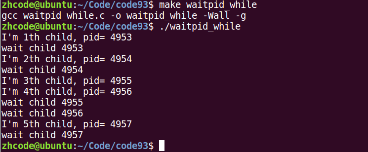

可见，子进程运行完了，父进程就回收了。

## 99P-wait和waitpid总结

总结：

wait、waitpid 一次调用，回收一个子进程。

想回收多个。while