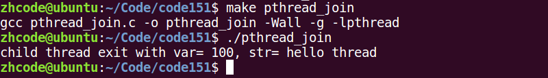

## 147P-线程概念

线程概念：

进程：有独立的 进程地址空间。有独立的pcb。 分配资源的最小单位。

线程：有独立的pcb。没有独立的进程地址空间。 最小单位的执行。

ps -Lf 进程id ---\> 线程号。LWP --》cpu 执行的最小单位。

ps -Lf 进程号 查看进程的线程

## 148P-三级映射

## 149P-线程共享和非共享

线程共享：

独享 栈空间（内核栈、用户栈）

共享 ./text./data ./rodataa ./bsss heap ---\> 共享【全局变量】（errno）

## 150P-中午复习

## 151P-创建线程

pthread_t pthread_self(void); 获取线程id。 线程id是在进程地址空间内部，用来标识线程身份的id号。

返回值：本线程id

检查出错返回： 线程中。

fprintf(stderr, "xxx error: %s\\n", strerror(ret));

int pthread_create(pthread_t \*tid, const pthread_attr_t \*attr, void \*(\*start_rountn)(void \*), void \*arg); 创建子线程。

参1：传出参数，表新创建的子线程 id

参2：线程属性。传NULL表使用默认属性。

参3：子线程回调函数。创建成功，ptherad_create函数返回时，该函数会被自动调用。

参4：参3的参数。没有的话，传NULL

返回值：成功：0

失败：errno

下面这个例子，创建一个子线程去执行其他任务：

1.  \#include \<stdio.h\>
2.  \#include \<stdlib.h\>
3.  \#include \<string.h\>
4.  \#include \<unistd.h\>
5.  \#include \<errno.h\>
6.  \#include \<pthread.h\>
7.  
8.  **void** sys_err(**const** **char** \*str){
9.  perror(str);
10.  exit(1);
11.  }
12.  
13.  **void** \*tfn(**void** \*arg){
14.  printf("thread: pid = %d, tid = %lu\\n", getpid(), pthread_self());
15.  
16.  **return** NULL;
17.  }
18.  
19.  **int** main(**int** argc, **char** \*argv[]){
20.  pthread_t tid;
21.  
22.  printf("main: pid = %d, tid = %lu\\n", getpid(), pthread_self());
23.  
24.  **int** ret = pthread_create(&tid, NULL, tfn, NULL);
25.  **if** (ret != 0) {
26.  perror("pthread_create error");
27.  }
28.  
29.  **return** 0;
30.  }

编译运行，结果如下：

可以看到，子线程的打印信息并未出现。原因在于，主线程执行完之后，就销毁了整个进程的地址空间，于是子线程就无法打印。简单粗暴的方法就是让主线程睡1秒，等子线程执行。

代码变化如下：

编译执行，如下：

## 152P-循环创建多个子线程

下面的例子，循环创建多个子线程：

1.  \#include \<stdio.h\>
2.  \#include \<stdlib.h\>
3.  \#include \<string.h\>
4.  \#include \<unistd.h\>
5.  \#include \<errno.h\>
6.  \#include \<pthread.h\>
7.  
8.  **void** sys_err(**const** **char** \*str){
9.  perror(str);
10.  exit(1);
11.  }
12.  
13.  **void** \*tfn(**void** \*arg){
14.  **int** i = (**int**)arg;
15.  sleep(i);
16.  printf("--I'm %dth thread: pid = %d, tid = %lu\\n",i+1, getpid(), pthread_self());
17.  
18.  **return** NULL;
19.  }
20.  
21.  **int** main(**int** argc, **char** \*argv[]){
22.  **int** i;
23.  **int** ret;
24.  pthread_t tid;
25.  
26.  **for**(i=0;i\<5;i++){
27.  ret = pthread_create(&tid, NULL, tfn, (**void** \*)i);
28.  **if** (ret != 0) {
29.  sys_err("pthread_create error");
30.  }
31.  }
32.  sleep(i);
33.  printf("I'm main, pid = %d, tid = %lu\\n", getpid(), pthread_self());
34.  
35.  **return** 0;
36.  }

编译运行，结果如下：

编译时会出现类型强转的警告，指针4字节转int的8字节，不过不存在精度损失，忽略就行。

## 153P-错误分析

在152P的代码中，如果将i取地址后再传入线程创建函数里，就是说

当前传的是：(void \*)i

改成： (void \*)&i

相应的，修改回调函数：int i = \*((int \*)arg)

运行代码，会出现如下结果：

如果多次运行都只有主线程的输出，将主线程等待时长从i改为大于6的数即可。因为子线程等待时间i是不定的，但都小于等于6秒，由于抢cpu时没抢过主线程，导致没有子线程的输出。

错误原因在于，子线程如果用引用传递i，会去读取主线程里的i值，而主线程里的i是动态变化的，不固定。所以，应该采用值传递，不用引用传递。

## 154P-线程间全局变量共享

直接看个代码，在子线程里更改全局变量，看主线程里的该变量有啥变化：

编译运行，结果如下：

可以看到，子线程里更改全局变量后，主线程里也跟着发生变化。

## 155P-pthread_exit退出

void pthread_exit(void \*retval); 退出当前线程。

retval：退出值。 无退出值时，NULL

exit(); 退出当前进程。

return: 返回到调用者那里去。

pthread_exit(): 退出当前线程。

如果在回调函数里加一段代码：

if(i == 2)

exit(0);

看起来好像是退出了第三个子线程，然而运行时，发现后续的4,5也没了。这是因为，exit是退出进程。

一、修改一下，换成：

if(i == 2)

return NULL;

这样运行一下，发现后续线程不会凉凉，说明return是可以达到退出线程的目的。然而真正意义上，return是返回到函数调用者那里去，线程并没有退出。

二、再修改一下，再定义一个函数func，直接返回那种

void \*func(void){

return NULL;

}

if(i == 2)

func();

运行，发现1,2,3,4,5线程都还在，说明没有达到退出目的。

三、再次修改：

void \*func(void){

pthread_exit(NULL);

return NULL;

}

if(i == 2)

func();

编译运行，发现3没了，看起来很科学的样子。pthread_exit表示将当前线程退出。放在函数里，还是直接调用，都可以。

回到之前说的一个问题，由于主线程可能先于子线程结束，所以子线程的输出可能不会打印出来，当时是用主线程sleep等待子线程结束来解决的。现在就可以使用pthread_exit来解决了。方法就是将return 0替换为pthread_exit，只退出当先线程，不会对其他线程造成影响。

void pthread_exit(void \*retval); 退出当前线程。

retval：退出值。 无退出值时，NULL

exit(); 退出当前进程。

return: 返回到调用者那里去。

pthread_exit(): 退出当前线程。

## 156P-pthread_join

int pthread_join(pthread_t thread, void \*\*retval); 阻塞 回收线程。

thread: 待回收的线程id

retval：传出参数。 回收的那个线程的退出值。

线程异常借助，值为 -1。

返回值：成功：0

失败：errno

下面这个是回收线程并获取子线程返回值的小例子：

1.  \#include \<stdio.h\>
2.  \#include \<stdlib.h\>
3.  \#include \<string.h\>
4.  \#include \<unistd.h\>
5.  \#include \<errno.h\>
6.  \#include \<pthread.h\>
7.  
8.  **struct** thrd {
9.  **int** var;
10.  **char** str[256];
11.  };
12.  
13.  **void** sys_err(**const** **char** \*str)
14.  {
15.  perror(str);
16.  exit(1);
17.  }
18.  
19.  **void** \*tfn(**void** \*arg)
20.  {
21.  **struct** thrd \*tval;
22.  
23.  tval = malloc(**sizeof**(tval));
24.  tval-\>var = 100;
25.  strcpy(tval-\>str, "hello thread");
26.  
27.  **return** (**void** \*)tval;
28.  }
29.  
30.  **int** main(**int** argc, **char** \*argv[])
31.  {
32.  pthread_t tid;
33.  
34.  **struct** thrd \*retval;
35.  
36.  **int** ret = pthread_create(&tid, NULL, tfn, NULL);
37.  **if** (ret != 0)
38.  sys_err("pthread_create error");
39.  
40.  //int pthread_join(pthread_t thread, void \*\*retval);
41.  ret = pthread_join(tid, (**void** \*\*)&retval);
42.  **if** (ret != 0)
43.  sys_err("pthread_join error");
44.  
45.  printf("child thread exit with var= %d, str= %s\\n", retval-\>var, retval-\>str);
46.  
47.  pthread_exit(NULL);
48.  
49.  }

编译运行，结果如下：

## 157P-pthread_join作业

使用pthread_join函数将循环创建的多个子线程回收

这里tid要使用数组来存

## 158P-pthread_cancel函数

int pthread_cancel(pthread_t thread); 杀死一个线程。 需要到达取消点（保存点）

thread: 待杀死的线程id

返回值：成功：0

失败：errno

如果，子线程没有到达取消点， 那么 pthread_cancel 无效。

我们可以在程序中，手动添加一个取消点。使用 pthread_testcancel();

成功被 pthread_cancel() 杀死的线程，返回 -1.使用pthead_join 回收。

小例子，主线程调用pthread_cancel杀死子线程

1.  \#include \<stdio.h\>
2.  \#include \<stdlib.h\>
3.  \#include \<string.h\>
4.  \#include \<unistd.h\>
5.  \#include \<errno.h\>
6.  \#include \<pthread.h\>
7.  
8.  
9.  **void** \*tfn(**void** \*arg){
10.  **while** (1) {
11.  printf("thread: pid = %d, tid = %lu\\n", getpid(), pthread_self());
12.  sleep(1);
13.  }
14.  
15.  **return** NULL;
16.  }
17.  
18.  **int** main(**int** argc, **char** \*argv[]){
19.  pthread_t tid;
20.  
21.  **int** ret = pthread_create(&tid, NULL, tfn, NULL);
22.  **if** (ret != 0) {
23.  fprintf(stderr, "pthread_create error:%s\\n", strerror(ret));
24.  exit(1);
25.  }
26.  
27.  printf("main: pid = %d, tid = %lu\\n", getpid(), pthread_self());
28.  
29.  sleep(5);
30.  
31.  ret = pthread_cancel(tid); // 终止线程
32.  **if** (ret != 0) {
33.  fprintf(stderr, "pthread_cancel error:%s\\n", strerror(ret));
34.  exit(1);
35.  }
36.  
37.  **while** (1);
38.  
39.  pthread_exit((**void** \*)0);
40.  }

编译运行，如下：

可以看到，主线程确实kill了子线程。

这里要注意一点，pthread_cancel工作的必要条件是进入内核，如果tfn真的奇葩到没有进入内核，则pthread_cancel不能杀死线程，此时需要手动设置取消点，就是pthread_testcancel()

## 159P-检查出错返回

int pthread_detach(pthread_t thread); 设置线程分离

thread: 待分离的线程id

返回值：成功：0

失败：errno

下面这个例子，使用detach分离线程，照理来说，分离后的线程会自动回收：

1.  \#include \<stdio.h\>
2.  \#include \<stdlib.h\>
3.  \#include \<string.h\>
4.  \#include \<unistd.h\>
5.  \#include \<errno.h\>
6.  \#include \<pthread.h\>
7.  
8.  
9.  **void** \*tfn(**void** \*arg)
10.  {
11.  printf("thread: pid = %d, tid = %lu\\n", getpid(), pthread_self());
12.  
13.  **return** NULL;
14.  }
15.  
16.  **int** main(**int** argc, **char** \*argv[])
17.  {
18.  pthread_t tid;
19.  
20.  **int** ret = pthread_create(&tid, NULL, tfn, NULL);
21.  **if** (ret != 0) {
22.  perror("pthread_create error");
23.  }
24.  ret = pthread_detach(tid); // 设置线程分离\` 线程终止,会自动清理pcb,无需回收
25.  **if** (ret != 0) {
26.  perror("pthread_detach error");
27.  }
28.  
29.  sleep(1);
30.  
31.  ret = pthread_join(tid, NULL);
32.  printf("join ret = %d\\n", ret);
33.  **if** (ret != 0) {
34.  perror("pthread_join error");
35.  }
36.  
37.  printf("main: pid = %d, tid = %lu\\n", getpid(), pthread_self());
38.  
39.  pthread_exit((**void** \*)0);
40.  }

编译运行，结果如下：

这里，问题出现了，join出错了，但是没打印错误原因。之前的perror方法检查线程错误是有问题的。应该使用strerror，修改代码如下：

1.  \#include \<stdio.h\>
2.  \#include \<stdlib.h\>
3.  \#include \<string.h\>
4.  \#include \<unistd.h\>
5.  \#include \<errno.h\>
6.  \#include \<pthread.h\>
7.  
8.  
9.  **void** \*tfn(**void** \*arg)
10.  {
11.  printf("thread: pid = %d, tid = %lu\\n", getpid(), pthread_self());
12.  
13.  **return** NULL;
14.  }
15.  
16.  **int** main(**int** argc, **char** \*argv[])
17.  {
18.  pthread_t tid;
19.  
20.  **int** ret = pthread_create(&tid, NULL, tfn, NULL);
21.  **if** (ret != 0) {
22.  fprintf(stderr, "pthread_create error: %s\\n", strerror(ret));
23.  exit(1);
24.  }
25.  ret = pthread_detach(tid); // 设置线程分离\` 线程终止,会自动清理pcb,无需回收
26.  **if** (ret != 0) {
27.  fprintf(stderr, "pthread_detach error: %s\\n", strerror(ret));
28.  exit(1);
29.  }
30.  
31.  sleep(1);
32.  
33.  ret = pthread_join(tid, NULL);
34.  printf("join ret = %d\\n", ret);
35.  **if** (ret != 0) {
36.  fprintf(stderr, "pthread_join error: %s\\n", strerror(ret));
37.  exit(1);
38.  }
39.  
40.  printf("main: pid = %d, tid = %lu\\n", getpid(), pthread_self());
41.  
42.  pthread_exit((**void** \*)0);
43.  }

编译运行，结果如下：

## 160P-线程分离pthread_detach

上一节的出错，是因为线程分离后，系统会自动回收资源，用pthread_join去回收已经被系统回收的线程，那个线程号就是无效参数。

## 161P-进程和线程控制原语对比

线程控制原语 进程控制原语

pthread_create() fork();

pthread_self() getpid();

pthread_exit() exit(); / return

pthread_join() wait()/waitpid()

pthread_cancel() kill()

pthread_detach()

## 162P-线程属性设置分离线程

线程属性：

设置分离属性。

pthread_attr_t attr 创建一个线程属性结构体变量

pthread_attr_init(&attr); 初始化线程属性

pthread_attr_setdetachstate(&attr, PTHREAD_CREATE_DETACHED); 设置线程属性为 分离态

pthread_create(&tid, \&attr, tfn, NULL); 借助修改后的 设置线程属性 创建为分离态的新线程

pthread_attr_destroy(&attr); 销毁线程属性

调整线程状态，使线程创建出来就是分离态，代码如下：

1.  \#include \<stdio.h\>
2.  \#include \<stdlib.h\>
3.  \#include \<string.h\>
4.  \#include \<unistd.h\>
5.  \#include \<errno.h\>
6.  \#include \<pthread.h\>
7.  
8.  
9.  **void** \*tfn(**void** \*arg)
10.  {
11.  printf("thread: pid = %d, tid = %lu\\n", getpid(), pthread_self());
12.  
13.  **return** NULL;
14.  }
15.  
16.  **int** main(**int** argc, **char** \*argv[])
17.  {
18.  pthread_t tid;
19.  
20.  pthread_attr_t attr;
21.  
22.  **int** ret = pthread_attr_init(&attr);
23.  **if** (ret != 0) {
24.  fprintf(stderr, "attr_init error:%s\\n", strerror(ret));
25.  exit(1);
26.  }
27.  
28.  ret = pthread_attr_setdetachstate(&attr, PTHREAD_CREATE_DETACHED); // 设置线程属性为 分离属性
29.  **if** (ret != 0) {
30.  fprintf(stderr, "attr_setdetachstate error:%s\\n", strerror(ret));
31.  exit(1);
32.  }
33.  
34.  ret = pthread_create(&tid, \&attr, tfn, NULL);
35.  **if** (ret != 0) {
36.  perror("pthread_create error");
37.  }
38.  
39.  ret = pthread_attr_destroy(&attr);
40.  **if** (ret != 0) {
41.  fprintf(stderr, "attr_destroy error:%s\\n", strerror(ret));
42.  exit(1);
43.  }
44.  
45.  ret = pthread_join(tid, NULL);
46.  **if** (ret != 0) {
47.  fprintf(stderr, "pthread_join error:%s\\n", strerror(ret));
48.  exit(1);
49.  }
50.  
51.  printf("main: pid = %d, tid = %lu\\n", getpid(), pthread_self());
52.  
53.  pthread_exit((**void** \*)0);
54.  }

编译运行，结果如下：

如图，pthread_join报错，说明线程已经自动回收，设置分离成功。

## 163P-线程使用注意事项

## 164P-总结

守护进程：

daemon进程。通常运行与操作系统后台，脱离控制终端。一般不与用户直接交互。周期性的等待某个事件发生或周期性执行某一动作。

不受用户登录注销影响。通常采用以d结尾的命名方式。

守护进程创建步骤：

1\. fork子进程，让父进程终止。

2\. 子进程调用 setsid() 创建新会话

3\. 通常根据需要，改变工作目录位置 chdir()， 防止目录被卸载。

4\. 通常根据需要，重设umask文件权限掩码，影响新文件的创建权限。 022 -- 755 0345 --- 432 r---wx-w- 422

5\. 通常根据需要，关闭/重定向 文件描述符

6\. 守护进程 业务逻辑。while（）

=============================================================

线程概念：

进程：有独立的 进程地址空间。有独立的pcb。 分配资源的最小单位。

线程：有独立的pcb。没有独立的进程地址空间。 最小单位的执行。

ps -Lf 进程id ---\> 线程号。LWP --》cpu 执行的最小单位。

线程共享：

独享 栈空间（内核栈、用户栈）

共享 ./text./data ./rodataa ./bsss heap ---\> 共享【全局变量】（errno）

线程控制原语：

pthread_t pthread_self(void); 获取线程id。 线程id是在进程地址空间内部，用来标识线程身份的id号。

返回值：本线程id

检查出错返回： 线程中。

fprintf(stderr, "xxx error: %s\\n", strerror(ret));

int pthread_create(pthread_t \*tid, const pthread_attr_t \*attr, void \*(\*start_rountn)(void \*), void \*arg); 创建子线程。

参1：传出参数，表新创建的子线程 id

参2：线程属性。传NULL表使用默认属性。

参3：子线程回调函数。创建成功，ptherad_create函数返回时，该函数会被自动调用。

参4：参3的参数。没有的话，传NULL

返回值：成功：0

失败：errno

循环创建N个子线程：

for （i = 0； i \< 5; i++）

pthread_create(&tid, NULL, tfn, (void \*)i); // 将 int 类型 i， 强转成 void \*， 传参。

void pthread_exit(void \*retval); 退出当前线程。

retval：退出值。 无退出值时，NULL

exit(); 退出当前进程。

return: 返回到调用者那里去。

pthread_exit(): 退出当前线程。

int pthread_join(pthread_t thread, void \*\*retval); 阻塞 回收线程。

thread: 待回收的线程id

retval：传出参数。 回收的那个线程的退出值。

线程异常借助，值为 -1。

返回值：成功：0

失败：errno

int pthread_detach(pthread_t thread); 设置线程分离

thread: 待分离的线程id

返回值：成功：0

失败：errno

int pthread_cancel(pthread_t thread); 杀死一个线程。 需要到达取消点（保存点）

thread: 待杀死的线程id

返回值：成功：0

失败：errno

如果，子线程没有到达取消点， 那么 pthread_cancel 无效。

我们可以在程序中，手动添加一个取消点。使用 pthread_testcancel();

成功被 pthread_cancel() 杀死的线程，返回 -1.使用pthead_join 回收。

线程控制原语 进程控制原语

pthread_create() fork();

pthread_self() getpid();

pthread_exit() exit(); / return

pthread_join() wait()/waitpid()

pthread_cancel() kill()

pthread_detach()

线程属性：

设置分离属性。

pthread_attr_t attr 创建一个线程属性结构体变量

pthread_attr_init(&attr); 初始化线程属性

pthread_attr_setdetachstate(&attr, PTHREAD_CREATE_DETACHED); 设置线程属性为 分离态

pthread_create(&tid, \&attr, tfn, NULL); 借助修改后的 设置线程属性 创建为分离态的新线程

pthread_attr_destroy(&attr); 销毁线程属性