## 165P-线程同步概念

线程同步：

协同步调，对公共区域数据按序访问。防止数据混乱，产生与时间有关的错误。

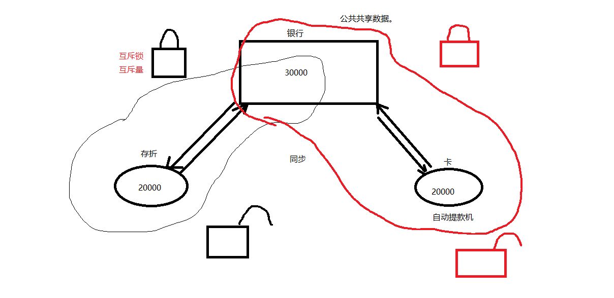

数据混乱的原因：

1.  资源共享(独享资源则不会)
2.  调度随机(意味着数据访问会出现竞争)
3.  线程间缺乏必要同步机制

## 166P-锁使用的注意事项

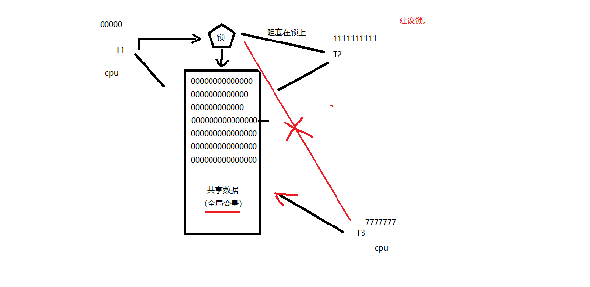

锁的使用：

建议锁！对公共数据进行保护。所有线程【应该】在访问公共数据前先拿锁再访问。但，锁本身不具备强制性。

## 167P-借助互斥锁管理共享数据实现同步

下面一个小例子，数据共享导致的混乱：

1.  \#include \<stdio.h\>
2.  \#include \<string.h\>
3.  \#include \<pthread.h\>
4.  \#include \<stdlib.h\>
5.  \#include \<unistd.h\>
6.  
7.  **void** \*tfn(**void** \*arg)
8.  {
9.  srand(time(NULL));
10.  
11.  **while** (1) {
12.  
13.  printf("hello ");
14.  sleep(rand() % 3); /\*模拟长时间操作共享资源，导致cpu易主，产生与时间有关的错误\*/
15.  printf("world\\n");
16.  sleep(rand() % 3);
17.  }
18.  
19.  **return** NULL;
20.  }
21.  
22.  **int** main(**void**)
23.  {
24.  pthread_t tid;
25.  srand(time(NULL));
26.  
27.  pthread_create(&tid, NULL, tfn, NULL);
28.  **while** (1) {
29.  
30.  printf("HELLO ");
31.  sleep(rand() % 3);
32.  printf("WORLD\\n");
33.  sleep(rand() % 3);
34.  
35.  }
36.  pthread_join(tid, NULL);
37.  
38.  **return** 0;
39.  }

编译运行，结果如下：

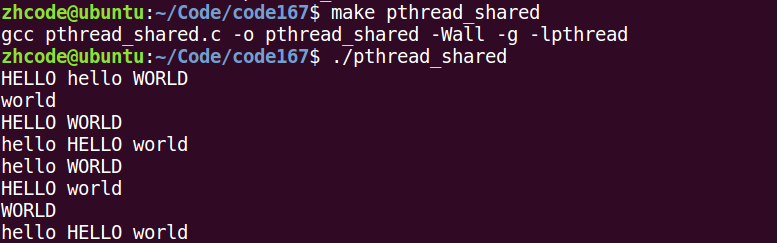

如图，输出结果是主线程和子线程交叉的。

主要应用函数：

pthread_mutex_init 函数

pthread_mutex_destory 函数

pthread_mutex_lock 函数

pthread_mutex_trylock 函数

pthread_mutex_unlock 函数

以上5个函数的返回值都是：成功返回0，失败返回错误号

pthread_mutex_t 类型，其本质是一个结构体。为简化理解，应用时可忽略其实现细节，简单当成整数看待

pthread_mutex_t mutex；变量mutex只有两种取值：0,1

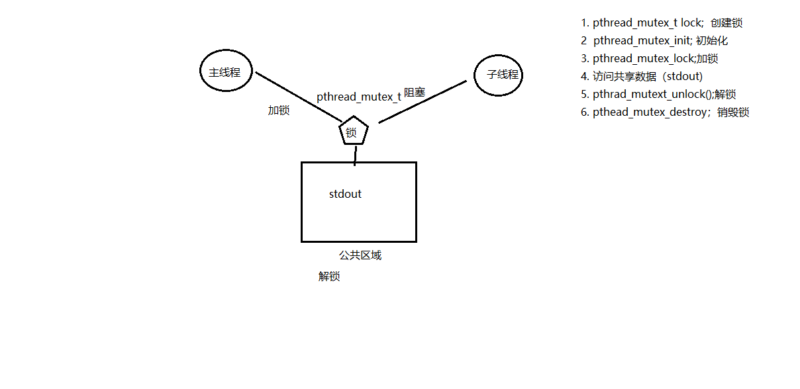

使用mutex(互斥量、互斥锁)一般步骤：

pthread_mutex_t 类型。

1\. pthread_mutex_t lock; 创建锁

2 pthread_mutex_init; 初始化 1

3\. pthread_mutex_lock;加锁 1-- --\> 0

4\. 访问共享数据（stdout)

5\. pthrad_mutext_unlock();解锁 0++ --\> 1

6\. pthead_mutex_destroy；销毁锁

int pthread_mutex_init(pthread_mutex_t \*restrict mutex,

const pthread_mutexattr_t \*restrict attr)

这里的restrict关键字，表示指针指向的内容只能通过这个指针进行修改

restrict关键字：

用来限定指针变量。被该关键字限定的指针变量所指向的内存操作，必须由本指针完成。

初始化互斥量：

pthread_mutex_t mutex;

1\. pthread_mutex_init(&mutex, NULL); 动态初始化。

2\. pthread_mutex_t mutex = PTHREAD_MUTEX_INITIALIZER; 静态初始化。

修改上面的代码，使用锁实现互斥访问共享区：

1.  \#include \<stdio.h\>
2.  \#include \<string.h\>
3.  \#include \<pthread.h\>
4.  \#include \<stdlib.h\>
5.  \#include \<unistd.h\>
6.  
7.  pthread_mutex_t mutex; // 定义一把互斥锁
8.  
9.  **void** \*tfn(**void** \*arg)
10.  {
11.  srand(time(NULL));
12.  
13.  **while** (1) {
14.  pthread_mutex_lock(&mutex); // 加锁
15.  printf("hello ");
16.  sleep(rand() % 3); // 模拟长时间操作共享资源，导致cpu易主，产生与时间有关的错误
17.  printf("world\\n");
18.  pthread_mutex_unlock(&mutex); // 解锁
19.  sleep(rand() % 3);
20.  }
21.  
22.  **return** NULL;
23.  }
24.  
25.  **int** main(**void**)
26.  {
27.  pthread_t tid;
28.  srand(time(NULL));
29.  **int** ret = pthread_mutex_init(&mutex, NULL); // 初始化互斥锁
30.  **if**(ret != 0){
31.  fprintf(stderr, "mutex init error:%s\\n", strerror(ret));
32.  exit(1);
33.  }
34.  
35.  pthread_create(&tid, NULL, tfn, NULL);
36.  **while** (1) {
37.  pthread_mutex_lock(&mutex); // 加锁
38.  printf("HELLO ");
39.  sleep(rand() % 3);
40.  printf("WORLD\\n");
41.  pthread_mutex_unlock(&mutex); // 解锁
42.  sleep(rand() % 3);
43.  }
44.  pthread_join(tid, NULL);
45.  
46.  pthread_mutex_destory(&mutex); // 销毁互斥锁
47.  
48.  **return** 0;
49.  }

编译运行，结果如下：

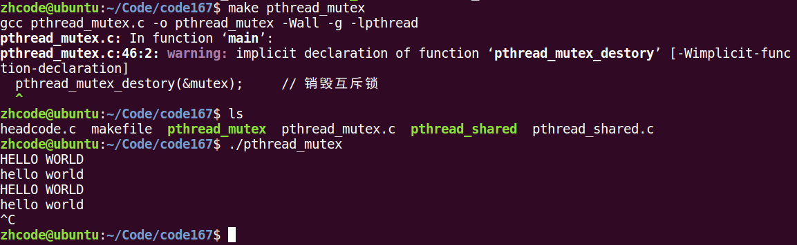

可以看到，主线程和子线程在访问共享区时就没有交叉输出的情况了。

## 168P-互斥锁使用技巧

注意事项：

尽量保证锁的粒度， 越小越好。（访问共享数据前，加锁。访问结束【立即】解锁。）

互斥锁，本质是结构体。 我们可以看成整数。 初值为 1。（pthread_mutex_init() 函数调用成功。）

加锁： --操作， 阻塞线程。

解锁： ++操作， 唤醒阻塞在锁上的线程。

try锁：尝试加锁，成功--。失败，返回。同时设置错误号 EBUSY

## 169P-try锁

try锁：尝试加锁，成功--，加锁失败直接返回错误号(如EBUSY)，不阻塞

## 170P-读写锁操作函数原型

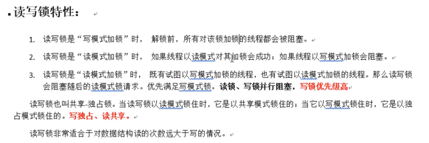

读写锁：

锁只有一把。以读方式给数据加锁——读锁。以写方式给数据加锁——写锁。

读共享，写独占。

写锁优先级高。

相较于互斥量而言，当读线程多的时候，提高访问效率

pthread_rwlock_t rwlock;

pthread_rwlock_init(&rwlock, NULL);

pthread_rwlock_rdlock(&rwlock); try

pthread_rwlock_wrlock(&rwlock); try

pthread_rwlock_unlock(&rwlock);

pthread_rwlock_destroy(&rwlock);

以上函数都是成功返回0，失败返回错误号。

pthread_rwlock_t 类型 用于定义一个读写锁变量

pthread_rwlock_t rwlock

## 171P-两种死锁

【死锁】：

是使用锁不恰当导致的现象：

1\. 对一个锁反复lock。

2\. 两个线程，各自持有一把锁，请求另一把。

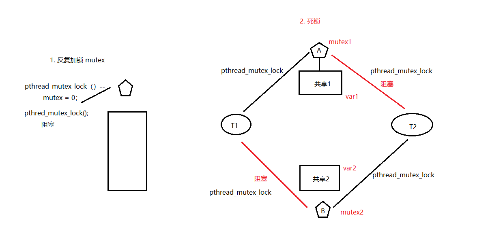

## 172P-读写锁原理

读写锁：

锁只有一把。以读方式给数据加锁——读锁。以写方式给数据加锁——写锁。

读共享，写独占。

写锁优先级高。

相较于互斥量而言，当读线程多的时候，提高访问效率

pthread_rwlock_t rwlock;

pthread_rwlock_init(&rwlock, NULL);

pthread_rwlock_rdlock(&rwlock); try

pthread_rwlock_wrlock(&rwlock); try

pthread_rwlock_unlock(&rwlock);

pthread_rwlock_destroy(&rwlock);

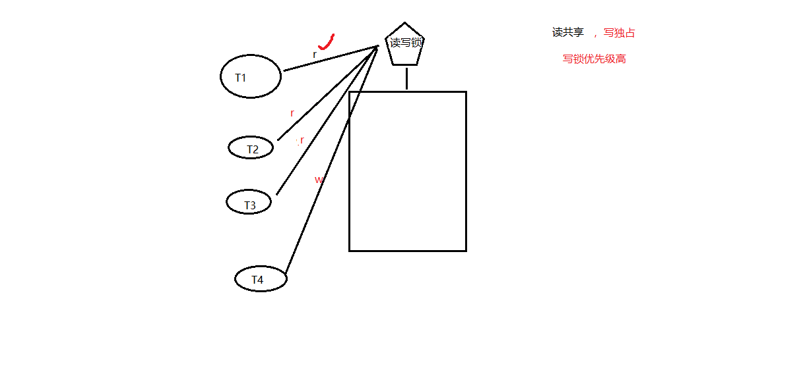

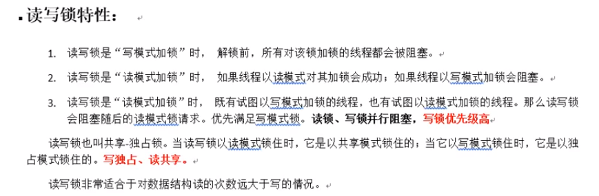

## 173P-rwlock

一个读写锁的例子，核心还是

读共享，写独占。

写锁优先级高。

1.  /\* 3个线程不定时 "写" 全局资源，5个线程不定时 "读" 同一全局资源 \*/
2.  
3.  \#include \<stdio.h\>
4.  \#include \<unistd.h\>
5.  \#include \<pthread.h\>
6.  
7.  **int** counter; //全局资源
8.  pthread_rwlock_t rwlock;
9.  
10.  **void** \*th_write(**void** \*arg)
11.  {
12.  **int** t;
13.  **int** i = (**int**)arg;
14.  
15.  **while** (1) {
16.  t = counter; // 保存写之前的值
17.  usleep(1000);
18.  
19.  pthread_rwlock_wrlock(&rwlock);
20.  printf("=======write %d: %lu: counter=%d ++counter=%d\\n", i, pthread_self(), t, ++counter);
21.  pthread_rwlock_unlock(&rwlock);
22.  
23.  usleep(9000); // 给 r 锁提供机会
24.  }
25.  **return** NULL;
26.  }
27.  
28.  **void** \*th_read(**void** \*arg)
29.  {
30.  **int** i = (**int**)arg;
31.  
32.  **while** (1) {
33.  pthread_rwlock_rdlock(&rwlock);
34.  printf("----------------------------read %d: %lu: %d\\n", i, pthread_self(), counter);
35.  pthread_rwlock_unlock(&rwlock);
36.  
37.  usleep(2000); // 给写锁提供机会
38.  }
39.  **return** NULL;
40.  }
41.  
42.  **int** main(**void**)
43.  {
44.  **int** i;
45.  pthread_t tid[8];
46.  
47.  pthread_rwlock_init(&rwlock, NULL);
48.  
49.  **for** (i = 0; i \< 3; i++)
50.  pthread_create(&tid[i], NULL, th_write, (**void** \*)i);
51.  
52.  **for** (i = 0; i \< 5; i++)
53.  pthread_create(&tid[i+3], NULL, th_read, (**void** \*)i);
54.  
55.  **for** (i = 0; i \< 8; i++)
56.  pthread_join(tid[i], NULL);
57.  
58.  pthread_rwlock_destroy(&rwlock); //释放读写琐
59.  
60.  **return** 0;
61.  }

编译运行，结果如下：

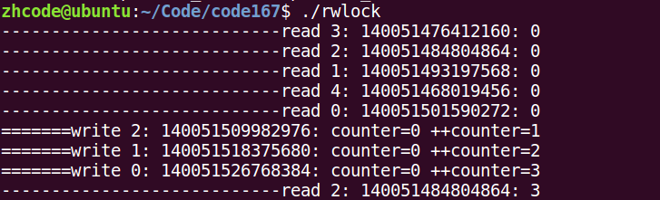

程序输出飞快，随便截个图，如上图。

由于读共享，写独占。写锁优先级高。前面5个read一定先于后面的write到达的，不然write会抢到锁先进行写操作。

## 174P-午后复习

## 175P-静态初始化条件变量和互斥量

条件变量：

本身不是锁！ 但是通常结合锁来使用。 mutex

主要应用函数：

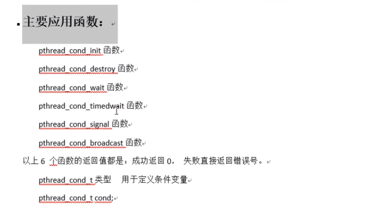

pthread_cond_t cond;

初始化条件变量：

1\. pthread_cond_init(&cond, NULL); 动态初始化。

2\. pthread_cond_t cond = PTHREAD_COND_INITIALIZER; 静态初始化。

## 176P-条件变量和相关函数wait

阻塞等待条件：

pthread_cond_wait(&cond, \&mutex);

作用：

1） 阻塞等待条件变量满足

2） 解锁已经加锁成功的信号量 （相当于 pthread_mutex_unlock(&mutex)），12两步为一个原子操作

3) 当条件满足，函数返回时，解除阻塞并重新申请获取互斥锁。重新加锁信号量 （相当于， pthread_mutex_lock(&mutex);）

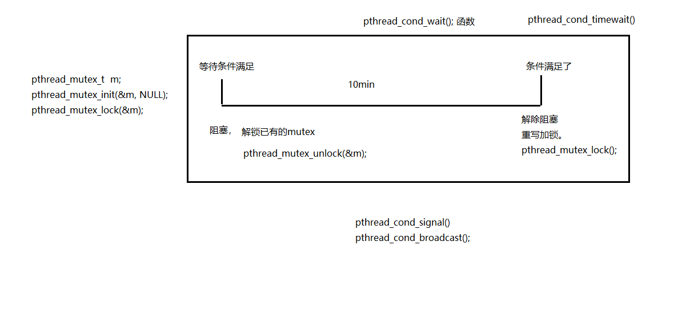

## 177P-条件变量的生产者消费者模型分析

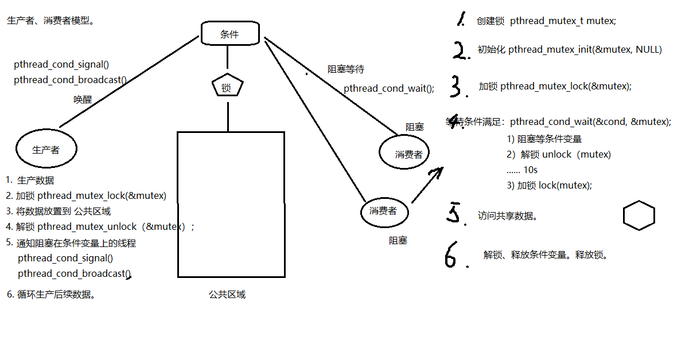

## 178P-条件变量生产者消费者代码预览

代码如下：

1.  /\*借助条件变量模拟 生产者-消费者 问题\*/
2.  \#include \<stdlib.h\>
3.  \#include \<unistd.h\>
4.  \#include \<pthread.h\>
5.  \#include \<stdio.h\>
6.  
7.  /\*链表作为公享数据,需被互斥量保护\*/
8.  **struct** msg {
9.  **struct** msg \*next;
10.  **int** num;
11.  };
12.  
13.  **struct** msg \*head;
14.  
15.  /\* 静态初始化 一个条件变量 和 一个互斥量\*/
16.  pthread_cond_t has_product = PTHREAD_COND_INITIALIZER;
17.  pthread_mutex_t lock = PTHREAD_MUTEX_INITIALIZER;
18.  
19.  **void** \*consumer(**void** \*p)
20.  {
21.  **struct** msg \*mp;
22.  
23.  **for** (;;) {
24.  pthread_mutex_lock(&lock);
25.  **while** (head == NULL) { //头指针为空,说明没有节点 可以为if吗
26.  pthread_cond_wait(&has_product, \&lock); // 解锁，并阻塞等待
27.  }
28.  mp = head;
29.  head = mp-\>next; //模拟消费掉一个产品
30.  pthread_mutex_unlock(&lock);
31.  
32.  printf("-Consume %lu---%d\\n", pthread_self(), mp-\>num);
33.  free(mp);
34.  sleep(rand() % 5);
35.  }
36.  }
37.  
38.  **void** \*producer(**void** \*p)
39.  {
40.  **struct** msg \*mp;
41.  
42.  **for** (;;) {
43.  mp = malloc(**sizeof**(**struct** msg));
44.  mp-\>num = rand() % 1000 + 1; //模拟生产一个产品
45.  printf("-Produce ---------------------%d\\n", mp-\>num);
46.  
47.  pthread_mutex_lock(&lock);
48.  mp-\>next = head;
49.  head = mp;
50.  pthread_mutex_unlock(&lock);
51.  
52.  pthread_cond_signal(&has_product); //将等待在该条件变量上的一个线程唤醒
53.  sleep(rand() % 5);
54.  }
55.  }
56.  
57.  **int** main(**int** argc, **char** \*argv[])
58.  {
59.  pthread_t pid, cid;
60.  srand(time(NULL));
61.  
62.  pthread_create(&pid, NULL, producer, NULL);
63.  pthread_create(&cid, NULL, consumer, NULL);
64.  
65.  pthread_join(pid, NULL);
66.  pthread_join(cid, NULL);
67.  
68.  **return** 0;
69.  }

编译运行，结果如下：

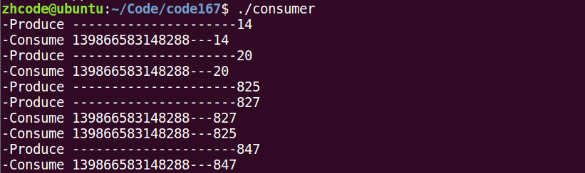

可以看到，消费者按序消费，毕竟是链表。

## 179P-条件变量实现生产者消费者代码

1.  \#include \<stdio.h\>
2.  \#include \<stdlib.h\>
3.  \#include \<string.h\>
4.  \#include \<unistd.h\>
5.  \#include \<errno.h\>
6.  \#include \<pthread.h\>
7.  
8.  **void** err_thread(**int** ret, **char** \*str)
9.  {
10.  **if** (ret != 0) {
11.  fprintf(stderr, "%s:%s\\n", str, strerror(ret));
12.  pthread_exit(NULL);
13.  }
14.  }
15.  
16.  **struct** msg {
17.  **int** num;
18.  **struct** msg \*next;
19.  };
20.  
21.  **struct** msg \*head;
22.  
23.  pthread_mutex_t mutex = PTHREAD_MUTEX_INITIALIZER; // 定义/初始化一个互斥量
24.  pthread_cond_t has_data = PTHREAD_COND_INITIALIZER; // 定义/初始化一个条件变量
25.  
26.  **void** \*produser(**void** \*arg)
27.  {
28.  **while** (1) {
29.  **struct** msg \*mp = malloc(**sizeof**(**struct** msg));
30.  
31.  mp-\>num = rand() % 1000 + 1; // 模拟生产一个数据\`
32.  printf("--produce %d\\n", mp-\>num);
33.  
34.  pthread_mutex_lock(&mutex); // 加锁 互斥量
35.  mp-\>next = head; // 写公共区域
36.  head = mp;
37.  pthread_mutex_unlock(&mutex); // 解锁 互斥量
38.  
39.  pthread_cond_signal(&has_data); // 唤醒阻塞在条件变量 has_data上的线程.
40.  
41.  sleep(rand() % 3);
42.  }
43.  
44.  **return** NULL;
45.  }
46.  
47.  **void** \*consumer(**void** \*arg)
48.  {
49.  **while** (1) {
50.  **struct** msg \*mp;
51.  
52.  pthread_mutex_lock(&mutex); // 加锁 互斥量
53.  **if** (head == NULL) {
54.  pthread_cond_wait(&has_data, \&mutex); // 阻塞等待条件变量, 解锁
55.  } // pthread_cond_wait 返回时, 重写加锁 mutex
56.  
57.  mp = head;
58.  head = mp-\>next;
59.  
60.  pthread_mutex_unlock(&mutex); // 解锁 互斥量
61.  printf("---------consumer:%d\\n", mp-\>num);
62.  
63.  free(mp);
64.  sleep(rand()%3);
65.  }
66.  
67.  **return** NULL;
68.  }
69.  
70.  **int** main(**int** argc, **char** \*argv[])
71.  {
72.  **int** ret;
73.  pthread_t pid, cid;
74.  
75.  srand(time(NULL));
76.  
77.  ret = pthread_create(&pid, NULL, produser, NULL); // 生产者
78.  **if** (ret != 0)
79.  err_thread(ret, "pthread_create produser error");
80.  
81.  ret = pthread_create(&cid, NULL, consumer, NULL); // 消费者
82.  **if** (ret != 0)
83.  err_thread(ret, "pthread_create consuer error");
84.  
85.  pthread_join(pid, NULL);
86.  pthread_join(cid, NULL);
87.  
88.  **return** 0;
89.  }

编译运行，结果如下：

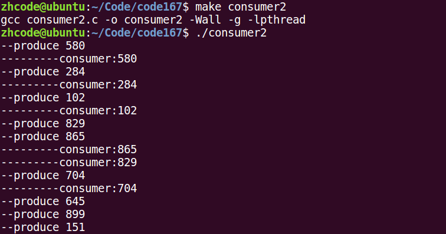

## 180P-多个消费者使用while做

先看一个手动创建多个消费者的代码：

1.  \#include \<stdio.h\>
2.  \#include \<stdlib.h\>
3.  \#include \<string.h\>
4.  \#include \<unistd.h\>
5.  \#include \<errno.h\>
6.  \#include \<pthread.h\>
7.  
8.  **void** err_thread(**int** ret, **char** \*str)
9.  {
10.  **if** (ret != 0) {
11.  fprintf(stderr, "%s:%s\\n", str, strerror(ret));
12.  pthread_exit(NULL);
13.  }
14.  }
15.  
16.  **struct** msg {
17.  **int** num;
18.  **struct** msg \*next;
19.  };
20.  
21.  **struct** msg \*head;
22.  
23.  pthread_mutex_t mutex = PTHREAD_MUTEX_INITIALIZER; // 定义/初始化一个互斥量
24.  pthread_cond_t has_data = PTHREAD_COND_INITIALIZER; // 定义/初始化一个条件变量
25.  
26.  **void** \*produser(**void** \*arg)
27.  {
28.  **while** (1) {
29.  **struct** msg \*mp = malloc(**sizeof**(**struct** msg));
30.  
31.  mp-\>num = rand() % 1000 + 1; // 模拟生产一个数据\`
32.  printf("--produce %d\\n", mp-\>num);
33.  
34.  pthread_mutex_lock(&mutex); // 加锁 互斥量
35.  mp-\>next = head; // 写公共区域
36.  head = mp;
37.  pthread_mutex_unlock(&mutex); // 解锁 互斥量
38.  
39.  pthread_cond_signal(&has_data); // 唤醒阻塞在条件变量 has_data上的线程.
40.  
41.  sleep(rand() % 3);
42.  }
43.  
44.  **return** NULL;
45.  }
46.  
47.  **void** \*consumer(**void** \*arg)
48.  {
49.  **while** (1) {
50.  **struct** msg \*mp;
51.  
52.  pthread_mutex_lock(&mutex); // 加锁 互斥量
53.  **if** (head == NULL) {
54.  pthread_cond_wait(&has_data, \&mutex); // 阻塞等待条件变量, 解锁
55.  } // pthread_cond_wait 返回时, 重写加锁 mutex
56.  
57.  mp = head;
58.  head = mp-\>next;
59.  
60.  pthread_mutex_unlock(&mutex); // 解锁 互斥量
61.  printf("---------consumer id = %lu :%d\\n", pthread_self(), mp-\>num);
62.  
63.  free(mp);
64.  sleep(rand()%3);
65.  }
66.  
67.  **return** NULL;
68.  }
69.  
70.  **int** main(**int** argc, **char** \*argv[])
71.  {
72.  **int** ret;
73.  pthread_t pid, cid;
74.  
75.  srand(time(NULL));
76.  
77.  ret = pthread_create(&pid, NULL, produser, NULL); // 生产者
78.  **if** (ret != 0)
79.  err_thread(ret, "pthread_create produser error");
80.  
81.  ret = pthread_create(&cid, NULL, consumer, NULL); // 消费者
82.  **if** (ret != 0)
83.  err_thread(ret, "pthread_create consuer error");
84.  
85.  ret = pthread_create(&cid, NULL, consumer, NULL); // 消费者
86.  **if** (ret != 0)
87.  err_thread(ret, "pthread_create consuer error");
88.  
89.  ret = pthread_create(&cid, NULL, consumer, NULL); // 消费者
90.  **if** (ret != 0)
91.  err_thread(ret, "pthread_create consuer error");
92.  
93.  pthread_join(pid, NULL);
94.  pthread_join(cid, NULL);
95.  
96.  **return** 0;
97.  }

编译运行，结果如下：

这个代码还是有问题的。比如，两个消费者都阻塞在条件变量上，就是说没有数据可以消费。完事儿都把锁还回去了，生产者此时生产了一个数据，会同时唤醒两个因条件变量阻塞的消费者，完事儿两个消费者去抢锁。结果就是A消费者拿到锁，开始消费数据，B消费者阻塞在锁上。之后A消费完数据，把锁归还，B被唤醒，然而此时已经没有数据供B消费了。所以这里有个逻辑错误，消费者阻塞在条件变量那里应该使用while循环。这样A消费完数据后，B做的第一件事不是去拿锁，而是判定条件变量。

## 181P-条件变量signal注意事项

pthread_cond_signal(): 唤醒阻塞在条件变量上的 (至少)一个线程。

pthread_cond_broadcast()： 唤醒阻塞在条件变量上的 所有线程。

## 182P-信号量概念及其相关操作函数

信号量：

应用于线程、进程间同步。

相当于 初始化值为 N 的互斥量。 N值，表示可以同时访问共享数据区的线程数。

函数：

sem_t sem; 定义类型。

int sem_init(sem_t \*sem, int pshared, unsigned int value);

参数：

sem： 信号量

pshared： 0： 用于线程间同步

1： 用于进程间同步

value：N值。（指定同时访问的线程数）

sem_destroy();

sem_wait(); 一次调用，做一次-- 操作， 当信号量的值为 0 时，再次 -- 就会阻塞。 （对比 pthread_mutex_lock）

sem_post(); 一次调用，做一次++ 操作. 当信号量的值为 N 时, 再次 ++ 就会阻塞。（对比 pthread_mutex_unlock）

## 183P-信号量实现的生产者消费者

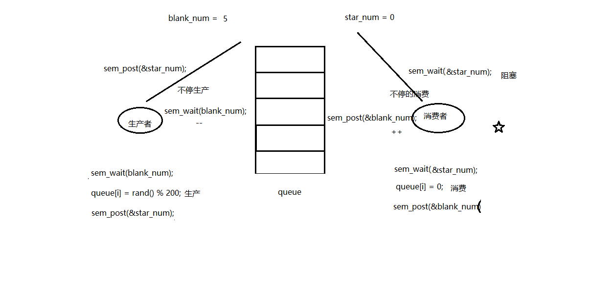

代码如下：

1.  /\*信号量实现 生产者 消费者问题\*/
2.  
3.  \#include \<stdlib.h\>
4.  \#include \<unistd.h\>
5.  \#include \<pthread.h\>
6.  \#include \<stdio.h\>
7.  \#include \<semaphore.h\>
8.  
9.  \#define NUM 5
10.  
11.  **int** queue[NUM]; //全局数组实现环形队列
12.  sem_t blank_number, product_number; //空格子信号量, 产品信号量
13.  
14.  **void** \*producer(**void** \*arg)
15.  {
16.  **int** i = 0;
17.  
18.  **while** (1) {
19.  sem_wait(&blank_number); //生产者将空格子数--,为0则阻塞等待
20.  queue[i] = rand() % 1000 + 1; //生产一个产品
21.  printf("----Produce---%d\\n", queue[i]);
22.  sem_post(&product_number); //将产品数++
23.  
24.  i = (i+1) % NUM; //借助下标实现环形
25.  sleep(rand()%1);
26.  }
27.  }
28.  
29.  **void** \*consumer(**void** \*arg)
30.  {
31.  **int** i = 0;
32.  
33.  **while** (1) {
34.  sem_wait(&product_number); //消费者将产品数--,为0则阻塞等待
35.  printf("-Consume---%d\\n", queue[i]);
36.  queue[i] = 0; //消费一个产品
37.  sem_post(&blank_number); //消费掉以后,将空格子数++
38.  
39.  i = (i+1) % NUM;
40.  sleep(rand()%3);
41.  }
42.  }
43.  
44.  **int** main(**int** argc, **char** \*argv[])
45.  {
46.  pthread_t pid, cid;
47.  
48.  sem_init(&blank_number, 0, NUM); //初始化空格子信号量为5, 线程间共享 -- 0
49.  sem_init(&product_number, 0, 0); //产品数为0
50.  
51.  pthread_create(&pid, NULL, producer, NULL);
52.  pthread_create(&cid, NULL, consumer, NULL);
53.  
54.  pthread_join(pid, NULL);
55.  pthread_join(cid, NULL);
56.  
57.  sem_destroy(&blank_number);
58.  sem_destroy(&product_number);
59.  
60.  **return** 0;
61.  }

编译运行，结果如下：

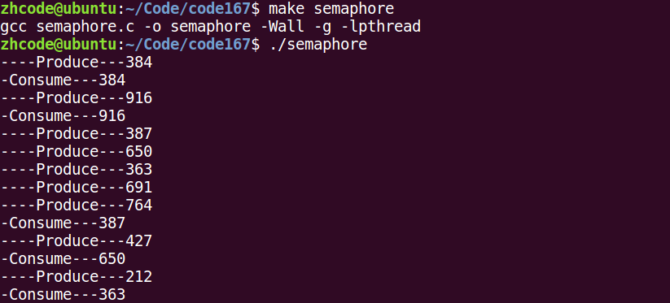

## 184P-总结

线程同步：

协同步调，对公共区域数据按序访问。防止数据混乱，产生与时间有关的错误。

锁的使用：

建议锁！对公共数据进行保护。所有线程【应该】在访问公共数据前先拿锁再访问。但，锁本身不具备强制性。

使用mutex(互斥量、互斥锁)一般步骤：

pthread_mutex_t 类型。

1\. pthread_mutex_t lock; 创建锁

2 pthread_mutex_init; 初始化 1

3\. pthread_mutex_lock;加锁 1-- --\> 0

4\. 访问共享数据（stdout)

5\. pthrad_mutext_unlock();解锁 0++ --\> 1

6\. pthead_mutex_destroy；销毁锁

初始化互斥量：

pthread_mutex_t mutex;

1\. pthread_mutex_init(&mutex, NULL); 动态初始化。

2\. pthread_mutex_t mutex = PTHREAD_MUTEX_INITIALIZER; 静态初始化。

注意事项：

尽量保证锁的粒度， 越小越好。（访问共享数据前，加锁。访问结束【立即】解锁。）

互斥锁，本质是结构体。 我们可以看成整数。 初值为 1。（pthread_mutex_init() 函数调用成功。）

加锁： --操作， 阻塞线程。

解锁： ++操作， 换醒阻塞在锁上的线程。

try锁：尝试加锁，成功--。失败，返回。同时设置错误号 EBUSY

restrict关键字：

用来限定指针变量。被该关键字限定的指针变量所指向的内存操作，必须由本指针完成。

【死锁】：

是使用锁不恰当导致的现象：

1\. 对一个锁反复lock。

2\. 两个线程，各自持有一把锁，请求另一把。

读写锁：

锁只有一把。以读方式给数据加锁——读锁。以写方式给数据加锁——写锁。

读共享，写独占。

写锁优先级高。

相较于互斥量而言，当读线程多的时候，提高访问效率

pthread_rwlock_t rwlock;

pthread_rwlock_init(&rwlock, NULL);

pthread_rwlock_rdlock(&rwlock); try

pthread_rwlock_wrlock(&rwlock); try

pthread_rwlock_unlock(&rwlock);

pthread_rwlock_destroy(&rwlock);

条件变量：

本身不是锁！ 但是通常结合锁来使用。 mutex

pthread_cond_t cond;

初始化条件变量：

1\. pthread_cond_init(&cond, NULL); 动态初始化。

2\. pthread_cond_t cond = PTHREAD_COND_INITIALIZER; 静态初始化。

阻塞等待条件：

pthread_cond_wait(&cond, \&mutex);

作用： 1） 阻塞等待条件变量满足

2） 解锁已经加锁成功的信号量 （相当于 pthread_mutex_unlock(&mutex)）

3) 当条件满足，函数返回时，重新加锁信号量 （相当于， pthread_mutex_lock(&mutex);）

pthread_cond_signal(): 唤醒阻塞在条件变量上的 (至少)一个线程。

pthread_cond_broadcast()： 唤醒阻塞在条件变量上的 所有线程。

【要求，能够借助条件变量，完成生成者消费者】

信号量：

应用于线程、进程间同步。

相当于 初始化值为 N 的互斥量。 N值，表示可以同时访问共享数据区的线程数。

函数：

sem_t sem; 定义类型。

int sem_init(sem_t \*sem, int pshared, unsigned int value);

参数：

sem： 信号量

pshared： 0： 用于线程间同步

1： 用于进程间同步

value：N值。（指定同时访问的线程数）

sem_destroy();

sem_wait(); 一次调用，做一次-- 操作， 当信号量的值为 0 时，再次 -- 就会阻塞。 （对比 pthread_mutex_lock）

sem_post(); 一次调用，做一次++ 操作. 当信号量的值为 N 时, 再次 ++ 就会阻塞。（对比 pthread_mutex_unlock）