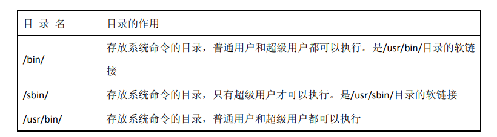
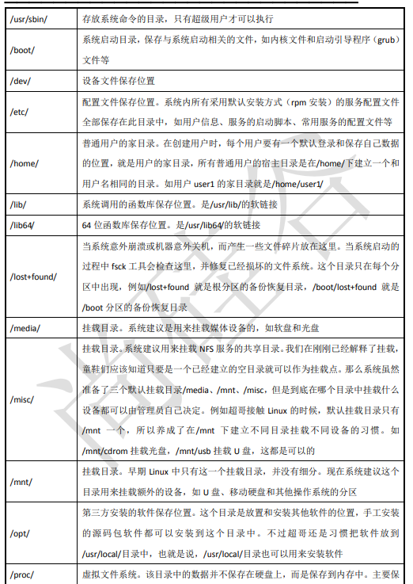

1. Linux 严格区分大小写
   1. Linux 是严格区分大小写的，这一点和 Windows 不一样，所以操作时要注意区分大小写的不同,包括文件名和目录名、命令、命令选项、配置文件设置选项等。
   2. Linux的命令一般是小写，而其操作参数可能为大写。
   3. 大小写不同的文件名是两个文件。
2. Linux 一切皆文件
   1. Linux 中所有内容都是以文件的形式保存和管理的，硬件设备也是文件，这和 Windows 完全不同Windows 是通过设备管理器来管理硬件的。Linux 的设备文件保存在/dev/目录中，硬盘文件是/dev/sd[a-p]，光盘文件是/dev/hdc 等。
3. Linux 不靠扩展名区分文件类型
   1. Windows 是依赖扩展名区分文件类型的，比如，“.txt”是文本文件、“.exe”是执行文件、“.ini”是配置文件、“.mp4”是小电影等。但 Linux 不是靠扩展名区分文件类型的而是靠权限位标识来确定文件类型的，而且文件类型的种类也不像 Windows 下那么多，常见的文件类型只有普通文件、目录链接文件、块设备文件、字符设备文件等几种。Linux 的可执行文件不过就是普通文件被赋予了可执行权限而已。
   2. 但 Linux 中的一些特殊文件还是要求写“扩展名”的，但是大家小心，并不是 Linux 一定要靠扩展名来识别文件类型，写这些扩展名是为了帮助管理员来区分不同的文件类型。这样的文件扩展名主要有以下几种。
      1. 压缩包: Linux 下常见的压缩文件名有*,gz、*,b2、*.zip、*.targz、*.tarbz2、*.tgz 等。为什么压缩包一定要写扩展名呢?其实很好理解，如果不写清楚扩展名，那么管理员不容易判断压缩包的格式，虽然有命令可以帮助判断，但是直观一点更加方便。另外，就算没写扩展名，在 Linux 中一样可以解压缩，不影响使用。
         1. 由于不同的压缩包的压缩形式不同，对其进行的解压操作也是不同的，通过对其进行后缀的标识，可以方便的对其进行解压操作
      2. 二进制软件包: Centos 中所使用的二进制安装包是 RPM 包，所有的 RPM 包都用“.rpm”扩展名结尾，目的同样是让管理员一目了然
      3. 程序文件: Shell 脚本一般用“*sh”扩展名结尾，其他还有用“*.c”扩展名结尾的 C语言文件等。
      4. 网页文件: 网页文件一般使用“*.html”“*.php”等结尾，不过这是网页服务器的要求，而不是 Linux的要求。
         1. 只有这样网页服务器才能方便的管理
4. Linux 中所有的存储设备都必须在挂载之后才能使用
   1. Linux 中所有的存储设备都有自己的设备文件名，这些设备文件必须在挂载之后才能使用，包括硬盘、U 盘和光盘。挂载其实就是给这些存储设备分配盘符，只不过 Windows 中的盘符用英文字母表示,而Linux中的盘符则是一个已经建立的空目录。我们把这些空目录叫作挂载点(可以理解为Windows的盘符)，把设备文件 (如/dev/sdb) 和挂载点 (已经建立的空目录) 连接的过程叫作挂载
   2. Linux中，硬盘是自动挂载的，而U盘和光盘均是手动挂载的
   3. Windows中，所有盘都是自动挂载的，但对于U盘来说，其卸载需要进行手动操作。
5. Windows 下的程序不能直接在 Linux 中使用
   1. Linux 和 Windows 是不同的操作系统，可以安装和使用的软件也是不同的，所以能够在 Windows中安装的软件是不能在 Linux 中安装的。
      1. 有好处吗? 当然有，那就是能够感染 Windows 的病毒和木马都对 Linux 无效。安全稳定。
      2. 有坏处吗? 也有，那就是所有的软件要想在 Linux 中安装，必须单独开发针对 Linux的版本，或者依赖模拟器软件运行。适配性不好
   2. 很多软件也会同时推出针对 Windows 和 Linux 的版本，如大家熟悉的即时通信软件 QQ.

### 服务器管理建议

1. 了解linux目录结构
   1. 
   2. 
   3. 