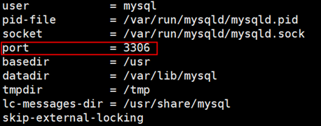
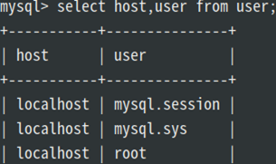
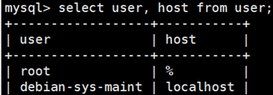

## windows 连接linux上的mysql

**案例环境**  
ubuntu16.04，MySql5.7

**1\. 安装mysql**

查看是否已安装

```bash
mysql --version
```

安装命令

```bash
sudo apt-get install mysql-server
```

**2.查看3306端口是否开放远程连接**

```bash
netstat -an|grep 3306
```

下图所示，绑定本机，没有开启远程访问  
  
**3.修改配置文件使其可以远程连接**

```bash
sudo vi /etc/mysql/mysql.conf.d/mysqld.cnf
```

在默认情况下我们只允许本地服务访问MySQL，因此只是掉注释掉bind-address即可，当然如果出于安全考虑也可以指定某一个ip地址可以访问。  
  
也可以进行端口号的修改（一般不做修改）  
  
**4.开放root账户的访问权限**  
以上是解除了远程访问的限制，以下对账户权限设置  
重启mysql并进入mysql，并切换到mysql表

```bash
service mysql restart
mysql mysql -uroot -p
use mysql
```

查看账户信息

```bash
select user, host from user;
```

  
查看结果说明只能本地访问，没有设定外部访问的用户，接下来我们给root用户赋予外部访问的权限。执行两条语句

```bash
#开放root账户所有权限
grant all privileges on *.* to ‘root’@'%' identified by 'password' with grant option;
或
#开放root账户指定网段可访问
grant all privileges on *.* to 'root'@'192.168.1.%' identified by 'password' with grant option;
#使权限设置立即生效
flush privileges;
```

再次查看mysql表

```bash
select user, host from user;
```

表示授权成功  
  
重启mysql即可

```bash
service mysql restart
```

**Mysql授权语法扩展**

- grant 权限1,权限2,…权限n on 数据库名.表名 to 用户名@用户地址 identified by ‘用户密码’ with grant option;
  
- 权限1,权限2,…权限n代表select,insert,update,delete,create,drop,index,alter,grant,references,reload,shutdown,process,file等权限。如果是all privileges或者all，表示赋予用户全部权限。
  
- 如果数据库名.表名被\*.\*代替，表示赋予该用户可以操作服务器上所有数据库所有表的权限。
  
- 用户地址可以是localhost，也可以是ip地址、机器名字、域名。也可以用’%'表示从任何地址。‘用户密码’必须提供。 最后的 with
  
- grant option 表示权限传递，意思是允许该用户将其权限分配给其他人。