整体的架构图

  

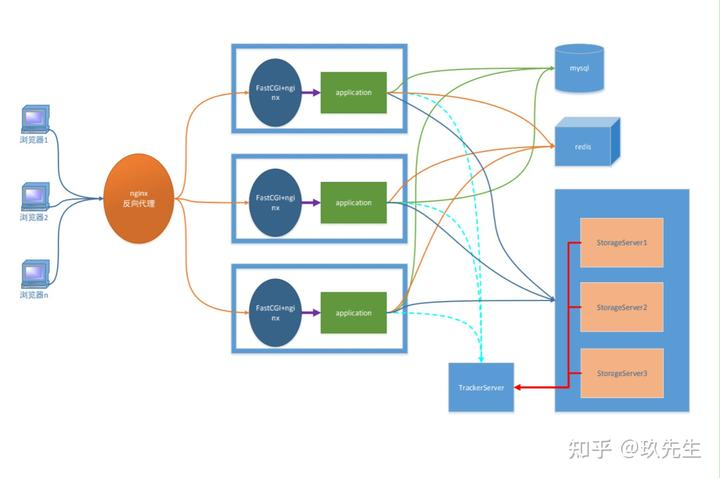


  

> 1.分布式存储器 fast-dfs  
> 2.缓存数据库 redis  
> 3.数据库 MySql  
> 4.HTTP协议  
> 5.服务器nginx  
> 6.动态请求处理fastcgi spawn-fcgi  
> 7.客户端Qt  

## 根据客户端的功能分模块总结

## 客户端的目录构成

  

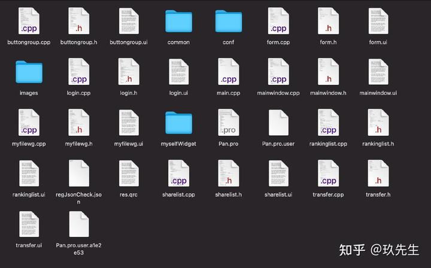


  

- `common`公共接口，里面就是各个模块会用到的一些公共接口
- `conf`：配置文件的目录
- `images`:软件中用到的图片
- `myselfWidget` 自绘控件

  


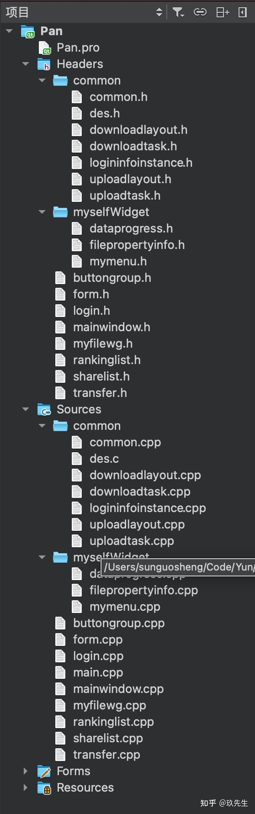

  

## 服务器设置功能

  

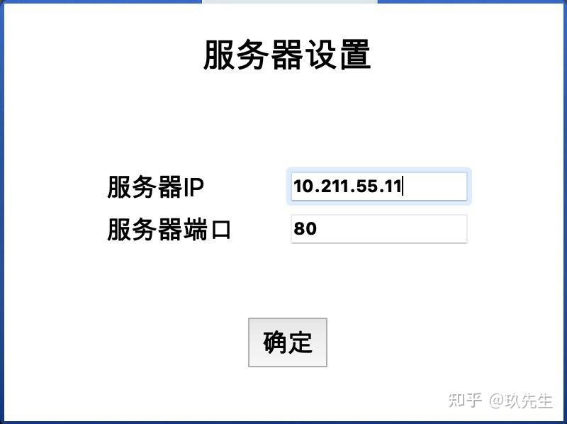

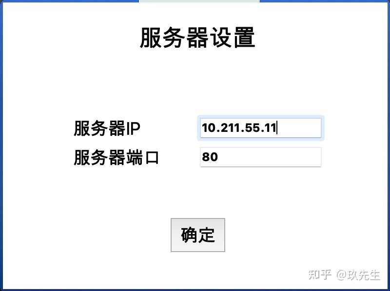

  

- 服务器的配置信息是写进配置文件的
- 配置文件的格式是JSON,`web_server`里面保存的就是IP和PORT

```json
{
    "login": {
        "pwd": "wqq2b4Ild/w=",
        "remember": "yes",
        "user": "Mi/CvL0kLkQ="
    },
    "type_path": {
        "path": "/Users/sunguosheng/Code/Yun/Pan/conf/fileType"
    },
    "web_server": {
        "ip": "10.211.55.11",
        "port": "80"
    }
}
```

- 程序第一次运行，这个配置文件是主动生成的，里面会写入默认的信息

```cpp
int Login::createWebConf(QString path)；
```

- 当用户输入了信息，会把 `web_server`的json对象的内容进行改写，其余的项保持默认
- 在组织 `json`信息的时候，使用了`QMAP`

```text
QMap<QString,Qvariant> info;

QJsonDocument::fromVariant(info);
```

## 注册时客户端和服务器的流程

  


  

- 用户注册的这些信息都是用正则表达式进行验证的

```cpp
// 正则表达式
#define USER_REG        "^[a-zA-Z\\d_@#-\\*]{3,16}$"
#define PASSWD_REG      "^[a-zA-Z\\d_@#-\\*]{6,18}$"
#define PHONE_REG       "^1(3[0-9]|4[01456879]|5[0-35-9]|6[2567]|7[0-8]|8[0-9]|9[0-35-9])\\d{8}$"
#define EMAIL_REG       "^\\w+([-+.]\\w+)*@\\w+([-.]\\w+)*\\.\\w+([-.]\\w+)*$"
#define IP_REG          "((2[0-4]\\d|25[0-5]|[01]?\\d\\d?)\\.){3}(2[0-4]\\d|25[0-5]|[01]?\\d\\d?)"
#define PORT_REG        "^[1-9]$|(^[1-9][0-9]$)|(^[1-9][0-9][0-9]$)|(^[1-9][0-9][0-9][0-9]$)|(^[1-6][0-5][0-5][0-3][0-5]$)"
//数据的校验
    QRegExp ex(USER_REG);
    if(!ex.exactMatch(username))
    {
        QMessageBox::critical(this,"错误",QString("你输入的用户名不符合规范!"));
        ui->reg_username->clear();
        ui->reg_username->setFocus();
        return;
    }

        ......
```

  


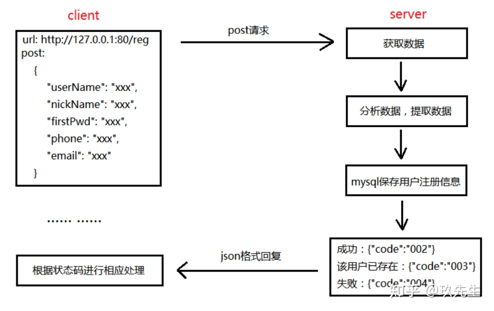

  

- 拿到这些信息，客户端组织信息发送给服务器

### HTTP中自定义的协议

```json
//====================注册用户
127.0.0.1:80/reg

post数据(json)

{
    userName:xxxx,
    nickName:xxx,
    firstPwd:xxx,
    phone:xxx,
    email:xxx
}
//http 请求头的时候，进行设置
QNetworkAccessManager * manager = Login::getNetManager();//保证整个类只有一个对象
QNetworkRequest request;
    request.setHeader(QNetworkRequest::ContentTypeHeader,"application/json");
    request.setHeader(QNetworkRequest::ContentLengthHeader,postData.size());
    QString url = QString("http://%1:%2/reg").arg(ip).arg(port);//直接用ip port的前提条件是有配置文件的初始化
    request.setUrl(QUrl(url));
//发送http数据
    QNetworkReply  *reply = manager->post(request,postData);
```

- 服务器端的操作

```cpp
//解析用户注册信息的json包

int get_reg_info(char *reg_buf, char *user, char *nick_name, char *pwd, char *tel, char *email); //全部传出参数，主调函数分配内存
//---------------------------
//注册用户，成功返回0，失败返回-1, 该用户已存在返回-2

int user_register( char *reg_buf )；
 //数据库的连接信息，从服务器端的配置文件进行读取，也是json格式

 //---------------------------
 //sql 语句, 插入注册信息

    sprintf(sql_cmd, "insert into user (name, nickname, password, phone, createtime, email) values ('%s', '%s', '%s', '%s', '%s', '%s')", user, nick_name, pwd, tel, time_str ,email);
```

### 数据库的设计

```sql
-- =============================================== 用户信息表
-- id：用户序号，自动递增，主键
-- name：用户名字
-- nickname：用户昵称
-- phone：手机号码
-- email：邮箱
-- createtime：时间

create table user
(   id bigint not null primary key AUTO_INCREMENT,
    name VARCHAR(128) not null,
    nickname VARCHAR(128) not null,
    password VARCHAR(128) not null,
    phone VARCHAR(15) not null,
    createtime VARCHAR(128),
    email VARCHAR(100),
    constraint uq_nickname unique(nickname), constraint uq_name unique(name)
);
```

### MD5 的使用(用户注册的密码需要转化为MD5 存储在数据库中)

- MD5用来加密，因为不可逆，所以就用来做数据校验
- 用户的密码是用MD5加密存储的
- 这个密码的MD5转换，代码里面并未加入（测试方便，其实不难）

  

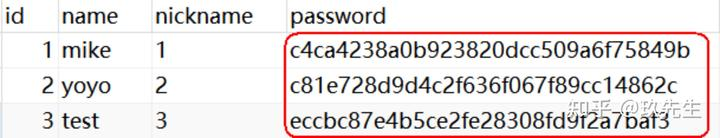

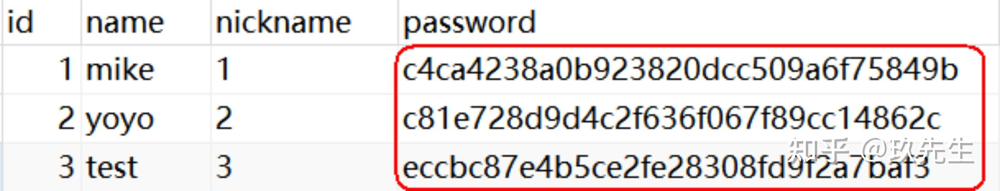

  

- 服务器返回的code码

### 状态码

```json
注册：
    成功：{"code":"002"}
    该用户已存在：{"code":"003"}
    失败：{"code":"004"}
成功： 数据库中没有同名的用户
失败：数据库连接失败，执行sql 语句失败
----------------
具体的错误，可以在服务器的日志系统里面查看
LOG(REG_LOG_MODULE, REG_LOG_PROC, "%s 插入失败：%s\n", sql_cmd, mysql_error(conn));
```

-

## 登录时的客户端和服务器的操作

  


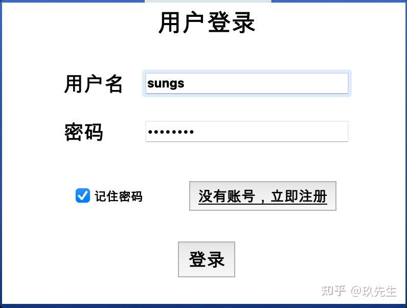

  

### 登录信息获取

- 当用户注册成功后，会自动跳到登录界面，同时登录的用户名和密码都会自动填入
- 记住密码功能，下次启动软件的时候，会自动读取配置文件，把用户名和密码自动填入

### 客户端发送登录信息，服务器进行验证

```json
//====================登陆用户
127.0.0.1:80/login

post数据(json)
{
    user:xxxx,
    pwd:xxx
}
QByteArray data = getLoginJson(old_username,old_passwd);

    //发送HTTP请求，这个对象由静态函数获取，整个项目里面只有一个对象
    QNetworkAccessManager * manager = Login::getNetManager();
    //HTTP 的协议头
    QNetworkRequest request;
    request.setHeader(QNetworkRequest::ContentTypeHeader,"application/json");
    request.setHeader(QNetworkRequest::ContentLengthHeader,data.size());
    QString url = QString("http://%1:%2/login").arg(ip).arg(port);//直接用ip port的前提条件是有配置文件的初始化
    request.setUrl(QUrl(url));

    //发送http数据
    QNetworkReply  *reply = manager->post(request,data);
```

  

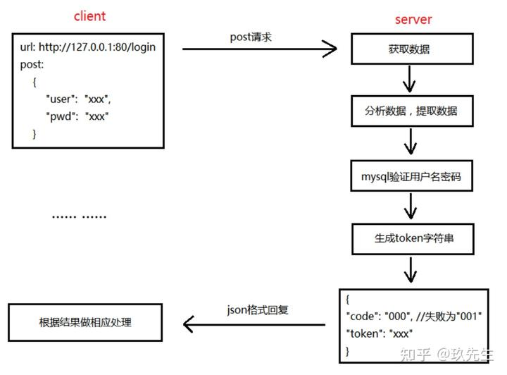

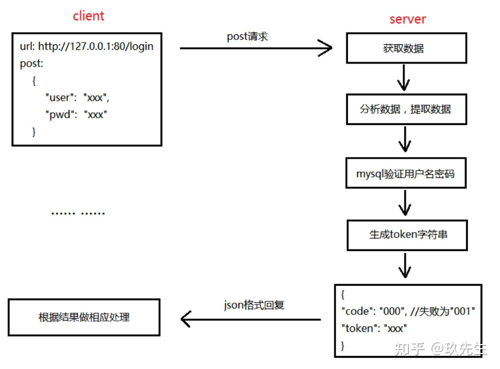

  

### 服务器的操作

```c
//解析用户登陆信息的json包login_buf

//用户名保存在user，密码保存在pwd

int get_login_info(char *login_buf, char *user, char *pwd);
//======================
/*
 * @brief  判断用户登陆情况
 * @param user      用户名
 * @param pwd       密码
 */
int check_user_pwd( char *user, char *pwd );
//sql语句，查找某个用户对应的密码

    sprintf(sql_cmd, "select password from user where name=\"%s\"", user);
//======================
//生成用户的随机的Token，用于后续的操作用户的验证，以提高用户的安全性
//生成的Token会存储在redis中，因为后续token验证后非常频繁，避免每次都去数据库查看，影响效率
int set_token(char *user, char *token)；
//token的生成规则
//1.先生成4个1000以内的数
//2.对这四个数字组成的字符串进行 加密
//3.加密完成后，转化为BASE64
//4.再次转化为32位的MD5串

 // redis保存此字符串，用户名：token, 有效时间为24小时，
 //用户不掉线，24小时后，会要求重新登录
 //每次的重新的登录，都会重新生成对应的token
 rop_setex_string(redis_conn, user, 86400, token);
```

### redis存储的token

  

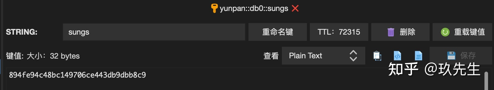


  

### 返回给客户端信息

```json
登陆：
    成功：
        {
            "code": "000",
            "token": "xxx"
        }

    失败：
        {
            "code": "001",
            "token": "xxx"
        }
```

- 成功后，会记录用户的相关信息

```cpp
//保存登录的信息
            logininfoinstance * instance = logininfoinstance::getInstance();
            instance->setLoginInfo(old_username,ip,port,token);
```

-

## 我的文件对应的操作

  


  

  


  

### 根据这两个菜单就可以概括出“我的文件”的功能（点击文件处和点击空白处）

- 文件上传
- 文件下载
- 刷新（按下载量升序，按下载量降序）
- 分享
- 删除
- 属性

## 文件上传

### 文件上传触发的时机

- 点击上传文件item
- 在空白处单击右键

### 文件上传动作前期准备

- 需要创建上传文件的任务队列
- 上传文件的任务队列是一个单例模式的类，一个程序只有一个上传队列

```cpp
//每个任务都是上传文件的信息结构体指针
//每一个上传的文件信息，用这个结构体描述
struct UploadFileInfo
{
    QString md5;        //文件md5码
    QFile *file;        //文件指针
    QString fileName;   //文件名字
    qint64 size;        //文件大小
    QString path;       //文件路径
    bool isUpload;      //是否已经在上传
    DataProgress *dp;   //上传进度控件,这个控件是自定义的控件,用来记录每一个文件传输的进度

};
//单例模式，一个程序只能有一个上传列表
class UploadTask
{
public:
    static UploadTask* getInstance(); //获取唯一的实例

    //追加上传文件到上传列表中
    //参数：path 上传文件路径
    //返回值：成功为0
    //失败：
    //  -1: 文件大于30m
    //  -2：上传的文件是否已经在上传队列中
    //  -3: 打开文件失败
    //  -4: 获取布局失败
    int appendUploadList(QString path);
    //判断上传队列是否为空
    bool isEmpty();
    //判断是否有任务正在上传
    bool isUpload();
    //取出第0个上传任务，如果任务队列没有任务在上传，设置第0个任务上传
    UploadFileInfo * takeTask();
    //删除上传完成的任务
    void dealUploadTask();
    //清空上传列表
    void clearList();
    //获取任务列表里面的任务
    QList<UploadFileInfo*> getUploadTaskList();
private:
    UploadTask();
    ~UploadTask();
    UploadTask(const UploadTask&);
    UploadTask& operator=(const UploadTask&);

    //静态数据成员，这个是要在类外进行初始化
    static UploadTask *instance;

    class Garbo{
    public:
        ~Garbo()
        {
            if(NULL != UploadTask::instance)
            {
                UploadTask::instance->clearList();
                delete UploadTask::instance;
                UploadTask::instance = NULL;
            }

        }
    };

    static Garbo garbo;
    QList<UploadFileInfo*> list;
};

#endif // UPLOADTASK_H
```

- 在进行加入队列的过程中，涉及到 进度条的动态添加

```cpp
//创建一个进度条
    DataProgress *p = new DataProgress;
    p->setFileName(info.fileName()); //给进度条设定一个标题
    tmp->dp = p; //进度条的初始化

    //------------------获取一个布局，把进度条放到其中-----------
    //获取一个垂直布局
    UploadLayout *pUpload = UploadLayout::getInstance();
    if(pUpload == NULL)
    {
        cout<<__FUNCTION__<<"getInstance error";
        return -4;
    }
    //cout<<"走到这里了!";
    //转化为一个垂直布局
    QVBoxLayout *layout = (QVBoxLayout*)pUpload->getUploadLayout();

    // 添加到布局, 最后一个是弹簧, 插入到弹簧上边
    //cout<<__FUNCTION__<<layout->count();
    layout->insertWidget(layout->count()-1, p);
```

- 放置进度条的布局也是一个单例模式的类（也就是上面第8行代码）

```cpp
#ifndef UPLOADLAYOUT_H
#define UPLOADLAYOUT_H

#include "common/common.h"
#include <QVBoxLayout>


//上传进度布局类，单例模式
class UploadLayout
{
public:
    static UploadLayout *getInstance(); //保证唯一一个实例
    void setUploadLayout(QWidget *p); //设置布局
    QLayout *getUploadLayout(); //获取布局

private:
    UploadLayout()
    {

    }

    ~UploadLayout()    //析构函数为私有
    {
    }

    //静态数据成员，类中声明，类外必须定义
    static UploadLayout *instance;
    QLayout *m_layout;
    QWidget *m_wg;

    //它的唯一工作就是在析构函数中删除Singleton的实例
    class Garbo
    {
    public:
        ~Garbo()
        {
            if(NULL != UploadLayout::instance)
            {
                delete UploadLayout::instance;
                UploadLayout::instance = NULL;
                cout << "instance is detele";
            }
        }
    };

    //定义一个静态成员变量，程序结束时，系统会自动调用它的析构函数
    //static类的析构函数在main()退出后调用
    static Garbo temp; //静态数据成员，类中声明，类外定义
};
#endif // UPLOADLAYOUT_H
```

- 定时器定时的检查任务队列，进行处理任务队列

```cpp
//定时检查上传任务，每500ms
    connect(&m_uploadFileTimer,&QTimer::timeout,this,[=](){
        //上传文件处理，取出上传任务列表的队首任务，上传完后，再取下一个任务
        uploadFilesAction();
    });

    //每500ms检查一下上传的任务列表
    //一次只能上传一个任务
    m_uploadFileTimer.start(500);
```

### MD5文件秒传的具体处理

  

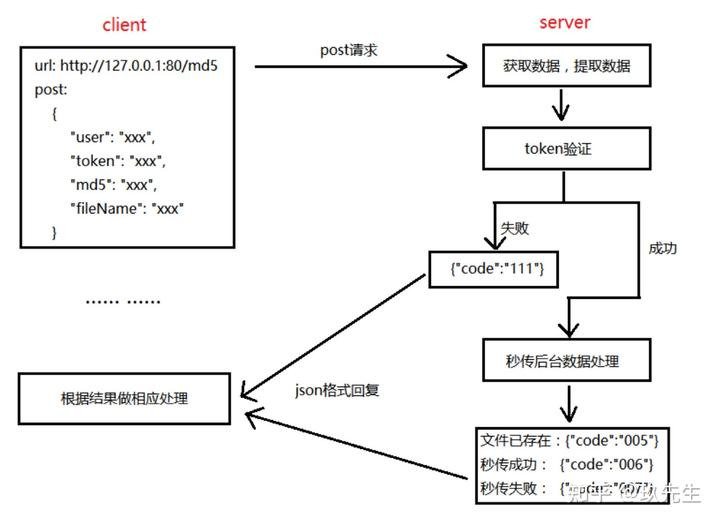

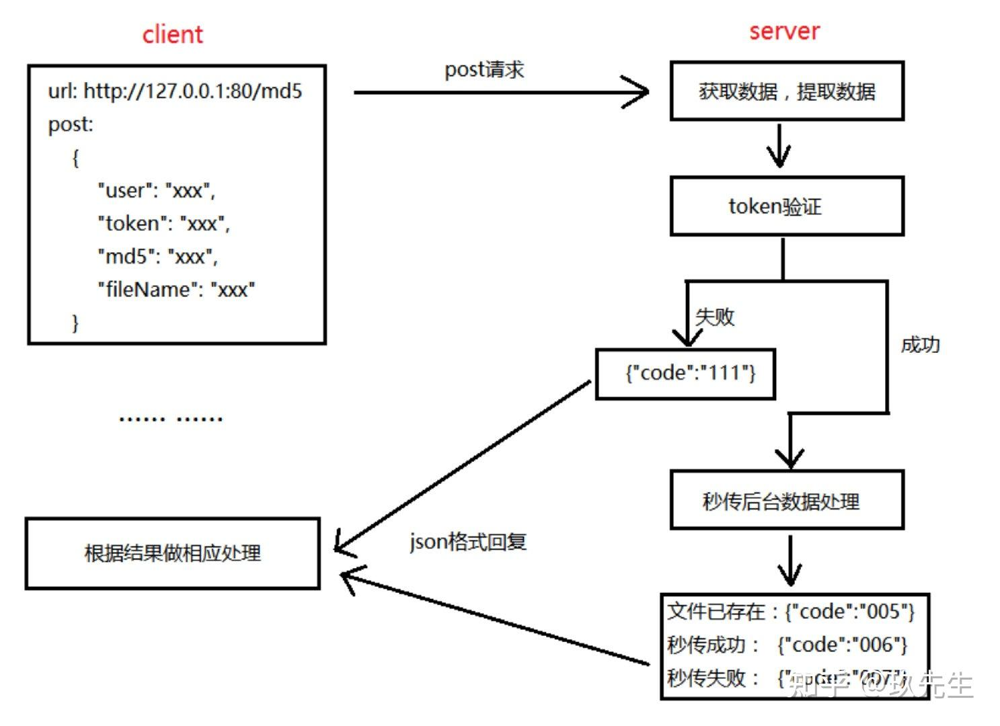

  

- 先进行文件秒传的验证（也就是文件在服务器中已经存在，秒传也就是文件计数+1）

```tex
url: http://127.0.0.1:80/md5
post数据: {
    user:xxxx,
    token:xxxx,
    md5:xxx,
    fileName: xxx
}
```

- 服务器端的处理动作

```c
//解析秒传信息的json包
int get_md5_info(char *buf, char *user, char *token, char *md5, char *filename);
//验证登陆token，成功返回0，失败-1
int verify_token(user, token); //util_cgi.h
//查看数据库是否有此文件的MD5
//sql 语句，获取此md5值文件的文件计数器 count
sprintf(sql_cmd, "select count from file_info where md5 = '%s'", md5);
//如果没有这个文件，返回{"code":"007"};
//如果有这个文件
     //查询这个文件是否是该用户所属的文件
     //查看此用户是否已经有此文件，如果存在说明此文件已上传，无需再上传
sprintf(sql_cmd, "select * from user_file_list where user = '%s' and md5 = '%s' and filename = '%s'", user, md5, filename);
    //返回{"code":"005"}

    //如果有这个文件，但不是这个用户的，就可以进行文件秒传
     //1、修改file_info中的count字段，+1 （count 文件引用计数）
sprintf(sql_cmd, "update file_info set count = %d where md5 = '%s'", ++count, md5);//前置++
    //   update file_info set count = 2 where md5 = "bae488ee63cef72efb6a3f1f311b3743";
    //2、user_file_list插入一条数据
sprintf(sql_cmd, "insert into user_file_list(user, md5, createtime, filename, shared_status, pv) values ('%s', '%s', '%s', '%s', %d, %d)", user, md5, time_str, filename, 0, 0);
        //3.查询该用户所属的文件数，更新数据库
        //若还没有改用户的记录，直接插入
sprintf(sql_cmd, " insert into user_file_count (user, count) values('%s', %d)", user, 1);
        //若已经有用户的记录，就直接更新记录
sprintf(sql_cmd, "update user_file_count set count = %d where user = '%s'", count+1, user);
        //返回{"code":"006"}
```

- 上面服务器操作涉及到的几个数据库表

```sql
-- =============================================== 文件信息表,存储所有的文件信息
-- md5 文件md5
-- file_id 文件id
-- url 文件url
-- size 文件大小, 以字节为单位
-- type 文件类型： png, zip, mp4……
-- count 文件引用计数， 默认为1， 每增加一个用户拥有此文件，此计数器+1
create table file_info
(
    md5 varchar(200) not null primary key,
    file_id varchar(256) not null,
    url varchar(512) not null,
    size bigint,
    type VARCHAR(20),
    count int
);

-- =============================================== 用户文件列表

-- user 文件所属用户
-- md5 文件md5
-- createtime 文件创建时间
-- filename 文件名字
-- shared_status 共享状态, 0为没有共享， 1为共享
-- pv 文件下载量，默认值为0，下载一次加1
create table user_file_list
(
    user varchar(128) not null,
    md5 varchar(200) not null,
    createtime VARCHAR(128),
    filename varchar(128),
    shared_status int, 
    pv int
);
-- =============================================== 用户文件数量表
-- user     文件所属用户
-- count    拥有文件的数量
create table user_file_count
(
    user varchar(128) not null primary key,
    count int
);
```

- 服务器返回的code

```json
token验证成功：{"code":"110"}
token验证失败：{"code":"111"}

秒传文件：
    文件已存在：{"code":"005"}
    秒传成功：  {"code":"006"}
    秒传失败：  {"code":"007"}
```

### 真正的上传文件

  

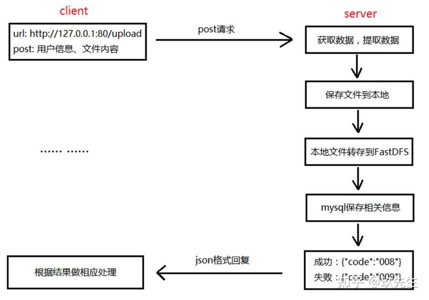

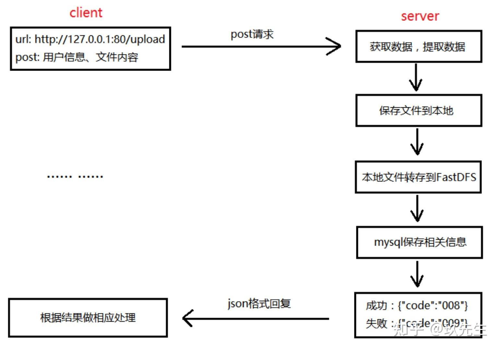

  

- 客户端发送的信息

```tex
url:http://127.0.0.1:80/upload

 post数据:
------WebKitFormBoundary88asdgewtgewx\r\n
Content-Disposition: form-data; user="mike"; 
filename="xxx.jpg"; md5="xxxx"; size=10240\r\n
Content-Type: application/octet-stream\r\n \r\n
真正的文件内容\r\n
------WebKitFormBoundary88asdgewtgewx
```

- 客户端这边主要的一步就是构造出发送的数据

```cpp
QByteArray data;
    //分割线
    data.append(boundary);// QString boundary= m_comm.getBoundary();
    data.append("\r\n");
    //文件的信息

    data.append("Content-Disposition: form-data; ");
    data.append( QString("user=\"%1\" ").arg( login->getUserName() ) ); //上传用户
    data.append( QString("filename=\"%1\" ").arg(fileName) ); //文件名字
    data.append( QString("md5=\"%1\" ").arg(md5) ); //文件md5码
    data.append( QString("size=%1").arg(size)  );   //文件大小
    data.append("\r\n");
    //数据的格式
    data.append(QString("Content-Type: application/octet-stream"));
    data.append("\r\n\r\n");

    //要发送的真正的数据
    data.append(file->readAll());
    data.append("\r\n");
    //添加分割线
    data.append(boundary);
```

- 服务器端的操作

```c
//解析上传的文件，得倒文件的上传者，文件名，文件的MD5，文件的大小；同时把文件保存在临时目录下
int recv_save_file(long len, char *user, char *filename, char *md5, long *p_size)；
//将文件上传到fast-DFS，得倒文件的ID
int upload_to_dstorage(char *filename, char *fileid)；
//得到该文件的URL下载地址
int make_file_url(char *fileid, char *fdfs_file_url)；
//将上传文件的fast-DFS 的相关信息上传到mysql 
store_fileinfo_to_mysql(user, filename, md5, size, fileid, fdfs_file_url)；
sprintf(sql_cmd, "insert into file_info (md5, file_id, url, size, type, count) values ('%s', '%s', '%s', '%ld', '%s', %d)",md5, fileid, fdfs_file_url, size, suffix, 1);
sprintf(sql_cmd, "insert into user_file_list(user, md5, createtime, filename, shared_status, pv) values ('%s', '%s', '%s', '%s', %d, %d)", user, md5, create_time, filename, 0, 0);
//判断该用户是否已经有上传的记录
//查询用户文件数量
sprintf(sql_cmd, "select count from user_file_count where user = '%s'", user);
//有记录，更新值
sprintf(sql_cmd, "update user_file_count set count = %d where user = '%s'", count+1, user);
//没有记录，插入新的记录
sprintf(sql_cmd, " insert into user_file_count (user, count) values('%s', %d)", user, 1);
```

- 服务器返回code

```json
token验证成功：{"code":"110"}
token验证失败：{"code":"111"}

上传文件：
    成功：{"code":"008"}
    失败：{"code":"009"}
```

-

## 文件下载

### 文件下载前的准备

- 需要下载任务的队列
- 下载任务每一个进度条的布局，下载任务的布局类
- 上面两部分的实现和上传是一样的处理方法

### 下载的具体操作

  


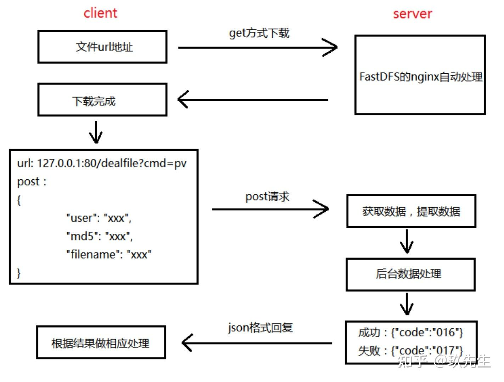

  

- 客户端的操作

```cpp
//把要下载的文件添加到下载队列
int appendDownloadList( FileInfo *info, QString filePathName, bool isShare = false);
//下载文件
QNetworkReply *reply = m_manager->get(QNetworkRequest(url));
//这里的URL就是上传到数据库的URL
```

- 下载操作服务器端的操作

```text
在fast-DFS的storage存储节点的主机上面，安装了nginx的服务器，这样可以直接拿着URL去请求这个资源，服务器方面只需要配置好这个存储节点的mginx就好
```

  

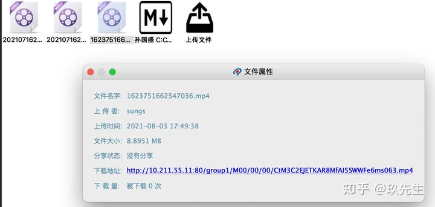

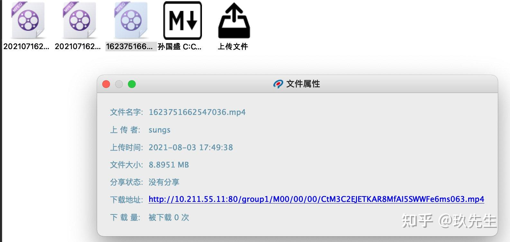

  

- 抓包之后的数据

  

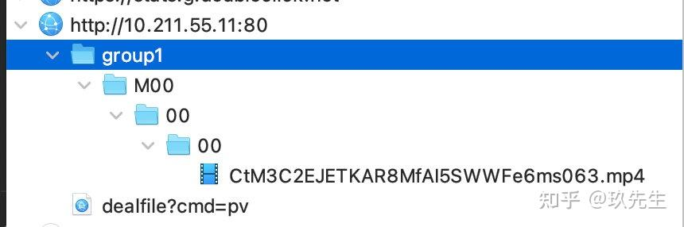


  

- nguni 设置的`location`选项

  

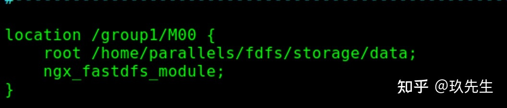


  

### 下载完成，对应文件的PV字段的更新

- 抓包的数据

  

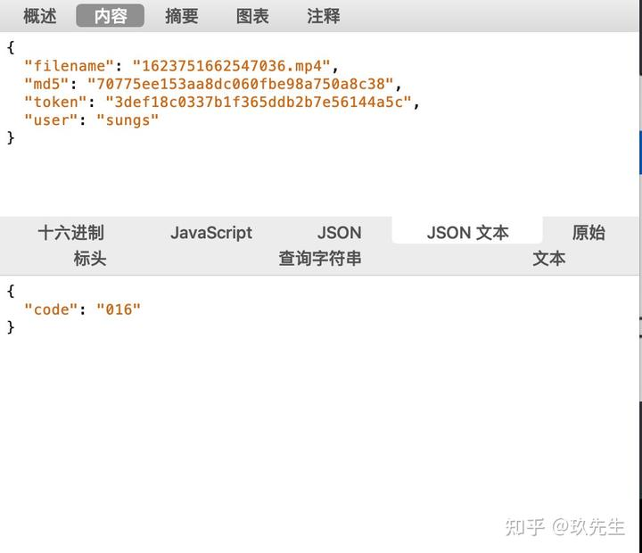


  

- 客户端的处理

```cpp
//需要处理一下对应文件的下载量
http://%1:%2/dealfile?cmd=pv
  //打包发送的json数据
    /*
    {
        "user": "yoyo",
        "token": "xxxx",
        "md5": "xxx",
        "filename": "xxx"
    }
```

- 服务器端的操作

```c
//解析json数据
get_json_info(buf, user, token, md5, filename); //解析json信息
//进行token身份验证
verify_token(user, token); //util_cgi.h
//身份验证通过就查询改用户所属的该文件的PV字段值
 //查看该文件的pv字段
sprintf(sql_cmd, "select pv from user_file_list where user = '%s' and md5 = '%s' and filename = '%s'", user, md5, filename);
//更新PV字段值也就是+1操作
sprintf(sql_cmd, "update user_file_list set pv = %d where user = '%s' and md5 = '%s' and filename = '%s'", pv+1, user, md5, filename);
//反馈客户端code
```

- 服务器返回的code

```json
token验证成功：{"code":"110"}
token验证失败：{"code":"111"}

下载文件pv字段处理
    成功：{"code":"016"}
    失败：{"code":"017"}
```

- 客户端根据返回的code，调整“我的文件”里面该文件的属性

```cpp
//下载文件pv（下载量）字段处理
void MyFileWg::dealFilePv(QString md5, QString filename);

            if(code == "016")
        {
            //该文件pv字段+1
            for(int i = 0; i < m_fileList.size(); ++i)
            {
                FileInfo *info = m_fileList.at(i);
                if( info->md5 == md5 && info->filename == filename)
                {
                    int pv = info->pv;
                    info->pv = pv+1;
                    cout<<filename<<pv;
                    break; //很重要的中断条件
                }
            }
        }
```

-

## 刷新（获取用户列表）

- 这里面有默认的排序方式
- 按照下载量升序
- 按照下载量降序

  


  

```cpp
//三种状态的枚举值
enum Display{Normal, PvAsc, PvDesc};//用来表示刷新的模式
```

  

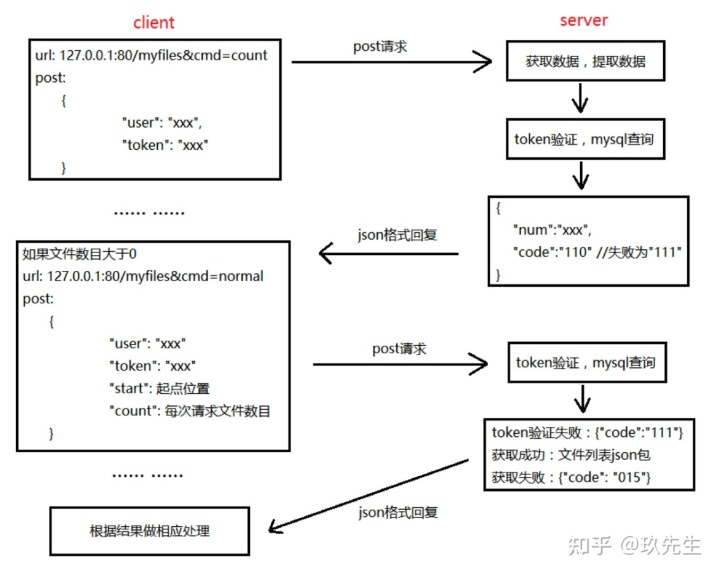

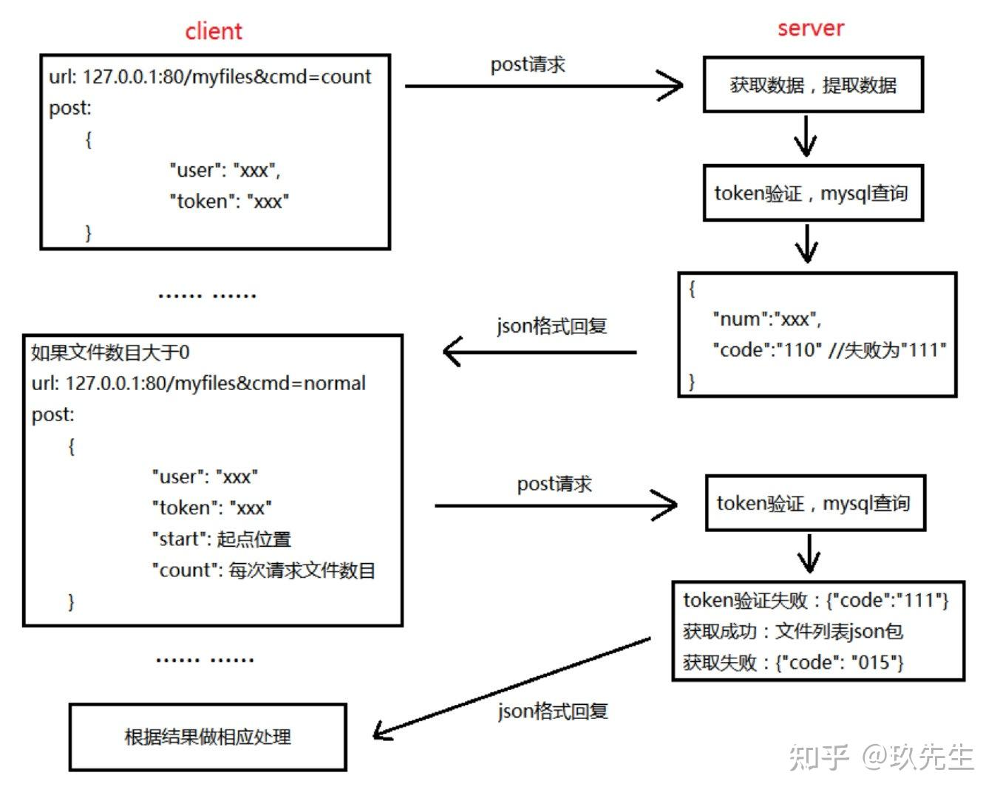

  

### 客户端的操作1

- 首先这个菜单的样式是自绘的控件

```cpp
//菜单一：点击空白处的菜单
    m_menuEmpty = new MyMenu(this);

    m_pvAscendingAction = new QAction("按下载量升序",this);
    m_pvDescendingAction = new QAction("按下载量降序",this);
    m_refreshAction = new  QAction("刷新",this);
    m_uploadAction = new QAction("上传",this);
```

- 对这三种模式处理的接口都是一样的

```cpp
void MyFileWg::refreshFiles(MyFileWg::Display cmd);
```

- 先获取该用户的文件数量

```json
//发送的数据
{
  "user":"xxx",
  "token":"xxx"
}

//127.0.0.1:80/myfiles?cmd=count        //获取用户文件个数
```

### 服务器的操作1

```c
//通过json包获取用户名, token
void get_count_json_info(buf, user, token); 
//用户token验证
int verify_token(user, token); //util_cgi.h
//获取用户的文件个数
void get_user_files_count(char *user, int ret)；
sprintf(sql_cmd, "select count from user_file_count where user=\"%s\"", user);
//反馈给客户端数据
```

- 服务器返回的code

```json
token验证成功：{"code":"110"}
token验证失败：{"code":"111"}

服务器返回给前端的数据
{
  "code":"xxx",
  "num":xx
}
```

### 客户端操作2

```json
//没有文件，就刷新
refreshFileItems(); //更新item，会添加 “上传文件”的item

//有文件，就开始获取文件
//获取用户文件信息 127.0.0.1:80/myfiles&cmd=normal
//按下载量升序 127.0.0.1:80/myfiles?cmd=pvasc
//按下载量降序127.0.0.1:80/myfiles?cmd=pvdesc
url = QString("http://%1:%2/myfiles?cmd=%3").arg(login->getIp()).arg(login->getPort()).arg(cmdType);

post数据json包如下：

//start文件位置的起点，count文件的数量，则需要显示0~9位置为文件
{
    "user": "yoyo"
    "start": 0 
    "count": 10
}

-- 查询第n+1行到第m+n行记录
select * from table1 limit n, m;
SELECT * FROM table LIMIT 5,10；返回第6行到第15行的记录
```

### 服务器操作2

```c
//获取用户文件信息 127.0.0.1:80/myfiles&cmd=normal
//按下载量升序 127.0.0.1:80/myfiles?cmd=pvasc
//按下载量降序127.0.0.1:80/myfiles?cmd=pvdesc

//获取json包数据
int get_fileslist_json_info(buf, user, token, &start, &count); 
//验证token
int verify_token(user, token); //util_cgi.h
//获取用户列表
int  get_user_filelist(cmd, user, start, count); //获取用户文件列表
//多表指定行范围查询

    if(strcasecmp(cmd, "normal") == 0) //获取用户文件信息
    {
        sprintf(sql_cmd, "select user_file_list.*, file_info.url, file_info.size, file_info.type from file_info, user_file_list where user = '%s' and file_info.md5 = user_file_list.md5 limit %d, %d", user, start, count);
    }
    else if(strcasecmp(cmd, "pvasc") == 0) //按下载量升序
    {
        sprintf(sql_cmd, "select user_file_list.*, file_info.url, file_info.size, file_info.type from file_info, user_file_list where user = '%s' and file_info.md5 = user_file_list.md5  order by pv asc limit %d, %d", user, start, count);
    }
    else if(strcasecmp(cmd, "pvdesc") == 0) //按下载量降序
    {
        //sql语句
        sprintf(sql_cmd, "select user_file_list.*, file_info.url, file_info.size, file_info.type from file_info, user_file_list where user = '%s' and file_info.md5 = user_file_list.md5 order by pv desc limit %d, %d", user, start, count);
    }

//返回给客户端文件信息
```

- 服务器返回的信息

```json
token验证成功：{"code":"110"}
token验证失败：{"code":"111"}

获取用户文件列表：
失败：{"code": "015"}
成功：文件列表json

服务器给前端反馈的信息,json对象里面是一个大的json数组，json数组里面就是一个个json对象
{ 
"files": 
    [
      {
        "user": "yoyo",
        "md5": "e8ea6031b779ac26c319ddf949ad9d8d",
        "time": "2017-02-26 21:35:25",
        "filename": "test.mp4",
        "share_status": 0,
        "pv": 0,
        "url": "http://192.168.31.109:80/group1/M00/00/00/wKgfbViy2Z2AJ-FTAaM3As-g3Z0782.mp4",
        "size": 27473666,
         "type": "mp4"
        },

        {
        "user": "yoyo",
        "md5": "e8ea6031b779ac26c319ddf949ad9d8d",
        "time": "2017-02-26 21:35:25",
        "filename": "test.mp4",
        "share_status": 0,
        "pv": 0,
        "url": "http://192.168.31.109:80/group1/M00/00/00/wKgfbViy2Z2AJ-FTAaM3As-g3Z0782.mp4",
        "size": 27473666,
         "type": "mp4"
        }
    ]
}
```

### 客户端操作3

```tex
//解析每一个json对象，获取对应数据
//把每一个文件的数据，添加到 m_filelist对象中
//把对应的item添加到“我的文件”的QListWidget
```

## 分享

- 分享之后，文件的属性会发生变化，需要刷新
- 分享之后的文件会放到“共享列表”，可被其他用户下载

  

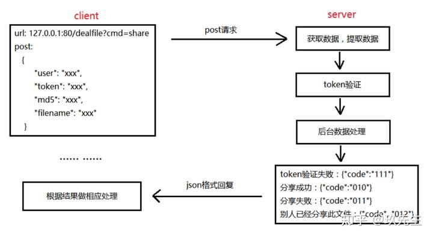

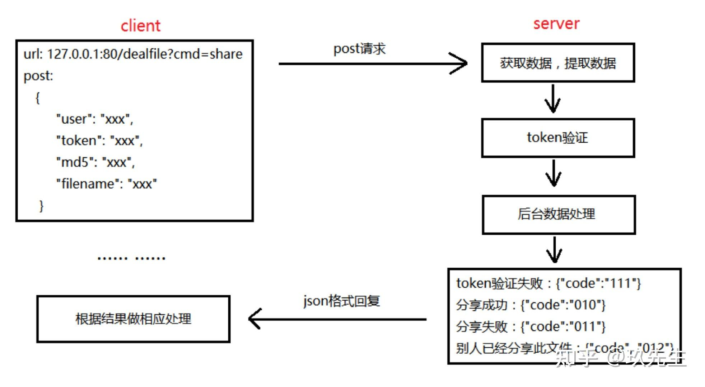

  

### 客户端操作

```cpp
//先由统一的接口进行接受命令
void MyFileWg::dealSelectdFile(QString cmd)；
//分享某个文件
void MyFileWg::shareFile(FileInfo *info)
{
   "user": "yoyo",
    "token": "xxxx",
    "md5": "xxx",
    "filename": "xxx"
}

 QString url = QString("http://%1:%2/dealfile?cmd=share").arg(login->getIp()).arg(login->getPort());
```

### 服务器操作

```c
//a)先判断此文件是否已经分享，判断集合有没有这个文件，如果有，说明别人已经分享此文件，中断操作(redis操作)
int rop_zset_exit(redis_conn, FILE_PUBLIC_ZSET, fileid);//判断某个成员是否存在
//-->本质： reply = redisCommand(conn, "zlexcount %s [%s [%s", key, member, member);
//http://www.redis.cn/commands/zlexcount.html 查看对应zlexcount含义
//返回： 别人已经分享此文件：{"code", "012"}
b)如果集合没有此元素，可能因为redis中没有记录，再从mysql中查询，如果mysql也没有，说明真没有(mysql操作)
 //查看此文件别人是否已经分享了
sprintf(sql_cmd, "select * from share_file_list where md5 = '%s' and filename = '%s'", md5, filename);
//如果查询有结果，代表有人已经分享过了
    //返回： 别人已经分享此文件：{"code", "012"}
    //c)
//查询没有结果，请看 d) e) f)
//c)如果mysql有记录，而redis没有记录，说明redis没有保存此文件，redis保存此文件信息后，再中断操作(redis操作)
int rop_zset_add(redis_conn, FILE_PUBLIC_ZSET, 0, fileid);
//--->本质： reply = redisCommand(conn, "ZADD %s %ld %s", key, score, member);
//d)如果此文件没有被分享，mysql保存一份持久化操作(mysql操作)
//sql语句, 更新共享标志字段
sprintf(sql_cmd, "update user_file_list set shared_status = 1 where user = '%s' and md5 = '%s' and filename = '%s'", user, md5, filename);
//分享文件的信息，额外保存在share_file_list保存列表
sprintf(sql_cmd, "insert into share_file_list (user, md5, createtime, filename, pv) values ('%s', '%s', '%s', '%s', %d)", user, md5, create_time, filename, 0);
//xxx_share_xxx_file_xxx_list_xxx_count_xxx用户的文件数量表进行更新
    //若这个用户已经存在，就直接更新
 sprintf(sql_cmd, "update user_file_count set count = %d where user = '%s'", count+1, "xxx_share_xxx_file_xxx_list_xxx_count_xxx");
    //用户不存在，就直接插入一条新的记录
sprintf(sql_cmd, "insert into user_file_count (user, count) values('%s', %d)", "xxx_share_xxx_file_xxx_list_xxx_count_xxx", 1);
```

- 这个集合`FILE_PUBLIC_ZSET`存储的就是用户分享的文件
- 放到`redis`里面是因为 这个数据会被用到共享列表的展示，属于高频访问的数据
- `zset`的数据结构，可以做到对这个文件下载榜的快速排序

  

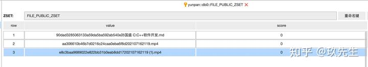

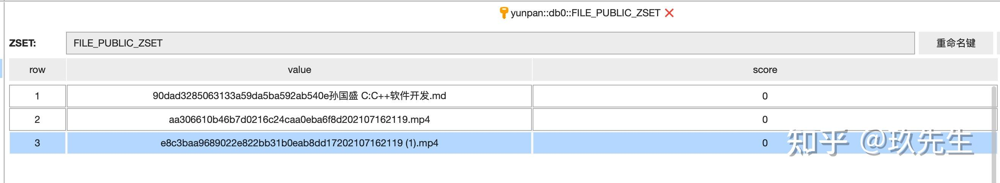

  

  

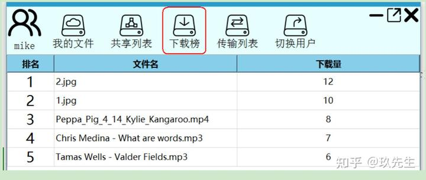

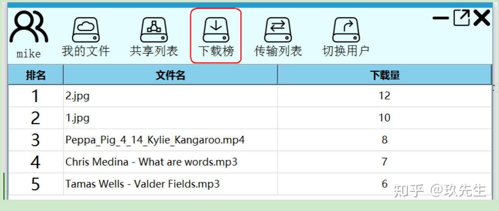

  

```c
e)redis集合中增加一个元素(redis操作)
int rop_zset_add(redis_conn, FILE_PUBLIC_ZSET, 0, fileid);
```

### 这个`hash` 保存的是一个映射关系（fileid---> filename)

  

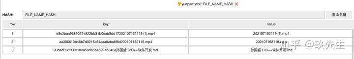


  

```c
f)redis对应的hash也需要变化 (redis操作)
int rop_hash_set(redis_conn, FILE_NAME_HASH, fileid, filename);
```

-

## 删除

- 点击item就可以进行删除

### 客户端操作

```json
{
        "user": "yoyo",
        "token": "xxxx",
        "md5": "xxx",
        "filename": "xxx"
}

http://%1:%2/dealfile?cmd=del
```

### 服务器端操作

```c
//a)先判断此文件是否已经分享
//b)判断集合有没有这个文件，如果有，说明别人已经分享此文件(redis操作)
int rop_zset_exit(redis_conn, FILE_PUBLIC_ZSET, fileid);
flag = 1;   //redis有记录，表明这个文件已经共享
share =1；
//如果不存在，查看c)
//c)如果集合没有此元素，可能因为redis中没有记录，再从mysql中查询，如果mysql也没有，说明真没有(mysql操作)
//查询该文件的共享状态
sprintf(sql_cmd, "select shared_status from user_file_list where user = '%s' and md5 = '%s' and filename = '%s'", user, md5, filename);
//查询有结果，记录share = 1
//查询没有结果
返回给客户端 失败：{"code":"014"}
// d)如果mysql有记录，而redis没有记录，那么分享文件处理只需要处理mysql (mysql操作)
//接着上面的：share = 1

//share==1 ，删除共享列表中对应的文件
sprintf(sql_cmd, "delete from share_file_list where user = '%s' and md5 = '%s' and filename = '%s'", user, md5, filename);
//xxx_share_xxx_file_xxx_list_xxx_count_xxx 用户的文件数量（共享文件的数量-1）
 sprintf(sql_cmd, "update user_file_count set count = %d where user = '%s'", count-1, "xxx_share_xxx_file_xxx_list_xxx_count_xxx");
// e)如果redis有记录，mysql和redis都需要处理，删除相关记录
//flag = 1 ,表明redis也有这个记录，redis里面的记录也需要删除
//有序集合删除指定成员
rop_zset_zrem(redis_conn, FILE_PUBLIC_ZSET, fileid);
//从hash移除相应记录
rop_hash_del(redis_conn, FILE_NAME_HASH, fileid);
//查询用户文件数
//若只有一条记录，刚好也是这个文件，删除这个记录
sprintf(sql_cmd, "delete from user_file_count where user = '%s'", user);
//若不是一条，更改记录
sprintf(sql_cmd, "update user_file_count set count = %d where user = '%s'", count-1, user);
//修改用户文件列表数据,删除对应的文件
 sprintf(sql_cmd, "delete from user_file_list where user = '%s' and md5 = '%s' and filename = '%s'", user, md5, filename);
//文件信息表(file_info)的文件引用计数count，减去1
sprintf(sql_cmd, "select count from file_info where md5 = '%s'", md5);
ret2 = process_result_one(conn, sql_cmd, tmp); //执行sql语句
if(ret2 == 0)
{
    count = atoi(tmp); //count字段
}
count--; //减一
sprintf(sql_cmd, "update file_info set count=%d where md5 = '%s'", count, md5);

if(count == 0) //说明没有用户引用此文件，需要在storage删除此文件
{

        //查询文件的id
        sprintf(sql_cmd, "select file_id from file_info where md5 = '%s'", md5);
        ret2 = process_result_one(conn, sql_cmd, tmp); //执行sql语句
        if(ret2 != 0)
                {
                        LOG(DEALFILE_LOG_MODULE, DEALFILE_LOG_PROC, "%s 操作失败\n", sql_cmd);
            ret = -1;
            goto END;
        }

        //删除文件信息表中该文件的信息
        sprintf(sql_cmd, "delete from file_info where md5 = '%s'", md5);
        if (mysql_query(conn, sql_cmd) != 0)
        {
            LOG(DEALFILE_LOG_MODULE, DEALFILE_LOG_PROC, "%s 操作失败: %s\n", sql_cmd, mysql_error(conn));
            ret = -1;
            goto END;
        }

        //从storage服务器删除此文件，参数为为文件id
        ret2 = remove_file_from_storage(tmp);
        if(ret2 != 0)
        {
            LOG(DEALFILE_LOG_MODULE, DEALFILE_LOG_PROC, "remove_file_from_storage err\n");
            ret = -1;
            goto END;
        }
    }
```

- 服务器端的返回code

```json
token验证成功：{"code":"110"}
token验证失败：{"code":"111"}

删除文件：
    成功：{"code":"013"}
    失败：{"code":"014"}
```

- 客户端拿到对应的成功code

```tex
移除对应的item
文件列表移除该文件
刷新
```

-

## 属性

- 属性的对话框属于自绘控件
- 当点击之后，就会把这个点击的item的FileInfo \*info传入

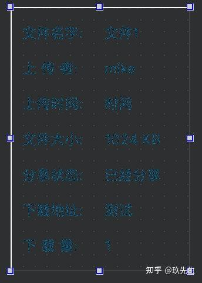

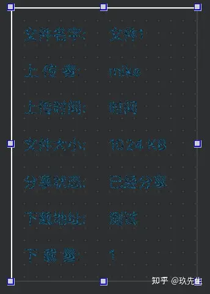

  

```cpp
//获取属性信息
void MyFileWg::getFileProperty(FileInfo *info)
```

-

## 共享列表

- 下载，属性，刷新 和“我的文件”实现方法一样
- 取消分享
- 转存文件

  


  

  


  

## 取消分享

### 客户端操作

```json
127.0.0.1:80/dealsharefile?cmd=cancel
   {
        "user": "yoyo",
        "md5": "xxx",
        "filename": "xxx"
    }
```

### 服务器操作

```c
//解析json数据包
int get_json_info(buf, user, md5, filename); //解析json信息
//修改文件共享状态为不共享
 sprintf(sql_cmd, "update user_file_list set shared_status = 0 where user = '%s' and md5 = '%s' and filename = '%s'", user, md5, filename);
//查询共享文件数量
//查询共享文件数量 xxx_share_xxx_file_xxx_list_xxx_count_xxx
 sprintf(sql_cmd, "select count from user_file_count where user = '%s'", "xxx_share_xxx_file_xxx_list_xxx_count_xxx");
    //若为1条记录，就删掉这个记录
sprintf(sql_cmd, "delete from user_file_count where user = '%s'", "xxx_share_xxx_file_xxx_list_xxx_count_xxx");
    //若为多条记录，就更改数量
sprintf(sql_cmd, "update user_file_count set count = %d where user = '%s'", count-1, "xxx_share_xxx_file_xxx_list_xxx_count_xxx");
//删除共享列表的数据
sprintf(sql_cmd, "delete from share_file_list where user = '%s' and md5 = '%s' and filename = '%s'", user, md5, filename);


//redis 的操作
    //有序集合删除指定成员
ret = rop_zset_zrem(redis_conn, FILE_PUBLIC_ZSET, fileid);
    if(ret != 0)
    {
        LOG(DEALSHAREFILE_LOG_MODULE, DEALSHAREFILE_LOG_PROC, "rop_zset_zrem 操作失败\n");
        goto END;
    }
    //从hash移除相应记录
    ret = rop_hash_del(redis_conn, FILE_NAME_HASH, fileid);
    if(ret != 0)
    {
    LOG(DEALSHAREFILE_LOG_MODULE, DEALSHAREFILE_LOG_PROC, "rop_hash_del 操作失败\n");
        goto END;
    }
```

- 服务器返回的code

```json
取消分享：
        成功：{"code":"018"}
        失败：{"code":"019"}
```

- 客户端后续操作

```text
移除对应的item
```

-

## 转存文件

### 客户端操作

```json
127.0.0.1:80/dealsharefile?cmd=save

{
           "user": "yoyo",
           "md5": "xxx",
           "filename": "xxx"
}
```

### 服务器操作

```c
//解析json数据包
int get_json_info(buf, user, md5, filename); //解析json信息
//查看此用户，文件名和md5是否存在，如果存在说明此文件存在
sprintf(sql_cmd, "select * from user_file_list where user = '%s' and md5 = '%s' and filename = '%s'", user, md5, filename);
    //若存在，直接返回 文件已存在：{"code":"021"}
    //若不存在，
---》
//对应文件的引用计数+1
sprintf(sql_cmd, "update file_info set count = %d where md5 = '%s'", count+1, md5);
//用户文件表插入一条新的记录
sprintf(sql_cmd, "insert into user_file_list(user, md5, createtime, filename, shared_status, pv) values ('%s', '%s', '%s', '%s', %d, %d)", user, md5, time_str, filename, 0, 0);
//更改该用户的文件数量
 sprintf(sql_cmd, "select count from user_file_count where user = '%s'", user);
    //若无记录，新插入一条
sprintf(sql_cmd, " insert into user_file_count (user, count) values('%s', %d)", user, 1);
    //有记录更新
sprintf(sql_cmd, "update user_file_count set count = %d where user = '%s'", count+1, user);
```

### 服务器返回的code

```json
转存文件：
        成功：{"code":"020"}
        文件已存在：{"code":"021"}
        失败：{"code":"022"}
```

-

## 下载排行

### 客户端

```cpp
http://%1:%2/sharefiles?cmd=count

 QNetworkReply * reply = m_manager->get( QNetworkRequest( QUrl(url)) );
```

### 服务器端

```c
//解析命令
query_parse_key_value(query, "cmd", cmd, NULL);
//get_share_files_count(); //获取共享文件个数
//查询共享文件的数量
sprintf(sql_cmd, "select count from user_file_count where user=\"%s\"", "xxx_share_xxx_file_xxx_list_xxx_count_xxx");
//返回给客户端文件的个数
```

### 客户端2

```json
http:// %1:%2/sharefiles?cmd=pvdesc
  {
        "start": 0,
        "count": 10
    }
```

### 服务器2

```c
//解析的json包
int get_fileslist_json_info(char *buf, int *p_start, int *p_count);

//获取共享文件排行版
//按下载量降序127.0.0.1:80/sharefiles?cmd=pvdesc
int get_ranking_filelist(int start, int count);
// a) mysql共享文件数量和redis共享文件数量对比，判断是否相等
//===1、mysql共享文件数量
sprintf(sql_cmd, "select count from user_file_count where user=\"%s\"", "xxx_share_xxx_file_xxx_list_xxx_count_xxx");
//===2、redis共享文件数量
int redis_num = rop_zset_zcard(redis_conn, FILE_PUBLIC_ZSET);
//b) 如果不相等，清空redis数据，从mysql中导入数据到redis (mysql和redis交互)
清空redis有序数据
rop_del_key(redis_conn, FILE_PUBLIC_ZSET);
rop_del_key(redis_conn, FILE_NAME_HASH);
//从mysql中导入数据到redis
 strcpy(sql_cmd, "select md5, filename, pv from share_file_list order by pv desc");
  //增加有序集合成员
rop_zset_add(redis_conn, FILE_PUBLIC_ZSET, atoi(row[2]), fileid);
//增加hash记录
rop_hash_set(redis_conn, FILE_NAME_HASH, fileid, row[1]);
// c) 从redis读取数据，给前端反馈相应信息
//降序获取有序集合的元素
ret = rop_zset_zrevrange(redis_conn, FILE_PUBLIC_ZSET, start, end, value, &n);
 //-- pv 文件下载量
int score = rop_zset_get_score(redis_conn, FILE_PUBLIC_ZSET, value[i]);
```

### 服务器返回的数据

  

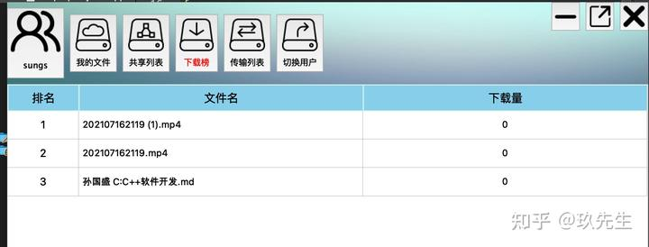

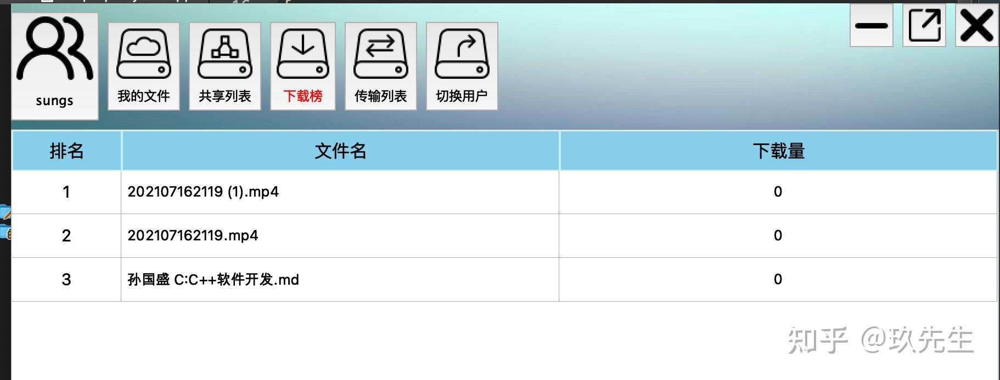

  

```json
{
        "filename": "test.mp4",
        "pv": 0
    }
```

### 客户端

```text
解析数据
刷新界面，显示数据
```

-

## 传输记录

- 上传列表和下载列表 ，查看上传和下载
- 传输记录就是在上传和下载的时候，把记录写进文件

  

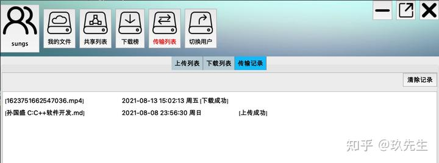

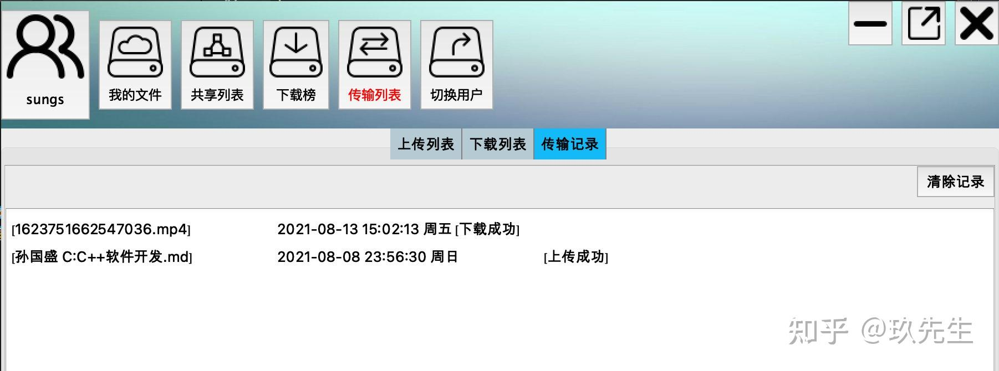

  

-

## 所有的code

```json
服务器反馈给前端的状态码 {"code":"000"}

登陆token：

登陆：
    成功：
        {
            "code": "000",
            "token": "xxx"
        }

    失败：
        {
            "code": "001",
            "token": "xxx"
        }


token验证成功：{"code":"110"}
token验证失败：{"code":"111"}

注册：
    成功：{"code":"002"}
    该用户已存在：{"code":"003"}
    失败：{"code":"004"}

秒传文件：
    文件已存在：{"code":"005"}
    秒传成功：  {"code":"006"}
    秒传失败：  {"code":"007"}

上传文件：
    成功：{"code":"008"}
    失败：{"code":"009"}

分享文件：
    成功：{"code":"010"}
    失败：{"code":"011"}
    别人已经分享此文件：{"code", "012"}

删除文件：
    成功：{"code":"013"}
    失败：{"code":"014"}

获取用户文件列表：
    成功：文件列表json
    失败：{"code": "015"}

下载文件pv字段处理
    成功：{"code":"016"}
    失败：{"code":"017"}

取消分享：
    成功：{"code":"018"}
    失败：{"code":"019"}

转存文件：
    成功：{"code":"020"}
    文件已存在：{"code":"021"}
    失败：{"code":"022"}

//====================登陆用户
127.0.0.1:80/login

post数据(json)
{
    user:xxxx,
    pwd:xxx
}


//====================注册用户
127.0.0.1:80/reg

post数据(json)
{
    userName:xxxx,
    nickName:xxx,
    firstPwd:xxx,
    phone:xxx,
    email:xxx
}

//======================我的文件
按中图标：下载、分享、删除、属性
没有按中图标：按下载量升序、按下载量降序、刷新、上传

//===1、秒传功能：
127.0.0.1:80/md5

post数据(json)
{
    user:xxxx,
    md5:xxx,
    fileName: xxx
}

//===2、上传文件：
127.0.0.1:80/upload

post数据如下：
------WebKitFormBoundary88asdgewtgewx\r\n
Content-Disposition: form-data; user="mike"; filename="xxx.jpg"; md5="xxxx"; size=10240\r\n
Content-Type: application/octet-stream\r\n
\r\n
真正的文件内容\r\n
------WebKitFormBoundary88asdgewtgewx

//===3、我的文件展示页面：

127.0.0.1:80/myfiles?cmd=count      //获取用户文件个数
post数据json包如下：
{
    "user": "yoyo"
}

//获取用户文件信息 127.0.0.1:80/myfiles&cmd=normal
//按下载量升序 127.0.0.1:80/myfiles?cmd=pvasc
//按下载量降序127.0.0.1:80/myfiles?cmd=pvdesc


post数据json包如下：

//start文件位置的起点，count文件的数量，则需要显示0~9位置为文件
{
    "user": "yoyo"
    "start": 0
    "count": 10
}


服务器给前端反馈的信息
{ 
"files": 
    [
      {
        "user": "yoyo",
        "md5": "e8ea6031b779ac26c319ddf949ad9d8d",
        "time": "2017-02-26 21:35:25",
        "filename": "test.mp4",
        "share_status": 0,
        "pv": 0,
        "url": "http://192.168.31.109:80/group1/M00/00/00/wKgfbViy2Z2AJ-FTAaM3As-g3Z0782.mp4",
        "size": 27473666,
         "type": "mp4"
        },

        {
        "user": "yoyo",
        "md5": "e8ea6031b779ac26c319ddf949ad9d8d",
        "time": "2017-02-26 21:35:25",
        "filename": "test.mp4",
        "share_status": 0,
        "pv": 0,
        "url": "http://192.168.31.109:80/group1/M00/00/00/wKgfbViy2Z2AJ-FTAaM3As-g3Z0782.mp4",
        "size": 27473666,
         "type": "mp4"
        }
    ]
}

        /*
        {
        "user": "yoyo",
        "md5": "e8ea6031b779ac26c319ddf949ad9d8d",
        "time": "2017-02-26 21:35:25",
        "filename": "test.mp4",
        "share_status": 0,
        "pv": 0,
        "url": "http://192.168.31.109:80/group1/M00/00/00/wKgfbViy2Z2AJ-FTAaM3As-g3Z0782.mp4",
        "size": 27473666,
         "type": "mp4"
        }
        */
        //-- user   文件所属用户
        //-- md5 文件md5
        //-- createtime 文件创建时间
        //-- filename 文件名字
        //-- shared_status 共享状态, 0为没有共享， 1为共享
        //-- pv 文件下载量，默认值为0，下载一次加1
        //-- url 文件url
        //-- size 文件大小, 以字节为单位
        //-- type 文件类型： png, zip, mp4……


//分享文件
127.0.0.1:80/dealfile?cmd=share
post数据json包如下：
{
    "user": "xxx",
    "token": "xxx",
    "md5": "xxx",
    "filename": "xxx"
}

//删除文件
127.0.0.1:80/dealfile?cmd=del
post数据json包如下：
{
    "user": "yoyo",
    "token": "xxx",
    "md5": "xxx",
    "filename": "xxx"
}

//下载文件pv字段处理
127.0.0.1:80/dealfile?cmd=pv
post数据json包如下：
{
    "user": "yoyo",
    "md5": "xxx",
    "filename": "xxx"
}


//======================共享列表
按中图标：下载、属性、取消分享、转存文件
没有按中图标：刷新

127.0.0.1:80/sharefiles?cmd=count       //获取用户文件个数
get请求


//获取普通共享文件信息 127.0.0.1:80/sharefiles&cmd=normal
//按下载量升序 127.0.0.1:80/sharefiles?cmd=pvasc
//按下载量降序127.0.0.1:80/sharefiles?cmd=pvdesc

按下载量降序127.0.0.1:80/sharefiles?cmd=pvdesc


post数据json包如下：
//start文件位置的起点，count文件的数量，则需要显示0~9位置为文件
{
    "start": 0,
    "count": 10
}

{
    "filename": "test.mp4",
    "pv": 0
}

//下载文件pv字段处理
//127.0.0.1:80/dealsharefile?cmd=pv

//取消分享文件
//127.0.0.1:80/dealsharefile?cmd=cancel

//转存文件
//127.0.0.1:80/dealsharefile?cmd=save

token验证：
    1、我的文件
    2、秒传
    3、分享文件
    4、删除文件
```

-

## 所有的数据库

```sql
-- 创建一个名称为dfs的数据库。
-- create database dfs;

-- 删除数据库dfs
-- drop database dfs;

-- 使用数据库 dfs
use dfs;

-- =============================================== 用户信息表
-- id：用户序号，自动递增，主键
-- name：用户名字
-- nickname：用户昵称
-- phone：手机号码
-- email：邮箱
-- createtime：时间
create table user
(   id bigint not null primary key AUTO_INCREMENT,
    name VARCHAR(128) not null,
    nickname VARCHAR(128) not null,
    password VARCHAR(128) not null,
    phone VARCHAR(15) not null,
    createtime VARCHAR(128),
    email VARCHAR(100),
    constraint uq_nickname unique(nickname), constraint uq_name unique(name)
);

-- 插入
-- insert into user (name, nickname, password, phone, createtime, email) values ('mike', 'sb', '123456', '110', '2017-01-11 17:47:30', '110@qq.com' );

-- 查询
-- select id from user where name = "mike";


-- =============================================== 文件信息表
-- md5 文件md5
-- file_id 文件id
-- url 文件url
-- size 文件大小, 以字节为单位
-- type 文件类型： png, zip, mp4……
-- count 文件引用计数， 默认为1， 每增加一个用户拥有此文件，此计数器+1
create table file_info
(
    md5 varchar(200) not null primary key,
    file_id varchar(256) not null,
    url varchar(512) not null,
    size bigint,
    type VARCHAR(20),
    count int
);

-- 更新
-- update file_info set count = 2 where md5 = "bae488ee63cef72efb6a3f1f311b3743";


-- =============================================== 用户文件列表

-- user 文件所属用户
-- md5 文件md5
-- createtime 文件创建时间
-- filename 文件名字
-- shared_status 共享状态, 0为没有共享， 1为共享
-- pv 文件下载量，默认值为0，下载一次加1
create table user_file_list
(
    user varchar(128) not null,
    md5 varchar(200) not null,
    createtime VARCHAR(128),
    filename varchar(128),
    shared_status int, 
    pv int
);

-- 查看某个用户的文件列表
-- select md5 from user_file_list where name = "mike";

-- 查看某个文件的属性
-- select * from file_info where md5 = "bae488ee63cef72efb6a3f1f311b3743";

-- 设置某个文件是否共享
-- update user_file_list set shared_status = 1 where md5 = "bae488ee63cef72efb6a3f1f311b3743" and user = 'mike';


-- 多表查询
select user_file_list.*, file_info.url, file_info.size, file_info.type from file_info , user_file_list
where user = "yoyo" and file_info.md5 = user_file_list.md5;

select user_file_list.filename, file_info.size, file_info.type, file_info.md5 from file_info , user_file_list
where user = "yoyo" and file_info.md5 = user_file_list.md5 limit 2, 3;

-- 查询第n+1行到第m+n行记录
select * from table1 limit n, m;
SELECT * FROM table LIMIT 5,10；返回第6行到第15行的记录

-- 删除某行
-- DELETE FROM Person WHERE LastName = 'Wilson' 

-- =============================================== 用户文件数量表
-- user     文件所属用户
-- count    拥有文件的数量
create table user_file_count
(
    user varchar(128) not null primary key,
    count int
);

-- 更新
-- update user_file_count set count = 10 where user = "mike";

-- 删除
--delete from user_file_count where user = "mike";

--如果用户名为：xxx_share_xxx_file_xxx_list_xxx_count_xxx，代表共享文件的数量

-- =============================================== 共享文件列表
-- user 文件所属用户
-- md5 文件md5
-- createtime 文件共享时间
-- filename 文件名字
-- pv 文件下载量，默认值为1，下载一次加1
create table share_file_list
(
    user varchar(128) not null,
    md5 varchar(200) not null,
    createtime VARCHAR(128),
    filename varchar(128),
    pv int
);
```

-

## redis的使用场景

### redis的key-value的设置

```tex
共享用户文件的有序集合，用（ZSET）来模拟

  key：FILE_PUBLIC_LIST
  value： 文件内容的md5+文件名

  ZSET相关的语句：
    ZADD key score member 添加成员
    ZREM key member 删除成员
    ZREVRANGE key start stop [withscores] 降序查看
    ZINCRBY key increment member 权重累加increment
    ZCARD key 返回key的有序元素个数
    ZSCORE key 返回key对应的分数
    ZREMRANGEBYRANK key start stop 删除指定范围的成员
    ZLEXCOUNT zset member 判断某个成员是否存在，存在返回1，不存在返回0       

  //=====================================================================
  文件标示和文件名的对应表
  key：FILE_NAME_HASH
  field: file_id(文件内容的md5+文件名)
  value: file_name

  redis:
        hset key field value
    hget key field
```

### 用户的token验证

- 我的文件
- 秒传
- 分享文件
- 删除文件

### 主要实现共享文件下载榜显示功能，由于此数据为热点数据（用户经常下载），信息数据保存在redis提高效率

  

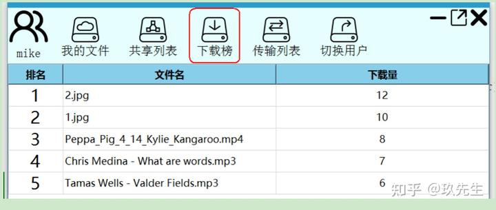


  

- mysql 和 redis 之间的交互
- 判断mysql共享文件数量和redis共享文件数量是否一致
- 如果相同，直接从redis读取内容
- 如果不相同，就把redis缓存中的数据清空，重新把mysql 中的数据导入到redis 中
- 从redis读取数据，保存json格式
- 把数据给到服务器，然后把数据再给客户端，然后呈现出来。  
  
- json数据结构  
  

```json
{
  "files":
  [
    {
      "filename":"2.jpg",
      "pv":12
    },
    {
      "filename":"1.jpg",
      "pv":10
    }
  ]  
}
```

-

## 客户端的技术

### QListWidget

[QListWidget](https://dasheng924.cn/2021/05/10/QListWidget-%E7%9A%84%E7%AE%80%E5%8D%95%E4%BD%BF%E7%94%A8/)