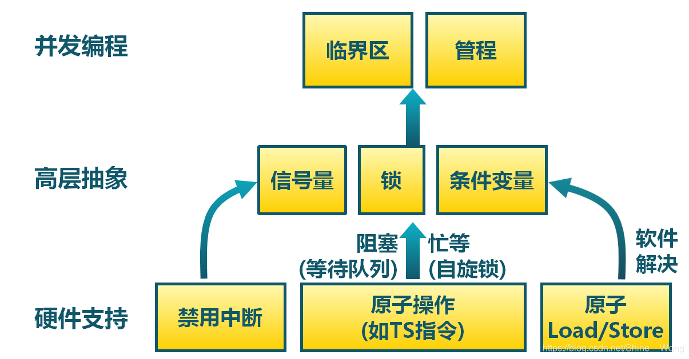
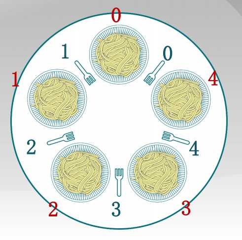
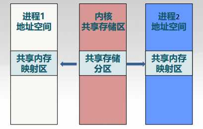
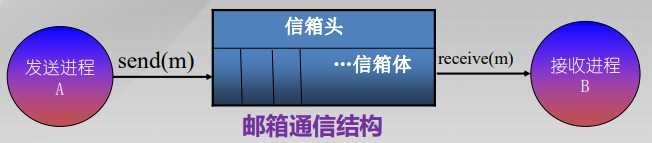
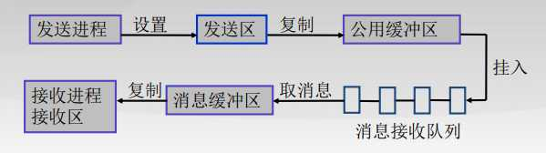
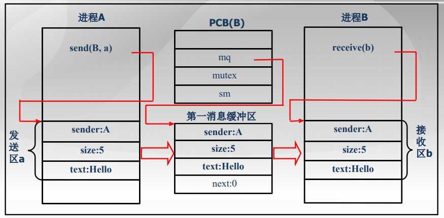
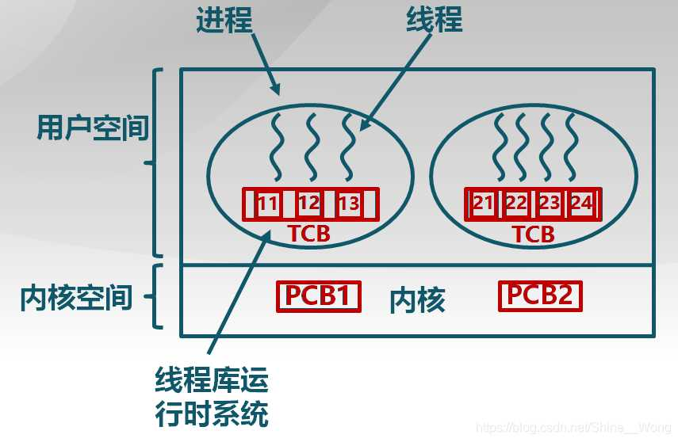
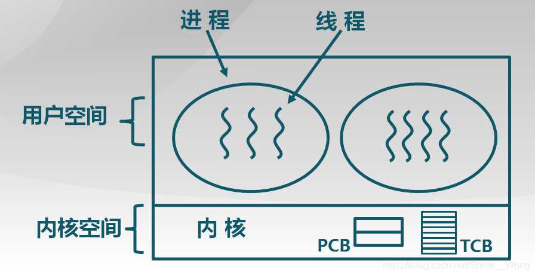
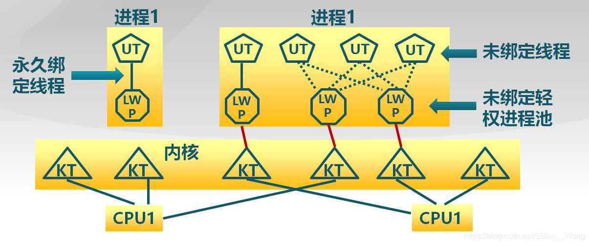

# 2.4 进程同步

## 2.4.1 进程同步的基本概念

**进程同步：在多道程序环境下，进程是并发执行的，不同进程之间存在着不同的相互制约关系。**

### 1\. 并发进程间的同步与互斥

- 竞争关系（互斥）：  
    并发进程之间因相互争夺独占性资源而产生的竞争性制约关系（间接相互制约关系）
- 协作关系（同步））：  
    并发进程之间为完成共同任务，基于某个条件来协调执行先后关系而产生的协作制约关系（直接相互制约关系）

### 2\. 临界区

- **临界资源**：一段时间内只允许一个进程访问的资源称为临界资源或独占资源。
- **临界区(critical section)：**每个进程中访问临界资源的那段代码称为临界区，每次只允许一个进程进入临界区，进入后，不允许其他进程进入。
- **进入区(entry section)：**用于进入临界区前检查临界区是否已经被访问。
- **退出区(exit section)：**将临界区正在被访问的标志恢复成未被访问。
- **剩余区(remainder section)：**进程中其他部分称为剩余区。

这样，进程的代码就组织成了下面的形式：

```cpp
entry_section{    critical_section}exit_sectionremainder_section 
```

### 3.同步机制应遵循的规则

- 空闲让进：没有进程在临界区时，任何进程可进入
- 忙则等待：有进程在临界区时，其他进程均不能进入临界区
- 有限等待：等待进入临界区的进程不能无限期等待
- 让权等待：不能进入临界区的进程，应释放CPU（如转换到阻塞状态）

## 2.4.2 临界区互斥的实现方法



### 1\. 禁用中断

> 中断：中断是指计算机运行过程中，出现某些意外情况需主机干预时，机器能自动停止正在运行的程序并转入处理新情况的程序，处理完毕后又返回原被暂停的程序继续运行。

之所以会引发临界区的冲突访问，其根源在于一个进程在访问临界区时发生了进程的调度，使得另一个进程也进入了临界区进行访问。因此，在进程访问临界区时禁止调度就可以解决这个问题。

**进入临界区：**禁止所有中断，并保存标志； **离开临界区：**使能所有中断，并恢复标志

- 缺点：
    1. 禁用中断后，进程无法被停止：整个系统都会为此停下来，可能导致其他进程处于饥饿状态
    2. 临界区可能很长，无法确定响应中断所需的时间（可能存在硬件影响）
    3. 不适用多处理器系统，在一个处理器上关闭中断，不能防止进程在其它处理器上执行相同的临界区代码

### 2\. Peterson算法（软件解决）

- 共享变量

```cpp
int turn;//表示该谁进入临界区boolean flag[]; //表示进程是否准备好进入临界区
```

- 进入区代码

```cpp
flag[i] = true;turn = j;while (flag[j] && turn ==j)//如果轮到j进程并且准备好了，则i先阻塞
```

**记忆技巧：** “非常谦让的代码”，准备进入了（flag\[i\] = true），则先让别人进入(turn =j)。

- 退出区代码

```cpp
flag[i] = false;
```

- 缺点：复杂，需要两个进程间的共享数据项。并没有做到让权等待原则，而是在忙等待，浪费CPU时间。

### 3\. 软硬件协同：使用原子操作实现互斥锁

#### a. 概念：

锁是一个抽象的数据结构，一个二进制变量（锁定/解锁），使用锁来控制临界区访问。  
一共有两个操作：  
Lock::Acquire()锁被释放前一直等待，然后得到锁。  
Lock::Release()释放锁，唤醒任何等待的进程。  
使用锁机制的临界区访问伪代码如下：

```cpp
lock.acquire();// 一直等待并尝试获取锁critical_section;//临界区lock.release();// 释放
```

#### b. 实现方式：

原子操作指令：现代CPU体系结构提供一些特殊的原子操作指令，实现了两个或两个以上动作的原子性，当这种指令执行时，被它访问的内存位置将不允许被其它指令同时访问。常见的比如测试和置位（Test-and-Set ）指令和交换指令（exchange）。

伪代码分别如下：

```cpp
bool TestAndSet (bool *lock){    bool old = *lock;    *lock = true;    return old;}
```

lock赋值为1，返回lock的初始值。

```cpp
void Exchange (bool *a, bool *b){    bool temp = *a;    *a = *b;    *b = temp;}
```

交换ab的值。

**实现自旋锁（spin lock）**

自旋锁这个概念是相对于互斥锁而言的。对于自旋锁，当一个进程不能得到锁资源时，并不会放弃CPU而进入阻塞状态，而是不断地在那里进行循环检测，因此称它为自旋锁。

```cpp
class Lock{//TS实现自旋锁    bool value = 0;    void acquire();    void release();} Lock::acquire(){    while(test_and_set(&value));    //spin} Lock::release(){    value = 0;}
```

解释：最初的时候value为0，ts返回值为0，并且value变为1表示锁已经被获取，并且退出循环。如果有第二个进程，就会一直执行ts语句（value为1，返回1），直到第一个进程release之后立即获取锁。

```cpp
Lock::acquire(){// exchange 实现自旋锁    bool temp = true;    while(1){        exchange(&value, &temp);        if(temp == false) break;    }} Lock::release(){    value = 0;}
```

**利用ts指令实现无忙等待锁**  
无忙等待锁的基本思想和自旋锁是一样的，只是一旦进程不能进入临界区，则将它加入等待队列，并且进入阻塞状态。在一个进程释放了锁资源后，再挑选等待队列中的一个阻塞进程，并将它唤醒。

```cpp
Lock:acquire(){    while(test_and_set(&value)){        add to waiting queue        wait();                                  // call schedule inside    }} Lock:release(){    value = 0;    if(!empty(waiting queue))        pick up a proc        wakeup_proc(this proc);}
```

#### c. 优缺点

- 优点：  
    适用于单处理器或者共享主存的多处理器中任意数量的进程同步  
    简单并且容易证明  
    支持多临界区
- 缺点：  
    忙等待消耗处理器时间  
    可能导致饥饿，进程离开临界区时有多个等待进程的情况  
    死锁，拥有临界区的低优先级进程，请求访问临界区的高优先级进程获得处理器并等待临界区

## 2.4.3 信号量机制

为了解决同步互斥问题，操作系统会提供一些高级抽象方法供应用进程调用，这样应用进程就不需要自己利用繁琐的软件方法来解决同步互斥了。存在三种高级抽象方法，分别是锁，信号量与条件变量，其中锁也在上面那篇中讨论过了，这里主要是讨论信号量机制。

### 1\. 信号量概念

信号量代表了当前剩余系统资源数量。如果有某个进程申请占用资源，信号量的值-1，反之有进程释放资源，信号量的值+1。要实现上述的两个过程需要有两个原子操作：P操作和V操作，分别表示**尝试减少**和**增加**信号量的值。这两个原子操作连同表示剩余资源数的值封装在一起称为信号量，所以，信号量就是一种**抽象数据类型。**

### 2.信号量的实现

- 当一个资源请求占用资源时，先查看当前`sem`值,如果`sem > 0`说明当前有多余的资源，分配出去，并且`sem--`;如果`sem <= 0`说明当前资源不足，依然进行`sem--`，但是要将进程放入阻塞队列。
  
- 当一个进程释放资源时，将`sem++`表示当前空余资源+1，若`sem <= 0`,说明有进程在阻塞队列中等待资源的释放，则将队列中相应的进程取出将其唤醒；若`sem > 0`，说明当前没有进程在队列中，直接结束程序即可。
  
- 伪代码如下：
  

```cpp
class Semaphore{private:    int sem;    WaitQueue q; public:    void signal();//V操作    void wait();//P操作} void Semaphore::wait(){    --sem;    if(sem < 0){        add current process to q;        schedule();    }} void Semaphore::signal(){    ++sem;    if(sem <= 0){        pick a process in q;        wakeup_proc();    }}
```

- 整数型与记录型信号量：  
    两者区别就是记录型信号量多了一个阻塞队列（一般为链表形式链接全部阻塞进程），相比于整数型，记录型不会出现“忙等”现象，上述的伪代码也是采用记录型信号量。

### 3\. AND型信号量

一个进程往往需要多个共享资源后才能工作，如果不进行合理规范就会出现死锁现象，于是，形成一种新的型号量，规定：将进程在整个运行过程中需要的所有资源，一次性全部分配给进程，待进程使用完后再一起释放。只要尚有一个资源未能分配给进程，其他所有可能为之分配的资源，也不分配给它。**即要么把它所请求的资源全部分配给进程，要不一个也不。**

## 2.4.4 信号量的应用

### 1\. 实现临界区的互斥访问

类比锁机制，可以用信号量来模拟一个锁，即给每个临界区设置一个初始信号值为1的信号量，并在进入区设置V操作，退出区设置P操作。  
伪代码如下：

```cpp
mutex = new Semaphore(1);mutex->wait();//等待缓冲区有空闲位置，进入后信号量为0，其他进程无法进入critical_section();mutex->signal();//释放缓冲区
```

### 2\. 实现进程间同步

进程间同步必然涉及到某些操作的先后执行顺序，例如进程1的`prev()`函数必须先于进程2的`next()`函数执行，如果进程2运行到了`next()`函数处时，`prev()`还没有执行，则进程2只能等待。下面就叙述如何利用信号量实现这种关系。

从信号量的观点来看，进程2等待的`prev`函数执行，实际上也是等待某种资源，而这种资源只有通过进程1才可以释放，在此之前这种资源的数量都是零。于是可以形成下面的代码：

```cpp
condition = new semaphore(0);//初始化为0 //for process 1process1(){    prev();//直接运行    condition->signal();//释放锁，信号值为1，唤醒next进程} //for process 2process2(){    condition->wait();//由于初始值为0，一开始进入阻塞状态，直到signal唤醒    next();} 
```

**为了实现两进程之间的同步，信号量必须成对地出现在两个不同的进程中，并且其位置也要相互匹配。**

## 2.4.5 管程机制

### 1.管程的概念

管程是一种用于多进程互斥访问共享资源的程序结构

- 采用面向对象方法，简化了进程间的同步控制
- 任一时刻最多只有一个进程执行管程代码
- 正在管程中的进程可临时放弃管程的互斥访问，等待事件出现时恢复（避免死锁）
- 作用：在模块/对象中收集相关共享数据，定义访问共享数据的方法。

### 2\. 管程的组成

- 一个锁：控制管程代码互斥访问。
- 0或多个条件变量：管理共享数据的并发访问。

### 3\. 条件变量

- 条件变量是管程内的等待机制：  
    进入管程的进程因资源被占用而进入等待状态  
    每个条件变量表示一种等待原因，对应一个等待队列
- Wait()操作 ：将自己阻塞在等待队列中，唤醒一个等待者或释放管程的互斥访问
- Signal()操作：将等待队列中的一个进程唤醒，等待队列为空，则等同空操作

### 4.实现

```cpp
Class condition{    int numWaiting = 0;    WaitQueue q;}Condition :: Wait(lock){    numWaiting++;    Add this thread t to q;    release(lock);//释放锁，放弃对管程的互斥访问    schedule();    require(lock);} Condition::Signal(){    if(numWaiting > 0) {        Remove a thread t from q;        wakeup(t);        numWaiting—-;    }}
```

# 2.5 经典进程的同步问题

## 2.5.1 生产者-消费者问题

### 1.问题描述

有两个进程，一组生产者进程和一组消费者进程共享一个初始为空、固定大小为n的缓存（缓冲区）。生产者的工作是制造一段数据，只有缓冲区没满时，生产者才能把消息放入到缓冲区，否则必须等待，如此反复; 同时，只有缓冲区不空时，消费者才能从中取出消息，一次消费一段数据（即将其从缓存中移出），否则必须等待。由于缓冲区是临界资源，它只允许一个生产者放入消息，或者一个消费者从中取出消息。

**核心：**

- 能否互斥访问共享资源(不能同时访问共享数据)；
- 当公共容器满时，生产者能否继续生产(生产者应阻塞并唤醒消费者消费)；
- 当公共容器为空时，消费者能否继续消费(消费者应阻塞并唤醒生产者生产)。

> 生产者和消费者对缓冲区互斥访问是互斥关系(异步的)，同时生产者和消费者又是一个相互协作的关系，只有生产者生产之后，消费者才能消费，他们也是同步关系。

### 2.用信号量实现:

```cpp
mutex       = new semaphore(1);//保证缓冲区互斥emptybuffer = new semaphore(n);//缓冲区空闲位置数fullbuffer  = new semaphore(0);//缓冲区存放物品数量 //for producerproduce(){    produce an item in nextp;//生成一件物品 nextp    emptybuffer->wait();//等待缓冲区有空闲位置，需要设置在mutex之前    mutex->wait();//确保放入产品的过程中没有其他进程访问缓冲区    buffer[in] = nextp;//放入产品    in = (in + 1) % N;//缓冲池组织为循环缓冲，放入产品指针移动到下一位    mutex->signal();//唤醒其他进程可以进入缓冲区    fullbuffer->signal();//通知消费者缓冲区有资源可以取走了} //for consumerconsume(){    consumer the item in nextc;    fullbuffer->wait();//等待缓冲区有资源可以使用    mutex->wait();//保证缓冲区互斥    nextc = buffer[out];    out = (out + 1) % N;//取出产品out+1    mutex->signal();//唤醒其他进程进入缓冲区    emptybuffer->signal();//通知缓冲区有空闲位置}
```

需要注意的是，无论是生产者还是消费者，一开始的两个P操作的顺序是不能颠倒的，否则可能出现这样一种情况，比如生产者成功进入了临界区，却发现没有空闲的缓冲区可供写入了，于是就等待`emptybuffer`信号。然而，此时消费者也无法进入被占用的缓冲区，在等待`mutex`信号。系统就进入了死锁状态。

### 3.用管程实现

```cpp
//管程的伪代码Class condition{    int numWaiting = 0;    WaitQueue q;}Condition :: Wait(lock){    numWaiting++;    Add this thread t to q;    release(lock);//释放锁，放弃对管程的互斥访问    schedule();    require(lock);} Condition::Signal(){    if(numWaiting > 0) {        Remove a thread t from q;        wakeup(t);        numWaiting—-;    }}//生产者-消费者问题具体实现Class BoundedBuffer {//需要的资源都在管程中模块化    ...    Lock lock;    int count = 0;//缓冲区内物品的个数,需互斥访问    Condition notFull, notEmpty;//条件变量，表示缓冲区的状态} BoundedBuffer::Deposit(c){    lock->Acquire();//申请锁，进入临界区    if(count == n)//如果满了则等待        notFull.wait(&lock);    Add c to the buffer;    count++;    notEmpty.signal();//通知缓冲区中多了一个物品    lock->Release();//释放锁} BoundedBuffer::Remove(c){    lock->Acquire();    if(count == 0)        notEmpty.Wait(&lock);    Remove c to the buffer;    count—-;    notFull.signal();    lock->Release();}
```

## 2.5.2 哲学家就餐问题

### 1.问题描述

5个哲学家围绕一张圆桌而坐，桌子上放着5支叉子，每两个哲学家之间放一支。哲学家的动作包括思考和进餐，进餐时需同时拿到左右两边的叉子，思考时将两支叉子放回原处，如何保证哲学家们的动作有序进行？  
[](http://fangkaipeng.com/wp-content/uploads/2021/03/wp_editor_md_85c5780ded4af0d251a64ad1cf1ef126.jpg)

[](http://fangkaipeng.com/wp-content/uploads/2021/03/wp_editor_md_85c5780ded4af0d251a64ad1cf1ef126.jpg)

### 2.一人进餐的实现

```cpp
#define N 5 // 哲学家个数semaphore fork[5]; // 信号量初值为1semaphore mutex; // 互斥信号量，初值1void philosopher(int i){ // 哲学家编号：0 － 4    while (TRUE) {        think();                    // 哲学家在思考        wait(mutex);                // 进入临界区        wait(fork[i]);              // 去拿左边的叉子        wait(fork[(i + 1) % N]);    // 去拿右边的叉子        eat();                      // 吃面条中….        signal(fork[i]);            // 放下左边的叉子        signal(fork[(i + 1) % N]);  // 放下右边的叉子        signal(mutex);              // 退出临界区    }}
```

### 2.多人进餐

由于一共五个人，所以最多可以有四个人进入临界区，鸽巢原理，五只筷子四个人，保证至少有一人可以吃面条。设置资源值的初始值为4，保证最多四个人进入临界区即可。

```cpp
#define N 5 // 哲学家个数semaphore fork[5]; // 信号量初值为1semaphore count = 4; // 资源信号量，初值4void philosopher(int i){ // 哲学家编号：0 － 4    while (TRUE) {        think();                    // 哲学家在思考        wait(count);                // 只要不是第五人就可以进入临界区        wait(fork[i]);              // 去拿左边的叉子        wait(fork[(i + 1) % N]);    // 去拿右边的叉子        eat();                      // 吃面条中….        signal(fork[i]);            // 放下左边的叉子        signal(fork[(i + 1) % N]);  // 放下右边的叉子        signal(count);              // 退出临界区    }}
```

将哲学家按照奇偶编号，奇数人先拿左手再拿右手的，偶数人相反，可以保证不会同时有人拿到同一只筷子。

```cpp
#define N 5                // 哲学家个数semaphore fork[5];         // 信号量初值为1void philosopher(int i) {  // 哲学家编号：0 － 4    while (TRUE) {        think();  // 哲学家在思考        if (i % 2 == 0) {            wait(fork[i]);            // 去拿左边的叉子            wait(fork[(i + 1) % N]);  // 去拿右边的叉子        } else {            wait(fork[(i + 1) % N]);  // 去拿右边的叉子            wait(fork[i]);            // 去拿左边的叉子        }        eat();                      // 吃面条中….        signal(fork[i]);            // 放下左边的叉子        signal(fork[(i + 1) % N]);  // 放下右边的叉子    }}
```

## 2.5.3 读者-写者问题

### 1.问题描述

读者：只读取数据，不修改  
写者：读取和修改数据  
要求：“读 – 读”允许，“读 – 写”互斥， “写- 写”互斥

### 2\. 用信号量描述约束

信号量wmutex：控制读写操作的互斥，初始化为1。  
读者计数readcount：正在进行读的读者数目，初始化为0，共享变量，用于读写互斥的控制。  
信号量rmutex：控制对读者计数的互斥修改，初始化为1。

### 3.实现（读者优先）

```cpp
//Writerwait(wmutex);    write;signal(wmutex); //Readerwait(rmutex);//保证readcount的互斥访问if (readcount == 0)//readcount为0，当前没有读者，可以进入临界区    wait(wmutex);++readcount;singal(rmutex);    read;wait(rmutex);—-readcount;if(readcount == 0)    singal(wmutex);singal(rmutex);
```

### 4.优先策略

- 写者优先策略  
    只要有读者正在读状态，后来的读者都能直接进入，如读者持续不断进入，则写者就处于饥饿。
- 写者优先策略  
    只要有写者就绪，写者应尽快执行写操作，如写者持续不断就绪，则读者就处于饥饿。

# 2.6 进程通信

- **低级通信：**  
    进程间仅交换一些状态和少量数据。如：进程之间的互斥和同步。缺点：(1)效率低 (2)通信对用户不透明
- **高级通信：**  
    进程间可交换大量数据。用户可直接利用操作系统提供的一组通信命令，高效地传送大量数据的一种通信方式。操作系统隐藏了进程通信的细节，对用户透明，减少了通信程序编制上的复杂性。

## 2.6.1 进程通信类型

### 1.共享存储器系统

相互通信的进程间共享某些**数据结构**或**共享存储区**，通过这些空间进行通信。

- 基于共享数据结构的通信方式  
    进程公用某些数据结构，借以实现诸进程间的信息交换。如生产者-消费者问题的有界缓冲区。由程序员负责公用数据结构的设置及对进程间同步的处理，操作系统只提供共享存储器。通信效率低，只适合传递相对少量的数据，属于低级通信。
- 基于共享存储区的通信方式  
    在存储器中划出一块共享存储区，诸进程可通过对共享存储区中数据的读或写来实现通信。通过共享存储分区实现进程之间的信息交换。共享内存是把**同一个物理内存区域**同时映射到**多个进程的内存地址空间**的通信机制。  
    **通信过程：**  
    （1）申请共享存储分区；  
    （2）将共享存储分区映射到本进程地址空间中；  
    （3）进行数据读写；  
    （4）解除共享存储分区映射；  
    （5）删除共享存储分区；  
    [
    
    
    
    ](http://fangkaipeng.com/wp-content/uploads/2021/03/wp_editor_md_4d9df97bab0abd7b7d978a2bc73db3b0.jpg)  
    **特点：** 最快的方法，一个进程写另外一个进程立即可见，没有系统调用干预没有数据复制，不提供同步，由程序员提供同步。

### 2\. 管道通信

**管道：** 指用于连接一个读进程和一个写进程以实现他们之间通信的一个共享文件，又名pipe文件。  
**管道机制提供的协调能力：** 互斥（读写互斥）；同步（管道空停止读，管道满停止写）；确定对方是否存在，只有对方存在的时候才能通信。

[](http://fangkaipeng.com/wp-content/uploads/2021/03/wp_editor_md_f07b00beaddeb436d4b2c94181fb4d69.jpg)

### 3\. 消息传递系统

进程间的数据交换，以格式化的消息为单位。程序员直接利用系统提供的一组**通信命令(原语)进行通信**。

## 2.6.2 消息传递通信的实现方法

### 1.直接通信方式

发送进程利用OS提供的发送命令，直接把消息发送给目标进程。发送进程和接收进程都以显式方式提供对方的标识符。

- **通信原语：**  
    Send(Receiver, message); 发送一个消息给接收进程  
    Receive(Sender, message); 接收Sender发来的消息
- **消息格式：**  
    单机系统环境：环境相同，消息格式简单  
    网络环境：环境不同，传输距离很远，消息格式比较复杂。
- **进程同步方式：**  
    在进程之间进行通信时，辅以进程同步机制，使诸进程间能协调通信。发送进程或接收进程在完成消息的发送或接收后，都存在两种可能性：进程或者继续发送(接收)或者阻塞，出现三种情况：  
    发送进程阻塞、接收进程阻塞  
    发送进程不阻塞、接收进程阻塞  
    发送进程和接收进程均不阻塞
- **通信链路：**  
    为使在发送进程和接受进程之间能进行通信，必须在两者之间建立一条通信链路。
    
    - 根据通信链路的建立方式：  
        显示连接：先用 “建立连接”命令(原语) 建立一条通信链路； 通信；用显式方式拆除链路。——用于计算机网络  
        隐式连接：发送进程无须明确提出建立链路的要求，直接利用系统提供的发送命令(原语)，系统会自动地为之建立一条链路。——用于单机系统
    - 根据通信链路的连接方法：点–点连接通信链路，多点连接通信链路
    - 根据通信方式的不同：单向通信链路，双向链路
    - 根据通信链路容量的不同：无容量通信链路，有容量通信链路

### 2\. 间接通信方式（信箱）

信箱用来暂存发送进程发送给目标进程的消息，接收进程则从信箱中取出发送给自己的消息。

消息在信箱中可安全保存，只允许核准的目标用户随时读取，利用信箱通信方式，既可实时通信，又可非实时通信。

**信箱的结构：**  
信箱头：信箱名、信箱大小、创建者、存取信件指针、信件数量等。  
信箱体：存放消息。

[](http://fangkaipeng.com/wp-content/uploads/2021/03/wp_editor_md_43fcdaf54afe9bb727657997dd65ad40.jpg)

**信箱的类型：**

[](http://fangkaipeng.com/wp-content/uploads/2021/03/wp_editor_md_0ce0c96fd2f480864317f588e67f6f98.jpg)

## 2.6.3 直接消息传递系统实例

发送进程利用Send原语，将消息直接发送给接收进程；接收进程利用Receive原语接收消息。

**基本思想：**

[](http://fangkaipeng.com/wp-content/uploads/2021/03/wp_editor_md_e4d99965ef8d63f5d6ef126db214262f.jpg)

### 1.消息缓冲队列通信机制中的数据结构

**消息缓冲区：**

```cpp
type struct message_buffer {    int sender; //发送者进程标识符    int size; //消息长度    char *text; //消息正文    struct message_buffer next; //指向下一个消息缓冲区的指针}
```

**PCB中有关通信的数据项:**  
应该在进程的PCB中增加消息队列队首指针，用于对消息队列进行操作，以及用于实现同步的互斥信号量mutex和信号量sm。

```cpp
type struct processcontrol_block {    …    struct processcontrol_block mq; //消息队列队首指针    samaphore mutex; //消息队列互斥信号量    samaphore sm; //消息队列资源信号量    …}PCB;
```

### 2\. 发送原语

```cpp
void send(receiver, a)  //将发送区a的内容发给receiver{    getbuf(a.size, i);    //根据a.size申请缓冲区i    i.sender = a.sender;  //将发送区a中的信息复制    i.size = a.size;      //到消息缓冲区i中    copy(i.text, a.text);    i.next = 0;    getid(PCBset, receiver.j);  //取接收进程内部标识符放于j    wait(j.mutex);              //将消息缓冲区插入消息队列    insert(&j.mq, i);    signal(j.mutex);    signal(j.sm);}
```

### 3\. 接收原语

```cpp
void receive(b)         //从进程自己的消息接收队列中取{                       //消息i放入消息接收区b中    j = internal name;  // j为接收进程内部标识符    wait(j.sm);    wait(j.mutex);    remove(j.mq, i);  //将消息队列中的第一个消息移出    signal(j.mutex);    b.sender = i.sender;  //将消息缓冲区i中的信息    b.size : = i.size;    //复制到接收区b    copy(b.text, i.text);}
```

### 4.运行过程：

[](http://fangkaipeng.com/wp-content/uploads/2021/03/wp_editor_md_7ad44a7d749e2f33ffc28fae48570586.jpg)

# 2.7 线程的基本概念

## 2.7.1 线程的概念

### 1\. 定义

线程是**进程的一部分**，描述指令流执行状态。它是进程中的**指令执行流**的最小单元，是CPU**调度**的基本单位。

- **进程的资源分配角色：**  
    进程由一组相关资源构成，包括地址空间（代码段、数据段）、打开的文件等各种资源。
- **线程的处理机调度角色：**  
    线程描述在进程资源环境中的指令流执行状态，线程间各自独立。
- **线程的特性：** 线程间并发执行，共享相同的地址空间。

### 2\. 进程与线程的关系

线程 = 进程 – 共享资源

- **线程的优点：**  
    一个进程中可以同时存在多个线程。  
    各个线程之间可以并发地执行，切换效率高。  
    各个线程之间可以共享地址空间和文件等资源。
- **线程的缺点：**  
    一个线程崩溃，会导致其所属进程的所有线程崩溃。

### 3\. 线程与进程的比较

- 进程是**OS独立调度和分派的基本单位**，线程是**CPU调度的基本单位**。
- 进程拥有一个完整的资源平台，线程只独享指令流执行的必要资源，如寄存器和栈。
- 进程具有就绪、等待、运行三种基本状态和状态间的转换关系
- 线程能减少并发执行的时间和空间开销：线程创建和终止时间短，同一进程内的线程切换速度快，同一进程内的线程可以不通过内核进行直接通信。

# 2.8 线程的实现

## 2.8.1 用户线程

用户线程的思路其实非常简明：只是在用户空间实现线程，进程的线程对于操作系统是不可见的。这样，进程仍然是操作系统资源分配和调度的基本单位。

[](http://fangkaipeng.com/wp-content/uploads/2021/03/wp_editor_md_5e7caa8aba3eb970d0b471b392a25d36.jpg)

**特征：**  
– 非常灵活，因为是在进程的内部提供线程的调度算法，因此调度算法的设计可以更有针对性，不同的进程可以拥有不同的调度算法。  
– 线程对操作系统是不可见的，线程控制块TCB需要进程本身来维护。  
– 线程之间的切换很快，直接在进程运行中就可以切换，不需要用户态/内核态的切换。

**缺点：**  
一个线程阻塞的时候，其他线程也都阻塞了。因为操作系统看不到用户线程，一旦发生阻塞，操作系统就立即将CPU的控制权转交给其他进程了。操作系统调度进程是以进程为单位分配CPU时间，一个进程的所有线程共享这部分CPU时间，每个线程的时间片较小。

## 2.8.2 内核线程

内核线程可以解决上面提到的用户线程的不足。内核线程就是指，线程对于操作系统是可见的，由操作系统来管理线程。  
[](http://fangkaipeng.com/wp-content/uploads/2021/03/wp_editor_md_5787d4ce1a559c887b75a043d0ea1935.jpg)

[](http://fangkaipeng.com/wp-content/uploads/2021/03/wp_editor_md_5787d4ce1a559c887b75a043d0ea1935.jpg)

**优点：**  
由于是由内核来同时维护PCB和TCB，一个进程的线程被阻塞并不会影响该进程的其他线程。此外，由于操作系统调度的基本单位成了线程，不会出现上面提到的线程的时间片太短的情况。

**缺点：**  
一方面，内核线程的创建、切换和退出的开销比较大，因为这些操作是通过系统调用实现的，需要进行用户态/内核态的切换。此外，由操作系统统一给出线程的调度算法，不如用户线程那么灵活。

## 2.8.3 轻量级进程(LightWeight Process)

轻量级进程是内核支持的用户线程。一个进程可有一个或多个轻量级进程，每个轻权进程由一个单独的内核线程来支持。

轻量级进程的实现综合了内核线程和用户线程。具体说来，对于每一个进程，内核中都管理了一定量的它的内核线程。但是在用户进程的内部，同时还存在着一定的用户线程。操作系统调度的基本单位仍然是内核线程，但是可以将用户线程和内核线程进行绑定，以在一定程度上改变这种调度关系，实现用户线程那种灵活的线程调度。

[](http://fangkaipeng.com/wp-content/uploads/2021/03/wp_editor_md_6f52390b5916298eececcd3bbfade251.jpg)

轻量级进程的思路是很好的，但是在实际系统中的运行不太理想，因为轻量级进程实现的开销太高了，在一定程度上抵消了它的优越性。

可以看到，在轻量级进程中，用户线程和内核线程是多对多的关系。除此以外，还有用户线程对内核线程是一对一或者多对一的关系的情况，分别对应了内核线程和用户线程。