# 3.1 作业与进程调度

## 3.1.1 作业与进程

- 作业是用户向计算机提交任务的任务实体。 进程是完成用户任务的执行实体，是资源分配的基本单位。 没有作业任务，进程无事可干; 没有进程，作业任务没法完成。
- 作业建立完毕后，是放在外存等待运行。 进程一经创建，总由相应的部分存于内存。
- 一个作业可由多个进程组成，且必须至少由一个进程组成，反之则不然。
- 作业的概念更多地用在批处理系统中。 进程的概念几乎可以用在所有的多道程序系统中。

## 3.1.2 处理机调度的层次

**高级调度：** 又称作业调度或长程调度。调度对象是作业，按照进程调度算法，决定作业的调度时机，主要用于多道批处理系统。

**低级调度：** 又称进程调度或短程调度。调度对象是进程，根据调度算法决定进程的调度时机，是一种最基本的调度，多道批处理、分时、实时都必须配置。

**中级调度：** 又称内存调度，目的是提高内存利用率和系统吞吐量，把暂时不能运行 的进程调至外存（挂起），具备运行条件并且内存空闲时调入内存（就绪）。

作业调度选择要加载到内存的作业，进程调度选择运行的作业进程，而内存调度选择将进程调至外存

## 3.1.3 进程调度

### 1. 进程调度的任务

- 保存处理机的现场信息，如程序计数器，通用寄存器的内容。
- 按某种算法选取进程（调度算法）
- 把处理机分配给进程

### 2. 进程调度的三个基本机制


[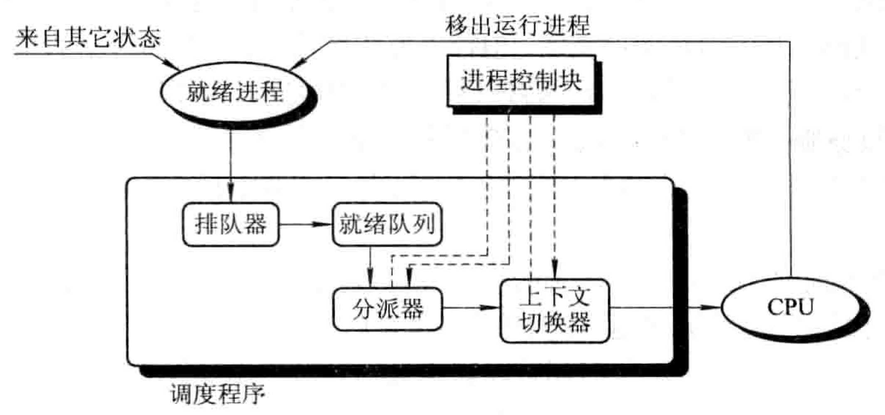](http://fangkaipeng.com/wp-content/uploads/2021/03/wp_editor_md_ad813a5c0b53086158416aa4114f8cfd.jpg)


\1. 排队器。实现将系统中所有就绪进程按照一定策略排成一个或多个队列，以便调度进程快速找到。
\2. 分派器。依据进程调度程序所选择的进程，将其从就绪队列中取出，将处理机分配给新选择的进程。
\3. 上下文切换器在对处理机进行切换时，会发生两对上下文的切换操作：**1.** 上下文切换时，OS将保存当前进程的上下文,即把当前进程的处理机寄存器内容保存到该进程的进程控制块内的相应单元，再装入分派程序的上下文，以便分派程序运行;**2.** 上下文切换是移出分派程序的上下文，而把新选进程的CPU现场信息装入到处理机的各个相应寄存器中，以以便新选进程运行。


### 3. 进程调度方式

- **非抢占方式(Non-preemptive Mode)**
    除非进程完成或发生某事件而被阻塞时，才把处理机分配给其他进程，决不允许其它进程抢占已分配出去的处理机。 时机:进程执行完，提出I/O请求，执行某原语操作
- **抢占方式(Preemptive Mode)**
    允许调度程序根据某种原则，去暂停某个正在执行的进程，将处理机重新分配给另一进程。抢占的原则: 时间片原则、短进程优先原则、优先权原则

### 4.比较调度算法的准则

- CPU使用率：CPU处于忙状态的时间**百分比**
- 吞吐量：单位时间内完成的**进程数量**
- 周转时间：进程从初始化到结束(包括等待)的**总时间**
- 等待时间：进程在就绪队列中的**总时间**
- 响应时间：从提交请求到产生响应所花费的**总时间**
- 截止时间：任务必须开始执行(或完成)的**最迟时间**
- 带权周转时间：作业的周转时间T与系统为它提供服务的时间TS之比，即W=T/TS，称为带权周转时间。

# 3.2 调度算法

## 1. 先来先服务算法(First Come First Served, FCFS)

依据进程进入就绪状态的先后顺序排列，进程进入等待或结束状态时，就绪队列中的下一个进程占用CPU


[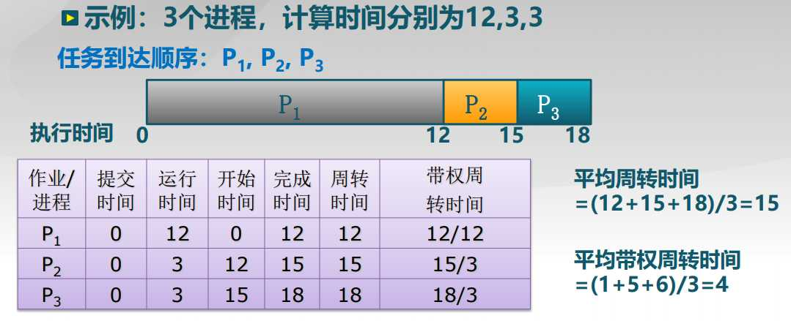](http://fangkaipeng.com/wp-content/uploads/2021/03/wp_editor_md_7f0d727c1ad8ad6f4a1055cad6895bfb.jpg)


缺点：

- 平均等待时间波动较大（短进程可能排在长进程后面）
- I/O资源和CPU资源的利用率较低，CPU密集型进程会导致I/O设备闲置时， I/O密集型进程也等待。

## 2. 短进程(作业)优先算法SPN(SJF)

Shortest job next (SJN), also known as shortest job first (SJF) or shortest process next (SPN)

选择就绪队列中执行时间最短进程占用CPU进入运行状态 就绪队列按预期的执行时间来排序。


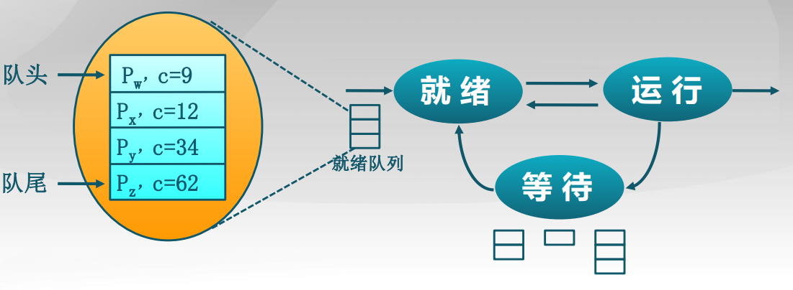


SPN与FCFS的比较：

[](http://fangkaipeng.com/wp-content/uploads/2021/03/wp_editor_md_203339639323d7478b8dbe6eb9d25f55.jpg)


## 3. 短剩余时间优先算法（SRT）

适用于抢占方式的调度方式，按剩余所需运行时间抢占,SPN算法的可抢占改进。


[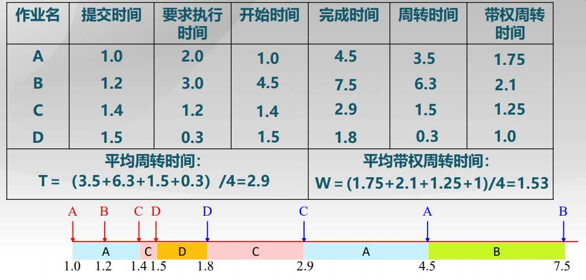](http://fangkaipeng.com/wp-content/uploads/2021/03/wp_editor_md_a75f221f03bdc3653e53bd3a20ced4b5.jpg)


**缺点：**

- 可能导致饥饿：连续的短进程流会使长进程无法获得CPU资源。
- 需要预知未来：预估下一个CPU计算的持续时间

## 3.5 最低松弛度有限算法

将其按最晚开始时间排序，即完成时间-运行时间，始终选择当前时间最近最晚开始时间进程，允许中断

## 4. 最高响应比优先算法（HRRN）

Highest Response ratio Next

选择就绪队列中响应比R值最高的进程
`Ｒ＝（ｗ+s)/s w: 等待时间(waiting time) s: 执行时间(service time)`

**优点：** 在短进程优先算法的基础上改进，关注进程的等待时间，防止无限期推迟。

## 5. 时间片轮转算法（RR，Round Robin）

**时间片：** 分配处理机资源的基本时间单元。
**算法思路：**
时间片结束时，按FCFS算法切换到下一个就绪进程，每隔(n – 1)个时间片进程执行一个时间片q。


[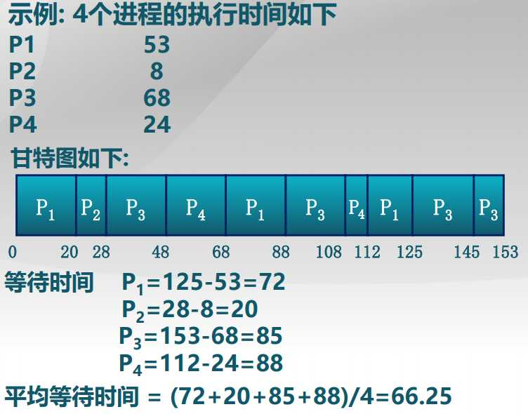](http://fangkaipeng.com/wp-content/uploads/2021/03/wp_editor_md_4c1a16d66c9d246f9036871b2b03d9cd.jpg)


**问题：**

- RR算法开销：额外的上下文切换
- 时间片太大：等待时间过长，极限情况退化成FCFS
- 时间片太小：反应迅速，但产生大量上下文切换，大量上下文切换开销影响到系统吞吐量
- 时间片长度选择目标：选择一个合适的时间片长度，经验规则：维持上下文切换开销处于1%以内

不同时间片的比较：


[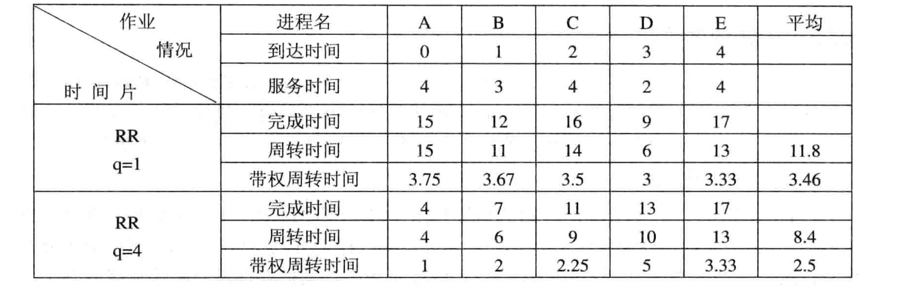](http://fangkaipeng.com/wp-content/uploads/2021/03/wp_editor_md_451395d3cb9fa4fd772acd49ea21387c.jpg)


## 6. 多级队列调度算法（MQ）

Multiple queue
就绪队列被划分成多个独立的子队列，每个队列拥有自己的调度策略

## 7.多级反馈队列算法（MLFQ）

Multiple feedback queue
\1. 设置多个就绪队列，每个队列赋予不同优先级，优先级越高的队列时间片就越小。
\2. 每个队列采用FCFS算法。新进程先放入第一队列末尾按照FCFS等待调度，轮到该进程执行时，若不能在时间片内执行完成则放入第二队列的末尾，直到放入最后一个队列的末尾，最后一个队列按照RR方式运行。

1. 按队列优先级调度，调度进程首先调度优先级高的队列中的进程，第一队列空的时候才去调度第二队列。

## 8. 公平共享调度（FSS）

FSS控制用户对系统资源的访问，一些用户组比其他用户组更重要，保证不重要的组无法垄断资源，未使用的资源按比例分配，没有达到资源使用率目标的组获得更高的优先级。

# 3.3 死锁

由于竞争资源或者通信关系，两个或更多进程(线程)在执行中出现，永远相互等待只能由其他进程引发的事件

## 3.3.1 死锁产生的原因

### 1.进程访问资源的流程

请求/获取(申请空闲资源)->使用/占用(进程占用资源)->释放(资源状态由占用变成空闲)

### 2.资源的分类


[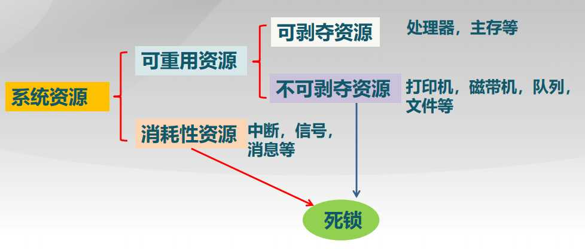](http://fangkaipeng.com/wp-content/uploads/2021/03/wp_editor_md_66280ae5fdd7a6f14868c9815963aab1.jpg)


**可重用资源：** 可供用户重读多次使用，不允许进程共享，按照进程访问资源的流程使用可重用资源。进程运行期间可重用资源不能被创建和删除。

**可消耗性资源：** 临时性资源，在进程运行过程中可以由进程动态地创建和消耗。

**可剥夺资源：** 该资源可以在已经被进程占有的前提下被其他进程或者系统抢占。

**不可剥夺资源：** 一旦系统把该资源分配给进程后，不能强行收回，只能等待自行释放，比如刻录光盘，如果中途打断会造成光盘的损坏。

### 3. 计算机系统中的死锁

**1.竞争不可剥夺资源产生死锁：**


[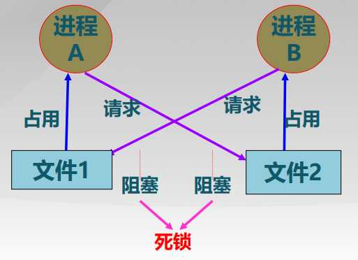](http://fangkaipeng.com/wp-content/uploads/2021/03/wp_editor_md_8535290c5ebffe0459d6077660c4a5e7.jpg)


如图，进程A占有文件1同时请求文件2,进程B占有文件2同时请求文件1，两个进程由于得不到所需的进程，一起阻塞，发生死锁。

**2. 竞争消耗性资源产生死锁：**


[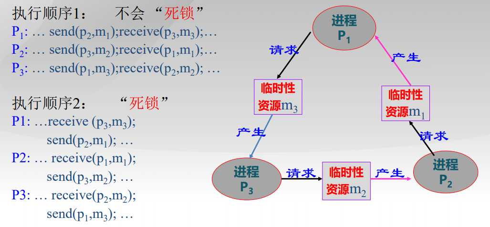](http://fangkaipeng.com/wp-content/uploads/2021/03/wp_editor_md_0dbfa56ae270a161587d7d30dab1dca6.jpg)


执行顺序不同可能会造成死锁，执行顺序2就发生了死锁。

**3. 进程推进顺序不当产生死锁：**


[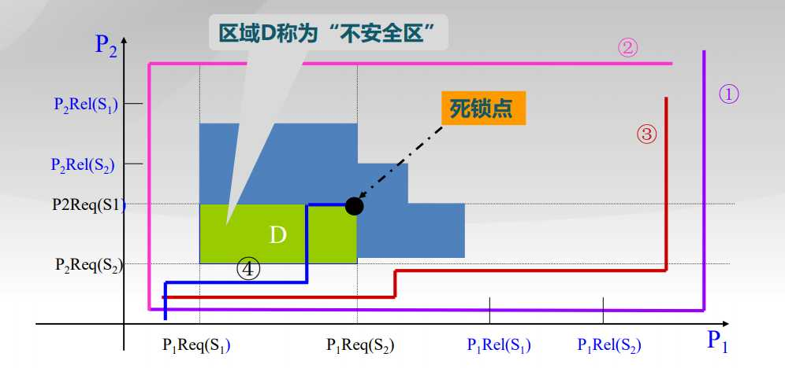](http://fangkaipeng.com/wp-content/uploads/2021/03/wp_editor_md_33c7fed3b01e8e5140e2e63ac200ab94.jpg)


曲线四：进程1先申请S1，S1分配给P1，然后进程2申请S2，S2分配给P2，接着进程1申请S2，由于S2被P2占有，S1阻塞，接着P2申请S1，同样也阻塞，进入死锁点。D区域被称为不安全区，表示进入该区域**最终**会导致死锁，并不代表进入该区域就已经死锁。

两个进程申请到了彼此需要的资源

### 4. 资源分配图


[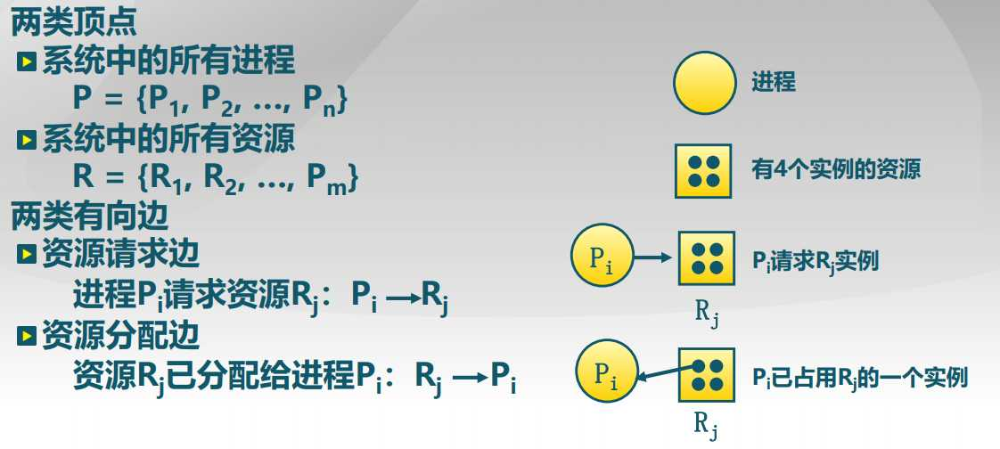](http://fangkaipeng.com/wp-content/uploads/2021/03/wp_editor_md_2f7454f5a7c51d71578bee2019124315.jpg)


### 5. 出现死锁的必要条件

- 互斥：任何时刻只能有一个进程使用一个资源实例
- 请求并保持：进程保持至少一个资源，并正在等待获取其他进程持有的资源
- 不可抢占：资源只能在进程使用后自愿释放
- 循环等待
    存在等待进程集合{P0，P1，…，PN} ，
    P0正在等待P1所占用的资源，
    P1 正在等待P2占用的资源，…，
    PN-1在等待PN所占用资源，
    PN正在等待P0所占用的资源

如下图，左边的所有进程形成了一个环，发生死锁，右边的图虽然有环，但并不包括所有进程，所以不会死锁。

[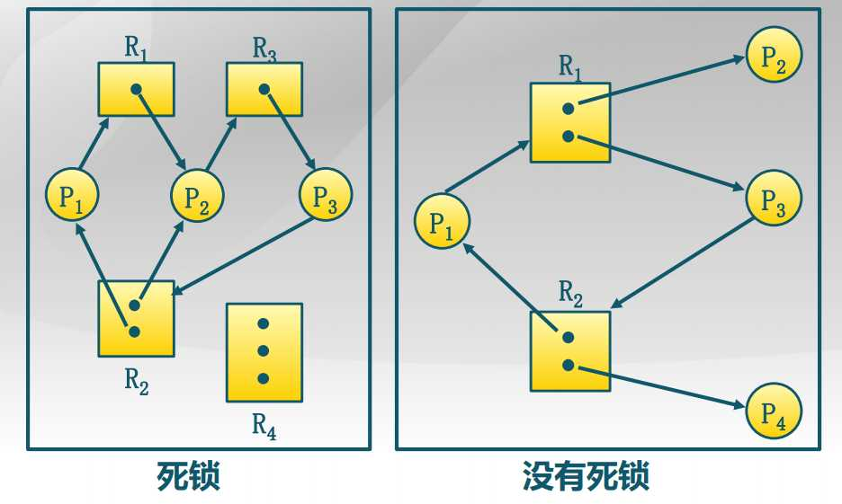](http://fangkaipeng.com/wp-content/uploads/2021/03/wp_editor_md_275381a334f6cdc3f3cd3192733b5d14.jpg)


## 3.3.2 死锁处理方法

### 1. 死锁预防(Deadlock Prevention)

确保系统永远不会进入死锁状态，预防是采用某种策略，**限制**并发进程对资源的请求，使系统在任何时刻都**不满足死锁的必要条件**。

- 互斥：把互斥的共享资源封装成可同时访问
- 持有并等待：进程请求资源时，要求它不持有任何其他资源，仅允许进程在开始执行时，一次请求所有需要的资源，资源利用率低
- 非抢占：如进程请求不能立即分配的资源，则释放已占有资源，只在能够同时获得所有需要资源时，才执行分配操作
- 循环等待：对资源排序，要求进程按顺序请求资源

### 2.死锁避免(Deadlock Avoidance)

在使用前进行判断，只允许不会出现死锁的进程请求资源。利用额外的先验信息，在分配资源时判断是否会出现死锁，只在不会死锁时分配资源。

- 要求进程声明需要资源的最大数目
- 限定提供与分配的资源数量，确保满足进程的最大需求
- 动态检查的资源分配状态，确保不会出现环形等待

### 3. 死锁检测和解除(Deadlock Detection & Recovery)

在检测到运行系统进入死锁状态后，进行死锁解除恢复。

**死锁检测：**
允许系统进入死锁状态，维护系统的资源分配图，定期调用死锁检测算法来，搜索图中是否存在死锁，出现死锁时，用死锁恢复机制进行恢复

通过对当前进程与资源构建一个图，包括申请资源和掌握资源，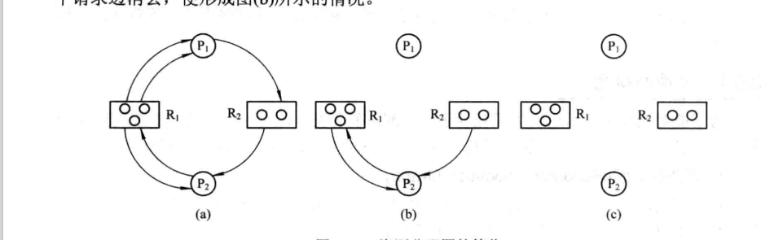

算法使用的数据结构：

​	初始work = available，每次寻找request i 小于work的，则表明当前情况下该进程可以完成，则假设该进程完成，将其加入完成进程队列L，同时将work+allocation i，即将其当前掌握的资源归还给work，一直进行该算法，若最终所有进程都在L队列中，则表明目前无死锁，若最终存在进程不在L中，则表明有死锁

​	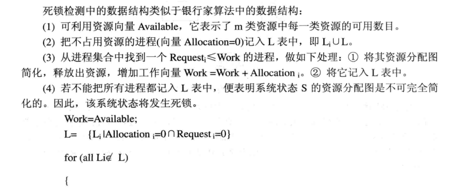

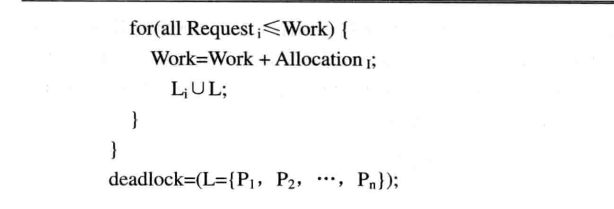

**死锁解除：**

- 进程终止：
    - 终止所有的死锁进程
    - 终止进程的顺序应该是：
        进程的优先级
        一次只终止一个进程直到死锁消除
        终止进程数目
        进程已占用资源
        进程完成需要的资源
        进程是交互还是批处理

- 资源抢占：
    - 选择被抢占进程：最小成本目标
    - 进程回退：返回到一些安全状态, 重启进程到安全状态
    - 可能出现饥饿：同一进程可能一直被选作被抢占

- 终止进程方法：

    - 终止所有进程
    - 逐个终止进程，直到其不构成死锁条件
        - 涉及到被终止进程的优先级，一般选择被终止进程代价最小
            - 进行全部代价计算，BFS或DFS，遍历求最小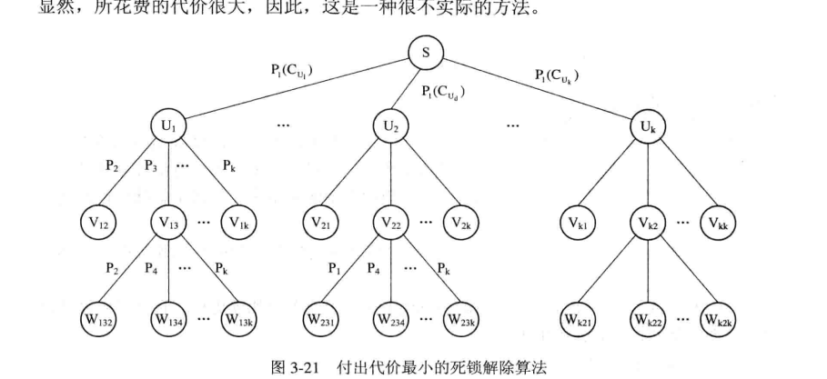
            - 贪心，只看当前终止一个进程哪个进程代价最小，则终止该进程看是否构成死锁，若构成则再进行解除


    

## 3.3.3 银行家算法

### 1.系统资源分配的安全状态

当进程请求资源时，系统判断分配后是否处于安全状态，即判断是否存在安全序列。

**安全序列：**
序列<P1，P2，…，PN>是安全的，有如下要求：

- Pi要求的资源 ≤ 当前可用资源 + 所有Pj持有资源, 其中j < i
- 如Pi的资源请求不能立即分配，则Pi等待所有Pj（j < i）完成
- Pi完成后，Pi + 1可得到所需资源，执行并释放所分配的资源
- 最终整个序列的所有Pi都能获得所需资源

**安全状态与死锁的关系**

- 系统处于安全状态，一定没有死锁
- 系统处于不安全状态，可能出现死锁，所以避免死锁就是确保系统不会进入不安全状态

### 2.银行家算法（Banker’s Algorithm）定义

银行家算法是一个避免死锁产生的算法。以银行借贷分配策略为基础，判断并保证系统处于安全状态。

- 客户在第一次申请贷款时，声明所需最大资金量，在满足所有贷款要求并完成项目时，及时归还
- 在客户贷款数量不超过银行拥有的最大值时，银行家尽量满足客户需要

这里的银行家就是操作系统，资金就是资源，客户就是申请资源的线程。

### 3.数据结构

- **n** = 进程数量, **m** = 资源类型数量
- **Max（总需求量）**: n×m矩阵
    进程Pi最多请求类型Rj的资源 Max[i,j] 个实例
- **Available（剩余空闲量）**：长度为m的向量
    当前有 Available[j] 个类型Rj的资源实例可用
- **Allocation（已分配量）**：n×m矩阵
    进程Pi 当前分配了 Allocation[i, j] 个Rj的实例
- **Need（未来需要量）**：n×m矩阵
    进程Pi未来需要 Need[i, j] 个Rj资源实例
- **Need[i,j] = Max[i,j] – Allocation[i,j]**

### 4.安全状态的判断

1. **Work** 和 **Finish** 分别是长度为m和n的向量初始化:

```cpp
Work = Available; //Work表示当前资源剩余空闲量
for(int i = 1; i <= n; i++) //全部进程一开始都未执行
Finish[i] = false;
```

1. 寻找进程Pi

```cpp
for(int i = 1; i <= n; i++) {
    if(Finish[i] == false && Need[i][j] <= Work[j]) break;//找到满足的进程Pi
}
//如果没找到进入第4步骤
```

1. 更新有关信息

```cpp
Finish[i] = true;//表示进程i已经运行
Work[j] = Work[j]+Allocation[i][j];//回收进程i已分配的资源
```

1. 判断是否为安全状态

```cpp
bool judge(){
    for(int i = 1; i <= n; i++) {
        if(Finish[i] == false) return false;// 有进程未执行，不安全
    }
    return true;//全部进程都执行过，安全状态
}
```

### 5. 银行家算法

- 初始化:
    `Request[i]`表示进程`Pi`的资源请求向量
    `Request[i][j]`表示进程`Pi`请求资源`Rj`的实例个数

- 循环:

    1. 如果 `Request[i][j] <= Need[i][j]`, 转到步骤2。否则, 拒绝资源申请, 因为进程已经超过了其最大要求

    2. 如果 `Request[i][j] <= Available[j]`, 转到步骤3。否则, `Pi` 必须等待, 因为资源不可用

    3. 通过安全状态判断来确定是否分配资源给Pi:(预分配）

        生成一个需要判断状态是否安全的资源分配环境:（模拟已经分配后的场景，判断是否安全）

        

        ```cpp
        Available[j] = Available[j] - Request[i][j] ;
        Allocation[i][j]= Allocation[i][j] + Request[i][j] ;
        Need[i][j]= Need[i][j] – Request[i][j] ;
        ```

- 调用安全状态判断
    如果返回结果是安全，将资源分配给`Pi` (实施本次分配）
    如果返回结果是不安全，系统会拒绝`Pi`的资源请求 (撤销预分配）