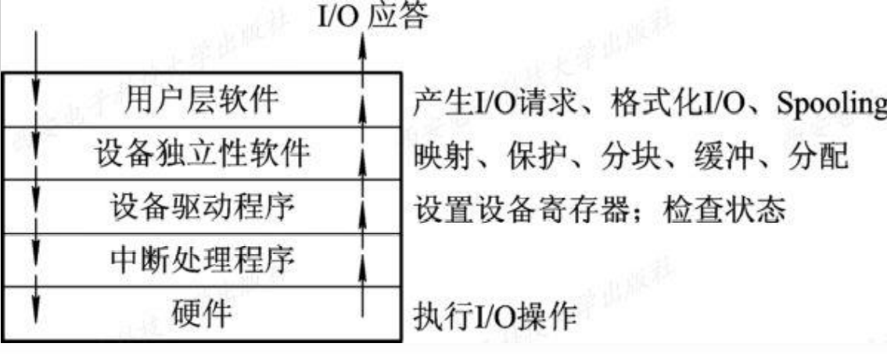
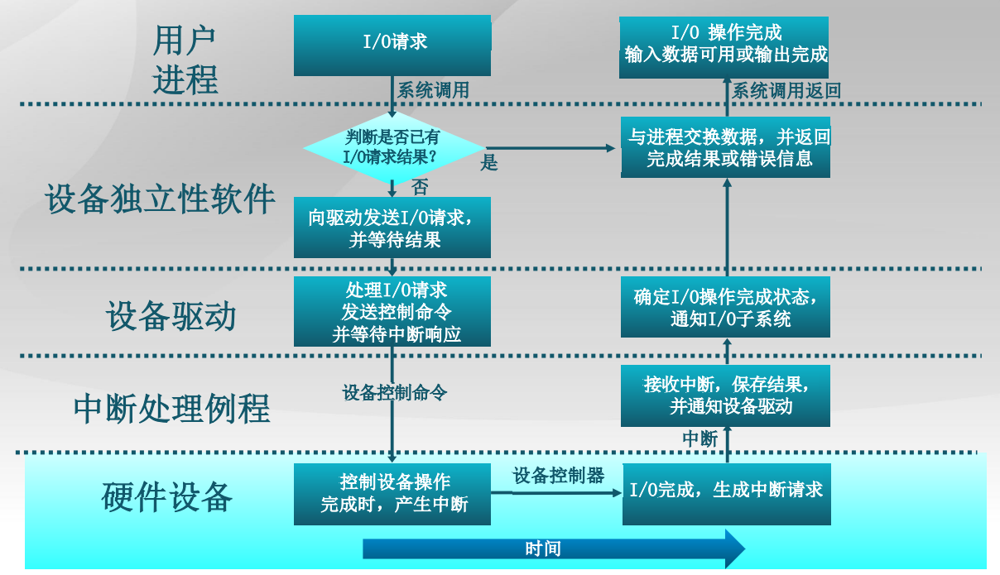
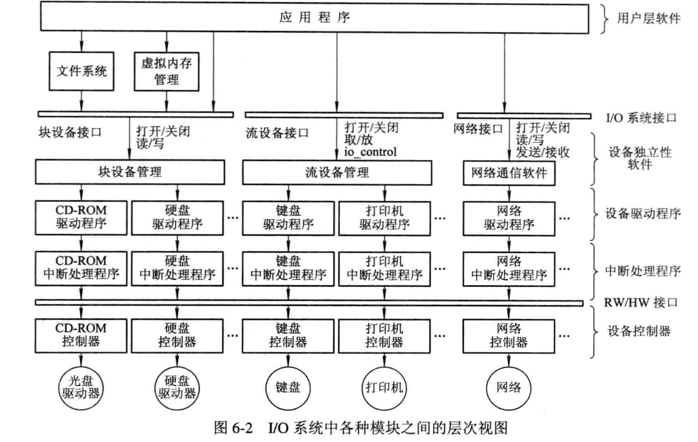
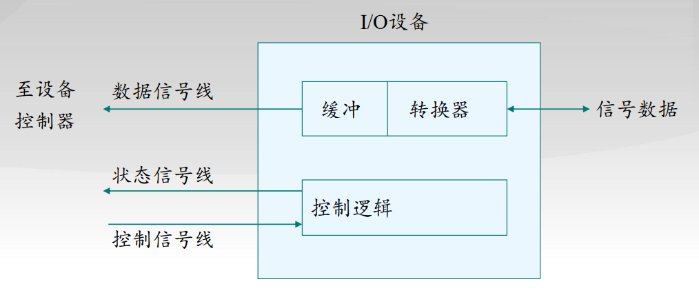
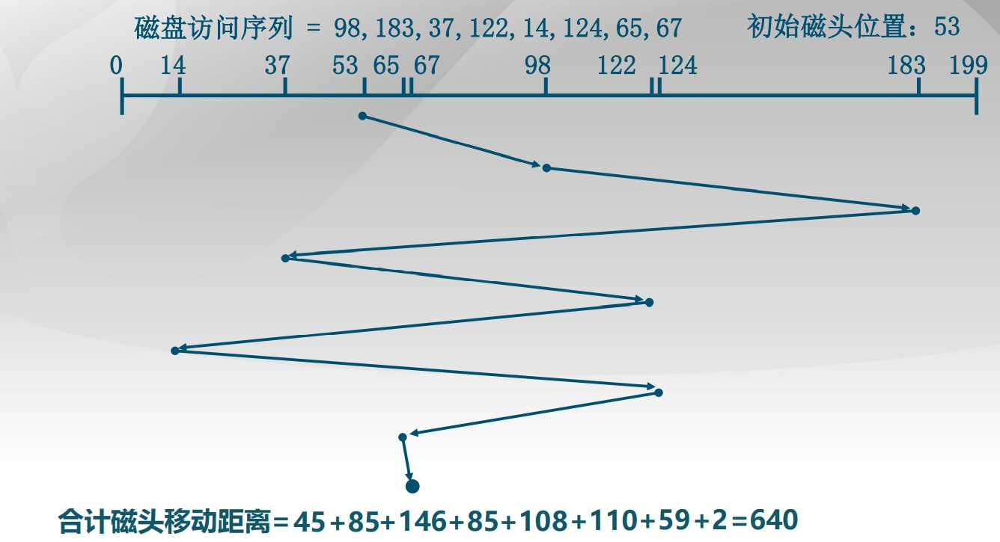
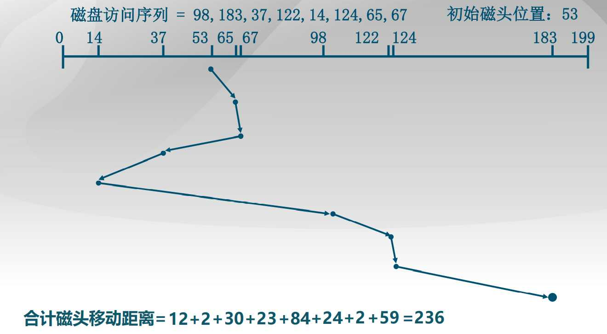

# 6.1 I/O系统的功能、模型和接口

**I/O系统管理的主要对象：** I/O设备，设备控制器。

**I/O系统的主要任务：** 完成用户提出的I/O请求； 提高I/O速率； 提高设备的利用率；为更高层的进程方便地使用这些设备提供手段;

## 6.1.1 I/O系统的基本功能

### 1. 隐藏物理设备的细节

I/O设备的类型非常多，且彼此间在多方面都有差异，诸如它们 接收和产生数据的速度，传输方向、粒度、数据的表示形式及可靠 性等方面。

### 2. 与设备的无关性

隐藏物理设备的细节，在早期的OS中就已实现，它可方便用户 对设备的使用。与设备的无关性是在较晚时才实现的，这是在隐藏 物理设细节的基础上实现的。

### 3. 提高处理机和I/O设备的利用率

要尽可能地让处理机和I/O设备并行操作，以提高它们的利用率: ①处理机能快速响应用户的I/O请求，使I/O设备尽快地运行起来； ②尽量减少在每个I/O设备运行时处理机的干预时间。

### 4. 对I/O设备进行控制

对I/O设备进行控制是驱动程序的功能，目前有四种控制方式： ① 采用轮询的可编程I/O方式； ② 采用中断的可编程I/O方式； ③ 直接存储器访问方式； ④ I/O通道方式。

### 5. 确保对设备的正确共享

从设备的共享属性上，可将系统中的设备分为如下两类： (1) 独占设备：进程应互斥地访问这类设备。如：打印机、磁带机等。 (2) 共享设备：在一段时间内允许多个进程同时访问的设备，如磁盘。

### 6. 错误处理

由于设备包括了较多的机械和电气部分，运行时容易出现错误和故障。从 处理的角度，可将错误分为临时性错误和持久性错误。对于临时性错误，可通过 重试操作来纠正，只有在发生了持久性错误时，才需要向上层报告。

## 6.1.2 I/O系统的层次结构和模型

### 1. I/O软件的层次结构

- 用户层软件

    与用户交互的接口，用户可直接调用该层的库函数对设备进场操作

- 设备独立性软件

    用于实现用户程序与设备驱动器的统一接口，设备命名，设备保护以及设备分配和释放

- 设备驱动程序

    与硬件相关，用于具体实现系统对设备发出的操作指令。

- 中断处理程序

    保存被中断进场的CPU环境，转入相应的中断处理程序进行处理，处理完恢复现场

**I/O请求生存周期**

### 2. I/O系统中各种模块之间的层次视图

- I/O系统接口

    它是I/O系统和上次系统之间的接口，向上层提供设备进行操作的抽象命令，根据设备类型不同，可分为：

    - 块设备接口

    块设备：指数据的存储和传输都是以数据块为单位的设备，常见的是磁盘。磁盘的地址需要用磁道号和扇区号表示，当上层发来读命令的时候，该接口会将抽象的命令转换为磁盘的盘面，磁道和扇区。

    - 流设备接口

    字符设备：数据的存储和传输都是以字节为单位的设备，常见的是键盘，打印机。字符设备通常设立一个字符缓冲区，I/O字符流顺序的进入字符缓冲区，顺序的送出

    - 网络通信接口

- 软件/硬件（RW/HW）接口

    软硬件接口，上面是中断处理程序和用于不同设备的设备驱动程序，下面是各种设备的控制器，这两个接口之间就I/O系统

- I/O系统

    - 中断处理程序

    直接与硬件交换，当有中断信号来时，中断处理程序首先保存被中断进场的CPU环境，然后转入相应的设备中断程序处理，处理完后恢复现场。

    - 设备驱动程序

    驱动程序是进程和设备控制器直接的通信程序，将上层发来的抽象I/O请求转换为对I/O设备的具体命令和参数，并把它装入到设备控制器中的命令和参数寄存器。

    - 设备独立性软件

    实现与设备无关，I/O软件独立与具体使用的物理设备

## 6.1.3.常见设备接口类型

- 字符设备接口（流设备）如: 键盘/鼠标, 串口等
- 块设备接口 如: 磁盘驱动器、磁带驱动器、光驱等
- 网络设备接口 如: 以太网、无线、蓝牙等

# 6.2 I/O设备和设备控制器

I/O系统是适用于实现数据输入、输出及数据存储的系统。在 I/O系统中除了需要直接用于I/O和存储信息的设备外，还需要有 相应的设备控制器和高速总线。在有的大、中型计算机系统中， 还配置了I/O通道和I/O处理机.。

## 6.2.1 I/O设备

### 1. I/O设备的类型

- 按设备的使用特性分类：
    - 存储设备：用于存储信息的主要设备。
    - 输入/输出设备：可分为输入设备、输出设备和交互式设备
- 设备按传输速率分类：
    - 低速设备：传输速率仅为每秒钟几个字节至数百个字节的 一类设备。
    - 中速设备：传输速率为每秒钟数千个字节至数万个字节的 一类设备。
    - 高速设备：传输速率为每秒钟数百个千字节至数十兆字节 的一类设备。
- 设备按信息交换的单位分类：
    - 块设备：用于存储信息。对于信息的存取总是以数据块为单 位。典型例子是磁盘。该类设备基本特征是传输速率较高， 另一特征是可寻址。工作方式常采用DMA方式。
    - 字符设备：用于数据的输入和输出。基本单位是字符。如交 互式终端、打印机等。其基本特征是传输速率较低，另一特 征是不可寻址。工作方式常采用中断方式。
- 设备按其共享属性分类：
    - 独占设备：指在一段时间内只允许一个用户（进程）访问的 设备，即临界资源。应互斥的访问独占设备。
    - 共享设备：指在一段时间内允许多个进程同时访问的设备。 而某一时刻仍然是一个进程访问。如磁盘。
    - 虚拟设备：指通过虚拟技术将一台独占设备变换为若干台逻 辑设备，供若干个用户（进程）同时使用。

### 2. 设备与控制器之间的接口

通常设备并不是直接与CPU进行通信，而是与设备控制器通信，在设备 与设备控制器之间有一接口，有三种类型的信号，各对应一条信号线。

- 数据信号线 用于在设备和设备控制器之间传送数据信号。

    

- 控制信号线 设备控制器向I/O设备发送控制信号的通路，该信号规定设备将要执行的操作。

- 状态信号线 用于传送指示设备当前状态的信号。

# 6.3 中断机构和中断处理程序

# 6.4 设备驱动程序

# 6.5 与设备无关的I/O软件

# 6.6 用户层的I/O软件

# 6.7 缓冲区管理

# 6.8 磁盘存储器的性能和调度

## 6.8.1 磁盘性能简述

磁盘设备可包括一个或多个物理盘片，每个磁盘片分一个或两个存储面(Surface，每个盘面上有若干个磁道(Track) 。为使处理简单起见，在每条磁道上可存储相同数目的二进制位。读取或写入时，磁头必须被定位在期望的磁道，并从所期望的柱面和扇区的开始。

**寻道时间：** 定位到期望的磁道所花费的时间

**旋转延迟：** 从零扇区开始处到达目的地花费的时间

**平均旋转延迟时间：**：磁盘旋转一周时间的一半

**磁盘I/O传输时间：** Ta=Ts+12r+brN
其中 Ts 表示寻道时间，与磁盘转速有关，12r 表示旋转延时，brN 表示传输时间，b表示单次传输的字节数，N表示一个磁道的字节数，r表示磁盘转速。寻道时间和传输时间只能通过硬件层面进行优化，但是我们可以通过优化磁盘访问请求顺序来缩短寻道时间，从而提高磁盘访问性能。

## 6.8.2 磁盘调度算法

### 1.先进先出(FIFO)算法

**原理：** 按顺序处理请求，公平对待所有进程，在有很多进程的情况下，接近随机调度的性能。

### 2. 最短服务时间优先(SSTF)

**原理：** 选择从磁臂当前位置需要移动最少的I/O请求，总是选择最短寻道时间。

### 3. 扫描(SCAN)算法

SSTF算法的实质是基于优先级的调度算法，因此就可能导致优先级低的进程发生“饥饿”(Starvation)现象。因为只要不断有新进程的请求到达，且其所要访问的磁道与磁头当前所在磁道的距离较近，这种新进程的I/O请求必然优先满足。在对SSTF算法略加修改后，则可防止低优先级进程出现“饥饿”现象。

**原理：**
磁臂在一个方向上移动，访问所有未完成的请求，直到磁臂到达该方向上最后的磁道后调换方向，也称为电梯算法(elevator algorithm)

### 4. 循环扫描(C-SCAN)算法

SCAN算法既能获得较好的寻道性能，又能防止“饥饿”现象，故被广泛用于大、中、小型机器和网络中的磁盘调度。但也存在这样的问题：当磁头刚从里向外移动而越过了某一磁道时，恰好又有一进程请求访问此磁道，这时，该进程必须等待，待磁头继续从里向外，然后再从外向里扫描完处于外面的所有要访问的磁道后，才处理该进程的请求，致使该进程的请求被大大地推迟。

**C-SCAN 原理：** 限制了仅在一个方向上扫描当最后一个磁道也被访问过了后，磁臂返回到磁盘的另外一端再次进行

### 5. N步扫描(N-step-SCAN)算法

**磁头粘着(Arm Stickiness)现象**
SSTF、SCAN及CSCAN等算法中，可能出现磁头停留在某处不动的情况。
如：进程反复请求对某一磁道的I/O操作。
**N步扫描算法**
将磁盘请求队列分成长度为N的子队列，按FIFO算法依次处理所有子队列，扫描算法处理每个队列。
N值取得很大时，其性能接近SCAN算法；N=1时，则退化为FCFS算法。

### 5. 双队列扫描(FSCAN)算法

FSCAN算法是N步扫描算法的简化，FSCAN只将磁盘请求队列分成两个子队列
**FSCAN算法：**
把磁盘I/O请求分成两个队列，交替使用扫描算法处理一个队列，新生成的磁盘I/O请求放入另一队列中，所有的新请求都将被推迟到下一次扫描时处理。