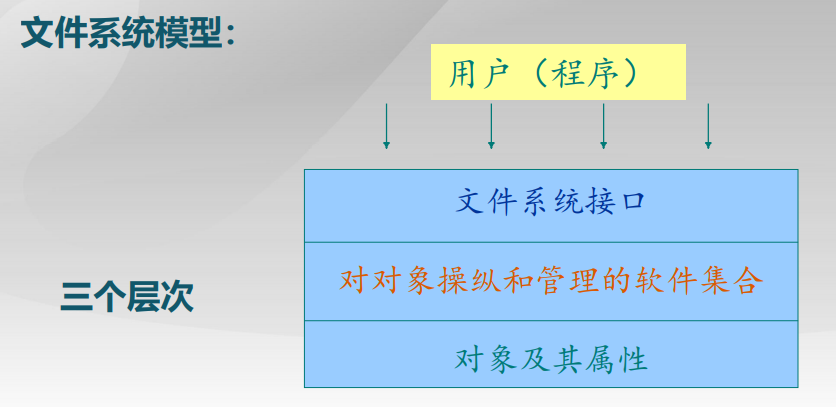
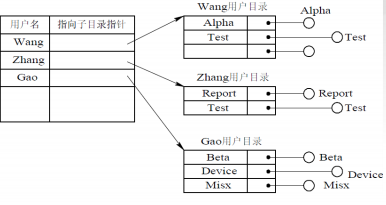
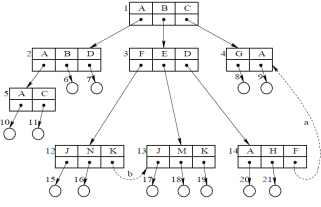
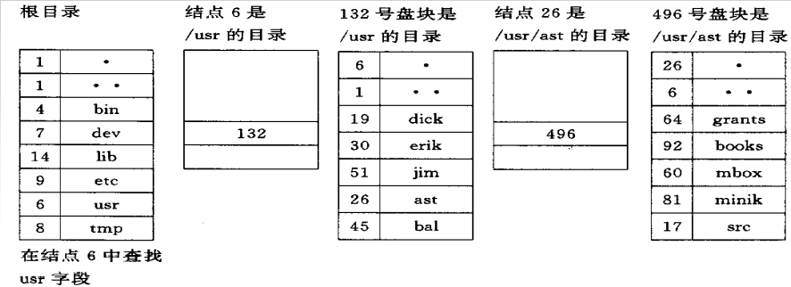

# 7.1 文件和文件系统

## 7.1.1 文件、记录和数据项

现代OS中是通过文件系统来组织和管理计算机中存储的数据；

文件则是指具有文件名的若干相关元素的集合。

基于文件系统的概念，可以把数据组成分为数据项、记录和文件三级。

**文件类型：**可以从不同的角度来规定文件的类型。如源文件、 目标文件及可执行文件。

**文件长度：**指文件的当前长度，长度的单位可以是字节、字或 块，也可能是最大允许的长度。

**文件的物理位置：**通常是用于指示文件在哪一个设备上及在该 设备的哪一个位置的指针。

**文件的建立时间：**指最后一次的修改时间等。

## 7.1.2 文件名和类型

按用途分类：系统文件、用户文件和库文件；

按文件中数据的形式分类：源文件、目标文件和可执行文件；

按存取控制属性分类：只执行文件、只读文件和读写文件；

按组织形式和处理方式分类： 普通文件、目录文件、特殊文件；

## 7.1.3 文件系统的层次结构

**对象及其属性：**文件管理系统的对象有：文件、目录和磁盘存储空间。

**对对象操纵和管理的软件集合：**是文件管理的核心部分。实现了 文件系统的大部分功能：对文件存储空间的管理、对文件目录的 理、将文件的地址转换机制、对文件读写管理以及对文件的共 享和保护。

**文件系统的接口：**命令接口（用户与文件系统）和程序接口（用户程序和文件系统）。

## 7.1.4 文件操作

用户通过文件系统所提供的系统调用实施对文件的操作。最基本 的文件操作有：创建文件、删除文件、读文件、写文件、设置文件的读/写位置。 但对于一个实际的OS，为了方便用户使用文件而提供了更多地对文件的操作，如打开和关闭一个文件及改变文件名等操作。

**文件的“打开”和“关闭”操作：**

- 所谓“打开”，是指系统将指名文件的属性从外存拷贝到内存打开文件表的一个表目中，并将该表目的编号返回给用户。以后当用户再要求对该文件操作时，便可利用系统所返回的索引号向系统提出操作请求。此时可直接利用索引号到打开文件表中查找， 避免了再次检索。这样不仅节省大量检索开销而且显著提高操作 速度。
- 当用户不再需要对该文件实施相应的操作时，可利用“关闭”此文件，OS将会把该文件从打开文件表中的表目上删除。

# 7.2 文件的逻辑结构

通常文件是由一系列的记录组成的。文件系统设计的关键要素，是将这些记录构成一个文件的方法，以及将一个文件存储到外存上的方法。任何一个文件都存在以下两种形式的结构：

- 文件的逻辑结构。从用户观点出发所观察到的文件组织形式，是用户可以直接处理的数据及其结构，它独立于文件的物理特性， 又称为文件组织。
- 文件的物理结构。又称为文件的存储结构，是指文件在外存上的存储组织形式。与存储介质的存储性能和采用的外存分配方式有关。

## 7.2.1 文件逻辑结构的类型

按文件是否有结构可以分为两大类：

- 有结构文件：是指由一个以上的记录构成的文件，又把它称为记录式文件；根据记录的长度可分为定长记录文件；不定长记录文件。

    根据记录的组织方式分为下列文件：

    - 顺序文件：由一系列记录按某种顺序排列所形成的文件。通常是定长记录。
    - 索引文件：当记录可变长时，通常为之建立一张索引表，并为每个记录设置一个表项以加快对记录检索的速度。
    - 索引顺序文件：上述两种方式的结合。为文件建立一张索引表， 为每一组记录中的第一个记录设置一个表项。

- 无结构文件：是指由字符流构成的文件，故又称为是流式文件。

    

## 7.2.2 顺序文件

### 1. 逻辑记录的排序

- 串结构：各记录之间的顺序与关键字无关。通常由时间来决定。
- 顺序结构：文件中的所有记录按关键字排列。可以按关键字的长短或英文字母书写排序。顺序结构的检索效率更高。

优点：

- 顺序文件的最佳应用场合是在对诸记录进行批量存取时，即每次操作 一大批记录。只有顺序文件才能存储在磁带上，并有效的工作。

缺点：

- 在交互应用的场合，比如查询或修改时，如果进程操作对象是单个记 录，顺序文件的性能就可能很差，当文件较大时更差。

    

- 增加或删除一个记录都比较困难（解决方法：引入日志文件存放更新信息，周期性合并到主文件）。

### 2. 记录寻址方式

**隐式寻址方式：**

对于定长记录的顺序文件，如果已知当前记录的逻辑地址，便很容易确定下一个记录的逻辑地址。而变长记录的顺序文件需要从头开始依次往后累加计算地址，相对较慢。

**显式寻址方式：**

该方式可用于对定长记录的文件实现直接或随机访问。因为任何记录的位 置都很容易通过记录长度计算出来。而对于可变长度记录的文件则不能利用显式寻址方式实现直接或随机访问，必须增加适当的支持机构方能实现。 通过两种方式对**定长记录**实现随机访问：

(1) 通过文件中记录的位置。

(2) 利用关键字。

## 7.2.3 索引文件

### 1. 按关键字建立索引

定长记录的文件可以通过简单的计算，很容易地实现随机查找。但变长记录文件查找一个记录必须从第一个记录查起，一直顺序查找到目标记录为止，耗时很长。 变长记录建立索引表后，索引表是定长记录的顺序文件，就可以把对变长记录顺序文件的顺序检索变为对定长记录索引文件的随机检索。

### 2. 具有多个索引表的索引文件

使用按关键字建立索引表的索引文件与顺序文件一样，都只能按该关键字进 行检索。而实际应用情况往往是：不同的用户，为了不同的目的，希望能**按不同的属性**(或不同的关键字)来检索一条记录。为实现此要求，需要为顺序文件建立多个索引表，即为每一种可能成为检索条件的域(属性或关键字)都配置一张索引表。 在每一个索引表中，都按相应的一种属性或关键字进行排序。

## 7.2.4 索引顺序文件

### 1. 索引顺序文件的特征

索引顺序文件是对顺序文件的一种改进，它基本上克服了变长记录的 顺序文件不能随机访问，以及不便于记录的删除和插入的缺点。但它仍保 留了顺序文件的关键特征，即记录是按关键字的顺序组织起来的。它又增 加了两个新特征：一个是引入了文件索引表，通过该表可以实现对索引顺 序文件的随机访问；另一个是增加了溢出(overflow)文件，用它来记录新 增加的、删除的和修改的记录。

### 2. 一级索引顺序文件

最简单的索引顺序文件只使用了一级索引。其具体的建立方法是，首先将变长记 录顺序文件中的所有记录分为若干个组，如50个记录为一个组。然后为顺序文件建立 一张索引表，并为每组中的第一个记录在索引表中建立一个索引项，其中含有该记录 的关键字和指向该记录的指针，索引顺序文件是最常见的一种逻辑文件形式。

### 3. 两级索引顺序文件

对于一个非常大的文件，为找到一个记录而须查找的记录数目仍然很 多，例如，对于一个含有106个记录的顺序文件，当把它作为索引顺序文 件时，为找到一个记录，平均须查找1000个记录。为了进一步提高检索 效率，可以为顺序文件建立多级索引，即为索引文件再建立一张索引表， 从而形成两级索引表，其平均须查找只需150个记录。

## 7.2.5 直接文件和哈希文件

### 1. 直接文件

采用前述几种文件结构对记录进行存取时，都须利用给定的记 录键值，先对线性表进行检索，以找到指定记录的物理地址。然 而对直接文件，则可根据给定的记录键值，直接获得指定记录的 物理地址。换言之，记录键值本身就决定了记录的物理地址，组 织直接文件的关键，在于用什么方法进行从记录值到物理地址的转换。

### 2. Hash文件的逻辑结构

若令K为记录键值，用A作为通过Hash函数转换所形成的该记录在 目录表中对应表目的位置，则有关系A=H(K)。通常把Hash函数 作为标准函数存于系统中，供存取文件时调用。

# 7.3 文件目录

通常在现代计算机系统中，都要存储大量的文件。为了能对这些 文件实施有效的管理，必须对它们加以妥善组织，这主要是通过 文件目录来实现的。文件目录也是一种数据结构，用于标识系统 中的文件及其物理地址，供检索时使用。对目录管理的要求如下：

- 实现“按名存取”。
- 提高对目录的检索速度。
- 文件共享。
- 允许文件重名。、

## 7.3.1 文件控制块和索引结点

为了能对一个文件进行正确的存取，必须为文件设置用于描述和控制文 件的数据结构，称之为”**文件控制块（FCB）**” 文件管理程序可借助于文件控制块中的信息对文件施以各种操作。**文件与文件控制块一一对应**，而人们把文**件控制块的有序集合称为文件目录**， 即一个文件控制块就是一个文件目录项。通常一个文件目录也被看作是 一个文件，称为目录文件。

### 1. 内容

FCB通常含有三类信息：

基本信息类。包括：文件名，文件物理位置，文件逻辑结构，文件 的物理结构。

存取控制信息类。包括：文件主的存取权限，核准用户的存取权限 和一般用户的存取权限。

使用信息类。包括：文件的建立日期和时间、文件上次修改的日期 和时间及当前使用信息。

### 2. 索引结点的引入

文件目录通常是存放在磁盘上的，当文件很多时，文件目录要占用大 量的盘块。在检索目录文件的时候，需要将目录调入内存后比较文件名， 但是只用到文件名，而不需要其它那些对文件的描述信息。所以便把文件名与文件信息分开，使文件描述信息（文件名和索引结点编号，索引结点编号用于寻找索引结点来获取文件具体信息）单独形成一个索引结点（ i 结点）。

**磁盘索引结点：** 存放在磁盘上的索引结点。每个文件有唯一的一个磁盘索引结点， 主要包括以下内容：

文件主标识符。文件类型。文件存取权限。文件物理地址。文件长度。文件链接计数。文件存取时间。

**内存索引结点：**放在内存中的索引结点。当文件被打开后，将磁盘索引结点拷贝到 内存索引结点中以便使用。 比磁盘索引结点增加了以下内容： 索引结点编号；状态；访问计数； 文件所属文件系统的逻辑设备号；链接指针。

## 7.3.2 目录结构

### 1. 单级目录结构

最简单的目录结构。整个文件系统中只建立一张目录表，每个文件一 个目录项，目录项含有文件相关信息。状态位表明每个目录项是否空闲。

- 优点： 简单且能实现目录管理的基本功能。

    

- 缺点： 查找速度慢。 不允许重名。名字过多难记忆。多用户环境下重名难以避免。 不便于实现文件共享。

### 2. 两级目录结构

为了克服单级目录所存在的缺点，可以为每个用户建立一个单 独的用户文件目录UFD。由该用户所有文件的文件控制块组成。

在系统中再建立一个主文件目录MFD。在主文件目录中每个用 户目录文件都占有一个目录项，其中包括用户名和指向该用户文 件的指针。

基本克服了单级目录的缺点，并具有以下优点： 提高了检索目录的速度。 在不同的目录中可以有相同的文件名。 不同用户还可以使用不同的文件名来访问系统中的同一个共享文件。

存在的问题是：各用户之间被完全隔离了，无法进行合作。

## 7.3.3 多级目录结构（树型目录结构）

大型系统通常采用三级或三级以上的目录结构，以提高目录的检索速度和文件系统的性能。多级目录结构又称为树型目录结构， 主目录称为根目录，数据文件为树叶，其它目录为结点。

## 7.3.4 目录查询技术

当用户要访问一个已存文件时，系统首先利用用户提供的文件名对目录进行查询，找出该文件控制块或对应索引结点；然后根据 FCB或索引结点中所记录的文件物理地址，换算出文件在磁盘上的 物理位置；最后通过磁盘驱动程序，将所需文件读入内存。

目前对目录进行查询的方式有两种：线性检索法和Hash方法。

### 1. 线性检索法

又称为顺序检索法。 假定用户给定的文件路径是/usr/ast/mbox，则查找过程：

### 2. Hash方法

建立了一张Hash索引文件目录，利用Hash 方法进行查询， 即系统利用用户提供的文件名并将它变换为文件目录的索引 值，再利用该索引值到目录中去查找，显著地提高检索速度。

# 7.4 文件共享

## 7.4.1 基于索引结点的共享方式

在树型结构的目录中，当有两个（或多个）用户要共享一个子目 录或文件时，必须将共享文件或子目录连接到两个（或多个）用 户的目录中，才能方便得找到该文件。此时该文件系统的目录结 构已不再是树型结构，而是个有向非循环图。 如果通过在文件目录中包含文件的物理地址的方法实现共享有很 多缺陷。故采用基于索引结点的共享方式。

## 7.4.2 利用符号链实现文件共享

为使B能共享C的一个文件F，可以由系统创建一个LINK类型的新 文件，也取名为F，并将F写入B的目录中，以实现B的目录与文件 F的链接。在新文件中只包含被链接文件F的路径名。这样的链接 方法被称为符号链接。当B要访问被链接的文件F且正要读LINK类 新文件时，将被OS截获，OS根据新文件中的路径名去读该文件， 于是就实现了B对文件F的共享。