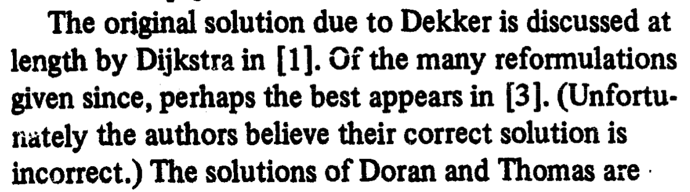

理解并发程序执行

# 理解并发程序执行

[蒋炎岩](http://ics.nju.edu.cn/~jyy "")

## Overview

复习

- 并发程序 = 多个执行流、共享内存的状态机

---

本次课回答的问题

- **Q** : 如何阅读理解教科书/互联网/期末试卷上的各种并发程序？

---

本次课主要内容

- (自动) 画状态机理解并发程序

# 画状态机理解并发程序

## 一个互斥算法

> 互斥：保证两个线程不能同时执行一段代码。

插入 “神秘代码”，使得 [sum.c](https://jyywiki.cn/pages/OS/2022/demos/sum.c "") (或者任意其他代码) 能够正常工作

```
void Tsum() {
  // 神秘代码
  sum++;
  // 神秘代码
}
```

- 假设一个内存的读/写可以保证顺序、原子完成

```
__sync_synchronize();
x = 1; // 或 int t = x;
__sync_synchronize();
```

## 失败的尝试

```
int locked = UNLOCK;

void critical_section() {
retry:
  if (locked != UNLOCK) {
    goto retry;
  }
  locked = LOCK;

  // critical section

  locked = UNLOCK;
}
```

和山寨 [alipay.c](https://jyywiki.cn/pages/OS/2022/demos/alipay.c "") 完全一样的错误

- 处理器默认不保证 load + store 的原子性

## 正确性不明的奇怪尝试 (Peterson 算法)

A 和 B 争用厕所的包厢

- 想进入包厢之前，A/B 都要先举起自己的旗子
	- A 确认旗子举好以后，往厕所门上贴上 “B 正在使用” 的标签
	- B 确认旗子举好以后，往厕所门上贴上 “A 正在使用” 的标签
- 然后，
	如果对方的旗子举起来，且门上的名字不是自己
	，等待
	- 否则可以进入包厢
- 出包厢后，放下自己的旗子
- 先进行举旗的一定先执行


## 习题：证明 Peterson 算法正确，或给出反例

进入临界区的情况

- 如果只有一个人举旗，他就可以直接进入
- 如果两个人同时举旗，由厕所门上的标签决定谁进
	- 手快 🈶️ (被另一个人的标签覆盖)、手慢 🈚

---

一些具体的细节情况

- A 看到 B 没有举旗
	- B 一定不在临界区
	- 或者 B 想进但还没来得及把 “A 正在使用” 贴在门上	
		- memory ordering
- A 看到 B 举旗子
	- A 一定已经把旗子举起来了 (*!@^#* &amp;!%^(&amp;^!@%#

## Prove by Brute-force!

枚举状态机的全部状态 (假设没有乱序、每步执行一行)

- $(PC_1, PC_2, x, y, turn)$; [peterson-simple.c](https://jyywiki.cn/pages/OS/2022/demos/peterson-simple.c "")

```
int x = 0, y = 0, turn = A;
void TA() {
    while (1) {
/* PC=1 */  x = 1;
/* PC=2 */  turn = B;
/* PC=3 */  while (y && turn == B) ;
            critical_section();
/* PC=4 */  x = 0; } }
void TB() {
  while (1) {
/* PC=1 */  y = 1;
/* PC=2 */  turn = A;
/* PC=3 */  while (x && turn == A) ;
            critical_section();
/* PC=4 */  y = 0; } }
```

## Peterson's Protocol Verified 🎖

> 我们 (在完全不理解算法的前提下) 证明了 Sequential 内存模型下 Peterson's Protocol 的 Safety。它能够实现互斥。



并发编程比大家想象得困难

- 感受一下 [dekker.py](https://jyywiki.cn/pages/OS/2022/demos/dekker.py "")
- “[Myths about the mutual exclusion problem](https://zoo.cs.yale.edu/classes/cs323/doc/Peterson.pdf "")” (IPL, 1981)


和一些现状

- 今天有非常坚 (内) 实 (卷) 的理论体系
- 小心编译器和多处理器硬件
	- [peterson-barrier.c](https://jyywiki.cn/pages/OS/2022/demos/peterson-barrier.c "") (哪些 barrier 是多余的吗？)

# (自动) 画状态机理解并发程序

## 画状态机实在太累了

判断是否发生死锁：通过看其是否构成有环图

并发算法的设计困境

- 不敢不画：谁知道有什么奇怪情况会发生？
- 不敢乱画：画错了就都完了

---

解决困境 💡

- 能不能让电脑帮我们画？
- 我们有程序的形式语义 (数学定义)，就能写解释器模拟执行
	- 说起来容易，但需要写多少代码呢……？

## 年轻人的第一个 Model Checker


选择正确的语言

- 当然是 Python 啦
- 容易 hack 的动态语言
- 丰富的库函数

---

选正确的语言机制

- [model-checker.py](https://jyywiki.cn/pages/OS/2022/demos/model-checker.py "")
	- ~~代码量达到了惊人的 150 行~~ ！
	- UNIX Philosophy: 写能合作的程序	
		- Model checker 只负责输出 “状态图”
- 试试威力：[mutex-bad.py](https://jyywiki.cn/pages/OS/2022/demos/mutex-bad.py ""), [peterson-flag.py](https://jyywiki.cn/pages/OS/2022/demos/peterson-flag.py ""), [dekker.py](https://jyywiki.cn/pages/OS/2022/demos/dekker.py "")
	- 我们的输出格式有什么特别的用意吗？

## 代码导读：Python Generator

死循环也能返回？

```
def numbers(init=0, step=1):
    n = init
    while True:
        n += step
        yield n
```

```
>>> g = numbers()
>>> g
<generator object numbers at 0x107f873c0>
>>> g.__next__()
1
>>> g.__next__()
2
```

## Generator: 也是状态机

`g = numbers()`  是一个状态机 (类似是线程，但不并发执行)

- `g.__next__()`  会切换到状态机执行，直到 `yield`
- 状态机返回会触发 `StopIteration`  异常

---

在 C 语言里同样可以实现 (MiniLab 2)

- 只要为状态机分配栈空间和寄存器即可
- `yield()`  切换到另外的状态机/线程执行

## Model Checker: 实现

```
class Mutex:
    locked = ''

    def T1(self):
        yield checkpoint()
        while True:
            yield checkpoint()
            while self.locked == '🔒':
                yield checkpoint()
                pass
            yield checkpoint()
            self.locked = '🔒'
            ...
```

```
thread_state = mutex_obj().T1()
thread_state.__next__() # 单步执行一行; see: execute()
```

## Model Checker: 实现 (cont'd)

什么是状态空间？

- 所有可能的状态机执行序列
- BFS 生成，合并重复状态

```
[0]      T1
[1]      T2
[0,0]    T1 -> T1
[0,1]    T1 -> T2
[0,0,0]  T1 -> T1 -> T1
[0,0,1]  T1 -> T1 -> T2
[0,1,0]  T1 -> T2 -> T1
...      ...
```

# Model Checking 和工具的故事

## Model Checker

> Model checking is a method for formally verifying finite-state systems——只要能为系统建立模型，就能用 prove by brute-force 证明正确/找到错误。

Model checker 的一切就是状态机！

- Safety: 红色的状态不可到达
	- $G(V, E)$ 上的可达性问题
- (Strong) Liveness: 从任意状态出发，都能到达绿/蓝色状态
	- $G(V, E)$ 上的什么问题？
- 如何展示这个状态机？
- 如何能避免无效的探索？

## 更多的 Model Checker

真实程序的状态空间太大？

- [Model checking for programming languages using VeriSoft](https://dl.acm.org/doi/abs/10.1145/263699.263717 "") (POPL'97, 第一个 “software model checker”)
- [Finding and reproducing Heisenbugs in concurrent programs](https://dl.acm.org/doi/10.5555/1855741.1855760 "") (OSDI'08, Small Scope Hypothesis 🪳🪳🪳)
- [Using model checking to find serious file system errors](https://dl.acm.org/doi/10.1145/1189256.1189259 "") (OSDI'04, Best Paper 🏅，可以用在不并发的系统上)

---

不满足于简单的内存模型？

- [VSync: Push-button verification and optimization for synchronization primitives on weak memory models](https://dl.acm.org/doi/abs/10.1145/3445814.3446748 "") (ASPLOS'21, Distinguished Paper 🏅)

## 工具的故事

> 没有人能阻止程序员写 bug，但
> 工具
> 可以。

至今为止我们用过的自动化工具 (他们拯救了你无数次)

- Type safety check
- `-Wall -Werror`
- Differential testing
- Model checker
- ……

---

这门课的另一个 take-away

- 操作系统是一个巨大的
	工程
- 没有工具 (编程、测试、调试……)，不做系统

# 总结

## 总结

本次课回答的问题

- **Q** : 如何理解各种并发程序？

---

Take-away message

- 并发程序 = 状态机
	- 线程共享内存
	- 每一步非确定选择线程执行
- 画状态机就对了
	- 当然，用工具帮你画 (model checker)

# End.