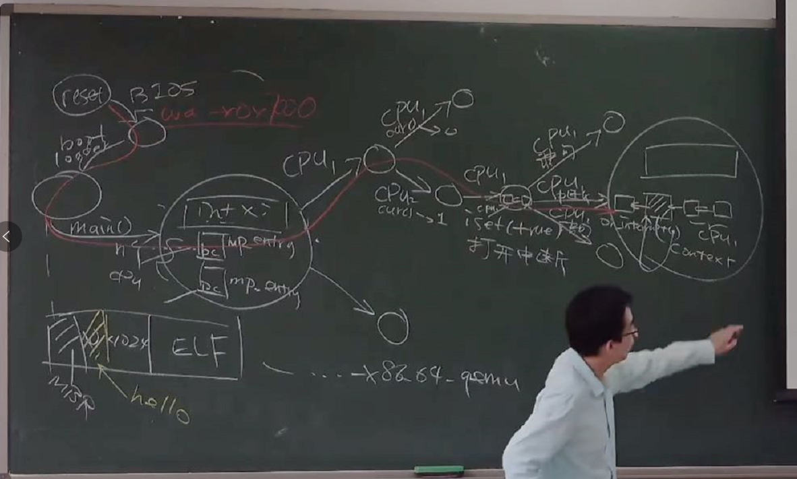

操作系统的状态机模型

# 操作系统的状态机模型

## Overview

复习

- 并发……就这么……讲完了……
	- 理解的方式：“玩一玩” 示例代码

---

本次课回答的问题

- **Q** : 听说操作系统也是程序。那到底是鸡生蛋还是蛋生鸡？

---

本次课主要内容

- 软件和硬件的桥梁
- 操作系统的加载和初始化
- AbstractMachine 代码导读

# 自己动手写操作系统

## 时事热评

[小学生写了三个月的操作系统是什么样的？](https://www.bilibili.com/video/BV14T4y1D7y8 "")

- 看到 i386 就知道了嘛


## 本学期的 OSLabs

热身实验

- Lab0 (amgame): 熟悉代码框架

---

正经实验

- Lab1 (pmm): Physical memory management
	- 多处理器 (bare-metal) 上的 kalloc/free 	

		
- Lab2 (kmt): Kernel multi-threading
	- 中断和异常驱动的上下文 (线程) 切换
- Lab3 (uproc): User processes
	- 虚拟地址空间、用户态进程和系统调用
- Lab4 (vfs): Virtual file system
	- devfs, procfs, 简单的文件系统；ELF 加载器

## 实现操作系统：到底有多难？

心路历程

- 曾经的我：哇！这也可以？
- 现在的我：哦。呵呵呵。

> 
>
> 韩寒：“被小学生支配的恐惧，而我也曾对那种力量，一无所知。”
>
>
> - 「护球像梅西，射门像贝利」的金山区齐达内，满怀期待地去和儿童预备队比赛，结果被灌了 20 多球。
>
>
> Bill Gates: 我选择退学。

## 大学的真正意义

> 将已有的知识和方法重新消化，为大家建立好 “台阶”，在有限的时间里迅速
> 赶上数十年来建立起的学科体系
> 。

今天的学术界可比 Bill Gates 的时代卷多了

- 学术界基本没啥是需要一个毛头小伙子来教的

---

例子：破除 “写操作系统很难”、“写操作系统很牛” 的错误认识

- 操作系统真的就是个 C 程序
- 你只是需要 “被正确告知” 一些额外的知识
	- 然后写代码、吃苦头
	- 从而建立正确的 “专业世界观”

## 例子

“专业世界观” 的例子 (这些都没啥，paper 都发不了)

- 写 x86 模拟器的时候，不知道哪条指令错了，怎么办？
- 做操作系统实验的时候，如果遇到神秘 CPU Reset，怎么办？
- 做实验做不下去的时候，该实现什么工具？

---

“专业世界观” 的学习方法

- 经典研究论文 (OSDI, SOSP, ATC, EuroSys, ...)
- 久经考验的经典教学材料 (xv6, OSTEP, CSAPP, ...)
- 海量的开源工具 (GNU 系列, qemu, gdb, ...)
- 第三方资料，慎用 (tutorials, osdev wiki, ...)

# 硬件和软件的桥梁

## C 程序

我们已经知道如何写一个 “最小” 的 C 程序了：

- [minimal.S](https://jyywiki.cn/pages/OS/2022/demos/minimal.S "")
- 不需要链接任何库，就能在操作系统上运行

---

“程序 = 状态机” 没问题

- 带来更多的疑问
	- 但谁创建的这个状态机？？？	
		- 当然是操作系统了……呃……
	- 这个程序可以在没有操作系统的硬件上运行吗？	
		- “启动” 状态机是由 “加载器” 完成的	
		- 加载器也是一段程序 (状态机)	
		- 这个程序由是由谁加载的？

## Bare-metal 与程序员的约定

为了让计算机能
运行任何我们的程序
，一定存在软件/硬件的约定

- CPU reset 后，处理器处于某个确定的状态
	- PC 指针一般指向一段 memory-mapped ROM	
	  - ROM 存储了厂商提供的 firmware (固件)
	- 处理器的大部分特性处于关闭状态	
	  - 缓存、虚拟存储、……
	- 硬件数字电路也是转态机，其必须有初始转态，在初始状态的基础上进行转变
- Firmware (固件，厂商提供的代码)
	- 将用户数据加载到内存	
	  - 例如存储介质上的第二级 loader (加载器)	
	  - 或者直接加载操作系统 (嵌入式系统)
	- 固件（firmware）一般存储于设备中的电可擦除只读存储器EEPROM(Electrically Erasable Programmable ROM)或[FLASH芯片](https://baike.baidu.com/item/FLASH芯片?fromModule=lemma_inlink)中，一般可由用户通过特定的刷新程序进行升级的程序。一般来说，担任着一个数码产品最基础、最底层工作的软件才可以称之为固件，比如[计算机主板](https://baike.baidu.com/item/计算机主板/8487636?fromModule=lemma_inlink)上的基本输入/输出系统[BIOS](https://baike.baidu.com/item/BIOS?fromModule=lemma_inlink)（Basic Input/output System），在以前其实更多的专业人士叫它固件。通常这些硬件内所保存的程序是无法被用户直接读出或修改的。在以前，一般情况下是没有必要对固件进行升级操作的，即使在固件内发现了严重的[Bug](https://baike.baidu.com/item/Bug?fromModule=lemma_inlink)也必须由专业人员带着写好程序的芯片把原来机器上的更换下来。早期固件芯片一般采用了[ROM](https://baike.baidu.com/item/ROM?fromModule=lemma_inlink)设计，它的Firmware代码是在生产过程中固化的，用任何手段都无法修改。随着技术的不断发展，修改固件以适应不断更新的硬件环境成了用户们的迫切要求，所以，可重复写入的可编程可擦除[只读存储器](https://baike.baidu.com/item/只读存储器?fromModule=lemma_inlink)EPROM（Erasable Programmable ROM），EEPROM和flash出现了。这些芯片是可以重复刷写的，让固件得以修改和升级。
	- 其具体工作步骤：
	  - 其先进行启动，扫描每个磁盘的前512字节，看其是否为BIOS代码（看其值是否为AA55，存储时低位在前，高位在后，即看上去是55AA（十六进制）若是则表明其为BIOS代码）将其从磁盘转移至内存区域的7c00的区域，7c00之上的数据为代码段，7c00之下的代码为栈段和中断以及gtb表。之后设置pc等寄存器的值，使其初始化，指向7c00处的第一条代码。之后该BIOS代码便再将之后的操作系统代码传入内存，进行启动操作系统

## x86 Family: CPU Reset 行为


CPU Reset ([Intel® 64 and IA-32 Architectures Software Developer’s Manual](https://software.intel.com/en-us/articles/intel-sdm ""), Volume 3A/3B)

- 寄存器会有初始状态
	- `EIP = 0x0000fff0`
	- `CR0 = 0x60000010` 	
		- 16-bit 模式
	- `EFLAGS = 0x00000002` 	
		- interrupt disabled
- TFM (5,000 页 by 2019)
	- 最需要的 Volume 3A 只有 468 页

## CPU Reset 之后：发生了什么？

《计算机系统基础》：
不仅是程序，整个计算机系统也是一个状态机

- 从 PC (`CS:IP` ) 指针处取指令、译码、执行……
- 从 firmware 开始执行
	- `ffff0`  通常是一条向 firmware 跳转的 jmp 指令

---


Firmware: [BIOS vs. UEFI](https://www.zhihu.com/question/21672895 "")

- 都是主板/主板上外插设备的软件抽象
	- 支持系统管理程序运行
- Legacy BIOS (Basic I/O System)
- UEFI (Unified Extensible Firmware Interface)

## Legacy BIOS: 约定

Firmware 必须提供机制，将用户数据载入内存

- Legacy BIOS 把第一个可引导设备的第一个扇区加载到物理内存的 `7c00`  位置
	- 此时处理器处于 16-bit 模式
	- 规定 `CS:IP = 0x7c00` , `(R[CS] << 4) | R[IP] == 0x7c00` 	
		- 可能性1：`CS = 0x07c0, IP = 0`	
		- 可能性2：`CS = 0, IP = 0x7c00`
	- 其他没有任何约束

## 能不能看一下代码？

> Talk is cheap. Show me the code. 
> ——Linus Torvalds

有没有可能我们真的去看从 CPU Reset 以后每一条指令的执行？

---

计算机系统公理：你想到的就一定有人做到。

- 模拟方案：QEMU
	- 传奇黑客、天才程序员 [Fabrice Bellard](https://www.zhihu.com/question/28388113 "") 的杰作	
		- [QEMU, A fast and portable dynamic translator](https://www.usenix.org/legacy/publications/library/proceedings/usenix05/tech/freenix/full_papers/bellard/bellard.pdf "") (USENIX ATC'05)	
		- Android Virtual Device, VirtualBox, ... 背后都是 QEMU
- 真机方案：JTAG (Joint Test Action Group) debugger
	- 一系列 (物理) 调试寄存器，可以实现 gdb 接口 (!!!)

## 调试 QEMU: 确认 Firmware 的行为

> 亲眼确认 Firmware 到底是不是会加载启动盘第一个扇区到 `0x7c00`  内存位置！

调试 QEMU 模拟器

- 查看 CPU Reset 后的寄存器
	- `info registers`
- 查看 `0x7c00`  内存的加载
	- `watch *0x7c00`  - 《计算机系统基础》的良苦用心
	- 查看当前指令 `x/i ($cs * 16 + $rip)`
	- 打印内存 `x/16xb 0x7c00`
- 进入 `0x7c00`  代码的执行
	- `b *0x7c00` , `c`  (撒花！我们一会再回来)

## 鸡和蛋的问题解决

有个原始的鸡：Firmware

- 代码直接存在于硬件里
- CPU Reset 后 Firmware 会执行
	- 加载 512 字节到内存 (Legacy Boot)
	- 然后功成身退

---

Firmware 的另一用处

- 放置一些 “绝对安全的代码”
	- [BIOS 中断](https://jyywiki.cn/pages/OS/manuals/BIOS-interrupts.pdf "") (Hello World 是如何被打印的)
	- ARM Trusted Firmware	
		- Boot-Level 1, 2, 3.1, 3.2, 3.3	
		- [U-Boot](https://www.denx.de/wiki/U-Boot ""): the universal boot loader

## 小插曲：Firmware 的病毒 (1998)

Firmware 通常是只读的 (当然……)

- Intel 430TX (Pentium) 芯片组允许
	写入 Flash ROM
	- 只要向 Flash BIOS 写入特定序列，Flash ROM 就变为可写	
		- 留给 firmware 更新的通道
	- 要得到这个序列其实并不困难	
		- 似乎文档里就有 🤔 Boom……

---

CIH 的作者陈盈豪被逮捕，但并未被定罪


## 今天的 Firmware: UEFI

IBM PC 所有设备/BIOS 中断是有 specification 的 (成就了 “兼容机”)

- 今天的 boot loader 面临麻烦得多的硬件：
	- 指纹锁、不知名厂商生产网卡上的网络启动、USB 上的蓝牙转接器连接的蓝牙键盘、……


## UEFI 上的操作系统加载

标准化的加载流程

- 盘必须按 GPT (GUID Partition Table) 方式格式化
- 预留一个 FAT32 分区 (lsblk/fdisk 可以看到)
- Firmware 加载任意大小的 PE 可执行文件 `.efi` 
	- 没有 legacy boot 512 字节限制
	- EFI 应用可以返回 firmware

---

更好的程序支持

- 设备驱动框架
- 更多的功能，例如 Secure Boot，只能启动 “信任” 的操作系统

# 操作系统的状态机模型

## “操作系统” 的状态机已经启动

Firmware 和 boot loader 共同完成 “操作系统的加载”

- 初始化全局变量和栈；分配堆区 (`heap` )
- 为 `main`  函数传递参数
	- 谁给操作系统传递了参数？
	- 如何实现参数传递？

---

进入 C 代码之后

- 完全遵循 C 语言的形式语义
- 但有一些行为 “补充” —— AbstractMachine API

## 操作系统：是个 C 程序

一个迷你 “操作系统” [thread-os.c](https://jyywiki.cn/pages/OS/2022/demos/thread-os.c "")

- make 会得到一个 “磁盘镜像”，好像魔法一样
	- 就跟你们第一次用 IDE 的时候按一个键就可以编译运行一样

---

```
int main() {
  cte_init(on_interrupt);

  for (int i = 0; i < LENGTH(tasks); i++) {
    Task *task    = &tasks[i];
    Area stack    = (Area) { &task->context + 1, task + 1 };
    task->context = kcontext(stack, task->entry, (void *)task->name);
    task->next    = &tasks[(i + 1) % LENGTH(tasks)];
  }
  mpe_init(mp_entry);
}
```


main函数中线程的执行



1. 首先会初始化公共内存区域，然后对于多线程且多个CPU，则有多个PC指针，分别指向不同的线程，每次可在不同的CPu上执行，当在一个CPU上执行时，若打开中断，则下一次可执行的有
   1. 该CPU继续执行
   2. 该CPU执行中断
   3. 其他CPU执行指令

## AbstractMachine 对 “C 程序语义” 做出的扩充

TRM + MPE

- 完全等同于多线程 (处理器相当于线程) - L1/native
- IOE API: 完全是普通的库函数
  - 同一设备的数据竞争 = undefined behavior

CTE

- 允许创建多个执行流 (类比协程) - M2
- yield 主动切换；会被中断被动打断
- `on_interrupt`  会拦截到中断事件

VME

- 允许创建一个 “经过地址翻译的执行模式”
- 通过 CTE API 管理

# RTFSC 时间

## (0) 生成镜像和启动虚拟机

> 如果使用 “土办法”，你很可能被淹没在 Makefile 中
>
>
> - 读懂 Makefile 需要 STFW, RTFM，大量的精力
> - 虽然花点时间读是值得的，但很可能读了很久都没读到重要的地方

---

花一点时间想 “应该怎么做”

- 花几分钟创建一个小工具：“AbstractMachine 构建理解工具”
	- UNIX Philosophy: keep it simple, stupid
	- everything is a file; write things to work together using text interface
- *Get out of your comfort zone*

## (0) 生成镜像和启动虚拟机 (cont'd)

观察 AbstractMachine 程序编译过程的正确方法：

```
make -nB \
  | grep -ve '^\(\#\|echo\|mkdir\|make\)' \
  | sed "s#$AM_HOME#\$AM_HOME#g" \
  | sed "s#$PWD#.#g" \
  | vim -
```

- Command line tricks
	- `make -nB`  (RTFM)
	- grep: 文本过滤，省略了一些干扰项	
		- echo (提示信息), mkdir (目录建立), make (sub-goals)
	- sed: 让输出更易读	
		- 将绝对路径替换成相对路径
	- vim: 更舒适的编辑/查看体验

## (0) 生成镜像和启动虚拟机 (cont'd)

想要看得更清楚一些？

- `:%s/ /\r  /g` 
	- 每一个命令就像 “一句话”
	- 使用正则表达式来进行对其替换，更加

---

编译

- `-std=gnu11` , `m64` , `-mno-sse` , `-I` , `-D` , ... (这对你配置 vscode 很重要)

链接

- `-melf_x86_64` , `-N` , `-Ttext-segment=0x00100000`
- 链接了需要的库 (`am-x86_64-qemu.a` , `klib-x86_64-qemu.a` )

彩蛋

- `make html`

## (1) 启动加载器 (Boot Loader)

512 字节中的代码，假设了镜像格式 (真正的的加载器有很多 stages)

- 16-bit → 32-bit
- ELF32/64 的加载器
	- 按照约定的磁盘镜像格式加载

---

代码讲解：

- `am/src/x86/qemu/boot/start.S`  和 `main.c` 
	- 它们都可以调试！

```
if (elf32->e_machine == EM_X86_64) {
  ((void(*)())(uint32_t)elf64->e_entry)();
} else {
  ((void(*)())(uint32_t)elf32->e_entry)();
}
```

# 总结

## 总结

本次课回答的问题

- **Q** : 操作系统也是程序，它如何用状态机如何定义？

---

Take-away message

- 一切皆可调试 (包括 firmware)
	- 理解操作系统是如何被启动的
	- 学会使用 gdb (必备生存技能)
- 操作系统也是程序
	- AbstractMachine 扩展了程序的语义，仅此而已

# End.