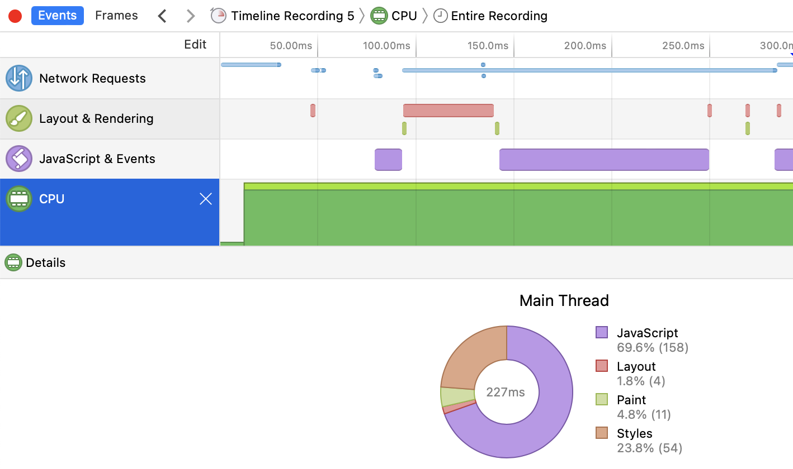

状态机模型的应用

# 状态机模型的应用

[蒋炎岩](http://ics.nju.edu.cn/~jyy "")

[](http://www.nju.edu.cn/ "")

[](http://cs.nju.edu.cn/ "")

[](https://cs.nju.edu.cn/ics/ "")

## Overview

复习

- 状态机：理论
	- 数字电路：[logisim.c](https://jyywiki.cn/pages/OS/2022/demos/logisim.c "") 和 [seven-seg.py](https://jyywiki.cn/pages/OS/2022/demos/seven-seg.py "")
	- Model checker: 理解并发程序执行的新方法
- 状态机：实践
	- [thread-os.c](https://jyywiki.cn/pages/OS/2022/demos/thread-os.c "")

---

本次课回答的问题

- **Q** : 状态机模型如此有用，还能更有用一点吗？

---

本次课主要内容

- 终于做完了铺垫，是时候让你感受到 “真正的力量” 了
	- 都是没用的内容，当我口胡就行了

# 状态机：理解我们的世界

## 哲 ♂ 学探讨

我们的物理世界是 “确定规则” 的状态机吗？

- 宏观物理世界近似于 deterministic 的状态机 (经典力学)
- 微观世界可能是 non-deterministic 的 (量子力学)

---

把物理世界建模成基本粒子的运动

- [Conway's game of life](https://playgameoflife.com/ "")

## 哲 ♂ 学探讨 (cont'd)

可以在这个模型上严肃地定义很多概念：预测未来、时间旅行……

- 成为你理解物理 (和计算机) 世界的参考

---

例子

- Cellular automata 不支持 “时间旅行”
	- 怎么添加一个公理使它可以支持？	
		- 平行宇宙	
		- 如果世界线需要合并？可以[收敛于某个分布](https://www.scientificamerican.com/article/time-travel-simulation-resolves-grandfather-paradox/ "")
- Cellular automata 不支持 “预测外来”
	- 能否添加一个 syscall 使它支持？	
		- [Why philosophers should care about computational complexity, Ch. 10](https://www.scottaaronson.com/papers/philos.pdf "")

## 状态机模型：理解编译器和现代 CPU

编译器：源代码 $S$ (状态机) → 二进制代码 $C$ (状态机)
$$C = \textrm{compile}(S)$$

编译 (优化) 的正确性 (Soundness):

- $S$ 与 $C$ 的可观测行为严格一致
	- system calls; volatile variable loads/stores; termination

---

超标量 (superscalar)/乱序执行处理器

- 允许在状态机上 “跳跃”
- [ilp-demo.c](https://jyywiki.cn/pages/OS/2022/demos/ilp-demo.c "")

# 查看状态机执行

## Trace 和调试器

程序执行 = 状态机执行

- 我们能不能 “hack” 进这个状态机
	- 观察状态机的执行	
		- strace/gdb
	- 甚至记录和	
		改变	
		状态机的执行

## 应用 (1): Time-Travel Debugging

程序执行是随时间 “前进” 的 $ s_0 \to s_1 \to s_2 \to \ldots $

- 能否在时间上 “后退”？ (time-travel)
	- 经常 gdb 不小心 step 过了，从头再来……
	- 记录所有的 $s_i$，就能实现任意的 time-traveling

---

记录所有 $s_i$ 的开销太大 ($s_i$ 由内存 + 寄存器组成)

- 但
	一条指令的 side-effect 通常有限
	- 只记录初始状态，和每条指令前后状态的 diff
	- $s_0, \Delta_0, \Delta_1, \ldots $
	- 正向执行：$s_{i+1} = s_i + \Delta_0$
	- 反向执行：$s_{i-1} = s_i e \Delta_0^{-1}$

## 应用 (1): Time-Travel Debugging (cont'd)

gdb 的隐藏功能 (大家读过 gdb 的手册了吗？)

- `record full`  - 开始记录
- `record stop`  - 结束记录
- `reverse-step` /`reverse-stepi`  - “时间旅行调试”

---

例子：调试 [rdrand.c](https://jyywiki.cn/pages/OS/2022/demos/rdrand.c "")

- Reverse execution 不是万能的
	- 有些复杂的指令 (syscall) 无法保证

## 应用 (2): Record &amp; Replay

在程序执行时记录信息，结束后重现程序的行为

- 确定的程序不需要任何记录
	- 假设 $s_0$ 执行 1,000,000 条确定的指令后得到 $s'$	
		- 那么只要记录 $s_0$ 和 1,000,000	
		- 就能通过 “再执行一次” 推导出 $s'$

## 应用 (2): Record &amp; Replay (cont'd)

Record &amp; Replay: 只需记录 non-deterministic 的指令的
效果

- (单线程) 应用程序
	- syscall, rdrand, rdtsc, ...
	- rr (Mozilla)	
		- (CACM'20)
- (单处理器) 操作系统
	- mmio, in, out, rdrand, rdtsc, 中断, ...
	- QEMU (`-icount shift=auto,rr=record,rrfile=replay.bin` )	
		- (OSDI'02, Best Paper 🏅)

# 采样状态机执行

## 关于性能优化

> Premature optimization is the root of all evil. (D. E. Knuth)

那到底怎么样才算 mature 呢？

- 状态机的执行需要时间；对象需要占用空间
- 需要理解好 “时间花在哪里”、“什么对象占用了空间”

---



我们需要真实执行的
性能摘要
！

- 本质的回答：“为了做某件事到底花去了多少资源”
- 简化的回答：“一段时间内资源的消耗情况”

## Profiler 和性能摘要

> 性能摘要需要对程序执行性能影响最小，往往不需要 full trace。

隔一段时间 “暂停” 程序、观察状态机的执行

- 中断就可以做到
- 将状态 $s \to s'$ “记账”
	- 执行的语句
	- 函数调用栈
	- 服务的请求
- 得到统计意义的性能摘要

---

例子：Linux Kernel perf (支持硬件 PMU) - [ilp-demo.c](https://jyywiki.cn/pages/OS/2022/demos/ilp-demo.c "")

- perf list, perf stat (-e), perf record, perf report

## 实际中的性能优化

你们遇到的大部分情况

- 二八定律：80% 的时间消耗在非常集中的几处代码
- L1 (pmm): 小内存分配时的 lock contention
	- profiler 直接帮你解决问题

---

工业界遇到的大部分情况

- 木桶效应：每个部分都已经 tune 到局部最优了
	- 剩下的部分要么 profiler 信息不完整，要么就不好解决
	- (工程师整天都对着 profiler 看得头都大了)
	- [The flame graph](https://cacm.acm.org/magazines/2016/6/202665-the-flame-graph/fulltext "") (CACM'16)

# Model Checker/Verifier

## Model Checker 的威力大家已经知道了

150 行代码的 [model-checker.py](https://jyywiki.cn/pages/OS/2022/demos/model-checker.py "")

- 证完所有《操作系统》课上涉及的并发程序
- 复现 OSTEP 教科书上的并发 bug (条件变量错误唤醒)

---

一些真正的 model checkers

- [TLA+](https://lamport.azurewebsites.net/tla/tla.html "") by Leslie Lamport;
- [Java PathFinder (JFP)](https://ti.arc.nasa.gov/tech/rse/vandv/jpf/ "") 和 [SPIN](http://spinroot.com/ "")
	- 它们都喜欢用 Peterson 算法做 tutorial 😁

## Model Checker: 不仅是并发

任何 “non-deterministic” 的状态机都可以检查

```
u32 x = rdrand();
u32 y = rdrand();
if (x > y)
  if (x * x + y * y == 65)
    bug();
...
assert(ptr); // 可能空指针吗？
```

---

更高效的 Model Checker: “将相似状态合并”

- [KLEE: Unassisted and automatic generation of high-coverage tests for complex systems programs](https://dl.acm.org/doi/10.5555/1855741.1855756 "") (OSDI'08, Best Paper 🏅)
- 基于 LLVM bitcode 解释器实现

# 总结

## 总结

本次课回答的问题

- **Q** : 状态机的视角给了我们什么？

---

Take-away messages

- 编程 (状态机) 就是全世界
- 状态机可以帮我们
	- 建立物理世界的公理体系
	- 理解调试器、Trace, profiler
	- 自动分析程序的执行 (model checker)

# End.