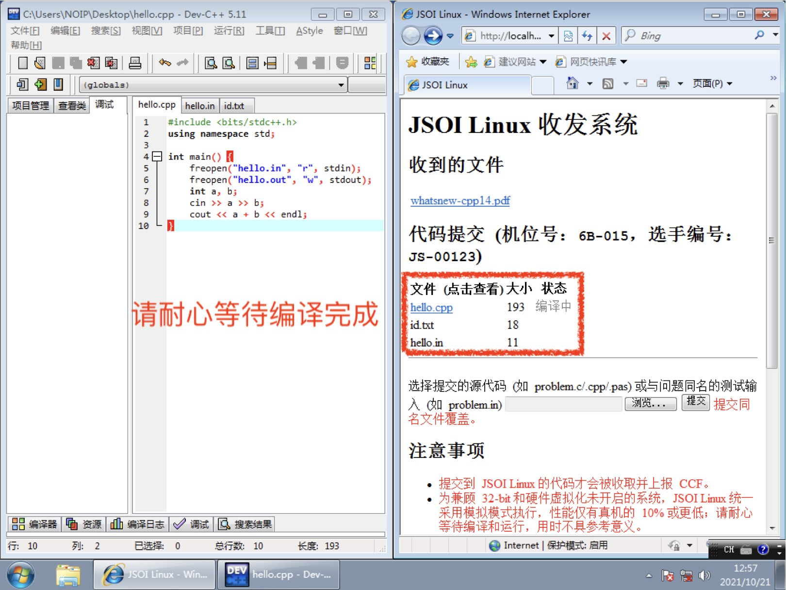
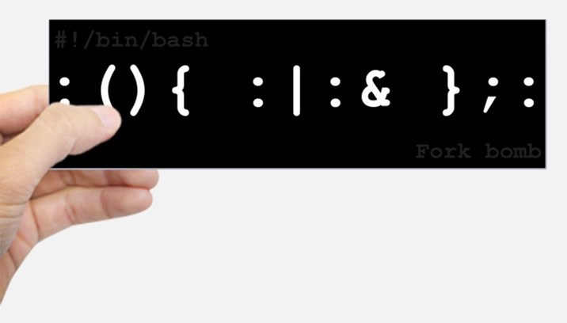

操作系统上的进程

# 操作系统上的进程

[蒋炎岩](http://ics.nju.edu.cn/~jyy "")

## Overview

复习

- 操作系统内核的启动：CPU Reset → Firmware → Boot loader → Kernel `_start()`  → ...

---

本次课回答的问题

- **Q1** : 操作系统启动后到底做了什么？
- **Q2** : 操作系统如何管理程序 (进程)？

---

本次课主要内容

- 虚拟化：操作系统上的进程
- 进程管理 API

# 操作系统启动后到底做了什么？

## 从系统启动到第一个进程

回顾 [thread-os.c](https://jyywiki.cn/pages/OS/2022/demos/thread-os.c "") 的加载过程

- CPU Reset → Firmware → Boot loader → Kernel `_start()`

---

操作系统会加载 “第一个程序”

- [RTFSC](https://elixir.bootlin.com/linux/latest/source/init/main.c#L1555 "") (latest Linux Kernel)
	- 如果没有指定启动选项 `init=` ，按照 “默认列表” 尝试一遍
	- 从此以后，Linux Kernel 就进入后台，成为 “中断/异常处理程序”

---

程序：状态机

- C 代码视角：语句
- 汇编/机器代码视角：指令
- 与操作系统交互的方式：syscall

## 定制最小的 Linux

没有存储设备，只有包含两个文件的 “initramfs”

- [linux-minimal.zip](https://box.nju.edu.cn/f/3f67e092e1ba441187d9/?dl=1 "")

```
$ tree .
.
├── bin
│   └── busybox (可以在我们的Linux里直接执行)
└── init
```

加上 vmlinuz (内核镜像) 就可以在 QEMU 里启动了

---

可以直接在文件系统中添加静态链接的二进制文件

- [minimal.S](https://jyywiki.cn/pages/OS/2022/demos/minimal.S "")
- [logisim.c](https://jyywiki.cn/pages/OS/2022/demos/logisim.c "")

## 变魔术时间到

BusyBox: The Swiss Army Knife of embedded Linux


```
c1="arch ash base64 cat chattr chgrp chmod chown conspy cp cpio cttyhack date dd df dmesg dnsdomainname dumpkmap echo ed egrep false fatattr fdflush fgrep fsync getopt grep gunzip gzip hostname hush ionice iostat ipcalc kbd_mode kill link linux32 linux64 ln login ls lsattr lzop makemime mkdir mknod mktemp more mount mountpoint mpstat mt mv netstat nice nuke pidof ping ping6 pipe_progress printenv ps pwd reformime resume rev rm rmdir rpm run-parts scriptreplay sed setarch setpriv setserial sh sleep stat stty su sync tar touch true umount uname usleep vi watch zcat"
c2="[ [[ awk basename bc beep blkdiscard bunzip2 bzcat bzip2 cal chpst chrt chvt cksum clear cmp comm crontab cryptpw cut dc deallocvt diff dirname dos2unix dpkg dpkg-deb du dumpleases eject env envdir envuidgid expand expr factor fallocate fgconsole find flock fold free ftpget ftpput fuser groups hd head hexdump hexedit hostid id install ipcrm ipcs killall last less logger logname lpq lpr lsof lspci lsscsi lsusb lzcat lzma man md5sum mesg microcom mkfifo mkpasswd nc nl nmeter nohup nproc nsenter nslookup od openvt passwd paste patch pgrep pkill pmap printf pscan"
c3="pstree pwdx readlink realpath renice reset resize rpm2cpio runsv runsvdir rx script seq setfattr setkeycodes setsid setuidgid sha1sum sha256sum sha3sum sha512sum showkey shred shuf smemcap softlimit sort split ssl_client strings sum sv svc svok tac tail taskset tcpsvd tee telnet test tftp time timeout top tr traceroute traceroute6 truncate ts tty ttysize udhcpc6 udpsvd unexpand uniq unix2dos unlink unlzma unshare unxz unzip uptime users uudecode uuencode vlock volname w wall wc wget which who whoami whois xargs xxd xz xzcat yes"
for cmd in $c1 $c2 $c3; do
  /bin/busybox ln -s /bin/busybox /bin/$cmd
done
mkdir -p /proc && mount -t proc  none /proc
mkdir -p /sys  && mount -t sysfs none /sys
export PS1='(linux) '
```

- 试试 adb shell ([toybox](https://landley.net/toybox/ ""))

## 例子：NOILinux-lite

2021 年，CCF 以迅雷不及掩耳盗铃之势发布了 NOILinux 2.0

- Ubuntu 20.04 Desktop (x86-64 only)
- 真就不管那些 32-bit 的老爷机和老爷系统的死活了？

---



 和刚才的 “最小” 系统但本质一样

- 有更多设备 (磁盘、网卡等)
- initramfs 里挂载了磁盘
- 磁盘里安装了最少的编译运行环境 (g++, ...) 和一个 Web 服务
- `switch_root`  (`pivot_root`  系统调用) 完成 “启动”

## 小结：应用程序视角的操作系统

Linux 操作系统启动流程

- CPU Reset → Firmware → Loader → Kernel `_start()`  → 第一个程序 `/bin/init`  → 程序 (状态机) 执行 + 系统调用

---

操作系统为 (所有) 程序提供 API

- 进程 (状态机) 管理
	- fork, execve, exit - 状态机的创建/改变/删除 ← 今天的主题
- 存储 (地址空间) 管理
	- mmap - 虚拟地址空间管理
- 文件 (数据对象) 管理
	- open, close, read, write - 文件访问管理
	- mkdir, link, unlink - 目录管理

# fork()

## 操作系统：状态机的管理者

C 程序 = 状态机

- 初始状态：`main(argc, argv)`
- 程序可以直接在处理器上执行

---

虚拟化：操作系统在物理内存中保存多个状态机

- 通过虚拟内存实现每次 “拿出来一个执行”
- 中断后进入操作系统代码，“换一个执行”

## 状态机管理：创建状态机

> 如果要创建状态机，我们应该提供什么样的 API？

UNIX 的答案: fork

- 做一份状态机完整的复制 (内存、寄存器现场)

---

  `int fork();`

- 立即复制状态机 (完整的内存)
- 新创建进程返回 0
- 执行 fork 的进程返回子进程的进程号

## Fork Bomb

模拟状态机需要资源

- 只要不停地创建进程，系统还是会挂掉的
- Don't try it (or try it in docker)
	- 你们交这个到 Online Judge 是不会挂的



## 代码解析: Fork Bomb

```
:(){:|:&};:   # 刚才的一行版本

:() {         # 格式化一下
  : | : &
}; :

fork() {      # bash: 允许冒号作为标识符……
  fork | fork &
}; fork
```


## 这次你们记住 Fork 了！

因为状态机是复制的，因此总能找到 “父子关系”

- 因此有了进程树 (pstree)

```
systemd-+-accounts-daemon---2*[{accounts-daemon}]
        |-agetty
        |-atd
        |-automount---2*[{automount}]
        |-avahi-daemon---avahi-daemon
        |-cron
        |-dbus-daemon
        |-irqbalance---{irqbalance}
        |-lxcfs---7*[{lxcfs}]
        ...
```

## 理解 fork: 习题 (1)

试着拿出一张纸，写出以下程序的输出结果

- [fork-demo.c](https://jyywiki.cn/pages/OS/2022/demos/fork-demo.c "")
	- 你心里可能立即想，运行一下不就完了吗？
	- 记得用 “状态机” 去理解它

```
pid_t pid1 = fork();
pid_t pid2 = fork();
pid_t pid3 = fork();
printf("Hello World from (%d, %d, %d)\n", pid1, pid2, pid3);
```

## 理解 fork: 习题 (2)

问以下程序的输出结果

- 一个更好的版本: [fork-printf.c](https://jyywiki.cn/pages/OS/2022/demos/fork-printf.c "")
	- 用状态机的视角再试一次
	- 试一试：`./a.out`  v.s. `./a.out | cat`

```
for (int i = 0; i < 2; i++) {
  fork();
  printf("Hello\n");
}
```

---

> 计算机系统里没有魔法。机器永远是对的。

## 理解 fork: 习题 (3)

多线程程序的某个线程执行 `fork()` ，应该发生什么？

- 这是个很有趣的问题：创造 fork 时创始人并没有考虑线程

---

我们可能作出以下设计：

- 仅有执行 fork 的线程被复制，其他线程 “卡死”
- 仅有执行 fork 的线程被复制，其他线程退出
- 所有的线程都被复制并继续执行
	- 这三种设计分别会带来什么问题？

# execve()

## 状态机管理：替换状态机

> 光有 fork 还不够，怎么 “执行别的程序”？

UNIX 的答案: execve

- 将当前运行的状态机重置成成另一个程序的初始状态

`int execve(const char *filename, char * const argv, char * const envp);`

- 执行名为 `filename`  的程序
- 允许对新状态机设置参数 `argv`  (v) 和环境变量 `envp`  (e)
	- 刚好对应了 `main()`  的参数！
	- [execve-demo.c](https://jyywiki.cn/pages/OS/2022/demos/execve-demo.c "")

## 环境变量

“应用程序执行的环境”

- 使用 `env`  命令查看
	- `PATH` : 可执行文件搜索路径
	- `PWD` : 当前路径
	- `HOME` : home 目录
	- `DISPLAY` : 图形输出
	- `PS1` : shell 的提示符
- `export` : 告诉 shell 在创建子进程时设置环境变量
	- 小技巧：`export ARCH=x86_64-qemu`  或 `export ARCH=native`
	- 上学期的 `AM_HOME`  终于破案了

## 环境变量：`PATH`

可执行文件搜索路径

- 还记得 gcc 的 strace 结果吗？

```
[pid 28369] execve("/usr/local/sbin/as", ["as", "--64", ...
[pid 28369] execve("/usr/local/bin/as", ["as", "--64", ...
[pid 28369] execve("/usr/sbin/as", ["as", "--64", ...
[pid 28369] execve("/usr/bin/as", ["as", "--64", ...
```

- 这个搜索顺序恰好是 `PATH`  里指定的顺序

```
$ PATH="" /usr/bin/gcc a.c
gcc: error trying to exec 'as': execvp: No such file or directory
$ PATH="/usr/bin/" gcc a.c
```

> 计算机系统里没有魔法。机器永远是对的。

# _exit()

## 状态机管理：终止状态机

> 有了 fork, execve 我们就能自由执行任何程序了，最后只缺一个销毁状态机的函数！

UNIX 的答案: `_exit`

- 立即摧毁状态机

`void _exit(int status)`

- 销毁当前状态机，并允许有一个返回值
- 子进程终止会通知父进程 (后续课程解释)

---

这个简单……

- 但问题来了：多线程程序怎么办？

## 结束程序执行的三种方法

exit 的几种写法 (它们是
不同
)

- `exit(0)`  - `stdlib.h`  中声明的 libc 函数
	- 会调用 `atexit`
- `_exit(0)`  - glibc 的 syscall wrapper
	- 执行 “`exit_group` ” 系统调用终止整个进程 (所有线程)	
		- 细心的同学已经在 strace 中发现了
	- 不会调用 `atexit`
- `syscall(SYS_exit, 0)` 
	- 执行 “`exit` ” 系统调用终止当前线程
	- 不会调用 `atexit`

## 不妨试一试

结束当前进程执行的四种方式

- `return` , `exit` , `_exit` , `syscall`
- [exit-demo.c](https://jyywiki.cn/pages/OS/2022/demos/exit-demo.c "")
	- 用 strace 观察程序的执行

# 总结

## 总结

本次课回答的问题

- **Q1** : 操作系统启动后到底做了什么？
- **Q2** : 操作系统如何管理程序 (进程)？

---

Take-away messages

- 对 “操作系统” 的完整理解
	- CPU Reset → Firmware → Loader → Kernel `_start()`  → 执行第一个程序 `/bin/init`  → 中断/异常处理程序
	- 一个最小的 Linux 系统的例子
- 进程管理 API
	- fork, execve, exit: 状态机的复制、重置、销毁
	- 理论上就可以实现 “各种功能” 了！

# End.