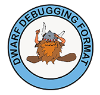

可执行文件

# 可执行文件

[蒋炎岩](http://ics.nju.edu.cn/~jyy "")

## Overview

复习

- A `fork()`  in the road: 创造平行宇宙

---

本次课回答的问题

- **Q** : 可执行文件到底是什么？

---

本次课主要内容

- 可执行文件
- 解析可执行文件
- 链接和加载
	- 今天假设只有静态链接

# 可执行文件

## RTFM

本次课涉及的手册

- System V ABI: [System V Application Binary Interface (AMD64 Architecture Processor Supplement)](https://jyywiki.cn/pages/OS/manuals/sysv-abi.pdf "") ([repo](https://gitlab.com/x86-psABIs/x86-64-ABI ""))
- [和更多 refspecs](https://refspecs.linuxbase.org/ "")

---

(不用听了，可以下课了)

- 课堂要回答的问题
	- 为什么 f**king manual 是 f**king 的?
	- 应该怎么读手册？

## 可执行文件：状态机的描述

操作系统 “为程序 (状态机) 提供执行环境”

- 可执行文件 (状态机的描述) 是最重要的操作系统对象！

---

一个描述了状态机的初始状态 + 迁移的
数据结构

- 寄存器
	- 大部分由 ABI 规定，操作系统负责设置
	- 例如初始的 PC
- 地址空间
	- 二进制文件 + ABI 共同决定
	- 例如 argv 和 envp (和其他信息) 的存储
- 其他有用的信息 (例如便于调试和 core dump 的信息)

## 例子：操作系统上的可执行文件

需要满足若干条件

- 具有执行 (x) 权限
- 加载器能识别的可执行文件

```
$ ./a.c
bash: ./a.c: Permission denied
```

```
$ chmod -x a.out && ./a.out
fish: The file “./a.out” is not executable by this user
```

```
$ chmod +x a.c && ./a.c
Failed to execute process './a.c'. Reason:
exec: Exec format error
The file './a.c' is marked as an executable but could not be run by the operating system.
```

## 是谁决定了一个文件能不能执行？

> 操作系统代码 (execve) 决定的。

动手试一试

- strace ./a.c
- 你可以看到失败的 execve!
	- 没有执行权限的 a.c: execve = -1, EACCESS
	- 有执行权限的 a.c: execve = -1, ENOEXEC
- 再读一遍 execve (2) 的手册
	- 读手册的方法：先理解主干行为、再查漏补缺
	- “ERRORS” 规定了什么时候不能执行

## 常见的可执行文件


就是操作系统里的一个普通对象

- 绿导师原谅你了.avi
- Windows 95/NT+, UEFI
	- PE (Portable Executable), since Windows 95/NT+
- UNIX/Linux
	- a.out (deprecated)
	- ELF (Executable Linkable Format)
	- She-bang	
		- 我们可以试着 She-bang 一个自己的可执行文件！	
		- She-bang 其实是一个 “偷换参数” 的 execve

# 解析可执行文件

## Binutils - Binary Utilities

[GNU binutils](https://www.gnu.org/software/binutils/ "")

- 生成可执行文件
	- ld (linker), as (assembler)
	- ar, ranlib
- 分析可执行文件
	- objcopy/objdump/readelf (计算机系统基础)
	- addr2line, size, nm

## 可执行文件的运行时状态

[segfault.c](https://jyywiki.cn/pages/OS/2022/demos/segfault.c "") - 为什么 gdb 知道出错的位置？

- gcc (-static -g)

```
$ ./a.out
Segmentation fault (core dumped)
```

```
(gdb) r
Starting program: /tmp/demo/a.out 

Program received signal SIGSEGV, Segmentation fault.
bar () at segfault.c:4
4         *(int *)NULL = 1;
(gdb) bt
#0  bar () at segfault.c:4
#1  0x0000000000401d0d in foo () at segfault.c:8
#2  0x0000000000401d22 in main () at segfault.c:12
```

## 调试信息



将一个 assembly (机器) 状态映射到 “C 世界” 状态的函数

- [The DWARF Debugging Standard](https://dwarfstd.org/ "")
	- 定义了一个 Turing Complete 的指令集 `DW_OP_XXX`
	- 可以执行 “任意计算” 将当前机器状态映射回 C
	- [RTFM](https://jyywiki.cn/pages/OS/manuals/DWARF5.pdf "")
- 但非常不完美
	- 对现代语言支持有限 (C++ templates)	
		- 还是因为编程语言太复杂了
	- 编译器也没法保证就做得对	
		- 各种令人生气的 `<optimized out>`	
		- 各种不正确的调试信息

## 例子：寄存器分配

[popcount.c](https://jyywiki.cn/pages/OS/2022/demos/popcount.c "")

- 优化的编译器 (-O2)
- 使用工具查看
	- -g -S 查看嵌入汇编的 debug info
	- readelf -w 查看调试信息
- gdb 调试
	- `s=<optimized out>`
	- 呃……

## 例子：Stack Unwinding

[unwind.c](https://jyywiki.cn/pages/OS/2022/demos/unwind.c "")

- 需要的编译选项
	- -g (生成调试信息)
	- -static (静态链接)
	- -fno-omit-frame-pointer (总是生成 frame pointer)
	- 可以尝试不同的 optimization level	
		- 再试试 gdb

---

没有 frame pointer 的时候呢？

- [Linus 锐评 Kernel backtrace unwind support](https://lkml.org/lkml/2012/2/10/356 "")
	- [Reliable and fast DWARF-based stack unwinding](https://dl.acm.org/doi/pdf/10.1145/3360572 "") (OOPSLA'19)
- 一般问题：Still open (有很多工作可以做)

## 逆向工程 (Reverse Engineering)

得到 “不希望” 你看到的商业软件代码 (然后就可以分析漏洞啥了)

- 调试信息 (代码) 是绝对不可能了
- 连符号表都没有 (stripped)
- 看起来就是一串指令序列 (可以执行)


# 编译和链接

## 从 C 代码到二进制文件

被《计算机系统基础》支配的恐惧？

```
// main.c
void hello();

int main() {
  hello();
}
```

```
// hello.c
#include <stdio.h>

void hello() {
  printf("Hello World\n");
}
```

## 其实不难

编译器生成文本汇编代码 → 汇编器生成二进制指令序列

```
0000000000000000 <main>:
   0:   f3 0f 1e fa         endbr64 
   4:   48 83 ec 08         sub    $0x8,%rsp
   8:   31 c0               xor    %eax,%eax
   a:   e8 00 00 00 00      callq  ????????
   f:   31 c0               xor    %eax,%eax
  11:   48 83 c4 08         add    $0x8,%rsp
  15:   c3                  retq
```

---

但有些地址编译的时候不知道啊 (比如 hello)

- 就先填个 0 吧

## 重定位 (Relocation)

但这 4-bytes 最终是需要被填上的，使得 assertion 被满足：

```
assert(
  (char *)hello ==
    (char *)main + 0xf + // call hello 的 next PC
    *(int32_t *)((uintptr_t)main + 0xb) // call 指令中的 offset
);
```

这个要求也要被写在文件里

- ELF 文件：部分状态机的 “容器”
	```
	Offset            Type      Sym. Name + Addend
	00000000000b  R_X86_64_PLT32  hello - 4
	```

	- 重填 32-bit value 为 “S + A - P” (P = main + 0xb)
	- 如何理解？考虑 call “S + A - P” 的行为

## 重新理解编译、链接流程

编译器 (gcc)

- High-level semantics (C 状态机) → low-level semantics (汇编)

汇编器 (as)

- Low-level semantics → Binary semantics (状态机容器)
	- “一一对应” 地翻译成二进制代码	
		- sections, symbols, debug info
	- 不能决定的要留下 “之后怎么办” 的信息	
		- relocations

链接器 (ld)

- 合并所有容器，得到 “一个完整的状态机”
	- ldscript (`-Wl,--verbose` ); 和 C Runtime Objects (CRT) 链接
	- missing/duplicate symbol 会出错

## 奇怪，我们完全没有讲 ELF 的细节？

ELF 就是一个 “容器数据结构”，包含了必要的信息

- 你完全可以试着自己定义二进制文件格式 (dump it to disk)！

```
struct executable {
  uint32_t entry;
  struct segment *segments;
  struct reloc *relocs;
  struct symbol *symbols;
};
struct segment { uint32_t flags, size; char data[0]; }
struct reloc   { uint32_t S, A, P; char name[32]; };
struct symbol  { uint32_t off; char name[32]; };
```

- 当然，这有很多缺陷
	- “名字” 其实应该集中存储 (`const char *`  而不是 `char[]` )
	- 慢慢理解了 ELF 里的各种设计 (例如 memsz 和 filesz 不一样大)

# 总结

## 总结

本次课回答的问题

- **Q** : 可执行文件到底是什么？

---

Take-away messages

- 可执行文件：
	一个描述了状态机的数据结构
	- 用好工具：binutils, gdb

# End.