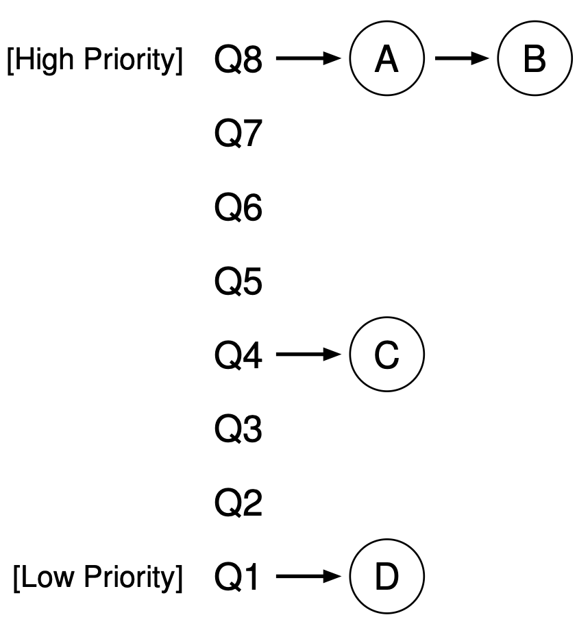
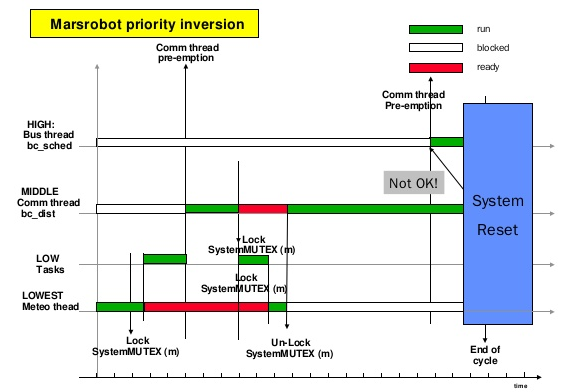
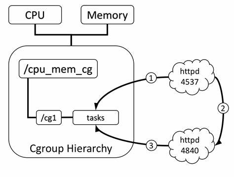
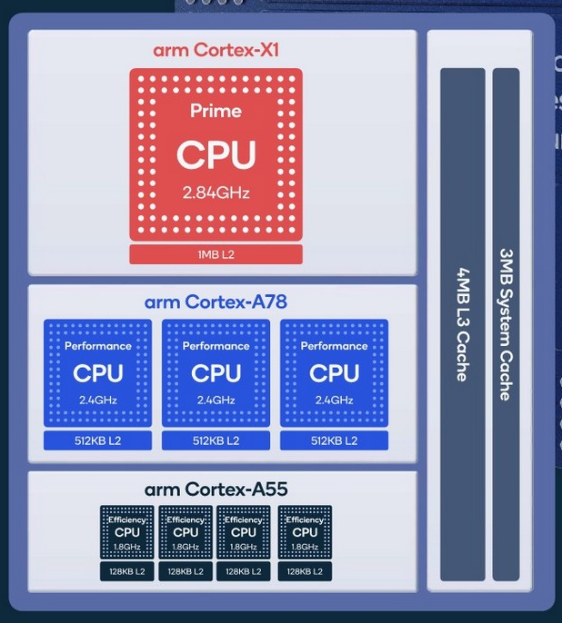
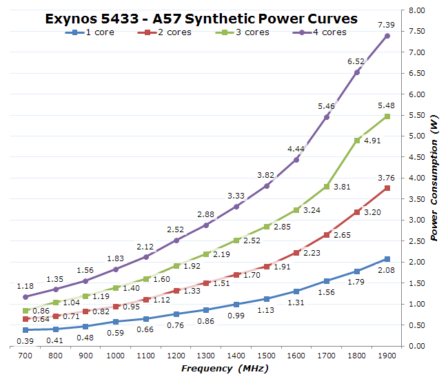
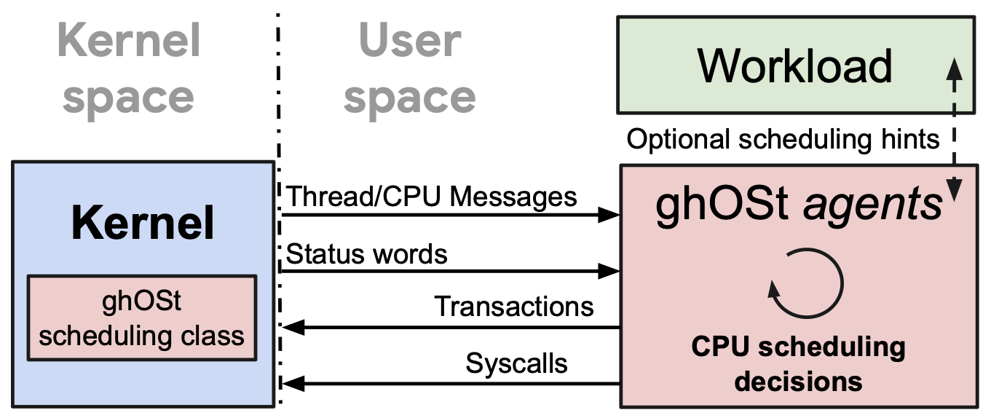

处理器调度

# 处理器调度

## Overview

复习

- 机制 (mechanism)：上下文切换
	- 在中断/系统调用时执行操作系统代码
	- 操作系统实现所有状态机 (进程) 一视同仁的 “封存”
	- 从而可以恢复任意一个状态机 (进程) 执行

---

本次课回答的问题

- **Q** : 策略 (policy)：那我们到底选哪个进程执行呢？

---

本次课主要内容

- 常见调度算法：Round-Robin, 优先级, MLFQ, CFS
- 告诉大家为什么我们这门课不讲 “调度算法”

# 处理器调度 (1)

## 简化的处理器调度问题

中断机制

- 处理器以固定的频率被中断
	- Linux Kernel 可以配置：100/250/300/1000Hz
- 中断/系统调用返回时可以自由选择进程/线程执行

---

处理器调度问题的简化假设

- 系统中有一个处理器 (1970s)
- 系统中有多个进程/线程共享 CPU
	- 包括系统调用 (进程/线程的一部分代码在 syscall 中执行)
	- 偶尔会等待 I/O 返回，不使用 CPU (通常时间较长)

## 策略: Round-Robin

假设当前 $T_i$ 运行

- 中断后试图切换到下一个线程 $T_{(i+1)\,\textrm{mod}\,n}$
- 如果下一个线程正在等待 I/O 返回，继续尝试下一个
	- 如果系统所有的线程都不需要 CPU，就调度 idle 线程执行

---

我们的 [thread-os.c](https://jyywiki.cn/pages/OS/2022/demos/thread-os.c "") 实际上实现了 Round-Robin 的调度器

- 中断之间的线程执行称为 “时间片” (time-slicing)


## 策略：引入优先级


UNIX niceness

- -20 .. 19 的整数，越 nice 越让别人得到 CPU
	- -20: 极坏; most favorable to the process
	- 19: 极好; least favorable to the process
- 基于优先级的调度策略
	- RTOS: 坏人躺下好人才能上	
		- ~~好人流下了悔恨的泪水~~
	- Linux: nice 相差 10, CPU 资源获得率相差 10 倍
- 不妨试一试: nice/renice

	```
	taskset -c 0 nice -n 19 yes > /dev/null &
	taskset -c 0 nice -n  9 yes > /dev/null &
	```

# 真实的处理器调度 (1)

## Round-Robin 的问题

系统里有两个进程

- 交互式的 Vim，单线程
- 纯粹计算的 [mandelbrot.c](https://jyywiki.cn/pages/OS/2022/demos/mandelbrot.c ""), 32 个线程

---

Round-Robin

- Vim 花 0.1ms 处理完输入就又等输入了
	- 主动让出 CPU
- Mandelbrot 使 Vim 在有输入可以处理的时候被延迟
	- 必须等当前的 Mandelbrot 转完一圈
	- 数百 ms 的延迟就会使人感到明显卡顿
- 你们会在 L2 里遇到这样的问题 
	- 表现形式：tty 卡顿

## 策略：动态优先级 (MLFQ)

不会设置优先级？让系统自动设定！



- 设置若干个 Round-Robin 队列
	- 每个队列对应一个优先级
- 动态优先级调整策略
	- 优先调度高优先级队列
	- 用完时间片 → 坏人	
		- Mandelbrot: 请你变得更好
	- 让出 CPU I/O → 好人	
		- Vim: 你可以变得更坏
- 阅读教科书

## 策略：Complete Fair Scheduling (CFS)

试图去模拟一个 “Ideal Multi-Tasking CPU”:

- “Ideal multi-tasking CPU” is a (non-existent :-)) CPU that has 100% physical power and which can run each task at precise equal speed, in parallel, each at 
	1/n
	. For example: if there are 2 tasks running, then it runs each at 50% physical power — i.e., actually in parallel.

---

“让系统里的所有进程尽可能公平地共享处理器”

- 为每个进程记录精确的运行时间
- 中断/异常发生后，切换到运行时间最少的进程执行
	- 下次中断/异常后，当前进程的可能就不是最小的了

## CFS: 实现优先级

操作系统具有对物理时钟的 “绝对控制”

- 每人执行 1ms，但好人的钟快一些，坏人的钟慢一些
	- vruntime (virtual runtime)
	- vrt[i] / vrt[j] 的增加比例 = wt[j] / wt[i]

```
const int sched_prio_to_weight[40] = {
  /* -20 */ 88761, 71755, 56483, 46273, 36291,
  /* -15 */ 29154, 23254, 18705, 14949, 11916,
  /* -10 */  9548,  7620,  6100,  4904,  3906,
  /*  -5 */  3121,  2501,  1991,  1586,  1277,
  /*   0 */  1024,   820,   655,   526,   423,
  /*   5 */   335,   272,   215,   172,   137,
  /*  10 */   110,    87,    70,    56,    45,
  /*  15 */    36,    29,    23,    18,    15,
};
```

## CFS 的复杂性 (1): 新进程/线程

子进程继承父进程的 vruntime

- 并且从 2.6.32 开始，[parent run first](https://lkml.org/lkml/2009/9/11/411 "")

```
static void task_fork_fair(struct task_struct *p) {
  struct sched_entity *se = &p->se, *curr;
  ...
  rq_lock(rq, &rf);
  update_rq_clock(rq);
  cfs_rq = task_cfs_rq(current);
  curr = cfs_rq->curr;
  if (curr) {
    update_curr(cfs_rq);
    se->vruntime = curr->vruntime; // 继承父进程的 vruntime
  }
  place_entity(cfs_rq, se, 1);
  ...
```

## CFS 的复杂性 (2): I/O

I/O (例如 1 分钟) 以后回来 vruntime 严重落后

- 为了赶上，CPU 会全部归它所有

---

Linux 的实现

- 被唤醒的进程获得 “最小” 的 vruntime (可以立即被执行)
	- 曾经会给唤醒的进程一些额外的 vruntime
	- 现在没有了

```
if (renorm && curr)
  se->vruntime += cfs_rq->min_vruntime;
```

## CFS 的复杂性 (3): 整数溢出

vruntime 有优先级的 “倍数”

- 如果溢出了 64-bit 整数怎么办……？
	- `a < b`  不再代表 “小于”！

---

假设：系统中最近、最远的时刻差不超过数轴的一半

- 我们可以比较它们的相对大小

```
bool less(u64 a, u64 b) {
  return (i64)(a - b) < 0;
}
```

## 实现 CFS 的数据结构

用什么数据结构维护所有进程的 vruntime?

- 任何有序集合 (例如 binary search tree) 维护线程 $t$ 的 $vrt(t)$
	- 更新 $vrt(t) \leftarrow vrt(t) + \Delta_t / w$
	- 取最小的 $vrt$
	- 进程创建/退出/睡眠/唤醒时插入/删除 $t$

---

道理还挺简单的

- 代码实现有困难
- 还不能有并发 bug……

## 小结：是否解决了问题？

考虑三种情况：Producer, Consumer, `while (1)`

- Round-Robin (L2)
	- Producer/Consumer 获得非常少比例的 CPU
- MLFQ
	- Producer/Consumer 获得最高优先级 Round-Robin
	- `while (1)`  完全饥饿 → 需要定期把所有人优先级 “拉平”
- CFS
	- 线程有精确的 accounting 信息
	- 这些信息可以指导 Round-Robin	
		- 适当使用 uptime (不必太精确) 可以大幅缓解 L2

# 真实的处理器调度 (2)

## 不要高兴得太早

```
void xiao_zhang() { // 高优先级
  sleep(1); // 休息一下先
  mutex_lock(&wc);
  ...
}

void xi_zhu_ren() { // 中优先级
  while (1) ;
}

void jyy() { // 最低优先级
  mutex_lock(&wc);
  ...
}
```

jyy 在持有互斥锁的时候被赶下了处理器……

## 这个故事在火星上发生过一次


Sojourner “探路者” (PathFinder)，1997 年 7 月 4 日登陆火星

## [The First Bug on Mars](https://news.ycombinator.com/item?id=13210478 "")


Sojourner “探路者” (PathFinder)

- Lander (登陆舱)
	- IBM Rad6000 SC (20 MIPS), 128 MiB RAM, 6 MiB EEPROM
	- VxWorks “实时” 任务操作系统	
		- ASI/MET task: 大气成分监测 (低)	
		- `bc_dist`  task: 分发任务 (中)	
		- `bc_sched`  task: 总线调度 (高)
- Rover (火星车)
	- Intel 80C85 (0.1 MIPS), 512K RAM, 176K Flash SSD
- 着陆后开始出现系统重启

## The First Bug on Mars (cont'd)



- (低优先级) `select -> pipeIoctl -> selNodeAdd -> mutex_lock`
- (高优先级) `pipeWrite -> mutex_lock`

## 解决优先级反转问题

Linux: CFS 凑合用吧

- 实时系统：火星车在 CPU Reset 啊喂？？
	- 优先级继承 (Priority Inheritance)/优先级提升 (Priority Ceiling)	
		- 持有 mutex 的线程/进程会继承 block 在该 mutex 上进程的最高优先级	
		- 但也不是万能的 (例如条件变量唤醒)
	- 在系统中动态维护资源依赖关系	
		- 优先级继承是它的特例	
		- 似乎更困难了……
	- 避免高/低优先级的任务争抢资源	
		- 对潜在的优先级反转进行预警 (lockdep)	
		- TX-based: 冲突的 TX 发生时，总是低优先级的 abort

# 真实的处理器调度 (3)

## 多处理器调度

还没完：我们的计算机系统可是多核心、多线程的！

- 我们的老服务器：2 Socket x 24 Cores x 2 Threads = 96T


## 多处理器调度：被低估的复杂性

> “And you have to realize that there are not very many things that have aged as well as the scheduler. Which is just another proof that scheduling is easy.”
> ——Linus Torvalds, 2001

---

Linus 以为调度是个挺简单的问题？

- As a central part of resource management, the OS thread scheduler must maintain the following, simple, invariant: *make sure that ready threads are scheduled on available cores* ... this invariant is often broken in Linux. Cores may stay idle for seconds while ready threads are waiting in runqueues.
	- [The Linux scheduler: A decade of wasted cores](https://dl.acm.org/doi/10.1145/2901318.2901326 ""). (EuroSys'16)	
		- 作者在狂黑 Linus 😂

## 多处理器调度的困难所在

既不能简单地 “分配线程到处理器”

- 线程退出，瞬间处理器开始围观

---

也不能简单地 “谁空丢给谁”

- 在处理器之间迁移会导致 cache/TLB 全都白给

---

多处理器调度的两难境地

- 迁移？可能过一会儿还得移回来
- 不迁移？造成处理器的浪费

## 实际情况 (1): 多用户、多任务

还是刚才服务器的例子

- 马上要到 paper deadline 了，A 和 B 要在服务器上跑实验
	- A 要跑一个任务，因为要调用一个库，只能单线程跑
	- B 跑并行的任务，创建 1000 个线程跑	
		- B 获得几乎 100% 的 CPU

---

更糟糕的是，优先级解决不了这个问题……

- B 不能随便提高自己进程的优先级
	- “An unprivileged user can only increase the nice value and such changes are irreversible...”

## Linux Namespaces Control Groups (cgroups)

namespaces (7), cgroups (7)

- 轻量级虚拟化，创造 “操作系统中的操作系统”
	- Mount, pid, network, IPC, user, cgroup namespace, time
	- cgroup 允许以进程组为单位管理资源	
		- Docker 就变得很容易实现了



## 实际情况 (2): Big.LITTLE/能效比



Snapdragon 888

- 1X Prime Cortex-X1 (2.84GHz)
- 3X Performance Cortex-A78 (2.4GHz)
- 4X Efficiency Cortex-A55 (1.8GHz)

---

“Dark silicon” 时代的困境

- 功率无法支撑所有电路同时工作
- 总得有一部分是停下的
- Linux Kernel [EAS](https://www.kernel.org/doc/html/latest/scheduler/sched-energy.html "") (Energy Aware Scheduler)

## 实际情况 (2): Big.LITTLE/能耗 (cont'd)

软件可以配置 CPU 的工作模式

- 开/关/工作频率 (频率越低，能效越好)
- 如何在给定功率下平衡延迟 v.s. 吞吐量？



## 实际情况 (3): Non-Uniform Memory Access

共享内存只是假象

- L1 Cache 花了巨大的代价才让你感到内存是共享的
- Producer/Consumer 位于同一个/不同 module 性能差距可能很大


## 程序执行比你想象得复杂

基本的假设可能不再成立

- 例子: more CPU time, more progress
	- 我们课堂上的例子就可以 challenge 这一点
	- [sum-atomic.c](https://jyywiki.cn/pages/OS/2022/demos/sum-atomic.c "")

```
$ time taskset -c 0   ./a.out
$ time taskset -c 0,1 ./a.out
```

---

分配了 1/2 的处理器资源，反而速度更快了

- 系统里进程的行为和交互是非常复杂的……
	- NUMA 里尤其重要 (当然上面的例子是个 performance bug)

## 实际情况 (4): CPU Hot-plug

😂😂😂 我讲不下去了

- 实在是太复杂了
- 我不是代码的维护者，并不清楚这些细节
	- 把上面都加起来	
		- 这得考虑多少情况，写多少代码……

---

复杂的系统无人可以掌控

- [The battle of the schedulers: FreeBSD ULE vs. Linux CFS](https://www.usenix.org/system/files/conference/atc18/atc18-bouron.pdf ""). (ATC'18)
	- 结论：在现实面前，没有绝对的赢家和输家
	- 如果你追求极致的性能，就不能全指望一个调度算法

## 回到处理器调度

调度是复杂、有着深远考虑的困难问题

- 下个时间片有 10,000,000 个时钟周期，分配给哪个线程？
- 学校预算 10,000,000 经费，怎么分给院系？
- 发改委下拨 1000,000,000,000 经费，怎么分给大家？

---

巨大的设计空间

- 建模 (理解和总结 “过去发生了什么”)
	- profiling 和 trace; PMU
- 预测 (试图预知未来可能发生什么)
- 决策 (应该如何调整系统行为)

## 谁来完成建模-预测-决策？

操作系统不 (完全) 背这个锅

- 让程序提供 scheduling hints
- [ghOSt: Fast &amp; flexible user-space delegation of Linux scheduling](https://dl.acm.org/doi/10.1145/3477132.3483542 "") (SOSP'21)



# 总结

## 总结

本次课回答的问题

- **Q** : 中断后到底应该把哪个进程/线程调度到处理器上？

---

Take-away messages

- 机制 (做出来) 和策略 (做得好)
	- 构建复杂系统的常用方法
- 真实世界的处理器调度
	- 异构处理器 + Non-Uniform Memory Access
	- 优先级翻转
	- 教科书上的内容随时可能会被改写

# End.