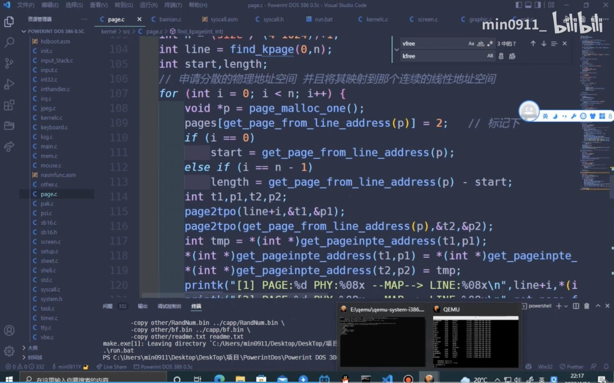
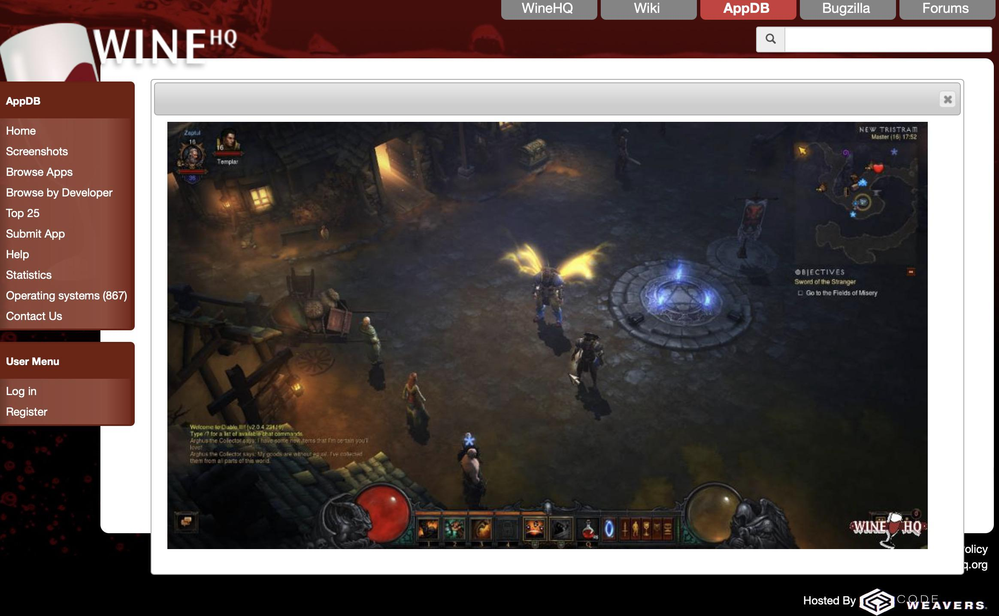
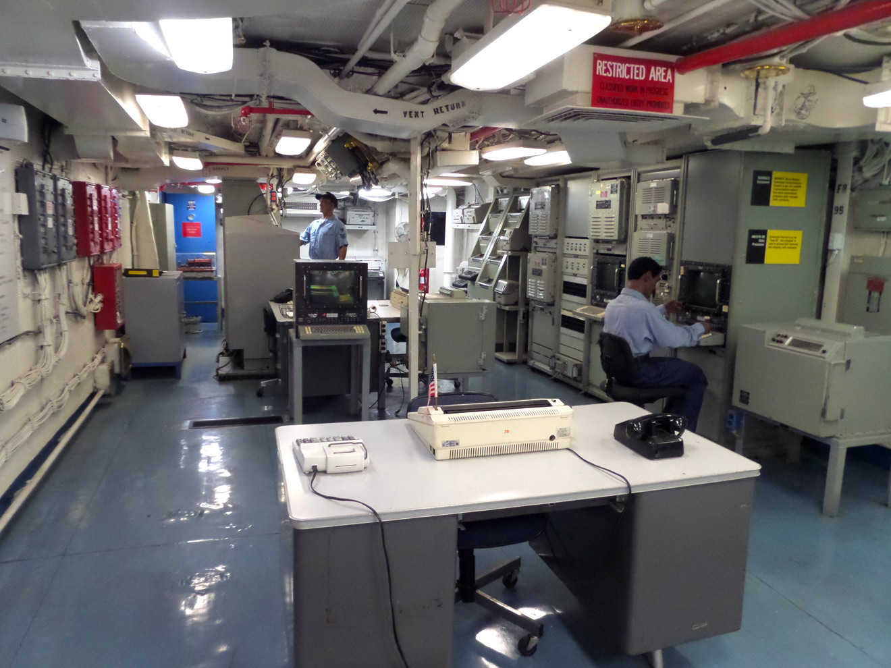
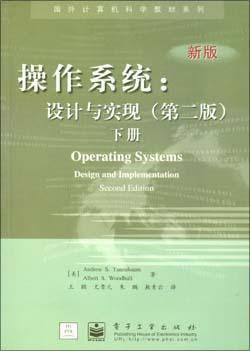
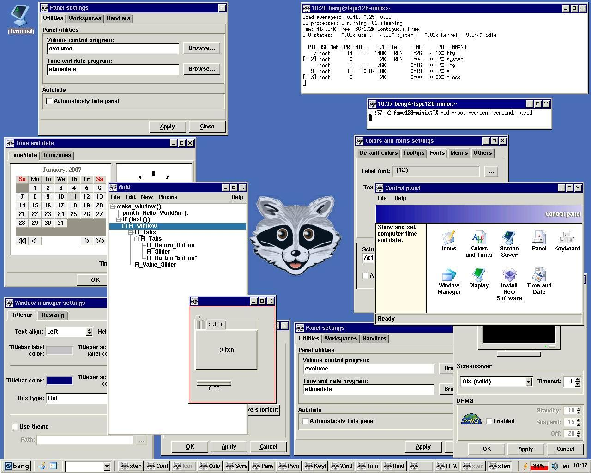
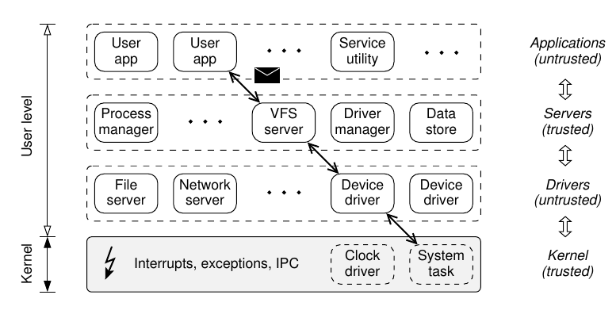
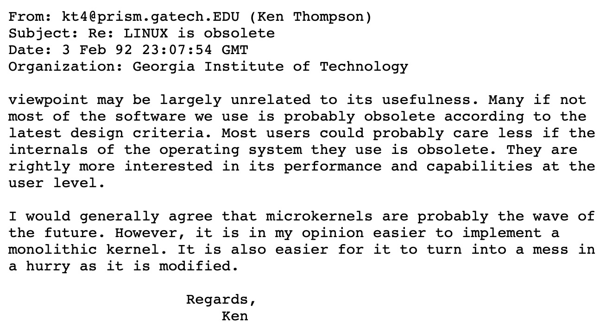

操作系统设计

# 操作系统设计

[蒋炎岩](http://ics.nju.edu.cn/~jyy "")

[](http://www.nju.edu.cn/ "")

[](http://cs.nju.edu.cn/ "")

[](https://cs.nju.edu.cn/ics/ "")

## Overview

复习

- 操作系统设计：一组对象 + 访问对象的 API
- 操作系统实现：一个 C 程序实现上面的设计

---

本次课回答的问题

- **Q** : 操作系统到底应该提供什么对象和 API？

---

本次课主要内容

- Micro/Exo/Unikernel

# 操作系统里到底该有什么？

## 2022.4.25 小学生又出新产品了

这次支持了分页和图形界面 (似乎是搬运了一些素材？)

- L2: tty 和 fb 驱动 (tty 是逐像素绘制的)
- L3: 9 个系统调用 (kputc, fork, wait, exit, kill, mmap, ...)



## 莫要慌：你们是大学生啊 😂


## 上课谈的不能称为真正的 “操作系统”

发扬大学生 RTFM &amp; RTFSC 的光荣传统

- 能够意识到这一点的中/小学生就能成为顶级的程序员

---

[The Open Group Base Specifications Issue 7 (2018 Ed.)](https://pubs.opengroup.org/onlinepubs/9699919799/mindex.html "")

- XBD: Base Definitions
- XSH: System Interfaces
- XCU: Shell &amp; Utilities
- XRAT: Rationale
	- 这是非常关键的：不仅告诉 “是什么”，还有 “为什么”

---

[Windows API Index](https://docs.microsoft.com/en-us/windows/win32/apiindex/windows-api-list "")

- 和 POSIX 相当不同的一组设计
- “工业” v.s. “黑客” (PowerShell v.s. bash)

## 冰山的一角

API 意味着可以互相模拟

- Windows Subsystem for Linux (WSL)，大家都在用
	- WSL1: 直接用 Windows 加载 ELF 文件
	- WSL2: 虚拟机
- Linux Subsystem for Windows (Wine)



## 冰山的一角 (cont'd)

操作系统默默帮你承载了更多

- [Operating system transactions](https://dl.acm.org/doi/abs/10.1145/1629575.1629591 "") (SOSP'09)
	- 在 Linux 2.6.22 上实现
	- 对 Kernel 破坏性太大，不太可能维护得下去
- [Windows KTM](https://docs.microsoft.com/en-us/windows-hardware/drivers/kernel/when-to-use-kernel-mode-ktm ""), since Windows Vista (2007)
	- 对，你没看错，是 Windows Vista
	- 世界最强、骂声最大，悄然落幕

## 小结：操作系统设计

操作系统 = 对象 + API

- 承载了软件的 “一切需要”
- [中国海军航母宣传片](https://www.bilibili.com/video/BV1aY411P7e1 "")

  

## 如何迈出走向操作系统的第一步？

理解老系统是如何实现、遇到怎样的问题

- xv6; 偶尔讲一些新特性
- 然后：RTFM, RTFSC

  

# Microkernel

## Less is More

> 公理：没有完美的程序员。
>
>
> 推论：
> 越小的系统，错误就越少。

C 作为一个有 Undefined Behavior 的语言，是复杂系统的灾难

- Signed integer overflow (Linux Kernel 使用了 -fwrapv)
- Data race
- Memory error
	- libpng 高危漏洞 (一张图偷走你的密码)	
		- 整数溢出后空格 keyword 读取进程数据

---

Microkernel (微内核) 应运而生

- 把尽可能多的功能都用普通进程实现
	 (失效隔离在 “进程” 级)

## 试着用普通进程做更多的事

[sh-xv6.c](https://jyywiki.cn/pages/OS/2022/demos/sh-xv6.c "") 到底执行了哪些 “就算丢给另一个进程，还得请求操作系统” 的操作？

- 进程 (状态机) 管理似乎绕不开
	- fork/spawn; exit
- 加载器 [loader-static.c](https://jyywiki.cn/pages/OS/2022/demos/loader-static.c "") (execve) 似乎不必要
	- mmap 似乎绕不开
- 终端 (tty) 可以放在进程里
	- 让 “驱动进程” 能访问 memory-mapped register 就行
	- 或者提供一个 mmio 系统调用
- 文件系统 (open, close, read, write, ...)
	- 进程只要有访问磁盘的权限，在磁盘上做个数据结构不成问题

## Microkernel (微内核)


---

微内核 (microkernel)

- 只把 “不能放在用户态” 的东西留在内核里
	- 状态机 (拥有寄存器和地址空间的执行流)
	- 状态机之间的协作机制 (进程间通信)
	- 权限管理 (例如设备访问)
- 赋予进程最少的权限，就能降低错误带来的影响

## Minix: 另一个改变世界的操作系统



Minix: 完全用于教学的真实操作系统

- by Andrew S. Tanenbaum

---

年轻人的第一个 “全功能” 操作系统

- Minix1 (1987): UNIXv7 兼容
	- Linus 实现 Linux 的起点
- [Minix2](http://download.minix3.org/previous-versions/Intel-2.0.4/ "") (1997): POSIX 兼容
	- 更加完备的系统，书后附全部内核代码



- [Minix3](http://minix3.org/ "") (2006): POSIX/NetBSD 兼容
	- 一度是世界上应用最广的操作系统	
		- Intel ME 人手一个

## Minix3 Architecture



- Minix2 更极端一些，只有 send 和 receive 两个系统调用
	- 主要用来实现 RPC (remote procedure call)
	- 操作系统还是操作系统，但跨模块调用会跨越进程边界

## 再向前走一小步

听说 “微内核” 有更好的可靠性？

- 那我们能不能证明它真的 “十分可靠”？
	- 对于任何输入、任何执行路径
	- 没有 memory error
	- 不会 crash……

---

seL4

- 世界上第一个 verified micorkernel
	- [Whitepaper](https://sel4.systems/About/seL4-whitepaper.pdf "") (初学者友好，十分推荐)
	- [Comprehensive formal verification of an OS microkernel](https://dl.acm.org/doi/10.1145/2560537 "") (TOCS'14)
- 有一个非常优雅的 capability 机制

## seL4 证明思路

首先，用适合描述行为的语言建一个模型 (seL4 有两层模型)

```
def rr_sched(cpu):
    cpu.threads = cpu.threads[1:] + cpu.threads[:1]
    assert anything_you_need
    return cpu.threads[0]
```

再写一份 C 代码

- [thread-os.c](https://jyywiki.cn/pages/OS/2022/demos/thread-os.c "")
	- 我们就有了两个状态机 (Python 和 C 代码的形式语义)

就可以去证明操作系统的 functional correctness 啦！

- 证明两个数学对象 (状态机) 可观测行为的等价性
- 剩下就是去解决遇到的各种技术问题 (更重要的是
	敢不敢去做
	)
	- Non-trivial; 但也不是 “神来之笔” (incremental work)

# 我们置身的时代

## Linus 和 Andy 的激烈论战 (1992)

“[Linux is obsolete](https://www.oreilly.com/openbook/opensources/book/appa.html "")”

- 主要批评内核架构设计不合理、移植性问题
- 30 年过去了，许多问题得到了解决；许多还没有



## Exokernel

> “The essential observation about abstractions in traditional operating systems is that they are overly general.”

操作系统就不应该有任何策略

- 只应该管硬件资源的最小虚拟化
- Expose allocation, expose names, expose revocation
	- 内核里甚至连 “进程” 的概念都没有，只有时间片	
		- 调度策略完全在 libOS 中实现
- [Exokernel: An operating system architecture for application-level resource management](https://dl.acm.org/doi/abs/10.1145/224057.224076 "") (SOSP'95)

## Unikernel: libOS 的复活

今天我们有虚拟机 (和硬件虚拟化) 了

- 为什么不直接让 Lab2 跑应用程序呢？
	- 应用代码直接和 klib, AbstractMachine, Lab 代码静态链接
	- 任何操作 (包括 I/O) 都可以直接做

---

Unikernel: 内核可以非常小 (应用不需要的特性都直接删除)

- [includeOS](https://www.includeos.org/ "") (C++); [runtime.js](http://runtimejs.org/ "") (JavaScript); [Mirage](https://mirage.io/ "") (OCaml)
- [Unikernels: The rise of the virtual library operating system](https://dl.acm.org/doi/10.1145/2541883.2541895 "") (CACM'14)
- [Unikraft: Fast, specialized unikernels the easy way](https://dl.acm.org/doi/10.1145/3447786.3456248 "") (EuroSys'21, Best Paper Award 🏅)

# 总结

## 总结

本次课回答的问题

- **Q** : 操作系统到底应该提供什么对象和 API？

---

Take-away messages

- “操作系统” 的含义随应用而变
	- 可以大而全 (Linux/Windows API)
	- 可以只有最少的硬件抽象 (Microkernel)
	- 可以没有用户态 (Unikernel)
- 互联网时代
	- 从井里走出去：RTFM, RTFSC
	- 然后去改变这个世界

# End.