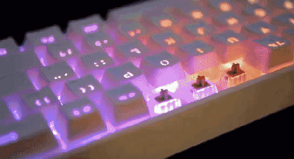
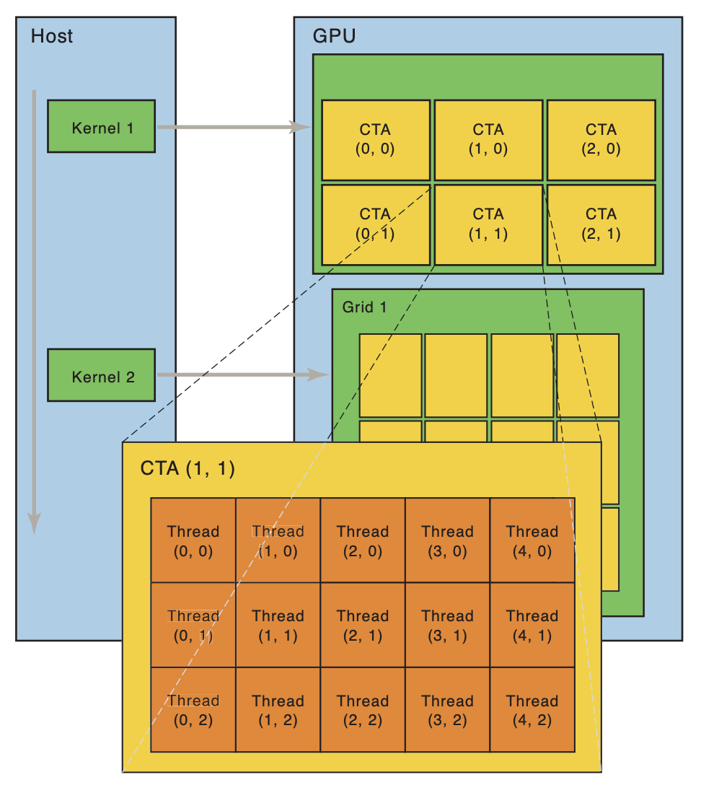

设备驱动程序

# 设备驱动程序

[蒋炎岩](http://ics.nju.edu.cn/~jyy "")

## Overview


复习

- I/O 设备：一组寄存器和协议
	- 串口/键盘/磁盘/打印机/总线/中断控制器/DMA/GPU

---

本次课回答的问题

- **Q** : 操作系统如何使应用程序能访问这些设备？

---

本次课主要内容

- 什么是设备驱动程序
- Linux 设备抽象

# 设备驱动程序原理

## I/O 设备的抽象

I/O 设备的主要功能：
输入和输出

- “能够读 (read) 写 (write) 的
	字节序列 (流或数组)
	”
- 常见的设备都满足这个模型
	- 终端/串口 - 字节流
	- 打印机 - 字节流 (例如 [PostScript 文件](https://jyywiki.cn/pages/OS/2022/demos/page.ps ""))
	- 硬盘 - 字节数组 (按块访问)
	- GPU - 字节流 (控制) + 字节数组 (显存)

---

操作系统：设备 = 支持各类操作的对象 (文件)

- read - 从设备某个指定的位置读出数据
- write - 向设备某个指定位置写入数据
- ioctl - 读取/设置设备的状态

## 设备驱动程序

把系统调用 (read/write/ioctl/...) “翻译” 成与设备寄存器的交互

- 就是一段普通的内核代码
- 但可能会睡眠 (例如 P 信号量，等待中断中的 V 操作唤醒)
- 大多数电脑上的设备都仅有设备驱动程序无具体物理设备，比如随机数生成器

---

例子：`/dev/`  中的对象

- `/dev/pts/[x]`  - pseudo terminal
- `/dev/zero`  - “零” 设备
- `/dev/null`  - “null” 设备 将传入的数据消失
- `/dev/random` , `/dev/urandom`  - 随机数生成器
	- 试一试：`head -c 512 [device] | xxd`
	- 以及观察它们的 strace	
		- 能看到访问设备的系统调用

## 例子: Lab 2 设备驱动

设备模型

- 简化的假设
	- 设备从系统启动时就存在且不会消失
- 支持读/写两种操作 
	- 在无数据或数据未就绪时会等待 (P 操作)

```
typedef struct devops {
  int (*init)(device_t *dev);
  int (*read) (device_t *dev, int offset, void *buf, int count);
  int (*write)(device_t *dev, int offset, void *buf, int count);
} devops_t;
```

I/O 设备看起来是个 “黑盒子”

- 写错任何代码就 simply “not work”
- 设备驱动：Linux 内核中最多也是质量最低的代码

## 字节流/字节序列抽象的缺点



设备不仅仅是数据，还有
控制

- 尤其是设备的附加功能和配置
- 所有额外功能全部依赖 ioctl
	- “Arguments, returns, and semantics of ioctl() vary according to the device driver in question”
	- 无比复杂的 “hidden specifications”

---

例子

- 打印机的打印质量/进纸/双面控制、卡纸、清洁、自动装订……
	- 一台几十万的打印机可不是那么简单 😂
- 键盘的跑马灯、重复速度、宏编程……
- 磁盘的健康状况、缓存控制……

## 例子：终端

“字节流” 以内的功能

- ANSI Escape Code
- [logisim.c](https://jyywiki.cn/pages/OS/2022/demos/logisim.c "") 和 [seven-seg.py](https://jyywiki.cn/pages/OS/2022/demos/seven-seg.py "")

---

“字节流” 以外的功能

- stty -a
	- 终端大小怎么知道？
	- 终端大小变化又怎么知道？
- isatty (3), termios (3)
	- 大部分都是 ioctl 实现的
	- 这才是水面下的冰山的一角

# Linux 设备驱动

## Nuclear Launcher

我们希望实现一个最简单的 “软件定义核弹”

```
#include <fcntl.h>

#define SECRET "\x01\x14\x05\x14"

int main() {
  int fd = open("/dev/nuke", O_WRONLY);
  if (fd > 0) {
    write(fd, SECRET, sizeof(SECRET) - 1);
    close(fd);
  } else {
    perror("launcher");
  }
}
```

## 实现 Nuclear Launcher

内核模块：一段可以被内核动态加载执行的代码

- [M4 - crepl](https://jyywiki.cn/OS/2022/labs/M4 "")
	- 也就是把文件内容搬运到内存
	- 然后 export 一些符号 (地址)

---

[launcher.c](https://jyywiki.cn/pages/OS/2022/demos/launcher.c ""): 驱动程序模块

- Everything is a file
	- 设备驱动就是实现了 `struct file_operations`  的对象	
		- 把文件操作翻译成设备控制协议
- 在内核中初始化、注册设备
	- 系统调用直接以函数调用的方式执行驱动代码

## 更多的 File Operations

```
struct file_operations {
  struct module *owner;
  loff_t (*llseek) (struct file *, loff_t, int);
  ssize_t (*read) (struct file *, char __user *, size_t, loff_t *);
  ssize_t (*write) (struct file *, const char __user *, size_t, loff_t *);
  int (*mmap) (struct file *, struct vm_area_struct *);
  unsigned long mmap_supported_flags;
  int (*open) (struct inode *, struct file *);
  int (*release) (struct inode *, struct file *);
  int (*flush) (struct file *, fl_owner_t id);
  int (*fsync) (struct file *, loff_t, loff_t, int datasync);
  int (*lock) (struct file *, int, struct file_lock *);
  ssize_t (*sendpage) (struct file *, struct page *, int, size_t, loff_t *, int);
  long (*unlocked_ioctl) (struct file *, unsigned int, unsigned long);
  long (*compat_ioctl) (struct file *, unsigned int, unsigned long);
  int (*flock) (struct file *, int, struct file_lock *);
  ...
```

## 为什么有两个 ioctl?

```
long (*unlocked_ioctl) (struct file *, unsigned int, unsigned long);
long (*compat_ioctl) (struct file *, unsigned int, unsigned long);
```

- `unlocked_ioctl` : BKL (Big Kernel Lock) 时代的遗产
	- 单处理器时代只有 `ioctl`
	- 之后引入了 BKL, `ioctl`  执行时默认持有 BKL
	- (2.6.11) 高性能的驱动可以通过 `unlocked_ioctl`  避免锁
	- (2.6.36) `ioctl`  从 `struct file_operations`  中移除
- `compact_ioctl` : 机器字长的兼容性
	- 32-bit 程序在 64-bit 系统上可以 ioctl
	- 此时应用程序和操作系统对 ioctl 数据结构的解读可能不同 (tty)
	- (调用此兼容模式)

# 为 GPU 编程

## 为 GPU 编程



Single Instruction, Multiple Thread

- 许多线程都执行相同指令
- 但每一个线程又有一些 thread-local data (例如编号)
	- 非常精巧的设计	
		- 一个 PC，一堆数据	
		- VLIW 和 SIMD 的继任者
	- 按照 “Warp, 线程束” 执行	
		- 分支怎么办？

## Mandelbrot, Again

[mandelbrot.cu](https://jyywiki.cn/pages/OS/2022/demos/mandelbrot.cu "") 和 GPU 惊人的计算力

- 16 亿像素、每像素迭代 100 次
	- 分到 512x512 = 262,144 线程计算
- 每个线程计算 mandelbrot 的一小部分
	- [mandelbrot-12800.webp](https://jyywiki.cn/pages/OS/img/mandelbrot-12800.webp "")
	- (感谢 doowzs 借用的机器)

---

nvprof 结果

```
==2994086== Profiling result:
Time(%)      Time   Name
 95.75%  1.76911s   mandelbrot_kernel
  4.25%  78.506ms   [CUDA memcpy DtoH] (12800 x 12800 data)
  0.00%  1.5360us   [CUDA memcpy HtoD]
```

## Mandelbrot, Again (cont'd)

RTFM: [Parallel Thread Execution ISA Application Guide](https://jyywiki.cn/pages/OS/manuals/ptx-isa-7.7.pdf "")

- 就是个指令集
- 再编译成 SASS (机器码)
	- cuobjdump --dump-ptx / --dump-sass

---

该有的工具都有

- gcc → nvcc
- binutils → cuobjdump
- gdb → cuda-gdb
	- 可以直接调试 GPU 上的代码！
- perf → nvprof
- ...

## GPU 驱动程序

GPU 驱动非常复杂

- 全套的工具链
	- Just-in-time 程序编译
	- Profiler
	- ...
- API 的实现
	- cudaMemcpy, cudaMalloc, ...
	- Kernel 的执行
	- 大部分通过 ioctl 实现
- 设备的适配

---

NVIDIA 在 2022 年开源了驱动！([名场面](https://www.bilibili.com/video/BV1YF41177V6 ""))

# 存储设备的抽象

## 存储设备的抽象

磁盘 (存储设备) 的访问特性

1. 以数据块 (block) 为单位访问
	- 传输有 “最小单元”，不支持任意随机访问
	- 最佳的传输模式与设备相关 (HDD v.s. SSD)
2. 大吞吐量
	- 使用 DMA 传送数据
3. 应用程序不直接访问
	- 访问者通常是文件系统 (维护磁盘上的数据结构)
	- 大量并发的访问 (操作系统中的进程都要访问文件系统)

---

对比一下终端和 GPU，的确是很不一样的设备

- 终端：小数据量、直接流式传输
- GPU：大数据量、DMA 传输

## Linux Block I/O Layer

文件系统和磁盘设备之间的接口

- 包含 “I/O 调度器”
	- 曾经的 “电梯” 调度器


## 块设备：持久数据的可靠性

Many storage devices, ... come with *volatile write back caches*

- the devices signal I/O completion to the operating system before data actually has hit the non-volatile storage
- this behavior obviously *speeds up*  various workloads, but ... *data integrity* ...

---

我们当然可以提供一个 ioctl

- 但 block layer 提供了更方便的机制
	- 在 block I/O 提交时	
		- `| REQ_PREFLUSH`  之前的数据落盘后才开始	
		- `| REQ_FUA`  (force unit access)，数据落盘后才返回
	- 设备驱动程序会把这些 flags 翻译成磁盘 (SSD) 的控制指令

## Block I/O: 持久化的起点

文件系统

- 在 Block I/O API 上构建的持久数据结构

---

实现文件系统

- bread
- bwrite
- bflush
- 支持文件/目录操作
	- 你可能已经想到应该怎么做了！

# 总结

## 总结

本次课回答的问题

- **Q** : 操作系统如何使应用程序能访问 I/O 设备？

---

Takeaway messages

- 设备驱动
	- 把 read/write/ioctl 翻译成设备听得懂的协议
	- 字符设备 (串口、GPU) + DMA
	- 块设备 (磁盘)