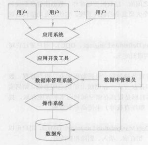
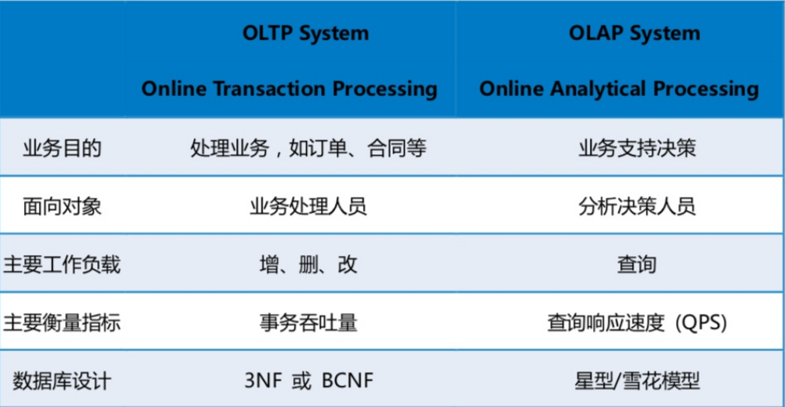
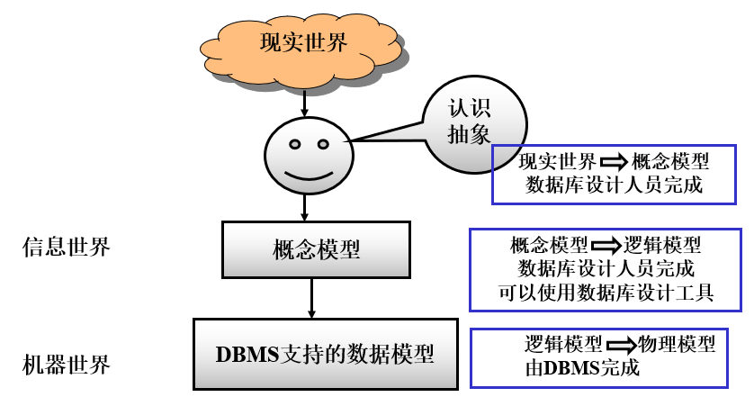
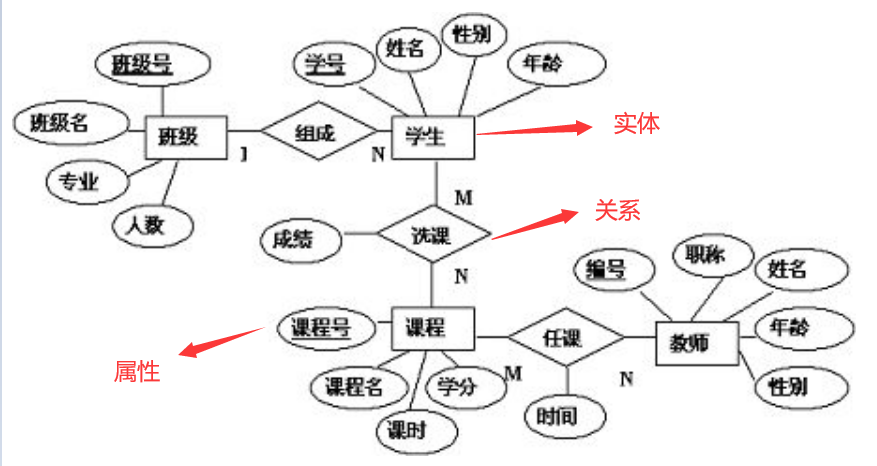
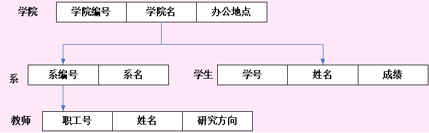
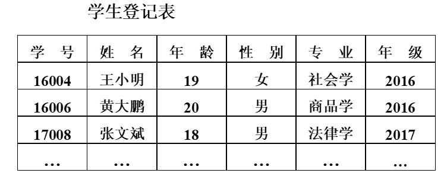

# 1.1 数据库系统概述

## 1.1.1 7个基本概念

### 1.数据（data）

- 数据：描述事物的**符号记录**。
- 语义：数据的含义称为数据的语义（如学生的姓名、性别、出生年月等用于描述数据是什么的词语），两者不可分割。
- 记录：计算机中表示和储存数据的一种格式或者一种方法。

### 2.信息（Information）

由原始数据经加工提炼而成的，用于决定行为、计划或具有一定语义的数据称为信息，具有相对性。

### 3.数据库（Data Base,DB）

数据库是**长期储存**在计算机内、**有组织的**、**可共享的**大量数据的集合。数据库中的数据按照一定的数据模型组织、描述和储存，具有较小的冗余度(重复数据少）、较高的数据独立性（程序和数据相对独立，不受平台限制）和易拓展性，并可为各种用户（批处理用户和联机用户，即应用程序和终端）共享。数据库中不仅存放了数据，还存放了数据和数据之间的关系。

### 4.数据库管理系统（DBMS）

定义：数据库管理系统（Database Management System）是位于用户与操作系统之间的一层数据管理软件。

主要功能（科学地**组织和存储数据**、高效地**获取和维护数据**）：

1. 数据定义功能：提供数据定义语言，定义数据对象的组成与结构。
  
2. 数据组织、存储和管理：分类组织、存储和管理各种数据（数据字典、用户数据、数据存储路径），确定文件结构和存储方式在存储级上组织这些数据，实现数据之间的联系，**基本目标：** 提高存储空间利用率和方便存取，提供多种存储方法，提高存取效率。
  
3. 数据操纵功能：提高数据操纵语言（DML），实现增删改查。
  
4. 数据库的事务管理和运行管理：统一管理和控制数据库，保证数据的安全性、完整性、多用户对数据的并发使用及发生故障后的系统恢复。
  
5. 数据库的建立和维护功能：初始数据的输入、转换功能，数据库的转储、恢复功能，数据库的重组织功能和性能监视、分析功能等。
  
6. 其他功能：通信功能，数据转换功能。
  

### 5.数据库系统（DBS）

嗯，DBS，又称大鼻屎，两枪贴脸喷子，近战无敌（狗头  
数据库操作系统是由数据库、数据库管理系统、应用程序和数据库管理员（DBA）组成的储存、管理、处理和维护数据的系统。（存储实体，存储管理，用户软件，管理人员）

### 6\. 数据库应用程序接口（API）

定义：DBMS为开发应用程序提供的操纵和访问数据库中数据的接口函数、过程或语言。

### 7.数据库应用程序（AP）

定义：满足某类用户要求的操纵和访问数据库的程序（人事管理系统、图书管理系统）。  
分类：

- 联机事务处理（OLTP）：对用户的操作命令响应快、每次操作涉及的数据量少 。理解：就是简单的增删改，操作无脑，快就完事了。
- 联机分析处理（OLAP）：支持决策支持系统，需要在数据仓库的基础上，进行联机分析处理，每次处理的数据量大，响应时间长，它需要由历史数据、由多个数据来源的数据得到有指导意义的信息。理解：分析大量数据，进行统计，实现“数据杀熟”。

## 1.1.2 数据库系统的特点

- 数据的管理者：DBMS
- 数据面向的对象：现实世界
- 数据的结构化：整体结构化  
    数据的结构用数据模型描述，无需程序定义和解释，数据可以变长，数据的最小存取单位是**数据项**，描述数据时不仅要描述数据本身，还要描述数据之间的联系
    
- 数据的共享程度：共享性高  
    降低数据的冗余度，节省存储空间，避免数据间的不一致性，使系统易于扩充
    
- 数据的独立性：高度的物理独立性和一定的逻辑独立性
  
- 数据控制：由DBMS统一管理和控制（数据的安全性保护，数据的完整性检查，并发控制，数据库恢复）

# 1.2 数据模型

数据模型是现实世界数据特征的抽象，是用来描述数据、组织数据和对数据进行操作的。现有的数据库均是基于某种数据模型的。数据模型是数据库系统的核心和基础。

## 1.2.1 两类数据模型

1. 概念模型  
    从普通用户的视角来描述数据的，使用简单的符号来描述信息，没有严格的规定，只要能清晰反映现实世界的信息就行，主要用于数据库设计。常用的就是E-R图。
    
2. 逻辑模型和物理模型  
    （1）逻辑模型主要包括网状模型、层次模型、关系模型、面向对象模型、对象关系模型、半结构化数据模型等，它是按计算机系统的观点对数据建模。主要用于DBMS的实现。  
    （2）物理模型是对数据最低层的抽象，是面向计算机系统的，其具体实现是DBMS的任务。
    

## 1.2.2 概念模型

### 1\. 信息世界中的基本概念

- 实体（Entity）  
    客观存在并可相互区别的事物称为实体。可以是具体的人、事、物或抽象的概念。
- 属性（Attribute）  
    实体所具有的某一特性称为属性。一个实体可以由若干个属性来刻画。
- 码（Key）  
    唯一标识实体的属性集称为码。
- 实体型（Entity Type）  
    用实体名及其属性名集合来抽象和刻画同类实体，称为实体型。  
    学生（学号，姓名，性别，出生年月，所在院系，入学时间）
- 实体集（Entity Set）  
    同型实体的集合称为实体集，如：2014级计算机学院的全体学生。
- 联系（Relationship）  
    现实世界中事物内部以及事物之间的联系在信息世界中反映为实体（型）内部的联系和实体（型）之间的联系。

### 2\. 实体型间联系

- 一对一联系  
    如果对于实体集A中的每一个实体，实体集B中至多有一个实体与之联系，反之亦然，则称实体集A与实体集B具有一对一联系。记为1:1。（班级与班长）
- 一对多联系  
    如果对于实体集A中的每一个实体，实体集B中有n个实体（n≥0）与之联系，反之，对于实体集B中的每一个实体，实体集A中至多只有一个实体与之联系，则称实体集A与实体集B有一对多联系。 记为1:n。（班级与学生）
- 多对多联系  
    如果对于实体集A中的每一个实体，实体集B中有n个实体（n≥0）与之联系，反之，对于实体集B中的每一个实体，实体集A中也有m个实体（m≥0）与之联系，则称实体集A与实体B具有多对多联系。记为m:n。（课程与学生，一门课程同时有若干个学生选修，一个学生可以同时选修多门课程）

### 3\. 概念模型的表示方法

实体－联系方法(E-R方法)

E-R图也称实体-联系图(Entity Relationship Diagram)，提供了表示实体类型、属性和联系的方法，用来描述现实世界的概念模型。  

## 1.2.3 数据模型的组成要素

一般来讲，数据模型是严格定义的一组概念的集合。这些概念精确地描述了系统的静态特性、动态特性和完整性约束条件。  
三个要素：数据结构、操作、数据的完整性约束条件。

### 1.数据结构

描述数据库的组成对象以及对象之间的联系；描述的内容：与对象的类型、内容、性质有关的，数据之间联系有关的对象。结构是对系统静态特性的描述。

### 2.数据操作

对数据库中各种对象（型）的实例（值）允许执行的操作及有关的操作规则。数据操作的类型：查询（检索），更新（包括插入、删除、修改）。数据操作是对系统动态特性的描述。

### 3.数据的完整性约束条件

一组完整性规则。完整性规则是给定的数据模型中数据及其联系所具有的制约和依存规则，用以限定符合数据模型的数据库状态以及状态的变化，以保证数据的正确、有效、相容。

规则包含：实体完整性、参照完整性、用户定义完整性。三者都满足即满足了数据完整性约束。

## 1.2.4 常用的传统数据模型

- 非关系模型(格式化模型)
    - 层次模型(Hierarchical Model)
    - 网状模型(Network Model)
- 关系模型(Relational Model) ，数据结构：表
  
- 面向对象数据模型(Object Oriented Model) 数据结构：对象
- 对象关系模型(Object relational data Model) （对关系模型的扩展）
- 半结构化数据模型、非结构化数据模型

## 1.2.5 层次模型

在格式化模型中，数据结构的单位是 基本层次联系。

### 1.层次数据模型的数据结构

- 层次结构满足的条件：
    1. 有且只有一个结点没有双亲结点，这个结点称为根结点
    2. 根以外的其它结点有且只有一个双亲结点
- 表示方法：  
    实体型：用记录类型描述，每个结点表示一个记录类型。  
    属性：用字段描述，每个记录类型可包含若干个字段。  
    联系：用结点之间的连线表示记录（类）型之间的，只能描述一对多的联系。
    
- 特点：
  
    1. 结点的双亲是唯一的。
    2. 只能直接处理一对多的实体联系。
    3. 每个记录类型定义一个排序字段，也称为码字段。
    4. 任何记录值只有按其路径查看时，才能显出它的全部意义。
    5. 没有一个子女记录值能够脱离双亲记录值而独立存在。

### 2\. 层次模型的数据操纵与完整性约束

- 数据操作： 查询、插入、删除、更新
- 完整性约束：
    1. 无相应的双亲结点值就不能插入子女结点值。
    2. 如果删除双亲结点值，则相应的子女结点值也被同时删除。
    3. 更新操作时，应更新所有相应记录，以保证数据的一致性。

### 3\. 层次模型的优缺点

- 优点：
    1. 层次数据模型的数据结构简单清晰。
    2. 查询效率高，性能优于关系模型，不低于网状模型。
    3. 层次数据模型提供了良好的完整性支持。
- 缺点：
    1. 现实世界中很多联系是非层次的，如多对多联系。
    2. 如果一个结点有多个双亲结点等，用层次模型表示就不方便。
    3. 对插入和删除操作的限制比较多。
    4. 查询子女结点必须通过双亲结点。
    5. 由于结构严密，层次命令趋于程序化。

## 1.2.6 网状模型

### 1.网状数据模型的数据结构

- 网状模型满足的条件：
    1. 允许一个以上的结点无双亲；
    2. 一个结点可以有多于一个的双亲。
- 表示方法（与层次数据模型相同）
  
- 特点：
    1. 只能直接处理一对多的实体联系
    2. 每个记录类型定义一个排序字段，也称为码字段
    3. 任何记录值只有按其路径查看时，才能显出它的全部意义
- 网状模型与层次模型的区别：
    1. 网状模型允许多个结点没有双亲结点
    2. 网状模型允许结点有多个双亲结点
    3. 网状模型允许两个结点之间有多种联系(复合联系)
    4. 网状模型可以更直接地去描述现实世界
    5. 层次模型实际上是网状模型的一个特例

### 2\. 网状模型的数据操纵与完整性约束

- 数据操作与层次结构一样。
- 具体的网状数据库系统（如DBTG）对数据操纵加了一些限制，提供了一定的完整性约束。

### 3.网状模型的优缺点

- 优点：
    1. 能够更为直接地描述现实世界，如一个结点可以有多个双亲
    2. 具有良好的性能，存取效率较高
- 缺点：
    1. 结构比较复杂，而且随着应用环境的扩大，数据库的结构就变得越来越复杂，不利于最终用户掌握
    2. DDL、DML语言复杂，用户不容易使用
    3. 用户必须了解系统结构的细节，加重了编写应用程序的负担

## 1.2.7 关系模型

最重要的一种数据模型。也是目前主流数据库采用的数据模型，重点！

### 1.关系数据模型的数据结构

- 关系模型建立在严格的数学基础上
- 在用户观点下，关系模型中数据的逻辑结构是一张二维表，它由行和列组成。
- 关系必须是规范化的，满足一定的规范条件，最基本的规范条件：关系的每一个分量必须是一个不可分的数据项。

### 2.关系模型的基本概念

- 关系（Relation）：一个关系对应通常说的一张表。
- 元组（Tuple）：表中的一行即为一个元组。
- 属性（Attribute）：表中的一列即为一个属性，给每一个属性起一个名称即属性名。
- 码（Key）、码键：表中的某个属性组，它可以唯一确定一个元组。
- 域（Domain）：属性的取值范围。
- 分量：元组中的一个属性值。
- 关系模式：对关系的描述，一般表示为：关系名（属性1，属性2，…，属性n）  
    如：学生（学号，姓名，年龄，性别，系，年级）

### 3.关系模型的数据操纵及完整性约束

- 查询、插入、删除、更新
- 数据操作是集合操作，操作对象和操作结果都是关系，即若干元组的集合
- 存取路径对用户隐蔽，用户只要指出“干什么”或者“找什么”，不必详细说明“怎么干”或者“怎么找”
- 完整性约束：实体完整性、参照完整性、用户定义的完整性

### 5.关系模型的优缺点

- 优点：
    1. 建立在严格的数学概念的基础上。
    2. 概念单一，数据结构简单、清晰，用户易懂易用（实体和各类联系都用关系来表示，对数据的检索和更新的结果也是关系。）
    3. 关系模型的存取路径对用户透明（具有更高的数据独立性，更好的安全保密性，简化了程序员的工作和数据库开发建立的工作）
- 缺点
    1. 存取路径对用户透明导致查询效率往往不如非关系数据模型
    2. 为提高性能，必须对用户的查询请求进行优化，增加了开发DBMS的难度

# 1.3 数据库系统结构

- 从数据库管理系统角度看，三级模式结构.
- 从数据库最终用户角度看，单用户结构、主从式结构、分布式结构、客户/服务器、浏览器/应用服务器/数据库服务器

## 1.3.1 数据库系统模式的概念

- 型（Type）：对某一类数据结构和属性的说明。（学号，姓名，性别）
- 值（Value）：型的一个具体赋值。（2013001，李明，男）
- 模式（Schema）：数据库中全体数据的逻辑结构和特征的描述，仅仅涉及型的描述，反映的是数据的结构及其联系，模式是**相对稳定的**。
- 实例（Instance）：模式的一个具体值，反映数据库某一时刻的状态，同一个模式可以有很多实例，实例**随数据库中的数据的更新而变动**。

## 1.3.2 数据库系统的三级模式结构

### 1.模式（Schema）

- 据库中全体数据的逻辑结构和特征的描述，所有用户的公共数据视图，综合了所有用户的需求，是**数据库系统模式结构的中间层（地位）**，一个数据库只有一个模式。
- 模式是数据库数据在逻辑级上的视图，以某种数据模型为基础，。
  
- 内容：数据的逻辑结构（如数据项的名字、类型、取值范围等），数据之间的联系；数据有关的安全性、完整性要求。
  
- DBMS提供模式描述语言（模式DDL）来定义模式

> 个人看法：模式更偏向于一种概念性的东西，类似思想家脑子里的各种构图，也像法律一般，不是实际可见，但是有各种规定。

### 2.外模式（External Schema）

- 定义：数据库用户（包括应用程序员和最终用户）使用的局部数据的逻辑结构和特征的描述，数据库用户的数据视图，是与某一应用有关的数据的逻辑表示， **介于模式与应用之间**（地位）。
- 模式与外模式的关系：一对多，外模式通常是模式的子集，一个数据库可以有多个外模式。反映了不同的用户的应用需求、看待数据的方式、对数据保密的要求，对模式中同一数据，在外模式中的结构、类型、长度、保密级别等都可以不同。
- 外模式与应用的关系：一对多，同一外模式也可以为某一用户的多个应用系统所使用，但一个应用程序只能使用一个外模式。

> 个人看法：外模式就是针对某一应用进行的“本地化操作”，按需分配相应的数据给某个应用，其余数据静止访问，提高效率的同时保证安全性。

### 3．内模式（Internal Schema）

- 定义：是数据物理结构和存储方式的描述，是数据在数据库内部的组织方式。
  
- 内容：记录的存储方式（顺序存储，按照B树结构存储，按hash方法存储），索引的组织方式，数据是否压缩存储，数据是否加密，数据存储记录结构的规定。
  
- 一个数据库只有一个内模式。
  

> 个人看法：如果说模式是一张客户需求的话，那么内模式就是各种确切的方案满足客户的需求，是对虚无构想的一种实现，是从空想到实践的伟大飞跃。

## 1.3.3数据库的二级映象功能与数据独立性

三级模式是对数据的三个抽象级别，把数据的具体组织留给DBMS管理，使得用户能逻辑地、抽象地处理数据，而不必关心数据在计算机的中具体表示和存储方式。二级映象在DBMS内部实现这三个抽象层次的联系和转换，分别为：外模式/模式映像，模式/内模式映像，正是这两层映像保证了数据库系统中的数据能够具有较高的逻辑独立性和物理独立性。

### 1\. 外模式/模式映像：

- 内容：定义外模式与模式之间的对应关系，每一个外模式都对应一个外模式／模式映象，映象定义通常包含在各自外模式的描述中。
- 用途：保证数据的逻辑独立性  
    当模式改变时，数据库管理员修改有关的外模式／模式映象，使外模式保持不变应用程序是依据数据的外模式编写的，从而应用程序不必修改，保证了数据与程序的逻辑独立性，简称数据的逻辑独立性。

### 2.模式/内模式映像：

- 内容：模式／内模式映象定义了数据全局逻辑结构与存储结构之间的对应关系。数据库中模式／内模式映象是唯一的，该映象定义通常包含在模式描述中。
- 用途：保证数据的物理独立性  
    当数据库的存储结构改变了（例如选用了另一种存储结构），数据库管理员修改模式／内模式映象，使模式保持不变应用程序不受影响。保证了数据与程序的物理独立性，简称数据的物理独立性。