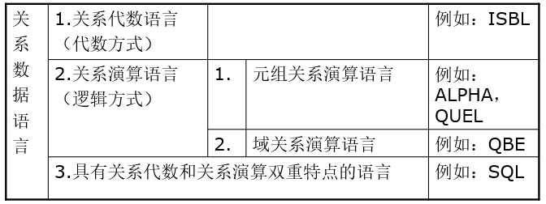
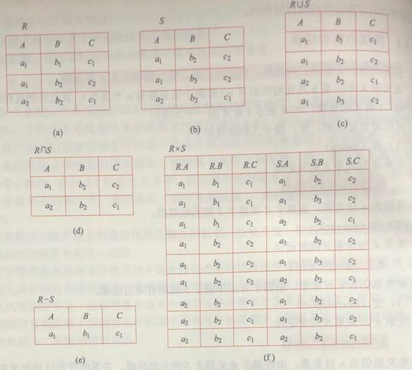
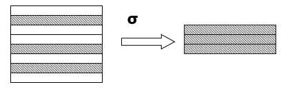
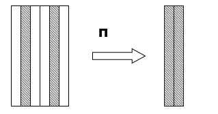
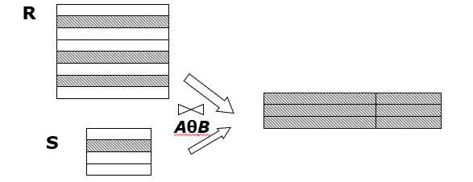
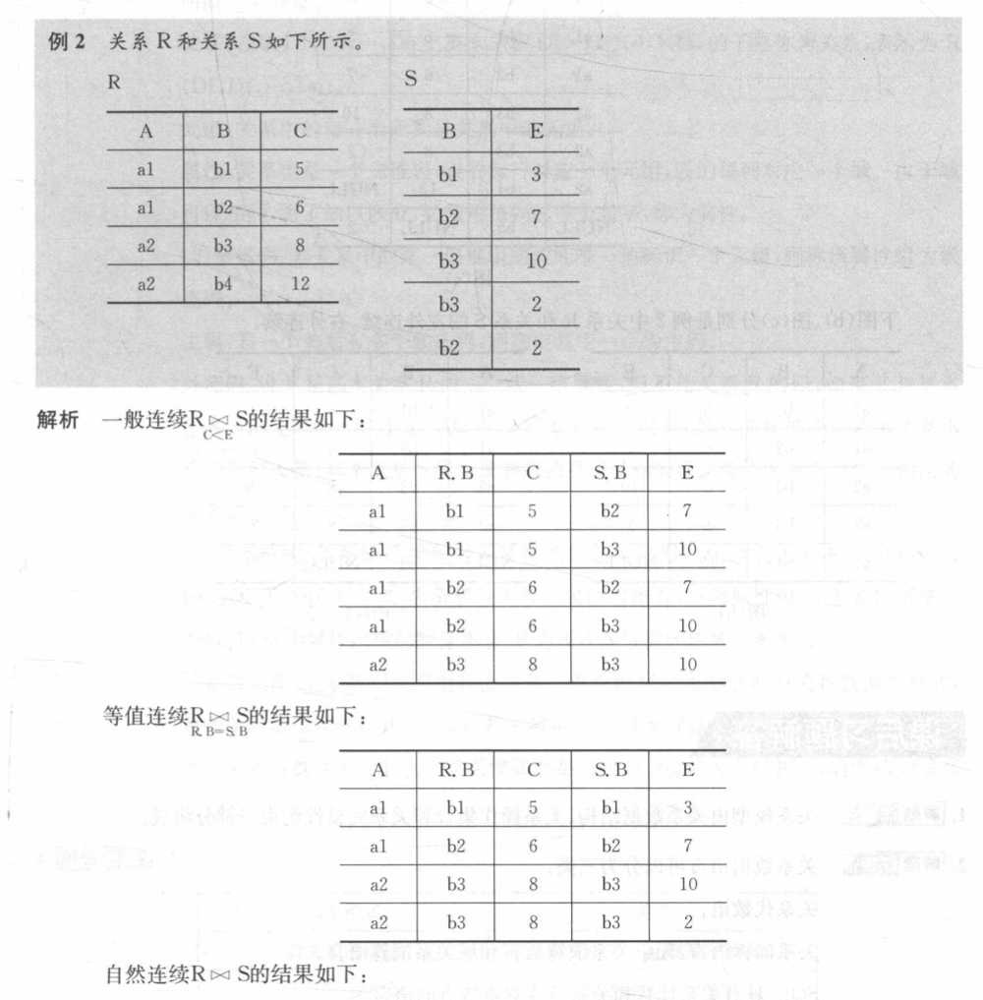
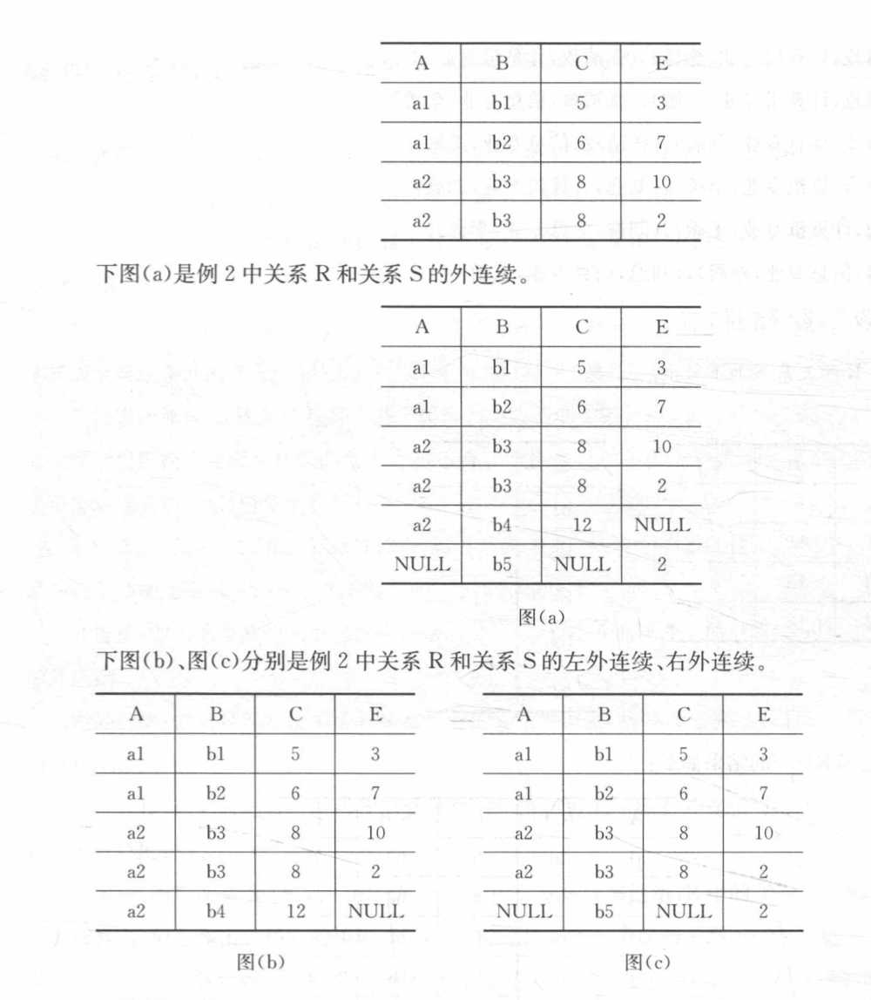
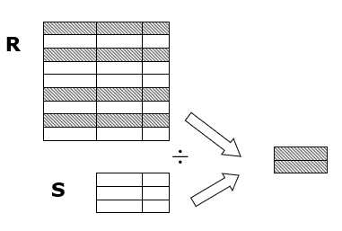
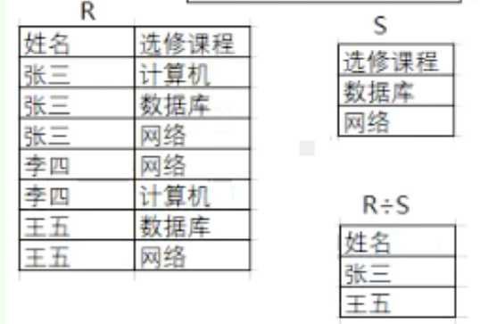
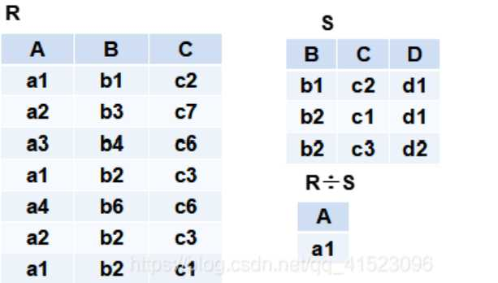

# 2.1 关系数据结构及形式化定义

## 2.1.1 关系

- 单一的数据结构->关系：现实世界的实体以及实体间的各种联系均用关系来表示
- 数据的逻辑结构->二维表:从用户角度，关系模型中数据的逻辑结构是一张二维表。
- 关系模型建立在集合代数的基础上

### 1. 域

一组具有相同数据类型的值的集合，例如：整数、实数、介于某个取值范围的整数、指定长度的字符串集合、{‘男’，‘女’}

### 2. 笛卡尔积

**笛卡尔积：**
给定一组域D1，D2，…，Dn（允许其中某些域是相同的），它们的笛卡尔积为：
`D1 × D2 × … × Dn ＝ {(d1，d2，…，dn)｜di ∈ Di，i＝1，2，…，n｝`
人话就是：所有域的所有取值的一个组合，不能重复组合。

**分量（Component）**:
笛卡尔积元素（d1，d2，…，dn）中的每一个值di叫作一个分量。

**元组（Tuple）：**
笛卡尔积中每一个元素（d1，d2，…，dn）叫作一个n元组（n-tuple）或简称元组，就是组合中的一种情况，n表示属性个数。

**基数（Cardinal number）：**
`Di（i＝1，2，…，n）`为有限集，基数为`mi(i＝1，2，…，n)`，则`D1 × D2 × … × Dn`基数 M 为：
M=∏i=1nmi
人话就是：有限集的前提下，所有不重复的组合个数。

**笛卡尔积的表示方法：**
笛卡尔积可表示为一个二维表。表中的每行对应一个元组，表中的每列对应一个域，每个格子为一个分量。

### 3.关系

**关系：**
`D1 × D2 × … × Dn`的子集叫作在域`D1，D2，…，Dn`上的关系，表示为：

```cpp
R（D1，D2，…，Dn）
R：关系名
n：关系的目或度（Degree）。
```

关系是笛卡尔积的有限子集，笛卡尔积不满足交换律，关系满足交换律（关系的每个列附加一个属性名以取消关系元组的有序性）。

**元组：**
关系中的每个元素是关系中的元组，通常用t表示。

**单元关系与二元关系：**
– 当n=1时，称该关系为单元关系（Unary relation）。
– 当n=2时，称该关系为二元关系（Binary relation）。

**关系的表示：**
关系也是一个二维表，表的每行对应一个元组，表的每列对应一个域。

**属性（Attribute）：**
关系中不同列可以对应相同的域，为了加以区分，必须对每列起一个名字，称为属性（Attribute）。n目关系必有n个属性。

**码（Key）：**

1. 候选码（Candidate key）：若关系中的某一属性组的值能唯一地标识一个元组，而其子集不能，则称该属性组为候选码（如学号，身份证号）。
2. 在最简单的情况下，候选码只包含一个属性。在最极端的情况下，关系模式的所有属性是这个关系模式的候选码，称为全码（All-key）。
3. 若一个关系有多个候选码，则选定其中一个为主码（Primary key）。候选码的诸属性称为主属性（Prime attribute）。不包含在任何侯选码中的属性称为非码属性或非主属性（Non-key attribute）。

**三类关系：**

1. 基本关系（基本表或基表）：实际存在的表，是实际存储数据的逻辑表示。
2. 查询表：查询结果对应的表。
3. 视图表：由基本表或其他视图表导出的表，是虚表，不对应实际存储的数据。

**基本关系的性质：**

1. 列同质的（Homogeneous）每一列中的分量是同一类型的数据，来自同一个域。
2. 不同的列可出自同一个域，其中的每一列称为一个属性。不同的属性要给予不同的属性名。
3. 列的顺序无所谓(属性名打破有序性）。
4. 任意两个元组不能完全相同（候选码不同）
5. 行的顺序无所谓，即行的次序可以任意交换。
6. 分量必须取原子值，每一个分量都必须是不可分的数据项。这是规范条件中最基本的。

## 2.1.2 关系模式

### 1. 什么是关系模式

关系模式（Relation Schema）是型，关系是值。
关系模式是对关系的描述：
元组集合的结构（属性构成、属性来自的域 、属性与域之间的映象关系），完整性约束条件，元组语义。

### 2．定义关系模式

```cpp
R（U，D，dom，F）
R     关系名
U     组成该关系的属性名集合
D     属性组U中属性所来自的域
dom   属性向域的映象集合
F     属性间的数据依赖关系集合
```

简记为：`R (U) 或 R (A1，A2，…，An)`,域名及属性向域的映象常常直接说明为属性的类型、长度。

## 2.1.3 关系数据库

### 1. 关系数据库

在一个给定的应用领域中，表示所有实体及实体之间联系的关系的集合构成一个关系数据库。

### 2. 关系数据库的型与值

- 关系数据库也有型和值之分，关系数据库的型称为关系数据库模式，是对关系数据库的描述（若干域的定义，在这些域上定义的若干关系模式）
- 关系数据库的值是这些关系模式在某一时刻对应的关系的集合，通常简称为关系数据库。

## 2.1.4 关系模型的存储结构

- 有的关系数据库管理系统中一个表对应一个操作系统文件，将物理数据组织交给操作系统完成
- 有的关系数据库管理系统从操作系统那里申请若干个大的文件，自己划分文件空间，组织表、索引等存储结构，并进行存储管理

# 2.2 关系操作

## 2.2.1 基本的关系操作

### 1. 常用的关系操作

- 查询：选择、投影、连接、除、并、交、差、笛卡尔积
    基本操作：选择、投影、并、差、笛卡尔积
- 数据更新：插入、删除、修改
- 查询的表达能力是其中最主要的部分

### 2.关系操作的特点

- 集合操作方式：即操作的对象和结果都是集合。
- 非关系数据模型的数据操作方式：一次一记录。

### 3. 关系数据语言的种类


[](http://fangkaipeng.com/wp-content/uploads/2021/03/wp_editor_md_7a1514a9446cc5e2fb65ee8c4f1df603.jpg)


### 4. 关系数据语言的特点

- 关系语言是一种高度非过程化的语言，存取路径的选择由DBMS的优化机制来完成，用户不必用循环结构就可以完成数据操作。
- 能够嵌入高级语言中使用。
- 关系代数、元组关系演算和域关系演算三种语言在表达能力上完全等价。

# 2.3 关系的完整性

关系模型的完整性规则是对关系的某种约束条件。（实体完整性，参照完整性，用户定义的完整性）

## 2.3.1 关系的三类完整性约束

实体完整性和参照完整性是关系模型必须满足的完整性约束条件，被称作是关系的两个不变性，应该由关系系统自动支持。

## 2.3.2 实体完整性

若属性A是基本关系R的主属性，则属性A不能取空值。空值就是“不知道”或“不存在”或“无意义”的值

**原因：**
（1）实体完整性规则是针对基本关系而言的。一个基本表通常对应现实世界的一个实体集。
（2）现实世界中的实体是可区分的，即它们具有某种唯一性标识。
（3）关系模型中以主码作为唯一性标识。
（4）主码中的属性即主属性不能取空值。主属性取空值，就说明存在某个不可标识的实体，即存在不可区分的实体，这与第（2）点相矛盾，因此这个规则称为实体完整性

## 2.3.3 参照完整性

### 1. 关系间的引用

在关系模型中实体及实体间的联系都是用关系来描述的，因此可能存在着关系与关系间的引用。

### 2．外码（Foreign Key）

- 设F是基本关系R的一个或一组属性，但不是关系R的码。如果F与基本关系S的主码Ks相对应，则称F是基本关系R的**外码**。
- 基本关系R称为**参照关系（Referencing Relation）**
- 基本关系S称为被**参照关系（Referenced Relation）或目标关系（Target Relation）。**

> 关系R和S不一定是不同的关系。学生（学号，姓名，性别，专业号，年龄，班长学号）
> 目标关系S的主码Ks 和参照关系的外码F必须定义在同一个（或一组）域上。
> 外码并不一定要与相应的主码同名；
> 当外码与相应的主码属于不同关系时，往往取相同的名字，以便于识别。

## 3. 参照完整性规则

若属性（或属性组）F是基本关系R的外码，它与基本关系S的主码Ks相对应（基本关系R和S不一定是不同的关系），则对于R中每个元组在F上的值必须为：
– 或者取空值（F的每个属性值均为空值）
– 或者等于S中某个元组的主码值。

## 2.3.4 用户定义的完整性

- 用户定义的完整性是针对某一具体关系数据库的约束条件，反映某一具体应用所涉及的数据必须满足的语义要求。
- 关系模型应提供定义和检验这类完整性的机制，以便用统一的系统的方法处理它们，而不要由应用程序承担这一功能。

# 2.4 关系代数

## 2.4.0 概述

### 1. 定义

一种抽象的**查询语言**，用对关系的运算来表达查询。**三要素：**运算对象、运算结果、运算符。

### 2. 分类

- 传统的集合运算符：将关系看成元组的集合，运算是从关系的“水平”方向即行的角度来进行
- 专门的关系运算符：不仅涉及行而且涉及列
- 算术比较符：辅助专门的关系运算符进行操作
- 逻辑运算符：辅助专门的关系运算符进行操作

### 3. 标记符号

，，(1)R，t∈R，t[Ai]

设关系模式为 ，R(A1，A2…An) ,它的一个关系设为 R 。t∈R表示 t 是 R 的一个元组，t[Ai] 则表示元组 t 中相应于属性 Ai 的一个分量。

，，(2)A，t[A]，A¯

，A=Ai1，Ai2…Aik，其中 ，Ai1，Ai2…Aik 是 ，A1，A2…An 中的一部分，则 A 称为属性列或域列。
，t[A]=(t[Ai1]，t[Ai2]…t[Aik]) 表示元组 t 在属性列 A 上诸分量的集合。
A¯ 则表示 ，A1，A2…An 中去掉 ，Ai1，Ai2…Aik 后剩余的属性组。

(3)\overgrouptrts

R 为 n目关系， S 为m目关系。，tr∈R，ts∈S， \overgrouptrts称为元组的连接。它是一个 n+m 列的元组，前n个分量为 R 中的一个n元组，后m个分量为 S 中的一个m元组。

象集(4)象集Zx

给定一个关系（，）R（X，Z）， X 和 Z 为属性组。当 t[X]=x时，x 在 R 中的象集（Images Set）为： ，Zx=t[Z]|t∈R，t[X]=x, 它表示 R 中属性组 X 上值为 x 的诸元组在 Z 上分量的集合。

## 2.4.1 传统的集合运算

### 1. 并

**条件**具有相同的目n（即两个关系都有n个属性），相应的属性取自同一个域。
R⋃S={t|t∈R∨t∈S}

### 2. 差

**条件：** 具有相同的目n，相应的属性取自同一个域
R–S={t|t∈R∧t∉S}

### 3. 交

**条件：** 具有相同的目n，相应的属性取自同一个域
R⋂S={t|t∈R∧t∈S}
R⋂S=R–(R−S)

### 4. 广义笛卡尔积

R：n目关系，k1个元组
S：m目关系，k2个元组
R×S={\overgrouptrts|tr∈R∧ts∈S}

列：（n+m）列的元组的集合，元组的前n列是关系R的一个元组，后m列是关系S的一个元组。
行：k1×k2个元组


[](http://fangkaipeng.com/wp-content/uploads/2021/03/wp_editor_md_7c99dae0ea4a88a46aa807cafb2cd547.jpg)


## 2.4.2 专门的关系运算

### 1.选择

选择又称为限制（Restriction），在关系R中选择满足给定条件的诸元组，是对行进行的操作。（就是按照选择条件选择某个表中的某些行）

σF(R)={t|t∈R∧F(t)=‘true′}

σSdept=‘IS′(Student) 表示在student表中选择sdept = ‘IS’的元组。

其中 F 表示选择条件，是一个逻辑表达式，取逻辑值“真”或“假”，基本形式为：X1θY1。
θ是比较运算符（＞，≥，＜，≤，＝或<>）
X1，Y1等是属性名、常量、简单函数；属性名也可以用它的序号来代替；
在基本的选择条件上可以进一步进行逻辑运算，求非 ，与，或运算。


[](http://fangkaipeng.com/wp-content/uploads/2021/03/wp_editor_md_792b64fdf6353a0cddbc6452fc59a2fd.jpg)


### 2. 投影

从R中选择出若干属性列组成新的关系，是对列进行的操作。（就是只保留部分的属性列）

πA(R)={t[A]|t∈R}
π2,5(Student) 表示选取Student表的第2和5列。
投影之后不仅取消了原关系中的某些列，而且还可能取消某些元组（避免重复行）。

[](http://fangkaipeng.com/wp-content/uploads/2021/03/wp_editor_md_a17432d4b9f651a992dbb0e6ec4408b8.jpg)


### 3. 连接

从两个关系的笛卡尔积中选取属性间满足一定条件的元组。
R⊳⊲S={\overgrouptrts|tr∈R∧ts∈S∧tr[A]θts[B]
和A和B：分别为 R 和 S 上度数相等且可比的属性组。
θ：比较运算符。

连接运算从 R 和 S 的广义笛卡尔积 R×S 中选取（ R 关系）在 A 属性组上的值与（ S 关系）在 B 属性组上值满足比较关系的元组。

- 等值连接：R⊳⊲A=BS={\overgrouptrts|tr∈R∧ts∈S∧tr[A]=ts[B],从关系R与S的广义笛卡尔积中选取A、B属性值相等的那些元组。

- 自然连接：

    R⊳⊲A=BS={\overgrouptrts|tr∈R∧ts∈S∧tr[B]=ts[B]

    ，R和S具有相同的属性组B。

    

- 悬浮元组：两个关系 R 和 S 在做自然连接时，关系 R 中某些元组有可能在 S 中不存在公共属性上值相等的元组，从而造成 R 中这些元组在操作时被舍弃了，这些被舍弃的元组称为悬浮元组。

- **外连接（Outer Join）**：如果把悬浮元组也保存在结果关系中，而在其他属性上填空值(Null)，就叫做外连接。

- **左外连接(LEFT OUTER JOIN或LEFT JOIN)：**只保留左边关系R中的悬浮元组

- **右外连接(RIGHT OUTER JOIN或RIGHT JOIN)：**只保留右边关系S中的悬浮元组


[](http://fangkaipeng.com/wp-content/uploads/2021/03/wp_editor_md_e579c3343cfb815aec85de8ffbdc15db.jpg)


**例子：**

[](http://fangkaipeng.com/wp-content/uploads/2021/03/wp_editor_md_71dbaa5fccf9c4a8990b7c2a5d0cba63.jpg)


[](http://fangkaipeng.com/wp-content/uploads/2021/03/wp_editor_md_c0a791dfa0d6458b93617dca21b1a432.jpg)


### 4.除


[](http://fangkaipeng.com/wp-content/uploads/2021/03/wp_editor_md_e8c4f86bbb88de8030dc76f4869da3a4.jpg)


[](http://fangkaipeng.com/wp-content/uploads/2021/03/wp_editor_md_d1879af5ceb9af6774e753fc32b679d6.jpg)
[](http://fangkaipeng.com/wp-content/uploads/2021/03/wp_editor_md_4dee209922a73be961af6b9cac324774.jpg)


保留R中满⾜S的,⽽且R中列要去掉S的列。
例：


[](http://fangkaipeng.com/wp-content/uploads/2021/03/wp_editor_md_37d917e481f4ac87d32f9f58c6f6e37f.jpg)


只有张三和王五满足全部的S，即张三和王五都选了S中的数据库和网络，所以R÷S = {张三，王五}


[](http://fangkaipeng.com/wp-content/uploads/2021/03/wp_editor_md_a08a47a6a49f1cf1fac7b919d2e056de.jpg)


R和S共同属性有B和C，找到R中满足全部B和C的元组，输出舍弃B列和C列后的结果（即A列）。图中只有a1满足S中的所有要求。

# 2.5 作业记录


### 解析：

1.查询的是图书名称，图书名称在“采购图书”中，而我们的查询条件是借书证号为‘S20180204’的读者，借书证号在“借阅”中，“借阅”和“采购图书”没有直接的联系，需要一个中间关系模式，即“上架图书”，“上架图书中”的主键（内部编码），是“借阅”的外键，“采购图书”的主键（ISBN）是“上架图书”的外键，“上架图书”相当于桥梁将“借阅”和“采购图书”两个关系链接起来，将三个表自然连接后选择借书证号为‘S20180204’的元组，投影出书名即可。

2.寻找没有借过书的读者的（借书证号）（姓名）（电话），直接查找比较困难。可以先表示出有借阅记录的读者，即在“借阅”和“读者”自然连接（自然连接的原因同上）后的表中投影出所需的属性，然后与所有的读者做差就是没借过书的人。

3.要满足两个条件，第一反应应该是使用选择操作，条件做‘交’，但是对于同一个元组不能做‘交’（无法找到某个元组的某个属性同时满足两个值），所以可以找出满足条件1的所有读者和满足条件2的所有读者后再做‘交’。至于为何要自然连接三个关系，这是由所需的属性位于哪个关系决定的。

4.可以直接对选择的条件做‘并’的操作，表示只要满足条件1或者满足条件2即可，那就很简单了。

5.将“借阅”和自己求一下广义笛卡尔积，由题目可知第2列的属性是‘借书证号’，第3列的属性是‘图书内部编码’，在广义笛卡尔积后的关系中，第7列为第二张表的‘借书证号’，第8列为第二张表的‘图书内部编码’，那么我们可以使用选择，条件设置成第2列和第7列相等（保证同一个人），第3列和第8列不同（保证借的书至少有两本不同），最后再投影出所需的属性即可。

6.先在读者中选择出姓名为‘林民’的元组，与‘借阅’自然选择后就是林民的所有借阅记录，投影出其中的“图书内部编码”，然后再与‘借阅’自然选择得到所有和林民的图书编码一样的借阅记录，然后与读者自然选择得到每条借阅记录的读者信息，投影出需要的属性即可。

7.遇到满足某个集合“全部”的概念时一般考虑用除法，先找到除数，即借阅人为林民的所有图书的内部编码，再找到被除数，即所有的读者信息，由于要和除数有联系，所有不光投影出所需的属性，还要投影出内部编码。