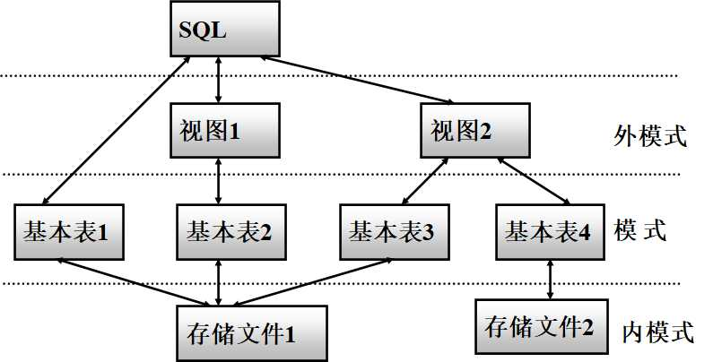
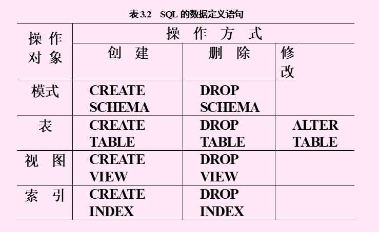
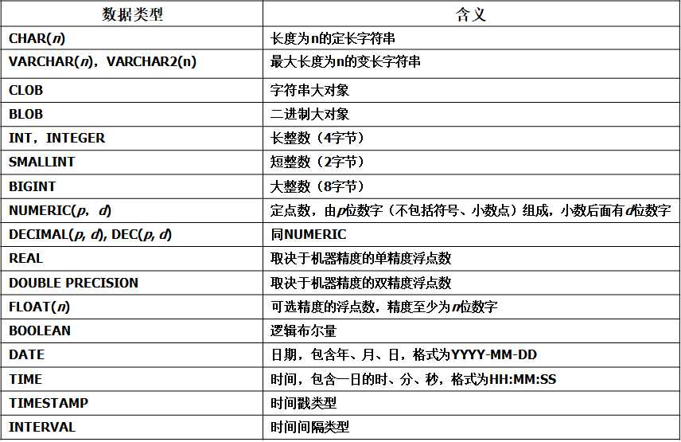
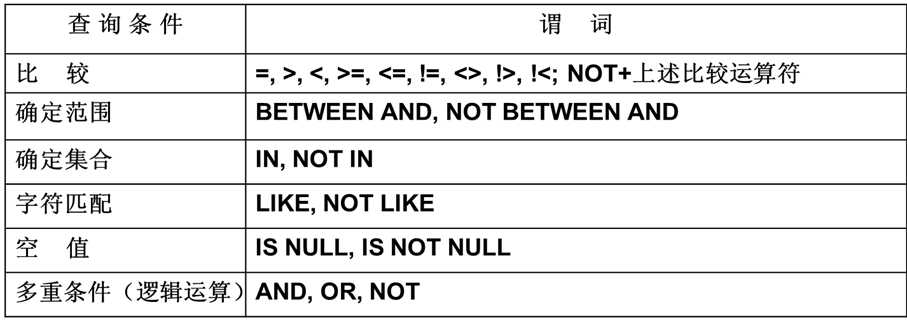
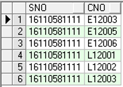

# 3.1 SQL概述

SQL是结构化查询语言(Structured Query Language)的缩写,是关系数据库的标准语言，实际功能包括**数据定义、数据查询、数据操纵和数据控制**。SQL标准的制定使得几乎所有的数据库厂家都采用SQL语言作为其数据库语言。但各家又在SQL标准的基础上进行扩充，形成自己的语言。

## 3.1.1 特点

- 综合统一

    - SQL集DDL(模式数据定义语言)，DML(数据操纵语言)，DCL（数据控制语言 ）的功能于一体
    - 可以独立完成数据库生命周期中的全部活动
    - 用户数据库投入运行后，可根据需要随时逐步修改模式，不影响数据库的运行。
    - 数据操作符统一

- 高度非过程化：

     

    只要提出“做什么”，无须指明“怎么做”

    

- **面向集合的操作方式**

- **以同一种语法结构提供多种使用方式：** SQL既是独立语言，又是嵌入式语言

## 3.1.2 SQL的基本概念

**SQL支持关系数据库三级模式结构**


[](http://fangkaipeng.com/wp-content/uploads/2021/04/wp_editor_md_8108e0bd29420751de6a526875a78019.jpg)


**基本表:**
本身独立存在的表，SQL中一个关系就对应一个基本表，一个（或多个）基本表对应一个存储文件，一个表可以带若干索引。

**存储文件：**
逻辑结构组成了关系数据库的内模式，物理结构对用户是隐蔽的。

**视图：**
从一个或几个基本表导出的表，数据库中只存放视图的定，而不存放视图对应的数据，视图是一个虚表，用户可以在视图上再定义视图。

## 3.1.3 SQL语言的功能概述

SQL语言是集DDL、DML和DCL于一体的数据库语言，SQL语言主要由以下9个单词引导的操作语句来构成，但每一种语句都能表达复杂的操作请求：
– **DDL语句引导词：** Create(建立),Alter(修改),Drop(撤消)
模式的定义和删除，包括定义Database,Table,View,Index,完整性约束条件等，也包括定义对象(RowType行对象,Type列对象)
– **DML语句引导词：** Insert ,Delete, Update, Select
– 各种方式的更新与检索操作，如直接输入记录，从其他Table(由SubQuery建立)输入
– 各种复杂条件的检索，如连接查找，模糊查找，分组查找，嵌套查找等
– 各种聚集操作，求平均、求和、…等，分组聚集，分组过滤等
– **DCL语句引导词：** Grant,Revoke
安全性控制：授权和撤消授权

# 3.2 数据定义


[](http://fangkaipeng.com/wp-content/uploads/2021/04/wp_editor_md_dcfe49960af51213cfaaadf978a73bb3.jpg)


现代关系数据库管理系统提供了一个层次化的数据库对象命名机制：

- 一个关系数据库管理系统的实例（Instance）中可以建立多个数据库
- 一个数据库中可以建立多个模式
- 一个模式下通常包括多个表、视图和索引等数据库对象

## 3.2.1 模式的定义与删除

问：什么是模式？有什么用？

### 1.定义模式

**格式：**`CREATE SCHEMA <模式名> AUTHORIZATION <用户名>；`

- 定义模式实际上定义了一个**命名空间**，在这个空间中可以进一步定义该模式包含的数据库对象，如基本表、视图、索引等。

- 如果没有指定<模式名> ，则<模式名> 隐含等于<用户名>

- 要创建模式，调用该命令的用户必须拥有DBA权限，或者获得了DBA授予的

    ```
    CREATE SCHEMA
    ```

    权限（安全性）。

    

- 在`CREATE SCHEMA`中可以接受`CREATE TABLE`，`CREATE VIEW`和`GRANT`子句，格式为：`AUTHORIZATION <用户名> [<表定义子句>| <视图定义子句>| <授权定义子句>]`。

- 例子：

```sql
// 给用户Wang定义一个名为 test 的模式
CREATE SCHEMA test AUTHORIZATION Wang ;
//定义模式可以进一步创建基本表、视图，定义授权。
CREATE SCHEMA test AUTHORIZATION Wang
     CREATE TABLE Tab1(Col1 SMALLINT,
                      Col2, CHAR(20),
                      Col3, INT);
```

### 2.删除模式

**格式：** `DROP SCHEMA <模式名> <CASCADE | RESTRICT>`

- CASCADE（级联）
    删除模式的同时把该模式中所有的数据库对象全部删除
- RESTRICT（限制）
    如果该模式中定义了下属的数据库对象（如表、视图等），则拒绝该删除语句的执行。仅当该模式中没有任何下属的对象时才能执行。

## 3.2.2 基本表的定义、删除和修改

### 1.定义基本表

```sql
CREATE TABLE <表名>
      （<列名> <数据类型>[ <列级完整性约束条件> ]
      [，<列名> <数据类型>[ <列级完整性约束条件>] ] …
      [，<表级完整性约束条件> ] ）；
```

- `<表名>`：所要定义的基本表的名字

- `<列名>`：组成该表的各个属性（列）

- `<列级完整性约束条件>`：涉及相应属性列的完整性约束条件

- ```
    <表级完整性约束条件>
    ```

    ：涉及一个或多个属性列的完整性约束条件

    

- SQL中域的概念用**数据类型**来实现，定义表的属性时需要指明其数据类型及长度，主要数据类型如下：


[](http://fangkaipeng.com/wp-content/uploads/2021/04/wp_editor_md_f2376206e7d599b9ceb2b371632e3824.jpg)


- **常用完整性约束：**
    主码约束：`PRIMARY KEY`，用在表级完整性上可以设置两个属性作为主键。

```sql
create table sc(
    sno varchar(11),
    cno varchar(6),
    grade float,
    primary key(sno,cno)
)
```

唯一性约束：`UNIQUE`
非空值约束：`NOT NULL`
参照完整性约束：`FOREIGN KEY`(外码) `REFERENCES`（被参照表）
用户自定义完整性约束： `check(当前列要满足的约束条件)`

```sql
create table student(
    ssex varchar2(2) check(ssex in ('男','女'))
)
表示ssex这一列中只能插入男或女两个值
```

### 2. 模式与表

每个基本表都属于某个模式，一个模式包含多个基本表,定义基本表有三种方式定义其所属模式：

- 在表名中明显的给出模式名
- 创建模式时同时创建表
- 设置所属的模式，在创建表时不必给出模式名，类似缺省。

创建基本表（其他数据库对象也一样）时，若没有指定模式，系统根据**搜索路径**来确定该对象所属的模式，搜索路径包含一组模式列表，关系数据库管理系统会使用模式列表中**第一个存在的**模式作为数据库对象的模式名，若搜索路径中的模式名都不存在，系统将给出错误，相关操作：

- 显示当前的搜索路径：`SHOW search_path;`
- DBA可以设置搜索路径：`SET search_path TO “S-T”, PUBLIC;`

### 2. 修改基本表

```sql
ALTER TABLE <表名>
[ ADD[COLUMN] <新列名> <数据类型> [ 完整性约束 ] ]
[ ADD <表级完整性约束>]
[ DROP [ COLUMN ] <列名> [CASCADE| RESTRICT] ]
[ DROP CONSTRAINT <完整性约束名>  [ RESTRICT | CASCADE ] ]
[ALTER COLUMN <列名><数据类型> ] ;
```

- `<表名>`是要修改的基本表；

- `ADD` 子句用于增加新列、新的列级完整性约束条件和新的表级完整性约束条件；

- ```
    DROP COLUMN
    ```

     

    子句用于删除表中的列：

    - 如果指定了 `CASCADE` 短语，则自动删除引用了该列的其他对象。
    - 如果指定了 `RESTRICT` 短语，则如果该列被其他对象引用，关系数据库管理系统将拒绝删除该列。

- `DROP CONSTRAINT` 子句用于删除指定的完整性约束条件；

- ```
    ALTER COLUMN
    ```

     

    子句用于修改原有的列定义，包括修改列名和数据类型。

    

- 例子：

```sql
//向Student表增加“入学时间”列，其数据类型为日期型。
ALTER TABLE Student ADD Scome DATE  ;
//直接删除属性列:Scome
ALTER TABLE Student  DROP COLUMN Scome ;
//将年龄的数据类型改为半字长整数
ALTER TABLE Student ALTER COLUMN Sage  SMALLINT;
ALTER TABLE Student MODIFY Sage SMALLINT;//ORACLE中
//删除学生姓名必须取唯一值的约束。
ALTER TABLE Student DROP UNIQUE(Sname); 
```

### 3. 删除基本表

```
DROP TABLE <表名> <CASCADE | RESTRICT>;  
```

- `RESTRICT`：删除表是有限制的。
    欲删除的基本表不能被其他表的约束所引用
    如果存在依赖该表的对象，则此表不能被删除
- `CASCADE`：删除该表没有限制。
    如果表的主键被另一个表引用，Oracle中使用CASCADE constraints选项；
    在删除基本表的同时，相关的依赖对象一起删除；
- 不同数据库产品的处理策略不同

## 3.2.3索引的建立与删除

DBA或表的属主（即建立表的人）根据需要建立,有些DBMS自动建立以下列上的索引：PRIMARY KEY,UNIQUE。DBMS自动完成索引的维护，DBMS自动选择是否使用索引以及使用哪些索引。

### 1. 建立索引

```sql
CREATE [UNIQUE] [CLUSTER] INDEX <索引名> ON <表名>(<列名>[<次序>][,<列名>[<次序>] ]…)；

 
 
 
```

- 用`<表名>`指定要建索引的基本表名字
- 索引可以建立在该表的一列或多列上，各列名之间用逗号分隔
- 用`<次序>`指定索引值的排列次序，升序：`ASC`，降序：`DESC`。缺省值：`ASC`
- `UNIQUE`表明此索引的每一个索引值只对应唯一的数据记录
- `CLUSTER`表示要建立的索引是聚簇索引
- 例子：为学生-课程数据库中的Student，Course，SC三个表建立索引。其中Student表按姓名升序建立唯一索引，Course表按课程名称升序建唯一索引，SC表按课程号升序和课程成绩降序建索引。

```sql
CREATE UNIQUE INDEX  Stusname ON Student(Sname) ;
CREATE UNIQUE INDEX Coucname ON Course(Cname) ;
CREATE INDEX SCcno_Grade ON SC(Cno ASC, Grade DESC) ;
```

- 唯一值索引
    对于已含重复值的属性列不能建UNIQUE索引
    对某个列建立UNIQUE索引后，插入新记录时DBMS会自动检查新记录在该列上是否取了重复值。这相当于增加了一个UNIQUE约束

### 2. 删除索引

```
DROP INDEX <索引名>；
```

删除索引时，系统会从数据字典中删去有关该索引的描述。

## 3.2.4 数据字典

数据字典是关系数据库管理系统内部的一组系统表，它记录了数据库中所有定义信息：

- 关系模式定义
- 视图定义
- 索引定义
- 完整性约束定义
- 各类用户对数据库的操作权限
- 统计信息等

关系数据库管理系统在执行SQL的数据定义语句时，实际上就是在更新数据字典表中的相应信息。

# 3.3 数据更新

## 3.3.1 插入数据

### 1. 插入单个元组

```sql
INSERT  INTO <表名> [(<属性列1>[，<属性列2 >…)]
      VALUES (<常量1> [，<常量2>]    …           )
```

**INTO子句**

- 指定要插入数据的表名及属性列
- 属性列的顺序可与表定义中的顺序不一致
- 没有指定属性列：表示要插入的是一条完整的元组，且属性列属性与表定义中的顺序一致
- 指定部分属性列：插入的元组在其余属性列上取空值

**VALUES子句**

- 提供的值必须与INTO子句匹配，包括值的个数、值的类型

    

- 例子：将一个新学生记录插入到Student表中.

（学号：16110581111；姓名：殷晓琛；性别：男；年龄：20岁；所在系：MA）

```sql
INSERT    INTO Student(Sno, Sname, Ssex, Sage, Sdept)
VALUES ('16110581111', '殷晓琛', '男',  20, 'MA');
```

### 2. 插入子查询结果

```sql
INSERT   INTO <表名>  [(<属性列1> [，<属性列2>…  )] 子查询；

 
 
 
```

这里所说的子查询，就是一个`SELECT`查询语句，可以将子查询结果插入指定表中。SELECT子句目标列必须与INTO子句匹配（值的个数、值的类型）

## 3.3.2 修改数据

## 3.3.3 删除数据

# 3.4 数据查询

## 3.4.1 概述

```sql
SELECT [ALL|DISTINCT] <目标列表达式>
            [，<目标列表达式>] …
FROM <表名或视图名>[， <表名或视图名> ] …
[ WHERE <条件表达式> ]
[ GROUP BY <列名1> [ HAVING <条件表达式> ] ]
[ ORDER BY <列名2> [ ASC|DESC ] ]；
```

- SELECT子句：指定要显示的属性列
- FROM子句：指定查询对象(基本表或视图)
- WHERE子句：指定查询条件
- GROUP BY子句：对查询结果按指定列的值分组，该属性列值相等的元组为一个组。通常会在每组中作用集函数。
- HAVING短语：筛选出只有满足指定条件的组
- ORDER BY子句：对查询结果表按指定列值的升序或降序排序

## 3.4.2 单表查询

查询仅涉及一个表，是一种最简单的查询操作

### 1. 选择表中的若干列

- **查询部分列**
    SELECT后的<目标表达式>中各个列的顺序可以与表中的顺序不同。

```sql
SELECT Sno,  Sname FROM Student;
SELECT Sname,  Sno,  Sdept FROM Student ;
```

- **查询全部列**
    查询所有属性列的两种方法：列出所有列名，或者用*代替

```sql
SELECT  Sno, Sname, Ssex, Sage, Sdept FROM Student ;
SELECT  * FROM Student ;
```

- **查询经过计算的值**
    SELECT子句的<目标列表达式>为表达式，如：算术表达式，字符串常量，函数，列别名等

```sql
//查全体学生的姓名及其出生年份
SELECT Sname, TO_CHAR(sysdate, 'yyyy')-Sage FROM Student;
//查询全体学生的姓名、出生年份和所有系，要求用小写字母表示所有系名
SELECT Sname, 'Year of Birth:',TO_CHAR(sysdate,'yyyy')- Sage, LOWER(Sdept) FROM Student;
```

问：上面代码解释？

### 2. 选择表中的若干元组

- **消除取值重复的行**
    在SELECT子句中使用DISTINCT短语，DISTINCT短语的作用范围是所有目标列

```sql
//DISTINCT同时作用于Grande和Cno，查询选修课程的各种成绩
SELECT DISTINCT Cno, Grade FROM SC;
```

- 查询满足条件的元组

    ```
    WHERE
    ```

    子句常用的查询条件：

    

    

    - 比较大小

```sql
//查询计算机科学系全体学生的名单
SELECT Sname FROM Student WHERE Sdept='CS';
//查询所有年龄在20岁以下的学生姓名及其年龄
SELECT Sname, Sage FROM Student WHERE Sage < 20;
```

- 确定范围

```sql
//查询年龄在20~23岁（包括20岁和23岁）之间的学生的姓名、系别和年龄。
SELECT  Sname, Sdept, Sage
    FROM Student WHERE Sage
        BETWEEN 20 AND 23;
```

- 确定集合

```sql
//查询信息系（IS）、数学系（MA）和计算机科学系（CS）学生的姓名和性别。
SELECT Sname, Ssex
    FROM  Student
        WHERE Sdept IN ( 'IS', 'MA', 'CS' );
```

- 字符串匹配

```sql
[NOT] LIKE  ‘<匹配串>’  [ESCAPE ‘ <换码字符>’]

 
 
 
```

<匹配串>：指定匹配模板
匹配模板：固定字符串或含通配符的字符串
通配符：
`%`(百分号) 代表任意长度（长度可以为0）的字符串,`_`(下横线) 代表任意单个字符,当用户要查询的字符串本身就含有 % 或 _ 时，要使用ESCAPE ‘<换码字符>’ 短语对通配符进行转义。

```sql
//查询学号为16120801116的学生的详细情况。
SELECT * FROM Student WHERE Sno LIKE '16120801116';
SELECT * FROM Student WHERE Sno = '16120801116';
//查询所有姓刘学生的姓名、学号和性别。
SELECT Sname, Sno, Ssex FROM Student WHERE Sname LIKE '刘%' ;
//查询姓“刘"且全名为三个汉字的学生的姓名。
SELECT Sname FROM Student WHERE  Sname LIKE '刘_ _';
//查询名字中第2个字为“文"字的学生的姓名。
SELECT Sname FROM Student WHERE Sname LIKE '_文%';
//查询所有不姓刘的学生姓名。
SELECT Sname FROM Student WHERE Sname NOT LIKE '刘%';
//查询Java_开头的课程的课程名。
SELECT Cname FROM Course WHERE Cname LIKE 'Java\_%' ESCAPE '\';
```

- 涉及空值的查询

    使用谓词

     

    ```
    IS NULL
    ```

     

    或

     

    ```
    IS NOT NULL
    ```

     

    “IS NULL” 不能用 “= NULL” 代替

    

    ```sql
    //查所有有成绩的学生学号。
    SELECT Sno FROM  SC WHERE  Grade IS NOT NULL;
    ```

- 多重条件查询
    用逻辑运算符`AND`和`OR`来联结多个查询条件，`AND`的优先级高于`OR`，可以用括号改变优先级。

```sql
//查询信息系（IS）年龄在20岁以下的学生姓名
SELECT Sname FROM  Student WHERE Sdept= 'IS' AND Sage<20;
```

### 3. 对查询结果排序

使用`ORDER BY`子句，可以按一个或多个属性列排序，升序：ASC；降序：DESC；缺省值为升序。当排序列含空值时，ASC：排序列为空值的元组最后显示，DESC：排序列为空值的元组最先显示

```sql
//查询选修了编号为L12003课程的学生的学号及其成绩
//查询结果按分数降序排列。
SELECT Sno,  Grade
    FROM  SC
    WHERE  Cno= 'L12003‘
    ORDER BY Grade DESC  ;
 
```

### 4. 使用聚集函数

- 计数
    `COUNT（[DISTINCT|ALL] *）`
    `COUNT（[DISTINCT|ALL] <列名>）`

- 计算总和
    `SUM（[DISTINCT|ALL] <列名>）`

- 计算平均值
    `AVG（[DISTINCT|ALL] <列名>）`

- 求最大值
    `MAX（[DISTINCT|ALL] <列名>）`

- 求最小值

    ```
    MIN（[DISTINCT|ALL] <列名>）
    ```

    

    - DISTINCT短语：在计算时要取消指定列中的重复值
    - ALL短语：不取消重复值，ALL为缺省值

- 对空值的处理
    除COUNT(*)外，都跳过空值

```sql
// 查询学生总人数
SELECT COUNT(*) FROM  Student;
//查询选修了课程的学生人数,DISTINCT避免重复计算学生人数
SELECT COUNT(DISTINCT Sno) FROM SC;
//计算选修编号为L12001的课程的学生平均成绩、最高分数和最低分数。
SELECT  ROUND(AVG(Grade),2), MAX(Grade), MIN(Grade)
    FROM SC
        WHERE Cno= 'L12001';
```

### 5. 对查询结果分组

使用`GROUP BY`子句分组，细化聚集函数的作用对象（范围）。对查询结果分组后，聚集函数将分别作用于每个组。
– GROUP BY子句的作用对象是查询的中间结果表；
– 分组方法：按指定的一列或多列值分组，值相等的为一组；
– 使用GROUP BY子句后，SELECT子句的列名列表中只能出现分组属性和聚集函数。
– 使用HAVING短语筛选最终输出结果：只有满足HAVING短语指定条件的组才输出
– HAVING短语与WHERE子句的区别：作用对象不同
– WHERE子句作用于基表或视图，从中选择满足条件的元组。
– HAVING短语作用于组，从中选择满足条件的组。

问：不太明白下面的代码

```sql
// 求各个课程号及相应的选课人数
SELECT Cno, COUNT(Sno)
     FROM    SC
     GROUP BY Cno 
     ORDER BY Cno; 
//查询选修了9门以上课程的学生学号。
SELECT Sno
     FROM  SC
     GROUP BY Sno
     HAVING  COUNT(*) >9 ;
```

## 3.4.3 连接查询

## 3.4.4 嵌套查询

## 3.4.3 嵌套查询

### 1. 概述

一个SELECT-FROM-WHERE语句称为一个查询块。将一个查询块嵌套在另一个查询块的WHERE子句或HAVING短语的条件中的查询称为嵌套查询。

```SQL
SELECT Sname        /*外层查询、父查询*/
     FROM Student
     WHERE Sno IN
         (SELECT Sno        /*内层查询、子查询*/
                FROM SC
                WHERE Cno= 'E12002'  )  ;
```

上述代码先执行内层查询，找到所有选了课程号为E12002的课程的学生学号，外层查询利用内层查询的结果去查询这些学号对应的名字。

**子查询的限制：**

不能使用ORDER BY子句，ORDER BY只能对最终查询结果排序。

层层嵌套方式反映了 SQL语言的结构化；有些嵌套查询可以用连接运算替代。

### 2. 分类

**不相关子查询：**子查询的查询条件不依赖于父查询。由里向外逐层处理。即每个子查询在上一级查询处理之前求解，子查询的结果用于建立其父查询的查找条件。

**相关子查询：**子查询的查询条件依赖于父查询。

- 首先取外层查询中表的第一个元组，根据它与内层查询相关的属性值处理内层查询，若WHERE子句返回值为真，则取此元组放入结果表；

    

- 然后再取外层表的下一个元组；

- 重复这一过程，直至外层表全部检查完为止。

**例如：**找出每个学生超过他选修课程平均成绩的课程号。（相关子查询）

```sql
SELECT Sno, Cno
    FROM SC x
    WHERE Grade >=(SELECT AVG(Grade)
                           FROM SC y
                           WHERE  y.Sno=x.Sno)  ;
```

- 从外层查询中取出SC的一个元组,将

    ```
    x.Sno
    ```

    值(16110581111)传递给内层查询：

    ```sql
    SELECT AVG(Grade) FROM SC y WHERE y.Sno = '16110581111';
    
     
     
     
    ```

- 执行内层查询,得到值83，用83代替内层查询，得到外层查询：

    ```sql
    SELECT Sno, Cno FROM SC x WHERE Grade >= 83 
                          AND x.Sno= '16110581111';
    ```

    

    

    

- 外层查询取出下一个元组，重复上述步骤，…

### 3. 引出子查询的谓词

**带有IN谓词的子查询：**

例：查询与“陈磊”在同一个系学习的学生。

```sql
SELECT Sno, Sname, Sdept//外查询：查询系名和内查询一样的学生信息。
    FROM Student
    WHERE Sdept  IN
          (SELECT Sdept//内查询：查找陈磊所在的系名
                FROM Student
                WHERE Sname=  '陈磊' )  ;
```

该例子也可以用自身连接完成：

```sql
SELECT  S1.Sno, S1.Sname, S1.Sdept
     FROM     Student S1, Student S2
     WHERE  S1.Sdept = S2.Sdept  AND
                      S2.Sname = '陈磊' ;
```

**带有比较运算符的子查询：**

当能确切知道内层查询返回**单值**时，可用比较运算符（>，<，=，>=，<=，!=或< >），与ANY或ALL谓词配合使用。

例：假设学生姓名不能重复，一个学生只可能在一个系学习，并且必须属于一个系，则上面的例子中可以用 `=` 代替`IN` ：

```sql
SELECT Sno, Sname, Sdept
    FROM    Student
    WHERE Sdept   =
            (SELECT Sdept
                    FROM    Student
                    WHERE Sname= '陈磊')  ;
```

**带有ANY或ALL谓词的子查询：**

`ANY`：任意其中一个。

`ALL`：所有值。

需要配合比较运算符使用，如：

`> ANY` 大于子查询结果中的某个值

`> ALL` 大于子查询结果中的所有值

例：查询其他系中比信息系任意一个(其中某一个)学生年龄小的学生姓名和年龄

```sql
SELECT Sname, Sage
    FROM    Student
    WHERE Sage < ANY (SELECT  Sage
                                    FROM    Student
                                    WHERE Sdept= 'IS')
            AND Sdept <> 'IS' ;  
            /* 注意这是父查询块中的条件 */
```

- DBMS执行此查询时，首先处理子查询，找出 IS系中所有学生的年龄，构成一个集合(19，20);

    

- 处理父查询，找所有不是IS系且年龄小于19 或 20的学生。

ANY和ALL谓词有时可以用集函数实现：


用聚集函数实现子查询通常比直接用ANY或ALL查询效率要高，因为前者通常能够减少比较次数。

**带有EXISTS谓词的子查询：**

## 3.4.5 集合查询

## 3.4.6 小结

# 3.5 空值的处理

# 3.6 视图