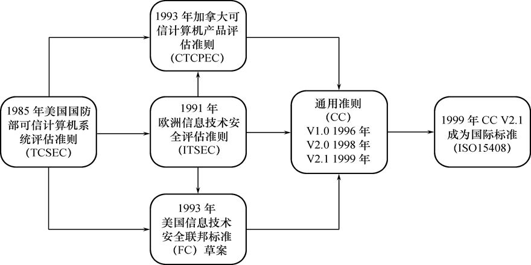
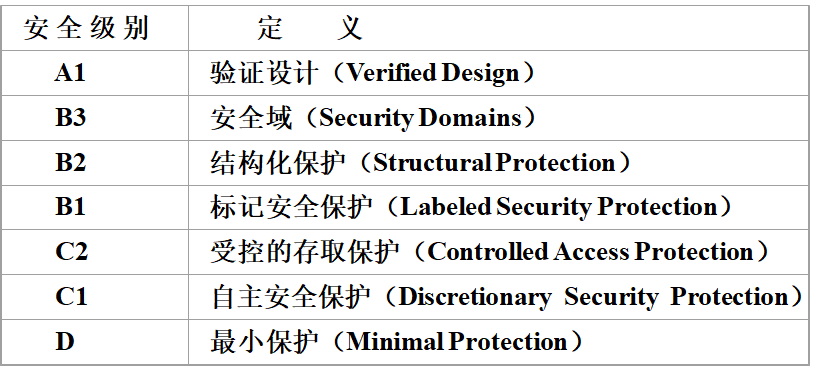
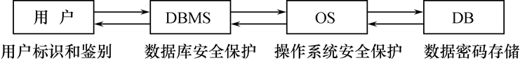
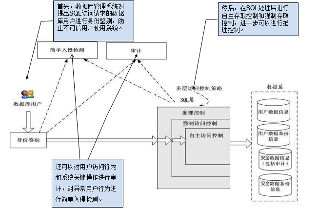
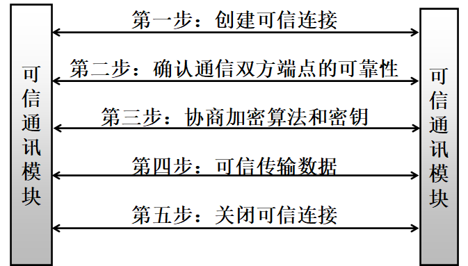

# 4.1 数据库安全性概述

## 4.1.1 数据库的不安全因素

### 1.非授权用户对数据库的恶意存取和破坏

一些黑客（Hacker）和犯罪分子在用户存取数据库时猎取用户名和用户口令，然后假冒合法用户偷取、修改甚至破坏用户数据。数据库管理系统提供的安全措施主要包括用户身份鉴别、存取控制和视图等技术。

### 2.数据库中重要或敏感的数据被泄露

黑客和敌对分子千方百计盗窃数据库中的重要数据，一些机密信息被暴露。为防止数据泄露，数据库管理系统提供的主要技术有**强制存取控制、数据加密存储和加密传输**等，同时部分安全性要求高的部门提供**审计日志分析**。

### 3.安全环境的脆弱性

数据库的安全性与计算机系统的安全性紧密联系。计算机硬件、操作系统、网络系统等的安全性脆弱。建立了一套可信（Trusted）计算机系统的概念和标准。

## 4.1.2 安全标准简介



### 1\. TCSEC/TDI安全级别划分



- D级：将一切不符合更高标准的系统均归于D组，典型例子：DOS是安全标准为D的操作系统
- C1级：非常初级的自主安全保护，能够实现对用户和数据的分离，进行自主存取控制（DAC），保护或限制用户权限的传播。现有的商业系统稍作改进即可满足。
- C2级：安全产品的最低档次，提供受控的存取保护，将C1级的DAC进一步细化，以个人身份注册负责，并实施审计和资源隔离。达到C2级的产品在其名称中往往不突出“安全”（Security）这一特色。典型例子： Windows 2000，Oracle 7。
- B1级：标记安全保护。“安全”（Security）或“可信的” （Trusted）产品。对系统的数据加以标记，对标记的主体和客体实施强制存取控制（MAC）、审计等安全机制。B1级典型例子：惠普公司的HP-UX BLS release 9.09+ ，Oracle公司的Trusted Oracle 7，Sybase公司的Secure SQL Server version 11.0.6。
- B2级：结构化保护，建立形式化的安全策略模型并对系统内的所有主体和客体实施DAC和MAC
- B3级：安全域，该级的TCB必须满足访问监控器的要求，审计跟踪能力更强，并提供系统恢复过程
- A1级：验证设计，即提供B3级保护的同时给出系统的形式化设计说明和验证以确信各安全保护真正实现。

### 2\. CC标准

提出国际公认的表述信息技术安全性的结构，把信息产品的安全要求分为：安全功能要求、安全保证要求。


# 4.2 数据库安全性控制

非法使用数据库的情况：

- 编写合法程序绕过数据库管理系统及其授权机制
  
- 直接或编写应用程序执行非授权操作
  
- 通过多次合法查询数据库从中推导出一些保密数据
  

计算机系统中，安全措施是一级一级层层设置：




– 系统根据用户标识鉴定用户身份，合法用户才准许进入计算机系统

- 数据库管理系统还要进行存取控制，只允许用户执行合法操作
  
- 操作系统有自己的保护措施
  
- 数据以密码形式存储到数据库中
  



数据库安全性控制的常用方法：用户标识和鉴定、存取控制、视图、审计、数据加密

## 4.2.1 用户身份鉴别

这是系统提供的**最外层**安全保护措施，**用户标识：**由用户名和用户标识号组成（用户标识号在系统整个生命周期内唯一）

**用户身份鉴别的方法：**

1. 静态口令鉴别：静态口令一般由用户自己设定，这些口令是静态不变的
  
2. 动态口令鉴别：口令是动态变化的，每次鉴别时均需使用动态产生的新口令登录数据库管理系统，即采用一次一密的方法
  
3. 生物特征鉴别：通过生物特征进行认证的技术，生物特征如指纹、虹膜和掌纹等
  
4. 智能卡鉴别：智能卡是一种不可复制的硬件，内置集成电路的芯片，具有硬件加密功能
  

## 4.2.2 存取控制

数据库安全最重要的一点是确保只授权给有资格的用户访问数据库的权限，同时令所有未被授权的人员无法接近数据，通过存取控制机制实现。

### 1\. 存取控制机制组成

**定义用户权限，并将用户权限登记到数据字典中**

- 用户对某一数据对象的操作权力称为权限
  
- DBMS提供适当的语言来定义用户权限，存放在数据字典中，称做安全规则或授权规则
  

**合法权限检查**

- 用户发出存取数据库操作请求
  
- DBMS查找数据字典，进行合法权限检查
  

### 2\. 常用存取控制方法

- 自主存取控制（Discretionary Access Control ，简称DAC）：
  
    C2级，用户对不同的数据对象有不同的存取权限，不同的用户对同一对象也有不同的权限，用户还可将其拥有的存取权限转授给其他用户。
    
- 强制存取控制（Mandatory Access Control，简称 MAC）：
  
    B1级，每一个数据对象被标以一定的密级，每一个用户也被授予某一个级别的许可证，对于任意一个对象，只有具有合法许可证的用户才可以存取。
    

## 4.2.3 自主存取控制方法

通过 SQL 的`GRANT` 语句和`REVOKE` 语句实现

**用户权限组成：**数据对象 + 操作类型

定义用户存取权限：定义用户可以在哪些数据库对象进行哪些类的操作，定义存取权限称为**授权**。


## 4.2.4 授权：授予与回收

### 1.GRANT

GRANT语句的一般格式：

```sql
GRANT <权限>[,<权限>]...   ON <对象类型> <对象名>[,<对象类型> <对象名>]…  TO <用户>[,<用户>]...[WITH GRANT OPTION];
```

**语义：**将对指定操作对象的指定操作权限授予指定的用户

可以发出GRANT的用户：数据库管理员，数据库对象创建者（即属主Owner），拥有该权限的用户

受权限的用户：一个或多个具体用户，PUBLIC（即全体用户）

`WITH GRANT OPTION` 子句：指定后表示获得该限权的用户可以再授予权限个其他用户，注意不允许循环授权。

\[例4.1\] 把查询Student表权限授给用户U1

```sql
GRANT  SELECTON  TABLE  StudentTO  U1;
```

\[例4.2\] 把对Student表和Course表的全部权限授予用户U2和U3

```sql
GRANT ALL PRIVILIGESON TABLE Student,CourseTO U2,U3;
```

\[例4.3\] 把对表SC的查询权限授予所有用户

```sql
GRANT SELECT ON TABLE SC TO PUBLIC;
```

\[例4.4\] 把查询Student表和修改学生学号的权限授给用户U4

```sql
GRANT UPDATE(Sno), SELECT ON TABLE Student TO U4;-- 对属性列的授权时必须明确指出相应属性列名
```

\[例4.5\] 把对表SC的INSERT权限授予U5用户，并允许他再将此权限授予其他用户

```sql
GRANT INSERT ON TABLE SC TO U5WITH GRANT OPTION;-- U5不仅拥有了对表SC的INSERT权限，还可以传播此权限
```

### 2.REVOKE

授予的权限可以由数据库管理员或其他授权者用`REVOKE`语句收回

REVOKE语句的一般格式为：

```sql
REVOKE <权限>[,<权限>]... ON <对象类型> <对象名>[,<对象类型><对象名>]…FROM <用户>[,<用户>]...[CASCADE | RESTRICT];
```

\[例4.8\] 把用户U4修改学生学号的权限收回

```sql
REVOKE UPDATE(Sno)ON TABLE Student FROM U4;
```

\[例4.9\] 收回所有用户对表SC的查询权限

```sql
REVOKE SELECT ON TABLE SC FROM PUBLIC;
```

\[例4.10\] 把用户U5对SC表的INSERT权限收回,此时U5传播授权给了U6，U6传播给了U7

```sql
REVOKE INSERT ON TABLE SC FROM U5 CASCADE ;-- 将用户U5的INSERT权限收回的时候应该使用CASCADE，否则拒绝执行该语句 -- 如果U6或U7还从其他用户处获得对SC表的INSERT权限，则他们仍具有此权限，系统只收回直接或间接从U5处获得的权限 
```

### 3.创建数据库模式的权限

数据库管理员在创建用户时实现

CREATE USER语句格式：

```sql
CREATE  USER  <username> [WITH][DBA|RESOURCE|CONNECT];
```

- 只有系统的超级用户才有权创建一个新的数据库用户
  
- 新创建的数据库用户有三种权限：CONNECT、RESOURCE和DBA
  
- 如没有指定创建的新用户的权限，默认该用户拥有CONNECT权限。拥有CONNECT权限的用户不能创建新用户，不能创建模式，也不能创建基本表，只能登录数据库
  
- 拥有RESOURCE权限的用户能创建基本表和视图，成为所创建对象的属主。但不能创建模式，不能创建新的用户
- 拥有DBA权限的用户是系统中的超级用户，可以创建新的用户、创建模式、创建基本表和视图等；DBA拥有对所有数据库对象的存取权限，还可以把这些权限授予一般用户


## 4.2.5 数据库角色

数据库角色：被命名的一组与数据库操作相关的权限，角色是权限的集合，可以为一组具有相同权限的用户创建一个角色，简化授权的过程。

### 1.角色的创建

```sql
CREATE ROLE <角色名>
```

### 2.给角色授权

```sql
GRANT <权限>[,<权限>]…ON <对象类型>对象名 TO <角色>[,<角色>]…
```

### 3.将一个角色授予其他的角色或用户

```sql
GRANT <角色1>[,<角色2>]…TO <角色3>[,<用户1>]…[WITH ADMIN OPTION]
```

该语句把角色授予某用户，或授予另一个角色

授予者是角色的创建者或拥有在这个角色上的ADMIN OPTION

指定了WITH ADMIN OPTION则获得某种权限的角色或用户还可以把这种权限授予其他角色

一个角色的权限：直接授予这个角色的全部权限加上其他角色授予这个角色的全部权限

### 4.角色权限的收回

```sql
REVOKE <权限>[,<权限>]…ON <对象类型> <对象名>FROM <角色>[,<角色>]…
```

用户可以回收角色的权限，从而修改角色拥有的权限

REVOKE执行者是：角色的创建者，拥有在这个（些）角色上的ADMIN OPTION

\[例4.11\] 通过角色来实现将一组权限授予一个用户。

步骤如下：

（1）首先创建一个角色 R1

```sql
CREATE ROLE R1;
```

（2）然后使用GRANT语句，使角色R1拥有Student表的 SELECT、UPDATE、INSERT权限

```sql
GRANT SELECT, UPDATE, INSERT ON TABLE Student TO R1;
```

（3）将这个角色授予王平，张明，赵玲。使他们具有角色R1所包含的全部权限

```sql
GRANT R1 TO 王平,张明,赵玲;
```

（4） 可以一次性通过R1来回收王平的这3个权限

```sql
REVOKE R1 FROM 王平;
```

## 4.2.6 强制存取控制方法

自主存取控制可能存在数据的“无意泄露”

原因：这种机制仅仅通过对数据的存取权限来进行安全控制，而数据本身并无安全性标记

解决：对系统控制下的所有主体、客体实施强制存取控制策略

强制存取控制（MAC）：保证更高程度的安全性，用户不能直接感知或进行控制，适用于对数据有严格而固定密级分类的部门，如军事部门和政府部门。

在强制存取控制中，数据库管理系统所管理的全部实体被分为主体和客体两大类：

- 主体是系统中的活动实体：数据库管理系统所管理的实际用户，代表用户的各进程
  
- 客体是系统中的被动实体，受主体操纵：文件、基本表、索引、视图
  

**敏感度标记（Label）：**

对于主体和客体，DBMS为它们每个实例（值）指派一个敏感度标记（Label）

敏感度标记分成若干级别：

- 绝密（Top Secret，TS）
  
- 机密（Secret，S）
  
- 可信（Confidential，C）
  
- 公开（Public，P）
  

主体的敏感度标记称为许可证级别（Clearance Level）

客体的敏感度标记称为密级（Classification Level）

**强制存取控制规则**

（1）仅当主体的许可证级别大于或等于客体的密级时，该主体才能读取相应的客体

（2）仅当主体的许可证级别小于或等于客体的密级时，该主体才能写相应的客体

强制存取控制（MAC）是对数据本身进行密级标记，无论数据如何复制，标记与数据是一个不可分的整体，只有符合密级标记要求的用户才可以操纵数据。

实现强制存取控制时要首先实现自主存取控制

原因：较高安全性级别提供的安全保护要包含较低级别的所有保护

自主存取控制与强制存取控制共同构成数据库管理系统的安全机制

# 4.3 视图机制

把要保密的数据对无权存取这些数据的用户隐藏起来，对数据提供一定程度的安全保护，间接地实现支持存取谓词的用户权限定义。

\[例4.14\] 建立计算机系学生的视图，把对该视图的SELECT权限授于王平，把该视图上的所有操作权限授于张明

```sql
-- 先建立计算机系学生的视图CS_StudentCREATE VIEW CS_StudentAS SELECT *FROM  StudentWHERE Sdept='CS';-- 在视图上进一步定义存取权限GRANT  SELECTON  CS_Student  TO 王平; GRANT ALL PRIVILIGESON  CS_Student  TO  张明; 
```

# 4.4 审计（Audit）

启用一个专用的审计日志（Audit Log），将用户对数据库的所有操作记录在上面，审计员利用审计日志，监控数据库中的各种行为，找出非法存取数据的人、时间和内容。C2以上安全级别的DBMS必须具有审计功能。

审计很费时间和空间DBA可以根据应用对安全性的要求，灵活地打开或关闭审计功能，审计功能主要用于安全性要求较高的部门，所以审计功能不是必须存在的。

### 1.审计事件

- 服务器事件：审计数据库服务器发生的事件，包括数据库服务器的启动、停止、配置文件的重新加载。
  
- 系统权限：对系统拥有的结构或模式对象进行操作的审计；要求该操作的权限是通过系统权限获得的。
  
- 语句事件：对SQL语句，如DDL、DML、DQL及DCL语句的审计；
  
- 模式对象事件：对特定模式对象上进行的SELECT或DML操作的审计 ；
  
    模式对象包括表、视图、存储过程、函数等，不包括依附于表的索引、约束、触发器等。
    

### 2.审计功能

基本功能：提供多种审计查阅方式

多套审计规则：一般在初始化设定

提供审计分析和报表功能

审计日志管理功能：

- 防止审计员误删审计记录，审计日志必须先转储后删除
  
- 对转储的审计记录文件提供完整性和保密性保护
  
- 只允许审计员查阅和转储审计记录，不允许任何用户新增和修改审计记录等
  

提供查询审计设置及审计记录信息的专门视图

### 3\. AUDIT语句和NOAUDIT语句

AUDIT语句：设置审计功能

NOAUDIT语句：取消审计功能

- 用户级审计：任何用户可设置的审计，主要是用户针对自己创建的数据库表和视图进行审计。
  
- 系统级审计：只能由数据库管理员设置，监测成功或失败的登录要求、监测授权和收回操作以及其他数据库级权限下的操作。
  

\[例4.15\] 对修改SC表结构或修改SC表数据的操作进行审计

```sql
AUDIT ALTER, UPDATE ON SC;
```

\[例4.16\] 取消对SC表的一切审计

```sql
NOAUDIT ALTER, UPDATE ON SC;
```

# 4.5 数据加密

数据加密：防止数据库中数据在存储和传输中失密的有效手段

加密的基本思想：根据一定的算法将原始数据—明文（Plain text）变换为不可直接识别的格式­—密文（Cipher text）

加密方法：存储加密和传输加密

### 1\. 存储加密

- 透明存储加密：内核级加密保护方式，对用户完全透明
    - 将数据在写到磁盘时对数据进行加密，授权用户读取数据时再对其进行解密
    - 数据库的应用程序不需要做任何修改，只需在创建表语句中说明需加密的字段即可
    - 内核级加密方法: 性能较好，安全完备性较高
- 非透明存储加密：通过多个加密函数实现
  

### 2\. 传输加密

- 链路加密：在链路层进行加密，传输信息由报头和报文两部分组成，报文和报头均加密
  
- 端到端加密：在发送端加密，接收端解密，只加密报文不加密报头，所需密码设备数量相对较少，容易被非法监听者发现并从中获取敏感信息
  

### 3\. 数据库管理系统可信传输



- 确认通信双方端点的可靠性
    - 采用基于数字证书的服务器和客户端认证方式
    - 通信时均首先向对方提供己方证书，然后使用本地的CA 信任列表和证书撤销列表对接收到的对方证书进行验证
- 协商加密算法和密钥
    - 确认双方端点的可靠性后，通信双方协商本次会话的加密算法与密钥
- 可信数据传输
    - 业务数据在被发送之前将被用某一组特定的密钥进行加密和消息摘要计算，以密文形式在网络上传输
    - 当业务数据被接收的时候，需用相同一组特定的密钥进行解密和摘要计算

# 4.6 其他安全性保护

**推理控制：**

- 处理强制存取控制未解决的问题
  
- 避免用户利用能够访问的数据推知更高密级的数据
  
- 常用方法：基于函数依赖的推理控制，基于敏感关联的推理控制
  

**隐蔽信道：**

处理强制存取控制未解决的问题

**数据隐私保护：**

- 描述个人控制其不愿他人知道或他人不便知道的个人数据的能力
  
- 范围很广：数据收集、数据存储、数据处理和数据发布等各个阶段