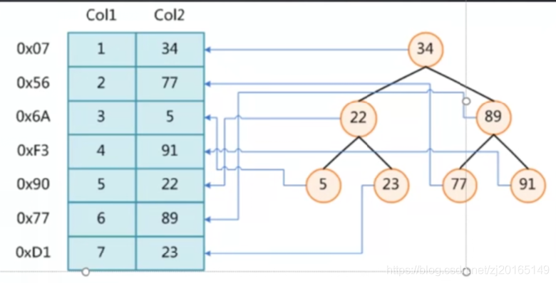
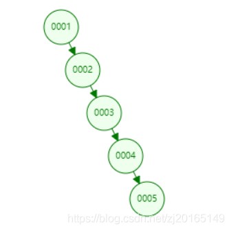
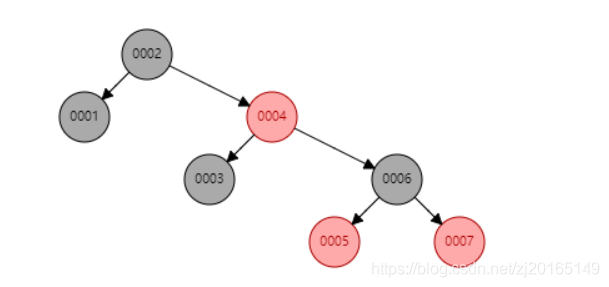
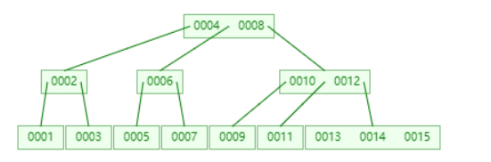
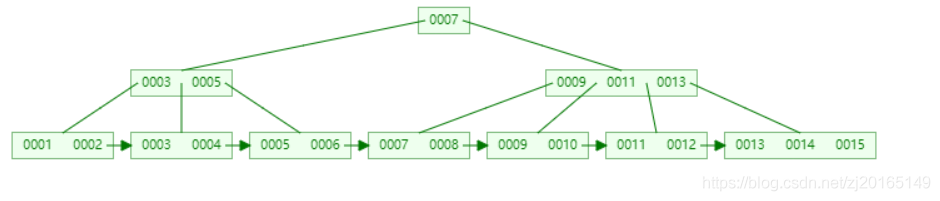
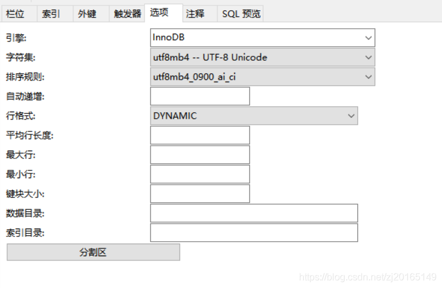
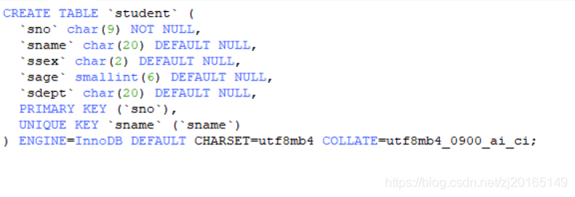

## 索引的本质

[嘤嘤怪QQQ](https://blog.csdn.net/zj20165149)  于 2020-02-14 21:26:49 发布  68  收藏

版权声明：本文为博主原创文章，遵循 [CC 4.0 BY-SA](http://creativecommons.org/licenses/by-sa/4.0/) 版权协议，转载请附上原文出处链接和本声明。

## 索引的本质

[mysql如何创建索引？？？](https://blog.csdn.net/qq_36098284/article/details/79841094?utm_source=distribute.pc_relevant.none-task)

索引是帮助mysql高效获取数据的排好序的数据结构==  
索引数据结构：hash表、b树。  
  
假设没有索引那么查找<6,89>需要从头开始查找。  
而现在我们在col2列加上索引（假设索引存放在二叉树中,二叉树节点是<key,value>)，而查找时恰好用索引 ，可以大大提高查找速度。  
<89.89这条记录的磁盘文件地址指针>

二叉树会有些弊端，mysql不采用二叉树，一般采用hash表、b树。  
例如一次向二叉搜索树中插入1，2，3，4，5，  
  
退化成了链表

那么红黑树呢？？  
红黑树【1，2，3，4，5，6, 7】  
【红黑树是二叉平衡树的优化】  
  
红黑树存储索引也有些问题  
在数据量大的时候（树的高度也很多)，也有问题

那怎么控制高度呢？？  
b树  
最大度为4  

b+树  
最大度为4  

mysql底层最终选择的是b+树  
**为什么要把数据元素都移动到叶子中呢？搞一堆冗余索引呢？？**  
把数据都移动到叶子节点就可以横向存储更多地元素，分叉 就更多了。  
一般mysql的主键索引是bigint型的，8字节。

那有人会抬杠，为什么不把数据放在一个节点中呢，这样不是更快。 那么问题来了，内存没那么大！！！并且每次磁盘和内存的交换的数据是有个最大限度的。冗余

mysql对一个节点大小的设置是16k。

mysql存储引擎  
  
（1）MyISAM  
  
（2)InnoDB

  
主键索引的b+树叶子节点存储整个数据  
非主键索引的b+树叶子节点存储主键值。

存储引擎是形容表的  
  

**聚集索引**  
聚集索引是指数据库表行中数据的物理顺序与键值的逻辑（索引）顺序相同。  
【叶子节点包含完整的数据记录。】

面试题  
为什么InnoDB必须要有主键？  
底层结构要求  
自己没有建立主键，InnoDB会给自动选择一个字段作为索引。那要是选不出来唯一的怎么办？InnoDB后自动生成一个类似于rowid的字段作为索引。

怎么推荐主键最好是整形或者是自增的？  
因为查询时需要比较索引，而整型比较操作快，并且整型存储空间小。

hash一次读盘，比b+树要快的多。。那为什么99.9%的底层使用的是b+树呢？  
因为在范围查找中 hash就没有用途了。b+可以很好的支持范围查找(因为b+树叶子节点从左到右依次递增，节点间还有指针，就支持范围查找了。b树不支持）

联合索引的底层数据结构什么样子呢？？？  
索引最左前缀原理  
例如（a，b，c）联合索引，先比较a，再比较b，再比较c 通过这种方式建立b+树  
