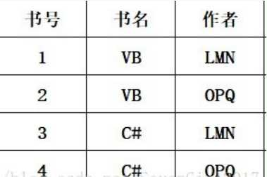

# 6.1 问题的提出

数据库有“三个从无到有”，其中第一个就是数据库模式的从无到有，针对一个具体问题，如何构造一个适合的数据库模式是建立数据库系统很基本的问题，这是数据库的设计问题，确切的说是关系数据库逻辑设计问题，我们有一个有利工具：**关系数据库的规范化理论。**

## 6.1.1 概念回顾

### 1\. 关系模式的表示

关系模式的表示：五元组 R(U,D,DOM,F)

- 关系名 R 是**符号化**的元组语义。
- U 为一组属性。
- D 为属性组 U 中的属性所来自的域（即取值范围）。
- DOM 为属性到域的映射（即具体的取值）。
- F 为属性组 U 上的一组**数据依赖**。

由于 D 和 DOM 与模式设计关系不大，可以把关系模式看做三元组： R<U,F\>，当且仅当 U 上的一个关系 r 满足 F 时， r 称为关系模式 R<U,F\> 的一个关系。

### 2\. 数据依赖

**数据依赖：** 一个关系内部属性与属性之间的约束关系，现实世界属间相互联系的抽象，数据内在的性质，**语义的体现**（表示的谁可以决定谁的关系，是由现实世界决定的关系，比如身份证号确定一个人的其他属性，这是有现实语义决定的）。

主要有两类数据依赖：  
**函数依赖（Functional Dependency，简记为FD）  
多值依赖（Multivalued Dependency，简记为MVD）**

### 3.好的关系模式

不会发生插入异常、删除异常、更新异常，数据冗余应尽可能少。

**例：**

如图的关系模式中，涉及的对象包括学生的学号（Sno）、所在系（Sdept）系主任姓名（Mname）、课程名（Cname）、成绩（Grade）

- 数据冗余  
    比如，每一个系的系主任姓名重复出现，重复次数与该系所有学生的所有课程成绩出现次数相同，如表6.1所示。这将浪费大量的存储空间。
- 更新异常（update anomalies）  
    由于数据冗余，当更新数据库中的数据时，系统要付出很大的代价来维护数据库的完整性,否则会面临数据不一致的危险。比如,某系更换系主任后,必须修改与该系学生有关的每一个元组。
- 插入异常（insertion anomalies）  
    如果一个系刚成立,尚无学生，则无法把这个系及其系主任的信息存入数据库
- 删除异常（deletion anomalies）  
    如果某个系的学生全部毕业了，则在删除该系学生信息的同时，这个系及其系主任的信息也丢掉了。

> 上述的关系模式不是一个好的关系模式。这是由存在于模式中的某些数据依赖引起的，可以通过**分解关系模式**来消除其中不合适的数据依赖。

# 6.2 规范化

**规范化理论**正是用来改造关系模式，通过**分解关系模式**来消除其中不合适的数据依赖，以解决插入异常、删除异常、更新异常和数据冗余问题。

## 6.2.1 函数依赖

### 1\. 定义

**函数依赖的定义：** 设 R(U) 是一个属性集U上的关系模式， X 和 Y 是 U 的子集。若对于 R(U) 的任意一个可能的关系 r ，**r 中不可能存在两个元组在 X 上的属性值相等， 而在 Y 上的属性值不等**， 则称 “ X 函数确定 Y ” 或 “ Y 函数依赖于 X ”，记作 X→Y。（就是一个X只能对应一个Y）

若X→Y，则X称为这个函数依赖的决定属性组，也称为**决定因素**。  
若X→Y，Y→X，则记作 X←→Y。  
若Y不函数依赖于X，则记作 X↛Y。

语义范畴的概念，只能根据语义来确定，但是数据库设计者可以对现实世界作强制的规定（如用名字->年龄，同时强制规定不会有同名人），并且 这是**所有关系实例**均要满足的约束条件。

### 2\. 类型

**平凡的函数依赖：** 如果 X→Y ，但 y⊆x ，则称 X→Y 是非平凡的函数依赖。（Y本来就是X的一部分，所以X当然可以决定Y，这是很“平凡的”）  
**非平凡的函数依赖：** 若 X→Y ，但 y⊈x , 则称 X→Y 是平凡的函数依赖。（Y与X没关系，但是X却能决定Y，这很“不平凡”）

对于任一关系模式，平凡函数依赖必然成立（X的子集肯定是X的平凡的函数依赖），所以如果不特别声明，总是讨论非平凡的函数依赖。

**完全函数依赖:** 在 R(U) 中，如果 X→Y ，并且对于 X 的任何一个真子集 X’ ，都有 X′↛Y, 则称 Y 对 X 完全函数依赖，记作 X→FY **(F = full)**。（X的全部一起表示一个Y）

**部分函数依赖:** 若 X→Y ，但 Y 不完全函数依赖于 X ，则称 Y 对 X 部分函数依赖，记作X→PY **(P = part)**。（X的一部分就可以表示Y了，如学号->姓名，（学号，身份证号）->姓名，后者就是一个部分函数依赖）

**传递函数依赖：** 在 R(U) 中，如果 X→Y ，(Y⊈X), Y⊈X ,Y→Z， 则称 Z 对 X 传递函数依赖。  
记为：传递X→传递Z

## 6.2.2 码

**定义：** 设 K 为 R<U,F> 中的属性或属性组合。若 K→FU， 则 K 称为 R 的侯选码（Candidate Key）。若候选码多于一个，则选定其中的一个做为**主码**（Primary Key）。

包含在**任何一个候选码中**的属性 ，称为**主属性**（Prime attribute）（不一定是主码中的属性）,不包含在任何码中的属性称为**非主属性**（Nonprime attribute）或**非码属性**（Non-key attribute）。

整个属性组是码，称为**全码（All-key）**

关系模式 R 中属性或属性组X 并非 R的码，但 X 是另一个关系模式的码，则称 X 是R 的外部码（Foreign key）也称**外码**。主码与外部码一起提供了表示关系间联系的手段。

## 6.2.3 范式

关系数据库中的关系必须满足一定的要求，满足不同程度要求的为不同范式。

**第一范式(1NF)：** 每一个分量必须是不可分的数据项，第一范式是对关系模式的最起码的要求。不满足第一范式的数据库模式不能称为关系数据库

一个低一级范式的关系模式，通过**模式分解**可以转换为若干个高一级范式的关系模式的集合，这种过程就叫**规范化**。

## 6.2.4 2NF

若R∈1NF，且每一个非主属性完全函数依赖于任何一个候选码，则R∈2NF，**消除部分函数依赖**。（⼀个表中只能保存⼀种数据，不可以把多种数据保存在同⼀张数据库表中）

采用投影分解法将一个1NF的关系分解为多个2NF的关系，可以在一定程度上减轻原1NF关系中存在的插入异常、删除异常、数据冗余度大、修改复杂等问题。

将一个1NF关系分解为多个2NF的关系，并不能完全消除关系模式中的各种异常情况和数据冗余。

如图的表中商品名称、单位、商品价格等信息不与该表的主键相关，而仅仅是与商品编号相关。所以在这⾥违反了第⼆范式的设计原则。

拆分后：  

## 6.2.5 3NF

关系模式 R<U，F> 中若不存在这样的码 X 、属性组 Y 及非主属性 Z （Z⊈Y）, 使得X→Y，Y→Z成立，Y⊈X ，则称 R<U，F> ∈ 3NF， **消除非主属性对码的传递依赖**。

若R∈3NF，则每一个非主属性既不部分依赖于码也不传递依赖于码。

⽐如在设计⼀个订单数据表的时候，可以将客户编号作为⼀个外键和订单表建⽴相应的关系。⽽不可以在订单表中添加关于客户其它信息（⽐如姓名、所属公司等）的字段。

## 6.2.6 BCNF

关系模式 R<U，F>∈1NF，若X→Y且 Y⊈X 时 X 必含有码，则 R<U，F>∈BCNF。**排除码内的传递依赖和部分依赖。**

等价于：每一个决定属性因素都包含码。

判断方法：  
所有非主属性对每一个码都是完全函数依赖。  
所有的主属性对每一个不包含它的码，也是完全函数依赖。  
没有任何属性完全函数依赖于非码的任何一组属性。

存在关系：  
书号→书名  
(书名、作者)→书号  
上述关系存在传递依赖，不能是BCNF

## 6.2.7 多值依赖

### 1.定义

设R(U)是一个属性集U上的一个关系模式， X、 Y和Z是U的子集，并且Z＝U－X－Y。关系模式R(U)中多值依赖 X→→Y成立，当且仅当对R(U)的任一关系r，给定的一对（x，z）值，有一组Y的值，这组值仅仅决定于x值而与z值无关。

若X→→Y，而Z＝φ，则称X→→Y为**平凡的多值依赖**，否则称X→→Y为**非平凡的多值依赖**

### 2.性质

（1）多值依赖具有对称性：若X→→Y，则X→→Z，其中Z＝U－X－Y  
（2）多值依赖具有传递性：若X→→Y，Y→→Z， 则X→→Z – Y  
（3）函数依赖是多值依赖的特殊情况：若X→Y，则X→→Y。  
（4）若X→→Y，X→→Z，则X→→Y ∪ Z。  
（5）若X→→Y，X→→Z，则X→→Y ∩ Z。  
（6）若X→→Y，X→→Z，则X→→Y-Z，X→→Z – Y

### 3.多值依赖于函数依赖的区别

(1) 多值依赖的有效性与属性集的范围有关  
(2) 若函数依赖X→Y在R（U）上成立，则对于任何Y′⊂Y均有X→Y’ 成立多值依赖X→→Y若在R(U)上成立，不能断言对于任何Y′⊂Y 有X→→Y’ 成立

## 6.2.8 4NF

关系模式R<U，F>∈1NF，如果对于R的每个非平凡多值依赖X→→Y（Y ∉ X），X都含有码，则R∈4NF。

不允许有非平凡且非函数依赖的多值依赖。  
允许的非平凡多值依赖是函数依赖。

## 6.2.9 规范化小结

关系数据库的规范化理论是数据库逻辑设计的工具。

目的：尽量消除插入、删除异常，修改复杂，数据冗余

基本思想：逐步消除数据依赖中不合适的部分

实质：概念的**单一化**

**例题：**

# 6.3 数据依赖的公理系统

## 6.3.1 蕴含及推理规则

**逻辑蕴含：**  
设有关系模式R(U)及其函数依赖集F，如果对于R的任一个满足F的关系r函数依赖X→Y都成立，则称F逻辑蕴涵X→Y，或称X→Y可以由F推出。如：关系模式 R=(A,B,C),函数依赖集F={A→B,B→C}, F逻辑蕴涵A→C。

**闭包:** 在关系模式R<U，F>中为F所逻辑蕴含的函数依赖的全体叫作 F 的闭包，记为 F+，就是由关系模式R直观得到的函数依赖F所推出的所有隐含的或未隐含的(直观的)函数依赖的集合。

F={X->A1, …… , X->An}的闭包 F+ 计算是一个NP完全问题。（理论证明可求，但是在有限时间内无法求得的问题）。

对关系模式R <U，F >来说有以下的**推理规则**：

**自反律（Reflexivity）：** 若Y‘⊆X‘⊆U，则 X →Y 为 F 所蕴含（平凡函数依赖）。（大推小）

**增广律（Augmentation）：** 若 X→Y 为 F 所蕴含，且Z′⊆U ，则 XZ→YZ 为 F 所蕴含。(加了也不影响)

**传递律（Transitivity）：** 若 X→Y 及 Y→Z 为 F 所蕴含，则 X→Z 为 F 所蕴含（传递函数依赖）。(一传十十传百)

根据上述规则推得的**导出规则：**

**合并规则：** 由X→Y，X→Z，有X→YZ。(合并右边)

**伪传递规则：** 由X→Y，WY→Z，有XW→Z。(左边加一点)

**分解规则：** 由X→Y及 Z⊆Y，有X→Z。(分解右边)

## 6.3.2 Armstrong公理系统

### 1.属性闭包及引理

设F为属性集U上的一组函数依赖，X⊆U， XF+ ={ A|X→A能由F 根据Armstrong公理导出}，XF+称为**属性集X关于函数依赖集F的闭包。**

> 区分 闭包 和 属性（集）闭包：  
> 闭包指的是 F 的闭包，该集合包含的元素是函数依赖。  
> 属性集闭包是 X 属性(集) 关于 F 的属性（集）闭包，该集合包含的元素是属性。

**引理：** 若从 F 这个函数依赖集合中可以用 Armstrong 公理导出 X→Y，当且仅当 Y⊆XF+

解释：如果 Y 这个属性 在 X 关于 F 的属性(集)闭包中，那么 X→Y 就在 F 中，若 F 中存在 X 决定 Y，那 Y 一定在 X 关于 F 的属性(集)闭包中。

### 2.Armstrong公理系统的有效性与完备性

人们把自反律、传递律、增广率称为Armstrong公理系统，Armstrong公理系统是有效的、完备的。

**有效性：** 由 F 出发根据Armstrong公理推导出来的每一个函数依赖一定在 F+ 中；  
**完备性：** F+中的每一个函数依赖，必定可以由F出发根据Armstrong公理推导出来

### 3.覆盖及最小覆盖

定义：对 R(U) 上的两个函数依赖集合 F、G，如果 F+\=G+，则称 F 和 G 也是等价的，也称作 F 覆盖 G 或者 G 覆盖 F。

**引理：**  

**最小覆盖：**  
如果函数依赖集F满足下列条件，则称F为一个极小函数依赖集。亦称为最小依赖集或最小覆盖。

- F中任一函数依赖的右部仅含有一个属性。（删去右边多余的）
- F中不存在这样的函数依赖X→A，使得F与F-{X→A}等价（删去冗余的函数依赖，即不存在删去某个函数依赖后被删去的还能被剩下的函数依赖推出）。
- F中不存在这样的函数依赖X→A， X有真子集Z使得F-{X→A}∪{Z→A}与F等价（每个函数依赖的左边没有冗余的属性）。问：是否等价于不存在部分依赖？答：对的。

### 4\. 极小化过程

每一个函数依赖集F均等价于一个极小函数依赖集 Fm。此Fm称为F的最小依赖集。

问：啥意思？  
答：就是说，F中的所有函数依赖都可以通过 Fm 来显式或者隐式地推得，所以两者是等价的。

**具体过程：**  

**例子：**

### 5.求解关系模式的候选码

- **属性分类**：
    - L类：只出现在函数依赖的左边的属性
    - R类：只出现在函数依赖的右边的属性
    - N类：在函数依赖的两边均未出现的属性
    - LR类：出现在函数依赖的两边的属性
- **对于给定的关系模式R及其函数依赖集F：**
    - 如果X是L或N类属性，则X必为R的任一候选码的成员
    - 如果X是R类属性，则X必不在任何候选码中
    - 如果X是L和N类组成的属性组，且X+包含了全部属性，则X是R的唯一候选码
    - 如果X是LR类，则不一定，需要求闭包来判断

**例子：**  
R<U,F> ,U(A,B,C,D,E,G) , F={AB–>C,CD–>E,E–>A,A–>G) ,求候选码:

B⼀定是候选码 D⼀定是候选码（L类）  
G⼀定不是候选码（R类）  
A不⼀定 C不⼀定 E不⼀定（LR类）  
BD->啥也推不出来,所以要把每⼀个可能的求闭包  
(BDA)+\= 可推出C E A G 所以可以退出ABCDEG  
(BDC)+\= 可推出 E A G 所以可以退出ABCDEG  
(BDE)+\= 可退出 A G C 所以可以推出ABCDEG  
那么么他的候选码最终是{ (BDA),(BDC),(BDE) };

问：求候选码和上面的极小化过程有啥关系？？  
答：无直接联系，极小化过程主要目的是减少数据的冗余，而求候选码只是针对某个关系模式求解其候选码，一般来说先极小化后再求候选码，但也可以直接求候选码。