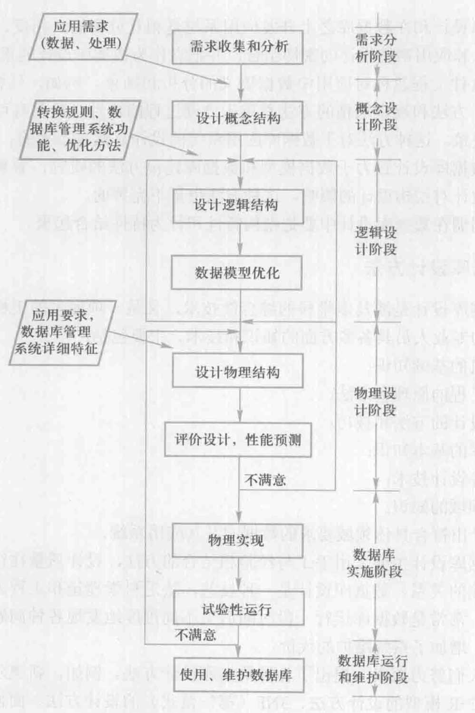
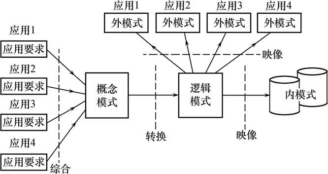
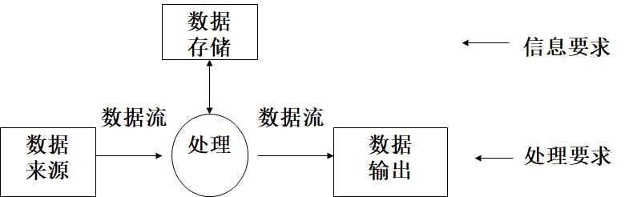
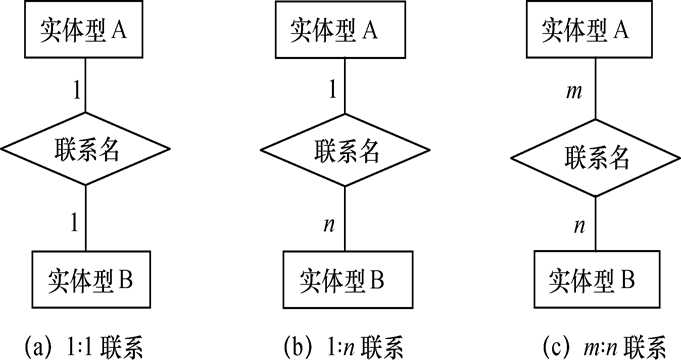
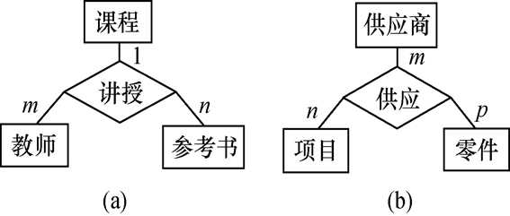
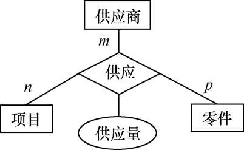
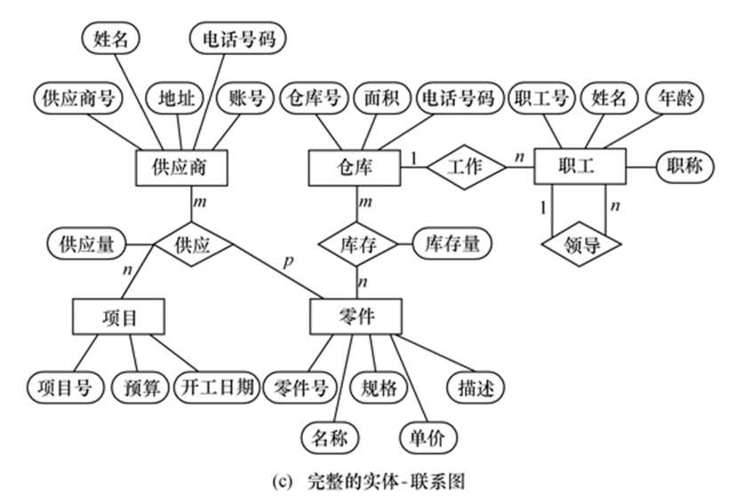

# 7.1 数据库设计概述

**数据库设计：**

- 广义地讲，设计整个数据库应用系统。
- 侠义地讲，是指设计数据库本身。
- 一般性定义：数据库设计是指对于一个给定的应用环境，构造（设计）优化的数据库逻辑模式和物理结构，并据此建立数据库及其应用系统，使之能够有效地存储和管理数据，满足各种用户的应用需求，包括**信息管理要求**和**数据操作要求**。
    - 信息管理要求：在数据库中应该存储和管理哪些数据对象 。
    - 数据操作要求：对数据对象需要进行哪些操作，如查询、增、删、改、统计等操作。
- 设计目的：数据库设计的目标是为用户和各种应用系统提供一个信息基础设施和高效率的运行环境 （数据库数据的存取效率高、数据库存储空间的利用率高、数据库系统运行管理的效率高）。
  

## 7.1.1 数据库设计的特点

### 1\. 数据库建设的基本规律

三分技术，七分管理，十二分基础数据。十二分基础数据强调了数据的收集、入库、更新维护是数据库建设中的重要环节。

### 2\. 结构（数据）设计和行为（处理）设计相结合

将数据库结构设计和数据处理设计密切结合

## 7.1.2 数据库设计方法

- 基于E-R模型的设计方法：概念设计阶段广泛采用
- 3NF（第三范式）的设计方法：用关系数据理论为指导来设计数据库的逻辑结构，是逻辑阶段可采用的有效方法
- ODL(Object Definition Language)方法：面向对象的数据库设计方法
- 统一建模语言（UML）方法

## 7.1.3 数据库设计的基本步骤

数据库设计分6个阶段：需求分析、概念结构设计、逻辑结构设计、物理结构设计、数据库实施、数据库运行和维护。

需求分析和概念设计独立于任何数据库管理系统，逻辑设计和物理设计与选用的DBMS密切相关。

[](http://fangkaipeng.com/wp-content/uploads/2021/03/wp_editor_md_4f90068228c12fcb0f7684b5a5709d02.jpg)

## 7.1.4 数据库设计过程中的各级模式

数据库设计不同阶段形成的数据库各级模式

[](http://fangkaipeng.com/wp-content/uploads/2021/03/wp_editor_md_be6a889f9b22505d8c44ee49d2792956.jpg)

# 7.2 需求分析

需求分析就是分析用户的要求，是设计数据库的起点，结果是否准确地反映了用户的实际要求，将直接影响到后面各个阶段的设计，并影响到设计结果是否合理和实用。

## 7.2.1 需求分析的任务

### 1\. 需求分析的重点

- 详细调查现实世界要处理的对象（组织、部门、企业等）
- 充分了解原系统（手工系统或计算机系统）工作概况
- 明确用户的各种需求
- 在此基础上确定新系统的功能
- 新系统必须充分考虑今后可能的扩充和改变

### 2.需求分析的重点

调查的重点是“数据”和“处理”，获得用户对数据库要求。  
1\. 信息要求  
用户需要从数据库中获得信息的内容与性质，由用户的信息要求可以导出数据要求，即在数据库中需要存储哪些数据。  
2\. 处理要求  
用户要完成什么处理功能，对处理的响应时间的要求，对处理方式的要求(批处理 / 联机处理)  
3\. 安全性与完整性要求

### 3\. 需求分析的难点

- 用户缺少计算机知识，不能准确地表达自己的需求，他们所提出的需求往往不断地变化。
- 设计人员缺少用户的专业知识，不易理解用户的真正需求，甚至误解用户的需求

解决方法：设计人员必须不断深入地与用户进行交流，才能逐步确定用户的实际需求。

## 7.2.2 需求分析的方法

### 1.常用调查方法

（1）跟班作业：通过亲身参加业务工作了解业务活动的情况  
（2）开调查会：通过与用户座谈来了解业务活动情况及用户需求  
（3）请专人介绍  
（4）询问：对某些调查中的问题，可以找专人询问  
（5）设计调查表请用户填写：调查表设计合理，则很有效  
（6）查阅记录：查阅与原系统有关的数据记录

### 2\. 分析方法

结构化分析方法（Structured Analysis，简称SA方法），SA方法从最上层的系统组织机构入手，采用自顶向下、逐层分解的方式分析系统。

1. 首先把任何一个系统都抽象为下图所示的形式。

[](http://fangkaipeng.com/wp-content/uploads/2021/03/wp_editor_md_0e4c50088b996618a58556c844e74eb9.jpg)

2. 分解处理功能和数据
    - 将处理功能的具体内容分解为若干子功能，再将每个子功能继续分解，直到把系统的工作过程表达清楚为止。
    - 在处理功能逐步分解的同时，其所用的数据也逐级分解，形成若干层次的数据流图，数据流图表达了数据和处理过程的关系。
    - SA方法中的表达方法  
        处理逻辑：用判定表或判定树来描述  
        数据：用数据字典来描述
3. 将分析结果再次提交给用户，征得用户的认可
  

## 7.2.3 数据字典

- 数据字典是关于数据库中数据的描述，即元数据，不是数据本身
- 数据字典在需求分析阶段建立，在数据库设计过程中不断修改、充实、完善
- 数据字典是进行详细的数据收集和数据分析所获得的主要结果

注意：和关系数据库管理系统中数据字典的区别和联系。  
问：啥区别和联系？

**数据字典的内容：**  
数据项、数据结构、数据流、数据存储、处理过程。

数据项是数据的**最小组成单位**干个数据项可以组成一个数据结构，数据字典通过对数据项和数据结构的定义来描述数据流、数据存储的逻辑内容。

### 1.数据项

**数据项是不可再分的数据单位**

数据项描述＝｛数据项名，数据项含义说明，别名，数据类型，长度，取值范围，取值含义，与其他数据项的逻辑关系，数据项之间的联系 ｝

- 范围、与其他数据项的逻辑关系定义了数据的完整性约束条件，是设计数据检验功能的依据。
- 用关系规范化理论为指导，用数据依赖的概念分析和表示数据项之间的联系。

### 2.数据结构

**结构反映了数据之间的组合关系。**  
一个数据结构可以由若干个数据项组成，也可以由若干个数据结构组成，或由若干个数据项和数据结构混合组成。  
问：啥意思？

数据结构描述＝｛数据结构名，含义说明，组成:｛数据项或数据结构｝｝

### 3.数据流

**数据流是数据结构在系统内传输的路径。**  
数据流描述＝｛数据流名，说明，数据流来源，数据流去向，组成:｛数据结构｝，平均流量，高峰期流量｝

- 数据流来源是说明该数据流来自哪个过程
- 数据流去向是说明该数据流将到哪个过程去
- 平均流量是指在单位时间（每天、每周、每月等）里的传输次数
- 高峰期流量则是指在高峰时期的数据流量

### 4.数据储存

**数据存储是数据结构停留或保存的地方，也是数据流的来源和去向之一。**

数据存储描述＝｛数据存储名，说明，编号，输入的数据流，输出的数据流，组成:｛数据结构｝，数据量，存取频度，存取方式｝

- 输入的数据流：指出数据来源
- 输出的数据流：指出数据去向
- 存取频度：每小时或每天或每周存取几次，每次存取多少数据等信息
- 存取方式：批处理 / 联机处理；检索 / 更新；顺序检索 / 随机检索

### 5\. 处理过程

处理过程的具体处理逻辑一般用判定表或判定树来描述。数据字典中只需要描述处理过程的说明性信息

处理过程描述＝｛处理过程名，说明，输入:｛数据流｝，输出:｛数据流｝，处理:｛简要说明｝｝

- 简要说明：主要说明该处理过程的功能及处理要求  
    功能：该处理过程用来做什么
- 处理要求：处理频度要求（如单位时间里处理多少事务，多少数据量）；响应时间要求等
- 处理要求是后面物理设计的输入及性能评价的标准

### 6.例子

例：学生学籍管理子系统的数据字典。

数据项：学号”为例

```
    数据项：　学号    含义说明：唯一标识每个学生    别名：　　学生编号    类型：　　字符型    长度：　　 8    取值范围：00000000至99999999    取值含义：前两位标明该学生所在年级，后六位按顺序编号    与其他数据项的逻辑关系： 
```

数据结构：学生”为例,学生”是该系统中的一个核心数据结构。

```
    数据结构：学生    含义说明：是学籍管理子系统的主体数据结构，    定义了一个学生的有关信息    组成：学号，姓名，性别，年龄，所在系，年级 
```

数据流 “体检结果”可如下描述：

```
    数据流：　　体检结果    说明：　　　学生参加体格检查的最终结果    数据流来源：体检    数据流去向：批准    组成：　　　……    平均流量：　……    高峰期流量：…… 
```

数据存储 “学生登记表”可如下描述：

```
    数据存储：　学生登记表    说明：　　　记录学生的基本情况    流入数据流：……    流出数据流：……    组成：　　　……    数据量：　　每年3000张    存取方式：　随机存取 
```

处理过程 “分配宿舍”可如下描述：

```
处理过程：分配宿舍    说明：　　为所有新生分配学生宿舍    输入：　　学生，宿舍，    输出：　　宿舍安排    处理：　  在新生报到后，为所有新生分配学             生宿舍。要求同一间宿舍只能安排             同一性别的学生，同一个学生只能             安排在一个宿舍中。每个学生的居             住面积不小于3平方米。安排新生             宿舍其处理时间应不超过15分钟。 
```

### 7.2.4 需求分析小结

- 把需求收集和分析作为数据库设计的第一阶段是十分重要的。
- 第一阶段收集的基础数据（用数据字典来表达）是下一步进行概念设计的基础。
- 强调两点:
    - 设计人员应充分考虑到可能的扩充和改变，使设计易于更改，系统易于扩充 ；
    - 必须强调用户的参与。

# 7.3 概念结构设计

## 7.3.1 概念模型

将需求分析得到的用户需求抽象为信息结构（即概念模型）的过程就是概念结构设计。

### 1.概念模型的特点

（1）能真实、充分地反映现实世界，包括事物和事物之间的联系，能满足用户对数据的处理要求，现实世界的真实模型。

（2）易于理解，从而可以用它和不熟悉计算机的用户交换意见。（用户的积极参与是数据库的设计成功的关键。）

（3） 易于更改，当应用环境和应用要求改变时，容易对概念模型修改和扩充。

（4）易于向关系、网状、层次等各种数据模型转换。

### 2\. 概念模型的地位

概念结构是各种数据模型的共同基础，它比数据模型更独立于机器、更抽象，从而更加稳定。  
描述概念模型的工具：**E-R模型**

## 7.3.2 E-R模型

### 1\. 实体之间的联系

- 两个实体型之间的联系：一对一联系（1∶1），一对多联系（1∶n），多对多联系（m∶n）。

[](http://fangkaipeng.com/wp-content/uploads/2021/04/wp_editor_md_a951dba42cb3c2cd92d60c4686404339.jpg)

- 两个以上的实体型之间的联系：两个以上的实体型之间也存在着一对一、一对多、多对多联系。

[](http://fangkaipeng.com/wp-content/uploads/2021/04/wp_editor_md_e285ce015bc2f95119ada61bc08c065b.jpg)

- 单个实体型内的联系：同一个实体集内的各实体之间也可以存在一对一、一对多、多对多的联系。  
    例如，职工实体型内部具有领导与被领导的联系，即某一职工（干部）“领导”若干名职工，而一个职工仅被另外一个职工直接领导，因此这是一对多的联系。

**联系的度：** 参与联系的实体型的数目  
– 2个实体型之间的联系度为2，也称为二元联系；  
– 3个实体型之间的联系度为3，称为三元联系；  
– N个实体型之间的联系度为N，也称为N元联系

### 2\. E-R图

- 实体型：用矩形表示，矩形框内写明实体名。
- 属性：用椭圆形表示，并用无向边将其与相应的实体型连接起来。
- 联系：用菱形表示，菱形框内写明联系名，并用无向边分别与有关实体型连接起来，同时在无向边旁标上联系的类型（1∶1，1∶n或m∶n）。联系可以具有属性。  
    [
    
    
    
    ](http://fangkaipeng.com/wp-content/uploads/2021/04/wp_editor_md_925f288481d4019684b4c86fe96290d5.jpg)

### 3\. 一个实例

某个工厂物资管理的概念模型。物资管理涉及的实体有：  
仓库：属性有仓库号、面积、电话号码  
零件：属性有零件号、名称、规格、单价、描述  
供应商：属性有供应商号、姓名、地址、电话号码、账号  
项目：属性有项目号、预算、开工日期  
职工：属性有职工号、姓名、年龄、职称

这些实体之间的联系如下：  
（1） 一个仓库可以存放多种零件，一种零件可以存放在多个仓库中，因此仓库和零件具有多对多的联系。用库存量来表示某种零件在某个仓库中的数量。  
（2） 一个仓库有多个职工当仓库保管员，一个职工只能在一个仓库工作，因此仓库和职工之间是一对多的联系。  
（3） 职工之间具有领导与被领导关系。即仓库主任领导若干保管员，因此职工实体型中具有一对多的联系。  
（4） 供应商、项目和零件三者之间具有多对多的联系。即一个供应商可以供给若干项目多种零件，每个项目可以使用不同供应商供应的零件，每种零件可由不同供应商供给。

[](http://fangkaipeng.com/wp-content/uploads/2021/04/wp_editor_md_289cdaf4c45cb1a68c63f4bb66e3d224.jpg)

## 7.3.5 概念结构设计

概念结构设计的第一步就是对需求分析阶段收集到的数据进行分类、组织，确定实体、实体的属性、实体之间的联系类型，形成E-R图，实体和属性之间并没有形式上可以截然划分的界限。

### 1\. 实体与属性的划分原则

为了简化E-R图的处置，现实世界的事物能作为属性对待的，尽量作为属性对待。

**两条准则：**  
– 作为属性，不能再具有需要描述的性质。属性必须是不可分的数据项，不能包含其他属性。  
– 属性不能与其他实体具有联系，即E-R图中所表示的联系是实体之间的联系。

### 2\. E-R图的集成

**第一步——合并：**  
各个局部应用所面向的问题不同，各个子系统的E-R图之间必定会存在许多不一致的地方，称之为冲突。合并就要解决各分E-R图之间的冲突，将分E-R图合并起来生成初步E-R图。

冲突类型：  
– 属性冲突：  
– 属性域冲突，即属性值的类型、取值范围或取值集合不同。  
（零件号，有的部门把它定义为整数，有的部门把它定义为字符型）  
– 属性取值单位冲突。  
（零件的重量有的以公斤为单位，有的以斤为单位，有的以克为单位）

- 命名冲突：
    - 同名异义，即不同意义的对象在不同的局部应用中具有相同的名字。
    - 异名同义（一义多名），即同一意义的对象在不同的局部应用中具有不同的名字。  
        （如对科研项目，财务科称为项目，科研处称为课题，生产管理处称为工程。）
    - 命名冲突可能发生在实体、联系一级上，也可能发生在属性一级上，通过讨论、协商等行政手段加以解决。
- 结构冲突
    - 同一对象在不同应用中具有不同的抽象。  
        （职工在某一局部应用中被当作实体，而在另一局部应用中则被当作属性。  
        解决方法：把属性变换为实体或把实体变换为属性，使同一对象具有相同的抽象）
    - 同一实体在不同子系统的E-R图中所包含的属性个数和属性排列次序不完全相同。  
        （解决方法：使该实体的属性取各子系统的E-R图中属性的并集，再适当调整属性的次序）
    - 实体间的联系在不同的E-R图中为不同的类型。  
        （解决方法是根据应用的语义对实体联系的类型进行综合或调整。）

**第二步——消除不必要的冗余：**

所谓冗余的数据是指**可由基本数据导出**的数据，冗余的联系是指**可由其他联系导出**的联系。  
消除冗余主要采用分析方法，即**以数据字典和数据流图为依据**，根据数据字典中关于数据项之间逻辑关系的说明来消除冗余。

> 并不是所有的冗余数据与冗余联系都必须加以消除，有时为了提高效率，不得不以冗余信息作为代价。

用规范化理论来消除冗余：  
1\. 确定分E-R图实体之间的数据依赖。实体之间一对一、一对多、多对多的联系可以用实体码之间的函数依赖来表示。于是有函数依赖集FL。

2. 求FL的最小覆盖GL。

# 7.4 逻辑结构设计

逻辑结构设计的任务：把概念结构设计阶段设计好的基本**E-R图**转换为与选用数据库管理系统产品所支持的数据模型相符合的**逻辑结构**。

## 7.4.1 E-R图向关系模型的转换

### 1\. 转换内容

- E-R图由实体型、实体的属性和实体型之间的联系三个要素组成；
- 关系模型的逻辑结构是一组关系模式的集合；
- 将E-R图转换为关系模型：将实体型、实体的属性和实体型之间的联系转化为关系模式。

### 2\. 转换原则

**单实体型：**  
一个实体型转换为一个关系模式。关系的属性对应实体的属性，关系的码对应实体的码。

**多实体型间：**  
– 一个1:1联系可以转换为一个独立的关系模式，也可以与任意一端对应的关系模式合并。  
– 转换为一个独立的关系模式，关系的属性：与该联系相连的各实体的码以及联系本身的属性，关系的候选码：每个实体的码均是该关系的候选码  
– 与某一端实体对应的关系模式合并，合并后关系的属性：加入对应关系的码和联系本身的属性，合并后关系的码：不变

- 一个1:n联系可以转换为一个独立的关系模式，也可以与n端对应的关系模式合并。
    - 转换为一个独立的关系模式，关系的属性：与该联系相连的各实体的码以及联系本身的属性，关系的码：n端实体的码。
    - 与n端对应的关系模式合并，合并后关系的属性：在n端关系中加入1端关系的码和联系本身的属性，合并后关系的码：不变，可以减少系统中的关系个数，一般情况下更倾向于采用这种方法。
- 一个m:n联系转换为一个关系模式，关系的属性：与该联系相连的各实体的码以及联系本身的属性，关系的码：各实体码的组合。
  
- 三个或三个以上实体间的一个多元联系转换为一个关系模式。关系的属性：与该多元联系相连的各实体的码以及联系本身的属性，关系的码：各实体码的组合。
  
- 具有相同码的关系模式可合并，目的：减少系统中的关系个数，合并方法：将其中一个关系模式的全部属性加入到另一个关系模式中然后去掉其中的同义属性（可能同名也可能不同名）适当调整属性的次序。
  

## 7.4.2 数据模型的优化

数据库逻辑设计的结果不是唯一的。得到初步数据模型后，还应该适当地修改、调整数据模型的结构，以进一步提高数据库应用系统的性能，这就是数据模型的优化。关系数据模型的优化通常以规范化理论为指导。  
**优化数据模型的方法:**

- 确定数据依赖：按需求分析阶段所得到的语义，分别写出每个关系模式内部各属性之间的数据依赖以及不同关系模式属性之间数据依赖。
- 对于各个关系模式之间的数据依赖进行极小化处理，消除冗余的联系。
- 按照数据依赖的理论对关系模式进行分析，考察是否存在部分函数依赖、传递函数依赖、多值依赖等，确定各关系模式分别属于第几范式。
- 按照需求分析阶段得到的各种应用对数据处理的要求，分析对于这样的应用环境这些模式是否合适，确定是否要对它们进行合并或分解。  
  
    > 并不是规范化程度越高的关系就越优,当查询经常涉及两个或多个关系模式的属性时，系统必须经常地进行连接运算,连接运算的代价是相当高的,因此在这种情况下，第二范式甚至第一范式也许是适合的。  
    > 非BCNF的关系模式虽然会存在不同程度的更新异常，但如果在实际应用中对此关系模式只是查询，并不执行更新操作，就不会产生实际影响。对于一个具体应用来说，到底规范化进行到什么程度，需要权衡响应时间和潜在问题两者的利弊才能决定。
    
- 对关系模式进行必要分解，提高数据操作效率和存储空间的利用率。
  

**分解方法：**

- 水平分解  
    把(基本)关系的元组分为若干子集合，定义每个子集合为一个子关系，以提高系统的效率。对符合80/20的，把经常被使用的数据（约20%），水平分解出来，形成一个子关系。水平分解为若干子关系，使每个事务存取的数据对应一个子关系。
- 垂直分解  
    把关系模式R的属性分解为若干子集合，形成若干子关系模式。经常在一起使用的属性从R中分解出来形成一个子关系模式。可以提高某些事务的效率，可能使另一些事务不得不执行连接操作，降低了效率。

## 7.4.3 设计用户子模式

定义数据库模式主要是从系统的时间效率、空间效率、易维护等角度出发。

定义用户外模式时应该更注重考虑用户的习惯与方便。包括**三个方面：**  
– 使用更符合用户习惯的别名  
– 合并各分E-R图曾做了消除命名冲突的工作，以使数据库系统中同一关系和属性具有唯一的名字。这在设计数据库整体结构时是非常必要的。  
– 用视图机制可以在设计用户视图时可以重新定义某些属性名，使其与用户习惯一致，以方便使用。  
– 针对不同级别的用户定义不同的视图，以保证系统的安全性。  
– 简化用户对系统的使用：如果某些局部应用中经常要使用某些很复杂的查询，为了方便用户，可以将这些复杂查询定义为视图。

# 7.5 物理结构设计

数据库在物理设备上的存储结构与存取方法称为数据库的物理结构，它依赖于选定的数据库管理系统。为一个给定的逻辑数据模型选取一个最适合应用要求的物理结构的过程，就是数据库的物理设计。

**数据库物理设计的步骤：**  
– 确定数据库的物理结构：在关系数据库中主要指存取方法和存储结构;  
– 对物理结构进行评价：评价的重点是时间和空间效率  
– 若评价结果满足原设计要求，则可进入到物理实施阶段。否则，就需要重新设计或修改物理结构，有时甚至要返回逻辑设计阶段修改数据模型。

## 7.5.1 数据库物理设计的内容和方法

### 1.设计物理数据库结构的准备工作

- 充分了解应用环境，详细分析要运行的事务，以获得选择物理数据库设计所需参数。
- 充分了解所用关系型数据库管理系统的内部特征，特别是系统提供的存取方法和存储结构。

### 2\. 选择物理数据库设计所需参数

- 数据库查询事务：查询的关系，查询条件所涉及的属性，连接条件所涉及的属性，查询的投影属性。
- 数据更新事务，被更新的关系，每个关系上的更新操作条件所涉及的属性，修改操作要改变的属性值。
- 每个事务在各关系上运行的频率和性能要求。

### 3\. 关系数据库物理设计的内容

- 为关系模式选择存取方法（建立存取路径）。
- 设计关系、索引等数据库文件的物理存储结构。

## 7.5.2 关系模式存取方法选择

数据库系统是多用户共享的系统，对同一个关系要建立多条存取路径才能满足多用户的多种应用要求。物理结构设计的任务之一是根据关系数据库管理系统支持的存取方法确定选择哪些存取方法。存取方法是快速存取数据库中数据的技术，DBMS一般提供多种存取方法。

### 1\. B+树索引存取方法

**选择索引存取方法的一般规则:**  
– 如果一个（或一组）属性经常在查询条件中出现，则考虑在这个（或这组）属性上建立索引（或组合索引）  
– 如果一个属性经常作为最大值和最小值等聚集函数的参数，则考虑在这个属性上建立索引  
– 如果一个（或一组）属性经常在连接操作的连接条件中出现，则考虑在这个（或这组）属性上建立索引

关系上定义的索引数过多会带来较多的额外开销:维护索引的开销,查找索引的开销

### 2\. Hash索引存取方法

如果一个关系的属性主要出现在等值连接条件中或主要出现在等值比较选择条件中，而且满足下列两个条件之一  
该关系的大小可预知，而且不变；  
该关系的大小动态改变，但所选用的数据库管理系统提供了动态Hash存取方法。

### 3\. 聚簇存取方法

**什么是聚簇：**  
为了提高某个属性（或属性组）的查询速度，把这个或这些属性（称为聚簇码）上具有相同值的元组集中存放在连续的物理块中称为聚簇。该属性（或属性组）称为聚簇码（cluster key），许多关系型数据库管理系统都提供了聚簇功能。

## 7.5.3 确定数据库的存储结构

确定数据库物理结构主要指确定数据的存放位置和存储结构，包括：确定关系、索引、聚簇、日志、备份等的存储安排和存储结构，确定系统配置等。确定数据的存放位置和存储结构要综合考虑存取时间、存储空间利用率和维护代价3个方面的因素。

### 1\. 确定数据的存放位置

基本原则：根据应用情况将，易变部分与稳定部分分开存放，经常存取部分与存取频率较低部分分开存放。

### 2\. 确定系统配置

数据库管理系统一般都提供了一些存储分配参数。系统都为这些变量赋予了合理的缺省值。在进行物理设计时需要根据应用环境确定这些参数值，以使系统性能最优。在物理设计时对系统配置变量的调整只是初步的，要根据系统实际运行情况做进一步的调整，以切实改进系统性能。

## 7.5.4 评价物理结构

- 对数据库物理设计过程中产生的多种方案进行评价，从中选择一个较优的方案作为数据库的物理结构。
- 评价方法：定量估算各种方案，存储空间，存取时间，维护代价，对估算结果进行权衡、比较，选择出一个较优的合理的物理结构。

# 7.6 数据库的实施和维护

## 7.6.1 数据的载入和应用程序的调试

### 1.数据的载入

数据库结构建立好后，就可以向数据库中装载数据了。组织数据入库是数据库实施阶段最主要的工作。数据装载方法主要有人工方法、计算机辅助数据入库。

### 2\. 应用程序的调试

数据库应用程序的设计应该与数据设计并行进行，在组织数据入库的同时还要调试应用程序 ，应用程序的设计、编码和调试的方法、步骤在软件工程等课程中有详细讲解。

## 7.6.2 数据库的试运行

应用程序调试完成，并且已有一小部分数据入库后，就可以开始对数据库系统进行联合调试，也称数据库的试运行。

**主要工作包括：**

- 功能测试：实际运行应用程序，执行对数据库的各种操作，测试应用程序的各种功能。
- 性能测试：测量系统的性能指标，分析是否符合设计目标。

**数据库性能指标的测量：**

数据库物理设计阶段在评价数据库结构估算时间、空间指标时，作了许多简化和假设，忽略了许多次要因素，因此结果必然很粗糙。

数据库试运行则是要实际测量系统的各种性能指标（不仅是时间、空间指标），如果结果不符合设计目标，则需要返回物理设计阶段，调整物理结构，修改参数；有时甚至需要返回逻辑设计阶段，调整逻辑结构。

**数据的分期入库：**  
重新设计物理结构甚至逻辑结构，会导致数据重新入库。  
由于数据入库工作量实在太大，所以可以采用分期输入数据的方法：

- 先输入小批量数据供先期联合调试使用
- 待试运行基本合格后再输入大批量数据
- 逐步增加数据量，逐步完成运行评价

**数据库的转储和恢复：**

- 在数据库试运行阶段，系统还不稳定，硬、软件故障随时都可能发生
- 系统的操作人员对新系统还不熟悉，误操作也不可避免
- 因此必须做好数据库的转储和恢复工作，尽量减少对数据库的破坏

## 7.6.3 数据库的运行和维护

### 1\. 数据库的转储和恢复

- 数据库管理员要针对不同的应用要求制定不同的转储计划，定期对数据库和日志文件进行备份。
- 一旦发生介质故障，即利用数据库备份及日志文件备份，尽快将数据库恢复到某种一致性状态。

### 2\. 数据库的安全性、完整性控制

- **初始定义：**  
    数据库管理员根据用户的实际需要授予不同的操作权限  
    根据应用环境定义不同的完整性约束条件
- **修改定义：**  
    当应用环境发生变化，对安全性的要求也会发生变化，数据库管理员需要根据实际情况修改原有的安全性控制  
    由于应用环境发生变化，数据库的完整性约束条件也会变化，也需要数据库管理员不断修正，以满足用户要求

### 3\. 数据库性能的监督、分析和改进

在数据库运行过程中，数据库管理员必须监督系统运行，对监测数据进行分析，找出改进系统性能的方法。

- 利用监测工具获取系统运行过程中一系列性能参数的值
- 通过仔细分析这些数据，判断当前系统是否处于最佳运行状态
- 如果不是，则需要通过调整某些参数来进一步改进数据库性能

### 4\. 数据库的重组织与重构造

- **数据库的重组织**
    - 原因  
        数据库运行一段时间后，由于记录的不断增、删、改，会使数据库的物理存储变坏，从而降低数据库存储空间的利用率和数据的存取效率，使数据库的性能下降。
    - 重组织的形式  
        全部重组织，部分重组织（只对频繁增、删的表进行重组织）
    - 重组织的目标：提高系统性能
    - 重组织的工作：  
        按原设计要求，重新安排存储位置，回收垃圾，减少指针链，数据库的重组织不会改变原设计的数据逻辑结构和物理结构
- 数据库的重构造
    - 为什么要进行数据库的重构造  
        数据库应用环境发生变化，会导致实体及实体间的联系也发生相应的变化，使原有的数据库设计不能很好地满足新的需求
    - 数据库重构造的主要工作  
        根据新环境调整数据库的模式和内模式（增加或删除某些数据项、改变数据项的类型、增加或删除某个表、改变数据库的容量、增加或删除某些索引）
- 重构造数据库的程度是有限的  
    若应用变化太大，已无法通过重构数据库来满足新的需求，或重构数据库的代价太大，则表明现有数据库应用系统的生命周期已经结束，应该重新设计新的数据库应用系统了。