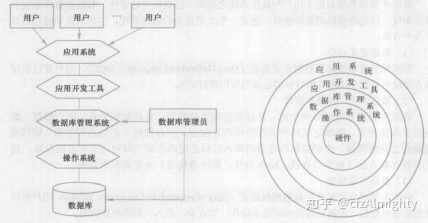
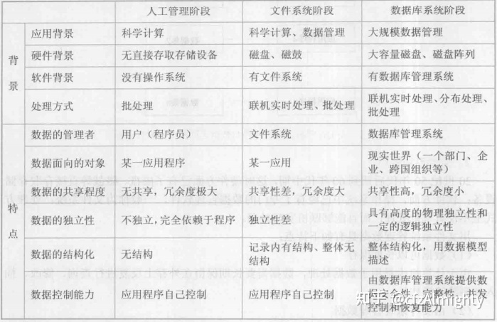
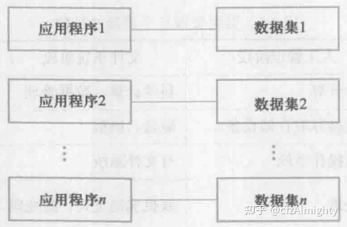
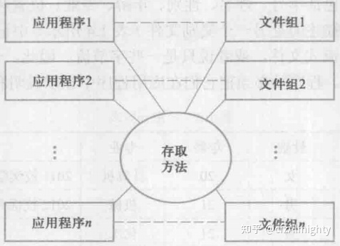
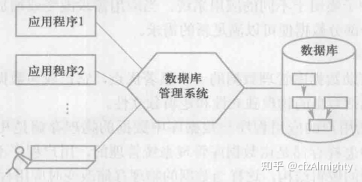
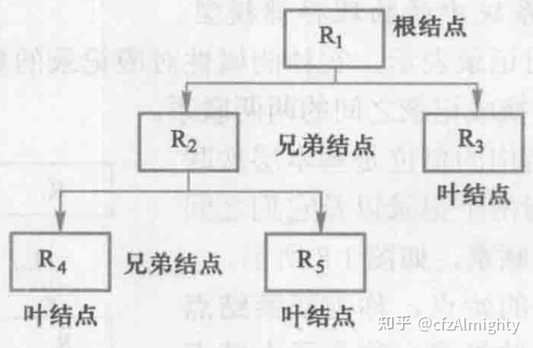
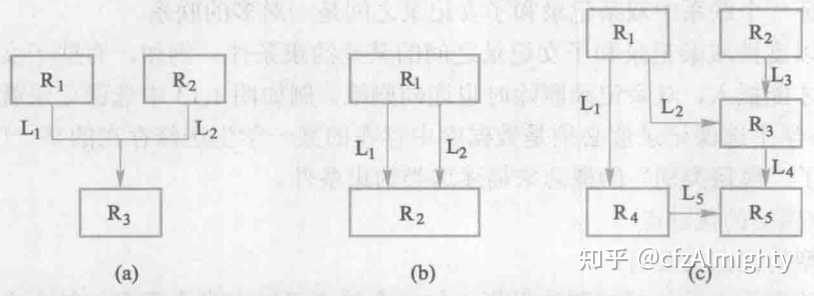
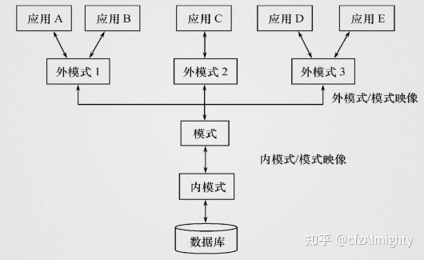

注：文章内容是数据库系统课程学习的笔记，参考王珊，萨师煊编著的《数据库系统概论》（第5版），北京：高等教育出版社，2018.5.

第1章主要介绍数据库系统的基本概念，是后面各章节的准备和基础。由于这一章概念较多，如果是刚开始学习数据库，可以在学习后续章节后再回来理解这些概念。

ps: 移动端可查看文章目录。

-

## 1.1 数据库系统概述

### 1.1.1 数据库的4个基本概念

- **数据**（Data）：描述事物的符号记录。

数据的含义称为数据的语义，数据与其语义是不可分的。

- **数据库**（Database，简称 DB）：长期储存在计算机内、有组织的、可共享的大量数据的集合。

数据库中的数据按一定的数据模型组织、描述和储存，具有较小的冗余度（redundancy）、较 高的数据独立性（data independency）和易扩展性（scalability），并可为各种用户共享。

- **数据库管理系统**（DBMS）：位于用户与操作系统之间的一层数据管理软件。

数据库管理系统和操作系统一样是计算机的基础软件。

- **数据库系统**（DBS）：数据库、数据库管理系统（及其应用开发工具）、应用程序和数据库管理员组成的存储、管理、处理和维护数据的系统。

在一般不引起混淆的情况下，人们常常把数据库系统简称为数据库。

左图：数据库系统。右图：引入数据库后计算机系统的层次结构

  

### 1.1.2 数据管理技术的产生和发展

在计算机硬件、软件发展的基础上，数据管理技术经历了人工管理、文件系统、数据库系统三个阶段。

数据管理三个阶段的比较

**1\. 人工管理阶段**

特点：

1. 数据不保存
2. 应用程序管理数据
3. 数据不共享
4. 数据不具有独立性

人工管理阶段应用程序与数据之间的一一对应关系

**2\. 文件系统阶段**

特点：

1. 数据可以长期保存
2. 由文件系统管理数据
3. 数据共享性差，冗余度大
4. 数据独立性差

文件系统阶段应用程序与数据之间的对应关系

**3\. 数据库系统阶段**

从文件系统到数据库系统标志着数据管理技术的飞跃。

数据库系统阶段应用程序与数据之间的对应关系

### 1.1.3 数据库系统的特点

**1\. 数据结构化**

数据库系统实现整体数据的结构化，这是数据库的主要特征之一，也是数据库系统与文件系统的本质区别。

**整体结构化**

- 数据库中的数据不再仅仅针对某一个应用，而是面向整个组织或企业
- 不仅数据是内部结构化的，而且整体是结构化的，数据之间具有联系

**2\. 数据的共享性高、冗余度低且易扩充**

- 数据共享可以大大减少数据冗余，节约存储空间。
- 数据共享还能够避免数据之间的不相容性与不一致性。
- 不仅可以被多个应用共享使用，而且容易增加新的应用，使得数据库系统弹性大，易于扩充。

**3\. 数据独立性高**

数据独立性包括数据的**物理独立性**和**逻辑独立性**。

**物理独立性**：指用户的应用程序与数据库中数据的物理存储是相互独立的。

- 数据的物理存储改变时，应用程序不用改变。

**逻辑独立性**：指用户的应用程序与数据库的逻辑结构是相互独立的。

- 数据的逻辑结构改变时，应用程序不用改变。

数据独立性是由数据库管理系统提供的二级映像功能来保证的。

**4\. 数据由数据库管理系统统一管理和控制**

数据库管理系统提供的数据控制功能

- 数据的安全性（security）保护：保护数据以防止不合法使用造成的数据泄密和破坏。
- 数据的完整性（integrity）检查：保证数据的正确性、有效性和相容性。
- 并发（concurrency）控制：对多用户的并发操作加以控制和协调，防止相互干扰而得到错误的结果。
- 数据库恢复（recovery）：将数据库从错误状态恢复到某一已知的正确状态。

小结：

- 数据库是长期存储在计算机内有组织、大量、共享的数据集合。
- 数据库可以供各种用户共享，具有最小冗余度和较高的数据独立性。
- 数据库管理系统在数据库建立、运用和维护时对数据库进行统一控制，以保证数据的完整性和安全性，并在多用户同时使用数据库时进行并发控制，在发生故障后对数据库进行恢复。

## 1.2 数据模型

- 数据模型是对现实世界数据特征的抽象。
- 数据模型是数据库系统的核心和基础。

数据模型应满足三方面要求：能比较真实地模拟现实世界、容易为人所理解、便于在计算机上实现。

### 1.2.1 两类数据模型

根据模型应用的不同目的，将模型划分为两大类：概念模型、逻辑模型和物理模型。

- 概念模型：也称信息模型，它是按用户的观点来对数据和信息建模，用于数据库设计。
- 逻辑模型：主要包括层次模型、网状模型、关系模型、面向对象数据模型和对象关系数据模型、半结构化数据模型等。它是按计算机系统的观点对数据建模，用于数据库管理系统的实现。
- 物理模型：对数据最底层的抽象，它描述数据在系统内部的表示方式和存取方法，或在磁盘或磁带上的存储方式和存取方法，是面向计算机系统的。

### 1.2.2 概念模型

**基本概念**

- **实体**（entity）：客观存在并可相互区别的事物。
- **实体型**（entity type）：用实体名及其属性名集合来抽象和刻画同类实体。
- **实体集**（entity set）：同一类型实体的集合。
- **实体之间的联系**：包括实体（型）内部的联系和实体（型）之间的联系。实体内部的联系通常是指组成实体的各属性之间的联系，实体之间的联系通常是指不同实体集之间的联系。实体之间的联系有一对一、一对多和多对多等多种类型。
- **属性**（attribute）：实体所具有的某一特性。
- **码**（key）：唯一标识实体的属性集。

**概念模型的一种标识方法：实体-联系方法**

- 实体-联系方法（Entity-Relationship approach）：用 E-R 图来描述现实世界的概念模型  
  

### 1.2.3 数据模型的组成要素

数据模型的三个要素：数据结构、数据操作和数据的完整性约束条件（integrity constraints）。

**1\. 数据结构**

- 数据结构描述数据库的组成对象以及对象之间的联系。
- 描述的内容：与对象的类型、内容、性质有关；与数据之间联系有关的对象。
- 数据结构是所描述的对象类型的集合，是对系统静态特性的描述。

**2\. 数据操作**

- 数据操作是指对数据库中各种对象（型）的实例（值）允许执行的操作的集合，包括操作及有关的操作规则。
- 数据操作的类型：查询和更新（包括插入、删除、修改）。
- 数据模型必须定义操作的确切含义、操作符号、操作规则（如优先级）以及操作的语言。
- 数据操作是对系统动态特性的描述。

**3\. 数据的完整性约束条件**

- 数据的完整性约束条件是一组完整性规则。
- 完整性规则：给定的数据模型中数据及其联系所具有的制约和依存规则，用以限定符合数据模型的数据库状态以及状态的变化，以保证数据的正确、有效和相容。
- 数据模型应该反映和规定其必须遵守的基本的和通用的完整性约束条件，应该提供定义完整性约束条件的机制，以反映具体应用所涉及的数据必须遵守的特定的语义约束条件。

### 1.2.4 常用的数据模型

- 层次模型（hierarchical model）
- 网状模型（network model）
- 关系模型（relational model）
- 面向对象数据模型（object oriented data model）
- 对象关系数据模型（object relational data model）
- 半结构化数据模型（semistructure data model）

层次模型和网状模型统称为格式化模型。

基本层次联系是指两个记录以及它们之间的一对多（包括一对一）的联系。

### 1.2.5 层次模型

- 层次模型是数据库系统中最早出现的数据模型。
- 层次模型用树形结构来表示各类实体以及实体间的联系。

**1\. 层次模型的数据结构**

一个层次模型的示例

满足下面两个条件的基本层次联系的集合为层次模型：

1. 有且只有一个结点没有双亲结点，这个结点称为根结点
2. 根以外的其他结点有且只有一个双亲结点

- 层次模型结点的双亲是唯一的。

**2\. 层次模型的数据操纵与完整性约束**

层次模型的数据操纵：查询、插入、删除、更新

层次模型的完整性约束条件

- 无相应的双亲结点值就不能插入子女结点值
- 如果删除双亲结点值，则相应的子女结点值也被同时删除
- 更新操作时，应更新所有相应记录，以保证数据的一致性

**3\. 层次模型的优缺点**

层次模型的优点主要有：

1. 层次模型的数据结构比较简单清晰
2. 层次数据库的查询效率高
3. 层次数据模型提供了良好的完整性支持

层次数据库的缺点主要是：

1. 现实世界中很多联系是非层次性的，层次模型不能自然地表示这类联系
2. 对插入和删除操作的限制比较多，应用程序的编写比较复杂
3. 查询子女结点必须通过双亲结点
4. 层次命令趋于程序化

### 1.2.6 网状模型

**1\. 网状模型的数据结构**

网状模型的例子

满足下面两个条件的基本层次联系的集合为网状模型：

1. 允许一个以上的结点无双亲
2. 一个结点可以有多于一个的双亲

- 层次模型中子女结点与双亲结点的联系是唯一的，而在网状模型中这种联系可以不唯一。

**2\. 层次模型的数据操纵与完整性约束**

网状数据库系统（如 DBTG）对数据操纵加了一些限制，提供了一定的完整性约束。

- 支持记录码的概念，码即唯一标识记录的数据项的集合。
- 保证一个联系中双亲记录与子女记录之间是一对多的联系。
- 可以支持双亲记录和子女记录之间的某些约束条件。

**3\. 网状模型的优缺点**

网状数据库的优点主要有：

1. 能够更为直接地描述现实世界
2. 具有良好的性能，存取效率较高

网状数据库的缺点主要是：

1. 结构比较复杂，而且随着应用环境的扩大，数据库的结构就变得越来越复杂，不利于最终用户掌握。
2. 网状数据库的数据定义语言、数据操纵语言比较复杂，要求用户掌握数据库结构和存取路径，不容易使用。
3. 记录之间的联系是通过存取路径实现的，用户必须了解系统结构的细节。

### 1.2.7 关系模型

**1\. 关系模型的数据结构**

- **关系**（relation）：一个关系对应通常说的一张表。
- **元组**（tuple）：表中的一行即为一个元组。
- **属性**（attribute）：表中的一列即为一个属性，给每一个属性起一个名称即属性名。
- **码**（key）：也称码键。表中的某个属性组，它可以唯一确定一个元组
- **域**（domain）：一组具有相同数据类型的值的集合。属性的取值范围来自某个域。
- **分量**：元组中的一个属性值。
- **关系模式**：对关系的描述，一般表示为：关系名（属性1，属性2，…，属性n）

关系模型要求关系必须是规范化的，即要求关系满足一定的规范条件。

最基本的规范条件：关系的每一个分量必须是一个不可分的数据项， 不允许表中还有表。

**2\. 关系模型的数据操纵与完整性约束**

- 关系模型的数据操纵：查询、插入、删除、更新。
- 关系模型中的数据操作是集合操作，操作对象和操作结果都是关系。
- 关系模型把存取路径向用户隐蔽起来，用户只要指出“干什么”或“找什么”，不必详细说明“怎么干”或“怎么找”。

关系的完整性约束条件：实体完整性、参照完整性、用户定义的完整性。（参见第2章第3节）

**3\. 关系模型的优缺点**

关系模型具有以下优点：

1. 关系模型与格式化模型不同，它是建立在严格的数学概念的基础上的。
2. 关系模型的概念单一，所以其数据结构简单、清晰，用户易懂易用。
3. 关系模型的存取路径对用户透明，从而具有更高的数据独立性、更好的安全保密性，也简化了程序员的工作和数据库开发建立的工作。

缺点：由于存取路径对用户是隐蔽的，查询效率往往不如格式化数据模型。

- 为了提高性能，数据库管理系统必须对用户的查询请求进行优化，因此增加了开发关系数据库管理系统软件的难度。

## 1.3 数据库系统的结构

- 从数据库应用开发人员角度看，数据库系统通常采用三级模式结构，这是数据库系统内部的系统结构。
- 从数据库最终用户角度看，数据库系统的结构分为单用户结构、主从式结构、分布式结构、客户-服务器、浏览器-应用服务器／数据库服务器多层结构等，这是数据库系统外部的体系结构。

### 1.3.1 数据库系统模式的概念

- 在数据模型中有“型”（type）和“值”（value）的概念。型是指对某一类数据的结构和属性的说明，值是型的一个具体赋值。
- 模式的一个具体值称为模式的一个实例（instance）。
- 模式是相对稳定的，而实例是相对变动的。

### 1.3.2 数据库系统的三级模式结构

数据库系统的三级模式结构

- **模式**（schema）：也称逻辑模式，是数据库中全体数据的逻辑结构和特征的描述，是所有用户的公共数据视图。
- **外模式**（external schema）：也称子模式或用户模式，是数据库用户（包括应用程序员和最终用户）能够看见和使用的局部数据的逻辑结构和特征的描述，是数据库用户的数据视图，是与某一应用有关的数据的逻辑表示。
- **内模式**（internal schema）：也称存储模式，是数据物理结构和存储方式的描述，是数据在数据库内部的组织方式。

### 1.3.3 数据库系统的二级映像功能与数据独立性

数据库系统的三级模式是数据的三个抽象级别。数据库管理系统在这三级模式之间提供了两层映像：外模式／模式映像和模式／内模式映像。

**1\. 外模式／模式映像**

- 模式描述的是数据的全局逻辑结构，外模式描述的是数据的局部逻辑结构。对应于同一个模式可以有任意多个外模式 。对于每一个外模式，数据库系统都有一个外模式／模式映象，它定义了外模式与模式之间的对应关系。这些映象定义通常包含在各自外模式的描述中。
- 当模式改变时（如增加新的关系、新的属性、改变属性的数据类型等），由数据库管理员对各个外模式／模式的映象作相应改变，可以使外模式保持不变。应用程序是依据数据的外模式编写的，从而应用程序不必修改，保证了数据与程序的逻辑独立性，简称数据的逻辑独立性。

**2\. 模式／内模式映像**

- 数据库中只有一个模式，也只有一个内模式，所以数据库中模式／内模式映象是唯一的。它定义了数据全局逻辑结构与存储结构之间的对应关系。该映象定义通常包含在模式描述中。
- 当数据库的存储结构改变时（如选用了另一种存储结构），由数据库管理员对模式／内模式映象作相应改变，可以使模式保持不变，从而应用程序也不必改变。保证了数据与程序的物理独立性，简称数据的物理独立性。

数据库模式即全局逻辑结构是数据库的中心与关键，它独立于数据库的其他层次。因此设计数据库模式结构时应首先确定数据库的逻辑模式。

数据库的内模式依赖于它的全局逻辑结构，但独立于数据库的用户视图，即外模式，也独立于具体的存储设备。它是将全局逻辑结构中所定义的数据结构及其联系按照一定的物理存储策略进行组织，以达到较好的时间与空间效率。

数据库的外模式面向具体的应用程序，它定义在逻辑模式之上，但独立于存储模式和存储设备。当应用需求发生较大变化，相应外模式不能满足其视图要求时，该外模式就得做相应改动，所以设计外模式时应充分考虑到应用的扩充性。

特定的应用程序的在外模式描述的数据结构上编制的，它依赖于特定的外模式，与数据库的模式和存储结构独立。不同的应用程序有时可以共用同一个外模式。

数据库的二级映像保证了数据库外模式的稳定性，从而从底层保证了应用程序的稳定性，除非应用需求本身发生变化， 否则应用程序一般不需要修改。

数据与程序之间的独立性使得数据的定义和描述可以从应用程序中分离出去。由于数据的存取由数据库管理系统管理，从而简化了应用程序的编制，大大减少了应用程序的维护和修改。

## 1.4 数据库系统的组成

**1\. 硬件平台及数据库**

要求：

- 要有足够大的内存，存放操作系统、数据库管理系统的核心模块、数据缓冲区和应用程序
- 有足够大的磁盘或磁盘阵列等设备存放数据库，有足够大的磁带（或光盘）作数据备份
- 要求系统有较高的通道能力，以提高数据传送率

**2\. 软件**

数据库系统的软件主要包括：

- 数据库管理系统
- 支持数据库管理系统运行的操作系统
- 具有与数据库接口的高级语言及其编译系统，便于开发应用程序
- 以数据库管理系统为核心的应用开发工具
- 为特定应用环境开发的数据库应用系统

**3\. 人员**

各种人员的数据视图

数据库管理员：全面负责管理和控制数据库系统。具体职责包括：

- 决定数据库的信息内容和结构
- 决定数据库的存储结构和存取策略
- 定义数据的安全性要求和完整性约束条件
- 监控数据库的使用和运行
- 数据库系统的改进和重组重构

系统分析员：负责应用系统的需求分析和规范说明，要和用户及数据库管理员相结合，确定系统的硬件软件配置，并参与数据库系统的概要设计。

数据库设计人员：负责数据库中数据的确定和数据库各级模式的设计。数据库设计人员必须参加用户需求调查和系统分析，然后进行数据库设计。

应用程序员：负责设计和编写应用系统的程序模块，并进行调试和安装。

最终用户：通过应用系统的用户接口使用数据库。

  

## 1.5 小结

- 本章介绍了数据库的基本概念，通过对数据库管理技术进展情况的介绍阐述了数据库技术产生和发展的背景，说明了数据库系统的优点。
- 数据模型是数据库系统的核心和基础。本章简要介绍了概念模型、组成数据模型的三个要素和三种主要的数据库模型——层次模型、网状模型和关系模型。
- 本章还介绍了数据库管理系统内部的系统结构。数据库系统三级模式和两层映像的系统结构保证了数据库系统能够具有较高的逻辑独立性和物理独立性。
- 本章最后介绍了数据库系统的组成，数据库系统是一个人-机系统。