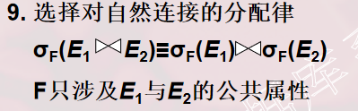

**一、关系数据库系统查询处理**  
**1\. 查询处理步骤**  
  
  
**（1）查询分析的任务**：对查询语句进行扫描、词法分析和语法分析  
词法分析：从查询语句中识别出正确的语言符号  
语法分析：进行语法检查  
**（2）查询检查的任务**  
1）合法权检查：根据数据字典检查语句中的数据库对象（关系名、属性名等）是否存在和有效  
2）视图转换：用视图消除法把对视图的操作转换成对基本表的操作  
3）安全性检查：根据数据字典中的用户权限对用户的存取权限进行检查  
4)完整性初步检查：根据数据字典中的完整性约束进行检查。

检查通过后把SQL查询语句转换成内部表示（即等价的关系代数表达式）。  
SQL——>关系代数  
在关系系统中一般用查询树（语法分析树）来表示扩展的关系代数表达式  
**（3）查询优化**  
选择一个高效执行的查询处理策略  
  
查询优化的选择依据：  
①基于规则  
②基于代价  
③基于语义  
**（4)查询执行**

通过优化器——>得到——>执行策略——>生成——>查询执行计划——>通过代码生成器——>生成——>查询执行计划的代码  
两种执行方式：①自顶向下②自底向上

**2\. 实现查询操作的算法实例**  
（1）选择操作的实现  
1）全表扫描方法  
对查询的基本表顺序扫描，逐一检查每个元组是否满足选择条件，把满足条件的元组作为结果输出  
2）索引扫描方法  
适合于选择条件中的属性上有索引(例如B+树索引或Hash索引) ，通过索引先找到满足条件的元组主码或元组指针，再通过元组指针直接在查询的基本表中找到元组。  
（2）连接操作的实现  
1）嵌套循环算法  
2）排序-合并算法  
3）索引连接(index join)算法  
4）Hash Join算法

例如：

```
SELECT * 
FROM    Student, SC       
WHERE Student.Sno=SC.Sno; 
```

1）嵌套循环算法  
①对外层循环(Student表)的每一个元组(s)，检索内层循环(SC表)中的每一个元组(sc)  
②检查这两个元组在连接属性(Sno)上是否相等  
③如果满足连接条件，则串接后作为结果输出，直到外层循环表中的元组处理完为止。  
2）排序-合并算法  
①如果连接的表没有排好序，先对Student表和SC表按连接属性Sno排序  
②取Student表中第一个Sno，依次扫描SC表中具有相同Sno的元组  
③当扫描到Sno不相同的第一个SC元组时，返回Student表扫描它的下一个元组，再扫描SC表中具有相同Sno的元组，把它们连接起来  
④重复上述步骤直到Student 表扫描完  
  
注释：  
Student表和SC表都只要扫描一遍  
如果两个表原来无序，执行时间要加上对两个表的排序时间  
对于大表，先排序后使用排序-合并连接算法执行连接，总的时间一般仍会减少  
3）索引连接(index join)算法  
① 在SC表上已经建立属性Sno的索引。  
② 对Student中每一个元组，由Sno值通过SC的索引查找相应的SC元组。  
③ 把这些SC元组和Student元组连接起来  
循环执行②③，直到Student表中的元组处理完为止  
4）Hash Join算法  
①划分阶段(building phase, 也称为partitioning phase)  
对包含较少元组的表(如Student表)进行一遍处理，把它的元组按hash函数分散到hash表的桶中  
②试探阶段(probing phase,也称为连接阶段join phase)  
对另一个表(SC表)进行一遍处理  
把SC表的元组也按同一个hash函数（hash码是连接属性)进行散列，把SC元组与桶中来自Student表并与之相匹配的元组连接起来。  
上面hash join算法前提：假设两个表中较小的表在第一阶段后可以完全放入内存的hash桶中

**二、关系数据库系统的查询优化**

**1\. 查询优化概述**  
（1）关系系统的查询优化  
是关系数据库管理系统实现的关键技术又是关系系统的优点所在，减轻了用户选择存取路径的负担  
（2）非关系系统  
用户使用过程化的语言表达查询要求，执行何种记录级的操作，以及操作的序列是由用户来决定的  
用户必须了解存取路径，系统要提供用户选择存取路径的手段，查询效率由用户的存取策略决定  
如果用户做了不当的选择，系统是无法对此加以改进的  
（3）查询优化的优点  
①用户不必考虑如何最好地表达查询以获得较好的效率  
②系统可以比用户程序的“优化”做得更好  
（4）关系数据库管理系统通过某种代价模型计算出各种查询执行策略的执行代价，然后选取代价最小的执行方案  
1）集中式数据库

| 执行开销                     |
| ---------------------------- |
| 磁盘存取块数(I/O代价）最重要 |
| 处理机时间(CPU代价)          |
| 查询的内存开销               |

2）分布式数据库

| 执行开销               |
| ---------------------- |
| 磁盘存取块数(I/O代价） |
| 处理机时间(CPU代价)    |
| 查询的内存开销         |
| 通信代价               |

（5）

| 查询优化的总目标               |
| ------------------------------ |
| 选择有效的策略                 |
| 求得给定关系表达式的值         |
| 使得查询代价最小(实际上是较小) |

**2\. 一个实例**

```
SELECT  Student.Sname
FROM    Student, SC
WHERE   Student.Sno=SC.Sno AND SC.Cno=’2’ 
//假定学生-课程数据库中有1000个学生记录，10000个选课记录选修2号课程的选课记录为50个 
```

(1）第一种情况  
  
①计算广义笛卡尔积  
算法  
1）在内存中尽可能多地装入某个表(如Student表)的若干块，留出一块存放另一个表(如SC表)的元组。  
2）把SC中的每个元组和Student中每个元组连接，连接后的元组装满一块后就写到中间文件上  
3）从SC中读入一块和内存中的Student元组连接，直到SC表处理完。  
4）再读入若干块Student元组，读入一块SC元组  
5）重复上述处理过程，直到把Student表处理完  
设一个块能装10个Student元组或100个SC元组，在内存中存放5块Student元组和1块SC元组，则读取总块数为 ：1000/10+1000/（10\*5）\*10000/100=2100块  
连接后的元组数为103×104\=107。设每块能装10个元组，则写出106 块。  
②作选择操作  
1）依次读入连接后的元组，按照选择条件选取满足要求的记录  
2）假定内存处理时间忽略。读取中间文件花费的时间(同写中间文件一样)需读入106块。  
3)若满足条件的元组假设仅50个，均可放在内存。  
③ 作投影操作  
把第②步的结果在Sname上作投影输出，得到最终结果  
第一种情况下执行查询的总读写数据块=2100+106 +106

（2）第二种情况  
  
①计算自然连接  
1）执行自然连接，读取Student和SC表的策略不变，总的读取块数仍为2100块  
2）自然连接的结果比第一种情况大大减少，为104个元组  
3)写出数据块= 103 块  
②读取中间文件块，执行选择运算，读取的数据块= 103 块  
③把第2步结果投影输出。  
第二种情况下执行查询的总读写数据块=2100+ 103 +103  
其执行代价大约是第一种情况的488分之一

（3）第三种情况  
  
①先对SC表作选择运算，只需读一遍SC表，存取100块，因为满足条件的元组仅50个，不必使用中间文件。  
②读取Student表，把读入的Student元组和内存中的SC元组作连接。也只需读一遍Student表共100块。  
③把连接结果投影输出

第三种情况总的读写数据块=100+100  
其执行代价大约是第一种情况的万分之一，是第二种情况的20分之一

假如SC表的Cno字段上有索引  
第一步就不必读取所有的SC元组而只需读取Cno=‘2’的那些元组(50个)  
存取的索引块和SC中满足条件的数据块大约总共3～4块  
若Student表在Sno上也有索引  
不必读取所有的Student元组  
因为满足条件的SC记录仅50个，涉及最多50个Student记录  
读取Student表的块数也可大大减少

把代数表达式Q1变换为Q2、 Q3  
  
  
  
!\[  
\](https://img-  
blog.csdnimg.cn/20200131123224849.png)

有选择和连接操作时，先做选择操作，这样参加连接的元组就可以大大减少，这是代数优化  
在Q3中  
1）SC表的选择操作算法有全表扫描或索引扫描，经过初步估算，索引扫描方法较优。  
2）对于Student和SC表的连接，利用Student表上的索引，采用索引连接代价也较小，这就是物理优化。

**三、 代数优化**

**1\. 关系代数表达式等价变换规则**  
代数优化策略：通过对关系代数表达式的等价变换来提高查询效率  
关系代数表达式的等价：指用相同的关系代替两个表达式中相应的关系所得到的结果是相同的  
两个关系表达式E1和E2是等价的，可记为E1≡E2  
（1）常用的等价变换规则  
  
  
  
  
  
  
它使部分选择在笛卡尔积前先做  
  
  
  
  


**2\. 查询树的启发式优化**  
启发式规则  
（1）选择运算应尽可能先做  
在优化策略中这是最重要、最基本的一条。  
（2）把投影运算和选择运算同时进行  
如有若干投影和选择运算，并且它们都对同一个关系操作，则可以在扫描此关系的同时完成所有的这些运算以避免重复扫描关系。  
（3） 把投影同其前或其后的双目运算结合起来，没有必要为了去掉某些字段而扫描一遍关系。  
（4） 把某些选择同在它前面要执行的笛卡尔积结合起来成为一个连接运算，连接特别是等值连接运算要比同样关系上的笛卡尔积省很多时间。  
（5）找出公共子表达式  
●如果这种重复出现的子表达式的结果不是很大的关系  
●并且从外存中读入这个关系比计算该子表达式的时间少得多  
●则先计算一次公共子表达式并把结果写入中间文件是合算的。  
●当查询的是视图时，定义视图的表达式就是公共子表达式的情况  
算法：关系表达式的优化  
输入：一个关系表达式的查询树  
输出：优化的查询树

**方法：**  
  
  
  
  
  
  
  


例题

```
SELECT  Student.Sname
FROM    Student, SC
WHERE   Student.Sno=SC.Sno AND SC.Cno=’2’ 
```

第一步：把SQL语句转换成查询树，如下图所示  
  
为了使用关系代数表达式的优化法，假设内部表示是关  
系代数语法树，则上面的查询树如图所示。  
  
第二步：对查询树进行优化  
利用规则4、6把选择σSC.Cno=‘2’移到叶端，查询树便转换成下图优化的查询树。  


**四、物理优化**

> 代数优化改变查询语句中操作的次序和组合，不涉及底层的存取路径  
> 对于一个查询语句有许多存取方案，它们的执行效率不同， 仅仅进行代数优化是不够的

物理优化就是要选择高效合理的操作算法或存取路径，求得优化的查询计划

| 物理优化方法         | 解释                                                         |
| -------------------- | ------------------------------------------------------------ |
| 基于规则的启发式优化 | 启发式规则是指那些在大多数情况下都适用，但不是在每种情况下都是适用的规则 |
| 基于代价估算的优化   | 优化器估算不同执行策略的代价，并选出具有最小代价的执行计划   |
| 两者结合的优化方法   | 常常先使用启发式规则，选取若干较优的候选方案，减少代价估算的工作量，然后分别计算这些候选方案的执行代价，较快地选出最终的优化方案 |

**1\. 基于启发式规则的存取路径选择优化**  
**（1）选择操作的启发式规则**  
对于小关系，使用全表顺序扫描，即使选择列上有索引  
对于大关系，启发式规则有：  
1）对于选择条件是“主码＝值”的查询  
查询结果最多是一个元组，可以选择主码索引  
一般的关系数据库管理系统会自动建立主码索引  
2）对于选择条件是“非主属性＝值”的查询，并且选择列上有索引  
要估算查询结果的元组数目  
如果比例较小(<10%)可以使用索引扫描方法  
否则还是使用全表顺序扫描  
3）对于选择条件是属性上的非等值查询或者范围查询，并且选择列上有索引  
同2）方法  
4）对于用AND连接的合取选择条件  
①如果有涉及这些属性的组合索引  
优先采用组合索引扫描方法  
②如果某些属性上有一般的索引，可以用索引扫描方法  
通过分别查找满足每个条件的指针，求指针的交集  
通过索引查找满足部分条件的元组，然后在扫描这些元组时判断是否满足剩余条件  
③其他情况：使用全表顺序扫描  
5）对于用OR连接的析取选择条件，一般使用全表顺序扫描  
**（2）连接操作的启发式规则**  
1）如果2个表都已经按照连接属性排序  
选用排序-合并算法  
2）如果一个表在连接属性上有索引  
选用索引连接算法  
3）如果上面2个规则都不适用，其中一个表较小  
选用Hash join算法  
4）可以选用嵌套循环方法，并选择其中较小的表，确切地讲是占用的块数(b)较少的表，作为外表(外循环的表)  
**2\. 基于代价的优化**

| 启发式规则优化                               | 基于代价的优化                             |
| -------------------------------------------- | ------------------------------------------ |
| 适合解释执行的系统                           | 适合编译执行的系统                         |
| 解释执行的系统：优化开销包含在查询总开销之中 | 编译执行的系统：查询优化和查询执行是分开的 |

（1）统计信息  
基于代价的优化方法要计算查询的各种不同执行方案的执行代价，它与数据库的状态密切相关  
优化器需要的统计信息  
1）对每个基本表  
该表的元组总数(N)  
元组长度(l)  
占用的块数(B)  
占用的溢出块数(BO)  
2）对基表的每个列  
该列不同值的个数(m)  
列最大值  
最小值  
列上是否已经建立了索引  
哪种索引(B+树索引、Hash索引、聚集索引)  
可以计算选择率(f)  
如果不同值的分布是均匀的，f＝1/m  
如果不同值的分布不均匀，则要计算每个值的选择率，f＝具有该值的元组数/N  
3）对索引  
索引的层数(L)  
不同索引值的个数  
索引的选择基数S(有S个元组具有某个索引值)  
索引的叶结点数(Y)  
（2）代价估算示例  
1）全表扫描算法的代价估算公式  
如果基本表大小为B块，全表扫描算法的代价 cost＝B  
如果选择条件是“码＝值”，那么平均搜索代价 cost＝B/2  
2）索引扫描算法的代价估算公式  
①如果选择条件是“码＝值”  
则采用该表的主索引  
若为B+树，层数为L，需要存取B+树中从根结点到叶结点L块，再加上基本表中该元组所在的那一块，所以cost=L+1  
②如果选择条件涉及非码属性  
若为B+树索引，选择条件是相等比较，S是索引的选择基数(有S个元组满足条件)  
满足条件的元组可能会保存在不同的块上，所以(最坏的情况)cost=L+S  
③如果比较条件是＞，＞＝，＜，＜＝操作  
假设有一半的元组满足条件  
就要存取一半的叶结点  
通过索引访问一半的表存储块  
cost=L+Y/2+B/2  
如果可以获得更准确的选择基数，可以进一步修正Y/2与B/2  
3）嵌套循环连接算法的代价估算公式  
嵌套循环连接算法的代价  
cost＝Br+BrBs/(K-1)  
如果需要把连接结果写回磁盘  
cost＝Br+Br Bs/(K-1)+(Frs_Nr_Ns)/Mrs  
其中Frs为连接选择性(join selectivity)，表示连接结果元组数的比例  
Mrs是存放连接结果的块因子，表示每块中可以存放的结果元组数目  
4）排序-合并连接算法的代价估算公式  
如果连接表已经按照连接属性排好序，则  
cost＝Br+Bs+(Frs_Nr_Ns)/Mrs  
如果必须对文件排序  
还需要在代价函数中加上排序的代价  
对于包含B个块的文件排序的代价大约是  
(2_B)+(2_B\*log2B)  
（3）优化方法

**六、小结**  
查询处理是关系数据库管理系统的核心，查询优化技术是查询处理的关键技术  


| 代数优化         | 物理优化                               |
| ---------------- | -------------------------------------- |
| 启发式代数优化   | 基于规则的存取路径优化、基于代价的优化 |
| 查询执行         |                                        |
| –                |                                        |
| 自顶向下执行方式 |                                        |
| 自底向上执行方式 |                                        |

比较复杂的查询，尤其是涉及连接和嵌套的查询  
不要把优化的任务全部放在关系数据库管理系统上  
应该找出关系数据库管理系统的优化规律，以写出适合关系数据库管理系统自动优化的SQL语句

对于关系数据库管理系统不能优化的查询需要重写查询语句，进行手工调整以优化性能