___

## 0.思维导图

## 1.数据模型的概念

-   在数据库中用数据模型这个工具来`抽象、表示和处理`现实世界中的数据和信息。
-   通俗地讲数据模型就是`现实世界的模拟，对现实世界数据的抽象`。

**数据模型应满足三方面要求：**

-   能比较`真实`地模拟现实世界
-   `容易`为人所`理解`
-   便于在计算机上`实现`

## 2.两大类数据模型

**数据模型分为两类（分属两个不同的层次）**

-   (1) `概念模型 也称信息模型`，它是按`用户的观点`来对数据和信息建模，用于数据库设计。
-   (2) `逻辑模型`和`物理模型`  
    **逻辑模型**主要包括`网状模型`、`层次模型`、`关系模型`、`面向对象模型`等，按`计算机系统的观点`对数据建模，用于DBMS实现。==数据之间的关系==  
    **物理模型**是对数据最底层的抽象，描述数据在系统内部的表示方式和存取方法，在磁盘或磁带上的存储方式和存取方法。==数据在计算机上存储的形式==

### 客观对象的抽象过程—两步抽象

-   现实世界中的客观对象抽象为`概念模型`；
-   把`概念模型`转换为某一DBMS支持的`数据模型`。  
    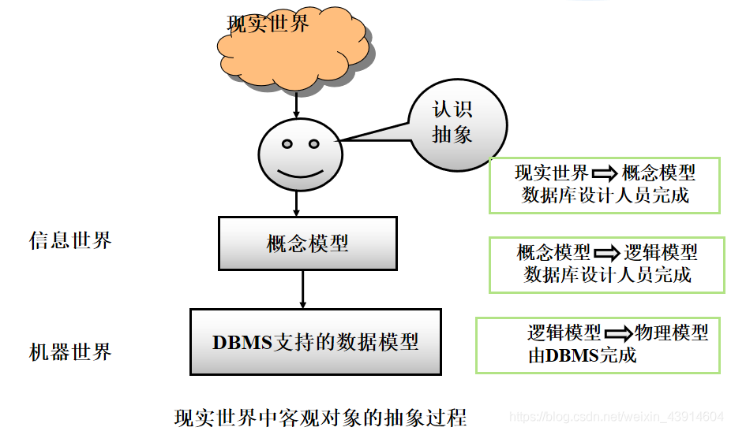

## 3.数据模型的组成要素

### (1)[数据结构](https://so.csdn.net/so/search?q=%E6%95%B0%E6%8D%AE%E7%BB%93%E6%9E%84&spm=1001.2101.3001.7020)

**数据结构是所研究的对象类型的集合**。这些对象是数据库的组成成分，数据结构指对象和对象间联系的表达和实现，是对系统静态特征的描述，包括两个方面：  
（1）数据本身：类型、内容、性质。例如[关系模型](https://so.csdn.net/so/search?q=%E5%85%B3%E7%B3%BB%E6%A8%A1%E5%9E%8B&spm=1001.2101.3001.7020)中的域、属性、关系等。  
（2）数据之间的联系：数据之间是如何相互关联的，例如关系模型中的主码、外码联系等。

### (2)数据操作

**数据操作**

-   对数据库中各种`对象(型)`的`实例(值)`允许执行的`操作`，及有关的`操作规则`

**数据操作的类型**

-   查询
-   更新(包括插入、删除、修改)

### (3)数据的完整性约束条件

-   **数据的完整性约束条件**是一组`完整性规则`的集合，规定数据库状态及状态变化所应满足的条件，以保证数据的正确性、有效性和相容性。

> 完整性规则：给定的数据模型中数据及其联系所具有的制约和储存规则

## 4.概念模型

### (1)用途与基本要求

**概念模型的用途:**

-   概念模型用于信息世界的建模
-   是现实世界到机器世界的一个中间层次
-   是数据库设计的有力工具
-   数据库设计人员和用户之间进行交流的语言

**对概念模型的基本要求:**

-   较强的语义表达能力
-   能够方便、直接地表达应用中的各种语义知识
-   简单、清晰、易于用户理解

### (2) 信息世界中的基本概念

-   (1) `实体`（Entity）  
    `客观存在并可相互区别的事物`称为实体。个体  
    可以是具体的人、事、物或抽象的概念。
-   (2) `属性`（Attribute）  
    `实体`所具有的某一`特性`称为属性。  
    一个实体可以由若干个属性来刻画。
-   (3) `码`（Key）  
    `唯一标识实体的属性`集称为码。==可有多个==  
    (4) `域`（Domain）  
    `属性`的`取值范围`称为该属性的域。
-   (5) `实体型`（Entity Type）  
    用`实体名`及其`属性名集合`来抽象和刻画`同类实体`称为实体型
-   (6) `实体集`（Entity Set）  
    `同一类型实体的集合`称为实体集
-   (7) `联系`（Relationship）
    -   现实世界中`事物内部`以及`事物之间`的`联系`在信息世界中反映为实体内部的联系和实体之间的联系。
    -   实体`内部的联系`通常是指组成实体的`各属性之间`的联系
    -   实体`之间的联系`通常是指`不同实体集之间`的联系

### (3)两个实体型之间的联系

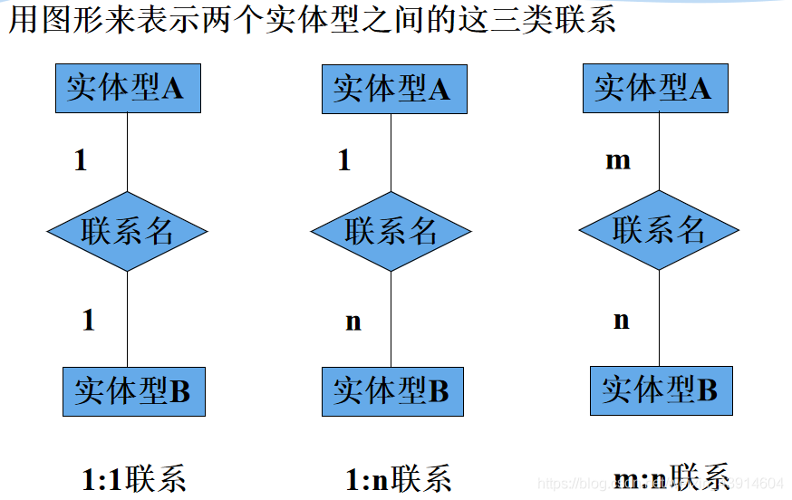

#### ① 一对一联系（1:1）

**实例**

-   一个班级只有一个正班长
-   一个班长只在一个班中任职  
    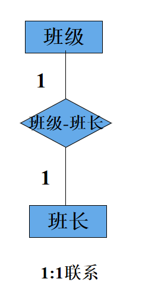

**定义：**  
如果对于实体集A中的每一个实体，实体集B中至多有一个（也可以没有）实体与之联系，反之亦然。则称实体集A与实体集B具有一对一联系，记为1:1

#### ② 一对多联系（1:n）

**实例**

-   一个班级中有若干名学生，
-   每个学生只在一个班级中学习  
    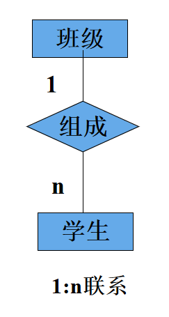  
    **定义：**  
    如果对于实体集A中的每一个实体，实体集B中有n个实体（n≥0)与之联系，反之，对于实体集B中的每一个实体，实体集A中至多只有一个实体与之联系，则称实体集A与实体集B有一对多联系，记为1:n

#### ③ 多对多联系（m:n）

**实例**

-   课程与学生之间的联系：
-   一门课程同时有若干个学生选修
-   一个学生可以同时选修多门课程  
    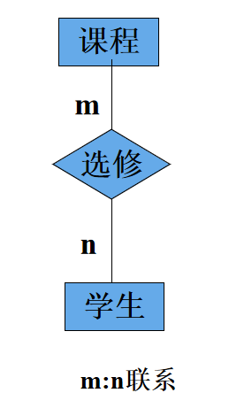  
    **定义：**  
    如果对于实体集A中的每一个实体，实体集B中有n个实体（n≥0）与之联系，反之，对于实体集B中的每一个实体，实体集A中也有m个实体（m≥0)与之联系，则称实体集A与实体B具有多对多联系，记为m:n

### (4)两个以上实体型之间的联系

#### ① 一对多联系（1:m||1:n）

-   若实体集E1，E2，…，En存在联系，对于实体集Ej（j=1，2，…，i-1i+1，…，n）中的给定实体，最多只和Ei中的一个实体相联系，则我们说Ei与E1E2，…，Ei-1，Ei+1，…，En之间的联系是一对多的。

**实例**

-   课程、教师与参考书三个实体型  
    一门课程可以有若干个教师讲授，  
    使用若干本参考书，  
    每一个教师只讲授一门课程，  
    每一本参考书只供一门课程使用

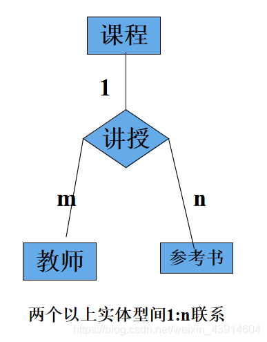

#### ② 一对一联系（1:1:1）

**实例**

-   一个独生子女只有一个父亲，一个母亲
-   一个父亲也只有一个独生子女
-   一个母亲也只有一个独生子女  
    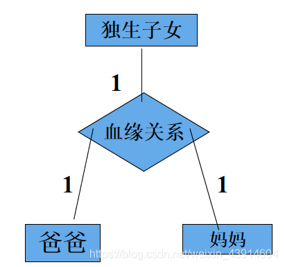

#### ③ 多对多联系（m:n:p）

**实例**  
供应商、项目、零件三个实体型  
一个供应商可以供给多个项目多种零件  
每个项目可以使用多个供应商供应的零件  
每种零件可由不同供应商供给  
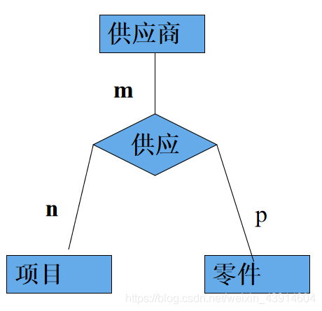

### (5)单个实体型内的联系

#### ① 一对多联系（1:n）

**实例**  
职工实体型内部具`有领导与被领导`的联系  
某一职工（干部）“领导”若干名职工  
一个职工仅被另外一个职工直接领导  
这是一对多的联系

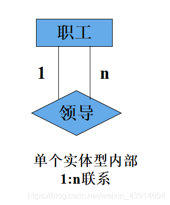

#### ② 一对一联系（1:1）

-   身份证可以唯一确认一个人的身份，人与身份证`有确认和被确认`的关系
-   一个身份证唯一确定一个人
-   一个人也唯一确认一个身份证  
    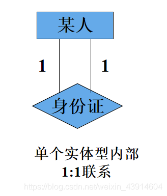

#### ③ 多对多联系 （m:n）

-   饮料和厂商之间有`制造和被制造`的关系
-   多个饮料可以被多个厂商制造
-   多个厂商可以制造出多种饮料  
    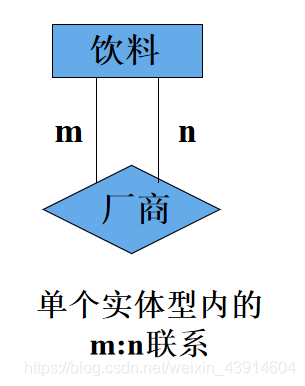

### (6)概念模型的一种表示方法

#### ① 实体－联系方法(E-R方法)

-   E-R图也称实体-联系图(Entity Relationship Diagram)，提供了表示实体类型、属性和联系的方法，用E-R图来描述现实世界的概念模型
-   E-R方法也称为E-R模型

#### ② 实体型

用矩形表示，矩形框内写明实体名。  
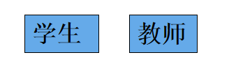

#### ③ 属性

用椭圆形表示，并用无向边将其与相应的实体连接起来  
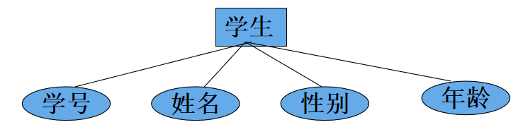

#### ④ 联系

-   联系本身：  
    用菱形表示，菱形框内写明联系名，并用无向边分别与有关实体连接起来，同时在无向边旁标上联系的类型（1:1、1:n或m:n）  
    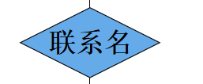

#### ⑤ 联系的表示方法

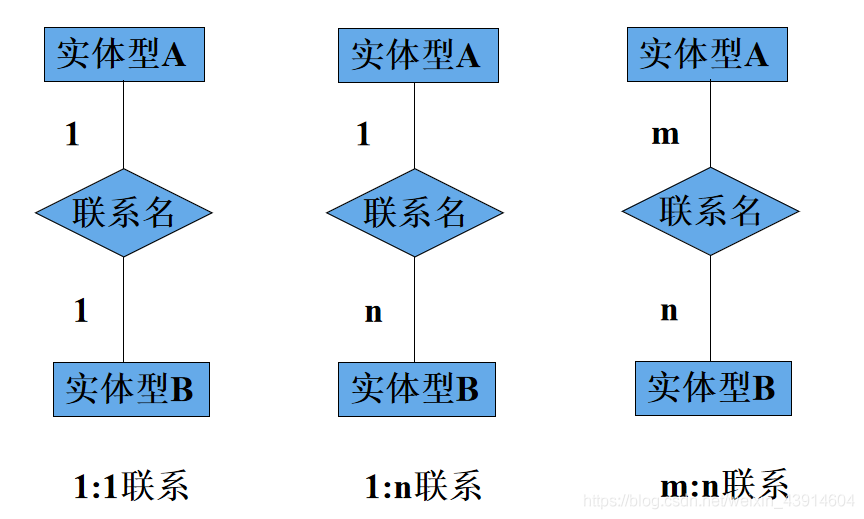

#### ⑥ 联系的表示方法示例

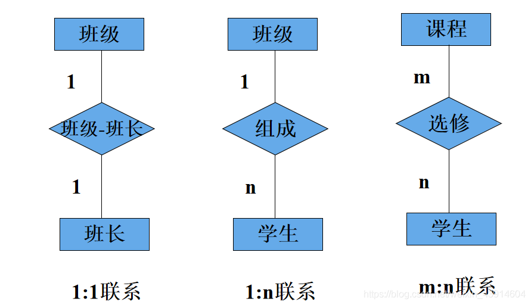

#### ⑦ 联系的属性

-   `联系本身`也是一种`实体型`，`也可以有属性`。如果一个联系具有属性，则这些属性也要用无向边与该联系连接起来  
    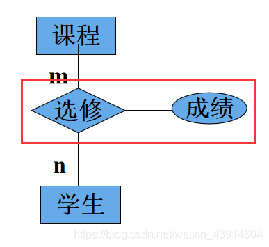

#### ⑧ 一个实例

**用E-R图表示某个工厂物资管理的概念模型**

-   实体  
    仓库： 仓库号、面积、电话号码  
    零件 ：零件号、名称、规格、单价、描述  
    供应商：供应商号、姓名、地址、电话号码、帐号  
    项目：项目号、预算、开工日期  
    职工：职工号、姓名、年龄、职称

**实体之间的联系如下：**

-   (1)一个仓库可以存放多种零件，一种零件可以存放在多个仓库中。仓库和零件具有多对多的联系。用库存量来表示某种零件在某个仓库中的数量。  
    (2)一个仓库有多个职工当仓库保管员，一个职工只能在一个仓库工作，仓库和职工之间是一对多的联系。职工实体型中具有一对多的联系  
    (3)职工之间具有领导-被领导关系。即仓库主任领导若干保管员。  
    (4)供应商、项目和零件三者之间具有多对多的联系  
    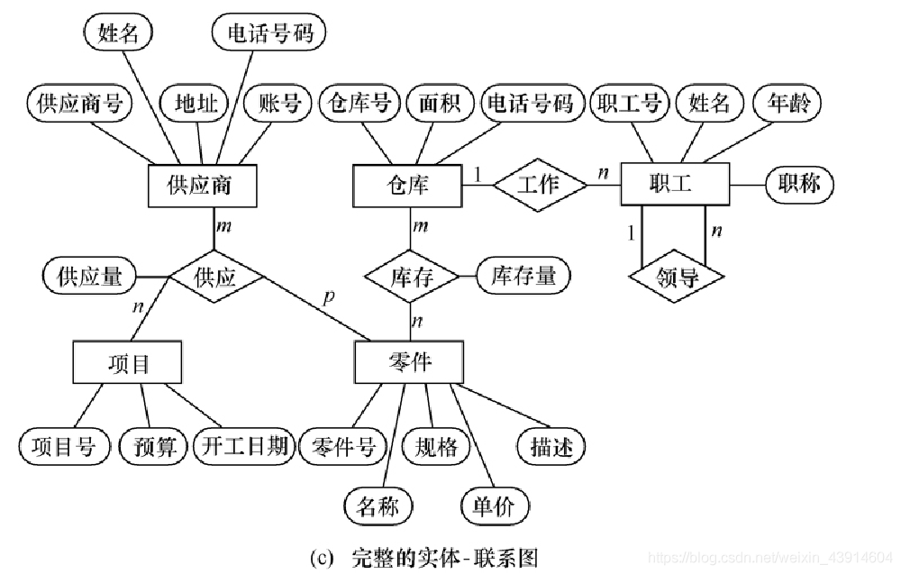

## 5.非关系模型

### （1）层次模型(Hierarchical Model)

-   层次模型是数据库系统中最早出现的数据模型
-   层次数据库系统的典型代表是IBM公司的IMS（Information Management System）数据库管理系统
-   层次模型用`树形结构`来表示各类实体以及实体间的联系
-   层次模型可以==不标注==实体之间的关系

#### ① 数据结构

**满足下面两个条件的基本层次联系的集合为层次模型**

-   有且只有一个结点没有双亲结点，这个结点称为`根结点`
-   根以外的其它结点`有且只有一个`双亲结点

**层次模型中的几个术语**  
根结点，双亲结点，兄弟结点，叶结点  
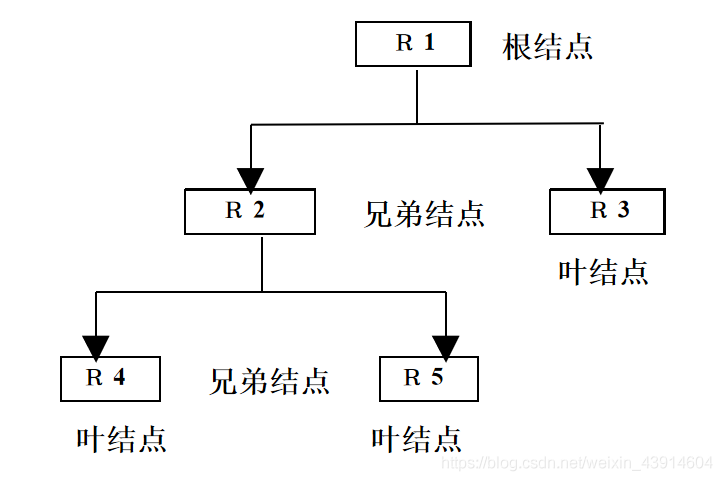

#### ② 特点

-   结点的双亲是`唯一`的
-   只能直接处理`一对多`的实体联系
-   每个记录类型可以定义一个排序字段，也称为·`码字段`
-   任何记录值只有`按其路径查看`时，才能显出它的全部意义
-   `没有`一个子女记录值能够`脱离`双亲记录值而独立存在
-   是一种特殊的网状模型

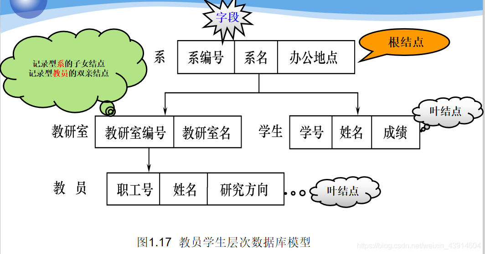  
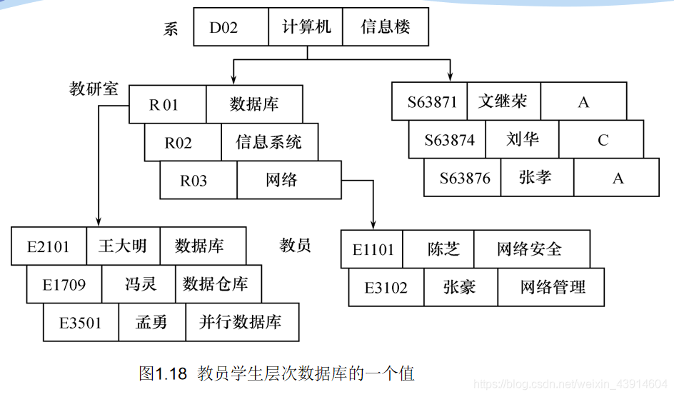

#### ③ 多对多联系在层次模型中的表示

**方法：**

-   将多对多联系分解成一对多联系

**分解方法：**

-   冗余结点法
-   虚拟结点法

#### ④ 数据操纵与完整性约束

**层次模型的数据操纵：**

-   查询
-   插入
-   删除
-   更新

**层次模型的完整性约束条件：**

-   无相应的双亲结点值就不能插入子女结点值
-   如果`删除双亲`结点值，则相应的`子女结点`值也被`同时删除`
-   更新操作时，应更新所有相应记录，以保证数据的一致性

#### ⑤ 存储结构

**邻接法：**  
按照层次树`前序遍历（T-L-R）`的顺序把所有记录值依次邻接存放，即通过物理空间的位置相邻来实现层次顺序。又可分为：`子女－兄弟链接法`和`层次序列链接法`。

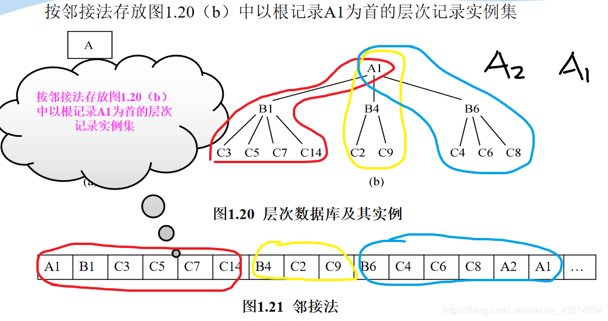

##### ❶ 子女-兄弟链接法

-   每个记录设两类指针，分别指向`最左边的子女`（每个记录型对应一个）和`最近的兄弟`  
    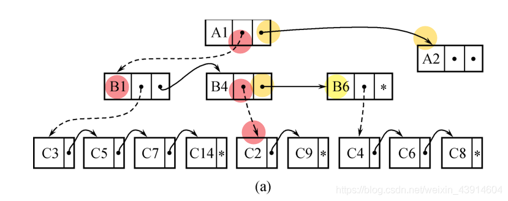

##### ❷ 层次序列链接法

-   按树的`前序穿越顺序`链接各记录值  线索二叉树
    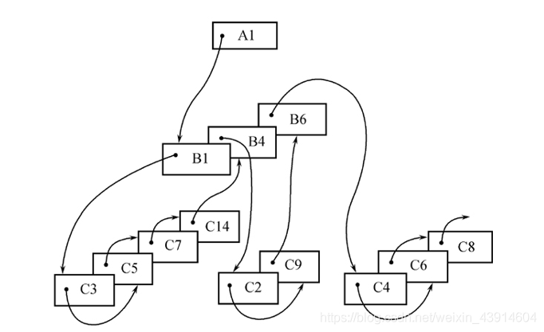

#### ⑥ 优缺点

-   **优点：**  
    层次模型的数据`结构`比较简单`清晰`  
    `查询效率高，性能优于关系模型，不低于网状模型`  
    层次数据模型提供了良好的完整性支持
-   **缺点：**  
    多对多联系表示不自然  
    对`插入`和`删除`操作的`限制多`，应用`程序`的`编写`比较`复杂`  
    查询子女结点必须通过双亲结点  
    由于结构严密，层次命令趋于程序化

### （2）网状模型(Network Model)

**网状数据库系统采用`网状模型`作为数据的组织方式**

> -   典型代表是DBTG系统：  
>     亦称CODASYL系统  
>     70年代由DBTG提出的一个系统方案  
>     奠定了数据库系统的基本概念、方法和技术
> -   实际系统:  
>     Cullinet Software Inc.公司的 IDMS  
>     Univac公司的 DMS1100  
>     Honeywell公司的IDS/2  
>     HP公司的IMAGE

#### ① 数据结构

**网状模型:**  
满足下面两个条件的基本层次联系的集合：

1.  允许一个以上的结点无双亲；
2.  一个结点可以有多于一个的双亲。

**表示方法(与层次数据模型相同):**  
`实体型`：用记录类型描述  
每个`结点`表示一个记录类型（实体）  
`属性`：用字段描述  
每个记录类型可包含若干个字段  
`联系`：用结点之间的`连线`表示记录类型（实体）之  
间的`一对多的父子联系`

**网状模型与层次模型的区别:**

-   网状模型允许多个结点没有双亲结点
-   网状模型允许结点有多个双亲结点
-   网状模型允许两个结点之间有多种联系（复合联系）
-   网状模型可以更直接地去描述现实世界
-   层次模型实际上是网状模型的一个特例

`网状模型中子女结点与双亲结点的联系可以不唯一`  
要为`每个联系命名`，并指出与`该联系有关`的`双亲记录`和`子女记录`  
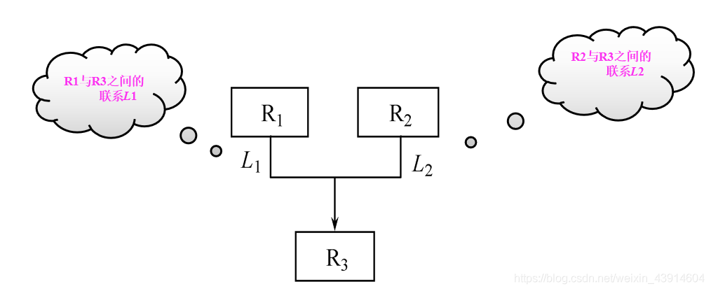  
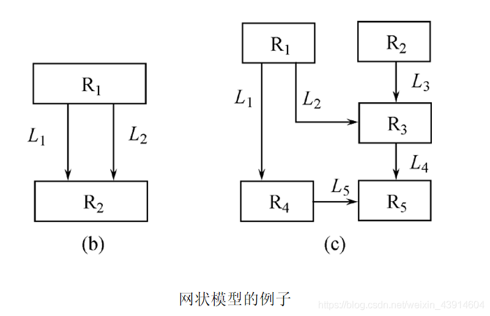

**多对多联系在网状模型中的表示:**  
方法：将`多对多`联系直接分解成`一对多`联系

`例如`：一个学生可以选修若干门课程，·某一课程可以被多个学生选修，学生与课程之间是多对多联系 ·

-   引进一个学生选课的联结记录，由3个数据项组成  
    学号  
    课程号  
    成绩  
    表示某个学生选修某一门课程及其成绩

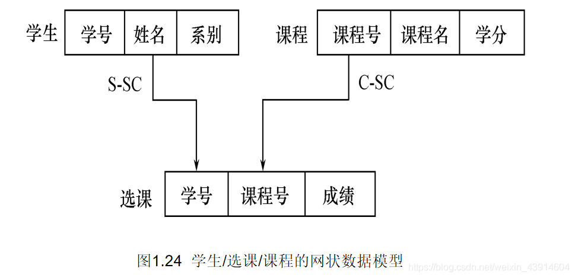

#### ② 网状数据模型的操纵与完整性约束（续）

**网状数据库系统（如DBTG）对数据操纵加 了一些限制，提供了一定的完整性约束**

-   `码`：唯一标识记录的数据项的集合
-   一个联系中`双亲记录`与`子女记录`之间是`一对多`联系
-   支持双亲记录和子女记录之间某些约束条件

#### ③ 存储结构

**关键：**

-   实现记录之间的联系

**常用方法：**

-   单向链接
-   双向链接
-   环状链接
-   向首链接

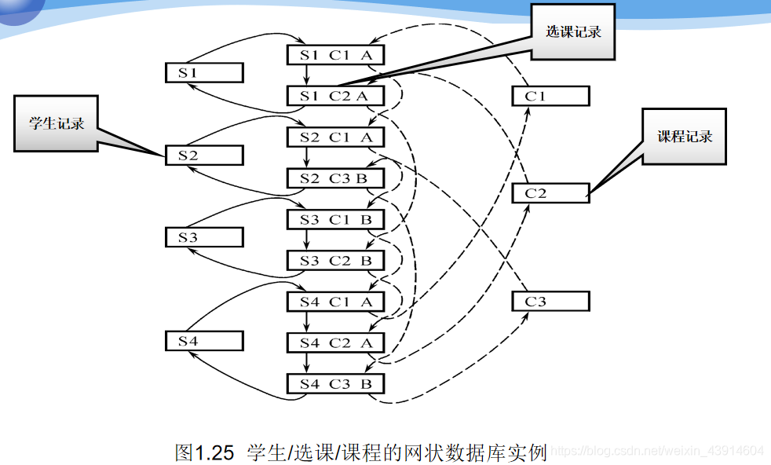

#### ④ 优缺点

-   **优点**  
    能够更为直接地描述现实世界，如一个结点可以有多个双亲；  
    具有良好的性能，存取效率较高；
    
-   **缺点**  
    结构比较复杂，而且随着应用环境的扩大，数据库的结构就变得越来越复杂，不利于最终用户掌握；  
    DDL、DML语言复杂，用户不容易使用；
    

## 6.关系模型

==对集合的操作==：操作对象是集合，操作结果也是集合，而非关系模型，操作对象和操作结果均为单一个体

关系数据库系统采用`关系模型`作为数据的组织方式  
1970年美国IBM公司San Jose研究室的研究员E.F.Codd首次提出了数据库系统的关系模型  
计算机厂商新推出的数据库管理系统几乎都支持关系模型

### （1）数据结构

在用户观点下，`关系模型中数据的逻辑结构`是一张`二维表`，它由`行`和`列`组成。  
**几个名词解释：**

-   `关系`（Relation）  
    一个关系对应通常说的一张表
    
-   `元组`（Tuple）  
    表中的一行即为一个元组
    
-   `属性`（Attribute）  
    表中的一列即为一个属性，给每一个属性起一个名称即属性名
    
-   `主码`（Key）  
    表中的某个`属性组`，它可以`唯一确定一个元组`。
    
-   `域`（Domain）  
    属性的取值范围。
    
-   `分量`  
    元组中的一个属性值。一个个体的属性值
    
-   `关系模式`  
    对关系的描述  
    关系名（属性1，属性2，…，属性n）  
    学生（学号，姓名，年龄，性别，系，年级）  
    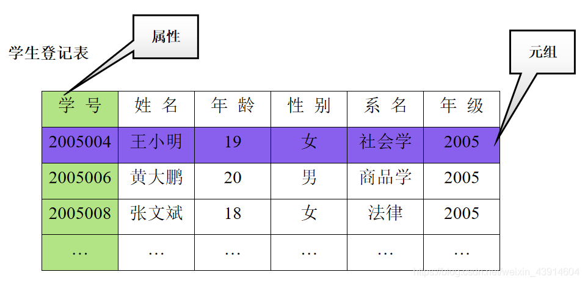  
    **举几个例子：**
    
-   `例1`  
    学生、系、系与学生之间的·`一对多`联系：  
    学生（学号，姓名，年龄，性别，`系号`，年级）  
    系 (`系号`，系名，办公地点)
    
-   `例2`  
    系、系主任、系与系主任间的`一对一`联系
    
-   `例3`  
    学生、课程、学生与课程之间的`多对多`联系：  
    学生（`学号`，姓名，年龄，性别，系号，年级）  
    课程（`课程号`，课程名，学分）  
    选修（`学号`，`课程号`，成绩）
    

**规范化：**

-   关系必须是规范化的，满足一定的规范条件
-   最基本的规范条件：`关系的每一个分量必须是一个不可分的数据项, 不允许表中还有表`
-   图1.27中工资和扣除是可分的数据项 ,不符合关系模型要求  
    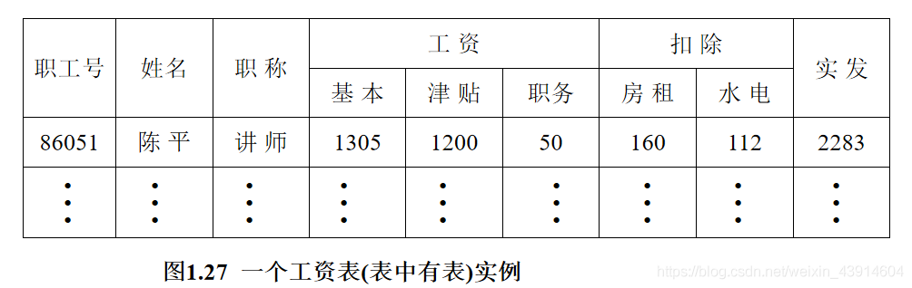

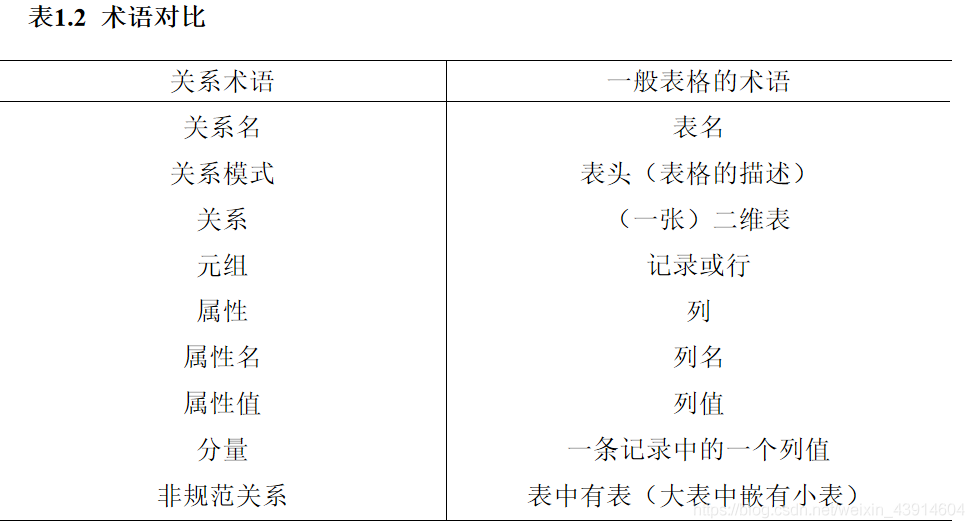

### （2）关系数据模型的操纵与完整性约束

-   `数据操作`是==集合==操作，操作对象和操作结果都是关系  
    查询  
    插入  
    删除  
    更新
    
-   `数据操作是集合操作，操作对象和操作结果都是关系`，即若干元组的集合存取路径对用户隐蔽，用户只要指出“干什么”，不必详细说明“怎么干”==数据封装==
  
-   关系的`完整性约束条件`  
    实体完整性  
    参照完整性  
    用户定义的完整性
    

### （3）存储结构

-   实体及实体间的联系都用`表`来表示
-   表以文件形式存储  
    有的DBMS一个表对应一个操作系统文件；  
    有的DBMS自己设计文件结构；

### （4）优缺点

-   `优点`
    -   建立在严格的数学概念的基础上;
    -   概念单一:  
        实体和各类联系都用关系来表示;  
        对数据的检索结果也是关系;
    -   关系模型的存取路径对用户透明;  
        具有更高的数据独立性，更好的安全保密性  
        简化了程序员的工作和数据库开发建立的工作;
-   `缺点`
    -   存取路径对用户透明导致查询效率往往不如非关系数据模型;
    -   为提高性能，必须对用户的查询请求进行优化,增加了开发DBMS的难度;

## 7.[面向对象](https://so.csdn.net/so/search?q=%E9%9D%A2%E5%90%91%E5%AF%B9%E8%B1%A1&spm=1001.2101.3001.7020)数据模型

-   将`语义数据模型`和`面向对象程序设计方法`结合起来，用`面向对象观点`来描述现实世界`实体`(对象)的`逻辑组织`、`对象间限制`、`联系`等的`模型`。
  
-   一系列面向对象核心概念构成了面向对象数据模型( Object Oriented Data Model, 00模型)的基础，主要包括以下一些概念:
  
    -   (1)现实世界中的任何事物都被建模为对象。每个对象具有一个唯一的对象标识  
        (OID)。
    -   (2)对象是其状态和行为的封装，其中状态是对象属性值的集合，行为是变更对象状  
        态的方法集合。
    -   (3)具有相同属性和方法的对象的全体构成了类，类中的对象称为类的实例。
    -   (4)类的属性的定义域也可以是类，从而构成了类的复合。类具有继承性，一个类可以继承另一个类的属性与方法，被继承类和继承类也称为超类和子类。类与类之间的复合与继承关系形成了一个有向无环图，称为类层次。
    -   (5)对象是被封装起来的，它的状态和行为在对象外部不可见，从外部只能通过对象显式定义的消息传递对对象进行操作。
-   面向对象数据库(OODB)的研究始于20世纪80年代，有许多面向对象数据库产品相继问世，较著名的有Object Store、02、ONTOS等。
  
-   与传统数据库一样，面向对象数据库系统对数据的操纵包括数据查询、增加、删除、修改等，也具有并发控制、故障恢复、存储管理等完整的功能。不仅能支持传统数据库应用，也能支持非传统领域的应用，包括CAD/CAM、OA、CIMS、GIS以及图形、图像等多媒体领域、工程领域和数据集成等领域。
  
-   尽管如此，由于面向对象数据库操作语言过于复杂，没有得到广大用户，特别是开发人员的认可，加上面向对象数据库企图完全替代关系数据库管理系统的思路，增加了企业系统升级的负担，客户不接受，·`面向对象数据库产品终究没有在市场上获得成功。`
  

## 8.对象关系模型

-   `对象关系数据库系统`(Object Relational DataBase System, ORDBS) 是`关系数据库`与`面向对象数据库`的结合。
-   它保持了关系数据库系统的非过程化数据存取方式和数据独立性，继承了关系数据库系统已有的技术，支持原有的数据管理，又能支持00模型和对象管理。各数据库厂商都在原来的产品基础上进行了扩展。
-   1999 年发布的SQL标准(也称为SQL99)，增加了SQL/Object Language Binding, 提供了面向对象的功能标准。SQL99对ORDBS标准的制定滞后于实际系统的实现。所以各个ORDBS产品在支持对象模型方面虽然思想一致，但是所采用的术语、语言语法、扩展的功能都不尽相同。