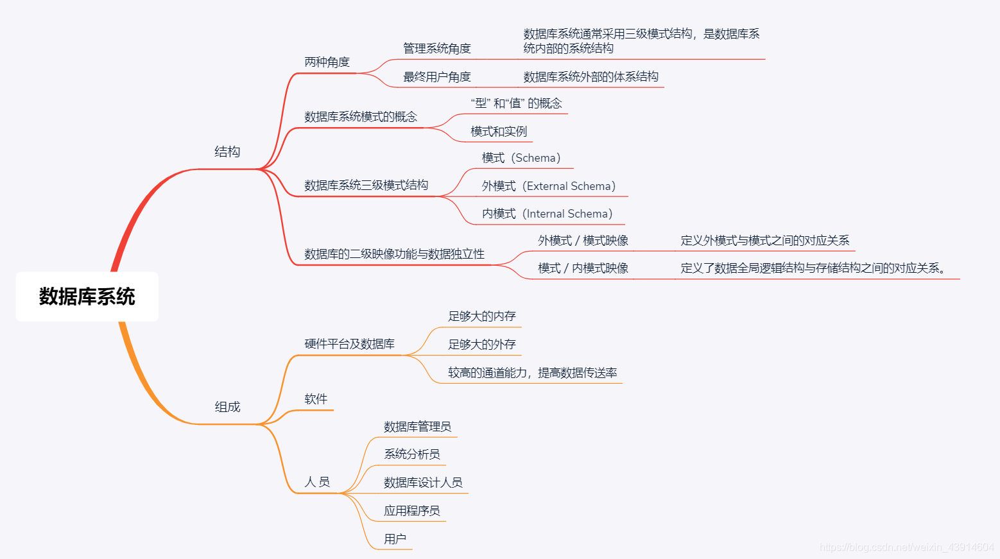
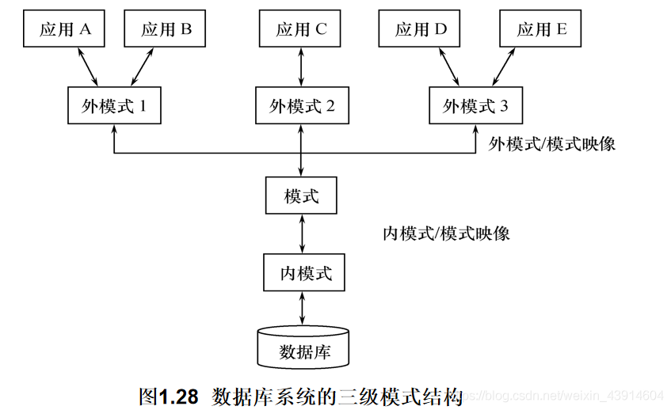
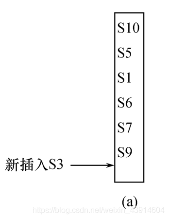
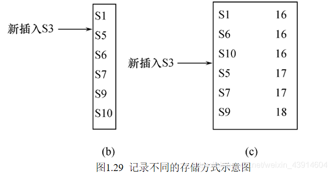
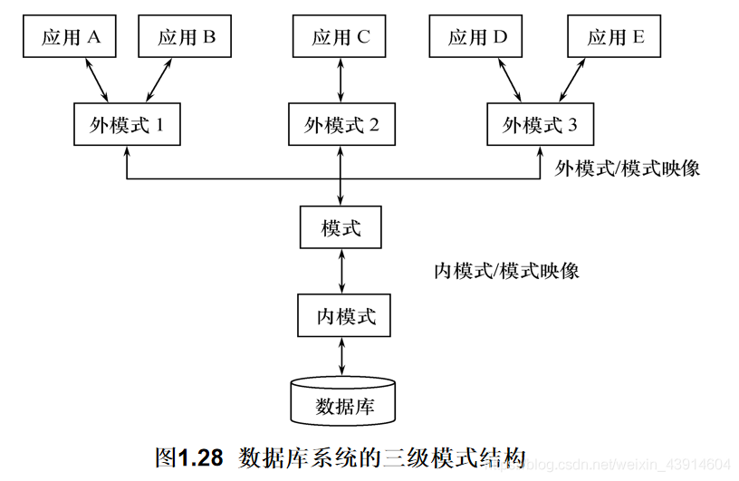
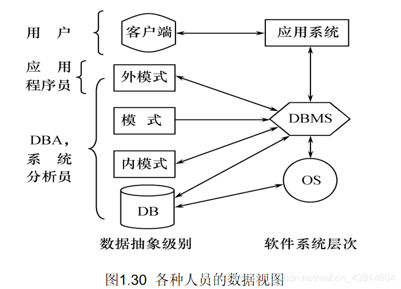

## 0.思维导图



## 1.数据库系统结构

### （1）两种角度

-   从数据库`管理系统角度`看，数据库系统通常采用三级模式结构，是数据库系统`内部`的系统结构
  
-   从数据库`最终用户角度`看（数据库系统`外部`的体系结构） ，数据库系统的结构分为:  
    单用户结构  
    主从式结构  
    分布式结构  
    客户／服务器  
    浏览器／应用服务器／数据库服务器多层结构等
    

### （2）数据库系统模式的概念

> 来自张教授的解疑：`模式是数据库结构的描述、关系模式是表的结构的描述`;==数据的结构以及其联系：个体与个体，属性与属性==

**“型” 和“值” 的概念**

-   型(Type)  
    对某一类数据的结构和属性的说明
-   值(Value)  
    是型的一个具体赋值

**例如**  
学生记录型：  
（学号，姓名，性别，系别，年龄，籍贯）  
一个记录值：  
（900201，李明，男，计算机，22，江苏）

**模式（Schema）**

-   `数据库逻辑结构和特征的描述`
-   `是型的描述`
-   反映的是数据的结构及其联系
-   模式是相对稳定的

**实例（Instance）**

-   模式的一个具体值
-   `反映数据库某一时刻的状态`
-   `同一个模式可以有很多实例`
-   实例随数据库中的数据的更新而变动

**`一个数据库只有一个模式，可以把模式看成唯一的数据库，实例就是数据库里面的多个表`**

`例如`：在学生选课`数据库模式`中，包含学生记录、课程记录和学生选课记录

-   2003年的一个学生数据库`实例`，包含：  
    2003年学校中所有学生的记录  
    学校开设的所有课程的记录  
    所有学生选课的记录
-   `2002`年度学生`数据库模式对应的实例`与`2003`年度学生`数据库模式对应的实例`是不同的

### （3）数据库系统的三级模式结构



#### ① 模式（[Schema](https://so.csdn.net/so/search?q=Schema&spm=1001.2101.3001.7020)）

**模式（也称逻辑模式）**

-   数据库中==全体==`数据的逻辑结构和特征的描述`
-   所有`用户的公共数据视图`，综合了所有用户的需求

**`一个数据库只有一个模式，可以把模式看成唯一的数据库，实例就是数据库里面的多个表`**

**模式的地位：是数据库系统模式结构的中间层**

-   与数据的物理存储细节和硬件环境无关
-   与具体的应用程序、开发工具及高级程序设计语言无关

**模式的定义:**

-   数据的逻辑结构（数据项的名字、类型、取值范围等）
-   数据之间的联系
-   数据有关的安全性、完整性要求

#### ② 外模式（External Schema）

**外模式（也称子模式或用户模式）**模式的一个子集，为不同用户生成不同的外模式

-   数据库用户（包括应用程序员和最终用户）使用的`局部`数据的逻辑结构和特征的描述
-   数据库用户的数据视图，是与某一应用有关的数据的逻辑表示，`可以看成把数据库的部分数据，运用在不同的应用程序上，在UI界面上显示`

**`一个数据库只有一个模式，可以把模式看成唯一的数据库，实例就是数据库里面的多个表`**  
**外模式的地位：介于模式与应用之间**

-   模式与外模式的关系：一对多  
    外模式通常是模式的子集;  
    一个`数据库`可以有多个`外模式`。反映了不同的用户的应用需求、看待数据的方式、对数据保密的要求;  
    对模式中同一数据，在外模式中的结构、类型、长度、保密级别等都可以不同;
-   外模式与应用的关系：一对多  
    同一外模式也可以为某一用户的多个应用系统所使用;  
    但一个应用程序只能使用一个外模式;`可以看成把数据库的部分数据，运用在不同的应用程序上，在UI界面上显示`

**外模式的用途**

-   保证数据库安全性的一个有力措施；
-   每个用户只能看见和访问所对应的外模式中的数据；

#### ③ 内模式（Internal Schema）

**内模式（也称存储模式）**物理描述

-   是数据`物理结构和存储方式`的描述
-   是`数据`在`数据库内部`的表示方式:
    -   记录的存储方式（顺序存储，按照B树结构存储，  
        按hash方法存储）
    -   索引的组织方式
    -   数据是否压缩存储
    -   数据是否加密
    -   数据存储记录结构的规定
-   `一个数据库只有一个内模式`

`·例如`学生记录，如果按`堆`存储，则插入一条新记录总是放在学生记录存储的`最后`.  


-   如果按·`学号升序存储`，则插入一条记录就要`找到它应在的位置插入`，如图1.29（b）所示
-   如果按照学生`年龄聚簇存放`，`假如`新插入的`S3`是`16岁`，则应插入的位置如图1.29（c）所示  
    

#### ④ 数据库模式、外模式、内模式总结

  
**`数据库模式`**

-   即全局逻辑结构是数据库的中心与关键
-   独立于数据库的其他层次
-   设计数据库模式结构时应首先确定数据库的逻辑模式

**`数据库的外模式`**

-   面向具体的应用程序
-   定义在逻辑模式之上
-   独立于存储模式和存储设备
-   当应用需求发生较大变化，相应外模式不能满足其视图要求时，该外模式就得做相应改动
-   设计外模式时应充分考虑到应用的扩充性

**`数据库的内模式`**

-   依赖于它的全局逻辑结构
-   独立于具体的存储设备
-   将全局逻辑结构中所定义的数据结构及其联系按照一定的物理存储策略进行组织，以达到较好的时间与空间效率

### （4）数据库的二级映像功能与数据独立性

-   ·`三级模式是对数据的三个抽象级别`
  
-   `二级映象`在DBMS内部实现这`三个抽象层次`的`联系`和`转换`
  
    -   外模式／模式映像
    -   模式／内模式映像  
        

#### ① 外模式／模式映象

-   模式：描述的是数据的`全局`逻辑结构
-   外模式：描述的是数据的`局部`逻辑结构
-   同`一个模式`可以有任意`多个外模式`
-   每一个外模式，数据库系统都有一个`外模式／模式映象`，定义外模式与模式之间的对应关系,看成数据库的数据与API调用的部分数据之间的关系(I think)
-   映象定义通常包含在各自外模式的描述中

**保证数据的逻辑独立性**

-   当`模式改变`时，数据库管理员`修改有关的外模式／模式映象`，使`外模式`保持`不变`
-   应用程序是依据数据的外模式编写的，从而应用程序不必修改，保证了数据与程序的逻辑独立性，简称`数据的逻辑独立性`。

#### ② 模式／内模式映象

**模式／内模式映象定义了`数据全局逻辑结构`与`存储结构之间`的对应关系。**

```
  例如，说明逻辑记录和字段在内部是如何表示的
```

-   数据库中`模式／内模式映象`是`唯一`的
-   该映象定义通常包含在模式描述中

**保证数据的物理独立性**

-   当数据库的`存储结构改变`了（例如选用了另一种存储结构），数据库管理员`修改模式／内模式映象`，使模式保持`不变`.
-   应用程序不受影响。保证了数据与程序的物理独立性，简称`数据的物理独立性`。

**特定的应用程序**

-   在外模式描述的数据结构上编制的
-   依赖于特定的外模式
-   与数据库的模式和存储结构独立  
    不同的应用程序有时可以共用同一个外模式

**数据库的二级映像**

-   保证了数据库外模式的稳定性
-   从底层保证了应用程序的稳定性，除非应用需求本身发生变化，否则应用程序一般不需要修改

**数据与程序之间的独立性，使得数据的定义和描述可以从应用程序中分离出去**

**数据的存取由DBMS管理**

-   用户不必考虑存取路径等细节
-   简化了应用程序的编制
-   大大减少了应用程序的维护和修改

## 2.数据库的组成

-   数据库
-   数据库管理系统（及其开发工具）
-   应用系统
-   数据库管理员
-   硬件平台及数据库
-   软件
-   人员

### （1）硬件平台及数据库

**数据库系统对硬件资源的要求**

-   (1) 足够大的内存
  
    -   操作系统
    -   DBMS的核心模块
    -   数据缓冲区
    -   应用程序
-   (2) 足够大的外存
  
    -   磁盘或磁盘阵列
    -   数据库
    -   光盘、磁带
    -   数据备份
-   (3) 较高的通道能力，提高数据传送率
  

### （2） 软件

-   DBMS
-   支持DBMS运行的操作系统
-   与数据库接口的高级语言及其编译系统
-   以DBMS为核心的应用开发工具
-   为特定应用环境开发的数据库应用系统

### （3）人 员

-   数据库管理员
-   系统分析员和数据库设计人员
-   应用程序员
-   用户

不同的人员涉及不同的数据抽象级别，具有不同的数据视图，如下图所示  


##### ① 数据库管理员(DBA)

**具体职责：**  
1.决定数据库中的信息内容和结构  
2.决定数据库的存储结构和存取策略  
3.定义数据的安全性要求和完整性约束条件  
4.监控数据库的使用和运行

-   周期性转储数据库
-   数据文件
-   日志文件
-   系统故障恢复
-   介质故障恢复
-   监视审计文件

5.数据库的改进和重组

-   性能监控和调优
-   定期对数据库进行==重组织==，以提高系统的性能
-   需求增加和改变时，数据库须需要重构造

##### ② 系统分析员

**具体职责：**

-   负责应用系统的需求分析和规范说明
-   与用户及DBA协商，确定系统的硬软件配置
-   参与数据库系统的概要设计

##### ③ 数据库设计人员

**具体职责：**

-   参加用户需求调查和系统分析
-   确定数据库中的数据
-   设计数据库各级模式

##### ④ 应用程序员

**具体职责：**

-   设计和编写应用系统的程序模块
-   进行调试和安装

##### ⑤ 用户

用户是指最终用户（End User）。  
最终用户通过应用系统的用户接口使用数据库。  
1.偶然用户

-   不经常访问数据库，但每次访问数据库时往往需要不同的数据库信息
-   企业或组织机构的高中级管理人员

2.简单用户

-   主要工作是查询和更新数据库
-   银行的职员、机票预定人员、旅馆总台服务员

3.复杂用户

-   工程师、科学家、经济学家、科技工作者等
-   直接使用数据库语言访问数据库，甚至能够基于数据库管理系统的API编制自己的应用程序