多用户数据库系统  
允许多个用户同时使用的数据库系统

多事务执行方式  
（1）事务串行执行  
每个时刻只有一个事务运行，其他事务必须等到这个事务结束以后方能运行  
不能充分利用系统资源，发挥数据库共享资源的特点  
（2）交叉并发方式  
在单处理机系统中，事务的并行执行是这些并行事务的并行操作轮流交叉运行  
单处理机系统中的并行事务并没有真正地并行运行，但能够减少处理机的空闲时间，提高系统的效率  
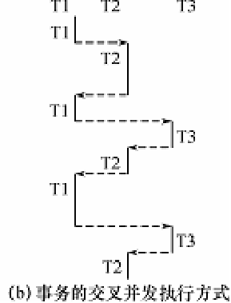  
3）同时并发方式（simultaneous concurrency)  
多处理机系统中，每个处理机可以运行一个事务，多个处理机可以同时运行多个事务，实现多个事务真正的并行运行  
最理想的并发方式，但受制于硬件环境  
更复杂的并发方式机制

以下讨论的数据库系统并发控制技术是以单处理机系统为基础的

**一、并发控制概述**  
事务是并发控制的季基本单位  
并发控制机制的任务  
1）保证并发操作进行正确调度  
2）保证事务的隔离性  
3）保证数据库的一致性

并发操作带来的数据不一致性  
1）丢失修改  
2）不可重复读  ：T~1~读取数据后，T~2~执行更新操作，使T~1~再读数据时，与原先结果不一样，一般三种情况导致，T~2~修改数据，添加数据，删除数据
3）读“脏”数据：前一个事务为提交便读了，错误的数据

**1\. 丢失修改**  
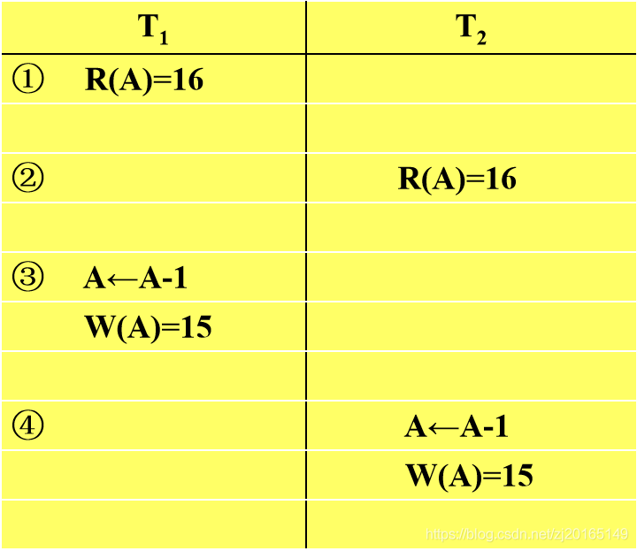  
**2\. 不可重复读**  
不可重复读是指事务T1读取数据后，事务T2执行更新操作，使T1无法再现前一次读取结果。  
三种情况  
（1）事务T1读取某一数据后，事务T2对其做了修改，当事务T1再次读该数据时，得到与前一次不同的值  
  
（2）事务T1按一定条件从数据库中读取了某些数据记录后，事务T2删除了其中部分记录，当T1再次按相同条件读取数据时，发现某些记录神秘地消失了。  
（3)事务T1按一定条件从数据库中读取某些数据记录后，事务T2插入了一些记录，当T1再次按相同条件读取数据时，发现多了一些记录。

后两种不可重复读有时也称为幻影现象（Phantom Row）

**3\. 读“脏”数据**  
事务T1修改某一数据，并将其写回磁盘  
事务T2读取同一数据后，T1由于某种原因被撤销  
这时T1已修改过的数据恢复原值，T2读到的数据就与数据库中的数据不一致  
T2读到的数据就为“脏”数据，即不正确的数据  
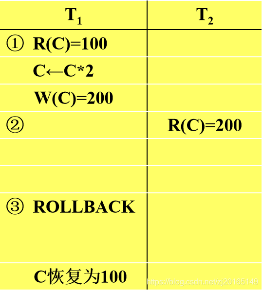

数据不一致性：由于并发操作破坏了事务的隔离性

并发控制就是要用正确的方式调度并发操作，使一个用户事务的执行不受其他事务的干扰，从而避免造成数据的不一致性

**并发控制主要技术**  
封锁(Locking)  
时间戳(Timestamp)  
乐观控制法  
多版本并发控制(MVCC)

| 悲观                                       | 乐观                                                         |
| ------------------------------------------ | ------------------------------------------------------------ |
| 封锁(Locking)                              | 时间戳(Timestamp)、乐观控制法                                |
| 认为这种冲突经常发生，加锁，不让其发生冲突 | 认为冲突不经常发生，让事务自由执行，执行后检查是否发生冲突，冲突回滚 |

**二、封锁**  
**1\. 什么是封锁**  
封锁就是事务T在对某个数据对象（例如表、记录等）操作之前，先向系统发出请求，对其加锁  
加锁后事务T就对该数据对象有了一定的控制，在事务T释放它的锁之前，其它的事务不能更新此数据对象。  
封锁是实现并发控制的一个非常重要的技术  
**2\. 基本封锁类型**  
排它锁（Exclusive Locks，简记为X锁）  
共享锁（Share Locks，简记为S锁）  
（1）排它锁  
排它锁又称为写锁  
若事务T对数据对象A加上X锁，则只允许T读取和修改A，其它任何事务都不能再对A加任何类型的锁，直到T释放A上的锁  
（2）共享锁  
共享锁又称为读锁  
若事务T对数据对象A加上S锁，则事务T可以读A但不能修改A，其它事务只能再对A加S锁，而不能加X锁，直到T释放A上的S锁

多个事务只能添加共享锁到同一对象

**锁的相容矩阵**  
Y=Yes，相容的请求  
N=No，不相容的请求

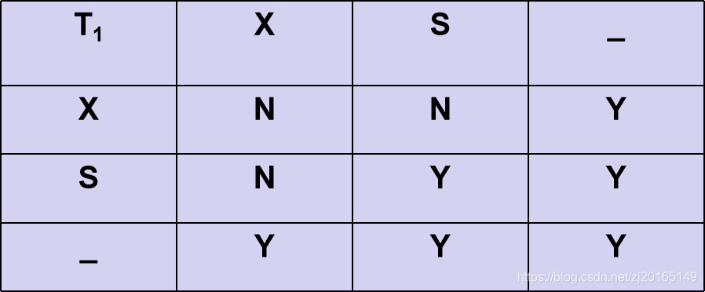

**三、封锁协议**  
**1\. 什么是封锁协议**  
在运用X锁和S锁对数据对象加锁时，需要约定一些规则，这些规则为封锁协议（Locking Protocol）。  
（1）何时申请X锁或S锁  
（2）持锁时间  
（3）何时释放  
对封锁方式规定不同的规则，就形成了各种不同的封锁协议，它们分别在不同的程度上为并发操作的正确调度提供一定的保证。  
**2\. 三级封锁协议**

二、三级均是建立在一级的基础上

| 一级封锁协议                                            | 二级封锁协议                                                 | 三级封锁协议                                                 |
| ------------------------------------------------------- | ------------------------------------------------------------ | ------------------------------------------------------------ |
| 事务T在修改数据R之前必须先对其加X锁，直到事务结束才释放 | 一级封锁协议内容+事务T在读取数据R之前必须先对其加S锁，读完后即可释放S锁   （单一数据操作完解锁） | 一级封锁协议+事务T在读取数据R之前必须先对其加S锁，直到事务结束才释放  （事务完成后解锁） |
| 可防止丢失修改                                          | 可防止丢失修改和“脏读”                                       | 可防止丢失修改、“脏读”和“”不可重复读“”                       |

**（1）一级封锁协议**  
事务T在修改数据R之前必须先对其加X锁，直到事务结束才释放。  
正常结束（COMMIT）  
非正常结束（ROLLBACK）  
一级封锁协议可防止丢失修改，并保证事务T是可恢复的。  
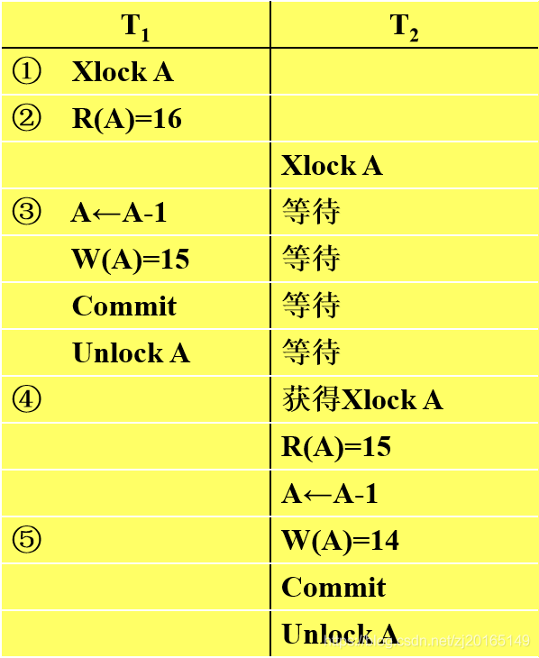  
①事务T1在读A进行修改之前先对A加X锁  
②当T2再请求对A加X锁时被拒绝  
③T2只能等待T1释放A上的锁后获得对A的X锁  
④这时T2读到的A已经是T1更新过的值15  
⑤T2按此新的A值进行运算，并将结果值A=14写回到磁盘。避免了丢失T1的更新。

在一级封锁协议中，如果仅仅是读数据不对其进行修改，是不需要加锁的，所以它不能保证可重复读和不读“脏”数据。

**（2）二级封锁协议**  
一级封锁协议加上事务T在读取数据R之前必须先对其加S锁，读完后即可释放S锁。

二级封锁协议可以防止丢失修改和读“脏”数据。  
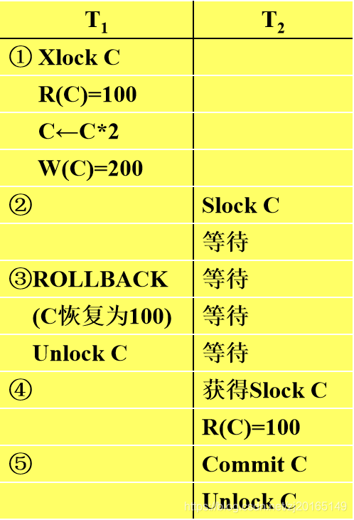  
①事务T1在对C进行修改之前，先对C加X锁，修改其值后写回磁盘  
②T2请求在C上加S锁，因T1已在C上加了X锁，T2只能等待  
③T1因某种原因被撤销，C恢复为原值100  
④T1释放C上的X锁后T2获得C上的S锁，读C=100。避免了T2读“脏”数据

在二级封锁协议中，由于读完数据后即可释放S锁，所以它不能保证可重复读。

**（3）三级封锁协议**  
一级封锁协议加上事务T在读取数据R之前必须先对其加S锁，直到事务结束才释放。

三级封锁协议可防止丢失修改、读脏数据和不可重复读。  
三级封锁协议可防止丢失修改、读脏数据和不可重复读。  
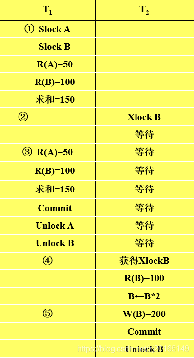  
①事务T1在读A，B之前，先对A，B加S锁  
其他事务只能再对A，B加S锁，而不能加X锁，即其他②事务只能读A，B，而不能修改  
③当T2为修改B而申请对B的X锁时被拒绝只能等待T1释放B上的锁  
④T1为验算再读A，B，这时读出的B仍是100，求和结果仍为150，即可重复读  
⑤T1结束才释放A，B上的S锁。T2才获得对B的X锁

（4）封锁协议小结  
三级协议的主要区别  
什么操作需要申请封锁以及何时释放锁（即持锁时间）  
不同的封锁协议使事务达到的一致性级别不同

封锁协议级别越高，一致性程度越高  
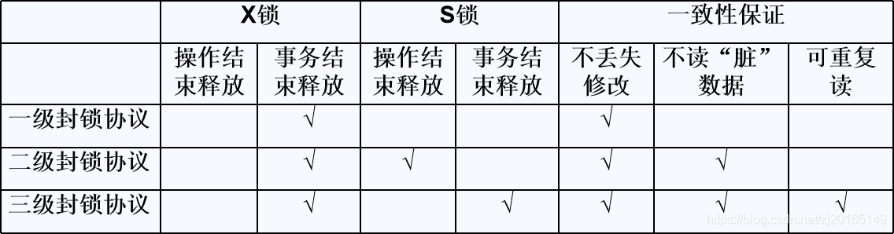

**四、活锁和死锁**  
封锁技术可以有效地解决并行操作的一致性问题，但也带来一些新的问题  
①死锁  
②活锁

| 活锁                                                         | 死锁                                                         |
| ------------------------------------------------------------ | ------------------------------------------------------------ |
| 某事务由于优先级低，处于无限等待                             | T1在等待T2，而T2又在等待T1，T1和T2两个事务永远不能结束，形成死锁 |
| 采用先来先服务的策略。当多个事务请求封锁同一数据对象时，按请求封锁的先后次序对这些事务排队，该数据对象上的锁一旦释放，首先批准申请队列中第一个事务获得锁 | 解决死锁的方法（1）死锁的预防1）一次封锁法：要求每个事务必须一次将所有要使用的数据全部加锁，否则就不能继续执行2）顺序封锁法：预先对数据对象规定一个封锁顺序，所有事务都按这个顺序实行封锁。（2）死锁的诊断与解除。死锁诊断1）超时法：如果一个事务的等待时间超过了规定的时限，就认为发生了死锁2）等待图法：用事务等待图动态反映所有事务的等待情况。解除死锁1）选择一个处理死锁代价最小的事务，将其撤消。2）释放此事务持有的所有的锁，使其它事务能继续运行下去 |
|                                                              | 产生死锁的原因==是两个或多个事务都已封锁了一些数据对象，然后又都请求对已为其他事务封锁的数据对象加锁，从而出现死等待。 |

**1\. 活锁**  
😊事务T1封锁了数据R  
😊事务T2又请求封锁R，于是T2等待。  
😊T3也请求封锁R，当T1释放了R上的封锁之后系统首先批准了T3的请求，T2仍然等待。  
😊T4又请求封锁R，当T3释放了R上的封锁之后系统又批准了T4的请求……  
😊T2有可能永远等待，这就是活锁的情形  
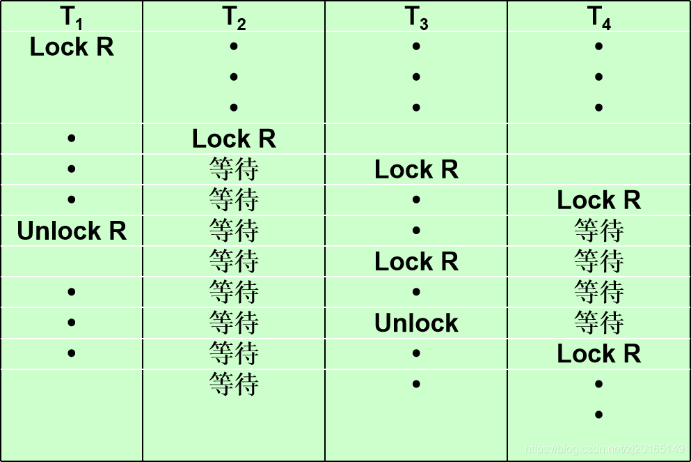  
避免活锁：采用先来先服务的策略  
当多个事务请求封锁同一数据对象时  
按请求封锁的先后次序对这些事务排队  
该数据对象上的锁一旦释放，首先批准申请队列中第一个事务获得锁  
**2\. 死锁**  

两个事务同时锁住了对方需要的数据

😊事务T1封锁了数据R1  
😊T2封锁了数据R2  
😊T1又请求封锁R2，因T2已封锁了R2，于是T1等待T2释放R2上的锁  
😊接着T2又申请封锁R1，因T1已封锁了R1，T2也只能等待T1释放R1上的锁  
😊这样T1在等待T2，而T2又在等待T1，T1和T2两个事务永远不能结束，形成死锁  
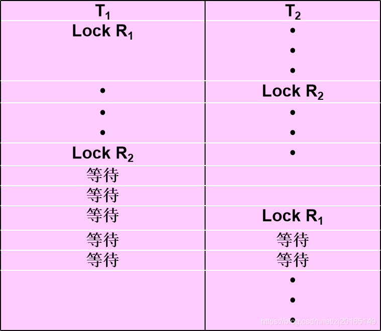

解决死锁的方法  
1）死锁的预防  
2）死锁的诊断与解除

产生死锁的原因是两个或多个事务都已封锁了一些数据对象，然后又都请求对已为其他事务封锁的数据对象加锁，从而出现死等待。  
**（1）死锁预防**  
预防死锁的发生就是要破坏产生死锁的条件  
两种方法  
**1）一次封锁法**  
要求每个事务必须一次将所有要使用的数据全部加锁，否则就不能继续执行  
存在的问题：  
①降低系统并发度  
②难于事先精确确定封锁对象  
数据库中数据是不断变化的，原来不要求封锁的数据，在执行过程中可能会变成封锁对象，所以很难事先精确地确定每个事务所要封锁的数据对象。  
解决方法：将事务在执行过程中可能要封锁的数据对象全部加锁，这就进一步降低了并发度。  
**2）顺序封锁法**  
预先对数据对象规定一个封锁顺序，所有事务都按这个顺序实行封锁。  
存在的问题：  
①维护成本  
数据库系统中封锁的数据对象极多，并且随数据的插入、删除等操作而不断地变化，要维护这样的资源的封锁顺序非常困难，成本很高。  
②难以实现  
事务的封锁请求可以随着事务的执行而动态地决定，很难事先确定每一个事务要封锁哪些对象，因此也就很难按规定的顺序去施加封锁。

结论：在操作系统中广为采用的预防死锁的策略并不太适合数据库的特点  
数据库管理系统在解决死锁的问题上更普遍采用的是诊断并解除死锁的方法

**（2）死锁诊断与解除**  
**死锁诊断**  
**1）超时法**  
如果一个事务的等待时间超过了规定的时限，就认为发生了死锁  
优点：实现简单  
缺点：①有可能误判死锁②时限若设置得太长，死锁发生后不能及时发现  
2）等待图法  
用事务等待图动态反映所有事务的等待情况  
😊事务等待图是一个有向图G=(T，U)  
😊T为结点的集合，每个结点表示正运行的事务  
😊U为边的集合，每条边表示事务等待的情况  
😊若T1等待T2，则T1，T2之间划一条有向边，从T1指向T2  
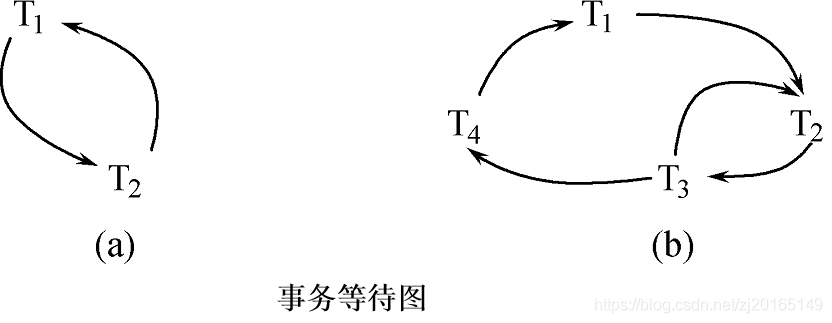  
图(a)中，事务T1等待T2，T2等待T1，产生了死锁  
图(b)中，事务T1等待T2，T2等待T3，T3等待T4，T4又等待T1，产生了死锁  
图(b)中，事务T3可能还等待T2，在大回路中又有小的回路

并发控制子系统周期性地（比如每隔数秒）生成事务等待图，检测事务。如果发现图中存在回路，则表示系统中出现了死锁。

**解除死锁**  
①选择一个处理死锁代价最小的事务，将其撤消  
②释放此事务持有的所有的锁，使其它事务能继续运行下去

**五、并发调度的可串行性**  
数据库管理系统对并发事务不同的调度可能会产生不同的结果  
串行调度是正确的  
执行结果等价于串行调度的调度也是正确的，称为可串行化调度

**1\. 可串行化调度**  
（1）可串行化(Serializable)调度  
多个事务的并发执行是正确的，当且仅当其结果与按某一次序串行地执行这些事务时的结果相同  
（2）可串行性(Serializability)  
一个给定的并发调度，当且仅当它是可串行化的，才认为是正确调度

**2\. 冲突可串行化调度**  
它是一个比可串行化更严格的条件，若一个调度是冲突可串行化，则一定是可串行化的调度。

**冲突操作**：是指不同的事务对同一数据的读写操作和写写操作：  
其他操作是不冲突操作

**不能交换（swap）的操作**  
①同一事务的两个操作  
②不同事务的冲突操作

**冲突可串行化的调度**  
一个调度Sc在保证冲突操作的次序不变的情况下，通过交换两个事务不冲突操作的次序得到另一个调度Sc’，如果Sc’是串行的，称调度Sc是冲突可串行化的调度。

可用这种方法判断一个调度是否是冲突可串行化的

冲突可串行化调度是可串行化调度的充分条件，不是必要条件。还有不满足冲突可串行化条件的可串行化调度。  
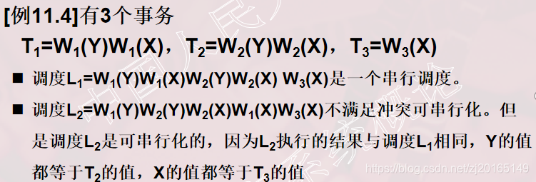

**六、两段锁协议**  
数据库管理系统普遍采用两段锁协议的方法实现并发调度的可串行性，从而保证调度的正确性 。

**两段锁协议**  
指所有事务必须分两个阶段对数据项加锁和解锁

😉在对任何数据进行读、写操作之前，事务首先要获得对该数据的封锁  
😉在释放一个封锁之后，事务不再申请和获得任何其他封锁

**“两段”锁含义**  
事务分为两个阶段  
①第一阶段是获得封锁，也称为扩展阶段  
事务可以申请获得任何数据项上的任何类型的锁，但是不能释放任何锁  
②第二阶段是释放封锁，也称为收缩阶段  
事务可以释放任何数据项上的任何类型的锁，但是不能再申请任何锁  
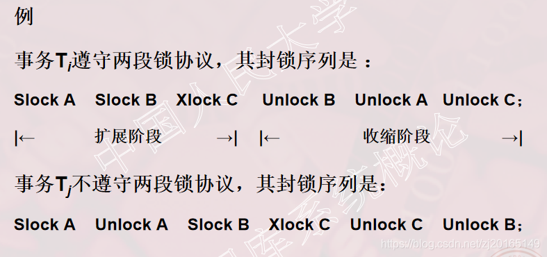

**两段锁协议和可串行化调度的关系**  
事务遵守两段锁协议是可串行化调度的充分条件，而不是必要条件。  
即“两段锁协议”一定是“可串行化调度”，反之不然。

**两段锁协议与防止死锁的一次封锁法**  
一次封锁法遵守两段锁协议  
但是两段锁协议并不要求事务必须一次将所有要使用的数据全部加锁，因此遵守两段锁协议的事务可能发生死锁

遵循两段锁协议发生死锁的的情况  
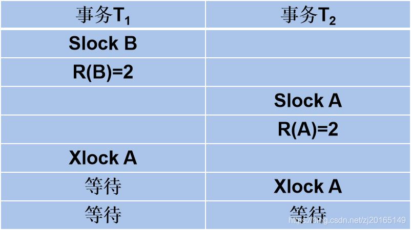

**七、封锁的粒度**  
封锁对象的大小称为封锁粒度(Granularity)

**封锁的对象:逻辑单元，物理单元**  
例：在关系数据库中，封锁对象：  
逻辑单元: 属性值、属性值的集合、元组、关系、索引项、整个索引、整个数据库等  
物理单元：页（数据页或索引页）、物理记录等

**封锁粒度与系统的并发度和并发控制的开销密切相关。**  
①封锁的粒度越大，数据库所能够封锁的数据单元就越少，并发度就越小，系统开销也越小；  
②封锁的粒度越小，并发度较高，但系统开销也就越大

**多粒度封锁(Multiple Granularity Locking)**  
在一个系统中同时支持多种封锁粒度供不同的事务选择

**选择封锁粒度**  
同时考虑封锁开销和并发度两个因素, 适当选择封锁粒度  
①需要处理多个关系的大量元组的用户事务：以数据库为封锁单位  
②需要处理大量元组的用户事务：以关系为封锁单元  
③只处理少量元组的用户事务：以元组为封锁单位

**1\. 多粒度封锁**  
（1）多粒度树  
①以树形结构来表示多级封锁粒度  
②根结点是整个数据库，表示最大的数据粒度  
③叶结点表示最小的数据粒度  
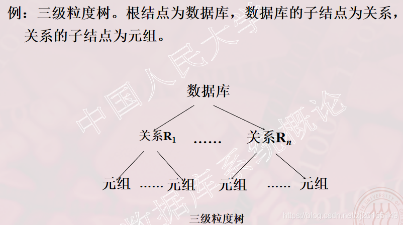  
允许多粒度树中的每个结点被独立地加锁

对一个结点加锁意味着这个结点的所有后裔结点也被加以同样类型的锁

在多粒度封锁中一个数据对象可能以两种方式封锁：显式封锁和隐式封锁，二者效果一样  
1）显式封锁: 直接加到数据对象上的封锁  
2）隐式封锁:是该数据对象没有独立加锁，是由于其上级结点加锁而使该数据对象加上了锁

系统检查封锁冲突时  
要检查显式封锁  
还要检查隐式封锁  
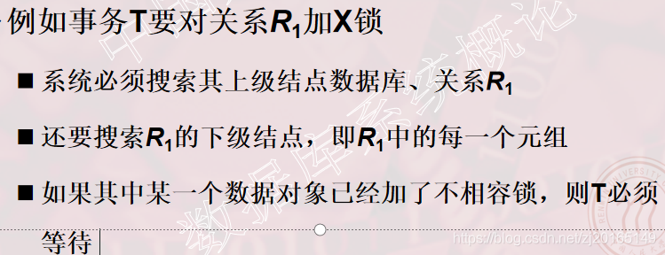

对某个数据对象加锁，系统要检查  
①该数据对象  
有无显式封锁与之冲突  
②所有上级结点  
检查本事务的显式封锁是否与该数据对象上的隐式封锁冲突：(由上级结点已加的封锁造成的）  
③所有下级结点  
看上面的显式封锁是否与本事务的隐式封锁（将加到下级结点的封锁）冲突

**2\. 意向锁**  
（1）引进意向锁（intention lock）目的  
提高对某个数据对象加锁时系统的检查效率

（2）意向锁  
①如果对一个结点加意向锁，则说明该结点的下层结点正在被加锁  
②对任一结点加基本锁，必须先对它的上层结点加意向锁  
例如，对任一元组加锁时，必须先对它所在的数据库和关系加意向锁

（3）常用的意向锁  
①意向共享锁(Intent Share Lock，简称IS锁)  
②意向排它锁(Intent Exclusive Lock，简称IX锁)  
③共享意向排它锁(Share Intent Exclusive Lock，简称SIX锁)

1）IS锁  
如果对一个数据对象加IS锁，表示它的后裔结点拟（意向）加S锁。  
例如：事务T1要对R1中某个元组加S锁，则要首先对关系R1和数据库加IS锁  
2）IX锁  
如果对一个数据对象加IX锁，表示它的后裔结点拟（意向）加X锁。  
例如：事务T1要对R1中某个元组加X锁，则要首先对关系R1和数据库加IX锁  
3）SIX锁  
如果对一个数据对象加SIX锁，表示对它加S锁，再加IX锁，即SIX = S + IX。  
例：对某个表加SIX锁，则表示该事务要读整个表（所以要对该表加S锁），同时会更新个别元组（所以要对该表加IX锁）。

意向锁的相容矩阵

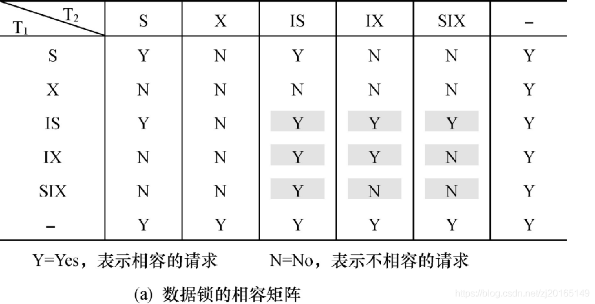

（4）锁的强度  
锁的强度是指它对其他锁的排斥程度  
一个事务在申请封锁时以强锁代替弱锁是安全的，反之则不然  
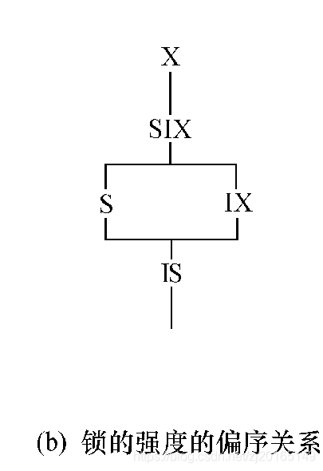

（5）具有意向锁的多粒度封锁方法  
申请封锁时应该按自上而下的次序进行  
释放封锁时则应该按自下而上的次序进行

  
具有意向锁的多粒度封锁方法优点  
①提高了系统的并发度  
②减少了加锁和解锁的开销  
③在实际的数据库管理系统产品中得到广泛应用

**九、小结**  

  
