___

## 0.前言

-   此文章是根据《数据库系统概论》王珊老师编写的教材做的笔记和总结，关于用到的表在我的另一篇文章里面[《数据库系统概论》之数据查询—SELECT（单表查询、连接查询、嵌套查询、集合查询、多表查询）](https://blog.csdn.net/weixin_43914604/article/details/105171740)
-   数据库是SQL Sever
-   数据库管理系统是Navicat Premium 15

## 1.思维导图

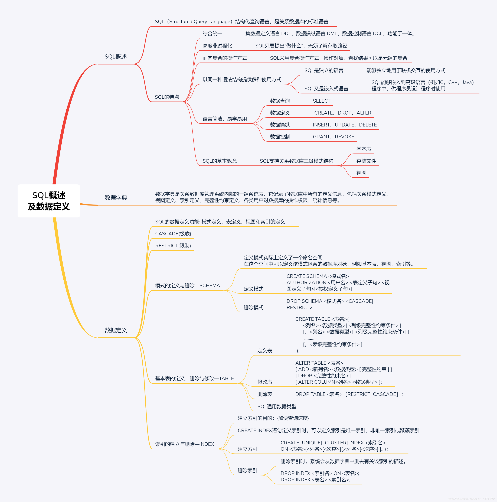

## 2.SQL概述

### （1）什么是SQL?

-   SQL（Structured Query Language）结构化查询语言，是关系数据库的标准语言
-   SQL是一个通用的、功能极强的关系数据库语言

### （2）SQL的特点

**① 综合统一**

-   集数据定义语言 DDL(Data Definition Language)，数据操纵语言 DML（Data Manipulation Language），数据控制语言 DCL(Data Control Language) 功能于一体。
-   可以独立完成数据库生命周期中的全部活动：
    -   定义关系模式，插入数据，建立数据库；
    -   对数据库中的数据进行查询和更新；
    -   数据库重构和维护
    -   数据库安全性、完整性控制等
-   用户数据库投入运行后，可根据需要随时逐步修改模式，不影响数据的运行。
-   数据操作符统一

**② 高度非过程化**

-   非关系数据模型的数据操纵语言“面向过程”，必须制定存取路径
-   SQL只要提出“做什么”，无须了解存取路径。
-   存取路径的选择以及SQL的操作过程由系统自动完成。

**③ 面向集合的操作方式**

-   非关系数据模型采用面向记录的操作方式，操作对象是一条记录
-   SQL采用集合操作方式：
    -   操作对象、查找结果可以是元组的集合
    -   一次插入、删除、更新操作的对象可以是元组的集合

**④ 以同一种语法结构提供多种使用方式**

-   SQL是独立的语言
    -   能够独立地用于联机交互的使用方式
-   SQL又是嵌入式语言
    -   SQL能够嵌入到高级语言（例如C，C++，Java）程序中，供程序员设计程序时使用

**⑤ 语言简洁，易学易用**

-   SQL功能极强，完成核心功能只用了9个动词。

| SQL功能  | 动词                   |
| -------- | ---------------------- |
| 数据查询 | SELECT                 |
| 数据定义 | CREATE、DROP、ALTER    |
| 数据操纵 | INSERT、UPDATE、DELETE |
| 数据控制 | GRANT、REVOKE          |

### （3） SQL的基本概念

-   SQL支持关系数据库三级模式结构

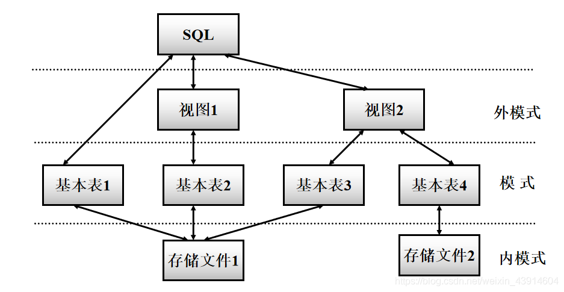  
**基本表**

-   本身独立存在的表
-   SQL中一个关系就对应一个基本表
-   一个(或多个)基本表对应一个存储文件
-   一个表可以带若干索引

**存储文件**

-   逻辑结构组成了关系数据库的内模式
-   物理结构是任意的，对用户透明

**视图**

-   从一个或几个基本表导出的表
-   数据库中只存放视图的定义而不存放视图对应的数据
-   视图是一个虚表
-   用户可以在视图上再定义视图

## 3.数据字典

-   `数据字典`是`关系数据库管理系统内部`的一组`系统表`，`它记录了数据库中所有的定义信息，包括关系模式定义、视图定义、索引定义、完整性约束定义、各类用户对数据库的操作权限、统计信息等`。
-   关系数据库管理系统在执行SQL的数据定义语句时，实际上就是在更新数据字典表中的相应信息。
-   在进行查询优化和查询处理时，数据字典中的信息是其重要依据。

## 4.数据定义

### （1）数据定义概览

-   SQL的数据定义功能: `模式定义`、`表定义`、`视图`和`索引`的定义

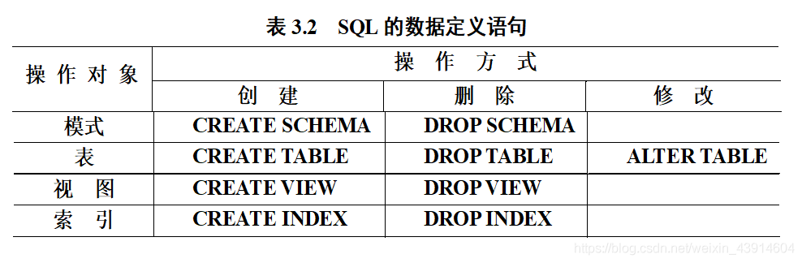

### （2）模式的定义与删除—[SCHEMA](https://so.csdn.net/so/search?q=SCHEMA&spm=1001.2101.3001.7020)

**定义模式实际上定义了一个`命名空间`**

-   在这个`空间`中可以`定义`该`模式`包含的`数据库对象`，例如`基本表`、`视图`、`索引`等。
-   在CREATE SCHEMA中可以接受CREATE TABLE，CREATE VIEW和GRANT子句。
-   `CREATE SCHEMA <模式名> AUTHORIZATION <用户名>[<表定义子句>|<视图定义子句>|<授权定义子句>]`
-   如果没有指定<模式名>，那么<模式名>隐含为<用户名>

#### ① 定义模式

> dbo database owner 数据库的创建者,创建该对象的用户. guest 顾客 能够访问数据库中对象的数据, 要求dbo分配权限给guest, 一般给他查看的权限select

-   这里我先创建一个数据库用户：  
    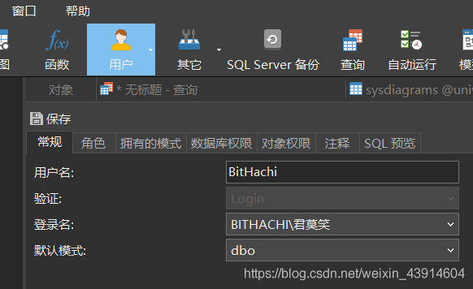

**\[例1\]定义一个学生-课程模式S-T**

```
      CREATE SCHEMA "S-T" AUTHORIZATION BitHachi;
      为用户BitHachi定义了一个模式S-T
```

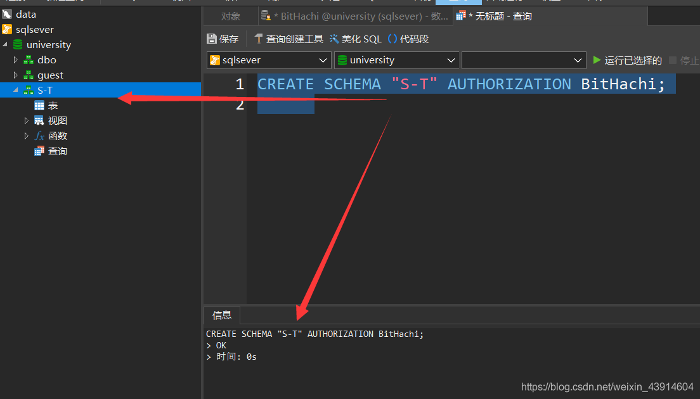

-   如果没有指定<模式名>，那么<模式名>隐含为<用户名>

```
      CREATE SCHEMA AUTHORIZATION BitHachi；
      <模式名>隐含为用户名BitHachi
      这个不知道咋回事，没出结果，默认模式BitHachi没创建出来，没显示
```

**\[例2\]为用户BitHachi创建了一个模式S-T，并在其中定义了一个表TAB1。**

```
CREATE SCHEMA "S-T" AUTHORIZATION BitHachi
CREATE TABLE TAB1(
COL1 SMALLINT, 
COL2 INT,
COL3 CHAR(20),
COL4 NUMERIC(10,3),
COL5 DECIMAL(5,2)
);
```

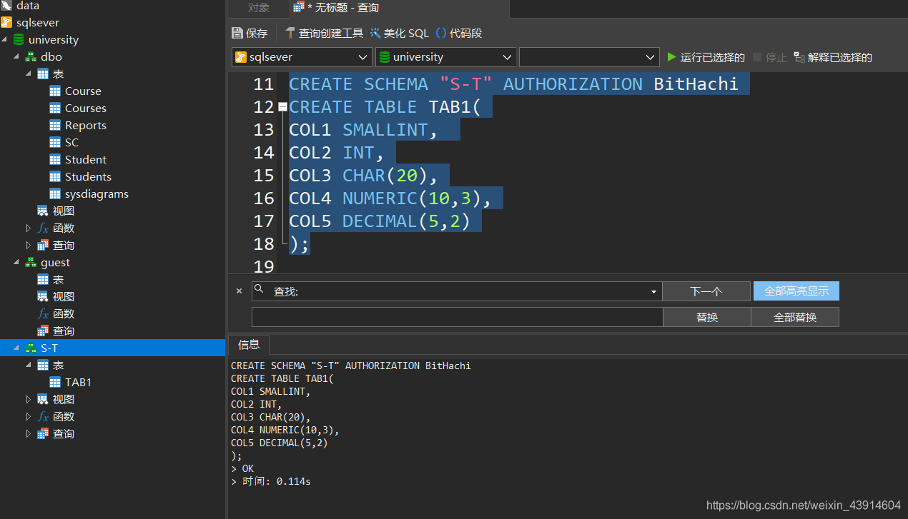

#### ② 删除模式

-   `DROP SCHEMA <模式名> <CASCADE|RESTRICT>`
-   `CASCADE(级联)`  
    删除模式的同时把该模式中所有的数据库对象全部删除
-   `RESTRICT(限制)`  
    如果该模式中定义了下属的数据库对象（如表、视图等），则拒绝该删除语句的执行。
-   当该模式中没有任何下属的对象时才能执行。
-   以下是运行结果，至于为什么是错误的，暂且放在这里，等熟悉相关知识之后，再来解决。

```
DROP SCHEMA "S-T" CASCADE;
```

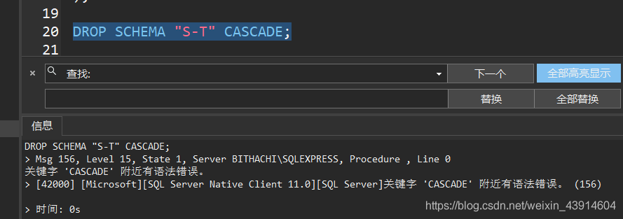

```
DROP SCHEMA "S-T" RESTRICT;
```

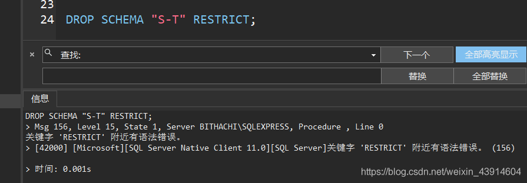

### （3）基本表的定义、删除与修改—TABLE

#### ① 定义基本表的标准格式

```
CREATE TABLE <表名>(
      <列名> <数据类型>[ <列级完整性约束条件> ]
      [，<列名> <数据类型>[ <列级完整性约束条件>] ]
       ………
      [，<表级完整性约束条件> ]
 );

```

列级约束在列后和表后均可定义（单个属性值约束）

但是表级约束只能在表后进行定义（多属性值约束）

#### ② 数据类型

-   SQL中`域`的概念用`数据类型`来实现
  
-   定义表的`属性`时 需要指明其`数据类型及长度`
  
-   选用哪种数据类型
  
    -   取值范围
    -   要做哪些运算
-   以下是通用数据类型，不同数据库的数据类型可能有所不同，可查相关文档。
  

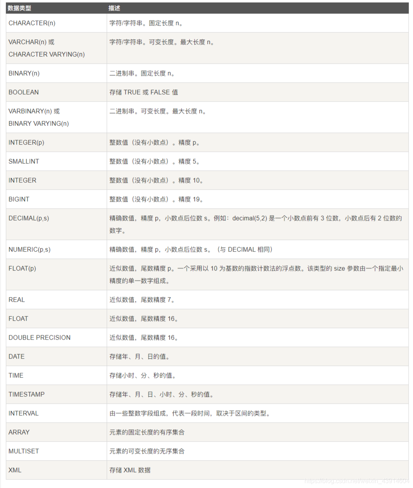

#### ③ 修改基本表

```
ALTER TABLE <表名>
[ ADD <新列名> <数据类型> [ 完整性约束 ] ]
[ DROP <完整性约束名> ]
[ ALTER COLUMN<列名> <数据类型> ]；
```

**\[例8\]向Student表增加“入学时间”列，其数据类型为日期型。**

-   不论基本表中原来是否已有数据，新增加的列一律为空值。

```
     ALTER TABLE Student ADD S_entrance DATE;
```

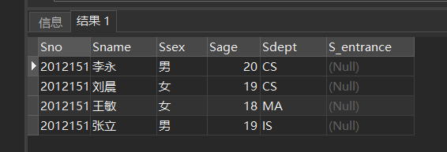

**\[例9\]将年龄的数据类型由字符型（假设原来的数据类型是字符型）改为整数。**

```
ALTER TABLE Student ALTER COLUMN Sage INT;
```

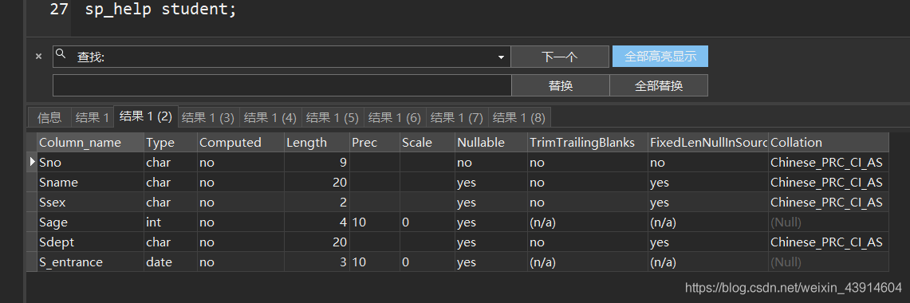  
**\[例10\]增加课程名称必须取唯一值的约束条件。**

```
   ALTER TABLE Course ADD UNIQUE(Cname);
```

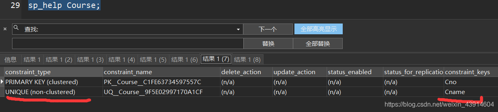

#### ④ 删除基本表

**标准格式：**  
`DROP TABLE <表名>［RESTRICT| CASCADE］；`

-   `RESTRICT`：删除表是有限制的。
    -   欲删除的基本表不能被其他表的约束所引用
    -   如果存在依赖该表的对象，则此表不能被删除
-   `CASCADE`：删除该表没有限制。
    -   在删除基本表的同时，相关的依赖对象一起删除

**\[例11\] 删除Student表**

- 基本表定义被删除，数据被删除

- 对于存储过程和函数，删除基本表后，其都不自动删除建立在此基本表上的存储过程和函数，但其均已失效

- 表上建立的索引、视图、触发器等一般也将被删除

-   还是和上述删除模式情况一样，加了CASCADE和RESTRUCT删除不了
  
    ```
      DROP TABLE  Student  CASCADE ;
    ```
    

**［例12］若表上建有视图，选择RESTRICT时表不能删除**

```
    CREATE VIEW IS_Student      
AS 
    SELECT Sno,Sname,Sage
    FROM  Student
        WHERE Sdept='IS';
 DROP TABLE Student RESTRICT;   
```

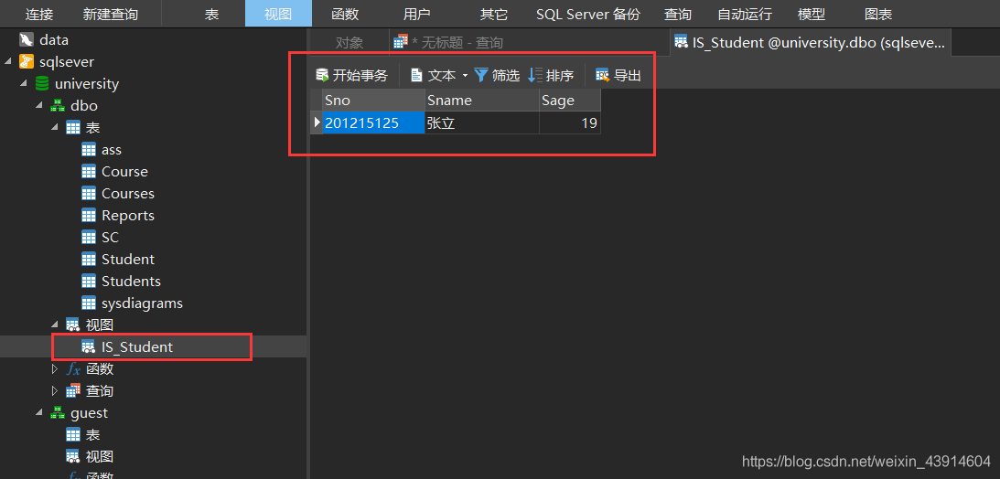

`--ERROR: cannot drop table Student because other objects depend on it`

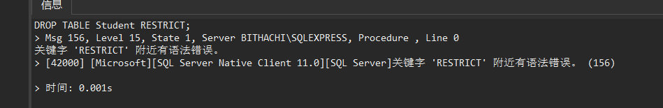

**\[例12\]如果选择CASCADE时可以删除表，视图也自动被删除**

-   这里还是跟之前的情况一样，删除不了，可能是我用的数据库不同叭

```
DROP TABLE Student CASCADE;     
 --NOTICE: drop cascades to view IS_Student
SELECT * FROM IS_Student;
--ERROR: relation " IS_Student " does not exist 
```

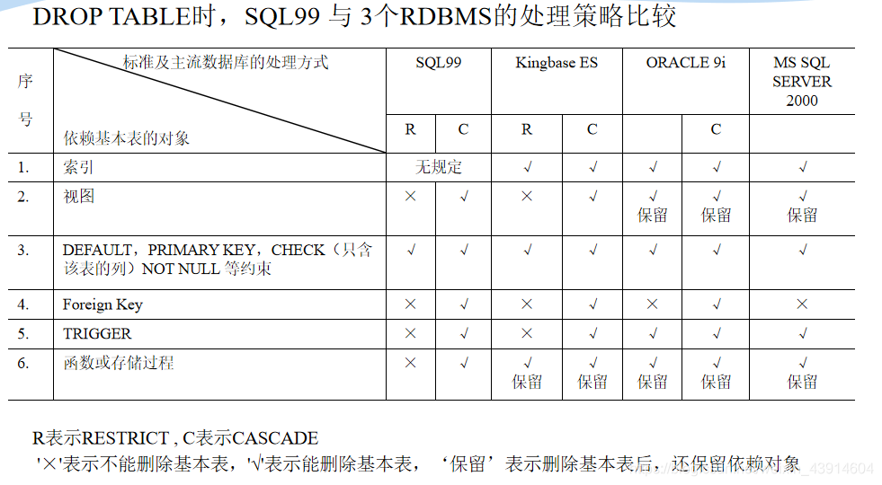

### （4）索引的建立与删除—INDEX

**建立索引的目的：`·加快查询速度·`**

-   谁可以建立索引？

    -   DBA 或 表的属主（即建立表的人）
    -   DBMS一般会自动建立以下列上的索引
    -   PRIMARY KEY
-   谁维护索引？  
    DBMS自动完成
-   使用索引  
    DBMS自动选择是否使用索引以及使用哪些索引
-   RDBMS中索引一般采用B+树、HASH索引来实现

    -   B+树索引具有动态平衡的优点
    -   HASH索引具有查找速度快的特点
-   采用B+树，还是HASH索引 则由具体的RDBMS来决定
-   索引是[关系数据库](https://so.csdn.net/so/search?q=%E5%85%B3%E7%B3%BB%E6%95%B0%E6%8D%AE%E5%BA%93&spm=1001.2101.3001.7020)的内部实现技术，属于内模式的范畴
-   `CREATE INDEX`语句定义索引时，可以定义索引是`唯一索引、非唯一索引或聚簇索引`


#### ① 建立索引的标准格式

**语句格式**

```
CREATE [UNIQUE] [CLUSTER] INDEX <索引名> 
ON <表名>(<列名>[<次序>][,<列名>[<次序>] ]…)；
```

- UNIQUE：每一个索引值只能对应唯一的数据记录
- CLUSTER：要建立的索引是聚簇索引

**\[例13\]**

```
   CREATE CLUSTEREDINDEX Stusname
           ON   Student(Sname);
```

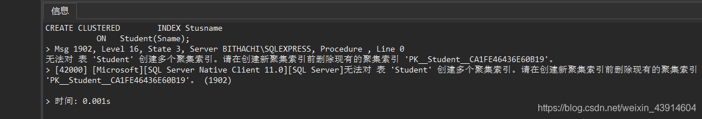

-   在Student表的Sname（姓名）列上建立一个`聚簇索引`
-   在最经常查询的列上建立聚簇索引以提高查询效率
-   `一个基本表上最多只能建立一个聚簇索引`
-   经常更新的列不宜建立聚簇索引

**\[例14\]为学生-课程数据库中的Student，Course，SC三个表建 立索引。**

-   Student表按学号升序建唯一索引
-   Course表按课程号升序建唯一索引
-   SC表按学号升序和课程号降序建唯一索引

```
CREATE UNIQUE INDEX  Stusno ON Student(Sno);
CREATE UNIQUE INDEX  Coucno ON Course(Cno);
CREATE UNIQUE INDEX  SCno ON SC(Sno ASC,Cno DESC);
```

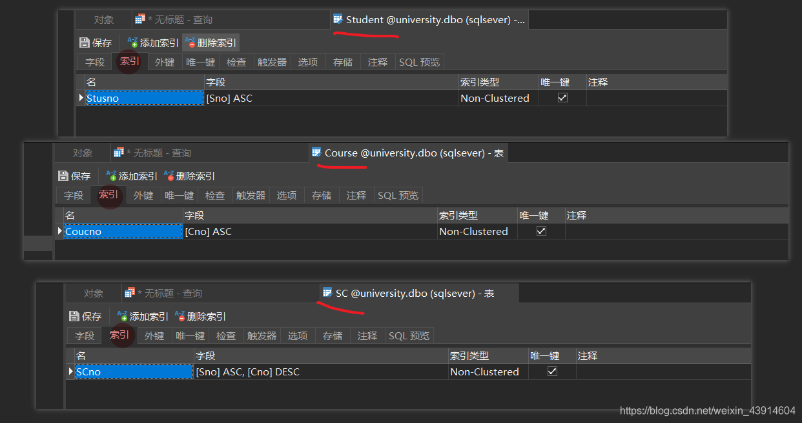

#### ② 删除索引

**`DROP INDEX <索引名> ON <表名>;`  
`DROP INDEX <表名>.<索引名>;`**

-   删除索引时，系统会从数据字典中删去有关该索引的描述。
-   数据字典：数据字典是指对数据的数据项、数据结构、[数据流](https://baike.baidu.com/item/数据流/3002243)、数据存储、处理逻辑等进行定义和描述，其目的是对[数据流程图](https://baike.baidu.com/item/数据流程图/3073245)中的各个元素做出详细的说明，使用数据字典为简单的建模项目。简而言之，数据字典是描述数据的信息集合，是对系统中使用的所有数据元素的定义的集合。

**\[例15\] 删除Student表的Stusname索引**

```
   DROP INDEX Stusno ON Student;
   //等价
   DROP INDEX Student.Stusno;
```

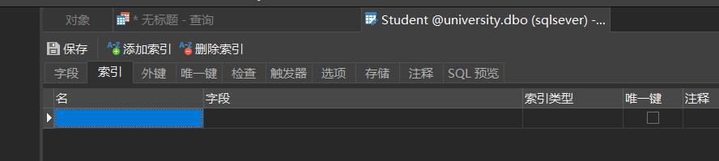