___

## 0.前言

-   本篇文章是对《数据库系统概论》王珊老师主编的数据库查询SELECT部分做的笔记，采用的是SQL Sever 数据库。
-   本篇文章中所有的例子，都会有结果的截图进行验证。
-   书上的结果和在机器上的结果可能略有不同，可能是数据库版本或软件显示的问题，或者是教材需要升级改版了。

## 1.思维导图


## 2.Student/SC/Course表数据及结构

-   本篇文章都是围绕这三个表展开的。  
    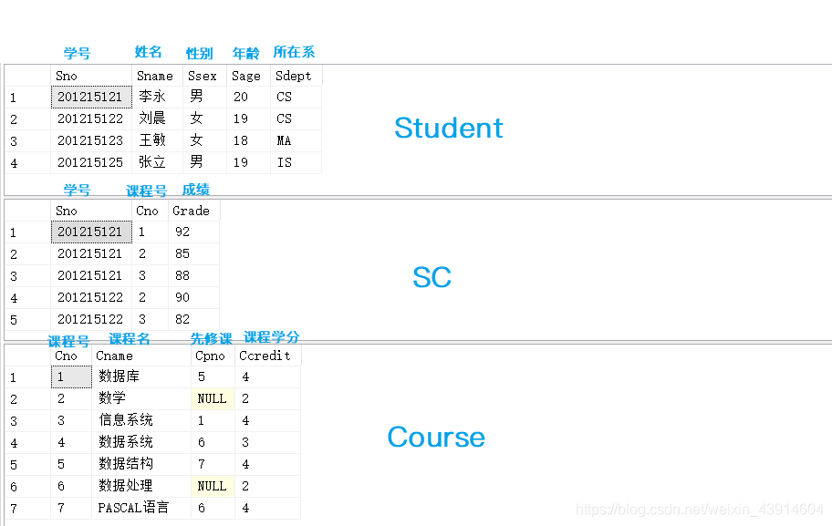

## 3.SELECT语句的一般格式

先从整体上了解一下SELECT的格式，关键字的位置。

SELECT相当于投影操作

```
SELECT [ALL|DISTINCT]   
<目标列表达式> [别名] [ ，<目标列表达式> [别名]] … 
FROM   <表名或视图名> [别名]   [ ，<表名或视图名> [别名]] …
[WHERE <条件表达式>]
[GROUP  BY<列名1>
[HAVING  <条件表达式>]]
[ORDER BY <列名2> [ASC|DESC] 
```

## 4.单表查询

### （1）选择表中的若干列

#### ① 查询指定列

-   `查询指定列`

**\[例1\] 查询全体学生的学号与姓名。**

```
SELECT Sno,Sname 
FROM Student;
```

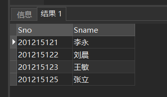

**\[例2\] 查询全体学生的姓名、学号、所在系。**

```
SELECT Sname,Sno,Sdept 
FROM Student;
```

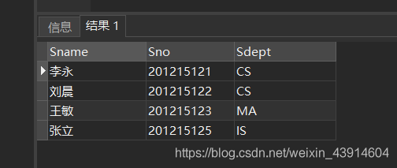

#### ② 查询全部列

-   选出所有属性列：在SELECT关键字后面列出所有列名 ，将<目标列表达式>指定为 \*

**\[例3\] 查询全体学生的详细记录。**

```
SELECT  Sno,Sname,Ssex,Sage,Sdept 
FROM Student;
//两种方式
SELECT  *FROM Student;
```

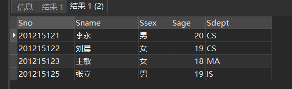

#### ③ 查询经过计算的值

-   `SELECT子句的<目标列表达式>可以为：`  
    算术表达式  
    字符串常量  
    函数  
    列别名
-   此时，其属性名为目标表达式（可以对其进行重命名，直接在表达式后加空格加别名，不需as，eg：2004-Sage BIRTHDAY），其属性值为经过运算的结果

##### ❶ 算术[表达式](https://so.csdn.net/so/search?q=%E8%A1%A8%E8%BE%BE%E5%BC%8F&spm=1001.2101.3001.7020)

**\[例4\] 查全体学生的姓名及其出生年份。这里假定目前年份是2004年。**

```
SELECT Sname,2004-Sage 
FROM Student;
```

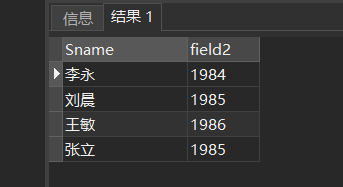

##### ❷ 字符串常量及函数

**\[例5\] 查询全体学生的姓名、出生年份和所有系，要求用小写字母表示所有系名，这里假定目前年份是2004年。**

```
 SELECT Sname,'Year of Birth: ', 2004-Sage, LOWER(Sdept)
 FROM Student;
```

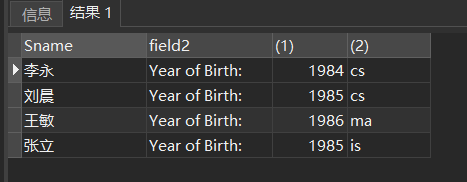

##### ❸ 使用列别名改变查询结果的列标题

```
SELECT Sname NAME,'Year of Birth: '  BIRTH,
2000-Sage  BIRTHDAY,
LOWER(Sdept)  DEPARTMENT
FROM Student;
```

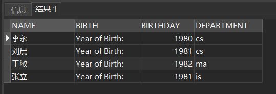

### （2）选择表中的若干[元组](https://so.csdn.net/so/search?q=%E5%85%83%E7%BB%84&spm=1001.2101.3001.7020)（行）

#### ① 关键词[DISTINCT](https://so.csdn.net/so/search?q=DISTINCT&spm=1001.2101.3001.7020)去掉表中重复的行

-   如果没有指定DISTINCT关键词，则缺省为ALL
-   由于其实对最终的结果进行剔除，因此应当在SELECT语句中加入该关键字

```
SELECT Sno FROM SC;
/*等价于：*/
SELECT ALL  Sno  FROM SC;
```

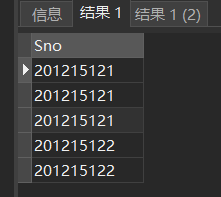  
**\[例6\] 查询选修了课程的学生学号。指定`DISTINCT`关键词，去掉表中重复的行**

```
SELECT DISTINCT Sno
FROM SC;
```

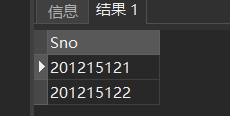

#### ② 查询满足条件的元组（行）

-   常用的查询条件

| 查询条件             | 谓词                                                         |
| -------------------- | ------------------------------------------------------------ |
| 比较                 | \=，>，<，>=，<=，!=，<>，!>，!<；NOT+上述比较运算符         |
| 确定范围             | BETWEEN AND，NOT BETWEEN AND                                 |
| 确定集合             | IN，NOT IN                                                   |
| 字符匹配             | LIKE，NOT LIKE                                               |
| 空值                 | IS NULL，IS NOT NULL（若其值为空值，则必须用该谓词进行判断，不可用 =） |
| 多重条件（逻辑运算） | AND，OR，NOT                                                 |

空值：

1. 与非空值运算：结果为NULL（一般运算结果均为参与运算的数据类型）
2. 与非空值比较：结果为UNKOWN（比较结果一般为真或假，与空值比较则未知）

##### ❶ 比较大小

**\[例7\]查询计算机科学系全体学生的名单。**

```
SELECT Sname
FROM Student
WHERE Sdept='CS';
```

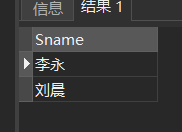  
**\[例8\] 查询所有年龄在20岁以下的学生姓名及其年龄。**

```
SELECT Sname,Sage 
FROM Student 
WHERE Sage < 20;
```

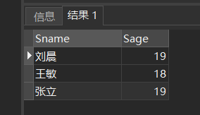  
**\[例9\]查询考试成绩有不及格的学生的学号。**

```
SELECT DISTINCT Sno
FROM  SC
WHERE Grade<60;
```

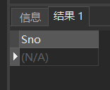

##### ❷ 确定范围

**谓词:**

-   `BETWEEN … AND …`
-   `NOT BETWEEN … AND …`

**\[例10\] 查询年龄在20~23岁（包括20岁和23岁）之间的学生的**

```
SELECT Sname,Sdept,Sage
FROM  Student
WHERE Sage 
BETWEEN 20 AND 23; 
```

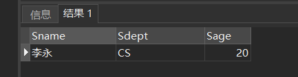  
**\[例11\] 查询年龄不在20~23岁之间的学生姓名、系别和年龄**

```
SELECT Sname,Sdept,Sage
FROM  Student
WHERE Sage NOT BETWEEN 20 AND 23;
```

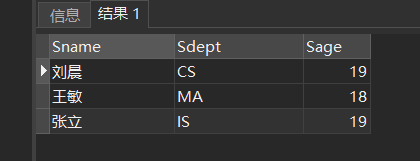

##### ❸ 确定[集合](https://so.csdn.net/so/search?q=%E9%9B%86%E5%90%88&spm=1001.2101.3001.7020)

**谓词：**

-   `IN <值表>,`
-   `NOT IN <值表>`

**右值可以用（）中加入元素表示集合**

**\[例12\]查询信息系（IS）、数学系（MA）和计算机科学系（CS）学生的姓名和性别。**

```
SELECT Sname,Ssex
FROM  Student
WHERE Sdept IN ( 'IS','MA','CS' );
```

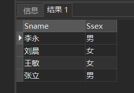  
**\[例13\]查询既不是信息系、数学系，也不是计算机科学系的学生的姓名和性别。**

```
SELECT Sname,Ssex
FROM Student
WHERE Sdept NOT IN ( 'IS','MA','CS' );
```

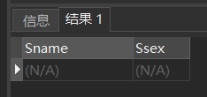

##### ❹ 字符匹配

**谓词：**

-   `[NOT] LIKE ‘<匹配串>’ [ESCAPE ‘ <换码字符>’]`

**`匹配串为固定字符串`**  
**\[例14\] 查询学号为201215121的学生的详细情况。**

```
SELECT *    
FROM  Student  
WHERE  Sno LIKE '201215121';
/*等价于：*/ 
SELECT  * 
FROM  Student 
WHERE Sno = '201215121';
```

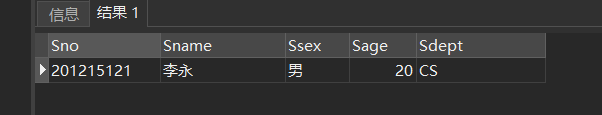

**`匹配串为含通配符的字符串`**  
**\[例15\] 查询所有姓刘学生的姓名、学号和性别。**

```
SELECT Sname,Sno,Ssex
FROM Student
WHERE  Sname LIKE '刘%';
```

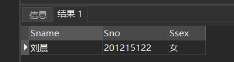  
**\[例16\] 查询姓"欧阳"且全名为三个汉字的学生的姓名。**

```
SELECT Sname
FROM   Student
WHERE  Sname LIKE '欧阳_';
```

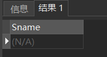

**\[例17\] 查询名字中第2个字为"阳"字的学生的姓名和学号。**

```
SELECT Sname,Sno
FROM Student
WHERE Sname LIKE '_阳%';
```

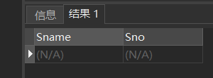

**\[例18\] 查询所有不姓刘的学生姓名。**

```
SELECT Sname,Sno,Ssex
FROM Student
WHERE Sname NOT LIKE '刘%';
```

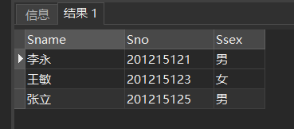

##### ❺ 使用换码字符’'将通配符转义为普通字符

-   `ESCAPE '＼' 表示“ ＼” 为换码字符`

**\[例19\] 查询DB\_Design课程的课程号和学分。**

```
SELECT Cno,Ccredit
FROM Course
WHERE Cname LIKE 'DB\_Design' ESCAPE '\';
```

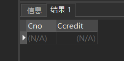

**\[例20\] 查询以"DB\_"开头，且倒数第3个字符为 i的课程的详细情况。**

```
SELECT  *
FROM   Course
WHERE  Cname LIKE  'DB\_%i_ _' ESCAPE '\';
```

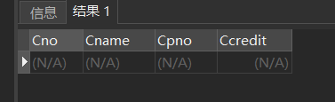

对于汉字进行操作是，如果是ASCII字符，一个汉字表示两个字符，需要两个____表示一个汉字，但对于GBK来说其用一个__来表示

##### ❻ 涉及空值的查询

**谓词：**

-   `IS NULL`
-   `IS NOT NULL`
-   `“IS” 不能用 “=” 代替`

对于空值进行排序时，其按照具体的数据库系统来实现，一般都是按升序最后排

**\[例21\] 某些学生选修课程后没有参加考试，所以有选课记录，但没有考试成绩。查询缺少成绩的学生的学号和相应的课程号。**

```
SELECT Sno,Cno
FROM  SC
WHERE  Grade IS NULL;
```

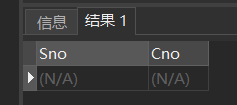

**\[例22\] 查所有有成绩的学生学号和课程号。**

```
SELECT Sno,Cno
FROM  SC
WHERE  Grade IS NOT NULL;
```

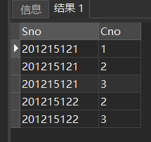

##### ❼ 多重条件查询

**逻辑运算符：**

-   AND和 OR来联结多个查询条件
-   AND的优先级高于OR
-   可以用括号改变优先级

**可用来实现多种其他谓词**

-   `[NOT] IN`
-   `[NOT] BETWEEN … AND …`

**\[例23\] 查询计算机系年龄在20岁以下的学生姓名。**

```
SELECT Sname
FROM  Student
WHERE Sdept= 'CS' AND Sage<20;
```

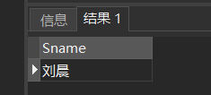

**改写\[例12\] 查询信息系（IS）、数学系（MA）和计算机科学系（CS）学生的姓名和性别。**

```
SELECT Sname,Ssex
FROM Student
WHERE Sdept IN ( 'IS','MA','CS' );
/*可改写为：*/
SELECT Sname,Ssex
FROM   Student
WHERE  Sdept= 'IS' OR Sdept= 'MA' OR Sdept= 'CS';
```

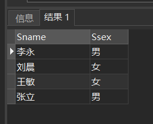

### （3）ORDER BY子句

**ORDER BY子句**

-   `可以按一个或多个属性列排序；`
-   `升序：ASC；`
-   `降序：DESC；`
-   `缺省值为升序；`

**当排序列含空值时**

-   `ASC`：排序列为空值的元组`最后显示`
-   `DESC`：排序列为空值的元组`最先显示`

**\[例24\] 查询选修了3号课程的学生的学号及其成绩，查询结果按分数降序排列。**

```
SELECT Sno,Grade
FROM  SC
WHERE  Cno= '3'
ORDER BY Grade DESC;
```

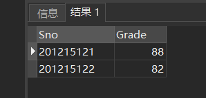  
**\[例25\] 查询全体学生情况，查询结果按所在系的系号升序排列，同一系中的学生按年龄降序排列。**

```
SELECT  *
FROM  Student
ORDER BY Sdept,Sage DESC;
```

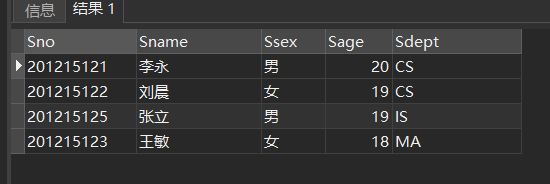

### （4）聚集函数

**聚集函数：**

除了COUNT *其他均不处理空值

原因：对于列来说，如果这个属性值为NULL则不对其进行计数，对属性来说，对其计数无意义

-   计数  
    `COUNT（[DISTINCT|ALL] *）`  若只要有一个属性值不为NULL仍然将其计数
    `COUNT（[DISTINCT|ALL] <列名>）`
-   计算总和  
    `SUM（[DISTINCT|ALL] <列名>）`
-   计算平均值  
    `AVG（[DISTINCT|ALL] <列名>）`
-   最大最小值  
    `MAX（[DISTINCT|ALL] <列名>）`  
    `MIN（[DISTINCT|ALL] <列名>）`

**\[例26\] 查询学生总人数。**

```
SELECT COUNT(*)
FROM  Student;
```

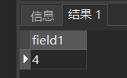  
**\[例27\] 查询选修了课程的学生人数。**

```
SELECT COUNT(DISTINCT Sno)
FROM SC;
```

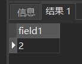  
**\[例28\] 计算2号课程的学生平均成绩。**

```
SELECT AVG(Grade)
FROM SC
WHERE Cno= '2';
```

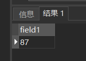

**\[例29\] 查询选修2号课程的学生最高分数。**

```
SELECT MAX(Grade)
FROM SC
WHERE Cno= '2';
```

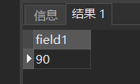

**\[例30\]查询学生201215121选修课程的总学分数。**

```
SELECT SUM(Ccredit)
FROM  SC, Course
WHERE Sno='201215121' AND SC.Cno=Course.Cno;
```

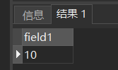

### （5）GROUP BY子句

**`GROUP BY`子句分组：**  
**细化聚集函数的作用对象**

-   未对查询结果分组，聚集函数将作用于整个查询结果
-   对查询结果分组后，聚集函数将分别作用于每个组
-   作用对象是查询的中间结果表
-   按指定的一列或多列值分组，值相等的为一组

**`HAVING`短语与`WHERE`子句的区别：**

-   作用对象不同
-   WHERE子句作用于`基表或视图`，从中选择满足条件的`元组`。
-   HAVING短语作用于`组`，从中选择满足条件的`组`。
-   WHERE语句**不能**使用GROUP BY语句

**\[例31\] 求各个课程号及相应的选课人数。**

```
SELECT Cno,COUNT(Sno)
FROM    SC
GROUP BY Cno;
```

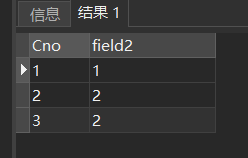

**\[例32\] 查询选修了2门以上课程的学生学号。**

```
SELECT Sno
FROM  SC
GROUP BY Sno
HAVING  COUNT(*) >2;  
```

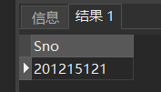

## 5.连接查询

**连接查询：同时涉及多个表的查询**

**连接条件或连接谓词：用来连接两个表的条件**

必须为派生表生成别名，基本表可以写也可以不写，eg：FORM STUDENT  (SELEECT Sno FOROM SC WHERE Cno='1') AS SCL student和其生成的表都有Sno因此由于其为派生表，其无名字可用，因此需要添加别名再调用其属性

**一般格式：**

-   `[<表名1>.]<列名1> <比较运算符> [<表名2>.]<列名2>`
-   `[<表名1>.]<列名1> BETWEEN [<表名2>.]<列名2> AND [<表名2>.]<列名3>`

**连接字段：连接谓词中的列名称**

-   连接条件中的各连接字段类型必须是可比的，但名字不必是相同的

### （1）连接操作的执行过程

#### ① 嵌套循环法(NESTED-LOOP)

-   首先在表1中找到第一个元组，然后从头开始扫描表2，逐一查找满足连接件的元组，找到后就将表1中的第一个元组与该元组拼接起来，形成结果表中一个元组。
-   表2全部查找完后，再找表1中第二个元组，然后再从头开始扫描表2，逐一查找满足连接条件的元组，找到后就将表1中的第二个元组与该元组拼接起来，形成结果表中一个元组。
-   重复上述操作，直到表1中的全部元组都处理完毕
-   相当于第一个组中的每个元组分别与第二个表中的每一元组进行比较

#### ② 排序合并法(SORT-MERGE)

**常用于=连接**

-   首先按连接属性对表1和表2排序
-   对表1的第一个元组，从头开始扫描表2，顺序查找满足连接条件的元组，找到后就将表1中的第一个元组与该元组拼接起来，形成结果表中一个元组。当遇到表2中第一条大于表1连接字段值的元组时，对表2的查询不再继续
-   找到表1的第二条元组，然后从刚才的中断点处继续顺序扫描表2，查找满足连接条件的元组，找到后就将表1中的第一个元组与该元组拼接起来，形成结果表中一个元组。直接遇到表2中大于表1连接字段值的元组时，对表2的查询不再继续
-   重复上述操作，直到表1或表2中的全部元组都处理完毕为止

#### ③ 索引连接(INDEX-JOIN)

-   对表2按连接字段建立索引
-   对表1中的每个元组，依次根据其连接字段值查询表2的索引，从中找到满足条件的元组，找到后就将表1中的第一个元组与该元组拼接起来，形成结果表中一个元组

### （2）等值与非等值连接查询

**等值连接：连接运算符为=**

**\[例33\] 查询每个学生及其选修课程的情况**

```
SELECT  Student.*,SC.*
FROM     Student,SC
WHERE  Student.Sno = SC.Sno;
```

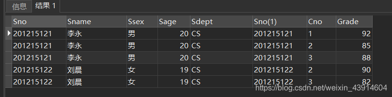

**自然连接**

**\[例34\] 对\[例33\]用自然连接完成。**

```
SELECT  Student.Sno,Sname,Ssex,Sage,Sdept,Cno,Grade
FROM     Student,SC
WHERE  Student.Sno = SC.Sno;
```

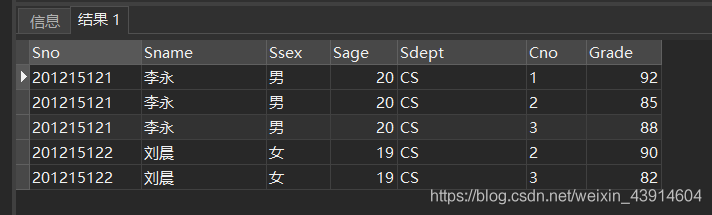

### （3）自身连接

-   **自身连接：一个表与其自己进行连接**
-   **需要给表起别名以示区别**
-   **由于所有属性名都是同名属性，因此必须使用别名前缀**

**\[例35\]查询每一门课的间接先修课（即`先修课的先修课`）**

```
SELECT  FIRST.Cno,SECOND.Cpno
FROM  Course  FIRST,Course  SECOND
WHERE FIRST.Cpno = SECOND.Cno;
```

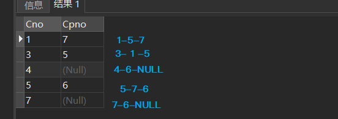

### （4）连接JOIN

**SQL join 用于把来自两个或多个表的行结合起来。**  
**标准格式：**

```
 SELECT column_name(s)
FROM table1//左表
<xxx JOIN> table2//右表
ON table1.column_name=table2.column_name;
```

**分类：**

-   `INNER JOIN (JOIN)`
-   `LEFT JOIN (LEFT OUTER JOIN)`
-   `RIGHT JOIN (RIGHT OUTER JOIN)`
-   `FULL JOIN (FULL OUTER JOIN)`

这里就以SC和Course两个表来检验这四类连接

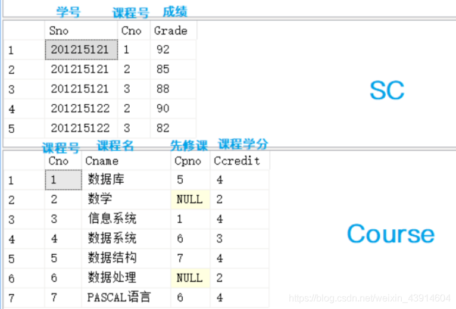

#### ① INNER JOIN (JOIN)

-   `INNER JOIN`：关键字在表中存在至少一个匹配时返回行。  
    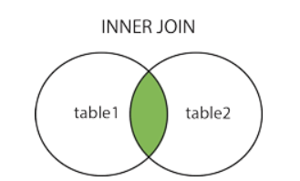

```
SELECT Sno,SC.Cno,Grade,Course.Cno,Cname,Cpno,Ccredit
FROM  SC INNER JOIN Course ON (SC.Cno=Course.Cno);
/*INNER JOIN 与 JOIN结果相同*/
SELECT Sno,SC.Cno,Grade,Course.Cno,Cname,Cpno,Ccredit
FROM  SC  JOIN Course ON (SC.Cno=Course.Cno);
```

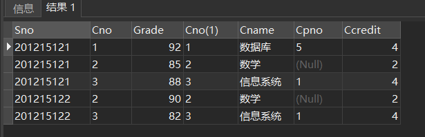

#### ② LEFT JOIN (LEFT OUTER JOIN)

-   `LEFT JOIN`：关键字从左表（table1）返回所有的行，即使右表（table2）中没有匹配。如果右表中没有匹配，则结果为 NULL。

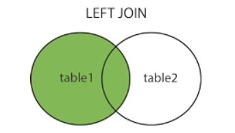

```
SELECT Sno,SC.Cno,Grade,Course.Cno,Cname,Cpno,Ccredit
FROM  SC LEFT JOIN Course ON (SC.Cno=Course.Cno);
/*LEFT JOIN 与 LEFT OUTER JOIN结果相同*/
SELECT Sno,SC.Cno,Grade,Course.Cno,Cname,Cpno,Ccredit
FROM  SC LEFT OUTER JOIN Course ON (SC.Cno=Course.Cno);
```

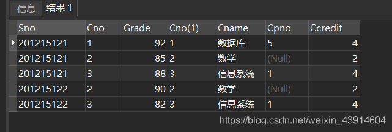

#### ③ RIGHT JOIN (RIGHT OUTER JOIN)

-   `RIGHT JOIN`：关键字从右表（table2）返回所有的行，即使左表（table1）中没有匹配。如果左表中没有匹配，则结果为 NULL。  
    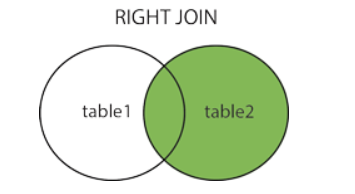

```
SELECT Sno,SC.Cno,Grade,Course.Cno,Cname,Cpno,Ccredit
FROM  SC RIGHT JOIN Course ON (SC.Cno=Course.Cno);
/*RIGHT JOIN 与 RIGHT OUTER JOIN结果相同*/
SELECT Sno,SC.Cno,Grade,Course.Cno,Cname,Cpno,Ccredit
FROM  SC RIGHT OUTER JOIN Course ON (SC.Cno=Course.Cno);
```

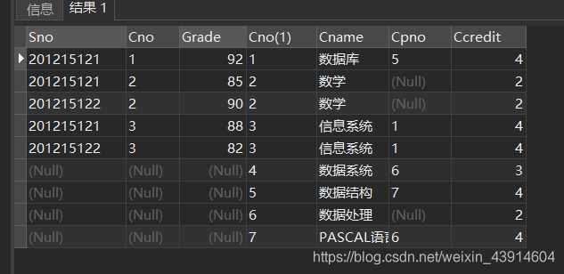

#### ④ FULL JOIN (FULL OUTER JOIN)

-   `FULL JOIN`：关键字只要左表（table1）和右表（table2）其中一个表中存在匹配，则返回行。结合了 LEFT JOIN 和 RIGHT JOIN 的结果。  
    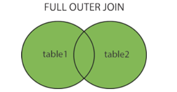

```
SELECT Sno,SC.Cno,Grade,Course.Cno,Cname,Cpno,Ccredit
FROM  SC FULL JOIN Course ON (SC.Cno=Course.Cno);
/*FULL JOIN 与 FULL OUTER JOIN结果相同*/
SELECT Sno,SC.Cno,Grade,Course.Cno,Cname,Cpno,Ccredit
FROM  SC FULL OUTER JOIN Course ON (SC.Cno=Course.Cno);
```

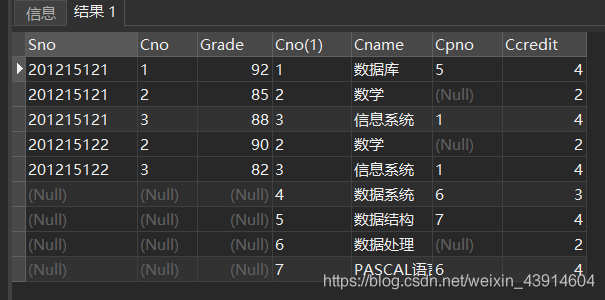

### （5）复合条件连接

**复合条件连接：WHERE子句中含多个连接条件**

**\[例37\]查询选修2号课程且成绩在88分以上的所有学生**

```
SELECT Student.Sno, Sname
FROM    Student,SC
WHERE Student.Sno = SC.Sno AND   
/* 连接谓词*/
SC.Cno= '2' AND SC.Grade > 88;     
/* 其他限定条件 */
```

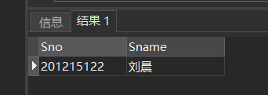  
**\[例38\]查询每个学生的学号、姓名、选修的课程名及成绩**

```
SELECT Student.Sno,Sname,Cname,Grade
FROM    Student,SC,Course  /*多表连接*/
WHERE Student.Sno = SC.Sno 
and SC.Cno = Course.Cno;
```

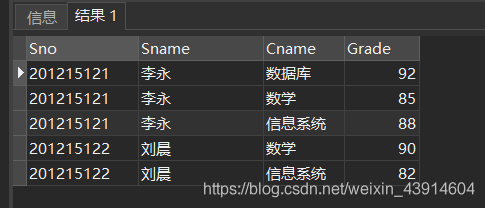

## 6.嵌套查询

### （1）嵌套查询概述

-   一个SELECT-FROM-WHERE语句称为一个`查询块`
-   将一个`查询块嵌套`在另一个`查询块`的`WHERE`子句或`HAVING`短语的条件中的查询称为`嵌套查询`

**一个例子：**

```
 SELECT Sname/*外层查询/父查询*/
 FROM Student
 WHERE Sno IN
(SELECT Sno    /*内层查询/子查询*/
 FROM SC
 WHERE Cno= '2');
```


-   子查询的`限制`： `·不能使用ORDER BY子句·`
-   层层嵌套方式反映了 SQL语言的结构化
-   有些嵌套查询可以用连接运算替代

### （2）不相关子查询

**`子查询的查询条件不依赖于父查询`**

-   由里向外 逐层处理。即每个子查询在上一级查询处理之前求解，子查询的结果用于建立其父查询的查找条件。

### （3）相关子查询

**`子查询的查询条件依赖于父查询`**

-   首先取外层查询中表的第一个元组，根据它与内层查询相关的属性值处理内层查询，若WHERE子句返回值为真，则取此元组放入结果表
-   然后再取外层表的下一个元组
-   重复这一过程，直至外层表全部检查完为止

### （4）带有IN谓词的子查询

**\[例39\] 查询与“刘晨”在同一个系学习的学生。此查询要求可以分步来完成**

-   ① 确定“刘晨”所在系名

```
SELECT  Sdept  
FROM     Student                            
WHERE  Sname= '刘晨';
```


-   ② 查找所有在CS系学习的学生。

```
SELECT  Sno,Sname,Sdept     
FROM    Student                 
WHERE  Sdept= 'CS';
```

  
**将第一步查询嵌入到第二步查询的条件中**

```
SELECT Sno,Sname,Sdept
FROM Student
WHERE Sdept  IN
(SELECT Sdept
FROM Student
WHERE Sname= '刘晨');
```


-   此查询为不相关子查询。

**\[例40\]查询选修了课程名为“信息系统”的学生学号和姓名**

```
SELECT Sno,Sname /*③ 最后在Student关系中取出Sno和Sname*/
FROM    Student  
WHERE Sno  IN
(  SELECT Sno  /*② 然后在SC关系中找出选修了3号课程的学生学号*/
 FROM    SC      
 WHERE  Cno IN
( SELECT Cno   /*① 首先在Course关系中找出 “信息系统”的课程号,为3号*/
  FROM Course    
  WHERE Cname= '信息系统'
     )
);
```


**用连接查询实现\[例40\]**

```
SELECT Student.Sno,Sname
FROM    Student,SC,Course
WHERE Student.Sno = SC.Sno 
AND SC.Cno = Course.Cno 
AND Course.Cname='信息系统';
```


### （5）带有比较运算符的子查询

-   带有比较运算符的子查询是指父查询与子查询之间用比较运算符进行连接。当用户能确切知道内层查询返回的是`单个值`时，可以用>、<、=、>=、<= 、!=或< >等`比较运算符`。
-   与ANY或ALL谓词配合使用

**例：假设一个学生只可能在一个系学习，并且必须属于一个系，则在\[例39\]可以用`= 代替IN`：**

```
SELECT Sno,Sname,Sdept
FROM Student
WHERE Sdept  =
(SELECT Sdept
FROM Student
WHERE Sname= '刘晨');
/*两种方式都可以*/
SELECT Sno,Sname,Sdept
FROM Student
WHERE
(SELECT Sdept
FROM Student
WHERE Sname= '刘晨')
= Sdept ;
```

  
**［例41］找出每个学生超过他选修课程平均成绩的课程号。**

```
SELECT Sno, Cno
FROM  SC  x
WHERE Grade >=(SELECT AVG(Grade)  /*相关子查询*/ 
              FROM  SC y
              WHERE y.Sno=x.Sno
    );
```


**`［例41］可能的执行过程：`**  
1.从外层查询中取出SC的一个元组x，将元组x的Sno值（201215121）传送给内层查询。

```
SELECT AVG(Grade)
FROM SC y
WHERE y.Sno='201215121';
```


2.执行内层查询，得到值88（近似值），用该值代替内层查询，得到外层查询：

```
SELECT Sno, Cno
FROM  SC x
WHERE Grade >=88; 
```

3.执行这个查询，得到  
（200215121，1）  
（200215121，3）

4.外层查询取出下一个元组`重复做上述1至3步骤`，直到外层的SC元组全部处理完毕。结果为:  


### （6）带有ANY（SOME）或ALL谓词的子查询

**谓词语义：**

-   `ANY：任意一个值`
-   `ALL：所有值`

**需要配合使用比较运算符:**

|               |                                              |
| ------------- | -------------------------------------------- |
| \> ANY        | 大于子查询结果中的某个值                     |
| \> ALL        | 大于子查询结果中的所有值                     |
| < ANY         | 小于子查询结果中的某个值                     |
| < ALL         | 小于子查询结果中的所有值                     |
| \>= ANY       | 大于等于子查询结果中的某个值                 |
| \>= ALL       | 大于等于子查询结果中的所有值                 |
| <= ANY        | 小于等于子查询结果中的某个值                 |
| <= ALL        | 小于等于子查询结果中的所有值                 |
| \= ANY        | 等于子查询结果中的某个值                     |
| \=ALL         | 等于子查询结果中的所有值（通常没有实际意义） |
| !=（或<>）ANY | 不等于子查询结果中的某个值                   |
| !=（或<>）ALL | 不等于子查询结果中的任何一个值               |

**\[例42\] 查询其他系中比计算机科学某一学生年龄小的学生姓名和年龄**

```
SELECT Sname,Sage
FROM    Student
WHERE Sage < ANY (SELECT  Sage
                 FROM    Student
                  WHERE Sdept= 'CS')
    AND Sdept <> 'CS' ; /*父查询块中的条件 */
```

  
**执行过程：**

> 关系数据库管理系统（Relational Database Management System：RDBMS）

1.RDBMS执行此查询时，首先处理子查询，找出 CS系中所有学生的年龄，构成一个集合(20，19)  
2\. 处理父查询，找所有不是CS系且年龄小于 20 或 19的学生

**用聚集函数实现\[例42\]**

```
SELECT Sname,Sage
FROM   Student
WHERE Sage < (SELECT MAX(Sage)
             FROM Student
             WHERE Sdept= 'CS')
          AND Sdept <> 'CS';
```


**\[例43\] 查询其他系中比计算机科学系所有学生年龄都小的学生姓名及年龄。**

-   方法一：用ALL谓词

```
SELECT Sname,Sage
FROM Student
WHERE Sage < ALL (SELECT Sage
                 FROM Student
                  WHERE Sdept= 'CS')
              AND Sdept <> 'CS';
```


-   方法二：用聚集函数

```
SELECT Sname,Sage
FROM Student
WHERE Sage < (SELECT MIN(Sage)
               FROM Student
               WHERE Sdept= 'CS')
            AND Sdept <> 'CS';
```


**ANY（或SOME），ALL谓词与聚集函数、IN谓词的等价转换关系**

|      | \=   | <>或!= | <    | <=    | \>    | \>=    |
| ---- | ---- | ------ | ---- | ----- | ----- | ------ |
| ANY  | IN   | –      | <MAX | <=MAX | \>MIN | \>=MIN |
| ALL  | –    | NOT IN | <MIN | <=MIN | \>MAX | \>=MAX |

### （7）带有EXISTS谓词的子查询

**EXISTS谓词**

-   存在量词 ∃
-   带有EXISTS谓词的子查询不返回任何数据，只产生逻辑真值“true”或逻辑假值“false”。
    -   若内层查询结果非空，则外层的WHERE子句返回真值
    -   若内层查询结果为空，则外层的WHERE子句返回假值
-   由EXISTS引出的子查询，其目标列表达式通常都用\* ，因为带EXISTS的子查询只返回真值或假值，给出列名无实际意义

**NOT EXISTS谓词**

-   若内层查询结果非空，则外层的WHERE子句返回假值
-   若内层查询结果为空，则外层的WHERE子句返回真值

**\[例44\]查询所有选修了1号课程的学生姓名。**

**思路分析：**

-   本查询涉及Student和SC关系
-   在Student中依次取每个元组的Sno值，用此值去检查SC关系
-   若SC中存在这样的元组，其Sno值等于此Student.Sno值，并且其Cno=‘1’，则取此Student.Sname送入结果关系

**1.用嵌套查询**

```
SELECT Sname
FROM Student
WHERE EXISTS(SELECT *
             FROM SC
              WHERE Sno=Student.Sno 
   AND Cno= '1');
```


**2.用连接运算**

```
SELECT Sname
FROM Student, SC
WHERE Student.Sno=SC.Sno 
AND SC.Cno= '1';
```


**\[例45\] 查询没有选修1号课程的学生姓名。**

```
SELECT Sname
FROM Student
WHERE NOT EXISTS(SELECT *
             FROM SC
              WHERE Sno=Student.Sno 
    AND Cno= '1');
```


**不同形式的查询间的替换**

-   一些带EXISTS或NOT EXISTS谓词的子查询不能被其他形式的子查询等价替换
-   所有带IN谓词、比较运算符、ANY和ALL谓词的子查询都能用带EXISTS谓词的子查询等价替换  
    用EXISTS/NOT EXISTS实现全称量词(难点)  
    SQL语言中没有全称量词∀（For all）  
    可以把带有全称量词的谓词转换为等价的带有存在量词的谓词：
-   in查询可以全部转化为EXISTS查询，但是EXISTS查询不能全部转化为in查询  
      
    **例：\[例39\]查询与“刘晨”在同一个系学习的学生。**  
    **可以用带EXISTS谓词的子查询替换：**

```
SELECT Sno,Sname,Sdept
FROM Student S1
WHERE EXISTS(SELECT *
           FROM Student S2
           WHERE S2.Sdept = S1.Sdept
      AND S2.Sname = '刘晨');
```


**\[例46\] 查询选修了全部课程的学生姓名。**

```
SELECT Sname
FROM Student
WHERE NOT EXISTS(SELECT *
                 FROM Course
                 WHERE NOT EXISTS(SELECT *
                                  FROM SC
                                  WHERE Sno= Student.Sno
                                   AND Cno= Course.Cno)
                 );
```


**用EXISTS/NOT EXISTS实现逻辑蕴函(难点)**

```
SELECT DISTINCT Sno
FROM SC SCX
WHERE NOT EXISTS(SELECT *
                FROM SC SCY
                WHERE SCY.Sno = '201215122' 
       AND NOT EXISTS(SELECT *
                                FROM SC SCZ
                                WHERE SCZ.Sno=SCX.Sno 
           AND SCZ.Cno=SCY.Cno
   )
   );
```


## 7.集合查询

### （1） 集合操作的种类

-   `并操作UNION`
-   `交操作INTERSECT`
-   `差操作EXCEPT`

**参加集合操作的各`查询结果`的`列数必须相同`；对应项的`数据类型也必须相同`**

### （2）集合操作举例

**\[例48\] 查询计算机科学系的学生及年龄不大于19岁的学生。**  
**方法一：**

```
SELECT *
FROM Student
WHERE Sdept= 'CS'
UNION SELECT *
       FROM Student
       WHERE Sage<=19;
```


-   `UNION`：将多个查询结果`合并`起来时，系统自动`去掉重复元组`。
-   `UNION ALL`：将多个查询结果`合并`起来时，`保留重复元组`

**方法二：**

```
SELECT  DISTINCT  *
FROM Student
WHERE Sdept= 'CS'  
OR  Sage<=19;
```

**\[例49\] 查询选修了课程1`或者`选修了课程2的学生。**

```
SELECT Sno
FROM SC
WHERE Cno='1'
UNION
SELECT Sno
FROM SC
WHERE Cno= '2';

```


**\[例50\] 查询计算机科学系的学生与年龄不大于19岁的学生的`交集`**

```
SELECT *
FROM Student
WHERE Sdept='CS' 
INTERSECT
SELECT *
FROM Student
WHERE Sage<=19;
```


**\[例50\] 实际上就是查询计算机科学系中年龄不大于19岁的学生**

```
SELECT *
FROM Student
WHERE Sdept= 'CS' 
AND  Sage<=19;
```


**\[例51\] 查询选修课程1的学生集合与选修课程2的学生集合的`交集`**

```
SELECT Sno
FROM SC
WHERE Cno='1' 
INTERSECT
SELECT Sno
FROM SC
WHERE Cno='2';
```


**\[例51\]实际上是查询既选修了课程1`又`选修了课程2 的学生**

```
SELECT Sno
FROM SC
WHERE Cno='1' AND Sno IN
(SELECT Sno
FROM SC
WHERE Cno='2');
```


**\[例52\] 查询计算机科学系的学生与年龄不大于19岁的学生的`差集`。**

```
SELECT *
FROM Student
WHERE Sdept='CS'
EXCEPT
SELECT  *
FROM Student
WHERE Sage <=19;
```


**\[例52\]实际上是查询计算机科学系中年龄大于19岁的学生**

```
SELECT *
FROM Student
WHERE Sdept= 'CS' 
AND  Sage>19;
```

