___

## 0.前言

-   数据库是SQL Sever
-   数据库管理系统是Navicat Premium 15
-   本片文章所用的表在此篇文章之中：[Student/SC/Course表](https://blog.csdn.net/weixin_43914604/article/details/105171740)

## 1.思维导图

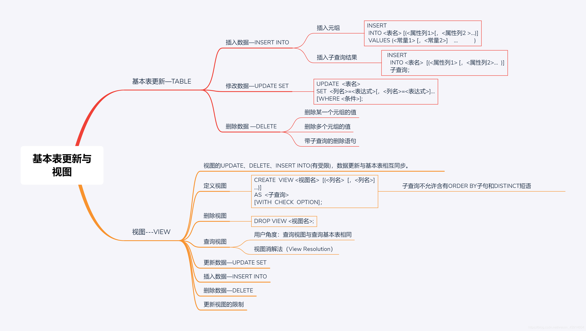

## 2.基本表更新—TABLE

### （1）插入数据—[INSERT](https://so.csdn.net/so/search?q=INSERT&spm=1001.2101.3001.7020) INTO

**两种插入数据方式**

1.  插入元组
2.  插入子查询结果

-   可以一次插入多个元组

#### ① 插入[元组](https://so.csdn.net/so/search?q=%E5%85%83%E7%BB%84&spm=1001.2101.3001.7020)

**语句格式**

```
INSERT
INTO <表名> [(<属性列1>[，<属性列2 >…)]
VALUES (<常量1> [，<常量2>]    …           )
```

功能:将新元组插入指定表中

**INTO子句**

-   属性列的顺序可与表定义中的顺序不一致
-   没有指定属性列：默认属性列，其值必须全部写，为空的写NULL
-   指定部分属性列：值与指定列对应

**VALUES子句**

-   提供的值必须与INTO子句匹配
-   值的个数
-   值的类型
-   值若为空写NULL，必须每个位置与其对应

**［例1］ 将一个新学生元组（学号：200215128；姓名：陈冬；性别：男；所在系：IS；年龄：18岁）插入到Student表中。**

```
    INSERT
    INTO  Student (Sno，Sname，Ssex，Sdept，Sage)
    VALUES ('200215128'，'陈冬'，'男'，'IS'，18)；
```

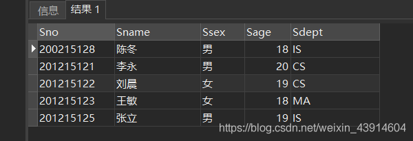  
**［例2］ 将学生张成民的信息插入到Student表中。**

```
INSERT
INTO  Student
VALUES ('200215126', '张成民', '男',18,'CS'); 
```

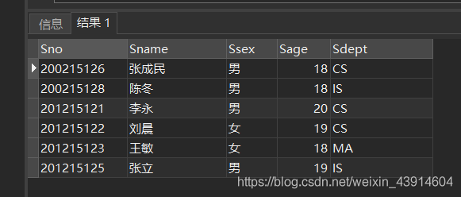

**［例3］ 插入一条选课记录( ‘200215128’，'1 ')。**

```
INSERT
INTO SC(Sno,Cno)//RDBMS将在新插入记录的Grade列上自动地赋空值
VALUES ('200215128','1');
//等价
INSERT
INTO SC
VALUES ('200215128','1',NULL);
```

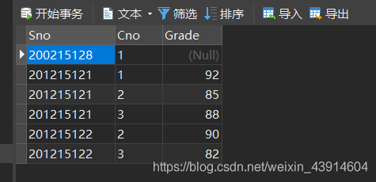

#### ② 插入[子查询](https://so.csdn.net/so/search?q=%E5%AD%90%E6%9F%A5%E8%AF%A2&spm=1001.2101.3001.7020)结果

**语句格式**

```
    INSERT 
    INTO <表名>  [(<属性列1> [，<属性列2>…  )]
    子查询；
```

**功能**  
将子查询结果插入指定表中

**INTO子句(与插入元组类似)**

**子查询**

-   SELECT子句目标列必须与INTO子句匹配  
    值的个数  
    值的类型

**\[例4\] 对每一个系，求学生的平均年龄，并把结果存入数据库。**

**第一步：建表**

```
CREATE  TABLE  Dept_age(
Sdept  CHAR(15),       /* 系名*/
Avg_age SMALLINT  /*学生平均年龄*/
);    
```

**第二步：插入数据**

```
INSERT INTO  Dept_age(Sdept,Avg_age)
SELECT  Sdept,AVG(Sage)
FROM  Student
GROUP BY Sdept;
```

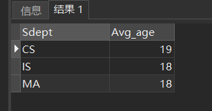

**RDBMS在执行插入语句时会检查所插元组是否破坏表上已定义的完整性规则**

-   实体完整性
-   参照完整性
-   用户定义的完整性
-   NOT NULL约束
-   UNIQUE约束
-   值域约束

### （2）修改数据—UPDATE SET

**语句格式**

```
UPDATE  <表名>
SET  <列名>=<表达式>[，<列名>=<表达式>]…
[WHERE <条件>];
```

**功能**  
修改指定表中满足WHERE子句条件的元组

**SET子句**

-   指定修改方式
-   要修改的列
-   修改后取值

**WHERE子句**

-   指定要修改的元组
-   `缺省表示要修改表中的所有元组`

**三种修改方式**

1.  修改某一个元组的值
2.  修改多个元组的值
3.  带子查询的修改语句

#### ① 修改某一个元组的值

**\[例5\] 将学生201215121的年龄改为22岁**

```
UPDATE  Student
SET Sage=22
WHERE  Sno='201215121'; 
```

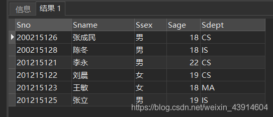

**\[例6\] 将所有学生的年龄增加1岁**

```
UPDATE Student
SET Sage= Sage+1;
```

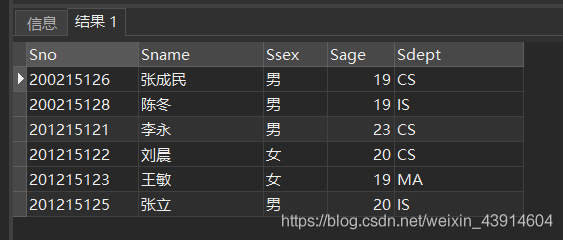  
**\[例7\] 将计算机科学系全体学生的成绩置零。**

```
UPDATE SC
SET  Grade=0
WHERE  'CS'=( 
SELECT  Sdept
FROM  Student
WHERE  Student.Sno = SC.Sno
);
```

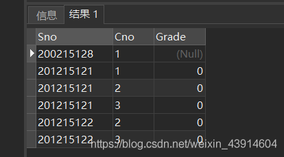

**RDBMS在执行修改语句时会检查修改操作是否破坏表上已定义的完整性规则**

-   实体完整性
-   主码不允许修改
-   用户定义的完整性
-   NOT NULL约束
-   UNIQUE约束
-   值域约束

### （3）删除数据 —DELETE

**三种删除方式**

1.  删除某一个元组的值
2.  删除多个元组的值
3.  带子查询的删除语句

#### ① 删除某一个元组的值

```
DELETE
FROM Student
WHERE Sno= '200215128';
```

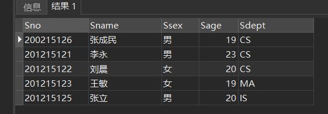

#### ② 删除多个元组的值

**\[例9\] 删除所有的学生选课记录。**

```
        DELETE
        FROM SC；//这个我就不截图了
```

#### ③ 带子查询的删除语句

\[例10\] 删除计算机科学系所有学生的选课记录。

```
DELETE
FROM SC
WHERE  'CS'=(
   SELECT Sdept
   FROM Student
   WHERE Student.Sno=SC.Sno
   );
```

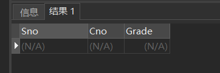

## 3.视图—VIEW

**视图的作用：**

1.  视图能够简化用户的操作
2.  视图使用户能以多种角度看待同一数据
3.  视图对重构数据库提供了一定程度的逻辑独立性
4.  视图能够对机密数据提供安全保护
5.  适当的利用视图可以更清晰的表达查询
5.  **视图相当于一个子表，但其并无数据的保存，仅数据的整合**

**视图的特点**

-   虚表，是从一个或几个基本表（或视图）导出的表
-   只存放视图的定义，不存放视图对应的数据
-   基表中的数据发生变化，从视图中查询出的数据也随之改变

**基于视图的操作**  基本是对视图进行的操作，而一般不涉及表

-   查询
-   删除
-   受限更新
-   定义基于该视图的新视图

> 视图的UPDATE、DELETE、INSERT INTO(有受限)，与基本表同步。

### （1）定义视图

#### ① 建立视图

-   **语句格式**

```
CREATE  VIEW <视图名>  [(<列名>  [，<列名>]…)]
AS  <子查询>
[WITH  CHECK  OPTION]；
```

-   **需要明确指定视图的所有列名****:**
    1. **某个目标列是聚集函数或列表达式**(未命名属性列)
    2. **多表连接时选出了几个同名列作为视图的字段**（命名冲突）
    3. **需要在视图中为某个列启用新的更合适的名字**（更合适）
-   `子查询是否`含有`ORDER BY`子句和`DISTINCT`短语取决于系统
-   RDBMS执行CREATE VIEW语句时只是把视图定义存入`数据字典`，并不执行其中的SELECT语句。
-   在对视图查询时，按视图的定义从基本表中将数据查出。
-   视图的工作流程：（视图消解）
    1. 取出视图定义（数据字典）
    2. 形成一个子表
    3. 转化成该子表的查询
    4. 执行


**\[例1\] 建立信息系IS学生的视图。**

```
CREATE VIEW IS_Student
AS 
SELECT Sno,Sname,Sage
FROM    Student
WHERE  Sdept= 'IS';
```

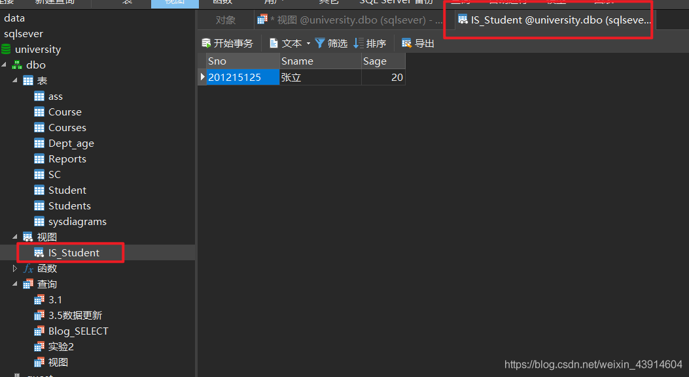  
**\[例2\]建立信息系学生的视图，并要求进行修改和插入操作时仍需保证该视图只有信息系IS的学生 。**  
**对IS\_Student视图的更新操作：**

-   修改操作：自动加上Sdept= 'IS’的条件
-   删除操作：自动加上Sdept= 'IS’的条件
-   插入操作：自动检查Sdept属性值是否为’IS’
    -   如果不是，则拒绝该插入操作
    -   如果没有提供Sdept属性值，则自动定义Sdept为’IS’

```
CREATE VIEW IS_Student
AS 
SELECT Sno,Sname,Sage
FROM  Student
WHERE  Sdept= 'IS'
WITH CHECK OPTION;
```

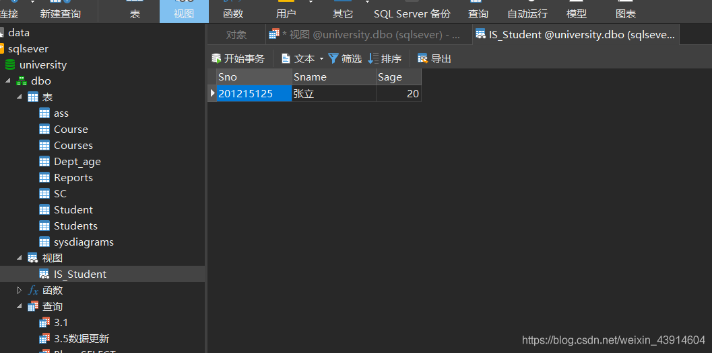  
**基于多个基表的视图**

**\[例3\] 建立信息系选修了1号课程的学生视图。**

```
CREATE VIEW IS_S1(Sno,Sname,Grade)
AS 
SELECT Student.Sno,Sname,Grade
FROM  Student,SC
WHERE  Sdept= 'IS' 
AND Student.Sno=SC.Sno 
AND SC.Cno= '1';
```

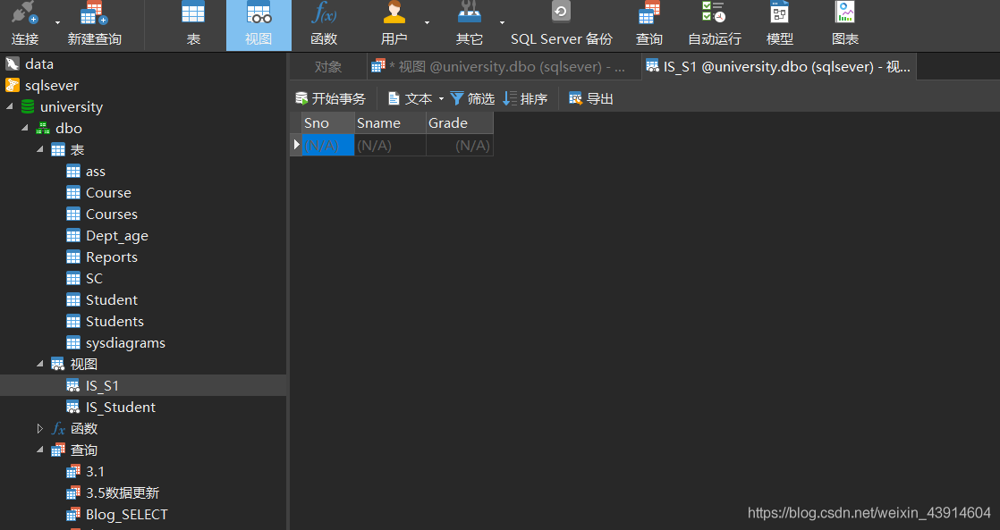  
**基于视图的视图**

**\[例4\] 建立信息系选修了1号课程且成绩在90分以上的学生的视图。**

```
CREATE VIEW IS_S2
AS
SELECT Sno,Sname,Grade
FROM  IS_S1
WHERE  Grade>=90;
```

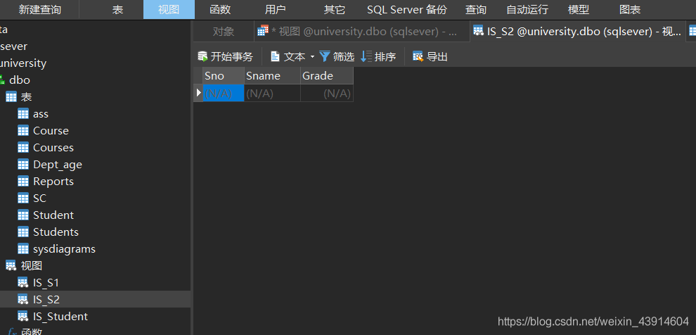

**带表达式的视图**

**\[例5\] 定义一个反映学生出生年份的视图。**

```
CREATE  VIEW BT_S(Sno,Sname,Sbirth)
AS 
SELECT Sno,Sname,2000-Sage
FROM  Student;
```

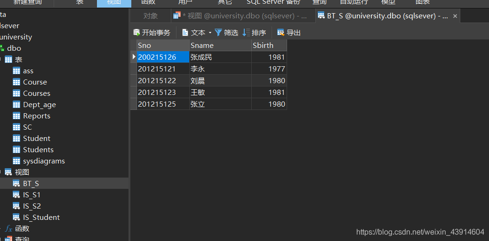

**分组视图**

**\[例6\] 将学生的学号及他的平均成绩定义为一个视图**

```
CREATE  VIEW S_G(Sno,Gavg)
AS  
SELECT Sno,AVG(Grade)
FROM  SC
GROUP BY Sno;
```

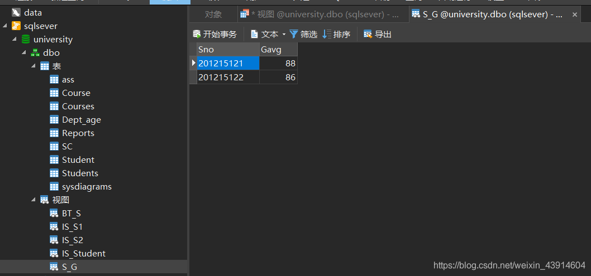  
**不指定属性列**  
**\[例7\]将Student表中所有女生记录定义为一个视图**

```
CREATE VIEW F_Student(F_Sno,name,sex,age,dept)
AS
SELECT *
FROM  Student
WHERE Ssex='女';
```

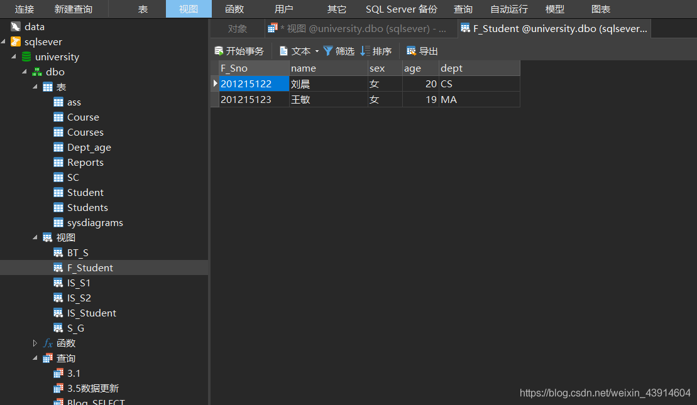  
**缺点：**

-   修改基表Student的结构后，Student表与F\_Student视图的映象关系被破坏，导致该视图不能正确工作。

#### ② 删除视图

**语句的格式:**

`DROP VIEW <视图名>;`

-   该语句从`数据字典`中删除指定的视图定义
-   如果该视图上还导出了其他视图，使用`CASCADE级联`删除语句，把该视图和由它导出的所有视图一起删除
-   删除基表时，由该基表导出的所有视图定义都必须显式地使用DROP VIEW语句删除

**［例8］ 删除视图IS\_S1**

```
DROP VIEW IS_S1;
```

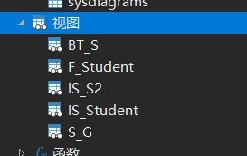

-   关于级联删除CASCADE，不知道为什么，删除模式、删除表、删除视图，有约束却删除不了，有待解决，先放这里。

### （2）查询视图

**用户角度：`查询视图与查询基本表相同`**

**RDBMS实现视图查询的方法**

-   视图消解法（View Resolution）
    -   进行有效性检查
    -   转换成等价的对基本表的查询
    -   执行`修正`后的查询

关系数据库管理系统执行对视图的查询时，首先进行`有效性检查`，检查查询中涉及的表、视图等是否存在。如果存在，则从`数据字典`中取出视图的定义，把定义中的`子查询`和`用户的查询`结合起来，`转换成等价的对基本表的查询`，`然后再执行修正了的查询`。这一转换过程称为`视图消解`(view resolution)。

**\[例9\] 在信息系学生的视图中找出年龄小于等于20岁的学生。**

```
SELECT   Sno,Sage
FROM      IS_Student
WHERE   Sage<=20;
```

IS\_Student视图的定义 (参见视图定义例1)  
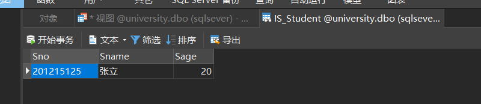  
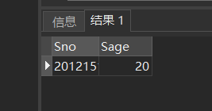  
**视图消解转换后的查询语句为：**

```
 SELECT  Sno，Sage       
 FROM  Student
 WHERE  Sdept= 'IS'  AND  Sage<=20；
```

**\[例10\] 查询选修了1号课程的信息系学生**

```
SELECT  IS_Student.Sno,Sname
FROM     IS_Student,SC
WHERE  IS_Student.Sno =SC.Sno AND SC.Cno= '1';
```

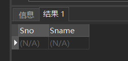

**视图消解法的局限**

-   有些情况下，视图消解法不能生成正确查询。

**\[例11\]在S\_G视图中查询平均成绩在90分以上的学生学号和平均成绩**

```
SELECT *
FROM   S_G
WHERE  Gavg>=90;
```

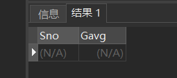

**S\_G视图的子查询定义：**

```
CREATE VIEW S_G (Sno,Gavg)
AS 
SELECT  Sno,AVG(Grade)
FROM  SC
GROUP BY Sno;
```

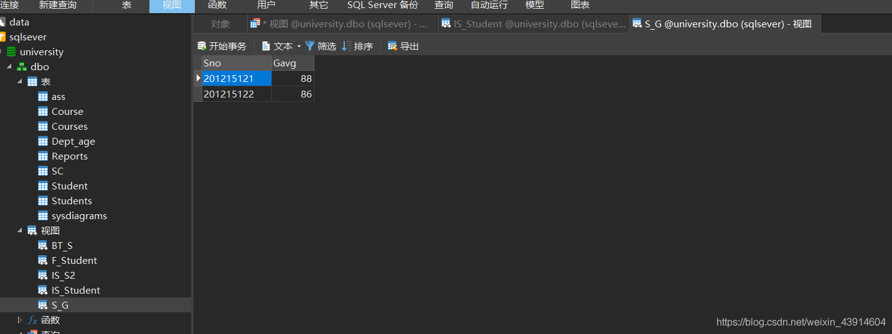

```
错误：
SELECT Sno,AVG(Grade)
FROM     SC
WHERE  AVG(Grade)>=90
GROUP BY Sno;

正确：
SELECT  Sno,AVG(Grade)
FROM  SC
GROUP BY Sno
HAVING AVG(Grade)>=90;
```

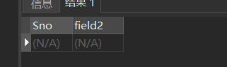

### （3）更新视图

#### ① 更新数据—UPDATE SET

**\[例12\] 将信息系学生视图IS\_Student中学号201215125的学生姓名改为“刘辰”。**  
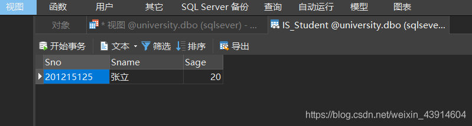

```
UPDATE  IS_Student
SET  Sname= '刘辰'
WHERE  Sno= '201215125';
转换后的语句：//基本表和视图表同步更新
UPDATE  Student
SET Sname= '刘辰'
WHERE Sno= '201215125' 
AND Sdept= 'IS'; 
```

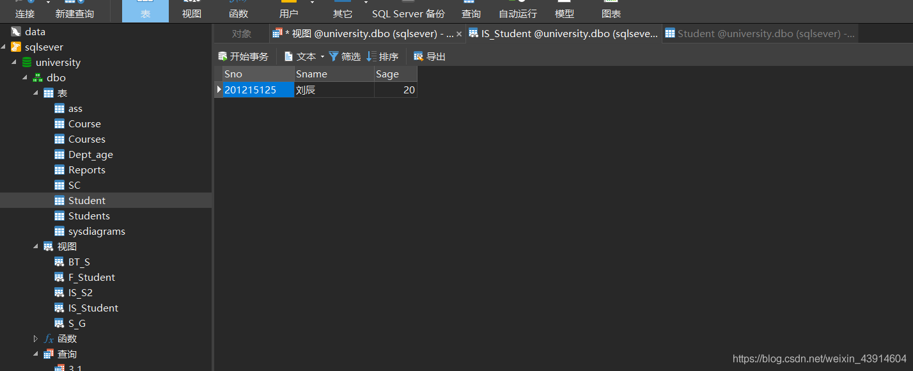  
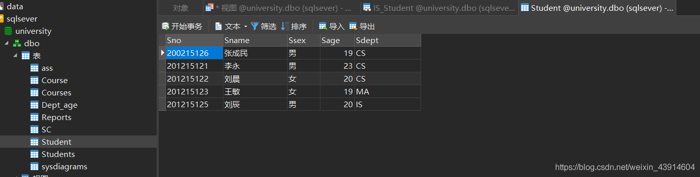

#### ② 插入数据—INSERT INTO

**\[例13\] 向信息系学生视图IS\_Student中插入一个新的学生记录：200215111，赵新，20岁**

```
视图IS_Student的定义
CREATE VIEW IS_Student
AS 
SELECT Sno,Sname,Sage
FROM    Student
WHERE  Sdept= 'IS';
//如果加了WITH CHECK OPTION，则视图不能进行插入数据操作
CREATE VIEW IS_Student
AS 
SELECT Sno,Sname,Sage
FROM  Student
WHERE  Sdept= 'IS'
WITH CHECK OPTION;

//插入数据
INSERT
INTO IS_Student
VALUES('200215111','赵新',20);
//插入后基本表Student字段Sdept为空，视图表IS_Student无数据
转换为对基本表的更新：
INSERT
INTO   Student(Sno,Sname,Sage,Sdept)
VALUES('200215129','赵新2',20,'IS');
```

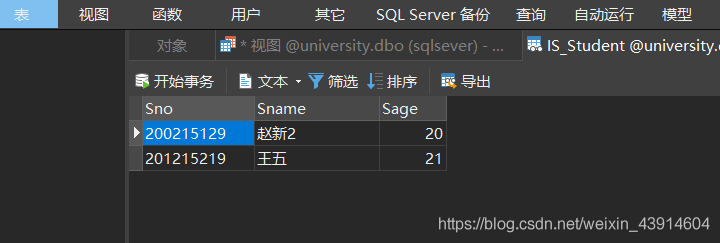  
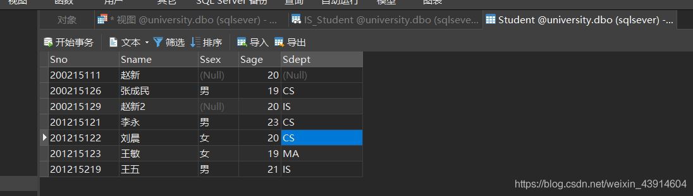

#### ③ 删除数据—DELETE

**\[例14\]删除信息系学生视图IS\_Student中学号为200215129的记录**

```
DELETE
FROM IS_Student
WHERE Sno= '200215129';
转换为对基本表的更新：
DELETE
FROM Student
WHERE Sno= '200215129' AND Sdept= 'IS';
```

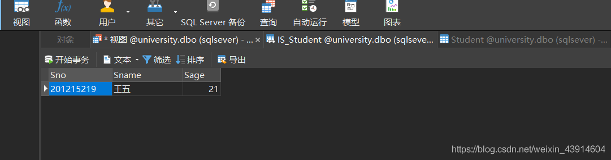  
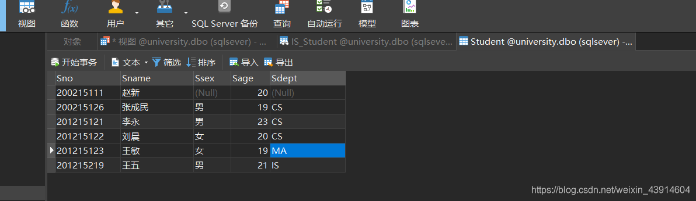

#### ④ 更新视图的限制

- `更新视图的限制：`一些视图是不可更新的，因为对这些视图的更新不能唯一地有意义地转换成对相应基本表的更新。即多条数据形成的一个结果，无法对其进行修改

- **DB2**对视图更新的限制：

    **若视图是由两个以上基本表导出的，则此视图不允许更新。**

    **若视图的字段来自字段表达式或常数，则不允许对此视图执行**INSER和UPDATE操作，但允许执行DELETE操作。

    **若视图的字段来自集函数，则此视图不允许更新。**

    **若视图定义中含有**GROUP BY子句，则此视图不允许更新。

    **若视图定义中含有**DISTINCT短语，则此视图不允许更新。无法确定是哪个

    **若视图定义中有嵌套查询，并且内层查询的**FROM子句中涉及的表也是导出该视图的基本表，则此视图不允许更新。

**例：视图S\_G为不可更新视图。**  
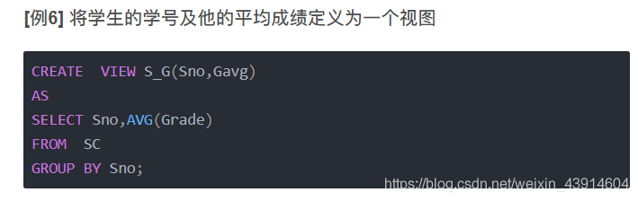

```
UPDATE  S_G
SET          Gavg=90
WHERE  Sno= '200215121';
```

这个对视图的更新无法转换成对基本表SC的更新

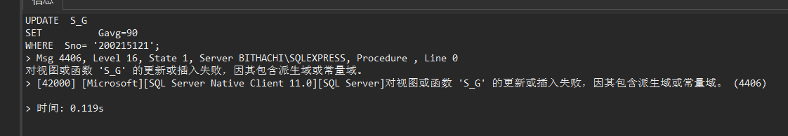

-   允许对行列子集视图进行更新
  
-   对其他类型视图的更新不同系统有不同限制