**一、嵌入式SQL**  
SQL语言提供了两种不同的使用方式  
①交互式  
②嵌入式  
为什么要引入嵌入式SQL？？？  
①SQL语言是非过程性语言  
②事务处理应用需要高级语言  
这两种方式细节上有差别，在程序设计的环境下，SQL语句要做某些必要的扩充  
**1\. 嵌入式SQL的处理过程**  
（1）主语言  
嵌入式SQL是将SQL语句嵌入程序设计语言中，被嵌入的程序设计语言，如C、C++、Java，称为宿主语言，简称主语言。  
（2）处理过程  
预编译过程  
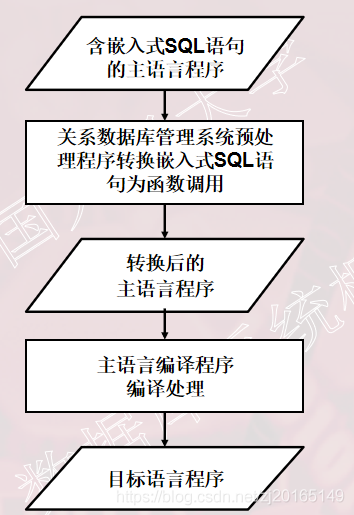  
（3)为了区分SQL语句与主语言语句，所有SQL语句必须加前缀EXEC SQL，  
主语言为C语言时，语句格式：  
EXEC SQL <SQL语句>

**2\. 嵌入式SQL语句与主语言之间的通信**

| sql语句                | 高级语言语句           |
| ---------------------- | ---------------------- |
| 描述性的面向集合的语句 | 过程性的面向记录的语句 |
| 负责操纵数据库         | f负责控制逻辑流程      |

**二者如何通信呢？**  
①**向主语言传递SQL语句的执行状态信息**，使主语言能够据此控制程序流程，主要用**SQL通信区**实现  
②**主语言向SQL语句提供参数**，主要用主变量实现  
③将SQL语句查询数据库的**结果交主语言处理**，主要用主变量和游标实现

**（1）SQL通信区**（SQL Communication Area，  
简称SQLCA）  
SQLCA是一个数据结构  
SQLCA的用途？？？  
SQL语句执行后，系统反馈给应用程序信息；这些信息将送到SQL通信区中：应用程序从SQL通信区中取出这些状态信息，据此决定接下来执行的语句

SQLCA 使用方法  
1）定义SQLCA  
用 EXEC SQL INCLUDE SQLCA定义  
2）使用SQLCA  
①SQLCA中有一个存放每次执行SQL语句后返回代码的变量SQLCODE  
②如果SQLCODE等于预定义的常量SUCCESS，则表示SQL语句成功，否则表示出错  
③应用程序每执行完一条SQL 语句之后都应该测试一下SQLCODE的值，以了解该SQL语句执行情况并做相应处理

**（2）主变量（Host Variable）**  
①嵌入式SQL语句中可以使用主语言的程序变量来输入或输出数据  
②在SQL语句中使用的主语言程序变量简称为主变量  
1）主变量的类型  
①输入主变量  
由应用程序对其赋值，SQL语句引用  
②输出主变量  
由SQL语句对其赋值或设置状态信息，返回给应用程序  
2）指示变量  
是一个整型变量，用来“指示”所指主变量的值或条件  
一个主变量可以附带一个指示变量（Indicator Variable）  
指示变量的用途：  
①指示输入主变量是否为空值  
②检测输出变量是否为空值，值是否被截断  
3）在SQL语句中使用主变量和指示变量的方法  
说明主变量和指示变量  
BEGIN DECLARE SECTION  
…  
… （说明主变量和指示变量）  
…  
END DECLARE SECTION  
4）使用主变量  
①说明之后的主变量可以在SQL语句中任何一个能够使用表达式的地方出现  
②为了与数据库对象名（表名、视图名、列名等）区别，SQL语句中的主变量名前要加==冒号（:）==作为标志  
5）使用指示变量  
①指示变量前也必须加冒号标志  
②必须紧跟在所指主变量之后

**（3）游标**  
为什么要使用游标？？？  
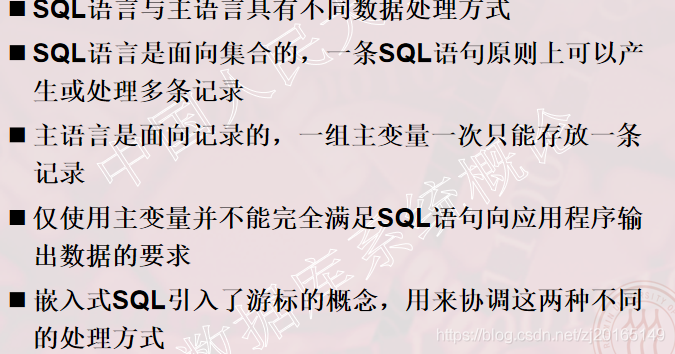  
1)什么是游标？？？  
①游标是系统为用户开设的一个数据缓冲区，存放SQL语句的执行结果  
②每个游标区都有一个名字  
③用户可以用SQL语句逐一从游标中获取记录，并赋给主变量，交由主语言进一步处理

**（4）建立和关闭数据库连接**  
EXEC SQL CONNECT TO target【AS connection-name】【USER user-name】  
1）target：要连接的数据库服务器  
常见的服务器标识串，如  
@:  
2）connection-name：可选的连接名，必须是一个有效的标识符  
在整个程序内只有一个连接时可以不指定连接名  
程序运行过程可以修改当前连接  
EXEC SQL SET CONNECTION connection-name|DEFAULT;

**（5）关闭数据库连接**  
EXEC SQL DISCONNECT \[connection\];

例子：依次检查某个系的学生记录，交互式更新某些学生年龄。

```
EXEC SQL BEGIN DECLARE SECTION;//主变量说明开始
char Deptname[20];
char Hsno[9];
char Hsname[20]; 
char Hssex[2];
int HSage;
int NEWAGE;
EXEC SQL END DECLARE SECTION; //主变量说明结束
long SQLCODE;
EXEC SQL INCLUDE SQLCA;       //定义SQL通信区
int main(void)
{
   int count=0;
   char yn; /*变量yn代表yes或no*/
   printf("Please choose the department name(CS/MA/IS): "); 
   scanf("%s",deptname);                 /*为主变量deptname赋值*/
   EXEC SQL CONNECT TO TEST@localhost:54321 USER "SYSTEM"/"MANAGER"; /*连接数据库TEST*/
   EXEC SQL DECLARE SX CURSOR FOR      /*定义游标SX*/
SELECT Sno,Sname,Ssex,Sage     /*SX对应的语句*/
FROM Student
WHERE SDept = :deptname;
  EXEC SQL OPEN SX;       /*打开游标SX，指向查询结果的第一行*/
   for ( ; ; )                      /*用循环结构逐条处理结果集中的记录*/
{ 
EXEC SQL FETCH SX INTO :HSno,:Hsname,:HSsex,:HSage;
 /*推进游标，将当前数据放入主变量*/
if (SQLCA.SQLCODE!= 0)     /*SQLCODE != 0，表示操作不成功*/
break;            /*利用SQLCA中的状态信息决定何时退出循环*/
if(count++ == 0)                   /*如果是第一行的话，先打出行头*/
        printf("\n%-10s %-20s %-10s %-10s\n",
            "Sno“,"Sname“,"Ssex", "Sage");
printf("%-10s %-20s %-10s %-10d\n“,
   HSno,Hsname,Hssex,HSage);                 /*打印查询结果*/
 printf(“UPDATE AGE(y/n)?”);    /*询问用户是否要更新该学生的年龄*/
 do{scanf("%c",&yn);}
 while(yn != 'N' && yn != 'n' && yn != 'Y' && yn != 'y');
          if (yn == 'y' || yn == 'Y')                          /*如果选择更新操作*/
  {
              printf("INPUT NEW AGE:");
   scanf("%d",&NEWAGE);       /*用户输入新年龄到主变量中*/
              EXEC SQL UPDATE Student          /*嵌入式SQL更新语句*/
              SET Sage = :NEWAGE
   WHERE CURRENT OF SX;
    }                        /*对当前游标指向的学生年龄进行更新*/
 }
  EXEC SQL CLOSE SX;               /*关闭游标SX，不再和查询结果对应*/
  EXEC SQL COMMIT WORK;                                     /*提交更新*/
  EXEC SQL DISCONNECT TEST;                         /*断开数据库连接*/
}
```

**3\. 不用游标的SQL语句**  
不用游标的SQL语句的种类  
1）说明性语句  
2）数据定义语句  
3）数据控制语句  
4）查询结果为单记录的select语句  
5）非current形式的增删改语句

**（1）查询结果为单记录的select语句**  
这类语句不需要使用游标，只需用INTO子句指定存放查询结果的主变量。  
①INTO子句、WHERE子句和HAVING短语的条件表达式中均可以使用主变量

```
例 根据学生号码查询学生信息。

EXEC SQL SELECT Sno,Sname,Ssex,Sage,Sdept  
         INTO:Hsno,:Hname,:Hsex,:Hage,:Hdept
           FROM  Student
         WHERE Sno=:givensno;
 /*把要查询的学生的学号赋给为了主变量givensno*/
```

如果查询结果实际上并不是单条记录，而是多条记录，则程序出错，关系数据库管理系统会在SQLCA中返回错误信息  
②在UPDATE的SET子句和WHERE子句中可以使用主变量，SET子句还可以使用指示变量

```
[例] 修改某个学生选修1号课程的成绩。

EXEC SQL UPDATE SC
               SET Grade=:newgrade
               /*修改的成绩已赋给主变量：newgrade*/
               WHERE Sno=:givensno;
   /*学号赋给主变量：givensno*/
```

**4\. 使用游标的SQL语句**  
必须使用游标的SQL语句  
①查询结果为多条记录的SELECT语句  
②CURRENT形式的UPDATE语句  
③CURRENT形式的DELETE语句

**（1）查询结果为多条记录的SELECT语句**  
使用游标的步骤  
①说明游标  
使用DECLARE语句  
EXEC SQL DECLARE <游标名> CURSOR FOR <SELECT语句>;  
是一条说明性语句，这时关系数据库管理系统并不执行SELECT语句

②打开游标  
使用OPEN语句  
EXEC SQL OPEN <游标名>;  
打开游标实际上是执行相应的SELECT语句，把查询结果取到缓冲区中  
这时游标处于活动状态，指针指向查询结果集中的第一条记录

③推进游标指针并取当前记录  
使用FETCH语句  
EXEC SQL FETCH <游标名>  
INTO <主变量>\[<指示变量>\]  
\[,<主变量>\[<指示变量>\]\]….;  
指定方向推动游标指针，同时将缓冲区中的当前记录取出来送至主变量供主语言进一步处理

④关闭游标  
使用CLOSE语句  
EXEC SQL CLOSE <游标名>;  
关闭游标，释放结果集占用的缓冲区及其他资源  
游标被关闭后，就不再和原来的查询结果集相联系  
被关闭的游标可以再次被打开，与新的查询结果相联系

**（2）CURRENT形式的DELETE语句和UPDATE语句**  
1）非CURRENT形式的UPDATE语句和DELETE语句  
①面向集合的操作  
②一次修改或删除所有满足条件的记录  
2）如果只想修改或删除其中某个记录  
UPDATE语句和DELETE语句中要用子句  
WHERE CURRENT OF<游标名>  
表示修改或删除的是最近一次取出的记录，即游标指针指向的记录  
3）不能使用CURRENT形式的UPDATE语句和DELETE语句  
当游标定义中的SELECT语句带有UNION或ORDER BY子句，该SELECT语句相当于定义了一个不可更新的视图

**5\. 动态SQL**  
静态嵌入式SQL  
能够满足一般要求，无法满足要到执行时才能够确定要提交的SQL语句、查询的条件。  
动态嵌入式SQL  
允许在程序运行过程中临时“组装”SQL语句，支持动态组装SQL语句和动态参数两种形式。  
（1）使用SQL语句主变量  
①程序主变量包含的内容是SQL语句的内容，而不是原来保存数据的输入或输出变量  
②SQL语句主变量在程序执行期间可以设定不同的SQL语句，然后立即执行

```
EXEC SQL BEGIN DECLARE SECTION;
    const char *stmt="CREATE TABLE test(a int);"; /*SQL语句主变量，内容是创建表的SQL语句*/
EXEC SQL END DECLARE SECTION;
    ... 
EXEC SQL EXECUTE IMMEDIATE :stmt;
     /*执行动态SQL语句*/
```

（2）动态参数  
①SQL语句中的可变元素  
②使用参数符号（?）表示该位置的数据在运行时设定。  
动态参数的输入不是编译时完成绑定  
而是通过 PREPARE语句准备主变量和执行语句EXECUTE绑定数据或主变量来完成

使用动态参数的步骤  
1）声明SQL语句主变量  
2）准备SQL语句（PREPARE）  
EXEC SQL PREPARE <语句名>  
FROM <SQL语句主变量>;  
3）执行准备好的语句  
EXEC SQL EXECUTE <语句名>  
\[INTO <主变量表>\]  
\[USING <主变量或常量>\];

```
[例] 向TEST中插入元组。
EXEC SQL BEGIN DECLARE SECTION;
const char *stmt = "INSERT INTO test VALUES(?);";
                                        /*声明SQL主变量内容是INSERT语句 */
EXEC SQL END DECLARE SECTION;
... 
EXEC SQL PREPARE mystmt FROM :stmt; /*准备语句*/
... 
EXEC SQL EXECUTE mystmt USING 100;
                                   /*执行语句，设定INSERT语句插入值100 */
EXEC SQL EXECUTE mystmt USING 200;  
                                  /* 执行语句，设定INSERT语句插入值200 */

```

**二、过程化SQL**  
**1\. 过程化SQL的块结构**  
（1）什么是过程化SQL？  
1）SQL的扩展  
2）增加了过程化的语句功能  
3）基本结构是块  
①块之间可以相互嵌套  
②每个块完成一个逻辑操作  
（2）过程化SQL块的基本结构  
1）定义部分  
DECLARE 变量、常量、游标、异常等  
定义的变量、常量等只能在该基本块中使用  
当基本块执行结束时，定义就不再存在  
2）执行部分

```
 BEGIN
  SQL语句、过程化SQL的流程控制语句
 EXCEPTION
  异常处理部分        
 END；
```

**2\. 常量和变量的定义**  
（1）变量定义  
变量名 数据类型 \[\[NOT NULL\]:=初值表达式\]  
或  
变量名 数据类型 \[\[NOT NULL\] 初值表达式\]  
（2）常量定义  
常量名 数据类型 CONSTANT :=常量表达式  
常量必须要给一个值，并且该值在存在期间或常量的作用域内不能改变。如果试图修改它，过程化SQL将返回一个异常  
（3）赋值语句  
变量名称 :=表达式

**3\. 流程控制**  
（1）过程化SQL功能  
1）条件控制语句  
IF-THEN，IF-THEN-ELSE和嵌套的IF语句

```

（1）IF condition THEN
       Sequence_of_statements;        
  END IF;   
（2）IF condition THEN
       Sequence_of_statements1;  
  ELSE
       Sequence_of_statements2;  
  END IF;
```

在THEN和ELSE子句中还可以再包含IF语句，即IF语句可以嵌套  
2）循环控制语句  
LOOP，WHILE-LOOP和FOR-LOOP  
①简单的循环语句LOOP

```
 LOOP
 Sequence_of_statements;        
 END LOOP; 
 //多数数据库服务器的过程化SQL都提供EXIT、BREAK或LEAVE等循环结束语句，保证LOOP语句块能够结束
```

②WHILE-LOOP

```
WHILE condition LOOP
    Sequence_of_statements;
END LOOP;
```

（3）FOR-LOOP

```
FOR count IN [REVERSE] bound1 … bound2 LOOP
     Sequence_of_statements;
END LOOP;
```

3）错误处理  
如果过程化SQL在执行时出现异常，则应该让程序在产生异常的语句处停下来，根据异常的类型去执行异常处理语句  
SQL标准对数据库服务器提供什么样的异常处理做出了建议，要求过程化SQL管理器提供完善的异常处理机制

**三、存储过程和函数**  
命名块  
编译后保存在数据库中，可以被反复调用，运行速度较快，过程和函数是命名块  
匿名块  
每次执行时都要进行编译，它不能被存储到数据库中，也不能在其他过程化SQL块中调用  
**1\. 存储过程**  
什么是存储过程？？？  
由过程化SQL语句书写的过程，经编译和优化后存储在数据库服务器中，使用时只要调用即可。  
（1）存储过程的优点  
1）运行效率高  
2）降低客户机和服务器之间的通信量  
3）方便实施企业规则  
（2）存储过程的用户接口  
1）创建存储过程  
2）执行存储过程  
3）修改存储过程  
4）删除存储过程  
创建存储过程

```
CREATE OR REPLACE PROCEDURE 过程名([参数1,参数2,...]) AS <过程化SQL块>；
//参数：必须指定值的类型。可以定义输入参数和输出参数
```

eg：利用存储过程来实现下面的应用：从账户1转指定数额的款项到账户2中。

```
BEGIN 
    DECLARE totalDepositOut Float;
    DECLARE  totalDepositIn Float;
DECLARE  inAccountnum INT;   
                   
  SELECT Total INTO totalDepositOut 
    FROM account 
  WHERE accountnum=outAccount; 
  IF totalDepositOut IS NULL THEN 
           ROLLBACK;   
    END IF;
    IF totalDepositOut<amount THEN    
         ROLLBACK; 
  END IF;
    SELECT Accountnum INTO inAccountnum FROM Account
    WHERE accountnum=inAccount;
    IF inAccount IS NULL THEN                    
         ROLLBACK;           
    END IF;
    
    UPDATE Account 
    SET total=total-amount 
    WHERE accountnum=outAccount;
 /* 修改转出账户余额，减去转出额 */
    UPDATE Account 
    SET total=total + amount 
    WHERE   accountnum=inAccount; 
    COMMIT;                       
END
```

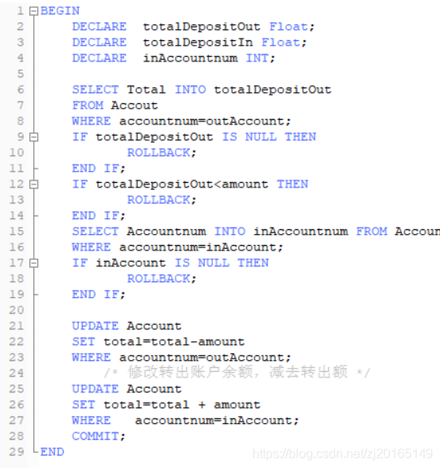  
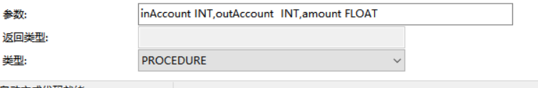  
执行存储过程

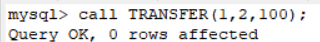  
修改存储过程（ppt中，mysql8中不适用）  


删除存储过程  
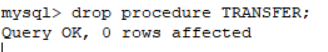

**2\. 函数**  
（1）函数与存储过程的异同  
同：都是持久性存储模块  
异：函数必须指定返回的类型

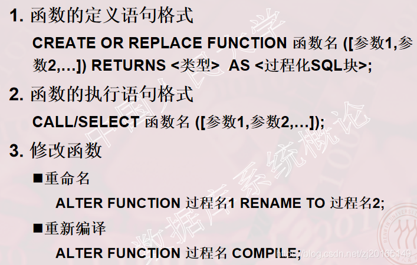  
**四、ODBC编程**  
ODBC优点  
移植性好  
能同时访问不同的数据库  
共享多个数据资源  
**1\. ODBC概述**  
（1）ODBC产生的原因  
①由于不同的数据库管理系统的存在，在某个关系数据库管理系统下编写的应用程序就不能在另一个关系数据库管理系统下运行  
②许多应用程序需要共享多个部门的数据资源，访问不同的关系数据库管理系统  
（2）什么是ODBC？  
是微软公司开放服务体系中有关数据库的一个组成部分  
提供了一组访问数据库的应用程序编程接口（API)

**2\. ODBC应用系统的体系结构**  
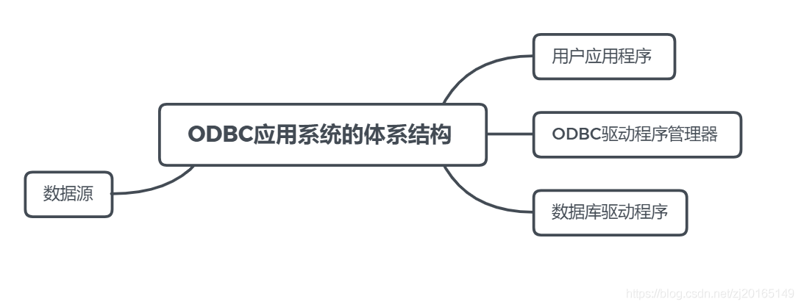  
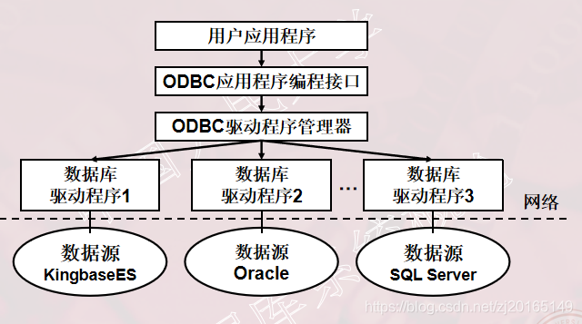  
（1）用户应用程序  
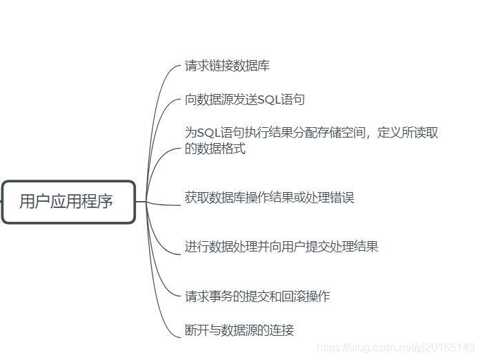  
（2）ODBC驱动程序管理器  
包含在ODBC32.DLL中  
管理应用程序和驱动程序之间的通信  
建立、配置或删除数据源，并查看系统当前所安装的数据库ODBC驱动程序  
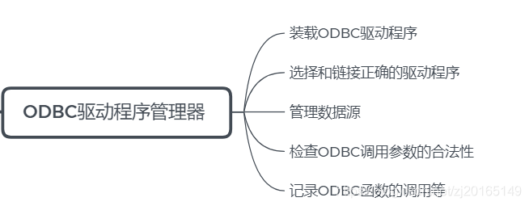  
（3）数据驱动程序  
①ODBC通过驱动程序来提供应用系统与数据库平台的独立性  
②ODBC应用程序不能直接存取数据库  
其各种操作请求由驱动程序管理器提交给某个关系数据库管理系统的ODBC驱动程序  
通过调用驱动程序所支持的函数来存取数据库  
数据库的操作结果也通过驱动程序返回给应用程序  
如果应用程序要操纵不同的数据库，就要动态地链接到不同的驱动程序上。  
③ODBC驱动程序类型  
  
a）单束：数据源和应用程序在同一台机器上，驱动程序直接完成对数据文件的I/O操作  
b)多束：支持客户机——服务器、客户机—应用服务器/数据库服务器等网络环境下的数据访问，由驱动程序完成数据库访问请求的提交和结果集接收，应用程序使用驱动程序提供的结果集管理接口操纵执行后的结果数据

（4）ODBC数据源管理  
是最终用户需要访问的数据，包含了数据库位置和数据库类型等信息，是一种数据连接的抽象  
数据源对最终用户是透明的  
ODBC给每个被访问的数据源指定唯一的数据源名（Data Source Name，简称DSN），并映射到所有必要的、用来存取数据的低层软件  
在连接中，用数据源名来代表用户名、服务器名、所连接的数据库名等  
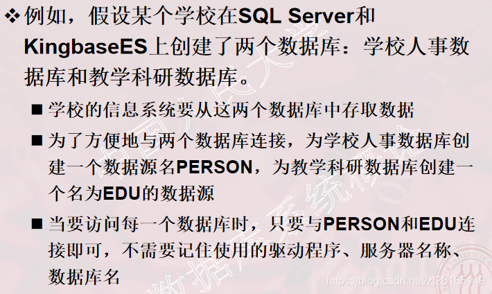

**3\. ODBC API 基础**  
ODBC 应用程序编程接口的一致性  
①API一致性：包含核心级、扩展1级、扩展2级  
②语法一致性：包含最低限度SQL语法级、核心SQL语法级、扩展SQL语法级  
（1）函数概述  
ODBC不同版本上的函数和函数使用是有差异的，读者必须注意使用的版本。  
（2）句柄  
句柄是32位整数值，代表一个指针  
ODBC 3.0中句柄分类  
①环境句柄  
②连接句柄  
③语句句柄  
④描述符句柄  
句柄之间的关系  
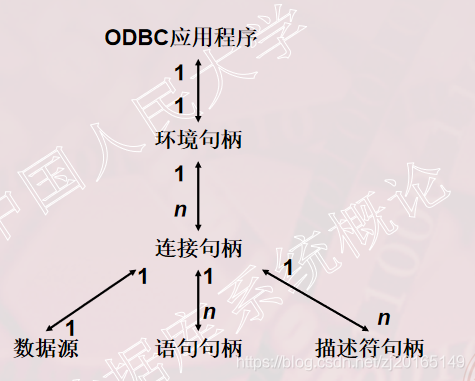  
（3)数据类型  
ODBC数据类型  
SQL数据类型：用于数据源  
C数据类型 ：用于应用程序的C代码

**4\. ODBC的工作流程**  
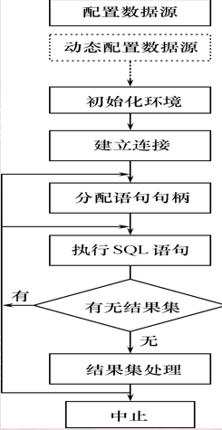