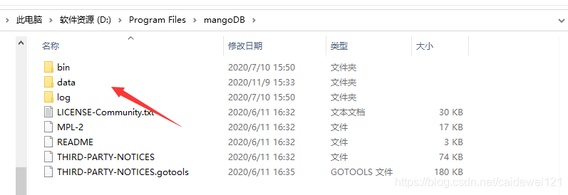
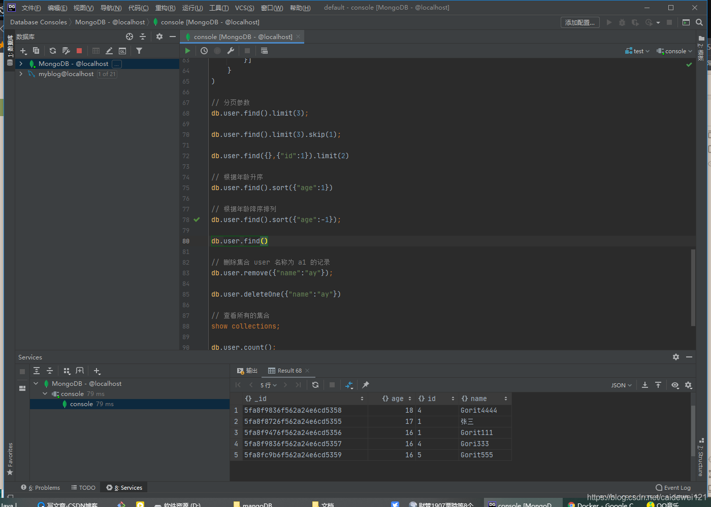
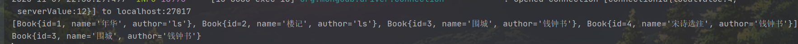

## 一、什么是 MongoDB ？

#### 1.1 MongoDB 介绍

MongoDB 是由C++语言编写的，是一个基于**分布式文件存储**的开源数据库系统。旨在为WEB应用提供可扩展的高性能数据存储解决方案。

[百度百科介绍](https://baike.baidu.com/item/mongodb/60411?fr=aladdin)

从上面的描述可以得知

- MangoDB 由 c++ 编写，运行效率自然不低
- 分布式文件存储系统
- 开源数据库系统，谁都可以用

#### 1.2 MongoDB 的特点

这里只列举我认为是比较有用特点，网上关于 MangoDB 的特点介绍还有很多很多，我这里就不一一列举了。

- MongoDB 是一个面向文档存储的数据库，操作起来比较简单和容易。
- 文件存储格式为BSON（一种JSON的扩展），BSON 支持文档和数组的嵌套。
- Mongo支持丰富的查询表达式。查询指令使用JSON形式的标记，可轻易查询文档中内嵌的对象及数组。
- MongoDB支持各种编程语言:RUBY，PYTHON，JAVA，C++，PHP，C#等多种语言
- 等等

#### 1.3 MongoDB 相关术语介绍

##### 1.3.1 数据库

一个 MongoDB 可以建立多个数据库  
MongoDB 的默认数据库是 “”db” ，该数据库存储在 data 目录中

##### 1.3.2 文档（Document）

**文档**是一组键值(key-value)对(即 BSON)。MongoDB 的文档不需要设置相同的字段，并且相同的字段不需要相同的数据类型，这与关系型数据库有很大的区别，也是 MongoDB 非常突出的特点。

下面就是一个简单的文档示例

```js
{"site": "https://www.gorit.cn", "name":"CodingGorit"}
```

RDBMS 与 MongoDB 对应的术语

| RDBMS  | MongoDB                             |
| ------ | ----------------------------------- |
| 数据库 | 数据库                              |
| 表格   | 集合                                |
| 行     | 文档                                |
| 列     | 字段                                |
| 表联合 | 嵌入文档                            |
| 主键   | 主键 （MangoDB 提供了 key 为 \_id） |

##### 1.3.3 集合

集合就是 MongoDB **文档组**，类似于 RDBMS （关系数据库管理系统：Relational Database Management System)中的表格。

集合存在于数据库中，集合没有固定的结构，这意味着你在对集合可以插入不同格式和类型的数据，但通常情况下我们插入集合的数据都会有一定的关联性。

比如，我们可以将以下不同的数据结构的文档插入到集合中

```js
{"site": "https://www.gorit.cn"}
{"site": "https://www.gorit.cn", "name":"CodingGorit"}
{"site": "https://www.gorit.cn", "name":"CodingGorit","age":5}
```

当第一个文档插入时，集合就会被创建

- 集合名不能使空字符串
- 集合名不能含有\\0字符（空字符)，这个字符表示集合名的结尾。
- 集合名不能以"system."开头，这是为系统集合保留的前缀。
- 用户创建的集合名字不能含有保留字符。有些驱动程序的确支持在集合名里面包含，这是因为某些系统生成的集合中包含该字符。除非你要访问这种系统创建的集合，否则千万不要在名字里出现$。

##### 1.3.4 一览表

| SQL 术语概念 | MongoDB 术语概念 | 解释/说明                              |
| ------------ | ---------------- | -------------------------------------- |
| database     | database         | 数据库                                 |
| table        | collection       | 数据库表/ 集合                         |
| row          | document         | 数据记录行/文档                        |
| column       | field            | 数据字段/域                            |
| index        | index            | 索引                                   |
| primary key  | primary key      | 主键 MongoDB 自动将\_id 字段设置为主键 |

#### 1.4 MongoDB 数据类型

下面列举 MangoDB 中常见的数据类型 （摘自菜鸟教程）

| 数据类型      | 描述                                                         |
| ------------- | ------------------------------------------------------------ |
| String        | 字符串，存储数据的常用数据类，在 mangoDB 中 UTF-8 编码的字符串才是合法的 |
| Integer       | 整型数值，用于存储数值，根据你所采取的服务器，可以为分 64位和 32位。 |
| Boolean       | 布尔值，存储布尔值（真假）                                   |
| Double        | 双精度浮点值，用于存储浮点值                                 |
| Min、Max keys | 讲一个值与 BSON （二进制 JSON） 元素的最低值和最高值相比     |
| Array         | 用于将数组或者列表多个值存储为一个键                         |
| TimeStamp     | 时间戳，记录文档修改或者添加的具体时间                       |
| Object        | 用于内嵌文档                                                 |
| Null          | 用于创建空值                                                 |
| Date          | 日期时间，用 UNIX 时间格式来存储当前日期或时间。你可以指定自己的日期时间，创建 Date 对象，传入年月日信息 |

。。

## 二、MongoDB 可以做什么？

我们看看网上的企业都在哪 mangoDB 做什么

- Craiglist上使用MongoDB的存档数十亿条记录。
- FourSquare，基于位置的社交网站，在Amazon EC2的服务器上使用MongoDB分享数据。
- Shutterfly，以互联网为基础的社会和个人出版服务，使用MongoDB的各种持久性数据存储的要求。
- bit.ly, 一个基于Web的网址缩短服务，使用MongoDB的存储自己的数据。
- spike.com，一个MTV网络的联营公司， spike.com使用MongoDB的。
- Intuit公司，一个为小企业和个人的软件和服务提供商，为小型企业使用MongoDB的跟踪用户的数据。
- sourceforge.net，资源网站查找，创建和发布开源软件免费，使用MongoDB的后端存储。
- etsy.com ，一个购买和出售手工制作物品网站，使用MongoDB。  
    纽约时报，领先的在线新闻门户网站之一，使用MongoDB。
- CERN，著名的粒子物理研究所，欧洲核子研究中心大型强子对撞机的数据使用MongoDB。

## 三、MongoDB 的基本使用

#### 3.1 下载及配置 MongoDB

[MongoDB 迅雷网盘](https://pan.xunlei.com/s/VMLfypldoAqBO3GpyF1RTfc_A1)  
提取码：2JOq

MongoDB 百度云网盘  
提取码：g9lu

具体安装的过程我就省略，网上有很多教程，我这里就不展示了

下载好安装完毕后，记得配置环境变量

- `D:\Program Files\mangoDB\bin`

记得在根路径创建一个 data 文件夹，我们的数据文件都会存储在这里  


#### 3.2 MongoDB 常用命令一栏

##### 3.2.1 数据库相关操作

| mangoDB 命令               | 命令作用                                                   | 执行效果 |
| -------------------------- | ---------------------------------------------------------- | -------- |
| show dbs                   | 显示所有数据的列表                                         | xx01     |
| db                         | 显示当前数据库或者集合                                     | xx02     |
| use xxx （xxx 为数据库名） | 可以连接到一个指定数据库，如果数据库不存在，就会创建数据库 | xxx03    |
| db.dropDatabase()          | 删除数据库，前提是要用 use xxx 进入该数据库，然后再删除    | xxx04    |

##### 3.2.2 集合操作

1. 创建集合

| MongoDB 命令                       | 命令作用   | 执行效果 |
| ---------------------------------- | ---------- | -------- |
| db.createCollection(name, options) | 创建集合   | xxx01    |
| show collections & show tables     | 查看看集合 | xxx02    |

创建固定集合 mycol，整个集合空间大小 6142800 KB, 文档最大个数为 10000 个。

```js
db.createCollection("mycol", { capped : true, autoIndexId : true, size : 
   6142800, max : 10000 } )
{ "ok" : 1 }
```

2. 删除集合

- db.collection.drop()
- collection 为集合名称

##### 3.2.3 文档操作

###### 1 插入文档

```sql
show dbs; // 查看数据库

use test; // 如果 test 数据库不存在，则创建 test

// 插入一条记录，如果集合不存在，先创建集合，在插入数据
db.user.insert({"id":"1","name":"Gorit","age":16});

// 一次性插入多条记录
db.user.insert({"id":"5","name":"Gorit555","age":16},{"id":"6","name":"Gorit6666","age":18});

// 一次性插入多条
db.user.insertMany([{"id":"4","name":"Gori333","age":16},{"id":"4","name":"Gorit4444","age":18}])
```

插入文档还有

- db.collection\_name.insertOne()
- db.collection\_name.insertMany()

###### 2\. 更新文档

语法

```sql
db.collection.update(
   <query>,
   <update>,
   {
     upsert: <boolean>,
     multi: <boolean>,
     writeConcern: <document>
   }
)
```

参数说明：

- query : update的查询条件，类似sql update查询内where后面的。
- update : update的对象和一些更新的操作符（如 , , ,inc…）等，也可以理解为sql update查询内set后面的
- upsert : 可选，这个参数的意思是，如果不存在update的记录，是否插入objNew,true为插入，默认是false，不插入。
- multi : 可选，mongodb 默认是false,只更新找到的第一条记录，如果这个参数为true,就把按条件查出来多条记录全部更新。
- writeConcern :可选，抛出异常的级别。

```sql
// 添加测试数据
db.user.insert({"id":"5","name":"Gorit ","age":16},);

// 修改数据
db.user.update(
    {"name":"Gorit"},
    {$set:{"name":"张三","age":17}}
 );
// 这样做只会修改第一条同名的条件记录，如果要批量修改同名的记录，可以这么做
db.user.update(
    {"name":"Gorit"},
    {$set:{"name":"张三","age":17}},
    {multi:true}
 );

// 更多的条件修改

只更新第一条记录：
db.col.update( { "count" : { $gt : 1 } } , { $set : { "test2" : "OK"} } );

全部更新：
db.col.update( { "count" : { $gt : 3 } } , { $set : { "test2" : "OK"} },false,true );

只添加第一条：
db.col.update( { "count" : { $gt : 4 } } , { $set : { "test5" : "OK"} },true,false );

全部添加进去:
db.col.update( { "count" : { $gt : 5 } } , { $set : { "test5" : "OK"} },true,true );

全部更新：
db.col.update( { "count" : { $gt : 15 } } , { $inc : { "count" : 1} },false,true );

只更新第一条记录：
db.col.update( { "count" : { $gt : 10 } } , { $inc : { "count" : 1} },false,false );
```

###### 3\. 删除文档

```sql
db.collection.remove(
   <query>,
   <justOne>
)

// mangoDB 版本在 2.6 版本以后
db.collection.remove(
   <query>,
   {
     justOne: <boolean>,
     writeConcern: <document>
   }
)
```

使用

```sql
// 删除所有数据
db.collection_ name.remove({})

// 删除指定字段的记录
db.collection_name.remove({"id":"1"})

// 删除指定记录的第一条
db.collection_name.remove({"id":"1"},1)

// 新版本删除所有的集合
db.collection_name.deleteMany({})

// 新版本删除多个 status 为 A的
db.collection_name.deleteMany({ status : "A" })

// 新版本删除一个 status 为 D 的集合
db.inventory.deleteOne( { status: "D" } )

```

###### 4\. 查询文档

###### 4.1 条件查询

对应 where 条件查询

| 操作       | 格式                      | 示例                              | RDBMS 中对应的语句 |
| ---------- | ------------------------- | --------------------------------- | ------------------ |
| 等于       | { key:value }             | db.user.find({“name”:“Gorit111”}) | where age = 17     |
| 小于       | { key : { $lt : value } } | db.user.find({“age”:{$lt:20}});   | where age < 20     |
| 小于或等于 | { key : { $lte : value }  | db.user.find({“age”:{$lte:20}});  | where age <= 20    |
| 大于       | { key : { $gt : value }   | db.user.find({“age”:{$gt:16}});   | where age > 16     |
| 大于或等于 | { key : { $gte : value }  | db.user.find({“age”:{$gte:16}});  | where age >=16     |
| 不等于     | { key : { $ne : value }   | db.user.find({“age”:{$ne: 16}})   | where age <> 16    |

```sql
//查看所有文档记录
db.collection_name.find()

// 查询一个文档
db.collection_name.findOne();

// 条件查询
// 条件查询 ==
db.user.find({"name":"Gorit111"})  // where name = "张三"  全匹配

// 条件查询 小于
db.user.find({"age":{$lt:17}}); // where age < 17

// 条件查询 小于或等于
db.user.find({"age":{$lte:20}}); // where age <= 20

// 条件查询 大于
db.user.find({"age":{$gt:16}}); // where age > 10

// 条件查询 大于或等于
db.user.find({"age":{$gte:16}}); // where age >= 16

// 条件查询  不等于
db.user.find({"age":{$ne: 16}})
```

###### 4.2 逻辑查询

```sql

// 逻辑与 and 查询
db.user.find({"age":17},{"id":"1"})

// 逻辑或 or 查询
db.user.find(
    {
        $or: [
            {"age":17},
            {"id":"1"}
        ]
    }
)

// 组合查询练习
where age <=20 or (name in ("张三","Gorit111")
db.user.find(
    {
        "age": {$lte: 20},
        $or: [
        {
            "name": "张三"
        },{
            "name": "Gorit111"
        }]
    }
)
```

###### 4.3 分页查询

1. 分页参数 Limit()

```sql
db.collection_name.find().limit(number);

// 查询数据库汇中的三条记录，如果数据库没有指定 limit() ，默认查询所有的数据
db.user.find().limit(3);
```

2. 使用 skip() 跳跃指定数量的数据

```sql
// 跳过第一条记录，查询往后的三条记录
db.user.find().limit(3).skip(1);
```

###### 4.4 排序

在 MangoDB 中使用 sort() 方法对数据进行排序， sort() 方法可以通过参数指定排序的字段，并使用 1 和 -1 来制定排序方式，1 表示升序列，-1 表示降序列

```sql
// 根据年龄升序
db.user.find().sort({"age":1})

// 根据年龄降序排列
db.user.find().sort({"age":-1});
```

###### 4.5 聚合

MangoDB 中聚合（aggregate）主要用于处理数据（诸如平均值，求和等）并返回计算的结果

不过我下的版本貌似不支持聚合查询，所这里就不掩饰了。

#### 3.3 数据库连接工具连接 MangoDB

有很多工具都可以连接，我使用的是 Jetbrains 公司提供的数据库连接软件：**datagrip**

当然使用 idea 自带的也可以

或者用其他的工具都行的



## 四、Java 连接 MangoDB

作为一名 Java 开发者，我们怎么能少了 Java 连接 mangoDB 呢？

接下来进入实战部分

#### 4.1 SpringBoot 整合 MongoDB

SpringBoot 整合 MongoDB 整合

1. 依赖导入

```xml
        <dependency>
            <groupId>org.springframework.boot</groupId>
            <artifactId>spring-boot-starter-data-mongodb</artifactId>
        </dependency>
```

2. 配置文件编写

> 为了方便测试，我这里

```yml
# 应用服务 WEB 访问端口
server:
  port: 8080
# 应用名称
spring:
  application:
    name: demo
  resources: # spring 静态资源扫描路径
    static-locations: classpath:/static/
  data:
    mongodb:
      database: test  # 要连接的数据库
      host: localhost  # 数据库地址
      port: 27017 # 端口
      #authentication-database: admin       # 验证登录信息库
      #username: # 连接数据库的账号
      #password: # 连接书库的密码
```

3. 实战

编写实体类

```java
package cn.gorit.entity;

/**
 * @Classname Book
 * @Description TODO
 * @Date 2020/11/9 21:48
 * @Created by CodingGorit
 * @Version 1.0
 */
public class Book {
    private Integer id;
    private String name;
    private String author;

	// getter setter 构造方法省略
}

```

编写 BookDao

```java
package cn.gorit.dao;

import cn.gorit.entity.Book;
import org.springframework.data.mongodb.repository.MongoRepository;

import java.util.List;

/**
 * @Classname BookDao
 * @Description TODO
 * @Date 2020/11/9 21:48
 * @Created by CodingGorit
 * @Version 1.0
 */
public interface BookDao extends MongoRepository<Book,Integer> {
    List<Book> findAllByAuthor(String author);

    Book findByNameEquals(String name);
}
```

编写 BookController

```java
package cn.gorit.controller;

import cn.gorit.dao.BookDao;
import cn.gorit.entity.Book;
import org.springframework.beans.factory.annotation.Autowired;
import org.springframework.data.mongodb.core.MongoTemplate;
import org.springframework.web.bind.annotation.GetMapping;
import org.springframework.web.bind.annotation.RestController;

import java.util.ArrayList;
import java.util.List;

/**
 * @Classname BookController
 * @Description TODO
 * @Date 2020/11/9 21:51
 * @Created by CodingGorit
 * @Version 1.0
 */
@RestController
public class BookController {

    // 实用内齿提供的 baseMongo
    @Autowired
    BookDao dao;
    
    // 实用 内置的template
    @Autowired
    MongoTemplate template;

    @GetMapping("/test1")
    public void test1() {
        List<Book> books = new ArrayList<>();
        books.add(new Book(1,"年华","ls"));
        books.add(new Book(2,"楼记","ls"));
        dao.insert(books);
        List<Book> b1 = dao.findAllByAuthor("ls");
        System.out.println(b1.toString());
        System.out.println(dao.findByNameEquals("楼记"));
    }

    @GetMapping("/test2")
    public void test2() {
        List<Book> books = new ArrayList<>();
        books.add(new Book(3,"围城","钱钟书"));
        books.add(new Book(4,"宋诗选注","钱钟书"));

        template.insertAll(books);
        List<Book> list = template.findAll(Book.class);
        System.out.println(list);
        Book book = template.findById(3,Book.class);
        System.out.println(book);
    }
}

```

接口测试  
