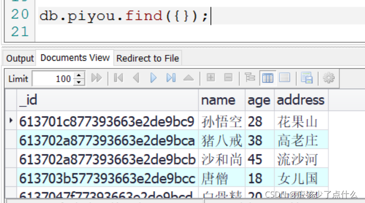

**一、数据库(database)**

① 什么是数据库？  
存储数据的仓库

②为什么要有数据库？  
首先数据是存储在内存里运行的，如果一断电的话，数据就会丢失，所以可以将数据存储到硬盘，但是硬盘没有联网，所以有了可以联网也可以存储数据的数据库。

③还有什么像数据库一样的玩意？  
暂未找到…

④数据库能做什么？  
数据库可以存储数据，并且这些数据还可以连接网络，也就是和硬盘相比，可以不用将数据库到处带，就像是网盘。

⑤数据库的服务器和客户端  
值得注意的是数据库它也是分为服务器和客户端的

```
	服务器：保存数据的
	客户端：操作和存储数据的(CRUD)
```

⑥数据库的分类  
按照关系型分类：

```
		1、关系型数据库(MySQL、Orcal等)
		2、非关系型数据库(MongoDB)
```

关系型和非关系型的区别:  
总而言之就是：关系型的是创建表格, 非关系型是可以创建任意多个文档。

```
1、数据存储方式不同。
关系型和非关系型数据库的主要差异是数据存储的方式。关系型数据天然就是表格式的，因此存储在数据表的行和列中。数据表可以彼此关联协作存储，也很容易提取数据。

与其相反，非关系型数据不适合存储在数据表的行和列中，而是大块组合在一起。非关系型数据通常存储在数据集中，就像文档、键值对或者图结构。你的数据及其特性是选择数据存储和提取方式的首要影响因素。

2、扩展方式不同。

SQL和NoSQL数据库最大的差别可能是在扩展方式上，要支持日益增长的需求当然要扩展。
要支持更多并发量，SQL数据库是纵向扩展，也就是说提高处理能力，使用速度更快速的计算机，这样处理相同的数据集就更快了。

因为数据存储在关系表中，操作的性能瓶颈可能涉及很多个表，这都需要通过提高计算机性能来客服。虽然SQL数据库有很大扩展空间，但最终肯定会达到纵向扩展的上限。而NoSQL数据库是横向扩展的。

而非关系型数据存储天然就是分布式的，NoSQL数据库的扩展可以通过给资源池添加更多普通的数据库服务器(节点)来分担负载。

3、对事务性的支持不同。

如果数据操作需要高事务性或者复杂数据查询需要控制执行计划，那么传统的SQL数据库从性能和稳定性方面考虑是你的最佳选择。SQL数据库支持对事务原子性细粒度控制，并且易于回滚事务。
```

**二、MongoDB**  
①什么是MongoDB?  
一种数据库，而且是非关系型数据库。  
②MongoDB的优点  
1、可以快速开发web型应用，因为灵活，不用像关系型数据库一样需要建表  
2、MongoDB存储的是文档（document），文档内存储的是类似json的结构，所谓json就是字符串数组

**三、MongoDB常见命令**  
1、安装MongoDB，去官网下载并安装，随后将bin文件设置成环境变量path的变量。设置完毕，则设置自动启动MongoDB数据库的方式。

```
	教程:https://www.cnblogs.com/zhoulifeng/p/9429597.html
```

2、MongoDB常见的命令  
– 开启服务器: net start MongoDB  
– 关闭服务器: net stop MongoDB  
– 打开客户端: mongo，在cmd窗口输入便可以连接上数据库

3、MongoDB的数据库分类  
3.1、数据库（database）：用来存储集合的，而且数据库也有分大小。  
3.2、集合（collection）：集合类似于数组，用于存放文档的  
3.3、文档（document）： 文档是MongoDB数据库中最小的单位，我们要操作的目标就是文档。  


```
MongoDB关系: 数据库（database） > 集合（collection）> 文档（document）
```

值得注意的是: 在MongoDB中不需要自己创建数据库和集合，便可以直接创建文档，其实就是在创建文档的同时，会将数据库和集合创建了。

4、现在便是开始操作MongoDB数据库了  
4.1、在使用之前可以安装一个编辑器（nosql manager for mongodb），下载免费版便可，可以不用在cmd界面操作。

```
nosql manager for mongodb安装路径：https://www.mongodbmanager.com/download
```

4.2、软件下载完毕，便可以开始敲代码啦~  
这是最基础的固定代码：  


4.3、对mongodb数据库的CRUD操作

```
具体内容查看官方文档:	https://mongoosejs.com/

核心:	增: insert()	删: remove()	查: find()	  改: update()
```

①增加

```
db.集合名.insert(document)	表示增加一个或多个文档
```

```sql
db.piyou.insert({name: "孙悟空", age: 28, address:"花果山"});
/*
	表示向 集合名为piyou插入了文档, 文档内容是对象。
	集合名是自己创建的，想用什么名称就用什么。
*/

db.piyou.insert([
	{name:"猪八戒", age: 38, address:"高老庄"}, 
	{name: "沙和尚", age: 45, address:"流沙河"}
]);
/*
	可以注意到: 传递的数据是数组，数组内部是对象，
		其实对象就相当于文档，这就是插入了两个文档。
*/
```

```
db.集合名.insertOne(document,[callback]) 
表示插入一个文档，回调函数callback是可选的
```

```sql
db.piyou.insertOne({name:"唐僧", age: 18, address: "女儿国"});
/*
	表示向集合名为piyou的 插入了一个文档。
*/
```

```
	db.集合名.insertMany(doucment, [callback]);
	表示插入多个文档
```

```sql
db.piyou.insertMany([
	{name:"白骨精", age:20,address:"白骨洞"}, 
	{name:"蜘蛛精", age: 24, address:"蜘蛛洞"}
]);
/*
	可以看到，用法是和insert是相差不多的。数组里面有对象，对象即是文档。
*/
```

②查找  
要想查询上面插入的内容，便可调用查找的方法

```
db.集合名.find(condition);			查询一个或多个文档 condition是查询条件
db.集合名.findOne(condition);	    查询一个文档
db.集合名.findMany(condition)		查询多个文档
```

以下是查询语句和查询结果：  


```sql
db.piyou.find({age:18});	
//这条语句表示的是查询age是18的文档。 值得注意的是，条件也是写在了对象里面，
//也是因为传入的值需要是json语句
```

执行结果：  
  
如果想要知道有多少个的时候，则可以使用

```
db.集合名.find(condition).count();	使用count()来计数
```

```sql
db.piyou.find().count();	// 执行结果是: 6, 因为在插入那边是一共插入了6条数据
```

```
总结：find()返回的是数组，数组内存放着文档，findOne()返回的就是一个文档，
findMany()返回的也是数组内存放着文档的形式。find()的返回值还可以调用count(),
用来获取符合条件的数量
```

③修改

```
db.集合名.update(condition,newObject);		修改一个或多个文档
db.集合名.uodateOne(condition,newObject);	修改一个文档
db.集合名.updateMany(condition, newObject);  修改多个文档
condition: 查询的条件		newObject: 需要修改的语句
```

首先需要注意的是，在使用update()时，需要一个新的玩意加入，叫做修改操作符，一般长成:

```
	$set		表示需要设置指定的属性
	$unset		表示需要删除指定的属性
	$push		表示给数组添加一个新元素，因为文档内也会有数组，数组便会有数组元素
	$addToset 	表示给数组添加一个新元素，和push的区别是，如果出现同名的数组元素，则不会再添加
	$gt			大于
	$gte		大于等于
	$lt			小于
	$lte		小于等于
	$or [{条件一,条件二}]		表示或的意思，符合条件一或者条件二	
	$inc		表示自增，用在在原来数据的基础上对数据加减，可用于加薪减薪的操作
```

所以不能像下面这条语句这样使用，这样使用的话，会使用{age:18}覆盖掉{name:“猪八戒”…}这整条语句。

```sql
db.piyou.update({name:"猪八戒"}, {age:39});
```

执行结果，可以看到猪八戒这整条数据不见了，那么应该怎么操作呢？这时候_修改操作符_就派上用场了  


```sql
db.piyou.update({name:"孙悟空"}, {$set:{age:29}});
/*	
	表示根据条件{name:"孙悟空"}, 找到了孙悟空的这个文档, 使用了$set(修改指定属性)
	这个修改操作符，将age修改成了29
*/
```

执行结果：  


```sql
db.piyou.update({name:"唐僧"}, {$unset:{address: 1}});
/*
	表示使用 $unset(删除指定属性), 将唐僧的address的属性值给删掉了
*/
```

执行结果,唐僧的address的值已经被删除了。  


④删除

```
db.集合名.remove(condition)		删除符合条件的一个或多个文档
db.集合名.deleteOne(condition)	删除符合条件的一个文档
db.集合名.deleteMany(condition)	删除符合条件的多个文档
```

```sql
db.piyou.remove({age: 39});
/*
	表示删除了符合 age为39 这个条件的一个或多个文档。
	也就是删掉了刚刚那个猪八戒的那条语句
*/
```

执行结果：  


⑤小小练习一下

先看能不能读懂下面这条语句：

```sql
db.persons.insert([
    {
	    name:"大大白", 
	    age: 28, 
	    hobby:{
	        music:['new Boy', '云烟成雨', '秋酿'],
	        games:['王者荣耀', '和平精英', '光遇']
	    }
    },
    {
        name: "小白",
        age: 21,
        hobby:{
            movies:['大话西游', '唐伯虎点秋香'],
            games:['王者荣耀', '旅行青蛙', '穿越火线']
        }
    }
]);
```

```
语句解释：
	向集合persons中插入一个数组，数组中有两个文档，文档内有一个hobby的文档，
	这个hobby文档被称作内嵌文档，然后hobby文档内有两个数组。
```

需求一：查询喜欢玩 _王者荣耀_ 的人

```
分析:王者荣耀是存在于hobby中的games
```

```sql
db.persons.find({"hobby.games":"王者荣耀"});
/*
	这是需要注意的知识点:如果查询的是内嵌文档可以使用 . 的方式查询，
	不过需要使用引号，这是因为mongodb的文档是json的缘故吧。
*/
```

需求二: 插入20000条数据，有哪种是比较快捷的方式？  
方式一：

```sql
for(let i = 1; i <= 20000; i++){
    db.nums.insert({num:i});
}
/*
	这是方式一，这种方式是需要调用insert语句20000次，效率会十分低下，那么可不可以，
	只调用一次insert语句呢？如果可以的话，应该怎么实现呢？
	可以将数据先存储起来，然后一次性加入。
*/
```

方式二:

```sql
const arr = [];
for(let i = 1; i <= 20000; i++){
    arr.push({num:i});
}
db.nums.insert(arr);
/*
	这是将数据全部存到了数组中，随后再将数组插入，只执行了一次insert语句。
	如果还有更好的想法都可以去尝试。还有就是自己给自己出题目，如果都能够实现的话，
	那么说明你学的差不多了。
*/
```

4.4、文档间的关系(三种)

①、一对一(one to one)

```
	-- 内嵌文档
	-- 夫妻关系
```

```sql
db.wife.insert([
    {
        name:"黄蓉",
        age: 26,
        handsband:{
            name:"郭靖",
            age: 38
        }
    },
    {
        name: "小兰",
        age: 16,
        handsband:{
            name: "新一",
            age: 16
        }
    }
]);
/*
	可以看到一个妻子是对应一个丈夫的，这是使用内嵌文档来实现的。
*/
```

②、一对多(one to many)

```
-- 父母 - 孩子
-- 文章 - 评论
-- 内嵌文档也可以实现，就是一个文档内嵌多个文档，不过比较繁琐
-- 用户一个文档，订单一个文档，在使用的时候再一一对应
```

```sql
// 第一句是创建了两个用户, 分别是花木兰和诸葛亮
db.users.insert([{name:"花木兰"}, {name:"诸葛亮"}]);
// 这一句是查询用户内容， 这是需要知道用户的_id，从而在第三句加入
db.users.find();
// 这是生成了一个订单，并且user_id存储的是花木兰的id
db.orders.insert({list_name:["配马", "鞍鞯"], user_id: ObjectId("61374eac77393663e2de9bd3")})
// 再生成了一个订单，并且user_id存储的是花木兰的id
db.orders.insert({list_name:["蜜糖", "男装"], user_id: ObjectId("61374eac77393663e2de9bd3")})
// 在users里查找到 花木兰 这个用户的id，并将其存储起来
let userId = db.users.findOne({name:"花木兰"})._id;
// 使用id来查找
db.orders.find({user_id: userId});

```

③、多对多(many to many)

```
	-- 学生 - 老师
	-- 商品 - 分类
	-- 可以使用内嵌文档的形式完成
```

```sql
db.teas.insert([{name:"诸葛亮"}, {name:"龟仙人"}, {name:"唐僧"}]);
db.teas.find();
db.stus.insert([
    {
        name: "孙悟空",
        // 插入的是 龟仙人和唐僧的id
        teas_id:[ObjectId("6137552877393663e2de9bdb"), ObjectId("6137552877393663e2de9bdc")]
    },
    {
        name: "刘禅",
        // 插入的是 诸葛亮和龟仙人的id
        teas_id:[ObjectId("6137552877393663e2de9bda"),ObjectId("6137552877393663e2de9bdb")]
    }
        
]);

db.stus.find();
```

4.5、投影(就是限制条件，显示效果)  
首先先创建一个集合：

```sql
db.staff.insert([
    {name:"小白", age: 18, salary: 3000},
    {name:"大白", age: 19, salary: 3500},
    {name:"熊大", age: 23, salary: 3200},
    {name:"熊二", age: 22, salary: 3100},
    {name:"光头强", age: 27, salary: 3400},
    {name:"小鲤鱼", age: 17, salary: 1500},
    {name:"奥特曼", age: 39, salary: 4500}
]);
/*
	这样创建的是一个列表集合。
*/
```

需求一:按照薪资排列，可以使用sort()方法

```
	sort(condition)	
	sort({salary:  1})表示按照薪资升序排列
	sort({salary: -1})表示按照薪资降序排列
```

```sql
db.staff.find().sort({salary: 1});
```

排列结果:  


```sql
db.staff.find().sort({salary: 1, age: -1});
/*
	这句的含义是按照薪资升序排序，如果出现了相同的薪资的人，
	则按照年龄降序排序。
*/
```

```
limit() 限制 和skip() 跳过， 这两个方法经常可以一起使用,从而用来翻页。
而且这两个方法是可以不分先后的。
```

```sql
db.staff.find().limit(2);
/*
	表示只会显示前两个数据
*/
```

执行结果:  


```
在查询时可以在find()中的第二个参数的位置传入 投影，
{name: 1, _id: 0}： 表示显示name属性，不显示_id属性。
```

```sql
db.staff.find({}, {name: 1, _id: 0, salary: 1});
/*
	这句的含义是只显示 name和salary属性，不显示 _id属性
*/
```

执行结果:  
  
**四、mongoose**  
1、初始mongoose  
①什么是mongoose?

```
	一般我们不会直接用MongoDB的函数来操作MongoDB数据库 ，
	而Mongose就是一套操作MongoDB数据库的接口。
	简而言之就是:mongoose也可以操作mongodb数据库，而且它来操作数据库会有更多好处
```

②为什么要使用mongoose? mongoose的优点有哪些？

```
	01、可以为mongodb的文档创建一个模式结构(Schema),说白了就是一个**约束的条件**
	02、比原生的Node相比更容易操作mongodb数据库，也就是**更方便**
	03、可以使用中间件和其他的应用业务挂钩，可以和其他的应用**结合使用**
	04、数据可以通过类型转换转换成对象模型，也就是有方法可以使用。
```

③Mongoose的三个新对象  
\- Schema(模式对象)

```
定义了约束mongodb的文档结构的条件
```

–Model

```
相当于mongodb中的 collection(集合)
```

–Document

```
document表示集合中的具体文档
```

值得注意的是这三个都是对象，是对象的话则有它们对应的方法和属性。

**2、在webstorm或vscode使用mongoose来操作数据库**  
①前戏：

```
当需要在webstorm或vscode时编写mongoose时,需要先将mongoose模块引入。步骤如下:
使用Mongoose:
1、下载安装 在终端输入命令行: npm i mongoose --save
2、引入mongose模块
    const mongoose = require('mongoose');
3、 连接mongoDB数据库
    mongoose.connect('mongodb://数据库的ip地址:端口号/数据库名');
    - 端口号是默认的 (27017), 则可以省略不写
4、断开连接(一般不用)
    mongoose.disconnect();
    一般只需要链接一次

-- 监听MongoDB数据库的连接状态
    - 在momgoose对象中, 有一个属性叫 connnection 用来监视数据库的链接状态
    mongoose.connection.once("open", ()=>{});
    mongoose.connection.once("close", ()=>{});
```

②这是有一整套的步骤的

```
1、导入mongoose模块	 
	const mongoose = require('mongoose');
2、连接数据库并且监听	 
	mongoose.connect("mongodb://数据库ip地址:端口/数据库名称")；
	mongoose.connection.once("open", (err)+>{});
3、创建Schema约束条件
	const Schema = mongoose.Schema;	将Schema重命名
	const schema约束条件 = new Schema(约束的内容);
4、创建Model
	const 模型Model = mongoose.model('mongodb的集合名', schema约束条件);
5、插入文档
	使用 模型Model,插入文档
	模型model.create(文档document);
```

```sql
// 1、引入 mongoose 模块
const mongoose = require('mongoose');

// 2、连接数据库    27017是默认端口号，可以省略不写， ppxia是需要连接的数据库
mongoose.connect('mongodb://127.0.0.1:27017/ppxia');

// 2.1、这是对数据库的监听，而且是使用once, 只监听一次就行了
mongoose.connection.once('open', (err)=>{
    if(!err){
        console.log("数据库已连接...");
    }
});

mongoose.connection.once('close', (err)=>{
    if(!err){
        console.log("数据库已断开!!!");
    }
});

// 3、重命名，简化操作
const Schema = mongoose.Schema;

// 3.1、创建了约束条件:type是类型，default是默认是女，如果是女的话则不用写性别这个属性值了。
const stuSch = new Schema({
    name:String,
    age: Number,
    gender: {
        type: String,
        default:"女"
    },
    address:String
});

// 4、创建了 模型， 数据库中的集合名是 stuSch(会自动加s), 第二个参数是标准，即是约束条件: stuSch
const stuModel = mongoose.model('stuSch', stuSch);

// 5、使用模型创建对象, 当想创建多个的时候，可以使用数组里面存储对象的方式
stuModel.create({
    name: "西施",
    age: 18,
    address: "王者峡谷"
}, (err)=>{
    console.log('文档创建成功~');
});

```

执行结果:  


```
总结: mongoose的方法和属性有: mongoose.Schema(), mongoose.model(), 
					   		mongoose.connect(), mongoose.connection
```

③Model的方法（增删查改和计数）  
1、增加

```
Model.create(doc,[callback]);			创建一个或多个对象
Model.createOne(doc, [callback]);		创建一个对象
Model.createMany(doc, [callback]);		创建多个对象
	-doc是需要插入的文档
	-callback(err) 是回调函数，可以用来提示是否创建成功了
```

2、查看

```
Model.find(condition, 投影, [options], [callback]);	 	查询一个或多个文档
	-- 返回的是数组
Model.findById(id, 投影, [callback]);  			根据id查询一个文档
Model.findMany(condition, 投影. [callback]); 	查询多个文档
Model.findOne(condition, [projection], [options], [callback]);	查询一个文档
	-- condition 			查询条件
	-- 投影/ projection: 	投影，也就是 查询条件，有两种方式
			{name: 1, _id:0}: 1是显示，0是不显示	"name  -_id"显示name, 不显示 _id
    -- options:  	查询的选项, skip是跳过，limit是限制 {skip: 3, limit:3}
    -- callback: 	回调函数,有两个参数(err, doc) err是错误类型, doc是文档。
```

```sql
stuModel.find({}, (err, doc)=>{
    if(!err){
        console.log(doc);
    }
});
```

执行结果:可以看到，执行结果是数组


```sql
stuModel.findById("6137839348ee37e25b1c1c74", (err, doc)=>{
    if(!err){
        console.log(doc);
    }
});
```

执行结果: 可以看到id是直接传入字符串，返回的结果也不在数组内部了  


```sql
stuModel.findOne({name:"西施"}, "name -_id", (err, doc)=>{
    if(!err){
        console.log(doc);
    }
});
```

执行结果：只显示了name属性的值  


3、修改

```
Model.updateMany(condition, doc, [options], [callback]);
Model.updateOne(condition, doc, [options], callback);
	** Model.update() 已经不适用了
-- condition 修改的条件
-- doc 修改后的内容/需要修改的内容

需要配合修改操作符来使用:
	$set		表示需要设置指定的属性
	$unset		表示需要删除指定的属性
	$push		表示给数组添加一个新元素，因为文档内也会有数组，数组便会有数组元素
	$addToset 	表示给数组添加一个新元素，和push的区别是，如果出现同名的数组元素，则不会再添加
	$gt			大于
	$gte		大于等于
	$lt			小于
	$lte		小于等于
	$or [{条件一,条件二}]		表示或的意思，符合条件一或者条件二	
	$inc		表示自增，用在在原来数据的基础上对数据加减，可用于加薪减薪的操作
```

```sql
stuModel.updateOne({name:"西施"}, {$set: {address: "北京"}}, (err)=>{
    if(!err){
        console.log('修改成功~');
    }
});

stuModel.find({}, (err, doc)=>{
    if(!err){
        console.log(doc);
    }
});
```

执行结果: address的属性由 王者峡谷 变成了 北京  


4、删除

```
Model.remove(condition, [callback]);
Model.deleteOne(condition, [callback]);
Model.deleteMany(condition, [callback]);
	-- condition 条件
```

5、查看个数

```
Model.count(condition, [callback]);	 获取当前这个集合的符合条件的文档数量
```

④ Document（文档）的方法

```
document.save([options], [callback])
    document.update([options], [callback])
        collection.update不推荐使用。改用updateOne、updateMany或bulkWrite。
    doc.get(name)
        获取指定属性值
        doc.get("name") === doc.name
    doc.set("name", "猪猪") === doc.name = "猪猪"
    doc.id  
        属性, 获取id
    doc.toJSON()
        - 转换成 JSON
    doc.toObject()
        将doc对象 转换成 普通JS对象, 转换后, 所有doc的属性和方法都不能使用了
          --这样就可以将 address给删掉了, 表面上删掉了, 数据库中没有删除
            doc = doc.toObject;
            delete doc.address;
            console.log(doc);
```