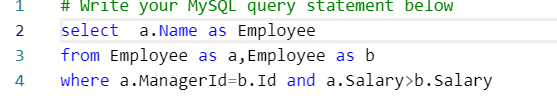

  

### 目录

-   -   [175\. 组合两个表【简单】](https://blog.csdn.net/zj20165149/article/details/104144893#175__3)
    -   [176.第二高的薪水【简单】](https://blog.csdn.net/zj20165149/article/details/104144893#176_14)
    -   [177\. 第N高的薪水【中等】](https://blog.csdn.net/zj20165149/article/details/104144893#177_N_27)
    -   [178.分数排名【中等】](https://blog.csdn.net/zj20165149/article/details/104144893#178_43)
    -   [180.连续出现的数字【中等】](https://blog.csdn.net/zj20165149/article/details/104144893#180_52)
    -   [181\. 超过经理收入的员工【简单】](https://blog.csdn.net/zj20165149/article/details/104144893#181__67)
    -   [182\. 查找重复的电子邮箱【简单】](https://blog.csdn.net/zj20165149/article/details/104144893#182__76)
    -   [183\. 从不订购的客户【中等】](https://blog.csdn.net/zj20165149/article/details/104144893#183__85)
    -   [184\. 部门工资最高的员工【中等】](https://blog.csdn.net/zj20165149/article/details/104144893#184__94)
    -   [185.部门工资前三高的多有员工【困难】](https://blog.csdn.net/zj20165149/article/details/104144893#185_103)
    -   [196.删除重复的电子邮箱【简单】](https://blog.csdn.net/zj20165149/article/details/104144893#196_116)
    -   [197.上升的温度【简单】](https://blog.csdn.net/zj20165149/article/details/104144893#197_127)
    -   [262\. 行程和用户【困难】](https://blog.csdn.net/zj20165149/article/details/104144893#262__134)

## 175\. 组合两个表【简单】

  
  
编写一个 SQL 查询，满足条件：无论 person 是否有地址信息，都需要基于上述两表提供 person 的以下信息：  
FirstName, LastName, City, State  


## 176.第二高的薪水【简单】

  
  
首先按照salary进行分组  
使用distinct去重  
将元组按照salary降序进行排列  
进行分页处理limit m,n 表示：掉过m条数据都读取n条数据  
最后是解决不存在第二大的工资的问题，使用ifnull（e1,e2)表示如果e1不为空则返回e1，否则返回e2。

## 177\. 第N高的薪水【中等】

  
思路：  
第N高的薪水，可以利用 limit x，y来解答  
limit x,y 类似于 limit x offset y ，即跳过x行,取y行数据。

题中，输入N，即返回第N高的薪水，则  
当 N < 1 时，返回最低工资。（经测试，默认是这样返回，其他的按需求返回即可）  
当 N >= 1 时，则返回第N高工资

因为 limit x,y 函数的关系，跳过x行，取y行。故输入N的时候，需要先减去1才能取回第N高的薪水，否则会跳过第N高的薪水数据，取了第N+1高的薪水数据出来  


## 178.分数排名【中等】

  
  


## 180.连续出现的数字【中等】

  


这里注意是连续的数字，所以不是having的思路。  
方法一：贼暴力，容易  
  
方法二：  


## 181\. 超过经理收入的员工【简单】

  
  


## 182\. 查找重复的电子邮箱【简单】

  
  


## 183\. 从不订购的客户【中等】

  
  


## 184\. 部门工资最高的员工【中等】

  
  


## 185.部门工资前三高的多有员工【困难】

  
  


  
思路：一次遍历employee的元组，判断是否存三个比它工资高的，如果没有，表示它是前三高的。

## 196.删除重复的电子邮箱【简单】

  
方法一：  
  
方法二：  


## 197.上升的温度【简单】

  


## 262\. 行程和用户【困难】


```
+----+-----------+-----------+---------+--------------------+----------+
| Id | Client_Id | Driver_Id | City_Id |        Status      |Request_at|
+----+-----------+-----------+---------+--------------------+----------+
| 1  |     1     |    10     |    1    |     completed      |2013-10-01|
| 2  |     2     |    11     |    1    | cancelled_by_driver|2013-10-01|
| 3  |     3     |    12     |    6    |     completed      |2013-10-01|
| 4  |     4     |    13     |    6    | cancelled_by_client|2013-10-01|
| 5  |     1     |    10     |    1    |     completed      |2013-10-02|
| 6  |     2     |    11     |    6    |     completed      |2013-10-02|
| 7  |     3     |    12     |    6    |     completed      |2013-10-02|
| 8  |     2     |    12     |    12   |     completed      |2013-10-03|
| 9  |     3     |    10     |    12   |     completed      |2013-10-03| 
| 10 |     4     |    13     |    12   | cancelled_by_driver|2013-10-03|
+----+-----------+-----------+---------+--------------------+----------+

```


```
+----------+--------+--------+
| Users_Id | Banned |  Role  |
+----------+--------+--------+
|    1     |   No   | client |
|    2     |   Yes  | client |
|    3     |   No   | client |
|    4     |   No   | client |
|    10    |   No   | driver |
|    11    |   No   | driver |
|    12    |   No   | driver |
|    13    |   No   | driver |
+----------+--------+--------+

```


```
+------------+-------------------+
|     Day    | Cancellation Rate |
+------------+-------------------+
| 2013-10-01 |       0.33        |
| 2013-10-02 |       0.00        |
| 2013-10-03 |       0.50        |
+------------+-------------------+

```


