# 数据库各表内容

**customers(customer\_id, firstname, lastname, city, address, email) 顾客信息表**

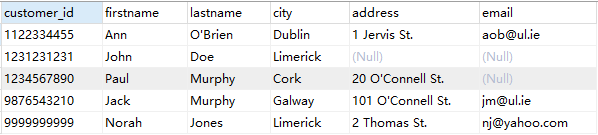

**laptops(model, speed, ram, hd, screen, price) 笔记本电脑信息表**

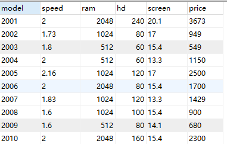

**pcs(model, speed, ram, hd, price) 电脑信息表**

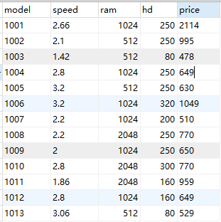

**printers(model, color, type, price) 打印机信息表**

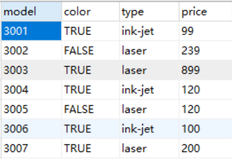

**products(maker, model, type) 供应商信息表**

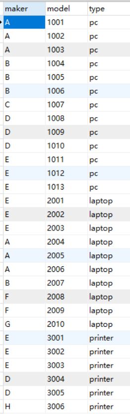

**sales(customer\_id, model, quantity, day, paid, type\_of\_payment)销售记录表**

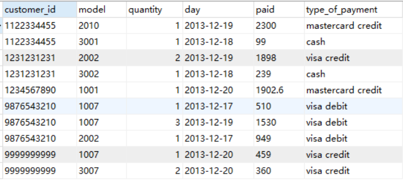

# SQL查询语句

### 1、进行单表查询

1)查询所有speed大于2.8的PC信息

```sql
select * from pcs where speed > 2.8;
```

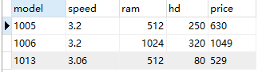

2)查询购买model为1007的购买记录信息

```sql
select * from sales where model = '1007';
```

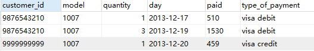

### 2、聚集函数

3)统计2013-12-20购买记录的数量（count）

```sql
select COUNT(customer_id) from sales where day = '2013-12-20';
```

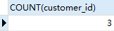

4)统计2013-12-20购买的总数量(sum)

```sql
select sum(quantity) from sales where day = '2013-12-20';
```

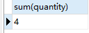

5)查询硬盘大小出现在两种以上PC电脑上的硬盘大小

```sql
-- 写法1select distinct p1.hd from pcs as p1, pcs as p2 where p1.hd = p2.hd AND p1.model != p2.model;-- 写法2select hd,count(*)from pcsgroup by hdhaving count(*) > 1 
```

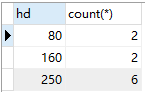

6) 查询速度至少3.00以上的PC models信息

```sql
SELECT model from pcs where speed >= 3.00
```

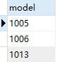

### 3、连接查询 嵌套查询

7)查询哪个供应商供应laptops硬盘至少100GB以上的供应商信息

- 做等值连接
  
    ```sql
    -- 保留所有属性列select products.*from products, laptopswhere products.model=laptops.model and laptops.hd >= 100;
    ```
    
- 自然连接(natural join)
  
    ```sql
    -- 去除两个表中重复属性列，natural join不允许带usingselect products.*from products natural join laptopswhere hd >= 100;
    ```
    
- 内连接
  
    ```sql
    -- 类似等值连接，用on设置连接条件select products.*from products inner join laptopson products.model = laptops.modelwhere hd >= 100;
    ```
    
- 自然连接(join using)
  
    ```sql
    -- using也可用来设置连接条件，表示按照某个属性列连接select *from products join laptops using(model)where hd >= 100;
    ```
    
- 子查询实现
  
    ```sql
    -- 不相关子查询（子查询的SQL语句可以单独执行）select *from productswhere model in (  select model  from laptops  where hd >= 100);-- 相关子查询（子查询的SQL语句不能够单独执行，必须嵌在父查询中，作为父查询的条件执行）select *from products prwhere exists (  select model  from laptops la  where pr.model = la.model and la.hd >= 100); --所有子查询都可以写成相关子查询 --有些相关子查询可以用不相关子查询来代替 --所有不相关子查询都可以用相关子查询来代替
    ```
    


8) 查询供应商B所提供的所有产品的产品编号和产品价格。

```sql
select model, pricefrom pcswhere model in (    select model    from products    where maker = 'B')unionselect model, pricefrom laptopswhere model in (    select model    from products    where maker = 'B')unionselect model, pricefrom printerswhere model in (    select model    from products    where maker = 'B');
```

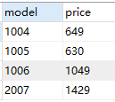

9)查找所有的彩色打印机的model numbers。

```sql
select model from printers where color = 'true'
```

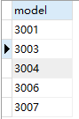

10)查找供应laptops但不供应pc的供应商信息。

```sql
select  *from products p1where p1.type = 'laptop' and 'pc' not in (        select type        from products p2        where p1.maker = p2.maker);
```

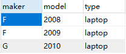

11) 查询具有相同运行速度和内存的PC电脑编号对每个pc models对只出现一次，即 (i, j)出现，则 (j, i)不出现

```sql
--典型的表的自身连接查询SELECT p1.model, p2.model FROM pcs p1, pcs p2WHERE p1.speed = p2.speed AND p1.ram = p2.ram AND p1.model < p2.model 
```


12) 查询销售三种不同型号PC电脑的供应商

```sql
SELECT makerFROM (    SELECT model,maker    FROM products    WHERE type = 'pc')t1-- my sql规定子查询必须有别名 否则报错：-- [Err] 1248 - Every derived table must have its own aliasGROUP BY maker-- 按照maker分组HAVING COUNT(t1.model) >= 3 -- 筛选出model大于3个的
```

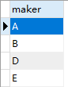

13) 查询至少提供3种PC运行速度的供应商

```sql
SELECT makerFROM (    SELECT DISTINCT pcs.speed,maker -- 不能忘了distinct去重    FROM products,pcs    WHERE products.model = pcs.model)t1GROUP BY maker-- 按照maker分组HAVING COUNT(t1.speed) >= 3
```

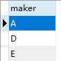

14) 查询提供的PC或laptop运行速度至少是2.80且有两种以上产品的供应商

```sql
-- 想让大家用视图解决问题select makerfrom(        select maker, products.model        from products, pcs        where products.model = pcs.model and pcs.speed >= 2.80        union        select maker, products.model        from products, laptops        where products.model = laptops.model and speed >= 2.80)t1group by makerhaving count(*) >= 2;-- from子句中应用别名方式给子查询命名名称也可以
```

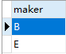

15) 查询提供的电脑（PC or laptop）具有最高运行速度的供应商

```sql
-- 想让大家用视图解决问题select ac.makerfrom (        select maker, speed        from products, pcs        where products.model = pcs.model        union        select maker, speed        from products, laptops        where products.model = laptops.model) acwhere ac.speed = (        select max(speed)        from(                select maker, speed                from products, pcs                where products.model = pcs.model                union                select maker, speed                from products, laptops                where products.model = laptops.model        )t1);
```

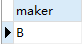

# SQL更新和视图应用

### 更新语句

1.更新firstname=’Ann’ 的购买数量为2

```sql
-- 更新操作update salesset quantity = 2where customer_id in(    SELECT customer_id    from customers    where firstname = 'Ann');-- 查询修改结果SELECT DISTINCT firstname,quantityFROM sales,customerswhere sales.customer_id = customers.customer_id AND customers.firstname = 'Ann';
```

[](http://fangkaipeng.com/wp-content/uploads/2021/05/wp_editor_md_0257bf85996adbd6e7eeea014ce26acd.jpg)

2.删除PC速度小于2.0的所有产品的购买记录信息。

```sql
DELETE FROM saleswhere model in(    SELECT model    FROM pcs    WHERE speed < 2.0);
```

由于sales中没有相关记录，所以没有进行删除

3.往顾客信息表插入数据。

构建一套新的数据库应用系统，分析该系统解决的问题：

```sql
users(userID, userName,) songs(songID, artistID, rating) playlists(playlistID, userID, title) songsplaylists(songID, playlistID, play_no)
```

Table users contains data about users of some imaginary cloud-based media player.

Table songs lists all songs currently available on the cloud.

Table playlists contains information about playlists created by users, and

table songsplaylists keeps information about which songs are included in the playlists.

Attribute play\_no is the number of the song in the playlist as specified by the user.

根据上述描述，自己提出语义描述，从数据库中获取数据，达到能够从数据库中获取信息的目的。

```sql
CREATE TABLE users(    userID VARCHAR(20) PRIMARY KEY,    userName VARCHAR(20)); CREATE TABLE songs (    songID VARCHAR(20) PRIMARY KEY,    artistID VARCHAR(20),    rating INT);CREATE TABLE playlists(    playlistID VARCHAR(20),    userID VARCHAR(20),    title VARCHAR(20),    -- 根据语义，需要将playlistID和userID作为主键    CONSTRAINT playlist_key PRIMARY KEY(playlistID,userID));CREATE TABLE songsplaylists(    songID VARCHAR(20),    playlistID VARCHAR(20),    play_no INT,    -- 需要将songID和playlistID作为主键    CONSTRAINT sp_key PRIMARY KEY(songID,playlistID))
```

[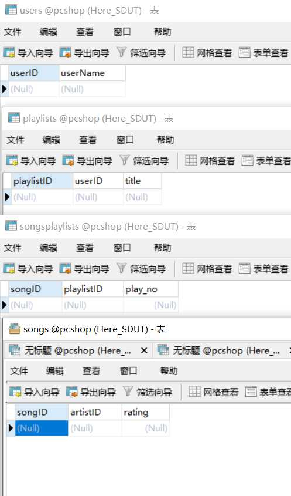](http://fangkaipeng.com/wp-content/uploads/2021/05/wp_editor_md_c1f3a511a17e770369496838dc159db9.jpg)

### 视图应用

1.Find those makers of at least two different computers (PCs or laptops) with speeds of at least 2.80.  
查询提供的PC或laptop运行速度至少是2.80且有两种以上产品的供应商

```sql
CREATE view vpcsASselect maker, products.model        from products, pcs        where products.model = pcs.model and pcs.speed >= 2.80        union        select maker, products.model        from products, laptops        where products.model = laptops.model and speed >= 2.80; select makerfrom vpcsgroup by makerhaving count(*) >= 2;
```

[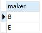](http://fangkaipeng.com/wp-content/uploads/2021/05/wp_editor_md_fce749cee576b9000824319fb5b94883.jpg)


2.Find the maker(s) of the computer (PC or laptop) with the highest available speed.  
查询提供的电脑（PC or laptop）具有最高运行速度的供应商

```sql
create view vpcs AS select maker, speedfrom products, pcs        where products.model = pcs.model        union        select maker, speed        from products, laptops        where products.model = laptops.model;  select makerfrom vpcswhere vpcs.speed = (        select max(speed)        from vpcs);
```

[](http://fangkaipeng.com/wp-content/uploads/2021/05/wp_editor_md_2e5759740bb3f1105954d48b01b3770f.jpg)

# 数据库安全性

创建名称为fkp的用户，密码为1234：

```sql
CREATE USER fkp IDENTIFIED by '1234'
```

授权对pcs的select权限给fkp用户,并允许传递授权：

```sql
GRANT SELECTON TABLE pcsto fkpWITH GRANT OPTION
```

收回权限：

```sql
REVOKE SELECTON TABLE pcshopFROM fkp;
```

删除用户：

```sql
DROP USER fkp
```

创建角色，名为users：

```sql
CREATE ROLE users
```

给users角色赋予权限：

```sql
GRANT SELECTON TABLE pcshopTO users
```

将users角色授予fkp用户：

```sql
GRANT users…TO fkpWITH ADMIN OPTION
```

收回限权

```sql
REVOKE SELECTON TABLE pcshopFROM users;
```

# 数据完整性约束

1）创建一个学生信息表，要求学生学号为主码（primary key），学生姓名不能取空值，并要求学生姓名取值唯一，性别只能取”男”、”女”，默认值为”男”，年龄在15到40岁之间。

```sql
create table student(    sno varchar2(10) constraint pk_student primary key,    sname varchar2(30)constraint uk_student unique not null,    ssex varchar2(2) default '男' constraint ck_ssex check(ssex in ('男','女')),    sage int  constraint ck_sage check(sage between 15 and 40),sdept varchar2(30));
```

2）创建一个课程信息表，要求课程号为主码，课程名不能为空，取值唯一，前修课为外键，参照课程表的课程号。

```sql
create table course(    cno varchar2(10) constraint pk_course primary key,    cname varchar2(30) constraint uk_course unique not null,    cpno varchar2(10),    ccredit number(4,2),    constraint fk_course foreign key(cpno) references course(cno) on delete cascade [|on delete set null]);
```

# 触发器应用

（1）定义AFTER行级触发器，电脑表PCS的价格发生变化后就自动在价格变化表pcprice\_log中增加一条相应记录

```sql
create trigger after_update_pcs after update on pcs for each rowbegin    insert into pcprice_log(model,speed,ram,hd,price)     values (new.model,new.speed,new.ram,new.hd,new.price);end;
```

（2）定义AFTER行级触发器，当删除顾客表Customer中的一个顾客信息后，同时删除购买信息表Sales中该顾客的所有购买记录

```sql
create trigger after_delete_customers after DELETE on customers for each rowbegin    DELETE FROM sales          where customer_id = old.customer_id;end;
```

（3）需要对在表上进行DML操作的用户进行安全检查，看是否具有合适的特权

```sql
Create trigger DMLBefore insert or update or delete On pcsbegin       If user not in ('root') then             Raise_application_error(-20001, 'You don’t have access to modify this table.');      End if;End;
```

（4）如果某个特定客户ID的购买记录从销售表中删除后，则从客户表中删除该客户。  
If all sales for a particular customer\_id get deleted from the sales table then delete that customer from thecustomers table.

```sql
create trigger after_delete_sales after DELETE on sales for each rowbegin    IF old.customer_id = '111111' THEN    DELETE FROM customers         where customer_id = old.customer_id;    END IF;end;
```

（5）如果一个特定客户支付的总金额高于10000，该客户的折扣小于10%然后将该客户的折扣设置为10%。在每一个插入到销售表之后，该触发器应该被激活。

If the total amount paid by a particular customer gets higher than 10,000 and the discount for that customer is less than 10% then set the discount for that customer to 10% .The trigger should be activated after each insert into the sales table.

（6）在客户中添加一个新的”AllPaid”栏，如果插入或更新或删除一个销售元组，那么修改该客户的”AllPaid”的值  
Add a new column “AllPaid” in Customer, if insert or update or delete a tuple of sales, then modify the “AllPaid” of this current customer.