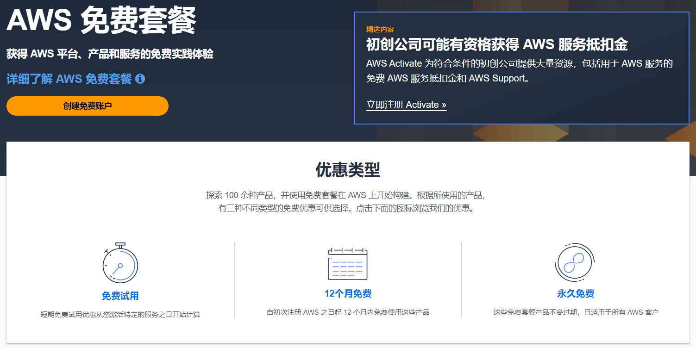
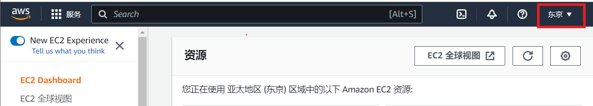
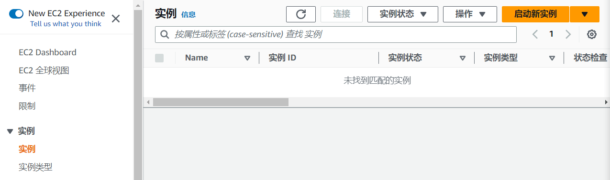
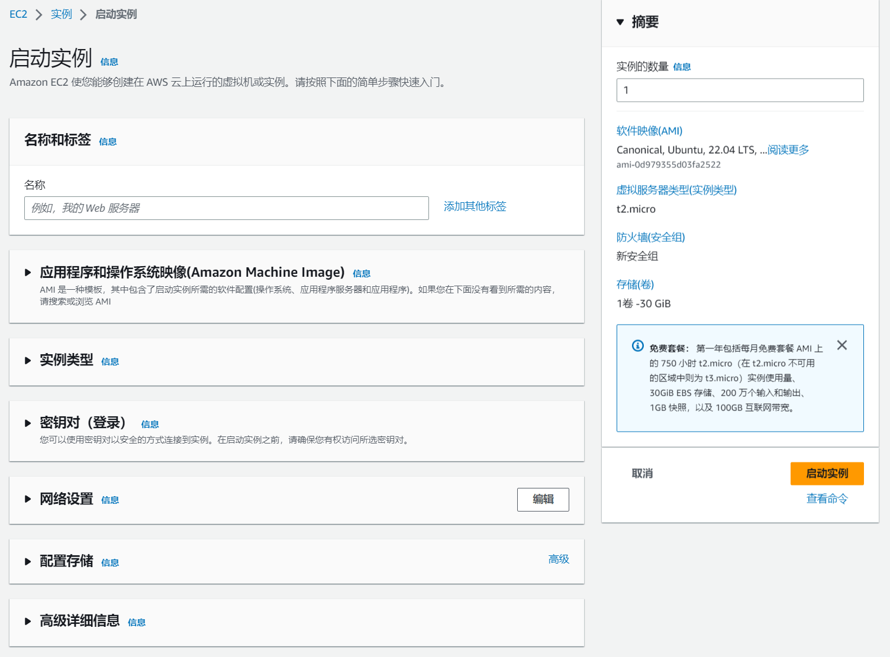
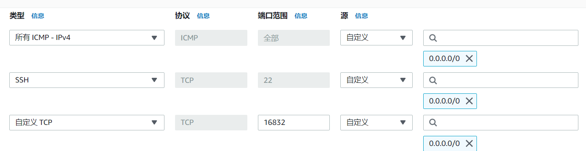
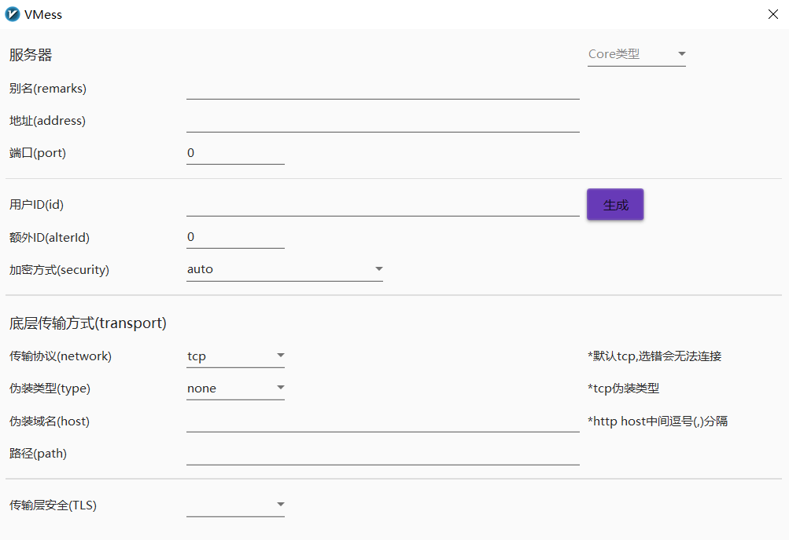

# 背景

由于ChatGPT的出现，我需要一个稳定翻墙环境的欲望越来越强烈了。在此之前捣鼓过挺多的翻墙工具，映像比较深而且用的时间比较长的像在大学时候用的蓝灯LANTERN（很良心的翻墙工具，稳定而且速率还不错，上YouTube还挺流畅），用了挺长一段时间后慢慢的就翻不了了；再后来毕业之后就想着自己搭一个，这时发现合租的室友很早之前就已经搭好了Shadowsocks，于是就这么蹭室友的用了1年。之来搬走了就没再好意思用了，而且翻墙的欲望也不像之前那么强烈，所以就在网上随便下了个极光Aurora一直用着（这个体验就没蓝灯好了，免费版的网速贼慢）。

从去年底开始ChatGPT的热度一路飙升，最重要的是我发现ChatGPT可以极大的提高我的工作效率，于是乎挂起极光VPN赶紧去注册个账号。经过一番不算简单的操作之后迫不及待想跟ChatGPT来一次对话，哦豁，进不去ChatGPT页面！！！上网看了一下应该是ChatGPT把一些公共的VPN IP给封掉了。算了还是自己搭一个VPN服务器吧，于是上网比较哪个VPS稳定实惠好用。找着找着发现亚马逊云可以免费试用1年，每月还有100G的免费流量。这羊毛怎能不薅！

# 配置云服务器

要搭建梯子，首先要配置好云服务器。

1.  注册AWS账户
    
    进入[AWS](https://aws.amazon.com/cn/)，选择右上角的创建AWS账户，跟注册其它账号一样填好信息不断下一步。在这里就不赘述了。要注意的是，AWS貌似不支持绑定银联卡，所以要想薅羊毛，需要一张支持VISA的双币信用卡。
    
2.  配置EC2
    
    注册完成后找到EC2服务器，点击进入控制台。服务器所在区域最好选择东京或韩国，延迟会小很多（刚开始不知道，默认选的斯德哥尔摩，网络延迟有400+ms。ssh远程打字根本不跟手，翻墙后加载网页也会比较久，而用东京的服务器跟平常正常上网几乎感觉不到区别）。可以用这个[工具](https://cloud.feitsui.com/aws)测试各个云服务节点的延迟。
    
    
    
    选择好云服务器节点后在左侧导航栏中选择“实例”，然后在页面右上角启动新实例。
    
    
    
    在启动实例页面填写名称，“应用程序和操作系统映像”选择Ubuntu Server 22.04 LTS，填写“密钥对”（这个之后SSH远程的时候需要用到），“配置存储”改为30GB（毕竟送了30G，不用白不用），其它全部默认。
    
    
    
    启动完成后，相当于我们在国外就有了一台Linux主机啦。
    
    连接到EC2实例的常用方法有两种：
    
    -   EC2 Instance Connect
        
        这个可以在实例页面点击“连接”进入
        
    -   SSH客户端
        
        如果需要用SSH客户端，需要先通过EC2 Instance Connect进入实例，在文件`/etc/ssh/sshd_config`最后加上`PubkeyAcceptedAlgorithms +ssh-rsa`。并且SSH客户端（如MobaXterm）需要勾选use private key，文件选择刚刚生成的密钥对。
        
    
    # 搭建v2ray
    
    [v2ray](https://www.v2fly.org/)是一款网络代理软件，与Shadowsocks类似，使用方法也差不多。v2ray的搭建过程比ss简单很多。v2ray由两部分组成，一个是v2ray服务器，一个是v2ray客户端应用。我们需要在AWS EC2上先搭建v2ray服务器。
    
    首先连接到EC2实例，切换到root用户，没有设置root用户的可以使用`sudo passwd root`设置，切换好之后输入以下指令
    
    <table><tbody><tr><td class="gutter"><pre>1 2 </pre></td><td class="code"><pre><code class="hljs bash"># apt-get update -y &amp;&amp; apt-get install curl -y # bash &lt;(curl -L https://raw.githubusercontent.com/v2fly/fhs-install-v2ray/master/install-release.sh) </code>
<i class="iconfont icon-copy"></i>BASH
</pre></td></tr></tbody></table>
    
    等待几十秒后，v2ray就安装完成了。然后编辑v2ray的配置文件`vim /usr/local/etc/v2ray/config.json`：
    
    <table><tbody><tr><td class="gutter"><pre>1 2 3 4 5 6 7 8 9 10 11 12 13 14 15 16 17 18 19 20 21 22 </pre></td><td class="code"><pre><code class="hljs json">{   "inbounds": [     {       "port": 16832, // 服务器端口       "protocol": "vmess",          "settings": {         "clients": [           {             "id": "uuid",  // 用户 ID，             "alterId": 0           }         ]       }     }   ],   "outbounds": [     {       "protocol": "freedom",         "settings": {}     }   ] } </code>
<i class="iconfont icon-copy"></i>JSON
</pre></td></tr></tbody></table>
    
    uuid可用命令`cat /proc/sys/kernel/random/uuid`生成。用户ID、服务器端口和alterId需要记下来，配置v2ray客户端的时候需要用到。
    
    修改配置文件后需要重启v2ray服务才能生效：
    
    <table><tbody><tr><td class="gutter"><pre>1 </pre></td><td class="code"><pre><code class="hljs bash">systemctl restart v2ray </code>
<i class="iconfont icon-copy"></i>BASH
</pre></td></tr></tbody></table>
    
    这时v2ray服务器已经可以正常使用了。但为了翻墙的网速更快，我们可以使用谷歌开发的BBR拥堵控制算法为v2ray服务器加速。修改后重启v2ray服务器。
    
    <table><tbody><tr><td class="gutter"><pre>1 </pre></td><td class="code"><pre><code class="hljs bash">wget --no-check-certificate https://github.com/teddysun/across/raw/master/bbr.sh &amp;&amp; chmod +x bbr.sh &amp;&amp; ./bbr.sh </code>
<i class="iconfont icon-copy"></i>BASH
</pre></td></tr></tbody></table>
    
    最后还需要在EC2实例页面左侧导航栏找到“网络与安全”→“安全组”，编辑入栈规则。添加上两条规则。SSH那条规则在生成EC2实例时就已经自动配置好了，不用管。我们需要添加TCP 16832端口（端口号为v2ray配置文件中的服务器端口）。添加后数据包才能转发进来，不然v2ray客户端是无法连上服务器的。还有配一条ICMP的规则，便于我们用`ping`去排查网络连通性问题。
    
    
    
    至此，v2ray服务器端的配置就全部完成了。
    
    v2ray Windows客户端可以从 [v2rayN](https://github.com/2dust/v2rayN/releases) 下载。配置也非常简单。填上EC2的公网IP地址，端口16832，用户ID和alterId即可。其它默认。
    
    [
    
    然后在v2rayN客户端底部**系统代理**中选择“自动配置代理”，在**路由**中选择“绕过大陆”，之后我们的电脑即可成功翻墙。
    
    **系统代理**有几种模式，区别如下：
    
    -   清除系统代理模式：在这种模式下，V2Ray会清除系统代理设置，停止任何代理行为。这种模式适用于需要完全停止代理的用户。
    -   自动配置代理模式：在这种模式下，V2Ray会自动配置系统代理，将所有的网络流量都通过V2Ray进行代理。这种模式适用于需要完全使用V2Ray进行代理的用户。
    -   不改变系统代理模式：在这种模式下，V2Ray不会改变系统代理设置，只会将特定的网络流量通过V2Ray进行代理。这种模式适用于需要部分使用V2Ray进行代理的用户。
    -   PAC模式：在这种模式下，V2Ray会根据用户提供的PAC文件进行代理。PAC文件是一个JavaScript文件，用于控制浏览器的代理行为。这种模式适用于需要根据特定规则进行代理的用户，比如需要访问特定网站时才使用代理。
    
    **路由**有以下几种方式，区别如下：
    
    -   绕过大陆：在这种路由模式下，V2Ray会根据用户提供的绕过大陆列表，将不在列表中的流量路由到AWS EC2（v2ray服务器）。
    -   黑名单路由：在这种路由模式下，V2Ray会根据用户提供的黑名单列表，将匹配的流量路由到v2ray服务器。
    -   全局：在这种路由模式下，所有的流量都会被路由到v2ray服务器，无论流量的目的地是什么。这种路由模式适用于需要所有流量都通过V2Ray进行代理的用户。
    
    iOS则需要一个美区的[apple id](https://appleshare.club/)（这里有免费的美区apple id可以用），在App Store登录美区apple id后下载Shadowrocket，配置方法同windows端一样。
    

到此搭建免费梯子的配置就全部完成啦，好好享受吧！！！

