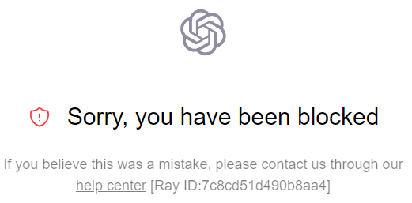
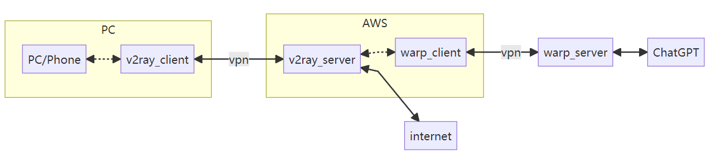
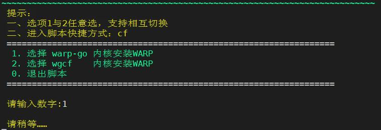
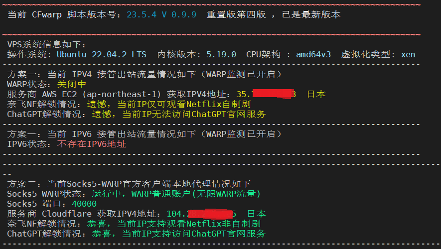

很多人成功翻墙之后发现还是没法上ChatGPT，这很可能是因为ChatGPT限制了云服务器的IP造成的。

[](https://weijinkang.github.io/2023/05/17/enjoy-chatgpt/chatgpt_fail.png)

要想解决这个问题，需要将云服务发到ChatGPT的数据再做一层封装。这层封装WARP可以帮我们完成。WARP是Cloudflare推出的一项网络加速服务，其设计的初衷是改善移动互联网的性能和安全性。大概的原理是客户端（此时的客户端是我们的云服务器）上来的流量经过WARP的加密封装后，自动寻找离客户端最近的Cloudflare网络的边缘节点，然后数据在该网络里路由到离服务器最近的边缘节点，最后解密后发给服务器端（也就是ChatGPT）。此时与ChatGPT交互报文的源IP不再是云服务器的IP，而是的Cloudflare边缘节点入口IP，而这个IP会被ChatGPT认为是一个普通的IP而不会遭到限制。

所以解决方法是：从云服务器发出数据如果是发给ChatGPT的，那么把这个数据交给warp客户端再做一次代理，其它报文则正常转发。由于我的梯子是用v2ray搭的（见上一篇blog），所以接下来的教程是基于v2ray（其它梯子应该也差不多，理解了思想自己适配就好）。

总体流程：

[](https://weijinkang.github.io/2023/05/17/enjoy-chatgpt/graph.png)

搭建过程很简单，已经有人弄好了一键安装脚本（ https://gitlab.com/rwkgyg/CFwarp ），只需执行以下命令

```
wget -N https://gitlab.com/rwkgyg/CFwarp/raw/main/CFwarp.sh && bash CFwarp.sh

BASH
```

按照提示进行下一步即可

[](https://weijinkang.github.io/2023/05/17/enjoy-chatgpt/warp_install.png)

最后显示如下信息时表示warp已经搭建完成了，此时在云服务器命令行窗口出入`netstat -nlt`发现40000端口已经被warp监听了。

[](https://weijinkang.github.io/2023/05/17/enjoy-chatgpt/warp_install_successful.png)

接下来是修改v2ray的配置文件`vim /usr/local/etc/v2ray/config.json`（想了解更多内容可参考[v2ray官方文档](https://www.v2ray.com/)）。要让访问ChatGPT的流量走warp代理，配置文件需要修改两个地方，一个是需要增加routing：让匹配到chat.openai.com的数据打上一个warp的outboundTag标签。未匹配到的打上default标签。另外一个是outbounds：带上warp标签的数据送到127.0.0.1:40000（也就是送给warp客户端），default标签的数据直接从云服务器转发出去。

```
{
	"inbounds": [
	{
		"port": 16832,
		"protocol": "vmess",   
		"settings": {
			"clients": [
			{
				"id": "uuid",
				"alterId": 0
			}
			]
		}
	}
	],
	"outbounds": [
	{
        "tag": "default",
        "protocol": "freedom",  
        "settings": {}
	},
    {
		"tag": "warp",
		"protocol": "socks",
		"settings":{
			"servers":[{
				"address": "127.0.0.1",
				"port": 40000,
				"users": []
			}
			]
		}
    }
    ],
    "routing": {
		"rules": [{
			"type": "field",
			"outboundTag": "warp",
			"domain": ["chat.openai.com"]
		},
		{
			"type": "field",
			"outboundTag": "default",
			"network": "udp,tcp"
		}
		]
	}
}

JSON
```

重启v2ray`systemctl restart v2ray`后就可以正常访问[ChatGPT](https://chat.openai.com/)啦！