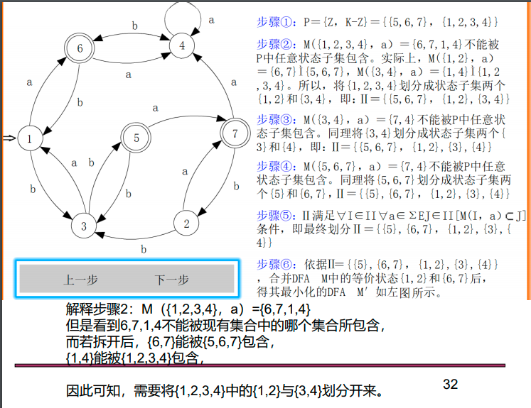
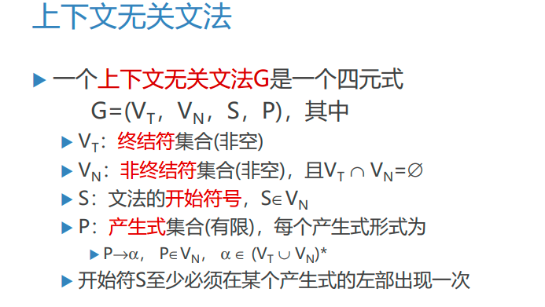
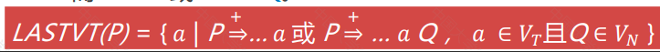
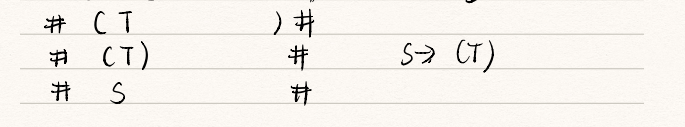
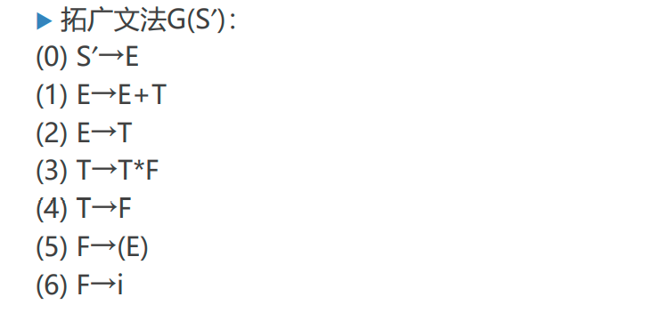

本文内容主要参考国防科技大学[编译原理](https://so.csdn.net/so/search?q=%E7%BC%96%E8%AF%91%E5%8E%9F%E7%90%86&spm=1001.2101.3001.7020)慕课课程（链接：[国防科大慕课地址](https://www.icourse163.org/course/NUDT-1003101005?from=searchPage)  
王挺老师所讲内容基本和华科计院编译原理课程内容一致，这也是我自己边学习边做的一些笔记，为了防止丢失，特意上传上来，学弟学妹们也可以参考复习。如有疏漏之处还望各为敬请斧正!

# 第一章 引论

## 1.1 编译过程和编译程序的结构


## 1.2 编译程序结构中的前端和后端划分的意义

```
编译过程的阶段是一种逻辑上的划分。在具体设计和实现上，可以重新组织系统模块结构。 
（1）划分“前端/后端”。将与仅依赖于源程序而与目标机器（硬件）无关的阶段组合成前端，将与目标机器（硬件）相关的阶段组合成后端。 
使得程序员不必考虑机器的细节，独立于机器。
```


## 1.3 编译与解释的区别

```
编译方式是先翻译后执行，即将整个源程序翻译完毕，再执行目标程序，只需要保存完整的目标程序而无需保存源程序。一次翻译后无需再翻译，可多次执行。
解释方式是边翻译边执行，即翻译一句就执行一句，翻译完毕也执行完毕，只保存源程序无需保存完整的目标程序。执行一次需要翻译一次。 
```

**编译程序和解释程序的存储组织有很大不同**

```
编译程序处理时,在源语言程序被编译阶段,存储区中要为源程序(中间形式)和目标代码开辟空间,要存放编译用的各种各样表格,比如符号表.在目标代码运行阶段,存储区中主要是目标代码和数据,编译所用的任何信息都不再需要.
解释程序一般是把源程序一条语句一条语句的进行语法分析,转换为一种内部表示形式,存放在源程序区,比如BASIC解释程序,将LET和GOTO这样的关键字表示为一个字节的操作码,标识符用其在符号表的入口位置表示.因为解释程序允许在执行用户程序时修改用户程序,这就要求源程序,符号表等内容始终存放在存储区中,并且存放格式要设计的易于使用和修改.
```


# 第二章 文法和语言

```
2.1 右线性文法（正则文法、3 型文法）;
2.2 构造右线性文法生成给定的语言；
2.3 规范推导，句柄。
```

## 2.1 文法类型

对规则构成加以限制，可以将文法的分类为四种类型：0型文法、1型文法、2型文法和3型文法。


例题：


## 2.2 上下无关文法及其语法树

上下无关文法一个显著特征是规则左部一定有且仅有一个非终结符。

如果在推导的每一步总是选择当前句型的最左（最右）边非终结符进行推导，则称这种推导过程为最左（最右）推导。

最右推导，也叫规范推导。由规范推导所得的句型，叫做规范句型。规范推导的逆过程，叫做规范归约。


## 2.3短语 直解短语 句柄


其中最下一层可以是非终结符，非终结符可以构成短语，而短语只能由最底下的叶子节点将短语进行表示

## 2.4例题

构造产生如下语言的上下文无关文法各一个：如图中（2）（5）（6）


```
(2）G[S]: S -> aS | aSb | ε 
(5）G[S]: S -> aSbb | aSbbb | ε
(6）G[S]: S -> aSa | bSb | ε
```

给出生成下述语言的一个3型文法：如图中的（2）


```
G[S]:
S -> aS | aB
B -> bB | b
```

# 第三章 词法分析

```
3.1 正则表达式；
3.2 把正则表达式转换成等价的 NFA；
3.3 将 NFA 转换成等价的 DFA(子集法)；
3.4 DFA 的最小化(分割法);
3.5 给定 DFA，写出其等价的右线性文法。
```

## 3.1 正则表达式


## 3.2 正则式与正规文法的转换

### 3.2.1 正则式转正规文法


对于正规式，规则1,2,3是一个过程，多次对其进行该过程化简，最终仅含一个终结符的文法便是正规文法

左线性文法就是从

### 3.2.2 正规文法转正规式


主要是进行合并操作

## 3.2 NFA与DFA基本知识

### 3.2.1 DFA(确定的有穷自动机)


```
转换函数f可以扩充为f′: K×Σ*→K映射，并以f替代f′使用。
```


### 3.2.2 NFA(不确定的有穷自动机)


```
NFA转换函数f也可以扩充为f′: ρ(K)×Σ*→ρ(K)映射，并以f替代f′使用。
```

**扩充函数用法举例：**


**NFA的可接受串：**


### 3.2.3 自动机的等价性


### 3.2.4 ε闭包运算


## 3.3 将 NFA 转换成等价的 DFA(子集法)


## 3.4 DFA 的最小化(分割法)



```
修正：步骤③中M({3,4},a)={1,4}。
```

### NFA到DFA转化步骤

1. NFA-> DFA

   1. 将初态和终态设置均新增一个，使其成为真正的，分别将原先的与新增的连接起来
   2. 若nfa中存在经过ab达到另一个状态，则新增一个中间态
   3. 生成
      1. 闭包：一个状态通过一条ϵ弧到达的状态集，则是其闭包
      2. 从初态开始，先对初态做闭包运算
      3. 该集合接受一个终结符生成的集合
      4. 生成的集合做闭包填入其初态闭包的对应终结符状态集
      5. 依次操作，最后可将集合用数字将其表示，形成新的状态
   4. 化简
      1. 区分两个状态集：若两个状态同时接受任意一个a均能到达其终态，则这两个状态等价
      2. 分别将其分为终态和非终态，从非终态开始，其接受一个终结符，看其生产的状态集是否出现不同的状态，若出现不同的状态，则代表其存在不同的状态，将其按接受终结符后的状态区分不同的状态集
      3. 依次进行，最终生成的状态集中的状态均是等价的，其可以任选一个作为该状态集的代表

2. 习题：

   1. 

   2. 

      


## 3.5 正规式与NFA转换

### 3.5.1 NFA到正规式


### 3.5.2 正规式到NFA


## 3.6 正规文法和有穷自动机间的转换

### 3.6.1 右线性正规文法到NFA


### 3.6.2 左线性正规文法到NFA


### 3.6.3 DFA到右线性正规文法


## 3.7 总结

如果想要将**正则式转换为正规文法**，可以采取以下步骤：

正则式-》NFA-》DFA-》右线性正规文法

如果想要将**正规文法转换为正则式**，可以采取以下步骤：

正规文法-》NFA-》DFA-》正则式

# 第四章 自顶向下语法分析方法

```
4.1 如何判断文法是 LL(1)的；4.2 构造 LL(1)的分析表；4.3 分析给定的句子，是否是符合该 LL(1)文法的句子。详细描述分析的过程，包括栈，分析串的变化过程，每一步采用的产生式，或分析的结论（终结符匹配出栈，出错，接受等）。
```

## 4.1 自上而下分析的基本问题

### 4.1.1 语法分析基本概念





### 4.1.2 自上而下分析面临的问题

#### 4.1.2.1回溯问题


```
此时的A有两个产生式，那么到底选择哪一个呢？需要逐个试一下,先试试第一个产生式
```


```
此时两个箭头都指向非终结符，但两个非终结符不同，说明A的产生式选择错误，需要重新选择，也就是产生了回溯。
```


```
此时A选择了第二个产生式
```


```
匹配成功。可以看出上述回溯是因为A有多个产生式，但不知道要选择哪一个产生的
```


#### 4.1.2.2文法左递归问题


```
因为自上而下推导采用最左推导法，这样就会导致产生死循环。
```

## 4.2 LL(1)文法——消除文法左递归

### 4.2.1 消除直接左递归


```
一般情况如下：
```


```
根据原产生式可知，P是由β1,2,..n 中的一个开头且随后是α1,2,..m中的一个或多个组成的串
```

**例题：**


### 4.2.2 消除间接左递归


```
以上两个条件容易满足：1.对于一个上下文无关文法来说，如果语言本身不含ε，那么总可以给出不含ε的文法2.没有消除左递归之前可以有左递归，但不能自己推出自己。
```


```
具体做法：将各个非终结符拍个序起名叫LIST。然后按照顺序逐个考查产生式（这个顺序是指，假如LIST={R,Q,S}，那么首先要考查左侧是R的产生式，再考查左侧是Q的产生式），如果当前产生式右侧的非终结符B与产生式左侧非终结符A相比，如果在LIST中B排在A的后面，那么就需要把B给替换掉。消除完间接左递归后如果产生直接左递归那么还应该继续消除。然后再查看是否有冗余的产生式。总结：最后达到的效果是：对于产生式A→Bβ（β是终结符）,那么在LIST中，A也排在B的左侧。
```


```
LIST={R,Q,S}那么首先要考查左侧是R的产生式，再考查左侧是Q的产生式，在考查左侧是S的产生式。
```


## 4.3 LL(1)文法——消除回溯


### 4.3.1 FIRST集合

1. 定义


```
假如非终结符的候选首符集有相交的，那么就需要提取公共左公因子
```


```
在分析T‘时，由于T'的第一个产生式的FIST集为*，不能和+匹配，所以将T'匹配成了ε。
```


```
非终结符T'后面可能出现+，所以可以将T'匹配成ε，由此引出FOLLOW集合
```

### 4.3.2 FOLLOW集合


### 4.2.3 LL(1)文法


```
第三条涉及到SELECT集的概念
```


## 4.4 FIRST和FOLLOW集合的构造


```
注意观察，FIRST集说的是α的FIRST集,FOLLOW集说的是非终结符的FOLLOW集
```

### 4.4.1 构造FIRST(α)


```
构造FIRST集合时，首先应该构造单个文法符号的FIRST集（终结符和非终结符）构造完单个文法符号的FIRST集合后才可以更方便的构造由单个文法符号组合而成的符号串的FIRST集。
```

### 4.4.2 构造FOLLOW(A)


**正确性证明：**


### 4.4.3 例题


```
构造FIRST集时的方法：1.考查每个产生式，如果有产生式A->aB...或者A->ε的产生式时，将 a,ε加入FIRST(A)2.将第1步用到的产生式去掉（它们只能说明终结符a或者ε属于某个非终结符的FIRST集）3.逐个考查剩下来的产生式，形如A->XYZ，那么可以确定的是FIRST(X)\{ε}属于FIRST(A)；此时查看FIRST{X}。此时有三种情况：	1.FIRST(X)为空，那么直接跳过。	2.FIRST(X)中不为空，但没有ε。此时将FIRST(X)中的所有元素加入到FIRST(A)中。	3.FIRST(X)中不为空，且有ε。此时将FIRST(X)中除了ε的所有元素加入到FIRST(A)中。然后再以同样的方法考查FIRST(Y)。	如果X,Y,Z的FIRST集合中都包含ε，那么此时再将ε加入到FIRST(A)中。4.如果有任何一个非终结符的FIRST集合有变动，都要重复3，直到没有变动。
```

```
构造FOLLOW集时的方法：1.首先构造各个非终结符的FIRST集。2.将#加入到S的FOLLOW集合中。3.逐个考查产生式：	1.A→α B β（β由非终结符和终结符组成），将FIRST(β)\{ε}，加入FOLLOW(B)中。如果FIRST(β)中含有ε,那么再将FOLLOW(A)中的元素加入到FOLLOW(B)中。	2.A→αB，则直接将FOLLOW(A)加入到FOLLOW(B)中。4.重复上述3，知道各个非终结符的FOLLOW集不再发生变化为止。
```

## 4.5 构造递归下降分析器

### 4.5.1 简介


### 4.5.2 例题


E’有两种写法：


```
第二种虽然没有考虑到E'的FOLLOW集，但这么写也是没问题的。因为每个非终结符的FOLLOW集最终都是来自于非终结符的FIRST集。若输入字符匹配不上所有的非空产生式时，直接将非终结符匹配为空串，那么若输入字符∉FOLLOW(E')时，在后续检查中总会出错。
```


## 4.6 扩充的巴克斯范式和语法图


## 4.7 预测分析程序

### 4.7.1回顾LL(1)分析法


### 4.7.2 预测分析程序的工作原理


### 4.7.3 预测分析示例


| 步骤 | 符号栈   | 输入串  | 产生式    |
| ---- | -------- | ------- | --------- |
| 1    | #E       | I\*I+I# | E->TE’    |
| 2    | #E’T     | I\*I+I# | T->FT’    |
| 3    | #E’T’F   | I\*I+I# | F->I      |
| 4    | #E’T’I   | I\*I+I# |           |
| 5    | #E’T’    | \*I+I#  | T’->\*FT’ |
| 6    | #E’T’F\* | \*I+I#  |           |
| 7    | #E’T’F   | I+I#    | F->I      |
| 8    | #E’T’I   | I+I#    |           |
| 9    | #E’T’    | +I#     | T’->ε     |
| 10   | #E’      | +I#     | E’->+TE’  |
| 11   | #E’T+    | +I#     |           |
| 12   | #E’T     | I#      | T->FT’    |
| 13   | #E’T’F   | I#      | F->I      |
| 14   | #E’T’I   | I#      |           |
| 15   | #E’T’    | #       | T’->ε     |
| 16   | #E’      | #       | E’->ε     |
| 17   | #        | #       | ACCEPT    |

## 4.8 预测分析表的构造

### 4.8.1 构造预测分析表


### 4.8.2 LL(1）文法与二义性


# 第五章 自下而上语法分析方法

```
5.1 算符优先分析算法基本思想，其中的重要概念。
```

## 5.1 自下而上分析


## 5.2短语与直接短语

1. 短语的定义


```
The teacher是相对于NP的一个短语对短语的理解最好结合语法树来理解
```

2. 直接短语的定义


```
短语为一个子树下面挂载的所有的根节点。直接短语为一个高度为2的子树下面挂载的所有根节点
```

## 5.3 分析过程描述


## 5.4 算法优先文法

### 5.4.1 概述


### 5.4.2优先关系


### 5.4.3 算符文法


### 5.4.4 算符优先文法

```
对算符文法再加以限制
```


```
怎么填这个表看下面的内容
```

## 5.5 构造优先关系表

### 5.5.1 FIRSTVT和LASTVT




```
FIRSTVT(P)就是P能推出来的所有产生式中第一个终结符的集合。LASTVT(P)就是P能推出来的所有产生式中最后一个终结符的集合。
```

### 5.5.2 构造FIRSTVT和LASTVT算法

1. 构造算法


### 5.5.3 构造FIRSTVI,LASTVT举例


\[外链图片转存失败,源站可能有防盗链机制,建议将图片保存下来直接上传(img-9Q2e1lN0-1626245560537)(https://gitee.com/citianzhao/blogimg/raw/master/img/image-20210618165357407.png)\]

```
实操方法：1.首先逐个考查每个形如P->a...和P->Qa...的产生式，将a加入到FIRSTVT(P)2.逐个考查每个形如P->Q...的产生式，将目前FIRSTVT(Q)中的元素加入到FIRSTVT(P)中。3.如果任意一个非终结符的FIRSTVT有变化，都要重复做以便步骤2，直到没有变化为止。
```


```
实操方法：1.首先逐个考查每个形如P->...a和P->...aQ的产生式，将a加入到LASTVT(P)2.逐个考查每个形如P->...Q的产生式，将目前LASTVT(Q)中的元素加入到LASTVT(P)中。3.如果任意一个非终结符的LASTVT有变化，都要重复做以便步骤2，直到没有变化为止。
```

### 5.5.4 构造优先关系表的算法


**注意：当讨论#的优先级时，只需要考查#E#即可：**  
**1.首先将=填入#和#对应的项中**  
**2.#<a ( a∈FIRSTVT(E) )**  
**3.b># ( b∈LASTVT(E) )**


```
实操方法：与上述算法相同。表竖着的那一列代表左边的符号，横着的那一行代表右边的符号。因此对形如...aP...的候选式，可以将<填在a对应的那一行。对形如...Pa...的候选式，可以将>填在a对应的那一列。
```

## 5.6 算符优先分析算法

### 5.6.1 最左素短语


### 5.6.2最左素短语定理


### 5.6.3 算符优先分析算法


```
实操：1.将#移入STACK。2.比较最靠近栈顶的终结符a和当前串的第一个终结符b的优先级：	1.a<b,则将终结符b移入	2.a=b，则将终结符b移入	3.a>b，则自栈顶向栈底逐个寻找，找到一个串Njaj..NiaiNi+1能和一个产生式P->X1X2X3..Xn匹配上	（这里的匹配上指：对两个串的终结符来说，对应位置都相等；对两个串的非终结符来说，不必相等）3.知道栈中出现#N#时表示规约成功。
```


### 5.6.4 算符优先分析法举例




# 第六章LR分析

```
6.1 LR(1)项目集 LR(1)项目是一个二元组：[LR(0)项目，向前搜素符号集(前瞻符号集)]6.2 构造识别活前缀的 DFA6.3 构造 LR(1)分析表6.4 LR(1)分析算法
```

## 6.1 句柄和规范规约


### 6.1.1 短语、直接短语和句柄


### 6.1.2 规范规约


## 6.2LR分析法

### 6.2.1 概述


### 6.2.2 LR分析表


### 6.2.3 LR分析过程


```
对第二种情况的说明：
```


### 6.2.4 LR分析示例


| 步骤 | 状态    | 符号  | 输入串  |
| ---- | ------- | ----- | ------- |
| 1    | 0       | #     | I\*I+I# |
| 2    | 05      | #I    | \*I+I#  |
| 3    | 03      | #F    | \*I+I#  |
| 4    | 02      | #T    | \*I+I#  |
| 5    | 027     | #T\*  | I+I#    |
| 6    | 0275    | #T\*I | +I#     |
| 7    | 027(10) | #T\*F | +I#     |
| 8    | 02      | #T    | +I#     |
| 9    | 01      | #E    | +I#     |
| 10   | 016     | #E+   | I#      |
| 11   | 0165    | #E+I  | #       |
| 12   | 0163    | #E+F  | #       |
| 13   | 0169    | #E+T  | #       |
| 14   | 01      | #E    | #       |
| 15   | 接受    |       |         |


```
构造分析树：1.当规约时分析树从下向上生长。2.当移入时，添加一个新的叶子结点
```

### 6.2.5 LR文法


## 6.3活前缀

### 6.3.1 字的前缀、活前缀


## 6.4 构造识别活前缀的DFA

### 6.4.1 LR(0)项目


### 6.4.2通过构造NFA来构造识别所有活前缀的DFA（方法一）


```
按照前面学习的方法，将NFA转化成DFA
```


```
输入串bd#：1.从0状态接受b，转到3状态。2.从3状态接受d，转到11状态。3.11状态为规约项目，将d规约为B。栈顶弹出（11，d）,回退到3状态。4.将B压入栈中，3状态遇到B转移到7状态，因此将7压入栈中。此时栈顶为（7，B）5.7状态为规约项目，将b,B弹出，回到0状态。再将E压入栈中，状态0接受E，转为1状态。而1状态为接受项目，最终接受串bd#。
```

### 6.4.4 通过计算项目集规范族构造识别活前缀的DFA（方法二）

1. LR(0)项目集规范族


2. 有效项目


```
A->β1.β2对活前缀αβ1有效，其条件是存在规范推导S'->αAw...注意，αAw，A前面的东西是αβ1减去A->β1.β2 ‘.’前面的东西得到的。
```

3. 有效项目的性质


**LR(0)项目集规范族的构造**

1.拓展文法


2.计算项目集闭包


以下两个图帮助理解：


3.计算状态转换函数


状态转换函数计算示例：


4.计算结果展示


```
具体实操：1.扩展文法2.首先计算CLOSE(S'-.S)作为状态03.对于每个新增的状态，对其中所有项目的GOTO函数，生成多个新状态。计算GOTO函数的方法见上面的描述。4.重复步骤2，直到不再产生新状态为止。
```

## 6.5 构造LR(0)分析表

### 6.5.1 LR(0)文法的一种定义


### 6.5.2 构造LR(0)分析表算法


### 6.5.3 构造举例


```
具体操作：按照编号顺序逐个考查每个项目集，项目集有三种情况：	1.项目集只含有移入项目：则从本项目集射出的边上如果是终结符就在ACTION的对应位置填上sx,如果是非终结符就在GOTO的对应位置上填入		x(x为这个射出的边指向的项目集的编号)。	2.项目集只含有接受项目：则在ACTION表中对应的行，#对应的列，填入acc	3.项目集只含有规约项目：则在ACTION表中对应的行，所有列填入rx（x是本项目对应的产生式的序号）
```

## 6.6 SLR(1)分析法

### 6.6.1 一个非LR(0)文法


```
此时就产生了移入规约冲突。就需要引入FOLLOW集合来考查到底是移入还是规约。只要拟移入项目.后面的符号不在可规约项目箭头左部符号的FOLLOW集中就不会发生冲突。
在该文法中，紧跟着A的一个终结符只可能在follow中，如果不在说明A还是不完整的，不应该规约成A
```

### 6.6.2 SLR(1)冲突解决办法


**一般情况：**


### 6.6.3 SLR(1)分析表的构造


LR（0）相当于只要A能规约就立即规约，而不看其是否满足后续条件进行A规约，而SLR（0）则在满足follow（A）和（加入后续终结符能满足规约A的）终结符不相交的情况下进行区分


### 6.6.4 SLR(1)分析表构造示例




## 6.7 LR(1)分析法

### 6.7.1 一个非SLR(1)文法


```
I2发生规约移入冲突。但是FOLLOW(R)={#，=}。因此当前输入串的第一个终结符为=时，就不知道是应该移入还是应该规约了。但是经过分析可以发现，非终结符R后面虽然可以接‘=’，但其只有在R前面为'*'时才出现。也就是说，如果R前面的终结符不是‘*’的话，R后面也就不可能出现‘=’了。
follow（A）将一些前缀不同的满足A的终结符都归入进去，可能会有一些前缀为x的匹配到前缀为Y的，此时对于前缀为X的A来说，其还未达到规约条件，造成混淆，需要对follow（A)进行进一步细分
```


### 6.7.2 LR(1)有效项目

**1.定义**


```
有效项目的意义：在形成A的过程中，α，已经形成。当形成β后，如果想要将αβ规约成A，那么当前输入字符串的首个终结符应该为a。
```

**2.性质**


```
注：S=>*的第一次推导，a后面少一个w（w为非终结符）当希望ξ规约为B时，那么即将输入的字符串要么为β的开头；若β为空串时，即将输入的字符串应该为a。
```

**3.LR(1)项目集规范族**


```
与LR（0）求闭包的区别：1.LR(1)的项目后面还带有一个后缀。2.求形如(A->α.Bβ,a)的闭包时，LR(0)直接将所有的（B->.γ）项目纳入即可。而LR(1)不仅需要将所有的（B->.γ）项目纳入，还要在这些项目后面加上FIRST(βa)集合中的所有元素。
```


### 6.7.3 LR(1)分析表构造


```
填入规约方法时，填入的列相比而言更少了。
```


### 6.7.4 LR(1)分析表构造示例


# 第七章 语法制导的语义计算

## 7.1 属性文法

### 7.1.1 属性文法概念


**1.综合属性**

```
自下而上传递信息语法规则：根据右部候选式中的符号的属性计算左部被定义符号的综合属性语法树：根据子结点的属性和父结点自身的属性计算父节点的综合属性
```


**2.继承属性**

```
自上而下传递信息语法规则：根据右部候选式中的符号的属性和左部被定义符号的属性计算右部候选式中的符号的继承属性语法树：根据父结点和兄弟节点的属性计算子结点的继承属性
```


### 7.1.2 属性依赖

```
对应于每个产生式A→α都有一套与之相关联的语义规则，每条规则的形式为(f是一个函数)：b:=f(c1,c2,…,ck)。属性b依赖于属性c1,c2,…,ck1.b是A的一个综合属性并且c1,c2,…,ck是产生式右边文法符号的属性2.b是产生式右边某个文法符号的一个继承属性并且c1,c2,…,ck是A或产生式右边任何文法符号的属性
```

```
终结符只有综合属性，由词法分析器提供X F→digitX digit.lexval(digit的值，由词法分析器提供)
```

```
非终结符既可有综合属性也可有继承属性，文法开始符号的所有继承属性作为属性计算前的初始值
```

**语义规则**

1. 对出现在产生式**右边的继承属性**和出现在产生式**左边的综合属性**都必须提供一个计算规则。属性计算规则中**只能使用相应产生式中的文法符号的属性**。

```
也就是说，产生式右侧的继承属性和产生式左侧的综合属性只能由本产生式计算得出，并且所使用的属性必须是本产生式中的文法的属性
```

2. 出现在产生式**左边的继承属性**和出现在产生式**右边的综合属性不由所给的产生式的属性计算规则进行计算**，由**其它产生式**的属性规则计算或者由属性计算器的参数提供。

例如：


```
L符号的in属性是L的一个继承属性。在产生式L→L1,id   L1.in :=L.in；addtype(id.entry, L.in)中，计算L1.in需要使用L.in，而L出现在产生式的左侧。因此L.in的值并非由本产生式得出，而是由D→TL   L.in := T.type 这个产生式提前计算出来。
```

**语义规则**所描述的工作可以包括**属性计算、静态语义检查、符号表操作、代码生成**等


### 7.1.3 带注释的语法树


```
id.entry是终结符的综合属性，由语法分析器给出。所以可以认为终结符的综合属性已知。
```

## 7.2 属性计算

### 7.2.1 属性计算


### 7.2.2 依赖图


```
每个节点的综合属性放在右侧，继承属性放在左侧。叶子结点如id,real的综合属性已知。id.entry指的是id在符号表中的index
```


```
上面的那个依赖图的一个拓扑排序顺序为：1，2，3，4，5，7，6，8，9，10
```

### 7.2.3 树遍历算法


```c++
//树遍历算法while(还有未被计算的属性){    visitNode(s);//s为语法树的根节点}//总之就是先计算节点N的子树的根节点的继承属性，然后再遍历各个子树。遍历完子树后再计算当前节点的综合属性void visitNode(node N){    if(isVn(N))    {//n节点是一个非终结符,产生式为N->X1X2X3..Xm        for(int i=1;i<m;i++)        {            if(isVn(Xi))            {                //计算出Xi所有能够计算的继承属性                visitNode(Xi);            }        }        //计算出N所有能够计算的综合属性    }}
```

### 7.2.4 树遍历示例


### 7.2.5 一遍扫描


```
采用自下而上的分析方法
```

## 7.3 S-属性文法


```
top指向规约前一刻的栈顶ntop指向规约后的栈顶
```


## 7.4 L-属性文法

L－属性文法适合一遍扫描的自上而下分析


## 7.5 翻译模式

### 7.5.1 翻译模式


### 7.5.2 翻译模式示例


#### 7.5.2.1 设计翻译模式的原则


#### 7.5.2.2 建立翻译模式

```
1.当只需要综合属性时：为每一个语义规则建立一个包含赋值的动作，并把这个动作放在相应的产生式右边的末尾
```


```
如果既有综合属性又有继承属性，在建立翻译模式时就必须保证：1. 产生式右边的符号的继承属性必须在这个符号以前的动作中计算出来2. 一个动作不能引用这个动作右边的符号的综合属性(因为此时还没有扩展其右侧符号，那么其右侧符号的综合属性一定不知道)3. 产生式左边非终结符的综合属性只有在它所引用的所有属性都计算出来以后才能计算。计算这种属性的动作通常可放在产生式右端的末尾
```


```
第一个翻译模式，A1A2的继承属性在最后计算；第二个翻译模式，A1的继承属性在A1扩展之前计算。计算时间的不同造成分析时的差异：
```


#### 7.5.2.3 建立翻译模式示例


### 7.5.3 语义动作执行的时机统一


```
把所有的语义动作都放在产生式的末尾X 语义动作的执行时机统一转换方法X 加入新产生式M→εX 把嵌入在产生式中的每个语义动作用不同的非终结符M代替，并把这个动作放在产生式M→ε的末尾
```


# 第八章 静态语义分析和中间代码生成

## 8.1 中间语言


## 8.2 常用的中间语言形式


### 8.2.1 图表示法


### 8.2.2 三地址语句


#### 8.2.2.1 四元式


```
与上面的三地址代码结合来看，result那一列填的是三地址代码'='左侧的符号。
```

#### 8.2.2.2 三元式


#### 8.2.2.3 间接三元式


## 8.3 赋值语句的翻译

### 8.3.1 赋值语句的属性文法


```
对.place属性的说明：这里的.place属性既可以指变量在符号表中存放的位置，又可以指变量的名字。因为可以根据变量的名字查找符号表找到变量存放的位置。因此在下面的叙述中对两种意思不再区分。
```


```
一些说明：1.以上属性文法适合自下而上分析2.在将产生式右侧规约成左侧时，右侧的非终结符已经扩展完毕，也就是说右侧的非终结符的各个属性已知。3.函数gen（）表示根据传入的参数产生一个三地址代码。4.以上的.place既可以值变量在符号表中的位置，也可以指变量名。但作为gen()函数的参数时特指变量名。5.E.place=newtemp。可以理解为产生一个临时变量Tx，将该临时变量填入符号表，并返回这个临时变量在符号表中的位置。6.id是一个终结符，id的属性.place在进行分析时就已知。7.产生式如：E->E1*E2，进行的语义操作是将表达式E1,E2的语义值相乘，然后放到一个临时变量中去，然后将这个临时变量的位置赋值给E.place
```

### 8.3.2 赋值语句的翻译模式

赋值语句的S-属性文法见8.3.1，以下为其对应的翻译模式：


```
说明：对第一个产生式来说：1.首先根据id.name属性从符号表中查找该变量，返回该变量存放的位置。如果返回为nil(空值)，则说明该变量未定义，直接报错。如果找到存放的位置，则将该位置赋值给p，产生一条三地址代码。此时假设p指向的变量名为a，E.place指向的变量名为T1，那么emit函数将向文件中输出一条‘a:=T1’的代码。2.在将id:=E规约为S时，E已经完成规约，也就是说E对应的三地址代码已经输出到了文件中，所以根据属性文法，此时只需要输出一条赋值三地址代码即可。
```


## 8.4 数组元素引用的翻译

### 8.4.1 数组元素地址的计算规则


```c++
数组地址转换公式的说明：1.当数组下标是从0开始时，不变部分就成了base。2.可变部分随下标的改变而改变，需要在使用数组时计算。3.不变部分在处理数组声明语句时就可算出。4.如何计算可变部分：设数组访问为a[i1,i2,i3,i4..im]，可变部分为offset。计算步骤如下：    int offset=i1;	for(int k=2;k<=m;k++)    {        offset=offset*nk+ik    }3.计算不变部分步骤相似，只不过吧ik换成了lowk。
```

### 8.4.2 数组的文法


```
第一种语法不适合对数组进行自下而上的规约处理，因此改成了第二种，在对数组进行规约时，可以从左到右的读取数组的下标列表，方便计算可变部分。
```


### 8.4.3 带数组元素引用的赋值语句


### 8.4.4 带数组元素引用的赋值语句翻译模式

**适合自下而上的分析：**


```
假设存放数组不变部分的变量名为a，存放可变部分的变量名为T1,E.place对应的变量名为T2那么产生的三地址代码为：a[T1]：=T2。如果生成三元式的话，需要生成两行（见8.2.2.2）
```


```
如果L是简单变量的话，那么此时L已经完成规约，只需要将L.place赋值给E.place即可。如果L是数组引用，那么此时需要生成一个临时变量，用于存放数组所引用的值。然后生成一条赋值三地址代码。为什么L是简单变量就不需要新生成临时变量呢？因为如果L是简单变量，则对应产生式L->id。变量id.name已经填入了符号表，规约时只要进行L.place=id.place即可。而如果L是数组引用，那么对应的那个变量并没有被填入符号表，所以需要产生一个临时变量用于保存所引用的值。
```


```
数组名的符号表中存放着本数组的基址（知道了id.place就知道了本数组的base）
```


```
假设当前处理数组引用的第m维
```


## 8.5 类型转换


## 8.6 布尔表达式及其计算


## 8.7 按数值表示法翻译布尔表达式

```
只需要考虑 E.place和E.code属性
```


**解释：**


```
1.采用自下而上的顺序分析，当考虑将E1,E2规约为E时，E1,E2的属性已经生成。E1.code，E2.code也已经输出到了文件中，所以只需要产生一条赋值代码即可。2.在规约之前，nextstat指向①的位置，产生赋值代码后nextstat指向②的位置。
```


```
解释：E->(E1)进行这项规约时，E1的代码已经产生，且E1的计算结果已经存放在E1.place指向的变量中。所以规约后E只需接管E1.place指向的变量即可。（因为在自下而上的分析中，规约完E1后，符号E1及其属性是要弹出栈外的）
```


## 8.8 带优化翻译布尔表达式

### 8.8.1 带优化的翻译

注意：以下带有优化的翻译指**作为条件控制的布尔式**翻译

```
为了便于翻译，给布尔表达式E引入两个属性：1.E.true：指布尔表达式结果为true时程序要跳转的地址。也即S1翻译生成的三地址代码的首址。2.E.false:指布尔表达式结果为false时程序要跳转的地址。也即S2翻译生成的三地址代码的首址。给语句S引入了一个属性：S.next:指语句S执行后，下一个要执行的语句的首地址。
```


```
蓝色部分对应E翻译的代码；红色部分对应S1翻译的代码；绿色部分对应S2翻译的代码。蓝色部分E的翻译方式是经过优化的翻译方式。不经过优化的翻译方式翻译E代码的结果为：
```

| 地址 | 三地址代码      |
| ---- | --------------- |
| 100  | if a>c goto 103 |
| 101  | T1=0            |
| 102  | goto 104        |
| 103  | T1=1            |
| 104  | if b<d goto 107 |
| 105  | T2=0            |
| 106  | goto 108        |
| 107  | T2=1            |
| 108  | T3=T1 or T2     |

### 8.8.2 布尔表达式的属性文法

```
只需要考虑E.true,E.false,E.code属性
```


```
E.true和E.false为继承属性E.code为综合属性
```


```
对以上属性文法的解释：1.E.true,E.false因为为继承属性，出现在->左边。所以E.true和E.false在进行规约时是事先知道的。2.newlabel相当于产生一个‘L1:’的标号。方便跳转。3.E1为真，那么应该跳去整个表达式为真时要去的地方；E1为假，那么应该跳去E2产生的代码处做进一步判断。4.E2为真，那么应该跳去整个表达式为真时要去的地方；E2为假，那么应该跳去整个表达式为假时要去的地方。5.gen(E1.false:)是在E2产生的代码的开头处插入一个标号。
```


```
以上两个产生式，虽然不用产生新的代码，带需要将E1.code接管过来。因为在规约完成后，E1.code将被弹出。
```


### 8.8.3 根据属性文法翻译布尔表达式


1.首先建立语法树。

2.按照自上而下的方法对E.true，E.false赋值。


3.再按照自下而上的方法进行逐步规约，（计算E.code）。


```
以上分析方式经历了多次扫描：1.为给定的输入串构造一棵语法树2.自上而下分析，计算E.true,E.false等继承属性3.自下而上分析，计算E.code综合属性那么能否只以便扫描就可生成代码呢？
```

### 8.8.4 一遍扫描实现布尔表达式的翻译

#### 8.8.4.1 概述


```
采用自下而上一遍扫描的方法：当想要将a<b规约为E时，产生两条代码：if a<b goto _1goto _2_1，_2的位置本来应该填的是E.true和E.false。但由于我们采用的是自下而上一遍扫描的分析方法，所以此时我们并不知道E.true和E.false的值。因此只能将其空着，等到知道这些值的时候再回填。
```

#### 8.8.4.2 引入语义变量和过程


#### 8.8.4.3 布尔表达式的文法


```
因此在E2的开头引入非终结符M。M用于规约一个空串，规约时的动作正是记录下E2开头的地址。
```


### 8.8.5 布尔表达式的翻译模式

```
以下翻译模式适合自下而上分析：只需要考虑E.truelist,E.falselist,M.quad,E.code
```


```
对上述翻译模式的说明：1.E1.truelist为E1生成的代码中一些需要回填跳转地址的代码组成的链表。这些代码需要回填的地址为：当E1为真时，需要跳转到的代码的地址。2.在if （E1 or E2） then S1 else S2这个语境中。当E1为真时，可以直接跳转到S1代码的开头。当E1为假时，需要跳转到E2代码的开头。而在规约 E1 or E2 到E时，E2代码开头的地址已知，所以可以回填E1.falselist。而S1代码的开头地址，在分析E-> E1 or M E2时还不知道。需要分析到‘then’时才知道S1开头的地址。所以此时E1.truelist还不能回填，需要交给E.truelist接管。3.将E1.truelist交给E.truelist接管在理解上也是合理的。因为当E为真时，需要跳转到的地址也是S1产生的第一句代码。
```


### 8.8.6 布尔表达式的翻译示例


## 8.9 常用的控制语句


## 8.10 控制语句的属性文法

```
只需要考虑E.true,E.false,E.code,S.next,S.code属性
```

### 8.10.1 if语句的属性文法


```
S.next是一个继承属性，存放S语句后面需要执行的代码的首地址。因为是继承属性，S又在产生式右侧，所以S.next在规约时是已知的。
```


### 8.10.2 while语句的属性文法


```
其实可以不用添加S.begin属性，如下图所示：
```


## 8.11 控制语句的属性计算


1.建立语法树

2.自上而下扫描，计算S.begin,S.next,E.true,E.false

3.自下而上规约,计算S.code,E.code


## 8.13 含有break语句的翻译模式

```
只需要考虑E.true,E.false,E.code,S.next,S.break,S.next
```


## 8.14 一遍扫描翻译控制语句


### 8.12.1 if语句的一遍扫描翻译

```
需要回填的有：E.truelist,E.falselist，S.nextlist,N.nextlist也就是说，需要回填的其实都是E，和S的继承属性
```


### 8.12.2 while语句的一遍扫描翻译


### 8.12.3 复合语句的一遍扫描翻译


## 8.13 一遍扫描翻译控制语句示例


# 第九章 运行时存储组织

## 9.1 参数传递


### 9.1.1 传地址


### 9.1.2 得结果


### 9.1.3 传值


### 9.1.4 传名


```
直接将函数体写到调用处，然后用实参替换掉形参。如果函数体内的局部变量有和实参冲突的，那么将这些局部变量换名。
```


## 9.2 目标程序运行时的活动

### 9.2.1 过程的活动与生存期


### 9.2.2 运行时的存储组织


## 9.3 静态存储管理


## 9.4 动态存储管理概述

### 


## 9.5 非嵌套过程语言的动态存储管理

### 9.5.1 非嵌套过程语言的特点


### 9.5.2 栈式管理与活动记录


### 9.5.3 过程调用和过程返回


## 9.6 嵌套过程语言的动态存储管理-静态链

### 9.6.1 嵌套过程语言的动态管理


### 9.6.2 静态链方法


静态链相当于某个函数在源代码中的位置，相对于该源代码的结构而言，而不是调用时的结构

动态链是执行上一个基本块的位置


### 9.6.3 静态链方法示例


```
加入当前在过程R中，需要访问b(1,4)。R处于第2层，需要访问第1层的变量。这是就需要沿着静态链向上回溯一次，到达地址11，DX=11.然后再DX+4=15,即可找到变量b的地址。
```


## 9.8 嵌套过程语言的动态存储管理-Display表

```
静态链的一个缺点就是访问外层变量的效率较低。Display表方法可以解决这个缺点。
```

### 9.8.1 Display表方法


### 9.8.2 Display表的维护


### 9.8.3 Display表方法示例


### 9.8.4 HUST的Display表方法

以上的方法是基于国防科技大学的慕课讲解，以下为华科方法：

#### 9.8.4.1 方案一：保存整个Display表


```
说明：方案一其实和国防科大讲解的区别不大。都是每个栈帧都维护自己的一张display表。并且维护方法也相同：假设当前栈顶的程序为第i层（从0计数），那么就从下一层栈帧的display表中取出i项，然后再加上栈顶栈帧的表项即可。这里列出这个方法是为了熟悉华科的这种表示方法。
```

#### 9.8.4.2 方案二 只保存Display表的表项Display\[i\]


```
只有一个全局的Display表，每个栈帧中只保存一个表项。以下介绍这个Display表的维护方法：
```


```
上图为main调用S后的运行栈和Display表的情况，下面函数S会调用函数P：
```


```
调用函数P，运行栈的栈顶增加函数P的栈帧，P是第1层，栈帧P中存有D[1]的位置。按照正常维护Display表的方法，因为P处于第一层，需要从Display表中取出一项，然后再添加上P的地址。也就是说当前Display表中的D[1]需要被替换为FP2，为了方便当P的栈帧弹出时Display表还能退回正确的状态，所以需要将FP1保存到P栈帧的D[1]中。维护完成后的运行栈与Display表如下图：
```


```
下面函数P调用函数Q，Q处于第二层，需要从Display表中取出两项，然后再加上Q栈帧的地址。如下图所示。由于D[2]的加入并没有替换掉原来Display表中的任何表项，所以Q栈帧中的D[2]可以为空。
```


### 9.8.5 过程调用和返回


# 第十章 优化与目标代码生成

## 10.1 优化概述

### 10.1.1 优化的基本概念


### 10.1.2 优化示例

#### 10.1.2.1 删除公共子表达式


#### 10.1.2.2 复写传播


#### 10.1.2.3 删除无用赋值


#### 10.1.2.4 强度削弱


#### 10.1.2.5 删除归纳变量


## 10.2 局部优化-基本块划分

### 10.2.1 基本块

**1.基本块的概念**

程序中一顺序执行语句序列，其中只有一个入口和一个出口。入口就是其中第一个语句，出口就是其中最后一个语句。


**2.定值与引用**

对三地址语句为x:=y+z， 称**对x定值**并**引用y和z**

**3.活跃的**

基本块中的一个名字在程序中的某个给定点是活跃的，是指如果在程序中(包括在本基本块或在其它基本块中) 它的值在该点以后被引用。

即在这个点给这个名字的值将来会被引用到。

### 10.2.2 基本块划分算法


```
实操方法：1.首先将程序的第一条语句标记上入口语句。2.寻找程序中所有的条件跳转语句以及无条件跳转语句。将它们跳转到的语句标记上入口语句。3.寻找所有的条件跳转语句，将条件跳转语句的下一条语句标记上入口语句。4.按照上述第二步寻找到对应的出口语句。
```


在该流程中，由于当前操作所需数据在上次操作已存在寄存器中，因此不必进行多余的加载数据操作，直接使用即可

**无多余的语句，不用删除冗余语句。**

### 10.2.3 流图


## 10.3 局部优化-基本块优化

### 10.3.1 基本块的DAG表示


### 10.3.2 基本块的优化算法


### 10.3.3 构造基本块DAG的示例


### 10.3.4 基本块的DAG构造算法


**1.0型四元式：A:=B**

```
1.准备操作数的结点如果NODE(B)无定义，则构造一标记为B的叶结点并定义NODE(B)为这个结点;2. 删除无用赋值如果NODE(A)无定义，则构造一标记为A的叶结点并定义NODE(A)为这个结点;否则，先把A从NODE(A)结点上的附加标识符集中删除(注意，如果NODE(A)是叶结点，则其A标记不删除)。把A附加到新结点n上并置NODE(A)=n。转处理下一四元式
```

**2\. 1型四元式： A:=OP B**

```
1.准备操作数的结点如果NODE(B)无定义，则构造一标记为B的叶结点并定义NODE(B)为这个结点;2.合并已知量(1) 如果NODE(B)是标记为常数的叶结点，则转2(2)；否则，转3(1)(2) 执行op B (即合并已知量)。令得到的新常数为P。如果NODE(B)是处理当前四元式时新构造出来的结点，则删除它。如果NODE(P)无定义，则构造一用P作标记的叶结点n。置NODE(P)=n，转43. 删除公共子表达式检查DAG中是否已有一结点，其唯一后继为NODE(B)且标记为op(即公共子表达式)。如果没有，则构造该结点n，否则，把已有的结点作为它的结点并设该结点为n。转4。4. 删除无用赋值如果NODE(A)无定义，则构造一标记为A的叶结点并定义NODE(A)为这个结点;否则，先把A从NODE(A)结点上的附加标识符集中删除(注意，如果NODE(A)是叶结点，则其A标记不删除)。把A附加到新结点n上并置NODE(A)=n。转处理下一四元式
```

**3\. 2型四元式： A:= B OP C**

```
1.准备操作数的结点如果NODE(B)无定义，则构造一标记为B的叶结点并定义NODE(B)为这个结点;如果NODE(C)无定义，则构造一标记为C的叶结点并定义NODE(C)为这个结点；转2(1)。2.合并已知量(1) 如果NODE(B)和NODE(C)都是标记为常数的叶结点，则转2(2)；否则，转3(2)(2)执行B op C (即合并已知量)。令得到的新常数为P。如果NODE(B)或NODE(C)是处理当前四元式时新构造出来的结点，则删除它。如果NODE(P)无定义，则构造一用P作标记的叶结点n。置NODE(P)=n，转43.删除公共子表达式检查DAG中是否已有一结点，其左后继为NODE(B)，右后继为NODE(C)，且标记为op(即公共子表达式)。如果没有，则构造该结点n，否则，把已有的结点作为它的结点并设该结点为n。转4。4. 删除无用赋值如果NODE(A)无定义，则构造一标记为A的叶结点并定义NODE(A)为这个结点;否则，先把A从NODE(A)结点上的附加标识符集中删除(注意，如果NODE(A)是叶结点，则其A标记不删除)。把A附加到新结点n上并置NODE(A)=n。转处理下一四元式
```

## 10.4 循环优化

### 10.4.1 循环知识

**1.入口节点**

```
在程序流图G中，对于任意一个结点序列α，如果1.在结点序列之外存在一个结点指向结点序列中的结点V,或者2.结点序列中的结点V是程序首结点，则称结点V 为结点序列α的入口结点。 
```


```
在程序流图（上图）中，结点序列如下。（1）{2,4,5}入口结点是2,4（2）{4,5,7}入口结点是4,7（3）{1,2,3,5}入口结点是1,2,5
```

**2.循环的概念**

```
循环是在程序流图中，具有下列性质的结点序列：⑴它是强连通子图；(指图中任意两个节点之间都能找到一条通路)⑵它有且仅有一个的入口结点。
```

```
例  在程序流图（上）中，结点序列如下。  （Ⅰ）循环：    {6}    {4，5，6，7}    {2、3、4、5、6、7}  （Ⅱ）非循环：     {2，4}    （入口不唯一）    {2，3，4} （入口不唯一）    {4，6，7} （入口不唯一）    {2，4，5} （非强连通子图）
```

**3.查找流图中的循环**

查找循环方法是基于流图中**回边**的。回边是以**必经结点**为前置的概念。

下面引入**必经结点和必经结点集**概念以及必经结点集的计算方法。

**(1)必经节点**

```
在流图中，对任意两个结点m和n，如果从首结点出发到达结点n的任一通路，都要经过结点m，则称结点m是结点n的必经结点或支撑结点，记为m DOM n。流图中结点n的所有必经结点集合，称为结点n的必经结点集，记为D(n)。 
```


**注意：m DOM n 念作：m是n的必经节点**

**（2）计算所有结点n的必经结点集D（n）的算法**

```
n0是程序的开始节点；N代表所有的节点集合
```


```
算法原因：在流图中，如果p1、p2、…、pk是结点n的所有前驱，且结点d≠n，则d DOM n的充分必要条件是对于任意pi（1≤i≤k）,有d DOM pi 。 
```


**(3)回边**

```
如果节点m是节点n的必经节点，那么从n到m的边就叫做“回边”
```


**(4)循环查找算法**

```
P(n)为结点n的所有前驱结点集令流图G的一条回边n→m(m是n的必经节点)，求m为入口和n为出口之循环loop。
```


### 10.4.2 代码外提

**1.定值到达**


**2.循环不变运算**


**3.查找循环不变运算的算法**


**4.代码外提**

把循环不变运算提到循环体外


**5.外提的条件**


### 10.4.3 强度削弱

把程序中执行时间较长的运算转换为执行时间较短的运算


### 10.4.4 归纳变量


### 10.4.5 强度削弱和删除归纳变量的统一算法框架

