# 一、 词法分析程序的设计（理解）

## 1.1 词法分析主要功能

从左至右逐个字符地**对源程序进行扫描，产生 一个个的单词符号**，把作为字符串的源程序改造成为单词符号串的中间程序或者说：逐个读入源程序字符，并按照词法规则分割成一系列单词，再转换成单词串，同时进行**词法检查**。

**主要任务：**读源程序，产生单词符号。

**其他任务：**滤掉空格，跳过注释、换行符；宏展开，……

**关键：**找出单词分隔符。

## 1.2 单词符号的分类

单词符号一般可分为下列五种：

- 关键字 C语言main int void
  
- 标识符 变量名 数组名 函数名
  
- 常数 100 3.14159 ‘a’
  
- 运算符 + – \* /
  
- 界符 ，；（ ） /\* \*/
  

## 1.3 词法分析的输出

词法分析程序从左到右读入**源程序**，进行分析后输出相应的**单词符号**，用于表示单词符号的特性。通常以二元式（单词种别，属性值）的形式输出。

如果一个种别只含一个单词符号，则不需属性值，属性值设为空。

```
关键字 if （“if”，_ ） 关键字 then （“then”，_ ）
```

一个种别含有多个单词符号，为区别各个单词符号需要属性值。

```
变量 i （1，指向i的符号表项的指针） 关键字 if （3，“if”） 关键字 then （3，“then”）
```

**举例：**

```cpp
while (i>=10) i--;
```

```
  单词           输出表示1 while      (3，“while”)2  (         (5，“(”)3  i         (1，指向i的符号表项的指针)4  >=        (4，>=)5  10        (2，“10”) 6  )         (5，“)”)7  i         (1，指向i的符号表项的指针)8 - -        (4，- -)9  ;         (5，;)
```

## 1.4**词法分析器的组织方法**

- 作为单独的一遍，在语法分析前进行。
  
- 与语法分析结合在一起作为一遍。作为语法分析程序的一个子程序，每次调用识别一个单词，交给语法分析器使用，如下图所示。
  

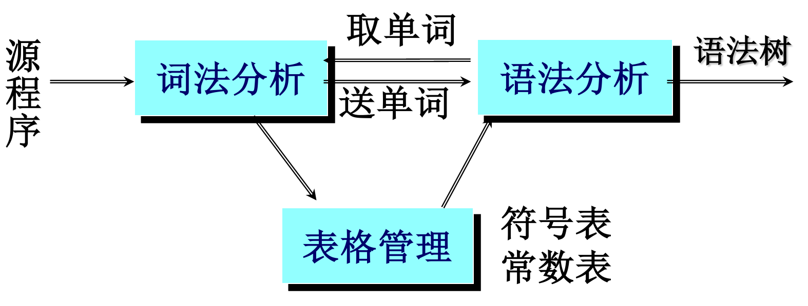

# 二、 单词的描述工具（理解）

正规集(正规语言)：某字母表上，我们感兴趣的符号串的集合。

正规表达式（regular expression）：是定义正规集(正规语言)的一种表示法。

正规文法：是对正规语言(正规集)的一种描述工具。

## 2.1 正规文法

程序设计语言中几类单词的规则描述：

<标识符>→ l|l <字母数字>

<字母数字>→l|d|l <字母数字>|d <字母数字>

<无符号数>→d|d <无符号数>

<运算符> →+|-|\*|/|=|< <等号>|> <等号>……

<等号>→=

<界符>→,|;|(|)|……

## 2.2正规式和正规集

### 2.2.1 定义

**正规式和正规集的递归定义为：**

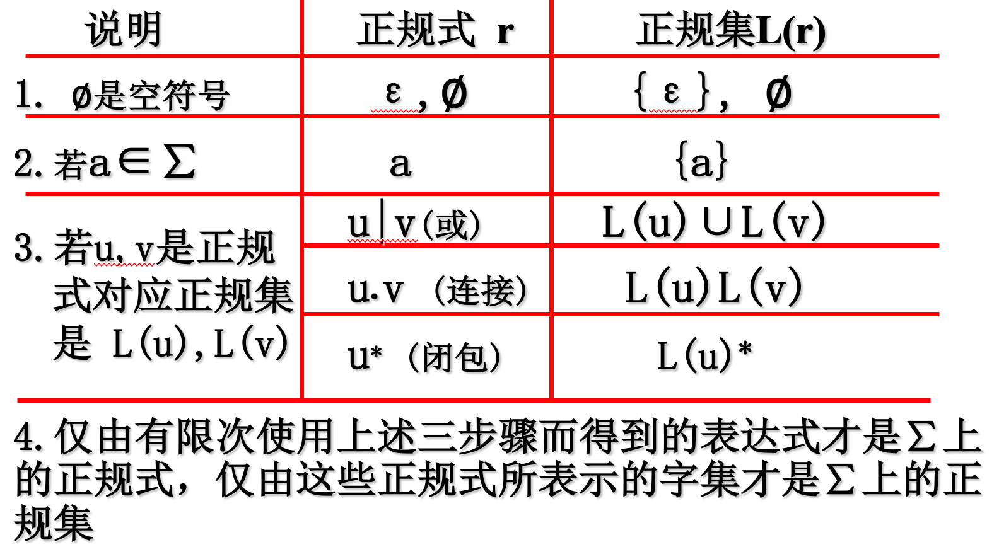

**举例：**

```
设 ∑={a，b}     正规式              正规集       ba*               ∑上所有以b为首后跟任意多个a的字   a(a|b)*             ∑上所有以a为首的字(a|b)*(aa|bb)(a|b)*    ∑上所有含有两个相继的a或两个相继的b的字  设∑={A,B,0,1}    正规式          正规集  (A|B)(A|B|0|1)*    ∑上的“标识符”的全体  (0|1)(0|1)*      ∑上的“数”的全体 
```

### 2.2.2 **正规式运算符的优先级**

`*` 高于`.`

`.` 高于`|`，具有结合律、分配律,可省略

`|` 具有交换律、结合律

`( )`指定优先关系

### 2.2.3 **正规式的性质**

```
U|V=V|U (交换律) U|(V|W)=(U|V)|W (结合律) U(VW)=(UV)W (结合律) U(V|W)=UV|UW (V|W)U=VU|WU (分配律) εU=Uε=U
```

### 2.2.4 **正规式的等价性**

一个正规式 r 表示的正规集也就是 r 所定义的语言，记为 L(r)，若两个正规式r和s所表示的正规集L(r)=L(s),则称r,s等价，记作 r = s。

# 三、 有穷自动机（掌握 重点 难点）

**定义：**是一种识别装置，能准确地识别正规集(正规语言)有限自动机是具有离散输入输出系统的数学模型；它具有有穷数目的内部状态，概括了对过去输入处理的信息，根据当前所处状态和面临输入即可决定系统的后继行为。

## 3.1 **确定有限自动机**

### 3.1.1 定义

确定的有限自动机DFA M是一个五元组：（，，，，M\=（S，∑，δ，s0，F)

(1) S 是一个非空有限集，它的每个元素称为一个状态。

(2) ∑是一个有穷字母表，它的每个元素称为一个输入符号，所以也称为输入符号字母表。

(3) δ是状态转换函数，是在S×∑→S上的单值映射。

**定义形式:**，δ(si，a)\=sj，其中，si∈S，sj∈S。

**含义:** 在当前状态为si，输入符号为 a 时，将转换为下一状态sj，我们把sj称为si的一个后继状态。

(4) s0∈S，是**唯一**的一个初态。

(5) F∈S，可空,是一个终态集,终态也称可接受状态或结束状态。

### 3.1.2 自动机举例

```
                  状态集   字母表  初态 终态例如有DFA   M =({0,1,2,3},{a,b}，δ,0,{3})其中δ定义为：δ（0，a）=1  δ（0，b）=2           δ（1，a）=3  δ（1，b）=2           δ（2，a）=1  δ（2，b）=3           δ（3，a）=3  δ（3，b）=3 
```

**状态转换矩阵和状态转换图：**

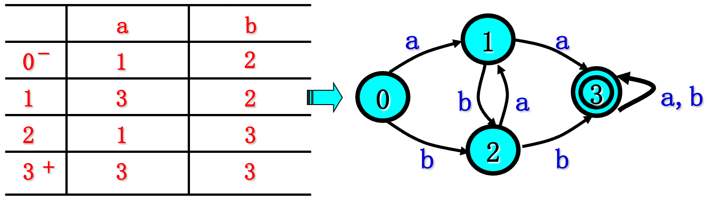

其中 `-` 示初态 `+` 表示终态。

### 3.1.3 DFA识别过程

设DFA （，，，，M\=（S，∑，δ，s0，F)

**定义：**

若 si→asj，则si⇒asj，表示在状态si下输入符号a可达状态sj ，或者si到sj有通路，通路上的字符串为a。

若 si⇒αsj,sj→ask 则si⇒αask,表示si 到 sk 有通路，通路上的符号串为αa。

若 α∈∑∗,s0⇒αsj,sj∈F，则称α可为M所接受（识别，读出）。

解释：若对于∑中的任何字_α_，若存在一条从初态结点s0到某一终态结点的通路，且这条通路上所有弧的标记符连接成的字等于_α_，则称_α_可为DFA M所识别（读出或接受）特别地，若初态结点同时又是终态结点，则空字ε可为DFA M所识别。

DFA M 所能接受的字符串的全体为 ：

L(M)\=α|s0⇒αsj,sj∈F,若则s0∈F,则ε∈L(M),若则F\=Φ,则L(M)\=Φ。


例如：状态0到状态3有通路，通路上的字符串为aa，同时可以为babba。

## 3.2 非确定有限自动机NFA

### 3.2.1 定义

一个NFA M是五元式 M\=(S,∑,δ,S0,F)

S 有穷非空状态集合

∑ 有穷的输入字母表集合

_δ_ 从S×∑∗→2S映射，其中 2S 表示 S 的幂集。

S0⊆S 是S的非空子集，称为初始状态集合。

F⊆S 是S的子集(可空),称为终止状态集合。

一个含有m个状态和n个输入的NFA可以描述成一张状态转换图，这张图含有m个状态节点，每个节点可以射出若干条箭弧与别的节点相连，每条弧用 ∑∗ 中的一个串作为标记，整个图至少含有一个初态节点和若干个终态节点。

若对于∑中的任何字_α_，若存在一条从初态结点s0到某一终态结点的通路，且这条通路上所有弧的标记符连接成的字等于_α_，则称_α_可为NFA 所识别（读出或接受）特别地，若初态结点同时又是终态结点或者存在一条从初态节点到终态节点的空边，则空字ε可为DFA M所识别。

**NFA和DFA的不同在于:**

- _δ_的值域是S的子集，：δ：S×Σ∗→2S
  
- 开始状态有不止一个
  
- 接受ε作为输入符号
  

### 3.2.2 NFA的确定化

若规定NFA的初态集中只有唯一一个元素，即NFA的初态唯一，且状态转换函数单值，则该NFA即为DFA。

DFA是NFA的特例：

对每一个NFA N一定存在一个DFA M，使得L(M)=L(N)即对每个NFA N存在着与之等价的DFA M。

注意：与某一NFA等价的DFA不唯一。

### 3.3.3 NFA确定为DFA的原因

使用NFA判定某个输入符号串的时候，可能出现不确定的情况：不知道下面选择哪个状态。如果选择不好，该输入符号串可能不能到达终止状态。但是，我们不能说该输入符号串不能被该NFA接受。如果通过尝试的方法，不断试探来确定输入符号串是否可被接受，那么判定的效率将降低。解决的方法是将NFA转换为等价的DFA。此外,用来描述语言的正规式更容易构造出识别同一语言的NFA。

### 3.3.4 NFA的确定化：子集法

**基本思想：**

让DFA的每一个状态对应NFA的一组状态。即让DFA使用它的状态去记录在NFA读入一个输入符号后可能达到的所有状态——子集。

定义两个运算：ε-closure(I)和move(I,a)：

**ε-closure(I)：**

状态集合 I 的ε闭包，定义为一状态集记为: ε-closure(I)，是

(1)若q∈I,则q∈ε-closure(I)；

(2)若q∈I,那么从q出发经任意条ε弧而能到达的任何状态q’都属于ε-closure(I)。

理解：就是 状态集合 I 本身加上所有可以通过任意条 ε边到达的节点。


例如：

，，，n\=5，3   ε−closure(I)\=5，3，1

**move(I,a)：**

设 I 是M的状态集的子集，a∈∑

状态集合I的a弧转换 ，定义为一状态集J记为：J=move(I,a)

J是可从I中的某一状态结点出发经过一条 a 弧而到达的状态结点的全体。

为了便于说明，记Ia\=ε−closure(J)，即Ia\=ε−closure(move(I,a))，白话就是Ia等于集合 I 先通过一条 a 边可以转移到的点加上从这些点经过任意条ε边可以到达的点的集合。

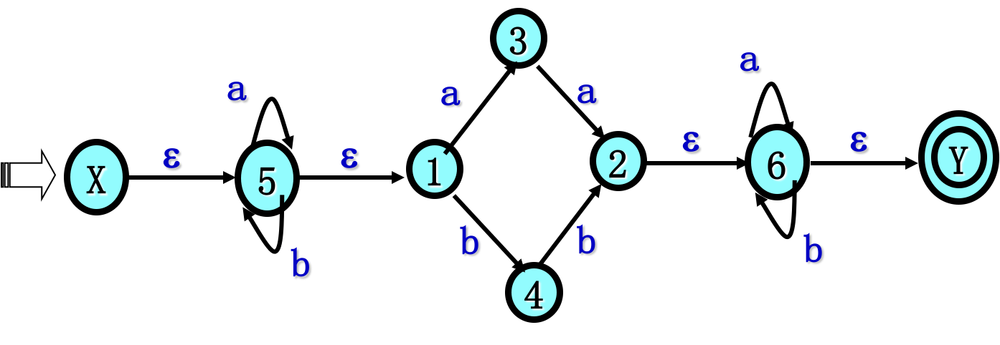

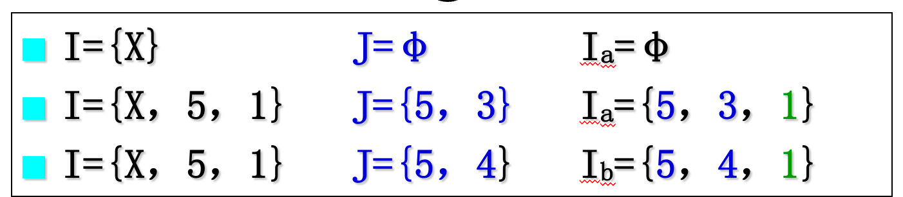

**算法过程：**

对给定的NFA N构造一张表，表的构成如下：

（1）设∑={ a1,…, ak }，表的每行含有k+1列。

（2）置首行首列（最左上角的格子）为ε-closure(S0)。

（3）若某行首列状态子集已确定,记为I，则置该行的第i+1列为Iai(i\=1,…,k)。

（4）检查该行所有状态子集，将未出现在第一列者填入到后面空行的第一列。

（5）重复(3)(4)直到第一列中状态子集不再扩大为止(在第i+1列上的所有状态子集均已在第一列上出现)。此时，将该表看成是一个状态转换矩阵。

（6）将该状态转换矩阵中所有状态子集重新命名，得到状态转换矩阵，其所示的是与给定的NFA N等价的DFA M（未化简的DFA）。

注意：DFA M的初态为该表第一行第一列的状态。DFA M的终态为含有原NFA N的终态的状态子集 。

## 3.3 DFA的化简

一个确定有限自动机 M 的化简是指：寻找一个状态数比 M 少的 DFA M’，使得 L(M’)=L(M)。

假定s和t是M的两个不同状态：

- s和t是等价的 如果从状态s出发能读出某个字w而停于终态，从状态t出发能读出同样的字w而停于终态；反之亦然。
  
- s和t是可区别的 如果从状态s开始输入w使得结束时候的状态为终止状态，而从t开始输入w时，结束的状态为非终止状态(或无状态)，那么我们说w把s和t区别开来。
  

### 3.3.1 判断DFA最小

**条件1：** 无多余状态，即从初态出发，任何输入串都不能到达的状态。

**条件2：**无相互等价的两个状态。

两个状态等价的条件（不等价称为可区别的）：

- 一致性条件：s、t同为终态或非终态
- 蔓延性条件：对**所有**输入符号，s、t必须转换到**等价**的状态集中，同时具有传递性。

### 3.3.2 化简步骤

**步骤1：** 将DFA的状态集分为互不相交的子集使得任何不同的两子集中的状态都是可区别的，而每个子集中的任何两个状态是等价的。

**步骤2：** 每个子集中选取一个状态作为子集中所有状态的代表，其余删除，这些代表构成了化简后的自动机的状态集合，到达被删除状态的弧引入该子集的代表状态。

**步骤3：** 删除无用状态。

**步骤4：** 初始状态为包含有原初态的子集的代表，终止状态为包含有原终态的子集的代表。

### 3.3.3 分割算法（化简步骤1）

**步骤1：** 初始分划：终止状态和非终止状态

**步骤2：** 重复对于每一组 I 都进行下列细分，直到不能再细分为止：

- 将 I 分成子组，使得 s,t 在一组当且仅当对于任何的输入符号，他们的后继都属于同一个小组。
- 将子组加入到分划中替换 I

**注意：** 前面发现的不能细分的小组后来可能还可以细分。所以重复步骤2的时候要检验所有的组，包括老的和新加入的。

**例子：**

**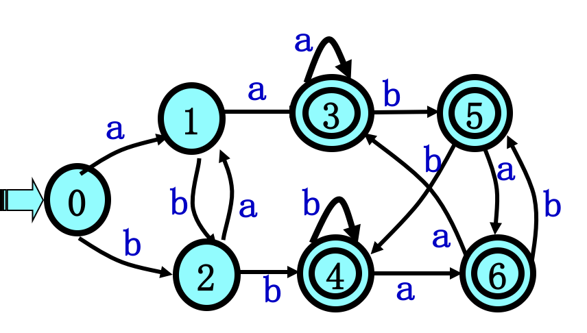**

1. 对状态集的划分如下：7个状态分成两组0,1,23,4,5,6
  
2. 考察处理3,4,5,6：3,4,5,6a\=3,6 等价 3,4,5,6b\=4,5 等价。 3,4,5,6 不可再分。
  
3. 考察处理0,1,2：0,1,2a\=1,3,1 ，1和3可区别， 0,1,2细分成0,21。
  
4. 考察处理0,2：0,2a\=10,2b\=2,4 2和4可区别0,2细分成02。
  
5. 最终共分成4组：0123,4,5,6。
6. 保留一组中的任意一个，比如保留3，删除4，5，6，2经b到4 改为2经b到3，4经b到4 改为3经b到3，其它重复以上修改。
7. 化简后的DFA：
  
    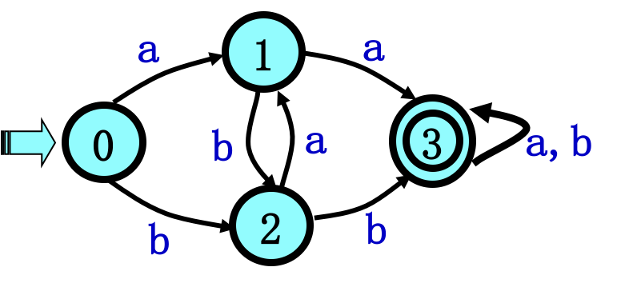
    

# 四、 正规式和有穷自动机的等价性（掌握 重点 ）

## 4.1 从NFA M构造正规式 r

**第一步：**在M中引进新的初态结点X和终态结点Y，形成M’，使得：所有的初态节点X→ε所有M的初态节点 ，所有的终态结点节点所有M的终态结点→εY节点 ，那么M’就只有一个初态X和一个终态Y。

**第二步：**反复使用下面的替换规则消去M’中的所有结点，逐步用正规式来标记弧：

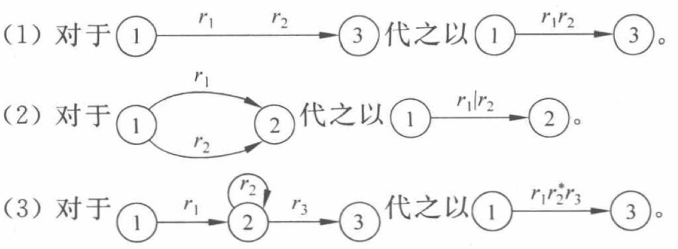

**第三步：**结点X和Y之间弧上的标记，即为所求正规式r。

## 4.2 从正规式 r 构造NFA M

### 4.2.1 替换规则

1. 若 r 具有零个运算符，则 r =ε或 r =∧ 或 r=a，对应的三个状态转换图如下：
  
    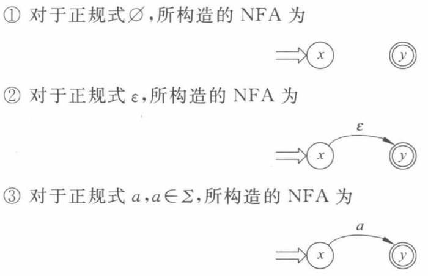
    
2. 当 r 中含有 k 个运算符时，分下列三种情况 r = r1| r2 r = r1 r2 r = r1\* ，对应的三个状态转换图如下：
  
    
    

### 4.2.2 构造方法

1.首先画上有两个结点X、Y的转换图，由X指向Y的弧上标记为正规式r，形成只有一个初态和终态的NFA

2.然后分解弧上正规式，用替代规则引入新状态结点，所有的新结点取不同的名字但同一结点的不同射出弧可以同名

3.直到所构造的FA中每条弧上都标记为单输入符号为止

4.用子集法将NFA确定化，用划分法将DFA最小化

### 4.2.3 举例

已知正规式 $r=(a|b)^_(aa|bb)(a|b)^_$试给出能识别 L(r) 的确定有限自动机NFA


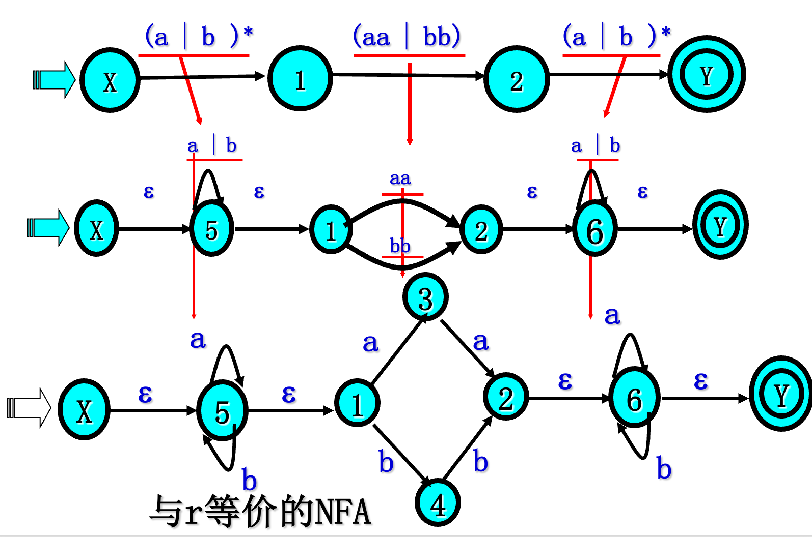

## 4.3 综合例题

已知正规式$ r=(a|b)^_(aa|bb)(a|b)^_$ 试给出能识别L(r)的确定有限自动机DFA

### 4.3.1 由r构造NFA

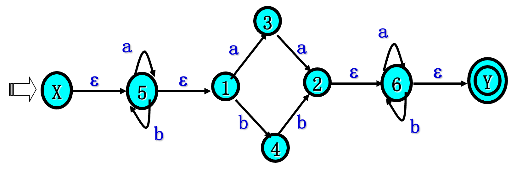

### 4.3.2 NFA确定化子集法

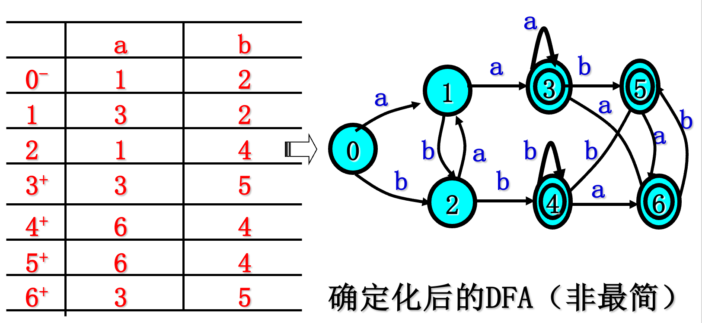

### 4.3.3 DFA最小化 划分法

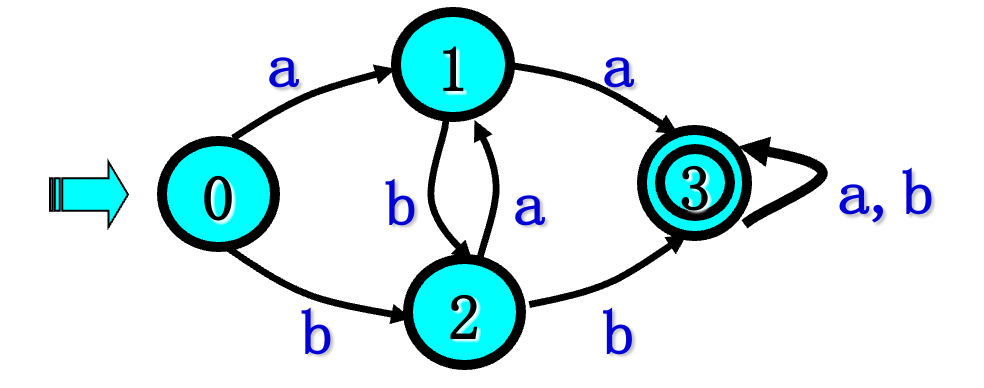

# 五、 正规文法和有穷自动机的等价性（了解）

对于正规文法G和有限自动机M，如果 L(G)=L(M)，则称G和M是等价的

（1）对于每一个正规文法G，都存在一个有限自动机FA M，使得L(M)=L(G)

（2）对于每一个有限自动机FA M，都存在一个正规文法G，使得L(G)=L(M)

即：**对于每个正规文法都能找到一个有限自动机对应，每个有限自动机都有一个正规文法对应。**另外，对任何正规文法，存在定义同一语言的正规式，对任何正规式，存在生成同一语言的正规文法。

三者的关系：

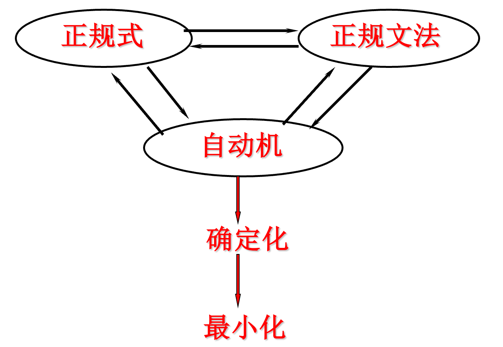