# 一、LR(k)分析法概述

LR分析法是一种**自下而上**语法分析技术，L表示从左到右扫描输入符号，R表示构造一个最右推导的逆过程——最左归约，k表示超前读入k个符号，以便确定归约用的产生式。一个LR分析器由3部分组成：

- 总控程序（驱动程序），对于所有的LR分析器，总控程序都是相同的。
- 分析表：动作表action + 状态转移表goto。
- 分析栈：状态栈和文法符号栈。

**LR文法**：能够构造一张不含多重入口的LR分析表的文法，即LR分析表的每个入口均是唯一确定的。

**LR(k)文法**：

- 能用一个每步顶多向前检查k个输入符号的LR分析器进行分析的文法。
  
- 对大多数的程序设计语言来说，k=0或1就足够了，因此，我们只考虑k≤1的情形。
  

**非LR文法：**栈顶内容和输入符号已知时仍无法唯一确定应采取的动作。

取值动作表中规定了4种动作，ACTION\[Si,a\]表示栈顶状态为 Si 时遇到输入符号 a 应该执行的动作：

- 移进action\[Si,a\]\=Sj：将状态 j 进状态栈，a 移进符号栈，输入指针移向下一位置。
- 归约action\[Si,a\]\=rj：用第 j 个产生式 A→β 进行归约, |β|\=m，移去状态栈的 m 个状态和符号栈的 m 个符号，用当前状态栈顶状态 k′ 和 A 查 GOTO(k′,A)\=t，将状态 t 移进状态栈，A 移进符号栈，输入指针不动。
- 接受 acc ：宣布输入符号串为一个句子。
- 报错 error：状态与文法符号不匹配，宣布输入符号串不是句子。

下图为 LR 分析器的工作过程示意图，其中SP为栈指针，S\[i\] 为状态栈，X\[i\] 为文法符号栈。状态转换表内容按关系GOTO\[Si,X\]\=Sj 确定，该式子表示，当前栈顶为状态Si ，遇到当前文法符号位X 时应该转向状态Sj 。X 为终结符或非终结符。

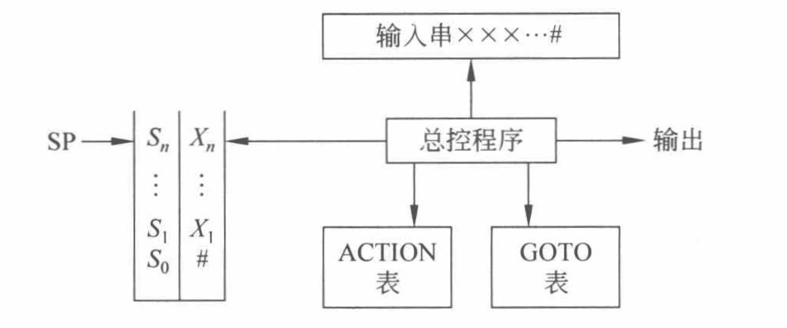

# 二、LR(0) 分析

## 2.1 LR(0) 分析过程

现在有文法 G\[S\] ：(1)S→aAcBe (2)A→b (3)A→Ab (4)B→d，给出文法 LR(0) 的分析表：

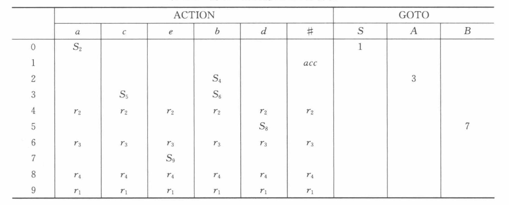

给出对输入串 abbcde# 的分析过程：

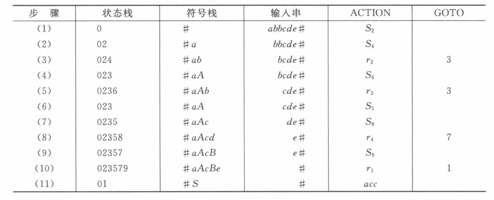

1. 首先，状态栈中初始状态为 0 **（这里的所有数字状态都代表S状态）**，输入串指针指向 a ，由于ACTION\[0,a\]\=S2，所以 ACTION 表中填入 S2，执行移进操作，将状态 S2 压入状态栈，并将 a 压入符号栈。
  
2. 此时状态栈中为02，符号栈中为#a，输入串指针指向 b ，由于ACTION\[2,b\]\=S4，所以 ACTION 表中填入 S4 ，执行移进操作，将状态S4 压入状态栈，并将 b 压入符号栈。
  
3. 此时状态栈中为024，符号栈中为#ab，输入串指针指向 b ，由于ACTION\[4,b\]\=r2，所以 ACTION 表中填入 r2 ，执行归约操作，用产生式 (2)A→b 进行归约，由于产生式2 右部长度为1，则同时移除状态栈和符号栈中的1个元素,此时状态栈的栈顶为S2，将 A 插入到符号栈中。然后考察 GOTO 表，寻找当前栈顶状态的转移状态， 发现 GOTO\[2,A\]\=3，则将S3 压入状态栈。
  
4. 此时状态栈中为023，符号栈中为#aA，输入串指针指向 b ，由于ACTION\[3,b\]\=S6，所以 ACTION 表中填入 S6 ，执行移进操作，将状态 S6 压入状态栈，并将 b 压入符号栈。
5. 此时状态栈中为0236，符号栈中为#aAb，输入串指针指向 c ，由于ACTION\[6,c\]\=r3，所以 ACTION 表中填入 r3 ，执行归约操作，用产生式 (3)A→Ab 进行归约，由于产生式3 右部长度为2，则同时移除状态栈和符号栈中的2个元素,此时状态栈的栈顶为S2，将 A 插入到符号栈中。然后考察 GOTO 表，寻找当前栈顶状态的转移状态， 发现 GOTO\[2,A\]\=3，则将S3 压入状态栈。
6. 依次类推进行，直至步骤(11)，由于 ACTION\[1,#\]\=acc ，说明该句子被接受，完成归约。

## 2.2 规范句型的活前缀

前缀：一个句型的任意首部，包括空字符。

可归前缀：LR分析过程中每次采取归约动作前符号栈中的内容称为规范句型的可归前缀(例子见课本P126)。

活前缀：形成可归前缀之前包括可归前缀在内的所有规范句型的前缀。活前缀为一个或若干个规范句型的前缀。

分析决策依据栈顶状态和当前输入符号就是利用LR(0)项目构造识别活前缀和句柄的DFA。

**拓广文法：** 在原分法的基础上增加产生式 S′→S，所得的新文法 G′ 为拓广后的文法，其目的是区分最初的开始符号和可能出现在产生式右部的开始符，分清是否归约到了最初的开始符。

## 2.3 LR(0) 项目

### 2.3.1 定义

在文法G 的产生式右部某个位置标有`.` 的产生式称为一个项目。

约定 A→ϵ 对应的LR(0)项目为 A→·

每个项目的含义与`.`的位置有关，即`{已识别部分}.{待识别的部分}`，即标识某个产生式的右部识别到哪个位置了。

例如产生式 S→aAcBe 有6个项目：

\[1\]  S→·aAcBe

\[2\]  S→a·AcBe

\[3\]  S→aA·cBe

\[4\]  S→aAc·Be

\[5\]  S→aAcB·e

\[6\]  S→aAcBe·

### 2.3.2 LR(0)项目的分类

A→α. 表示归约项目(Reduce)，句柄形成于栈顶，可归约 。

S′→α. 表示接受项目，接受，句子分析成功。

A→α.aβ 表示移进项目(Shift)，移进符号a 。

A→α.Bβ 表示待约项目，等待分析完B，才能继续分析A的右部。

### 2.3.3 构造识别活前缀的NFA

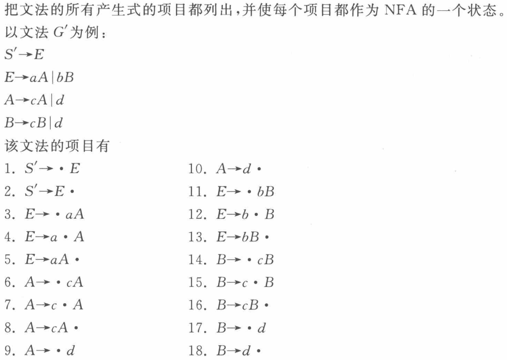

S′ 只在第一个产生式的左部出现，规定项目1为初态，其余项目都为活前缀的识别态，其中圆点在最后的项目为句柄识别态，第一个产生式的句柄识别态为句子的识别态。其中每个识别态之间的转换关系如下：

若 i 项目为：X→X1X2…Xi−1·Xi…Xn

若 j 项目为：X→X1X2…Xi−1Xi·Xi+1…Xn，则存在一条f从状态 i 到状态 j 的一条标记为 Xi 的箭弧。

另外，如果 Xi 为非终结符，则从状态 i 连一条标记为 ε 的箭弧指向所有以 Xi 为左部，产生式原点在最左边的状态。

如 状态1 ：X→a·Ab ，状态2：A→·c ，则从状态1连一条 ε 弧指向状态2。

按照上述规则，可以构造出对应的NFA：

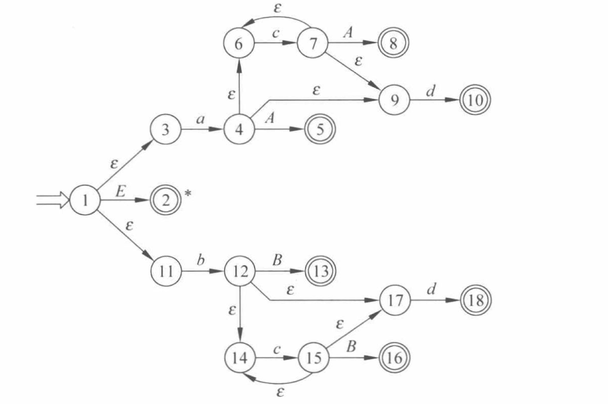

## 2.3 LR(0)项目集规范族

### 2.3.1 定义

文法的LR(0)项目集规范族,记作 C，表示构成识别一个文法活前缀的DFA的项目集合(或状态)的全体，例如,，，，C\={I0，I1，…，I11}

LR(0)项目集(合)：识别一个文法活前缀的DFA的状态。

函数go ：LR(0)项目集间的转移函数。

对于文法 ：G′： S′→E E→aA|bB A→cA|d B→cB|d，根据上文的NFA确定化为DFA可得：

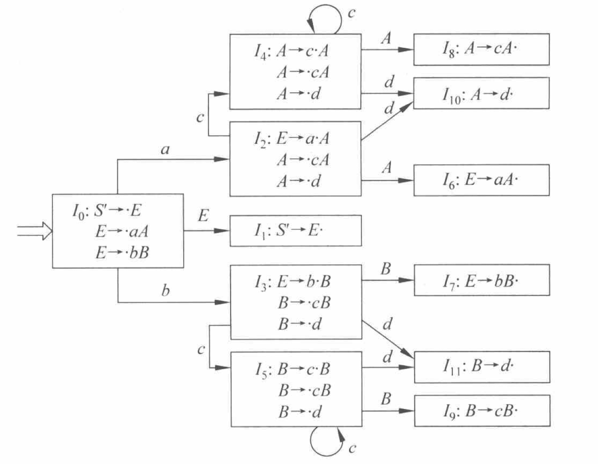

从图中我们可以发现，可以通过闭包函数来求DFA 一个状态的项目集，如果 I 为文法 G′ 的一个项目集，定义和构造 I 的闭包 CLOSURE(I) 的步骤如下：

（1）I 的项目均在 CLOSURE(I) 中。

（2）若A→α·Bβ 属于 CLOSURE(I) ，则形如 B→·γ 的项目也属于闭包。

（3）重复（2）知道不出现新项目为止。

如此，我们可以求出某个状态的项目集，那么如何求出其他状态的项目集，从前文构造NFA的过程可知，两个相邻状态对应的项目出自同一个产生式，只是原点的位置差1（除 ε 弧对应的状态外）。由此，我们可以将某个状态的项目集里的每个项目都右移原点（除了小圆点在最右的情况），得到一个新状态的初始项目，这个项目称为**核**。对核求闭包，就是新状态的项目集。把转移的过程写成一般形式如下：

定义转换函数GO(I,X)\=CLOSURE(J)，其中 I 为某一个项目集中的状态， X∈VN∪VT ，任何形如的项目属于J\={任何形如A→aX·β的项目|A→·Xβ属于I }，即所有可以向右移动小圆点的状态。

### 2.3.2 构造

得到 CLOSURE 函数和 GO(I,X) 后，我们可以得到构造方法如下：

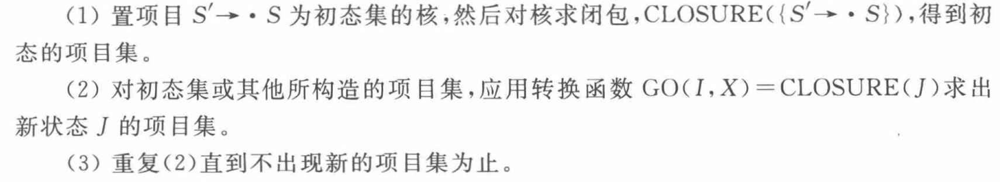

一个项目集中可能包含多种项目，但是不能有以下情况：

- 移进和归约项目同时存在。
- 归约项目和归约项目同时存在。

**构造方法口头话：**

1. 从拓广文法的开始符 S′ 开始，先构造出初始的项目集：
  
    首先由 S′ 推得的产生式都在项目集中，其次，如果项目集中存在 S′→α·Eβ 的项目，则所有的 B→·γ 项目也都在项目集中。
    
2. 推出后续项目集，构造项目集规范族：
  
    将项目中所有的 `·` 都向后移动一位，得到新的项目，得到的这个新的项目就是另外一个项目集的**核**（所谓核就是这个项目集最初始的项目），然后在原项目向新项目集连一条箭弧，标上移动 `·` 时跨越的字母。比如：当前某个项目为 S′→·E ，向后移动一位，得到 S′→E· ，形成一个新的项目集，然后将这两个项目所在的项目集上连接一条弧，标上E。然后对新的项目集 S′→E· 进行步骤1的搜索工作。
    

## 2.4 LR(0) 分析表的构造

设 G′ 的 LR(0) 项目集规范族C\={I0,I1,…,In}，令每个项目集 Ik 的下标 k 作为分析器的状态，共 n+1 个状态，ACTION表的构造方法(共5步)：

(1)若 A→α·aβ∈Ik 且 GO(Ik,a)\=Ij,则 ACTION\[k,a\]\=Sj

(2)若A→α·∈Ik,则”，a∈VT∪{#}，ACTION\[k,a\]\=rj（假定产生式 A→α是文法 G’的第j个产生式）

(3)若S′→S·∈Ik ,则 ACTION\[k,#\]\=acc

(4)若 GO(Ik,A)\=Ij,则 GOTO\[k,A\]\=j

(5)分析表中凡是不能用以上规则填入信息的空白格均置 上“报错标志”。

：G′： (1)S′→E (2)E→aA|bB (3)A→cA|d (4)B→cB|d

产生式的编号如下：

上文的项目集规范组构造成分析表如下：

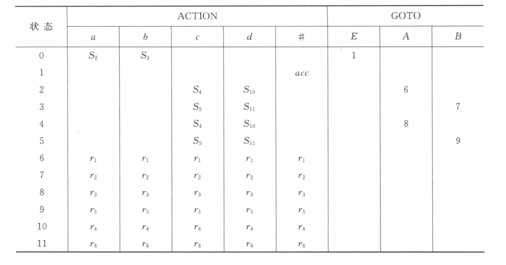

## 2.5 LR(0)分析器工作过程

LR(0) 分析器的过程如下：

(1) 若 ACTION\[S,a\]\=Sj ，a 为终结符，则把 a 移入符号栈， j 移入 状态栈。

(2) 若 ACTION\[S,a\]\=rj ，a 为终结符或 # ，则用第 j 个产生式归约，并将两个栈的指针减去 k ，其中 k 为第 j 个产生式右部的符号串长度，这时当面临符号为第 j 个产生式左部的非终结符，不妨设为 A ,归约后栈顶状态设为 n ，则进行 GOTO\[n,A\]。

(3) 若 ACTION\[S,a\]\=acc ，a 应为 # ，则表示接受，分析成功。

(4) 若 GOTO\[S,A\]\=j ，A 为非终结符， 表面前一动作是用关于 A 的产生式归约的，当前面临的非终结符 A 应移入符号栈， j 移入状态栈。对于终结符的 GOTO\[S,a\] 已和 ACTION\[S,a\] 重合。

(5) 若ACTION\[S,a\] 为空白，则表示出错。

下面为对输入串 `bccd#` 的LR(0) 分析：

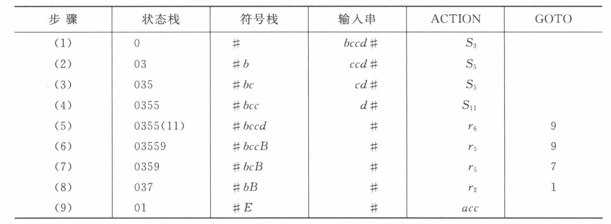

# 三、SLR(1)分析

## 3.1 LR(0) 分析的问题

当LR(0)含有互相冲突的项目时，则需要向前展望符号串，检查下一个输入符号的状态。

**例：** 项目集 ，，I\={X→α·bβ，A→α·，B→α·}

上面的项目集中出现了移进项目和归约项目同时存在，并且还同时存在两个归约项目的情况，这种情况下当面临输入符号 a 时，应该选择移进 a ,还是归约到 A ,或归约到 B ？。

**解决办法：**当状态 I ,面临输入符号是 a 时，

(1) 若a\=b,则移进 b，即该移进项目的下一个待移进的字符等于输入字符，则移进。

(2) 若a∈FOLLOW(A),则用产生式 A→α 进行归约，即归约后 A 后面接着的就是输入字符。

(3) 若 a∈FOLLOW(B) ,则用产生式 B→α 进行归约

(4) 此外,报错。

**例如：**I1\={S′→E.,E→E.+T}

(1) 当面临输入符号为 + 时，移进 ACTION\[1,+\]\=S6

(2) S′→E. 是接受项目,FOLLOW(S′)\={#},ACTION\[1,#\]\=acc

(3) 此外,面临其它输入符号时报错。

，I2\={E→T.，T→T·∗F}

(1) 当面临输入符号为 \* 时，移进 ACTION\[2,∗\]\=S7

(2) 由于 FOLLOW(E)\={),+,#} ,因此当面临输入符号为 ),+,# 时,使用产生式 E→T 归约,即ACTION\[2,)\]\=r2,ACTION\[2,+\]\=r2,ACTION\[2,#\]\=r2

(3) 此外,面临其它输入符号时报错。

## 3.2 SLR(1)冲突解决办法

假定 LR(0) 规范族的一个项目集 I 中含有 m 个移进项目：

A1→α·a1β1, A2→α·a2β2 ,…, Am→α·amβm

同时含有 n 个归约项目：

B1→α·,B2→α·,…,Bn→α·

如果下列集合两两不相交 {a1,a2,…,am}, FOLLOW(B1),FOLLOW(B2),…,FOLLOW(Bn)

当状态 I 面临输入符号 a 时，按以下规则移进归约：

- 若a\=ai，i\=1,2,…,m, 则移进。
  
- 若a∈FOLLOW(Bi),i\=1,2,…,n, 则用 Bi→α 归约。
  
- 此外,报错
  

## 3.3 SLR(1)分析表的构造算法

设 G′ 的 LR(0) 项目集规范族 C\={I0,I1,…,In}

令每个项目集 Ik 的下标 k 作为分析器的状态,共 n+1 个状态

ACTION表的构造方法(共5步)：

(1)若A→α·aβ∈Ik，且 GO(Ik,a)\=Ij ,则 ACTION\[k,a\]\=Sj

(2)若 A→α·∈Ik ,且 a∈FOLLOW(A)，ACTION\[k,a\]\=rj（假定产生式 A→α是文法 G’的第j个产生式，此步骤表示这是一个合法的归约）

(3)若 S′→S·∈Ik ,则 ACTION\[k,#\]\=acc，接受状态。

(4)若 GO(Ik,A)\=Ij,则 GOTO\[k,A\]\=j

(5)分析表中凡是不能用以上规则填入信息的空白格均置上“报错标志”。

## 3.4 SLR(1)文法的定义

SLR(1)分析表：对于文法G,按照SLR(1)冲突解决办法,构造出来的每个入口不含多重定义的LR分析表。

SLR(1)文法：具有SLR(1)分析表的文法。

SLR分析器：使用SLR(1)分析表的分析器。

## 3.5 SLR(1)分析的局限性

### 3.5.1 与LR(0) 的比较

LR(0)与SLR(1)的分析表的构造算法不同：

- LR(0) 分析对所有终结符均采用归约动作
  
- SLR(1) 分析参考 FOLLOW 集确定归约动作
  

SLR(1)文法的分析能力强于LR(0)方法：

- LR(0) 分析表出现冲突
  
- SLR(1) 分析表无冲突
  

### 3.5.2 SLR(1) 的局限性

如果SLR(1)分析表仍有多重入口，说明 SLR(1)冲突解决办法无法解决 移进-归约冲突 或 归约-归约冲突 , 则该文法不是SLR(1)文法。

说明仅使用LR(0)项目集和FOLLOW集还不足以分析这类文法。

# 四、LR(1)分析——规范LR分析

## 4.1 后继符概念

LR(0)不考虑后继符(搜索符)，SLR(1) 仅在分析 时考虑后继符(搜索符)，因此，对后继符(搜索 符)所含信息量的利用有限。如果在构造状态时就考虑后继符(搜索符)的作用会更加高效。考虑对于产生式 A→α 的归约，不同使用位置的 A 会有不同的后继符号。比如，假设栈中符号串 βα是活前缀,有产生式 A→α ,且面临输入符号为 a ,只有当 βAa 也为活前缀时, α 才可归约到 A 。

举例：若当前项目集中有 I2\={E→T·,T→T·∗F} ，栈顶状态为2，栈中符号位`# T` ，输入符号为`)` ，且假设 )∈FOLLOW(E) ，则根据 SLR 分析可以用 E→T· 进行归约，归约后栈中为 `# E )` ，但此时可能栈中的字符串不是表达式文法规范句型的活前缀，存在无效归约。

不同的归约中有不同的后继符, 特定位置的后继符是**FOLLOW集的子集**(出现在规范句型中的那些符号)。

## 4.2 LR(k)项目

为避免发生用 A→α 的无效归约,若 A→α.Bβ∈I 时, 则 B→.γ∈I ,不妨考虑把 a∈FIRST(β) 作为用产生式 B→γ 归约的搜索符,此时 a 将作为归约时需要查看的符号,代替了 SLR(1) 分析中的 FOLLOW集。

为此我们需要重新定义项目,使得每个项目都附带 m 个 终结符, LR(k) 项目\[A→α.β,a1a2…ak\]。

β≠ε ,移进或待约项目, a1a2…ak不起作用。

对归约项目\[A→α.,a1a2…ak\],仅在当前输入符号串开始的前 k 个符号是 a1a2…ak 时,才能用 A→α进行归约 A→α.β是LR(0)项目, a1a2…ak称为向前搜索符。

**定义：**

\[A→α.β,a1a2…ak\]

归约项目: \[A→α.,a1a2…ak\]$

接受项目: \[S′→S.,a1a2…ak\]$

移进项目：\[A→α.aβ,a1a2…ak\]

待约项目：\[A→α.Bβ,a1a2…ak\]

利用 LR(k) 项目进行(构造) LR(k) 分析(器)

当 k=1时，为LR(1)项目，相应的分析叫 LR(1)分析(器)

## 4.3 LR(1)项目集规范族构造

### 4.3.1 CLOSURE(I)的计算

对于 CLOSURE(I) 中项目：A→α.Bβ,a，若有产生式B→η，则B→.η,b∈CLOSURE(I)，b∈FIRST(βa)，若 β⇒+ε，则 b\=a

**例如：**

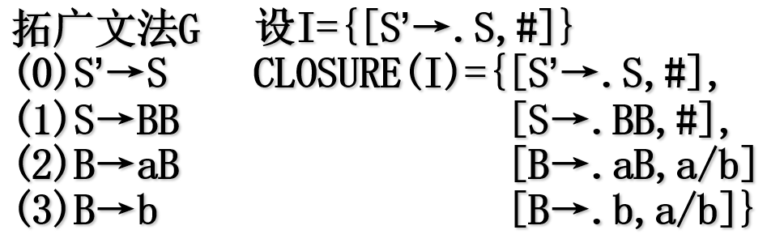

### 4.3.2 GO函数的计算

状态 I 和文法符号 X 的转移函数： GO(I,X)\=CLOSURE(J)， 其中J\={\[A→αX.β,a\]|\[A→α.Xβ,a\]∈I}

**例如：**

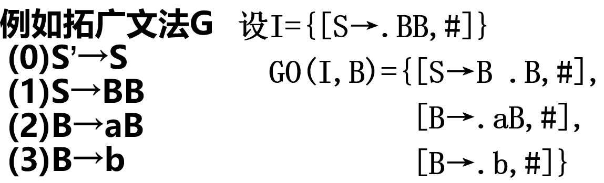

### 4.3.2 画图

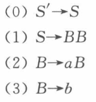

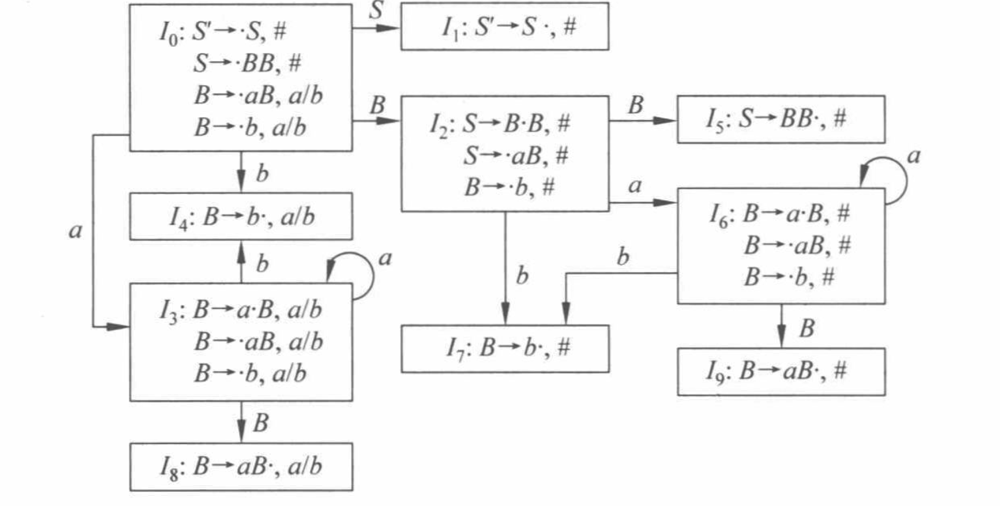

## 4.4 LR(1)分析表构造

一个LR(1)项目可以看成由两个部分组成，一部分和LR(0)项目相同，称为**心**，另一部分为向前搜索符集合，因而LR(1)分析表的构造与LR(0)分析表的构造在形式上基本相同,只是归约项目的归约动作取决于该归约项目的向前搜索符集，即只有当面临的输入符属于向前搜索符的集合，才做归约动作，其他情况均出错。具体构造过程如下:

设 G′ 的 LR(1) 项目集规范族C\={I0,I1,…,In}，令每个项目集 Ik 的下标 k 作为分析器的状态,共 n+1 个状态，ACTION 表的构造方法(共5步) ：

 (1)若\[A→α·aβ,b\]∈Ik 且 GO(Ik,a)\=Ij，则ACTION\[k,a\]\=sj (与搜索符无关)

 (2)若\[A→α·,a\]∈Ik, 则 ACTION\[k,a\]\=rj（假定产生式 A→α 是文法 G′ 的第 j 个产生式）

 (3)若S′→S·∈Ik ,则 ACTION\[k,#\]\=acc

 (4)若 GO(Ik,A)\=Ij,则 GOTO\[k,A\]\=j

 (5)分析表中凡是不能用以上规则填入信息的空白格均置上“报错标志”。

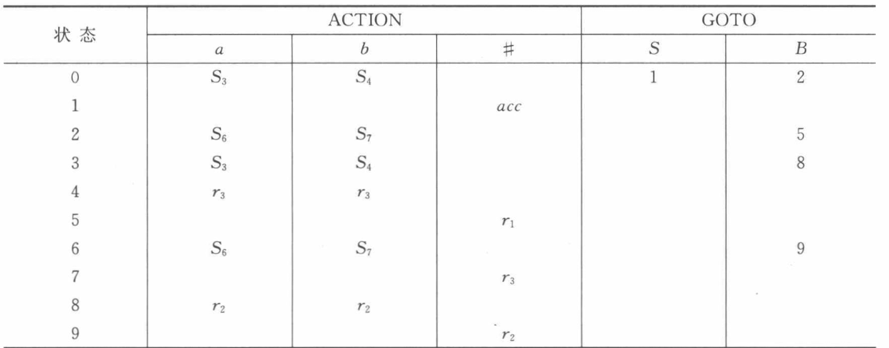

## 4.5 LR(1)文法定义

规范的LR(1)分析表：分析表中不存在多重定义的入口

LR(1)文法：具有规范的LR(1)分析表的文法

LR(1)分析存在问题：状态数目多,占用存储空间大

# 五、LALR(1) 文法

## 5.1 定义

**简化 LR(1) 分析：**减少资源开销——减少状态数目。

LALR(1)分析 (lookahead-LR)：在不带来移进归约冲突的条件下，合并状态，重构分析表。

可行性：同心项目集——LR(1)项目有相同的 LR(0) 项目，不同的搜索符——合并同心项目集。

**同心项目集：心相同的项目集称为同心项目集。**

一个LR(1)项目可以看成由两个部分组成，一部分和LR(0)项目相同，称为**心**。

如上图中的I3和I6， I4和I7， I8和I9。

## 5.2 LALR(1) 项目集规范族

上面的文法经过转换后得到LALR(1)：

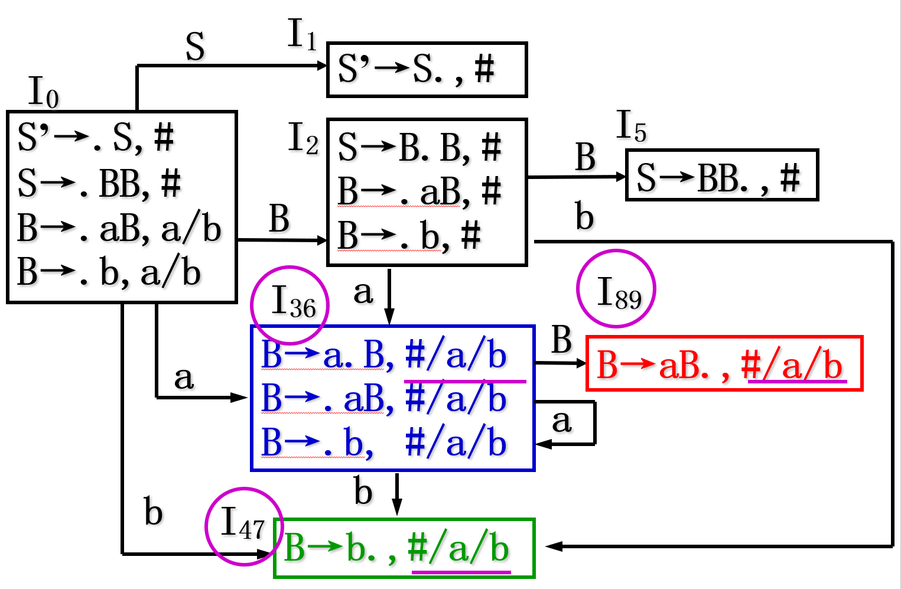

## 5.3 LALR(1) 分析表的构造

上图对应LALR(1)分析表为：

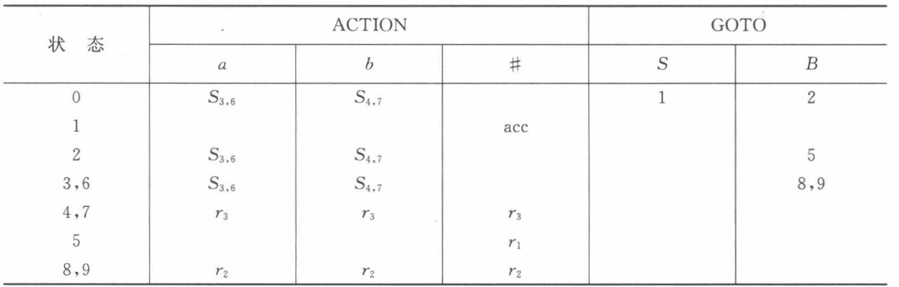

## 5.4 LALR(1) 文法的定义

LALR(1)分析表：若合并后的集族不存在归约归约冲突,则可构造出LALR(1)分析表

LALR(1)文法：存在LALR(1)分析表的文法

局限性：合并中不出现归约归约冲突

# 六、总结

五种文法的关系：

**自下而上分析：**

基本框架：移进归约分析

核心：在句型中确认句柄，分析器具有基本相同的逻辑结构

控制算法：基于算符优先关系表、基于 LR 分析表（动作和状态转移）