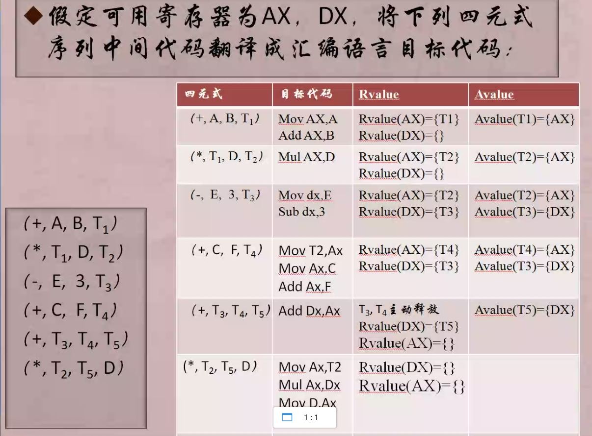
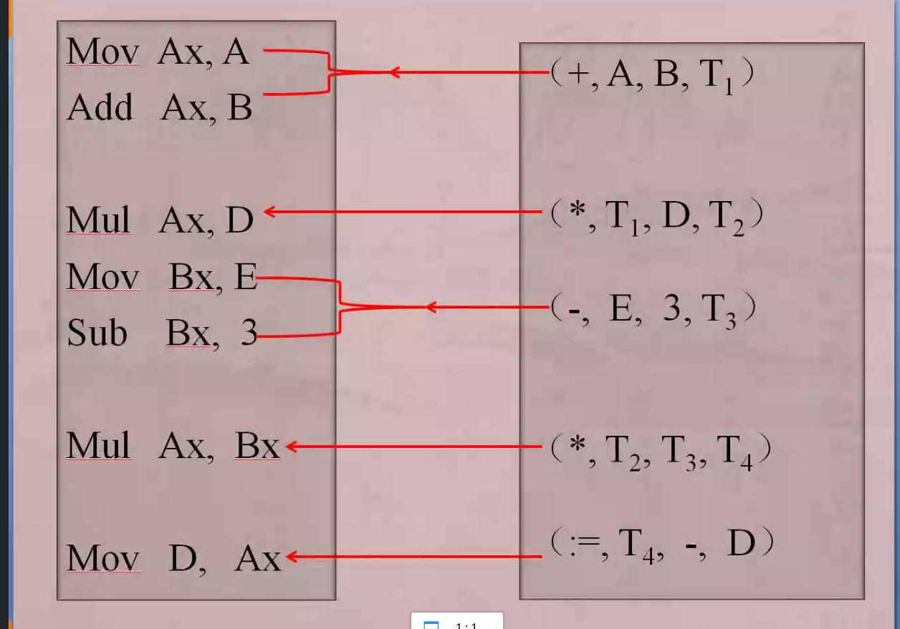
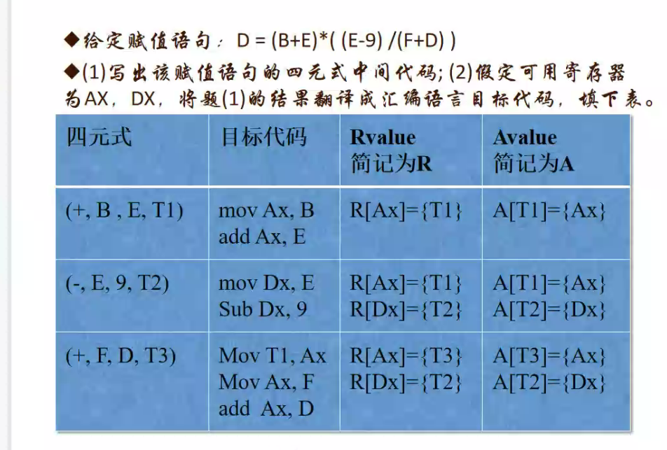

1. 四元式转化：

   1. 

      1. 在编译原理中，avalue和rvalue通常用于描述表达式的值类别。

           * avalue(非临时值):表示一个存储在内存中的常量、静态变量、全局变量、对象引用或数组元素等，它们的值不会被修改。
           * rvalue(临时值):表示一个表达式所表示的值是暂时存在的，它的值可能会被修改或者它本身不是一个有效的表达式结果。例如，函数调用的结果、赋值操作符右边的表达式等。

         在编译过程中，编译器需要对不同的值类别进行不同的处理。例如，对于avalue,编译器可以直接将其拷贝到目标位置；而对于rvalue,编译器需要进行额外的操作来确保其值不会被意外修改。

   2. 

   3. 

   4. 四元式中单元默认为立即数，可以不用先存到寄存器中，可直接对其进行使用

2. 考试范围

   1. 代码优化
   
       
