# 4.1 指令系统的发展与性能要求

## 4.1.1 指令系统的发展

### 1\. 指令在计算机系统中的地位

- 是软件和硬件分界面的一个主要标志,硬件设计人员采用各种手段实现它；软件设计人员则利用它编制各种各样的系统软件和应用软件
- 是硬件设计人员和软件设计人员之间的分界面，也是他们之间沟通的桥梁。

### 2\. 指令系统的基本概念

**指令：** 就是要计算机执行某种操作的命令。从计算机组成的层次结构分为：

- 微指令：是微程序级的命令，它属于硬件；
- 宏指令：由若干条机器指令组成的软件指令，它属于软件；
- 机器指令：介于微指令与宏指令之间，通常简称为指令，每一条指令可完成一个独立的算术运算或逻辑运算等操作。

一台计算机中所有机器指令的集合，称为这台计算机的**指令系统。** 指令系统是表征一台计算机性能的重要因素，它的格式与功能不仅直接影响到机器的硬件结构，而且也直接影响到系统软件，影响到机器的适用范围。因为指令是计算机硬件与软件之间的接口。

### 3\. 发展情况

- 复杂指令系统计算机，简称**CISC**。但是如此庞大的指令系统不但使计算机的研制周期变长，难以保证正确性，不易调试维护，而且由于采用了大量使用频率很低的复杂指令而造成硬件资源浪费。
- 精简指令系统计算机：简称**RISC**（Apple的M1），人们又提出了便于VLSI技术实现的精简指令系统计算机。

> 出现CISC到RISC转变的原因：，2/8现象（只有20%的指令使用率达到80%），控制器设计难度下降

## 4.1.2 对指令系统性能的要求

- **完备性：** 完备性是指用汇编语言编写各种程序时，指令系统提供的指令足够使用，而不必用软件来实现。采用硬件指令的目的是提高程序执行速度，便于用户编写程序。eg：乘除运算指令和浮点运算指令可以通过物理硬件直接执行
- **有效性：** 有效性是指利用该指令系统所编写的程序能够高效率地运行。高效率主要表现在程序占据存储空间小、执行速度快。一般来说，一个功能更强、更完善的指令系统，必定有更好的有效性。
- **规整性：** 规整性包括指令系统的对称性、匀齐性、指令格式和数据格式的一致性。
    - 对称性是指：在指令系统中所有的寄存器和存储器单元都可同等对待，所有的指令都可使用各种寻址方式；
    - 匀齐性是指：一种操作性质的指令可以支持各种不同的数据类型；
    - 指令格式和数据格式的一致性是指：指令长度和数据长度有一定的关系，以方便处理和存取。例如指令长度和数据长度通常是字节长度的整数倍。
- **兼容性：** 系列机各机种之间具有相同的基本结构和共同的基本指令集，因而指令系统是兼容的，即各机种上基本软件可以通用。

## 4.1.3 低级语言与硬件结构的关系

[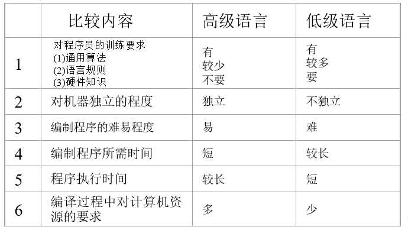](http://fangkaipeng.com/wp-content/uploads/2021/04/wp_editor_md_1cc19ce3259e84b764f9a75bbc215efd.jpg)

汇编语言依赖于计算机硬件结构和指令系统，因此不同的机器有不同的指令，用汇编语言编写的程序不能在其他类型的机器上使用

高级语言可以在不同系统上运行，但其不能直接访问计算机的硬件资源

# 4.2 指令格式

**操作码字段+地址码字段**，左边为高位，右边为低位。

## 4.2.1 操作码

设计计算机时，对指令系统的每一条指令都要规定一个操作码。指令的操作码OP表示该指令应进行什么性质的操作。不同的指令用操作码字段的不同编码来表示，每一种编码代表一种指令。组成操作码字段的位数一般取决于计算机指令系统的规模。较大的指令系统就需要更多的位数来表示每条特定的指令，按照操作码长度分为：

- 等长：指令规整，译码简单，固定长度编码的主要缺点是：信息的冗余极大，使程序的总长度增加。
- 变长：指令不规整，译码复杂，效率高

## 4.2.2 地址码

根据一条指令中有几个操作数地址，可将该指令称为几操作数指令或几地址指令。

- 三地址指令：第一操作数（a），第二操作数（b），结果地址（c） ==（a+b=c；）
- 二地址指令：第一操作数，第二操作数，结果存在第一操作数下（a+=b；），按照操作数的物理位置不同分为：
    - RR：寄存器-寄存器类型
    - RS：寄存器-存储器类型
    - SS：存储器-存储器类型
- 单地址指令：第一操作数（a++；）
- 零地址指令：如停机、清除等控制指令

## 4.2.3 指令字长度

指令字长度：一条指令字包含二进制代码的位数，即操作码+地址码  
机器字长：计算机能直接处理的二进制数据的位数。  
按照指令字和机器字长的关系分为：单字长指令（指令字长等于机器）、半字长指令（指令字长等于半个机器）、双字长指令。

指令字长度相等的称为等长指令，随指令功能而异的称为非等长指令。

- 指令系统中指令采用等长指令的优点：各种指令字长度是相等的，指令字结构简单，且指令字长度是不变的 ；
- 采用非等长指令的的优点：各种指令字长度随指令功能而异，结构灵活，能充分利用指令长度，但指令的控制较复杂 。

[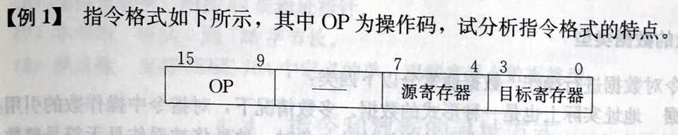](http://fangkaipeng.com/wp-content/uploads/2021/04/wp_editor_md_2da57dd43ce9047c8ab4de27a25a9dbf.jpg)

op占7位，可表示的操作数有128条。  
只有一行，所以是单字长指令，存在源寄存器和目标寄存器，为二地址指令，为RR型。

[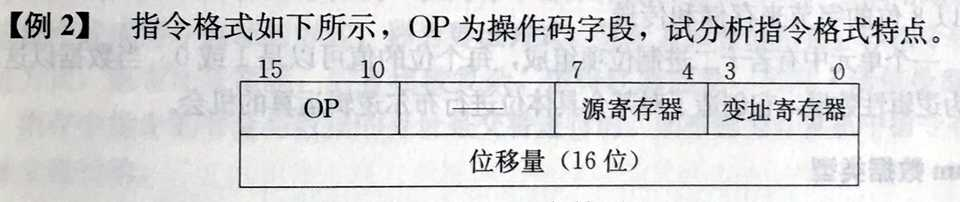](http://fangkaipeng.com/wp-content/uploads/2021/04/wp_editor_md_0f61199648f3fcb73715c14c2a5a0b8e.jpg)

op占6位，可表示的操作数有64条。  
有两行，所以是双字长指令，存在源寄存器和变址寄存器，为二地址指令，其中，变址寄存器和位移量用于查找主存中的地址，所以为RS型。

### 4.2.4 指令助记符

由于硬件只能识别1和0，所以采用二进制操作码是必要的，但是我们用二进制来书写程序却非常麻烦。  
为了便于书写和阅读程序，每条指令通常用3个或4个英文缩写字母来表示。这种缩写码叫做指令助记符。

*助记符举例*

 MIPS R4000 指令格式（精简指令）：

1. 其指令格式简单，指令数量少，通用寄存器 32 个
2. 在 MIPS 中，所有的算术运算，数据必须放在通用寄存器中。此时的指令格式称为 R 型(寄存器)指令。R 型指令格式就是上面所示的算术指令格式
3. 算术指令格式：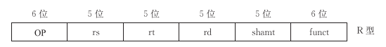
4. R指令格式中各个字段的含义如下：
    1. OP 字段——操作码，指定一条指令的基本操作。
    2.  rs 字段——指定第 1 个源操作数寄存器，最多有 32 个寄存器。 
    3. rt 字段——指定第 2 个源操作数寄存器，最多有 32 个寄存器。
    4.  rd 字段——指定存放操作结果的目的数寄存器，最多有 32 个寄存器。 
    5. shamt 字段——移位值，用于移位指令。
    6.  funct 字段——函数码，指定 R 型指令的特定操作。
5. 在 MIPS 中，访问存储器(取数或存数)需要使用数据传送指令。此时的指令格式，称为 I 型(立即数)指令。
6. 其指令格式如下所示：
    1. 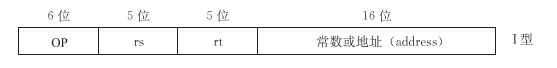
    2. 16 位字段 address(地址)提供取字指令(IW)，存字指令(SW)访问存储器的基值地址码  (也称位移量)

### 4.2.5 扩展操作码技术

对于一个16位操作码来说，分别四位指令和三个四位地址

若拓展，可以使其成为三地址指令，二地址指令，一地址指令，零地址指令

1. 三地址指令：地址位从0000-1110，其余12位分别为三个四地址，共2^4^-1=15个
2. 二地址指令：地址位从1111 0000-1111 1101（前四位为1111，区别其为二地址指令），其余8位为两个四地址，共2^4^-2=14个
3. 一地址指令：其有两个区别位地址，分别为1111 1110,和1111 1111地址位从1111 1110 0000-1111 1111 1110（前八位为1111 1111，和1111 1110区别其为一地址指令），其余4位为1个四地址，共2^5^-1=31个
4. 零地址指令：地址位从1111 1111 1111 0000-1111 1111 1111 1111（前八位为1111 1111 1111，区别其为零地址指令），其余4位为1个四地址。共2^4^=16个

### 4.2.6指令格式举例

内存按字节编址，且一个程序的指令均存放在一条连续的内存空间内，因此每执行一条单字指令，指令地址加一，而对于双字节和三字节指令来说，其必须连续从内存中读出两个字节或三个字节的数据，并将指令地址加二或加三，可见多字长指令不利于提高机器速度

# 4.3 操作数类型

**地址数据:** 地址实际上也是一种形式的数据。（无符号）  
**数值数据:** 计算机中普遍使用的三种类型（定点、浮点和十进制数）的数值数据。  
**字符数据:** 文本数据或字符串，目前广泛使用ASCII码。  
**逻辑数据:** 一个单元中有多位二进制bit项组成，每个bit的值可以是1或0。当数据以这种方式看待时，称为逻辑性数据。

# 4.4 指令和数据的寻址方式

寻址方式分为两类，即指令寻址方式 和数据寻址方式

在冯·诺依曼型结构的 计算机中，内存中指令的寻址与数据的寻址是交替进行的。（指令和数据在相同位置存储）

而哈佛型计算机中指令寻址和 数据寻址是独立进行的（指令和数据在不同位置存储）

## 4.4.1 指令寻址

1. 顺序：PC每次加一，按顺序执行
2. 跳跃：由正在执行的该条指令来决定PC的值；
    1. 作用：可以实现程序转移或构成循环程序（选择和循环），从而能缩短程序长度， 或将某些程序作为公共程序引用（调用函数）
3. 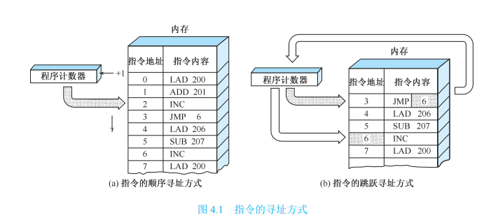

[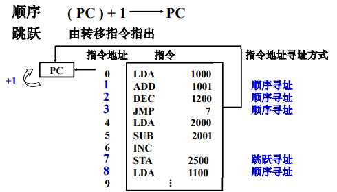](http://fangkaipeng.com/wp-content/uploads/2021/04/wp_editor_md_5ca45a6e7c329c2dbfb7152ec3db3c42.jpg)

## 4.4.2 数据寻址

1. 一般操作数的位置一般三种
    1. 指令直接给出（立即数）（不可改变）
    2. 通用寄存器中（数量有限）
    3. 内存
2. 综述：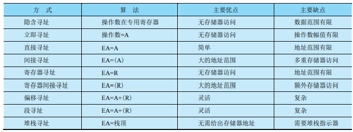

**一般格式：**

[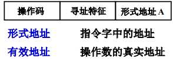](http://fangkaipeng.com/wp-content/uploads/2021/04/wp_editor_md_eb06a1f01d4df9dd33244bd6a49d7203.jpg)

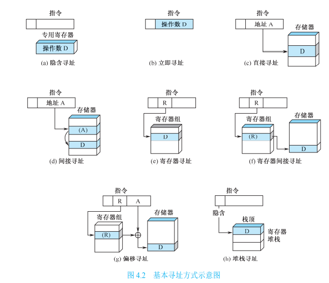

### 1\. 立即寻址

[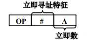](http://fangkaipeng.com/wp-content/uploads/2021/04/wp_editor_md_e0f76edfef4c51b0f788b1343f656b03.jpg)

寻址特征为“#”，表示是立即数寻址，形式地址放的就是操作数，执行时无需访存，立即数以补码的形式表示，A的位数限制了立即数的大小。

### 2\. 直接寻址

[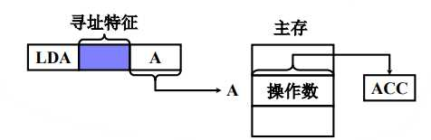](http://fangkaipeng.com/wp-content/uploads/2021/04/wp_editor_md_9c8aef994ab0d92a345c7e2d90408fd2.jpg)

有效地址直接放在形式地址处，不需经过地址变换，执行阶段进行一次访存，A决定了操作数的寻址范围，操作数的地址不易修改（要先找到这条指令，然后将指令上的有效地址修改，较为麻烦）

通常把形式地址A成为直接地址

### 3\. 隐含寻址

[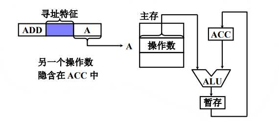](http://fangkaipeng.com/wp-content/uploads/2021/04/wp_editor_md_07cd38107f33c15e49c7ee5cda236e8e.jpg)

其中一个操作数的地址隐含在操作码（寄存器）中，另外一个操作数采用直接寻址的方式给出，指令字中少一个地址字段，可以缩短指令字长。

> ACC（累加器）在加法中存放被加数/和，在减法中存放被减数/差，在乘法中存放乘积高位，除法中存储被除数/余数，ACC存在与ALU中。

### 4\. 间接寻址

[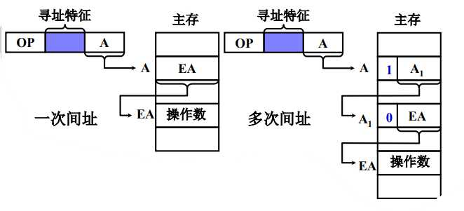](http://fangkaipeng.com/wp-content/uploads/2021/04/wp_editor_md_841a5c5fa7650dcd8d06a2a4bea5c626.jpg)

1. 有效地址由形式地址间接提供,分为一次间址，和多次间址，有效地址在主存中的地址存在A中，在主存中找到有效地址后再次访存找到操作数，故执行指令需要两次访存，优点是可以扩大寻址范围（因为EA可以很长），便于编程（操作数修改方便，只要修改EA即可）。
2. 若寻址特征位 I=0，表示直接寻址，这时有效地址 EA=A；若 I=1，则表示间接寻址， 这时有效地址 EA=(A)。 间接寻址方式是早期计

### 5\. 寄存器寻址

[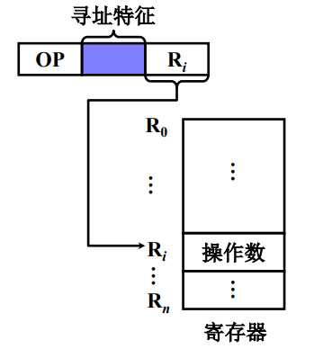](http://fangkaipeng.com/wp-content/uploads/2021/04/wp_editor_md_4def1852aa3364c48989766d9aa17147.jpg)

有效地址为**寄存器编号**，直接访问寄存器即可得到操作数，执行阶段不访存，执行速度快，并且寄存器个数有限，可以缩短指令字长。

### 6\. 寄存器间接寻址

[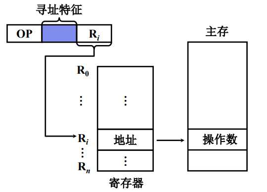](http://fangkaipeng.com/wp-content/uploads/2021/04/wp_editor_md_cb07ada4c0814968a7eff6fb7faf4457.jpg)

有效地址在寄存器中， 操作数在存储器中，执行阶段访存，便于编制循环程序。

## 以下三个为统称偏移寻址

### 7\. 基址寻址

**采用专用寄存器作基址寄存器（隐式寻址）：**  
计算机内专门设有一个基址寄存器BR，用户使用时不用明显指出该基址寄存器，只要由指令的寻址特征位反映出基址寻址即可。  

[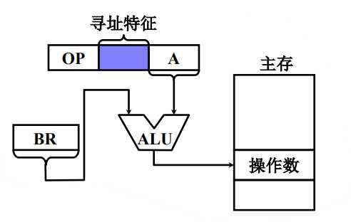](http://fangkaipeng.com/wp-content/uploads/2021/04/wp_editor_md_74c23221073363e4fe71e40b66ed2cbd.jpg)

BR 为基址寄存器，其中存储着基址地址，A为偏移量，实际有效地址为基址+偏移量，可扩大寻址范围，BR 内容由操作系统或管理程序确定，在程序的执行过程中 BR 内容不变，形式地址 A 可变。用户不必考虑自己的程序存在于主存的那个空间区域，有利于多道程序设计。

问：为什么利于多道程序设计？  
用户无需考虑程序存放在主存中的哪里，只要指出哪个寄存器作为某个程序的基址寄存器即可，由操作系统或管理程序自动分配。分别用不同的寄存器表示多道程序的基址寄存器，程序执行时用户不知道程序在主存中的位置，也不可修改基址寄存器的内容，确保系统安全可靠地运行。

**采用通用寄存器作基址寄存器：**  
在一组通用寄存器中，由用户指出哪个寄存器用来作为基址寄存器。  

[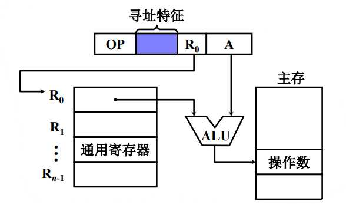](http://fangkaipeng.com/wp-content/uploads/2021/04/wp_editor_md_8500d3b80d702946195146d28a65a9c2.jpg)

由用户指定哪个通用寄存器作为基址寄存器，基址寄存器的内容由操作系统确定，在程序的执行过程中 R0 内容不变，形式地址 A 可变。

### 8\. 变址寻址

[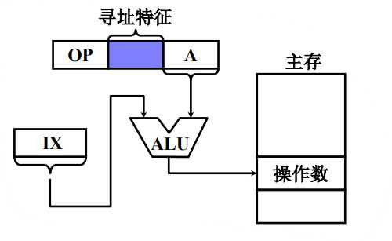](http://fangkaipeng.com/wp-content/uploads/2021/04/wp_editor_md_df7b6def0e1582b81d94eacd8e8f7357.jpg)

A是主存中的一个地址，IX 为变址寄存器（专用，相当于一个偏移量，每次运算后便递增或递减，参与下一轮运算），通用寄存器也可以作为变址寄存器。可扩大寻址范围，IX 的内容由用户给定，在程序的执行过程中 IX 内容可变，形式地址 A 不变，便于处理数组问题。

为何便于处理数组问题？  
答：循环时只要修改寄存器中的内容即可，指令字内存放数组的首地址，只需一个指令就可以完成一次循环操作。如果采用其他的寻址方式，需要不断修改指令字中的形式地址。

变址寻址与基址寻址的区别：

两者正好相反

变址寻址在指令中给出基址，而隐含寄存器中含有自动变化的偏移地址、

基址寻址在指令中给出偏移量，而隐含寄存器中含有基址，可指定基址寄存器

### 9\. 相对寻址

[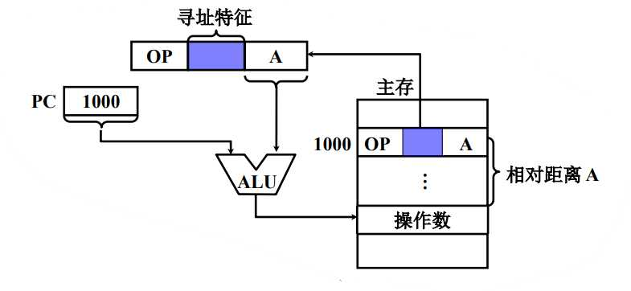](http://fangkaipeng.com/wp-content/uploads/2021/04/wp_editor_md_da93129fc55a7dba82f22c982c4123bb.jpg)

PC存储当前指令的地址，A 是相对于当前指令的位移量（可正可负，补码），通过PC与偏移地址进行运算，找出下一条待执行的指令，A 的位数决定操作数的寻址范围，适合程序浮动，广泛用于转移指令。

> 浮动程序技术是指在多道程序设计的系统中，要求每道程序存放在主存的任何区域都能正确执行，甚至在执行过程中，当程序的存放区域被改变，也要求其执行不受影响。也就是说，程序可以随机地从主存的一个区域移动到另一个区域，程序被移动后仍丝毫不影响它的执行。

问：跟随指令改变地址，如何保证操作数的准确性？  
偏移量A是不停变化的，随着PC的跳转，A也相应加减，使得PC+A指向的数据不变。

### 10\. 堆栈寻址

[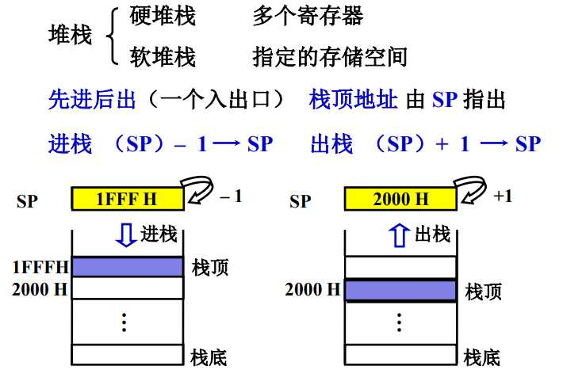](http://fangkaipeng.com/wp-content/uploads/2021/04/wp_editor_md_ef250d151a7d6eb04770247600a6c167.jpg)

若用 SP 表示堆栈指示器，指向栈顶，Msp 表示堆栈指示器指定的存储器的单元，A 表示通用寄存器  栈底地址大，栈顶地址小，但sp与栈地址相等时，其栈满
入栈操作描述为：(A)−\>Msp,(SP−1)−\>SP，表示先将A中的数据存入到栈顶的存储单元中，然后将SP指针向上移动（堆栈默认栈底地址高，栈顶地址底）  
出栈操作描述为：(SP+1)−\>SP,(Msp)−\>A，表示先将指针向下移动一位，然后将其中的数据放入寄存器A中.

### 11.段寻址

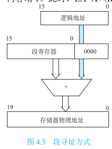

段寄存器中存储了基址，逻辑地址存储了偏移量，寻址时，基址左移逻辑地址的位数再加上偏移地址（相当于对两个地址进行拼接）

本质其为基址寻址，其优点:范围更大，由于基址寻址段寄存器与偏移地址直接相加，而段寻址时先将基址左移再相加，相当于其地址长度较基址寻址的长度增加偏移地址的位数。

# 4.5 典型指令

## 4.5.1 指令的分类

- 数据传送指令：树妖实现主存和寄存器之间，或者寄存器和寄存器之间的数据传送
    - 一般传送指令：   MOV AX，BX
    - 数据交换指令：   XCHG
    - 堆栈操作指令：   PUSH，POP
    
- 运算类指令
    - 算术运算指令： 定点和浮点的算术运算，大型机有向量运算指令
    - 逻辑运算指令：无符号数的位操作，代码的转换、判断及运算
    
- 程序控制类指令
    - 程序控制类指令用于控制程序的执行方向，并使程序具有测试、分析与判断的能力。
    
- 输入和输出指令、字符串处理指令、特权指令、其他指令

    **基本指令操作**

    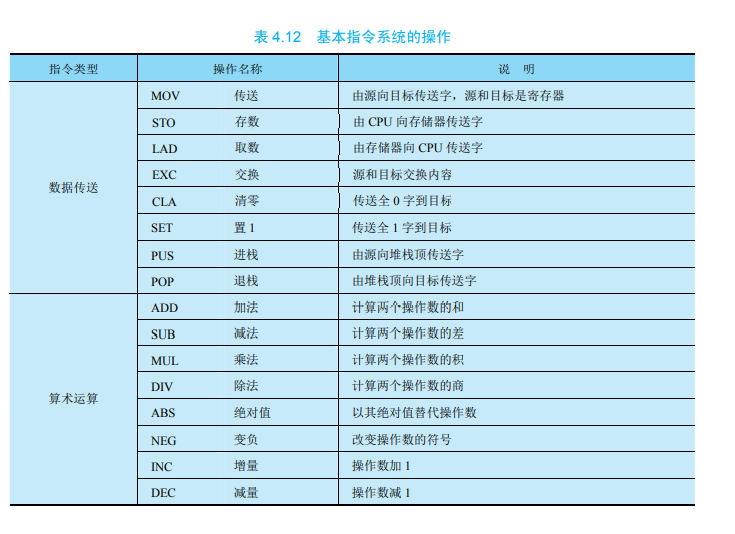

    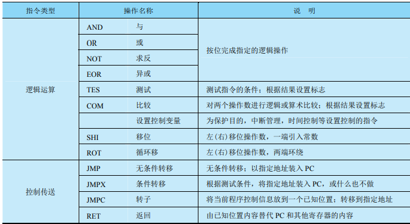

    

## 4.5.2 基本指令系统的操作

20%和80%规律：CISC中大约有20%的指令使用频率高，占据了80%的处理机时间，而有80%的不常用指令只占用处理机的20%时间。

VLSI工艺要求规整性，而大量复杂指令控制逻辑极其不规整，给VLSI工艺造成了很大的困难。

现在用微程序实现复杂指令与用简单指令组成的子程序相比，没有多大的区别。因为现在控制存储器和主存的速度差缩小。

CISC中，通过增强指令系统的功能，简化了软件，增加了硬件的复杂程度。然而指令复杂了，指令的执行时间必然加长，从而使整个系统的执行时间反而增加，因而在计算机体系结构设计中，软硬件的功能分配必须恰当

## 4.5.3 RISC

三大最大特点：

- 选取使用频率最高的一些简单指令，指令条数少；
- 指令长度固定，指令格式种类少，寻址方式种类少；
- 只有取数/存数两条指令访问存储器，其余指令的操作都在寄存器中进行。