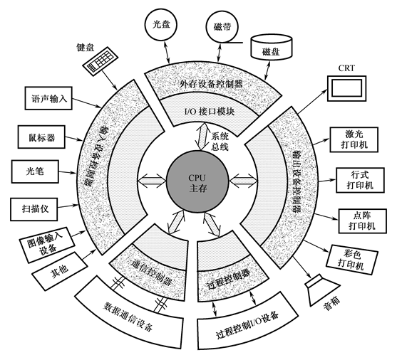
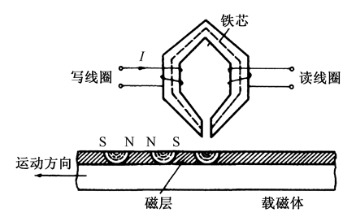
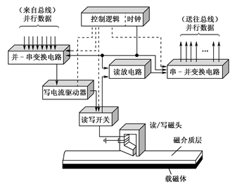
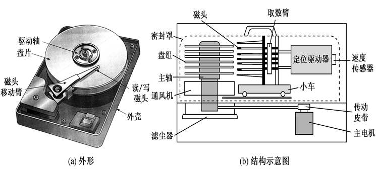
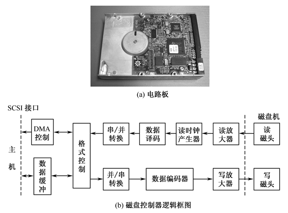
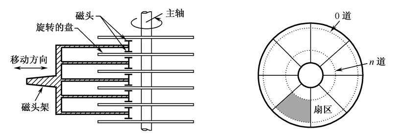
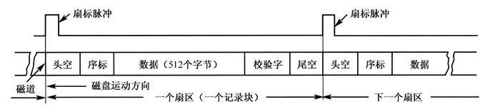
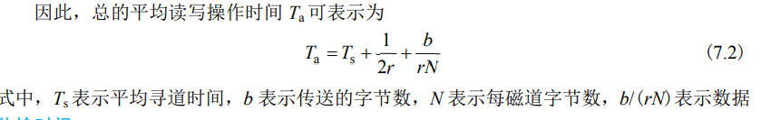
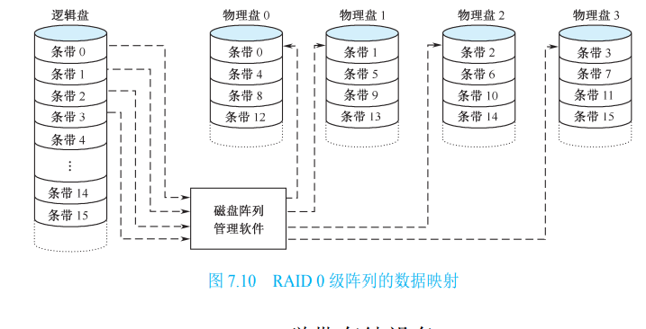

# 7.1 外围设备概

## 7.1.1 外围设备的一般功能

外围设备的功能是在计算机和其他机器之间，以及计算机与用户之间提供联系。事实上，除了 CPU 和主存外，计算机 系统的每一部分都可作为一个外围设备来看待

## 7.1.2 外围设备（磁盘）基本组成

存储介质：它具有保存信息的物理特征。例如磁盘就是一个存储介质的例子，它是用记录在盘上的磁化元表示信息。（以何种物质存储）

驱动装置：它用于移动存储介质。例如，磁盘设备中，驱动装置用于转动磁盘并进行定位。（如何存储的修改）

控制电路：它向存储介质发送数据或从存储介质接受数据。例如，磁盘读出时，控制电路把盘上用磁化元形式表示的信息转换成计算机所需要的电信号，并把这些信号用电缆送给计算机主机。（如何进行信息的传送）

## 7.1.3 外围设备的分类

一个计算机系统配备什么样的外围设备，是根据实际需要来决定的。如下图所示的计算机的五大类外围设备，这只是一个典型化了的计算机环境。

# 7.2 磁盘存储设备

## 7.2.1 磁记录原理

### 1\. 磁表面存储器概念

计算机的外存储器又称磁表面存储设备。所谓磁表面存储，是用某些磁性材料薄薄地涂在金属铝或塑料表面作载磁体来存储信息。磁盘存储器、磁带存储器均属于磁表面存储器。磁表面存储器的优点：

①存储容量大，位价格低；

②记录介质可以重复使用；

③记录信息可以长期保存而不丢失，甚至可以脱机存档；

④非破坏性读出，读出时不需要再生信息。

当然，磁表面存储器也有缺点，主要是存取速度较慢，机械结构复杂，

对工作环境要求较高。

磁表面存储器由于存储容量大，位成本低，在计算机系统中作为辅助大容量存储器使用，用以存放系统软件、大型文件、数据库等大量程序与数据信息。

### 2\. 磁表面存储器的读写原理

写操作：当写线圈中通过一定方向的脉冲电流时，铁芯内就产生一定方向的磁通。

读操作：当磁头经过载磁体的磁化元时，由于磁头铁芯是良好的导磁材料，磁化元的磁力线很容易通过磁头而形成闭合磁通回路。不同极性的磁化元在铁芯里的方向是不同的。

通过电-磁变换，利用磁头写线圈中的脉冲电流，可把一位二进制代码转换成载磁体存储元的不同剩磁状态；反之，通过磁-电变换，利用磁头读出线圈，可将由存储元的不同剩磁状态表示的二进制代码转换成电信号输出。这就是磁表面存储器存取信息的原理。

磁层上的存储元被磁化后，它可以供多次读出而不被破坏。当不需要这批信息时，可通过磁头把磁层上所记录的信息全部抹去，称之为写“0”。通常，写入和读出是合用一个磁头，故称之为读写磁头。每个读写磁头对应着一个信息记录磁道。

## 7.2.2 磁盘的工作过程和分类

### 1\. 磁盘的工作过程

写入时，将计算机并行送来的数据送至并—串变换寄存器，变为串行数据，然后一位一位地由写电流驱动器作功率放大并加到写磁头线圈上产生电流，从而在盘片磁层上形成按位的磁化存储元。读出时，当记录介质相对磁头运动时，位磁化存储元形成的空间磁场在读磁头线圈中产生感应电势，此读出信息经放大检测就可还原成原来存入的数据。由于数据是一位一位串行读出的，故要送至串—并变换寄存器变换为并行数据，再并行送至计算机。

### 2\. 分类

硬磁盘按盘片结构，分成可换盘片式与固定盘片式两种；磁头也分为可移动磁头和固定磁头两种。

- 可移动磁头固定盘片的磁盘机的特点是一片或一组盘片固定在主轴上，盘片不可更换。盘片每面只有一个磁头，存取数据时磁头沿盘面径向移动。
- 可移动磁头可换盘片的磁盘机：盘片可以更换，磁头可沿盘面径向移动。优点是盘片可以脱机保存，同种型号的盘片具有互换性。
  
- 固定磁头磁盘机特点是磁头位置固定，磁盘的每一个磁道对应一个磁头，盘片不可更换。优点是存取速度快，省去磁头找道时间，缺点是结构复杂。
  

温彻斯特磁盘机简称温盘，是一种采用先进技术研制的可移动磁头固定盘片的磁盘机。它是一种密封组合式的硬磁盘，即磁头、盘片、电机等驱动部件乃至读写电路等组装成一个不可随意拆卸的整体。工作时，高速旋转在盘面上形成的气垫将磁头平稳浮起。优点是防尘性能好，可靠性高，对使用环境要求不高，成为最有代表性的硬磁盘存储器。而普通的硬磁盘要求具有超净环境，只能用于大型计算机中。

## 7.2.3磁盘驱动器和控制器

磁盘驱动器是一种精密的电子和机械装置，因此各部件的加工安装有严格的技术要求。对温盘驱动器，还要求在超净环境下组装。各类磁盘驱动器的具体结构虽然有差别，但基本结构相同，主要由定位驱动系统、主轴系统和数据转换系统组成。如下图是磁盘驱动器外形和结构示意图。

磁盘控制器是主机与磁盘驱动器之间的接口，电路板实物见下图(a)所示。由于磁盘存储器是高速外存设备，故与主机之间采用成批交换数据方式。作为主机与驱动器之间的控制器，它需要有两个方面的接口：一个是与主机的接口，控制外存与主机总线之间交换数据；另一个是与设备的接口，根据主机命令控制设备的操作。前者称为系统级接口，后者称为设备级接口。

主机与磁盘驱动器交换数据的控制逻辑见下图(b)。磁盘上的信息经读磁头读出以后送读出放大器，然后进行数据与时钟的分离，再进行串-并变换、格式变换，最后送入数据缓冲器，经DMA(直接存储器传送)控制将数据传送到主机总线。

## 7.2.4 磁盘上信息的分布

盘片的上下两面都能记录信息，通常把磁盘片表面称为记录面。记录面上一系列同心圆称为磁道。每个盘片表面通常有几百到几千个甚至上万个磁道，每个磁道又分为若干个扇区，如下一页图所示。从图中看出，外面扇区比里面扇区面积要大。磁盘上的这种磁道和扇区的排列称为格式。

**数据在磁盘上的记录格式：**

磁道的编址是从外向内依次编号，最外一个同心圆称为 0 磁道，最里面的一个同心圆 称为 n 磁道，n 磁道里面的圆面积并不用来记录信息。扇区的编号有多种方法，可以连续编 号，也可间隔编号。磁盘记录面经这样编址后，就可用 n 磁道 m 扇区的磁盘地址找到实际 磁盘上与之相对应的记录区。除了磁道号和扇区号，还有记录面的面号（第几个磁盘的上/下面），以说明本次处理 是在哪一个记录面上。例如，对活动头磁盘组来说，磁盘地址是由记录面号(也称磁头号)、 磁道号和扇区号三部分组成的

在磁道上，信息是按区存放的，每个区中存放一定数量的字或字节，各个区存放的字 或字节数是相同的。为进行读/写操作，要求定出磁道的起始位置，这个起始位置称为索引。 索引标志在传感器检索下可产生脉冲信号，再通过磁盘控制器处理，便可定出磁道起始  位置

每个扇区开始时由磁盘控制器产生一个扇标脉冲，它的出现标志一个扇区的开始。空白段用来留出一定的时间作为磁盘控制器的读写准备时间，序标用来作为磁盘控制器的同步定时信号，数据往往是固定长度，校验字用来校验磁盘读出的数据是否准确。

### 7.2.5 磁盘存储器的技术指标

- 存储密度：存储密度分道密度、位密度和面密度。
    - 道密度：沿磁盘半径方向单位长度上的磁道数，单位为道/英寸。
    - 位密度：磁道单位长度上能记录的二进制代码位数，单位为位/英寸。
    - 面密度：位密度和道密度的乘积，单位为位/平方英寸。
- 存储容量：一个磁盘存储器所能存储的字节总数，称为磁盘存储器的存储容量。容量有格式化容量和非格式化容量，60%~70%。的字节总数，称为磁盘存储器的存储容量。存储 容量有格式化容量和非格式化容量之分。格式化容量是指按照某种特定的记录格式所能存 储信息的总量，也就是用户可以真正使用的容量。非格式化容量是磁记录表面可以利用的 磁化单元总数
- 存取时间：存取时间是指从发出读写命令后，磁头从某一起始位置移动至新的记录位置，到开始从盘片表面读出或写入信息加上传送数据所需要的时间。取决于以下三个因素决定：

    - 一个是将磁头定位至所要求的磁道上所需的时间，称为找道时间，寻道时间，定位时间；
    - 第二个是找道完成后至磁道上需要访问的信息到达磁头下的时间，称为等待时间，这两个时间都是随机变化的，因此往往使用平均值来表示，平均找道时间是最大找道时间与最小找道时间的平均值。平均等待时间和磁盘转速有关，它用磁盘旋转一周所需时间的一半来表示。
    - 第三个是数据传送时间。
    - 平均存取时间 存取(访问)时间是从读/写指令发出到开始第一笔数据读/写时所用的 平均时间，包括寻道时间、等待时间及相关的内务操作时间。内务操作时间一般很短(一般 在 0.2ms 左右)，可忽略不计。故平均访问时间近似等于平均寻道时间+平均等待时间，即 平均寻址时间
    - 
- 数据传输率：磁盘存储器在单位时间内向主机传送数据的字节数，叫数据传输率，传输率与存储设备和主机接口逻辑有关。从主机接口逻辑考虑，应有足够快的传送速度向设备接收/发送信息,一般都能满足要求。从存储设备考虑，假设磁盘旋转速度为n转/秒，每条磁道容量为N个字节，则数据传输率：Dr=nN(字节/秒)，或：Dr=D·v(字节/秒)，v为线速度，D为位密度。
    - 外部数据传输率：现代磁盘设备通常会配置磁盘 cache，单位时间内从硬盘 cache 向主机传送的数据信息量，与磁盘的接口类型和磁盘缓存大小有关。
    - 内部数据传输率：在磁盘存储器盘片上读写数据的速率，即磁头找到要访问的位置后，单位时间读/写的字节数，等于每个磁 道上的字节数/磁盘旋转一周的时间。

- 可以在磁盘上添加一个cache，增加数据的快速查找

**【例1】**磁盘组有6片磁盘，每片有两个记录面，最上最下两个面不用。存储区域内径22cm，外径33cm，道密度为40道/cm，内层位密度400位/cm，转速6000转/分。假定系统最多允许配置4台磁盘机，每个磁道有16个扇区。问：

(1)共有多少柱面?

(2)盘组总存储容量是多少?

(3)数据传输率多少?

(4)采用定长数据块记录格式，直接寻址的最小单位是什么?寻址命令中如何表示磁盘地址?

(5)如果某文件长度超过一个磁道的容量，应将它记录在同一个存储面上，还是记录在同一个柱面上?

**解：**

(1)有效存储区域=16.5-11=5.5(cm) 因为道密度=40道/cm，所以40×55=220道，即220个圆柱面。

(2)内层磁道周长为2πR=2×3.14×11=69.08(cm)

每道信息量=400位/cm×69.08cm=27632位=3454B

每面信息量=3454B×220=759880B

盘组总容量=759880B×10=7598800B

(3)磁盘数据传输率Dr=rN， N为每条磁道容量，N=3454B，r为磁盘转速，r=6000转/60秒=100转/秒，Dr=rN=100×3454B=345400B/s

(4)采用定长数据块格式，直接寻址的最小单位是一个记录块(一个扇区)，每个记录块记录固定字节数目的信息，在定长记录的数据块中，活动头磁盘组的编址方式可用如下格式：

此地址格式表示假如有4台磁盘（2位），每台有10个记录面/盘面（4位），每面有220个磁道（8位），每道假定有16个扇区（4位）。

(5) 如果某文件长度超过一个磁道的容量，应将它记录在同一个柱面上，因不需要重新找道，数据读/写速度快。

### 7.2.7 磁盘阵列 RAID

1. RAID 最早称为廉价冗余磁盘阵列，后来改为独立冗余磁盘阵列，它是用多台磁盘存储 器组成的大容量外存系统。其构造基础是利用数据分块技术和并行处理技术，在多个磁盘 上交错存放数据，使之可以并行存取。在 RAID 控制器的组织管理下，可实现数据的并行 存储、交叉存储、单独存储。由于阵列中的一部分磁盘存有冗余信息，一旦系统中某一磁盘 失效，可以利用冗余信息重建用户信息
2. 工业上制定了一个称为 RAID 的标准，它分为 7 级(RAID 0～RAID 6)。这些级别不是 表示层次关系，而是指出了不同存储容量、可靠性、数据传输能力、I/O 请求速率等方面的 应用需求
3. 对 RAID 0，用户和系统数据分布在阵列中的所有磁盘上。与单个大容量磁盘相比，其 优点是：如果两个 I/O 请求正在等待两个不同的数据块，则被请求的块有可能在不同的盘上。 因此，两个请求能够并行发出，减少了 I/O 排队的时间。
4. 表示使用磁盘阵列管理软件在逻辑磁盘和物理磁盘间进行映射。此软件可在磁 盘子系统或主机上运行。 所有的用户数据和系统数据都被看成是逻辑条带，存储在一个逻辑磁盘上。而实际物 理磁盘也以条带形式划分，每个条带是一些物理的块、扇区或其他单位。数据条带以轮转 方式映射到连续的阵列磁盘中。每个磁盘映射一条带，一组逻辑连续条带称为条带集。在 一个有 n 个磁盘的阵列中，第 1 组的 n 个逻辑条带依次物理地存储在 n 个磁盘的第 1 个条带上，构成第 1 个条带集；第 2 组的 n 个逻辑条带分布在每个磁盘的第 2 个条带上；依次 类推。这种布局的优点是，如果单个 I/O 请求由多个逻辑相邻的条带组成，则对多达 n 个条 带的请求可以并行处理，从而大大减少了 I/O 的传输时间
5. 逻辑盘相当于存储物理盘的目录，其中每一个条带对应物理盘中的一个条带，其可以并行进行对多个物理盘同时进行存储；
6. 磁带：线性存储，顺序访问，查找慢
7. 光盘：所有的只读型光盘系统都基于一个共同原理，即光盘上的信息以坑点形式分布，有坑 点表示为“1”，无坑点表示为“0”，一系列的坑点(存储元)形成信息记录道，光盘的记录信息以凹坑方式永久性存储。读出时，当激光束聚焦点照射在凹坑上时将 发生衍射，反射率低；而聚焦点照射在凸面上时大部分光将返回。根据反射光的光强变化 并进行光-电转换，即可读出记录信息。

# 7.5 显示设备

## 7.5.1 显示设备的分类和有关概念

器件：CRT、LCD、等离子体

显示内容：字符、图象

主观图像：在计算机内存储的图像，可根据内存中的点阵图直接到显示屏上，如电脑中下载的字体

客观图像：物理世界中客观存在的东西，通过相机拍摄的照片，将照片转化为点阵图后在将其进行

CRT中又可以分类

扫描方式：光栅扫描和随机扫描

分辨率：高分辨率和低分辨率

显示颜色：单色和彩色

显示屏幕大小：14、15、17、19等第七章 外存与I/O设备