# I/O系统概述

## I/O系统组成

- I/O软件
  
    - 包括驱动程序、用户程序、管理程序、升级补丁等
    - 采用I/O指令和通道指令实现CPU和I/O设备的信息交换
- I/O硬件
  
    - I/O设备、设备控制器、接口和I/O总线

## I/O 设备分类

IO设备被当做一种特殊的文件

**根据使用特性分类**

- 人机交互式设备：鼠标，打印机
- 网络通信设备：网络接口，调制解调器
- 存储设备：外存，辅存

**根据传输速率分类**

- 低速设备：键盘，鼠标
  
- 中速设备：行式打印机，激光打印机
  
- 高速设备：磁盘机，磁带机
  

**根据信息交换单位分类**

- 块设备
  
    - 传输速率较高，可寻址（即可随机读/写任一块）
      
    - 常采用[DMA](https://so.csdn.net/so/search?q=DMA&spm=1001.2101.3001.7020)方式
      
    - 数据传输的基本单位是“块”，如磁盘
    
- 字符设备
  
    - 传输速率较慢，不可寻址
    - 常采用中断驱动方式
    - 数据传输的基本单位是字符，如鼠标、键盘

**根据共享属性/设备分配方式分类**

- 共享设备
  
    - 在一段时间内允许多个进程同时访问的设备（并发访问）
      
    - 一般采用动态分配
      
    - 分配共享设备不会引起进程死锁
      
    - 共享设备必须是可随机访问和可寻址的设备【我想这个要求是从效率考虑的。假设磁盘只能顺序访问，那么同时打开磁盘上的两个文件，这切换的代价也太大了】
    
- 独占设备（属于临界资源）
  
    - 一段时间内只允许一个用户(进程)访问的设备
    - 可采用动态分配和静态分配，一般采用静态分配
    - 分配独占设备可能引起进程死锁（动态分配）
- 虚拟设备
  
    - 以SPOOLing方式使用外部设备，通过虚拟技术将一台独占设备变换为若干台逻辑设备，供若干个用户(进程)同时使用

## 常见IO设备

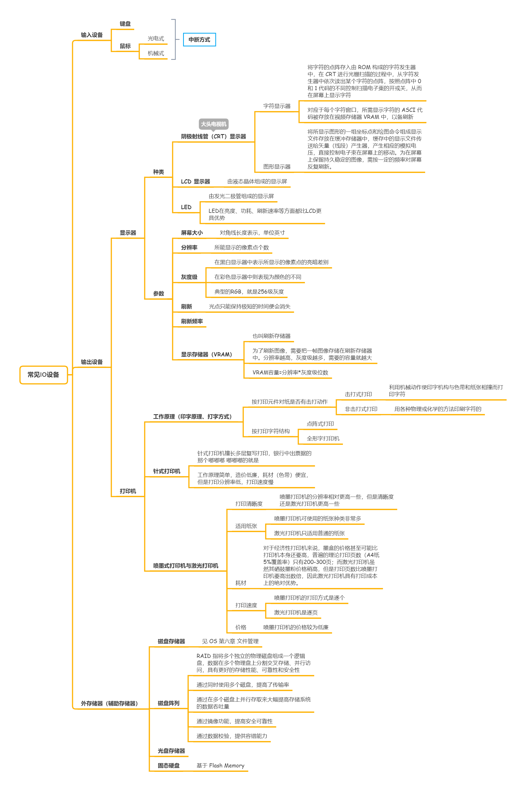

### 输入设备

- 键盘
  
- 鼠标
  
    - 光电式
    - 机械式

### 输出设备

**显示器**

- 种类
  
    - 阴极射线管（CRT）显示器
      
        - 字符显示器
          
            - 将字符的点阵存入由 ROM 构成的字符发生器中，在 CRT 进行光栅扫描的过程中，从字符发生器中依次读出某个字符的点阵，按照点阵中 0 和 1 代码的不同控制扫描电子東的开或关，从而在屏幕上显示字符
            - 对应于每个字符窗口，所需显示字符的 ASCI 代码被存放在视频存储器 VRAM 中，以备刷新
        - 图形显示器
          
            - 将所显示图形的一组坐标点和绘图命令组成显示文件存放在缓冲存储器中，缓存中的显示文件传送给矢量（线段）产生器，产生相应的模拟电压，直接控制电子束在屏幕上的移动。为在屏幕上保留持久稳定的图像，需按一定的频率对屏幕反复刷新。
    - LCD 显示器
      
        - 由液态晶体组成的显示屏
    - LED
      
        - 由发光二极管组成的显示屏
        - LED在亮度、功耗、刷新速率等方面都比LCD更具优势
- 参数
  
    - 屏幕大小
      
        - 对角线长度表示，单位英寸
    - 分辨率
      
        - 所能显示的像素点个数
    - 灰度级
      
        - 在黑白显示器中表示所显示的像素点的亮暗差别
        - 在彩色显示器中则表现为颜色的不同
        - 典型的RGB，就是256级灰度
    - 刷新
      
        - 光点只能保持极短的时间便会消失
    - 刷新频率
      
    - 显示存储器（VRAM）
      
        - 也叫刷新存储器
        - 为了刷新图像，需要把一帧图像存储在刷新存储器中。分辨率越高，灰度级越多，需要的容量就越大
        - VRAM容量=分辨率\*灰度级位数

-

**打印机**

- 工作原理（印字原理、打字方式）
  
    - 按打印元件对纸是否有击打动作
      
        - 击打式打印
          
            - 利用机械动作使印字机构与色带和纸张相撞而打印字符
        - 非击打式打印
          
            - 用各种物理或化学的方法印刷字符的
    - 按打印字符结构
      
        - 点阵式打印
        - 全形字打印机
- 针式打印机
  
    - 针式打印机擅长多层复写打印，银行中出票据的那个嘟嘟嘟 嘟嘟嘟的就是
    - 工作原理简单，造价低廉，耗材（色带）便宜，但是打印分辨率低，打印速度慢
- 喷墨式打印机与激光打印机
  
    - 打印清晰度
      
        - 喷墨打印机的分辨率相对更高一些，但是清晰度还是激光打印机更高一些
    - 适用纸张
      
        - 喷墨打印机可使用的纸张种类非常多
        - 激光打印机只适用普通的纸张
    - 耗材
      
        - 对于经济性打印机来说，墨盒的价格甚至可能比打印机本身还要高，普遍的理论打印页数（A4纸5%覆盖率）只有200-300页；而激光打印机虽然其硒鼓墨粉价格稍高，但是打印页数比喷墨打印机要高出数倍，因此激光打印机具有打印成本上的绝对优势。
    - 打印速度
      
        - 喷墨打印机的打印方式是逐个
        - 激光打印机是逐页
    - 价格
      
        - 喷墨打印机的价格较为低廉

### 外存储器（辅助存储器）

- 磁盘存储器
  
    - 见 OS 第六章 文件管理
- 磁盘阵列
  
    - RAID 指将多个独立的物理磁盘组成一个逻辑盘，数据在多个物理盘上分割交叉存储、并行访问，具有更好的存储性能、可靠性和安全性
    - 通过同时使用多个磁盘，提高了传输率
    - 通过在多个磁盘上并行存取来大幅提高存储系统的数据吞吐量
    - 通过镜像功能，提高安全可靠性
    - 通过数据校验，提供容错能力
- 光盘存储器
  
- 固态硬盘
  
    - 基于 Flash Memory

# I/O接口

## 设备控制器（I/O控制器）

设备控制器是计算机中的一个实体， 其主要职责是控制一个或多个 I/O 设备， 以实现 I/O 设备和计算机之间的数据交换。 它是 CPU 与 I/O 设备之间的接口， 它接收从 CPU 发来的命令，并去控制 I/O 设备工作。

**设备控制器的（组成）基本功能**

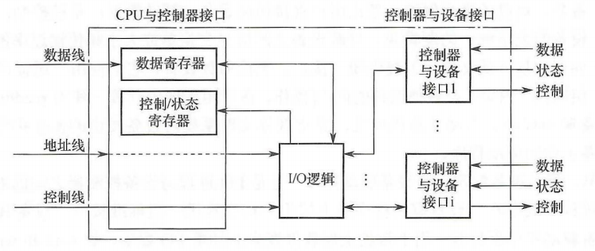

- **控制寄存器：接收和识别 CPU 或通道发出的命令**
  
    > 磁盘控制器可以接收 CPU 发来的 Read、 Write、 Format 等 15 条不同的命令
    
- **数据寄存器：实现主机和外设的数据交换**
  
    > \*\*CPU 与控制器之间：\*\*通过数据总线，由 CPU 并行地把数据写入控制器，或从控制器中并行地读出数据（如果是 DMA 或通道方式的话，那就是“主存”与控制器）
    >
    > \*\*控制器与设备之间：\*\*设备将数据输入到控制器，或从控制器传送给设备
    
- **状态寄存器：标识和报告设备的状态**
  
    > 记录 IO 设备的状态，例如，仅当该设备处于发送就绪状态时，CPU才能启动控制器从设备中读出数据
    
- **地址译码器：地址识别和设备选择**
  
    > 每个设备控制器的寄存器都有唯一的地址，详见计组
    >
    > \*\*内存映象I/O：\*\*控制器中的寄存器与内存地址统编址，可以采用对内存进行操作的指令来对控制器进行操作
    >
    > \*\*寄存器独立编址：\*\*控制器中的寄存器使用单独的地址，需要设置专门的指令来操作控制器
    
- **数据缓冲**，使用缓冲器缓和CPU与IO设备的速度差异
  
- **信号格式的转换**，实现电平转换、串/并转换、模/数转换等
  
- **差错控制**，若传送中出现了错误，向 CPU 报告，CPU 将重新进行一次传送
  

## I/O 接口的类型

**按数据传送方式**

- 并行接口
- 串行接口

**按I/O控制方式**

- 程序查询接口
- ……

**按功能选择的灵活性**

- 可编程接口
- 不可编程接口

## I/O端口

**概念与组成**

I/O端口指设备控制器中可被CPU直接访问的寄存器

- 数据端口（数据缓冲寄存器）:接口内在外设和总线间交换数据 的缓冲寄存器

- 状态端口（状态寄存器）:接口内向 CPU 报告 I/O 设备的工作状态的寄存器

- 控制端口（控制寄存器）:接收来自 CPU 等主控设备的控制命令的寄存器称为命令端口

    传输过程：

    1. 首先我们看看输入/输出设备同 CPU 交换数据的一般过程。
    2.  如果是输入过程，一般需要以下三个步骤：
        1.  (1)CPU 把一个地址值放在地址总线上，选择某一输入设备；
        2.  (2)CPU 等候输入设备的数据成为有效；
        3.  (3)CPU 从数据总线读入数据，并放在一个相应的寄存器中。 
    3. 如果是输出过程，一般需要以下三个步骤：
        1.  (1)CPU 把一个地址值放在地址总线上，选择一个输出设备；
        2.  (2)CPU 把数据放在数据总线上；
        3.  (3)输出设备认为数据有效，从而把数据取走

    ### I/O 接口与外设间的数据传送方式

    根据外设工作速度的不同，I/O 接口与外设间的数据传送方式有以下三种

    1. 速度极慢或简单的外围设备：无条件传送方式
        1. 对这类设备，如机械开关、发光二极管等，在任何一次数据交换之前，外设无需进行 准备操作。换句话说，对机械开关来讲，可以认为输入的数据一直有效，因为机械开关的 动作相对主机的速度来讲是非常慢的
        2. 对于简单的慢速设备， 接口与外设之间只需要数据信号线，无需握手联络信号线，接口只需实现数据缓冲和寻址 功能，故称为无条件传送方式或零线握手联络方式。
    2. 慢速或中速的外围设备：应答方式(异步传送方式)
        1. 由于这类设备的速度和主机的速度并不在一个数量级，或者由于设备(如键盘)本身是 在不规则时间间隔下操作的，因此，主机与这类设备之间的数据交换通常采用异步定时方 式，接口与外设之间在数据传送信号线之外安排若干条握手(联络、挂钩)信号线，用以在 收发双方之间传递控制信息，指明何时能够交换数据。
        2. 最常见的双线握手方式设置 两条联络握手信号线：一条发方向收方发出的选通信号或请求信号，指明数据是否有效； 一条收方向发方发出的应答信号，指明数据是否已经被取走
    3. 高速的外围设备：同步传送方式
        1. 对于中等以上数据传送速率并按规则间隔工作的外部设备，接口以某一确定的时钟速 率和外设交换信息。因此，这种方式称为同步定时方式。一旦接口和外设确认同步，它们 之间的数据交换便靠时钟脉冲控制来进行。例如，若外设是一条传送 2400 位/秒的同步通信 线路，那么接口即每隔 1/2400 秒执行一次串行的输入/输出操作。

**编址方式**

- 统一编址
  
    - 又称存储器映射方式，即把 I/O 端口当作存储器的单元进行地址分配
      
    - 不需要特殊的 I/O 指令，使用访存的指令即可
      
    - 优点
      
        - 端口拥有较大的编址空间
        - 访问 I/O 的操作更加灵活、方便
    - 缺点
      
        - 端口占用了存储器地址，内存容量变小
          
        - 执行速度教慢
          
            这个应该是访存指令比较慢的问题
    
- 独立编址
  
    - 又称IO映射方式，IO端口的地址空间与主存地址空间是两个独立的地址空间
      
    - 需要设置专门的IO指令来访问IO端口
      
    - 优点
      
        - IO指令与存储器指令区别明显，程序编制清晰
    - 缺点
      
        - I/O指令少
        - 需要 CPU 提供存储器读/写、I/O 设备读/写两组控制信号，增加了控制的复杂性

# [中断](https://so.csdn.net/so/search?q=%E4%B8%AD%E6%96%AD&spm=1001.2101.3001.7020)

## 基本概念

程序中断是指在计算机执行现行程序的过程中,出现某些急需处理的异常情况或特殊请求, CPU暂时中止现行程序,而转去对这些异常情况或特殊请求进行处理,在处理完毕后CPU又自动返回到现行程序的断点处,继续执行原程序。

这里给的定义是外中断，是狭义上的中断，也是我们通常指的中断，因为内中断并不一定能够回到程序的断点处继续执行。

**中断的分类**

中断请求一般来自于CPU以外的事件，异常一般发生在CPU内部

- 内中断（异常）
  
    - 陷入 trap
      
        - 由陷入指令（又叫trap指令、自陷指令、访管指令）引起的
    - 故障 fault
      
        - 硬件故障（优先级最高的中断），可能被修复，修复故障后，内核会把CPU使用权还给应用程序。例如：缺页故障
    - 终止 abort
      
        - 软件中断，一般由致命错误引起，不可恢复，内核会终止改程序，例如：除数为0，非法使用特权指令，浮点数上溢（注意下溢做机器零处理，不需要中断来处理）
- 外中断（中断）
  
    通常说中断，仅指狭义上的中断，也就是硬中断，（2017年统考题也是这样认为的）
    
    - 人工干预强制停止一个进程
    - 时钟中断
    - I/O中断请求

**可屏蔽中断与不可屏蔽中断**

- 可屏蔽和不可屏蔽中断都属于外中断，因为内中断是无法控制的，也就不存在能否屏蔽一说
  
- INTR Interrupt Require
  
    - 对于可屏蔽中断，除了受本身的屏蔽位的控制外，还都要受一个总的控制，即CPU标志寄存器中的中断允许标志位IF(Interrupt Flag)的控制，IF位为1，可以得到CPU的响应，否则，得不到响应。
- NMI Nonmaskable Interrupt
  
    - 不可屏蔽中断就是CPU必须响应的外中断，它的中断类型码固定为 2 ，所以由它引发的中断过程中没有取得中断类型码的那一步。不过后面三步还是一样的。

**开中断与关中断**

- 关中断是为了保护一些不能中途停止执行的程序而设计的，例如中断处理时CPU恢复现场的过程是不允许被其他的程序打扰的，此时就要启动关中断，不再相应其他的请求。当现场恢复完毕后，CPU启动开中断。
- 关中断期间，不响应可屏蔽中断

## 中断请求/响应过程

- 中断请求
  
    - 中断源向 CPU 发送中断信号
- 中断判优
  
    - 多个 IO 设备在下一个总线周期到来之前，发出了中断请求，则需要进行判优，使用硬件排队器或中断查询程序
      
    - 一般是有中断固定级别的
      
        - 硬件故障优先级最高
        - DMA 请求高于一般总线请求
        - 高速设备优于低速设备
        - 输入设备优于输出设备
        - 实时设备优于普通设备
        - ……
- 响应中断的条件
  
    - CPU 允许中断及开中断
    - 一条指令执行完毕，且没有更紧迫的任务

### 中断处理过程

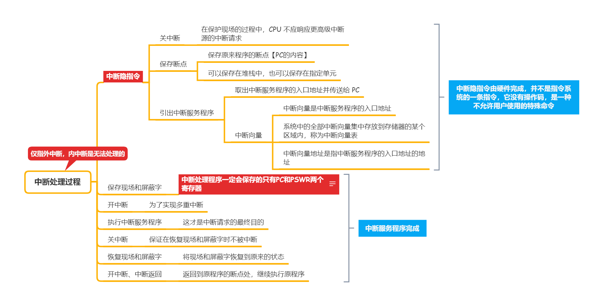

- 中断隐指令
  
    - 关中断
      
        - 在保护现场的过程中，CPU 不应响应更高级中断源的中断请求
    - 保存断点
      
        - 保存原来程序的断点【PC的内容】
        - 可以保存在堆栈中，也可以保存在指定单元
    - 引出中断服务程序
      
        - 取出中断服务程序的入口地址并传送给 PC
          
        - 中断向量
          
            - 中断向量是中断服务程序的入口地址
            - 系统中的全部中断向量集中存放到存储器的某个区域内，称为中断向量表
            - 中断向量地址是指中断服务程序的入口地址的地址
- 保存现场和屏蔽字
  
    - 中断处理程序一定会保存的只有PC和PSWR两个寄存器
      
        关于是否需要保存通用寄存器，和调用子程序一样，只有当子程序/中断处理程序中覆盖掉了某个通用寄存器，才会进行保存。  
        与进程切换不同的是，进程切换属于CPU上下文的切换，一定会保存所有的通用寄存器
    
- 开中断
  
    - 为了实现多重中断
- 执行中断服务程序
  
    - 这才是中断请求的最终目的
- 关中断
  
    - 保证在恢复现场和屏蔽字时不被中断
- 恢复现场和屏蔽字
  
    - 将现场和屏蔽字恢复到原来的状态
- 开中断、中断返回
  
    - 返回到原程序的断点处，继续执行原程序

# I/O 控制方式

## 程序直接控制方式

从外存读取数据，CPU需要对外设状态进行循环检査，直到确定该字已经在O控制器的数据寄存器中。

**存在问题**

I/O 设备无法向 CPU 报告自己完成了 I/O 操作，所以只能处理机不断循环询问 I/O 设备是否完成，别的啥也不干了，CPU 和 I/O 设备只能串行工作，CPU 利用率极低，属于忙等方式

## 中断驱动 I/O 控制方式

CPU 与 I/O 设备并行工作，仅当输完一个数据时，才需 CPU 花费极短的时间去做些中断处理

以字(节)为单位进行 I/O 的，每当完成一个字(节)的 I/O 时，控制器便要向 CPU 请求一次中断，所以 I/O 中断方式主要用在键盘、键盘等中速设备

**存在问题**

不适用于高速设备，如果用于磁盘就太低效了，1KB 的数据需要中断 1K 次

## 直接存储器访问（DMA）方式

中断驱动 I/O 控制方式中，I/O 设备与内存之间的数据交换需要经过CPU中转，DMA 的基本思想是，在 I/O 设备和内存之间开辟一条\*\*“直接的数据通路”\*\*，彻底解放 CPU

> “直接的数据通路”：DMA 的这条数据通路是逻辑上的，其实就是总线，不过 DMA 请求具有更高的响应性，CPU 需要礼让 DMA 请求

数据传输的基本单位是数据块，从设备直接送入内存（或者相反），仅在传送一个或多个（连续的）数据块的开始和结束时，才需 CPU 干预，整块数据的传送是在控制器的控制下完成的

**周期窃取**

又叫周期挪用，是指利用CPU不访问 存储器的那些周期来实现DMA操作

**存在问题**

CPU 每发出一次 I/O 指令，只能读/写一个或多个连续的数据块（别管是几个，必须是连续的），希望进一步减少 CPU 的干预，于是有了通道控制方式

**DMA与中断控制方式对比**

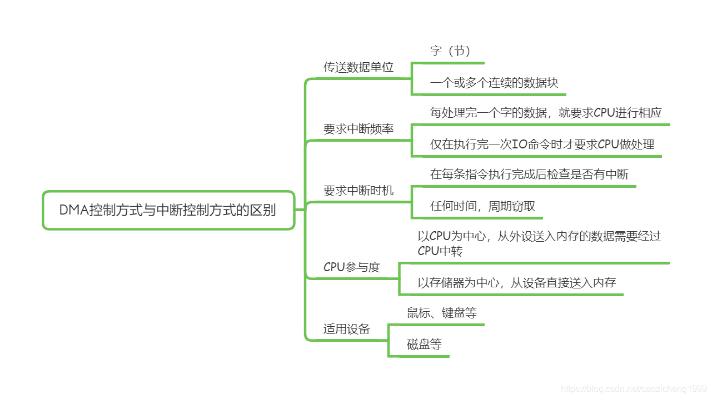

## I/O 通道控制方式

DMA 方式的进一步发展：

- 把对一个数据块的读(或写)为单位的干预减少为对一组数据块的读(或写)及有关的控制和管理为单位的干预
- DMA 方式需要 CPU 来控制传输数据块的大小，传输的内存地址，而通道方式中，这些信息是由通道决定的
- 一个 DMA 控制器对应一台设备，而一个通道可以对应多个 I/O 控制器（一个 I/O 控制器又可以控制多台同类型设备）

**I/O 通道**

一种硬件，可以视为“弱鸡版”CPU

**I/O 处理机**

用一个功能较弱的计算机管理 I/O，彻底解放 CPU，硬件结构最复杂。这个方式下，IO 操作几乎全部由外围处理机来完成，此时外围处理机类似一个小型 PC，很多时候也把通道称为IO处理机，OS中很多概念本来就是人为定义的，一般情况认为通道就是一种IO处理机

**通道程序**

由一系列通道指令(或称为通道命令)所构成的，不属于机器指令，属于通道自己的指令，存放在主存中，由通道从主存中取出并由通道来执行

**工作过程**

CPU 向通道发送一条 I/O 指令（指明操作的设备、通道程序的地址）。通道在收到该指令后，从内存中取出本次要执行的通道程序，然后执行该通道程序，当通道完成了规定的 I/O 任务后（全部放入内存），向 CPU 发中断信号（实现了 CPU、通道和 I/O 设备三者的并行操作）

## 四种方式工作过程概述

引论：假设幼儿园一个阿姨带 10 个孩子，要给每个孩子分 2 块 水果糖。假设孩子们把 2 块糖都吃完，那么她采用什么方法呢?  第一种方法：她先给孩子甲一块糖，盯着甲吃完，然后再给第二块。接着给孩子乙， 其过程与孩子甲完全一样。以此类推，直至到第 10 个孩子发完 2 块糖。看来这种方法效率 太低，重要之点还在于孩子们吃糖时她一直在守候，什么事也不能干。于是她想了第二种方法：每人发一块糖各自去吃，并约定谁吃完后就向她举手报告，再发第二块。看来这种 新方法提高了工作效率，而且在未接到孩子们吃完糖的报告以前，她还可以腾出时间给孩 子们批改作业。但是这种方法还可以改进，于是她想了第三种方法，进行批处理：每人拿 2 块糖各自去吃，吃完 2 块糖后再向她报告。显然这种方法工作效率大大提高，她可以腾出 更多的时间批改作业。还有没有更好的方法呢? 我们假定她给孩子们改作业是她的主要任 务，那么她还可以采用第四种方法：权力下放，把发糖的事交给另一个人分管，只是必要 时她才过问一下

### **无条件传送方式**

无条件传送方式假设外设始终处于就绪状态，数据传送时，CPU 不必通过接口查询外 设的状态，而直接执行 I/O 指令进行数据传输。显然，只有当接口与外设之间采用无条件传 送方式时，CPU 与接口之间才能采用无条件传送方式。这种方式下，CPU 在端口读、写操 作之前对目标设备的状态不作任何检测。当简单外设作为输入设备时，可使用三态缓冲器 与数据总线相连；当简单外设作为输出设备时，输出一般采用锁存器

### **程序控制方式（程序查询方式）**

程序在执行到 IO 操作时，会以一定周期查询 IO 设备的状态标志位，如果处于”忙状态“程序会等待一个周期后，再次进行查询，直到 IO 设备变为“闲状态”。

直接程序控制方式虽然简单，不需要多少硬件的支持，但由于高速的 CPU 和低速的 I/O 设备之间的速度上不匹配，因此，CPU 与外围设备只能串行工作，使 CPU 的绝大部分时间都处于等待是否完成 I/O 操作的循环测试中，造成 CPU 的极大浪费，外围设备也不能得到合理的使用，整个系统的效率很低。因此，程序查询方式只适用于连接低速外设或者 CPU 任务不繁忙的情况。

1. 程序查询方式接口：
    1. 由于主机和外部设备之间进行数据传送的方式不同，因而接口的逻辑结构也相应有所 不同。程序查询方式的接口是最简单的
    2. 接口电路包括：
        1. 设备选择电路 ：接到总线上的每个设备预先都给定了设备地址码。CPU 执行 I/O 指 令时需要把指令中的设备地址送到地址总线上，用以指示 CPU 要选择的设备。每个设备接 口电路都包含一个设备选择电路，用它判别地址总线上呼叫的设备是不是本设备。如果是， 本设备就进入工作状态，否则不予理睬。设备选择电路实际上是设备地址的译码器。
        2. 数据缓冲寄存器 ：当输入操作时，用数据缓冲寄存器来存放从外部设备读出的数 据，然后送往 CPU；当输出操作时，用数据缓冲寄存器来存放 CPU 送来的数据，以便送给 外部设备输出
        3. 设备状态标志 ：是接口中的标志触发器，如“忙”“准备就绪”“错误”等，用来标 志设备的工作状态，以便接口对外设动作进行监视。一旦 CPU 用程序询问外部设备时，将 状态标志信息取至 CPU 进行分析
2. 程序查询输入/输出方式
    1. 程序查询方式是利用程序控制实现 CPU 和外部设备之间的数据传送。
    2. 动作如下：
        1. (1)先向 I/O 设备发出命令字，请求进行数据传送。
        2.  (2)从 I/O 接口读入状态字。 
        3. (3)检查状态字中的标志，看看数据交换是否可以进行。
        4.  (4)假如这个设备没有准备就绪，则第(2)、第(3)步重复进行，一直到这个设备准备好 交换数据，发出准备就绪信号“Ready”。
        5.  (5)CPU 从 I/O 接口的数据缓冲寄存器输入数据，或者将数据从 CPU 输出至接口的数 据缓冲寄存器。与此同时，CPU 将接口中的状态标志复位。
    3. 设备服务子程序的主要功能是：
        1. ①实现数据传送。输入时，由 I/O 指令将设备的数据传 送到 CPU 某寄存器，再由访内指令把寄存器中的数据存入内存；输出时，其过程正好相反。
        2. ②修改内存地址，为下一次数据传送做准备。
        3. ③修改传送字节数，以便修改传送长度。
        4.  ④进行状态分析或其他控制功能
        5. 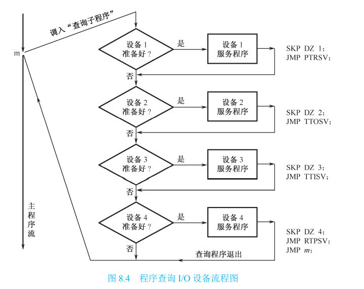
    4. 某设备的服务子程序执行完以后，接着查询下一个设备。被查询设备的先后次序由查 询程序决定，也可以用改变程序的办法来改变询问次序。一 般来说，总是先询问数据传输率高的设备，后询问数据传输率低的设备，因而后询问的设 备要等待更长的时间

### **程序中断方式**

在现代计算机系统中，对I/O设备的控制，广泛地采用中断驱动方式，即当某进程要启动某个I/O设备时，便由CPU向相应的设备控制器的控制寄存器发出一条I/O命令，然后立即返回继续执行原来的任务。设备控制器便按照该命令的要求去控制I/O设备。若I/O设备忙，则由驱动程序将请求插入设备等待队列。此时， CPU与I/O设备处于并行工作状态。例如，在输入时，当设备控制器收到 CPU发来的读命令后，便准备接收从相应输入设备送来的数据。一旦数据进入数据寄存器，控制器便通过中断请求线INT向CPU发送一中断信号，由CPU读取状态寄存器测试输入过程中是否出错，若无错，便从数据寄存器中读出数据，写入指定内存单元。

中断驱动方式在I/O设备输入数据的过程中，无需 CPU干预，可以使CPU与I/O设备并行工作。仅当输完一个数据时，才需 CPU花费极短的时间去进行中断处理。从而大大地提高了整个系统的资源利用率及吞吐量，特别是CPU的利用率。同程序查询方式相比，中断方式硬件结构相对 复杂，软件复杂度也提高了，服务开销时间较大。

1. 中断概念:中断是一种程序随机切换的方式，有时也统称为异常。当外部发生某些随机的事件需 要及时处理时，无论 CPU 正在执行哪一条指令，都可以通过中断响应的方式暂停正在执行 的主程序的执行，转而执行另外一段中断服务程序。在高优先级的中断服务程序执行完毕 后，可以返回被打断的主程序“断点”继续执行
2. 应用：
    1. (1)实现 CPU 与外界进行信息交换的握手联络。一方面，中断可以实现 CPU 与外设的 并行工作；另一方面，对于慢速 I/O 设备，使用中断方式可以有效提高 CPU 的效率。 
    2. (2)故障处理。中断可以用于处理常见的硬件故障，如掉电、校验错、运算出错等；也 可以处理常见的软件故障，如溢出、地址越界、非法指令等
    3. (3)实时处理。中断可以保证在事件出现的实际时间内及时地进行处理。 
    4. (4)程序调度。中断是操作系统进行多任务调度的手段。
    5.  (5)软中断(程序自愿中断)。软中断不是随机发生的，而是与子程序调用功能相似，但 其调用接口简单，不依赖于程序入口地址，便于软件的升级维护和调用
3. 基本过程：在程 序中断方式中，某一外设的数据准备就绪后，它“主动”向 CPU 发出请求中断的信号，请 求 CPU 暂时中断目前正在执行的程序而进行数据交换。当 CPU 响应这个中断请求时，便 暂停运行主程序，并自动转移到该设备的中断服务程序。当中断服务程序结束以后，CPU 又回到原来的主程序。这种原理和调用子程序相仿，不过，这里要求转移到中断服务程序 的请求是由外部设备发出的。中断方式特别适合于随机出现的服务。
4. eg：图 8.5 示出了中断处理示意图。主程序只是在设备 A、B、C 数据准备就绪时，才去与 设备 A、B、C 进行数据交换。在速度较慢的外围设备准备自己的数据时，CPU 照常执行自 己的主程序。在这个意义上说，CPU 和外围设备的一些操作是并行地进行的，因而同串行 进行的程序查询方式相比，计算机系统的效率大大提高了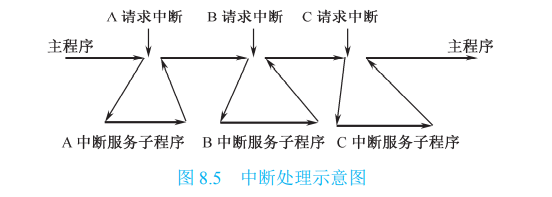
5. 基本流程：当 CPU 执行完一条现行指令时，如果外设向 CPU 发出中断请求，那么 CPU 在满足响 应条件的情况下，将发出中断响应信号，与此同时关闭中断(“中断屏蔽”触发器置“1”)， 表示 CPU 不再受理另外一个设备的中断请求。这时，CPU 将寻找中断请求源是哪一个设备， 并保存 CPU 自己的程序计数器(PC)的内容。然后，它将转移到处理该中断源的中断服务程 序。CPU 在保存现场信息，设备服务(如交换数据)以后，将恢复现场信息。在这些动作完 成以后，开放中断(“中断屏蔽”触发器清“0”)，并返回到原来被中断的主程序的下一条 指令
6. 相关问题：
    1. 尽管外界中断请求是随机的，但 CPU 只有在当前一条指令执行完毕后， 即转入公操作时才受理设备的中断请求，这样才不至于使当前指令的执行受到干扰。所谓 ==公操作==，是指**一条指令执行结束后 CPU 所进行的共有操作，如中断处理、取下条指令等**。外界中断请求信号通常存放在接口中的中断源锁存器里，并通过中断请求线连至 CPU，每当一 条指令执行到末尾，CPU 便检查中断请求信号。若中断请求信号为“1”且允许响应该中断 请求，则 CPU 转入“中断周期”，受理外界中断。
    2. 为了在中断服务程序执行完毕以后，能够正确地返回到原来主程序被中 断的断点而继续执行主程序，必须把程序计数器 PC 的内容，以及当前指令执行结束后 CPU 的状态(包括寄存器的内容和一些状态标志位)都保存到堆栈中。这些操作称为保存现场。
    3.  CPU 响应中断后，正要去执行中断服务程序时，可能有另一个新的中 断源向它发出中断请求。为了不致造成混乱，在 CPU 的中断管理部件中必须有一个“中断 屏蔽”触发器，它可以在程序的控制下置“1”(关中断)，或清“0”(开中断)。只有在“中 断屏蔽”标志为“0”时，CPU 才可以受理中断。当一条指令执行完毕 CPU 接受中断请求 并作出响应时，它一方面发出中断响应信号 INTA，另一方面把“中断屏蔽”标志置“1”， 即关闭中断。这样，CPU 不能再受理另外的新的中断源发来的中断请求。只有在 CPU 把中 断服务程序执行完毕以后，它才重新使“中断屏蔽”标志置“0”，即开放中断，并返回主 程序。因此，==中断服务程序的最后必须有两条指令，即开中断指令和中断返回指令，同时 在硬件上要保证中断返回指令执行以后才受理新的中断请求。==
    4. 中断处理过程是由硬件和软件结合来完成的。如在图 8.6 中，“中断周期” 由硬件实现，而中断服务子程序由机器指令序列实现。后者除执行保存现场、恢复现场、 开放中断并返回主程序任务外，需对请求中断的设备进行服务，使其同 CPU 交换一个字的 数据，或作其他服务。至于在中断周期中如何转移到各个设备的中断服务程序，将在稍后 介绍。
    5. ==“中断处理的隐操作”==：在中断周期中由硬件实现的响应中断、关中断等操作由于在主程序和中断服务程序 的代码中都看不到，对于软件来说硬件执行的操作对软件不可见。
    6. 中断分为内中断和外中断。机器内部原因导致出错引起的中断叫内中断， 也叫异常。外部设备请求服务的中断叫外中断。

**中断服务程序入口地址的获取**

1. 现代计算机系统中，中断是频繁发生的，这些引起中断的事件被称为==中断源==。CPU 在 中断响应的过程中必须首先确认应该为哪个中断源服务。当有多个中断源同时提出中断申 请时，还需对中断源进行优先级判别和排队，以确定应该首先响应哪个中断源的服务请求。 然后，CPU 需要获取应被服务的中断源的中断服务程序入口地址，并转到相应的中断服务 程序执行。
2. 向量中断 向量中断是指 CPU 响应中断后，由中断机构 自动将相应中断源的中断向量地址送入 CPU，由其指明中断 服务程序入口地址并实现程序切换的中断方式。
    1. 每个中断源都对应一个中断服务程序，而中断服务 程序的入口地址被称为中断向量（一个中断服务程序可对应多个中断源）
    2. 在有的系统中，中断向量 还包括中断服务程序开始执行时的程序状态字 PSW 的初始 值。
    3. 一般而言，系统中所有的中断向量都按顺序存放在内存 指定位置的一张中断向量表中，当 CPU 识别出某中断源时， 由硬件直接产生一个与该中断源对应的中断向量地址，以便 能快速在中断向量表中找到并转入中断服务程序入口。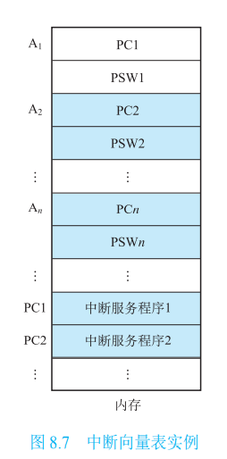
    4. 在有些计算机中，由硬件产生的向量地址不是直接地址，而是一个“位移量”，这个位 移量加上 CPU 某寄存器里存放的基地址，最后得到中断服务程序的入口地址。 还有的计算机在中断向量表中存放的不是中断服务程序入口地址，而是一条转移到中 断服务程序入口地址的转移指令的指令字。在中断切换过程中，由硬件直接执行这条转移 指令，从而跳转到相应的中断服务程序执行
3. 查询中断 在查询中断方式中，硬件不直接提供中断服务程序的入口地址，而是为 所有中断服务程序安排一个公共的中断服务程序。在中断响应时，由公共的中断服务程 序软件查询中断源，并跳转至相应中断服务子程序入口执行
4. 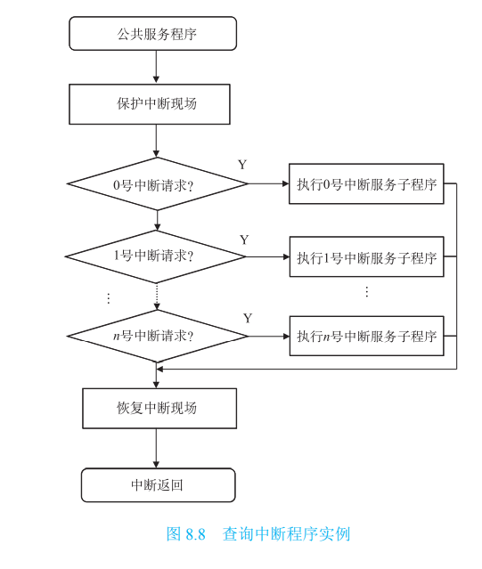
5. 在向量中断方式中，查找中断源、中断排队与判优、获取中断服务程序入口地址都是 由硬件在中断周期中自动完成的。但在查询中断方式中，查找中断源和获取中断服务程序 入口地址都是由软件实现的，而中断优先级则与软件查询中断源的顺序相关，因此可以更 灵活地调整中断优先级
6. 总结：==中断源->CPU响应中断->中断机构自动将向量地址传入CPU ->CPU查询->寻找到中断程序的入口地址

程序中断方式的基本 I/O 接口

1. 接口电路中有一个工作标志触发器 (BS)，就绪标志触发器(RD)，还有一个控制触发器，称为允许中断触发器(EI)

2. 

3. 程序中断由外设接口的状态和 CPU 两方面来控制。

    1. 在接口方面，有决定是否向 CPU发出中断请求的机构，主要是接口中的“准备就绪”标志(RD)和“允许中断”标志(EI)两个触发器。
        1. 准备就绪触发器(RD) 一旦设备做好一次数据的接收或发送，便发出一个设备动作完 毕信号，使 RD 标志置“1”。在中断方式中，该标志用作中断源触发器，简称中断触发器。
        2.  允许中断触发器(EI) 可以用程序指令来置位。EI 为“1”时，某设备可以向 CPU 发 出中断请求；EI 为“0”时，不能向 CPU 发出中断请求，这意味着某中断源的中断请求被 禁止。设置 EI 标志的目的，就是通过软件来控制是否允许某设备发出中断请求。
    2. 在 CPU 方面，有决定是否受理中断请求的机构，主要是“中断请求”标志(IR) 和“中断屏蔽”标志(IM)两个触发器
        1. 中断请求触发器(IR) 它暂存中断请求线上由设备发出的中断请求信号。当 IR 标志为 “1”时，表示设备发出了中断请求。 
        2. 中断屏蔽触发器(IM) 是 CPU 是否受理中断或批准中断的标志。IM 标志为“0”时， CPU 可以受理外界的中断请求，反之，IM 标志为“1”时，CPU 不受理外界的中断请求
    3. 具体过程：标号①～⑧表示由某一外设输入数据的控制过程。
        1. ①表示由程序启动外设， 将该外设接口的“忙”标志 BS 置“1”，“准备就绪”标志 RD 清“0”；
        2. ②表示接口向外设 发出启动信号；
        3. ③表示数据由外设传送到接口的缓冲寄存器；
        4. ④表示当设备动作结束或缓 冲寄存器数据填满时，设备向接口送出一控制信号，将数据“准备就绪”标志 RD 置“1”；
        5.  ⑤表示允许中断标志 EI 为“1”时，接口向 CPU 发出中断请求信号；
        6. ⑥表示在一条指令执 行末尾 CPU 检查中断请求线，将中断请求线的请求信号接收到“中断请求”标志 IR；
        7. ⑦表 示如果“中断屏蔽”标志 IM 为“0”时，CPU 在一条指令执行结束后受理外设的中断请求， 向外设发出响应中断信号并关闭中断；
        8. ⑧表示转向该设备的中断服务程序入口；
        9. ⑨表示在 中断服务程序通过输入指令把接口中数据缓冲寄存器的数据读至 CPU 中的寄存器；
        10. ⑩表示 CPU 发出控制信号 C 将接口中的 BS 和 RD 标志复位

    **单级中断**

    1. 单级 中断系统是中断结构中最基本的形式。
    2. 在单级中断系统中，所有的中断源都属于同一级， 所有中断源触发器排成一行，其优先次序是离 CPU 近的优先权高。当响应某一中断请求时， 执行该中断源的中断服务程序。在此过程中，不允许其他中断源再打断中断服务程序，即 使优先权比它高的中断源也不能再打断。只有该中断服务程序执行完毕之后，才能响应其 他中断。（执行中断后便不可打断）
    3. 单级中断源的识别
        1. 在单级中断中，采用串行排队链法来实现具有公共请求线的中断源判优识别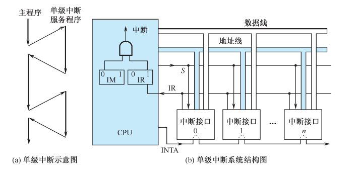
        2. 当 CPU 识别出某中断源时，由硬件直接产生一个与该中断源对应的向量地址，很快便 引入中断服务程序。向量中断要求在硬件设计时考虑所有中断源的向量地址，而实际中断 时只能产生一个向量地址

    **多级中断**

    1. 多级中断系统是指计算机系统中有相当多的中断源，根据各中断事件的轻重缓急程度不同而分成若干级别，每一中断级分配给一个优先权。
    2. 一般说来，优先权高的中断级可以 打断优先权低的中断服务程序，以程序嵌套方式进行工作（高级别可打断低级别中断，同级别中断不可互相打断）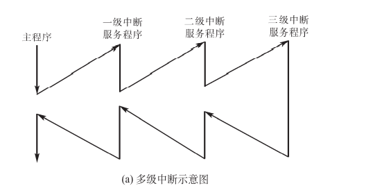
    3. 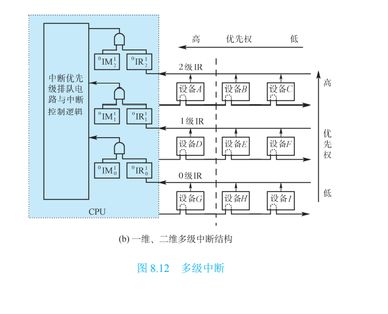
    4. 中断维度：
        1. 多级中断又可分为一维多级中断和二维多级中断，如图 8.12(b) 所示。一维多级中断是指每一级中断中只有一个中断源，而二维多级中断是指每一级中断 中有多个中断源。
        2. 一个系统若有 n 级中断，在 CPU 中就有 n 个中断请求触发器，总称为中断请求寄 存器；与之对应的有 n 个中断屏蔽触发器，总称为中断屏蔽寄存器。与单级中断不同，在 多级中断中，中断屏蔽寄存器的内容是一个很重要的程序现场，因此在响应中断时，需要 把中断屏蔽寄存器的内容保存起来，并设置新的中断屏蔽状态
        3. 多级中断中的每一级可以只有一个中断源，也可以有多个中断源。在多级中断之间 可以实现中断嵌套，但是同一级内有不同中断源的中断是不能嵌套的，必须是处理完一个 中断后再响应和处理同一级内其他中断源
        4. 设置多级中断的系统一般都希望有较快的中断响应时间，因此首先响应哪一级中断 和哪一个中断源，由硬件逻辑实现，而不是用程序实现。图 8.12 中的中断优先级排队电路， 就是用于决定优先响应中断级的硬件逻辑。另外，在二维中断结构中，除了有中断优先级 排队电路确定优先响应中断级外，还要确定优先响应的中断源，一般通过链式查询的硬件 逻辑来实现。显然，这里采用了独立请求方式与链式查询方式相结合的方法决定首先响应 哪个中断源
        5. 和单级中断情况类似，在多级中断中也使用中断堆栈保存现场信息。使用堆栈保存 现场的好处是：①控制逻辑简单，保存和恢复现场的过程按先进后出顺序进行。②每一级 中断不必单独设置现场保护区，各级中断现场可按其顺序放在同一个栈里。
    5. 多级中断识别：
        1. 每一级均有一根中断请求线送往 CPU 的中断优先级排队电路，对每一 级赋予了不同的优先级。显然这种结构就是独立请求方式的逻辑结构
        2. 在多级中断中，如果每一级请求线上还连接有多个中断源设备，那么在识别中断源时， 还需要进一步用串行链式方式查询。这意味着要用二维方式来设计中断排队逻辑

    ### 8.3.6 Pentium 中断机制

    1. 中断类型;

        1. 中断 通常称为外部中断，它是由 CPU 的外部硬件信号引发的。有两种情况：

            1. ①可屏 蔽中断：CPU 的 INTR 引脚收到中断请求信号，如果 CPU 中标志寄存器 IF=1 时，可引发 中断；IF=0 时，中断请求信号在 CPU 内部被禁止。
            2. ②非屏蔽中断：CPU 的 NMI 引脚收到 的中断请求信号而引发的中断，这类中断不能被禁止

        2. 异常 通常称为异常中断，它是由指令执行引发的。有两种情况：

            1. ①执行异常：CPU 执行一条指令过程中出现错误、故障等不正常条件引发的中断。
            2. ②执行软件中断指令：如 执行 INT 0，INT 3，INT n 等指令，执行时产生异常中断

        3. 。中断优先级分为 5 级。异常中断的优先级高于外部中断的优先级，这是因为异常中 断发生在取一条指令或译码一条指令或执行一条指令时出现故障的情况下，情况更为紧急。

            

## **直接内存访问(DMA)方式**

首先明确一点，主存和IO设备中并没有一条直接的物理通路，所谓的“直接数据通路”是指系统总线，所以也就存在当DMA控制器发出总线请求时，CPU要在本次存储周期结束时让出总线，CPU响应DMA请求在每次机器周期执行完。

只有DMA方式是依靠硬件电路实现的，其余三种（程序查询，中断，通道）都需要程序的干预。

中断驱动I/O方式虽然大大提高了主机的利用率，但是它以字（节）为单位进行数据传送，每完成一个字（节）的传送，控制器便要向CPU请求一次中断（做保存现场信息，恢复现场等工作），仍然占用了CPU的许多时间。这种方式对于高速的块设备的I/O控制显然是不适合。为了进一步减少CPU对I/O的干预，引入了直接存储器访问DMA（Direct Memory Access）控制方式。

直接内存访问(DMA)方式是一种完全由硬件执行 I/O 交换的工作方式。这种方式既能 够响应随机发生的服务请求，同时又可以省去中断处理的开销。此时，DMA 控制器从 CPU 完全接管对总线的控制，数据交换不经过 CPU，而直接在内存和外围设备之间进行，以高 速传送数据。这种方式和前述例子的第三种方法相仿，主要的优点是数据传送速度很高， 传送速率仅受到内存访问时间的限制。与中断方式相比，需要更多的硬件。DMA 方式适用 于内存和高速外围设备之间大批数据交换的场合。

DMA 方式一般用于高速传送成组数据。DMA 控制器将向内存发出地址和 控制信号，修改地址，对传送的字的个数计数，并且以中断方式向 CPU 报告传送操作的 结束

一般过程：

1. ​	(1)从外围设备发出 DMA 请求。 

2. (2)CPU 响应请求，把 CPU 工作改成 DMA 操作方式，DMA 控制器从 CPU 接管总线 的控制。

3.  (3)由 DMA 控制器对内存寻址，即决定数据传送的内存单元地址及数据传送个数的计 数，并执行数据传送的操作

4.  (4)向 CPU 报告 DMA 操作的结束。 

5. 注意，在 DMA 方式中，一批数据传送前的准备工作，以及传送结束后的处理工作，均由==管理程序==承担，而 DMA 控制器仅负责数据传送的工作

    

    ==DMA数据传送方式==：DMA 控制器与 CPU分时使用内存

    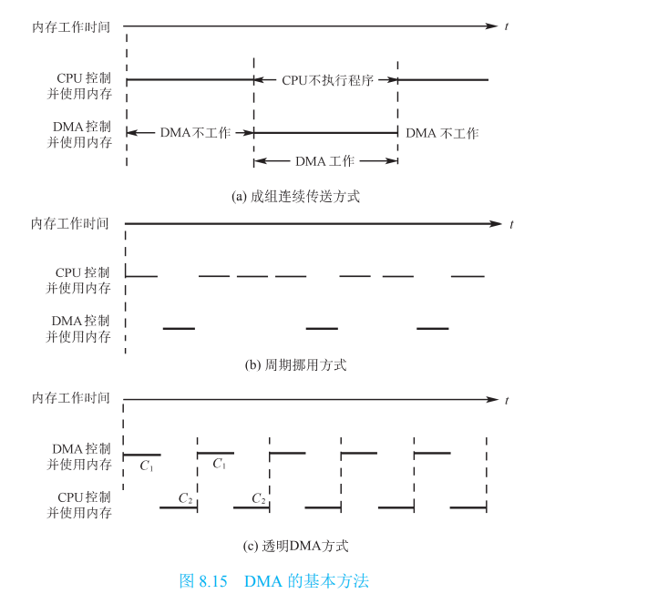

    1. 成组连续传送方式 

        1. 当外围设备要求传送一批数据时，由 DMA 控制器发一个停止信号给 CPU，要求 CPU 放弃对地址总线、数据总线和有关控制总线的使用权。DMA 控制器获得总线控制权以后， 开始进行数据传送。在一批数据传送完毕后，DMA 控制器通知 CPU 可以使用内存，并把 总线控制权交还给 CPU
        2. 在这种 DMA 传送 过程中，CPU 基本处于不工作状态或者说保持状态
        3. 是控制简单，它适用于数据传输率很高的设备进行成组传送。缺点是在 DMA 控制器访内阶段，内存的效能没有充分发挥，相当一部分内存工作周期是空闲 的。这是因为，外围设备传送两个数据之间的间隔一般总是大于内存存储周期，即使高速 I/O 设备也是如此。例如，软盘读出一个 8 位二进制数大约需要 32μs，而半导体内存的存储 周期小于 0.2μs，因此许多空闲的存储周期不能被 CPU 利用

    2. 周期挪用方式

        1.  在这种 DMA 传送方法中，当 I/O 设备没有 DMA 请求时，CPU 按程序要求访问内存； 一旦 I/O 设备有 DMA 请求，则由 I/O 设备挪用一个或几个内存周期。 
        2. I/O 设备要求 DMA 传送时可能遇到两种情况：一种是此时 CPU 不需要访内，如 CPU 正在执行乘法指令。由于乘法指令执行时间较长，此时 I/O 访内与 CPU 访内没有冲突，即 I/O 设备挪用一两个内存周期对 CPU 执行程序没有任何影响。另一种是 I/O 设备要求访内时 CPU 也要求访内，这就产生了访内冲突，在这种情况下 I/O 设备访内优先，因为 I/O 访内有 时间要求，前一个 I/O 数据必须在下一个访内请求到来之前存取完毕。显然，在这种情况下 I/O 设备挪用一两个内存周期，意味着 CPU 延缓了对指令的执行，或者更明确地说，在 CPU 执行访内指令的过程中插入 DMA 请求，挪用了一两个内存周期
        3. 与停止 CPU 访内的 DMA 方法比较，周期挪用的方法既实现了 I/O 传送，又较好地发 挥了内存和 CPU 的效率，是一种广泛采用的方法。但是 I/O 设备每一次周期挪用都有申请 总线控制权、建立总线控制权和归还总线控制权的过程，所以传送一个字对内存来说要占 用一个周期，但对 DMA 控制器来说一般要 2～5 个内存周期(视逻辑线路的延迟而定)。因 此，周期挪用的方法适用于 I/O 设备读写周期大于内存存储周期的情况

    3. 透明 DMA 方式

        1.  如果 CPU 的工作周期比内存存取周期长很多，则采用交替访内的方法可以使 DMA 传 送和 CPU 同时发挥最高的效率，其原理示意图如图 8.15(c)所示。假设 CPU 工作周期为 1.2μs，内存存取周期小于 0.6μs，那么一个 CPU 周期可分为 C1 和 C2两个分周期，其中 C1 专供 DMA 控制器访内，C2 专供 CPU 访内。 
        2. 这种方式不需要总线使用权的申请、建立和归还过程，总线使用权是通过 C1 和 C2 分时 控制的。CPU 和 DMA 控制器各自有自己的访内地址寄存器、数据寄存器和读/写信号等控 制寄存器。在 C1 周期中，如果 DMA 控制器有访内请求，可将地址、数据等信号送到总线 上。在 C2 周期中，如 CPU 有访内请求，同样传送地址、数据等信号。事实上，对于总线， 这是用 C1 和 C2 控制的一个多路转换器，这种总线控制权的转移几乎不需要什么时间，所以 对 DMA 传送来讲效率是很高的。
        3.  这种传送方式称为“透明的 DMA”方式，其来由是这种 DMA 传送对 CPU 来说，如同 透明的玻璃一般，没有任何感觉或影响。在透明的 DMA 方式下工作，CPU 既不停止主程 序的运行，也不进入等待状态，是一种高效率的工作方式。当然，相应的硬件逻辑也就更 加复杂

        **基本DMA控制器**

        1. 一个 DMA 控制器，实际上是采用 DMA 方式的外围设备与系统总线之间的接口电路。这个接口电路是在中断接口的基础上再加 DMA 机构组成的。
        2. 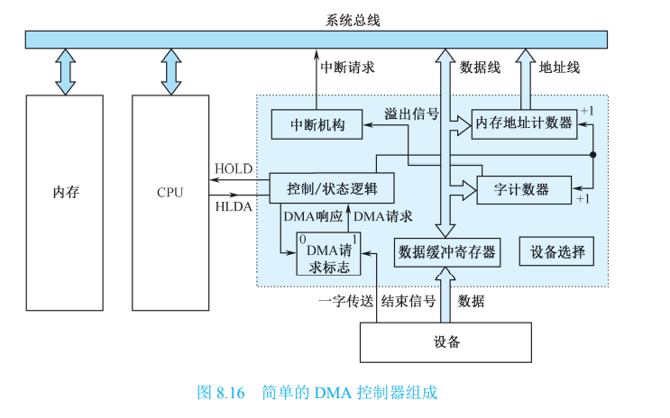
        3. 内存地址计数器 用于存放内存中要交换的数据的地址。在 DMA 传送前，须通过程序 将数据在内存中的起始位置(首地址)送到内存地址计数器。而当 DMA 传送时，每交换一次 数据，将地址计数器加“1”，从而以增量方式给出内存中要交换的一批数据的地址。
        4.  字计数器 用于记录传送数据块的长度(多少字数)。其内容也是在数据传送之前由程 序预置，交换的字数通常以补码形式表示。在 DMA 传送时，每传送一个字，字计数器就加 “1”，当计数器溢出即最高位产生进位时，表示这批数据传送完毕，于是引起 DMA 控制器 向 CPU 发中断信号。 
        5. 数据缓冲寄存器 用于暂存每次传送的数据(一个字)。当输入时，由设备(如磁盘)送 往数据缓冲寄存器，再由缓冲寄存器通过数据总线送到内存。反之，输出时，由内存通过 数据总线送到数据缓冲寄存器，然后再送到设备。 
        6. DMA 请求标志 每当设备准备好一个数据字后给出一个控制信号，使“DMA 请求” 标志置“1”。该标志置位后向“控制/状态”逻辑发出 DMA 请求，后者又向 CPU 发出总线 使用权的请求(HOLD)，CPU 响应此请求后发回响应信号 HLDA，“控制/状态”逻辑接收此 信号后发出 DMA 响应信号，使“DMA 请求”标志复位，为交换下一个字做好准备。
        7.  控制/状态逻辑 由控制和时序电路以及状态标志等组成，用于修改内存地址计数器和 字计数器，指定传送类型(输入或输出)，并对“DMA 请求”信号和 CPU 响应信号进行协 调和同步。 
        8. 中断机构 当字计数器溢出时(全 0)，意味着一组数据交换完毕，由溢出信号触发中断 机构，向 CPU 提出中断报告。这里的中断与 8.3 节介绍的 I/O 中断所采用的技术相同，但 中断的目的不同，前面是为了数据的输入或输出，而这里是为了报告一组数据传送结束。 因此它们是 I/O 系统中不同的中断事件

- 预处理  CPU

 由CPU完成一些必要的准备工作。然后，CPU继续执行原来的程序，直到IO设备准备好发送的数据(输入情况)或接收的数据(输出情况)时，I/O设备向DMA控制器发送DMA请求，再由DMA控制器向CPU发送总线请求(有时将这两个过程统称为DMA请求)，用以传输数据。

- 数据传送

 DMA的数据传输可以以单字节(或字)为基本单位，也可以以数据块为基本单位。对于以数据块为单位的传送(如硬盘)，DMA占用总线后的数据输入和输出操作都是通过循环来实现的。需要指出的是，这一循环也是由DMA控制器(而非通过CPU 执行程序)实现的，即**数据传送阶段完全由DMA(硬件)控制**。

- 后处理

 DMA控制器向CPU发送**中断请求**，CPU执行中断服务程序做DMA结束处理， 包括校验送入主存的数据是否正确、测试传送过程中是否出错(错误则转入诊断程序) 及决定是否继续使用DMA传送其他数据块等。

DMA方式起到代理cpu的功能，较之中断驱动方式，又是成百倍地减少了CPU对 I/O控制的干预，进一步提高了CPU与I/O设备的并行操作程度。

#### 选择型和多路型DMA控制器

1. 选择型 DMA 控制器
    1. 它在物理上可以连接多个设备，而在逻辑 上只允许连接一个设备。换句话说，在某一段时间内只能为一个设备服务。
    2. 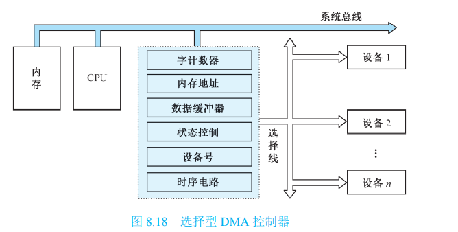
    3. 除了前面讲到的基 本逻辑部件外，还有一个设备号寄存器。数据传送是以数据块为单位进行的，在每个数据 块传送之前的预置阶段，除了用程序中 I/O 指令给出数据块的传送个数、起始地址、操作命 令外，还要给出所选择的设备号。从预置开始，一直到这个数据块传送结束，DMA 控制器 只为所选设备服务。下一次预置再根据 I/O 指令指出的设备号，为另一选择的设备服务。
    4. 选择型 DMA 控制器只增加少量硬件达到了为多个外围设备服务的目的，它特别适合数 据传输率很高以至于接近内存存取速度的设备。在很快地传送完一个数据块后，控制器又 可为其他设备服务
2. 多路型 DMA 控制器
    1. 选择型 DMA 控制器不适用于慢速设备。但是多路型 DMA 控制器却适合于同时为多个 慢速外围设备服务
    2. 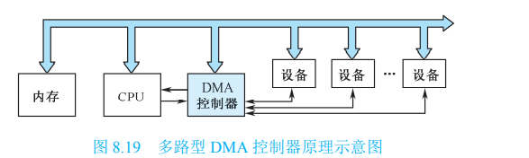
    3. 多路型 DMA 不仅在物理上可以连接多个外围设备，而且在逻辑上也允许这些外围设备 同时工作，各设备以==字节==交叉方式通过 DMA 控制器进行数据传送
    4. 由于多路型 DMA 同时要为多个设备服务，因此对应多少个 DMA 通路(设备)，在控制 器内部就有多少组寄存器用于存放各自的传送参数
    5. 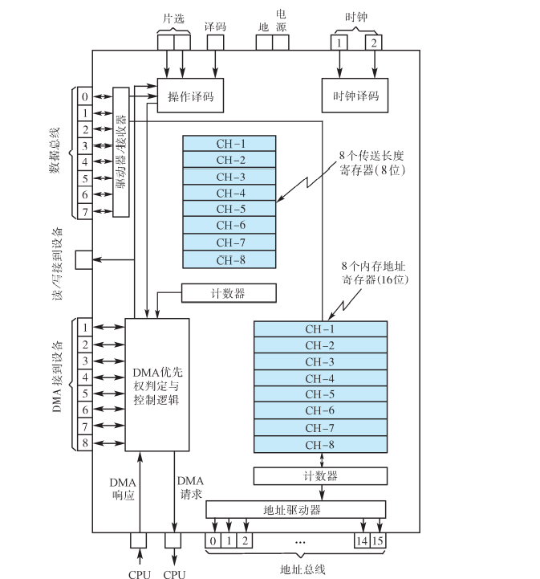
    6. 过程：
        1. (1)DMA 控制器接到设备发出的 DMA 请求时，将请求转送到 CPU。 
        2. (2)CPU 在适当的时刻响应 DMA 请求。若 CPU 不需要占用总线则继续执行指令；若 CPU 需要占用总线，则 CPU 进入等待状态。 
        3. (3)DMA 控制器接到 CPU 的响应信号后，进行以下工作：
            1. ①对现有 DMA 请求中优先 权最高的请求给予 DMA 响应；
            2. ②选择相应的地址寄存器的内容驱动地址总线
            3. ③根据所选 设备操作寄存器的内容，向总线发读、写信号；
            4. ④外围设备向数据总线传送数据，或从数 据总线接收数据；
            5. ⑤每字节传送完毕后，DMA 控制器使相应的地址寄存器和长度寄存器加 “1”或减“1”。
        4.  以上是一个 DMA 请求的过程，在一批数据传送过程中，要多次重复上述过程，直到外 围设备表示一个数据块已传送完毕，或该设备的长度控制器判定传送长度已满。

## **通道（CH）方式**

通道，独立于 CPU 的专门负责输入输出控制的处理机，它控制设备与内存直接进行数据交换。CPU 将部分权力下放给通道。 通道是一个具有特殊功能的简化版处理器，它可以实现对外围设备的统一管理和外围设备 与内存之间的数据传送控制。更进一步，现代的很多高性能计算机系统为输入/输出操作配 置专用的处理器，称为输入输出处理器(IOP)或者外围处理器，有自己的通道指令，这些指令由 CPU 启动，并在操作结束时向 CPU 发出中断信号。

通道控制方式，实现了 CPU、通道和 I/O 设备三者的并行操作，从而更加有效地提高整个系统的资源利用率。例如，当 CPU 要完成一组相关的读（或写）操作时，只需要向 I/O 通道发出一条 I/O 指令，指出其所要执行的通道程序和数据在内存中的地址和要访问的 I/O 设备，通道接收到该指令后，通过执行通道程序便可完成 CPU 指定的 I/O 任务。可见，通道只是在 I/O 操作的起始和结束时向 CPU 发出 I/O 中断申请，相对于之前的控制方式进一步减少了 CPU 的干预程度。

但是通道方式也有自己的不足，它虽然有自己的指令系统，但是通道指令功能简单，使用面窄，与 CPU 共用一个主存，还不是独立的 I/O 处理机。

CPU 向通道发送一条 I/O 指令（指明操作的设备、通道程序的地址）。通道在收到该指令后，从内存中取出本次要执行的通道程序，然后执行该通道程序，当通道完成了规定的 I/O 任务后（全部放入内存），向 CPU 发中断信号

#### 通道功能

1. 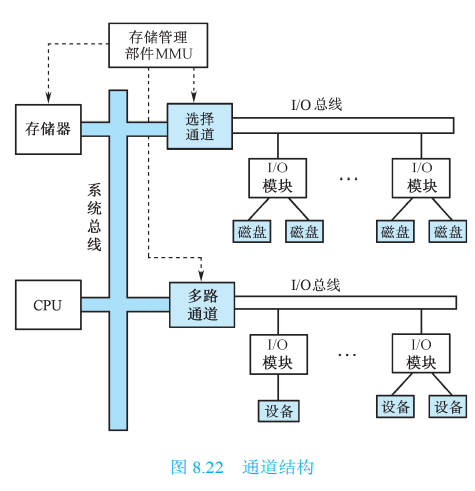

2. 它具有两种类型的总 线，

    1. 一种是系统总线，它承担通道与 存储器、CPU 与存储器之间的数据传 输任务。
    2. 另一种是通道总线，即 I/O 总线，它承担外围设备与通道之间的 数据传送任务。
    3. 这两类总线可以分别 按照各自的时序同时进行工作。

3. 通道总线可以接 若干个 I/O 模块，一个 I/O 模块可以接 一个或多个设备。因此，从逻辑结构 上讲，I/O 系统一般具有四级连接： CPU 与存储器 -> 通道 -> I/O 模块 -> 外围设备。为了便于通道对各设备的 统一管理，通道与 I/O 模块之间用统 一的标准接口，I/O 模块与设备之间则 根据设备要求不同而采用专用接口。

4. 具有通道的机器一般是大型计算机和服务器，数据流量很大。如果所有的外设都接在 一个通道上，那么通道将成为限制系统效能的瓶颈。因此大型计算机的 I/O 系统一般接有多 个通道。显然，设立多个通道的另一好处是，对不同类型的外设可以进行分类管理

5. 由于大多数 I/O 设备是旋转性的设备，读写 信号具有实时性，不及时处理会丢失数据，所以通道与 CPU 同时要求访存储器时，通道优 先权高于 CPU。在多个通道有访存请求时，选择通道的优先权高于多路通道，因为前者一 般连接高速设备

6. 通道的基本功能是执行通道指令，组织外围设备和内存进行数据传输，按 I/O 指令要求 启动外围设备，向 CPU 报告中断等，具体有以下五项任务

    1. (1)接受 CPU 的 I/O 指令，按指令要求与指定的外围设备进行通信。
    2.  (2)从存储器选取属于该通道程序的通道指令，经译码后向 I/O 控制器模块发送各种 命令。
    3.  (3)组织外设和存储器之间进行数据传送，并根据需要提供数据缓存的空间，以及提供 数据存入存储器的地址和传送的数据量。 
    4. (4)从外围设备得到设备的状态信息，形成并保存通道本身的状态信息，根据要求将这 些状态信息送到存储器的指定单元，供 CPU 使用。
    5.  (5)将外设的中断请求和通道本身的中断请求，按次序及时报告 CPU。

7. CPU对通道的管理

    1. CPU 是通过执行 I/O 指令以及处理来自通道的中断，实现对通道的管理。来自通道的 中断有两种，一种是数据传送结束中断，另一种是故障中断。
    2. 通常把 CPU 运行操作系统的管理程序的状态称为管态
    3. 而把 CPU 执行目的程序时的 状态称为目态
    4. 大型计算机的 I/O 指令都是管态指令，只有当 CPU 处于管态时，才能运行 I/O 指令，目态时不能运行 I/O 指令。这是因为大型计算机的软、硬件资源为多个用户所共 享，而不是分给某个用户专用。

8. 通道对设备控制器的管理

    1. 通道通过使用通道指令来控制 I/O 模块进行数据传送操作，并以通道状态字接收 I/O 模 块反映的外围设备的状态。因此，I/O 模块是通道对 I/O 设备实现传输控制的执行机构
        1. (1)从通道接受通道指令，控制外围设备完成所要求的操作。
        2.  (2)向通道反映外围设备的状态。 
        3. (3)将各种外围设备的不同信号转换成通道能够识别的标准信号

    #### 通道类型

    1. ​	通道的工作方式，通道分为选择通道、多路通道两种类型
    2. 选择通道 ：
        1. 选择通道又称高速通道，在物理上它可以连接多个设备，但是这些设备不能同时工作， 在某一段时间内通道只能选择一个设备进行工作。选择通道很像一个单道程序的处理器， 在一段时间内只允许执行一个设备的通道程序，只有当这个设备的通道程序全部执行完毕 后，才能执行其他设备的通道程序。
        2.  选择通道主要用于连接高速外围设备，如磁盘、磁带等，信息以数据块方式高速传输。 由于数据传输率很高，所以在数据传送期间只为一台设备服务是合理的。但是这类设备的 辅助操作时间很长，如磁盘机平均找道时间是 10ms，磁带机走带时间可以长达几分钟。在 这样长的时间里通道处于等待状态，因此整个通道的利用率不是很高。
    3. 多路通道 ：
        1. 多路通道又称多路转换通道，在同一时间能处理多个 I/O 设备的数据传输。它又分为数 组多路通道和字节多路通道。
        2.  数组多路通道是对选择通道的一种改进，它的基本思想是当某设备进行数据传送时， 通道只为该设备服务；当设备在执行寻址等控制性动作时，通道暂时断开与这个设备的连 接，挂起该设备的通道程序，去为其他设备服务，即执行其他设备的通道程序。所以数组 多路通道很像一个多道程序的处理器
        3. 数组多路通道不仅在物理上可以连接多个设备，而且在一段时间内能交替执行多个设 备的通道程序，换句话说在逻辑上可以连接多个设备，这些设备应是高速设备。 
        4. 由于数组多路通道既保留了选择通道高速传送数据的优点，又充分利用了控制性操作 的时间间隔为其他设备服务，使通道效率得到充分发挥，因此数组多路通道在大型系统中 得到较多应用
    4. 字节多路通道：
        1. 主要用于连接大量的低速设备，如键盘、打印机等，这些设备的数据传 输率很低。例如，数据传输率是 1000B/s，即传送 1 字节的时间是 1ms，而通道从设备接收 或发送 1 字节只需要几百纳秒，因此通道在传送 2 字节之间有很多空闲时间，字节多路通 道正是利用这个空闲时间为其他设备服务。 
        2. 字节多路通道和数组多路通道有共同之处，即它们都是多路通道，在一段时间内能交 替执行多个设备的通道程序，使这些设备同时工作
        3. 字节多路通道和数组多路通道也有不同之处，主要是：
            1. ①数组多路通道允许多个设备 同时工作，但只允许一个设备进行传输型操作，其他设备进行控制型操作。而字节多路通 道不仅允许多个设备同时操作，而且也允许它们同时进行传输型操作
            2. ②数组多路通道与 设备之间数据传送的基本单位是数据块，通道必须为一个设备传送完一个数据块以后，才 能为别的设备传送==数据块==。而字节多路通道与设备之间数据传送的基本单位是==字节==，通道 为一个设备传送完 1 字节后，又可以为另一个设备传送 1 字节，因此各设备与通道之间的 数据传送是以字节为单位交替进行
            3. 字节传送所占时间较数据块少，因此其更容易进行多个任务短时间内

# 一些问题

## 为什么中断隐指令要由硬件完成？

- 主要是保证系统运行的可靠性，相比于硬件，软件更容易出错
- 也能提高处理器的速度

## 中断响应[优先级](https://so.csdn.net/so/search?q=%E4%BC%98%E5%85%88%E7%BA%A7&spm=1001.2101.3001.7020)和中断处理优先级分别指什么？

- 中断响应优先级是由硬件排队线路或中断査询程序的查询顺序决定的，不可动态改变
- 中断处理优先级可以由中断屏蔽字来改变，反映的是正在处理的中断与新发生的中断的处理优先级

## 程序中断和调用子程序有何区别？

- 调用子程序过程发生的时间是已知的和固定的，而中断过程发生的时间一般是随机的
- 子程序为主程序服务，两者属于主从关系。而中断服务程序与主程序两者是平行关系
- 调用子程序的过程完全属于软件处理过程；而中断处理系统是一个软硬件结合的系统
- 子程序嵌套受堆栈大小限制；而中断嵌套级数主要由中断优先级来决定，一般优先级数不会很大
- 中断处理一定会保存PSWR的内容，而子程序调用不会

## 系统调用和函数调用和进程切换有什么区别？（宏观上分析）

- 无论是系统调用程序还是中断服务程序，都处于当前进程的上下文中，并没有发生进程上下文切换（所以它们不一定需要保存通用数据寄存器和通用地址寄存器的内容，子程序/中断处理程序中用到了，才会进行保存）
- 当系统调用或中断处理程序返回时，CPU要从内核模式切换回用户模式，此时会执行操作系统的调用程序。如果发现就需队列中有比当前进程更高的优先级的进程，则会发生进程切换：当前进程信息被保存，切换到就绪队列中的那个高优先级进程；否则，直接返回当前进程的用户模式，不会发生上下文切换

# 一点探究

## I/O接口和设备控制器的关系是什么？

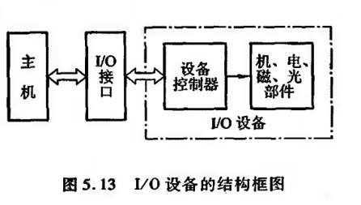

我的所有疑惑都来源于唐书上的这张图，让我以为IO接口和设备控制器是完全分离的两个东西，总结理解如下：

设备控制器就是 I/O 接口，只不过在不同学科中的叫法不同，在操作系统中称之为设备控制器，而[计算机组成原理](https://so.csdn.net/so/search?q=%E8%AE%A1%E7%AE%97%E6%9C%BA%E7%BB%84%E6%88%90%E5%8E%9F%E7%90%86&spm=1001.2101.3001.7020)中称之为接口。

一个设备控制器可以控制多台 I/O 设备，而每台 I/O 设备与 CPU 的连接都对应着一个 I/O 接口。 ，也就是说 IO 接口是一个偏概念的东西，是 CPU 和 某个外设 的数据交换接口，而设备控制器是实际存在的芯片，是实现 IO 接口的东西，可以连接多台 I/O 设备